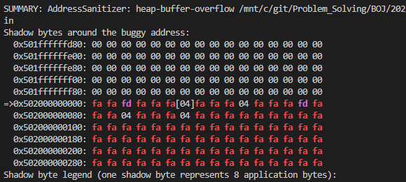

## 문제
2행 n열 배열이 주어진다. 그리고 한칸을 선택하면 그것과 상하좌우에 있는것은 선택하지 못하게 된다.

얻을수 있는 점수의 최대값은?


## 풀이

```cpp
#include<bits/stdc++.h>
#include<iostream>
using namespace std;

int main(){
    ios::sync_with_stdio(0);
    cin.tie(0);cout.tie(0);

    int c; cin>>c;
    while (c--)
    {
        int n; cin >> n;
        vector<vector<int>> v(2,vector<int>(n));
        for(int j=0;j<2;j++){            
            for(int i=0;i<n;i++){
                cin >> v[j][i];
            }
        }
        vector<vector<int>> dp(2,vector<int>(n,-1e9));
        dp[0][0] = v[0][0];
        dp[1][0] = v[1][0];

        dp[0][1] = v[0][1] + dp[1][0];
        dp[1][1] = v[1][1] + dp[0][0];

        for(int i=2;i<n;i++){
            dp[0][i] = v[0][i] + max(dp[1][i-1], dp[1][i-2]);
            dp[1][i] = v[1][i] + max(dp[0][i-1], dp[0][i-2]);
        }
        cout << max(dp[0][n-1],dp[1][n-1])<<"\n";
    }
}
```
제출하고 느낀건데 
```
dp[0][1] = v[0][1] + dp[1][0];
dp[1][1] = v[1][1] + dp[0][0];
```

n=1 일때는 이거 범위를 벗어나서 터지는게 맞는것 같은데, vector 할당시 약간 더 할당 받아서 그냥 답이 나온것으로 생각된다.

```
noir1@gram15sjm:/mnt/c/git/Problem_Solving/BOJ/2025/20251200$ g++ 9465.cpp -fsanitize=address -g -o 9465.cppp
noir1@gram15sjm:/mnt/c/git/Problem_Solving/BOJ/2025/20251200$ ./9465.cppp
1
1
10
10
=================================================================
==3035==ERROR: AddressSanitizer: heap-buffer-overflow on address 0x502000000034 at pc 0x5db47e2e3bf0 bp 0x7ffeb5fba400 sp 0x7ffeb5fba3f0
READ of size 4 at 0x502000000034 thread T0
    #0 0x5db47e2e3bef in main /mnt/c/git/Problem_Solving/BOJ/2025/20251200/9465.cpp:23
    #1 0x7b198ac2a1c9 in __libc_start_call_main ../sysdeps/nptl/libc_start_call_main.h:58
    #2 0x7b198ac2a28a in __libc_start_main_impl ../csu/libc-start.c:360
    #3 0x5db47e2e33e4 in _start (/mnt/c/git/Problem_Solving/BOJ/2025/20251200/9465.cppp+0x23e4) (BuildId: e4932ec5dfe68af166eb6283fddc22ae7cbc5f01)

0x502000000034 is located 0 bytes after 4-byte region [0x502000000030,0x502000000034)
allocated by thread T0 here:
    #0 0x7b198b4fe548 in operator new(unsigned long) ../../../../src/libsanitizer/asan/asan_new_delete.cpp:95
    #1 0x5db47e2e5d8b in std::__new_allocator<int>::allocate(unsigned long, void const*) /usr/include/c++/13/bits/new_allocator.h:151
    #2 0x5db47e2e59d2 in std::allocator_traits<std::allocator<int> >::allocate(std::allocator<int>&, unsigned long) /usr/include/c++/13/bits/alloc_traits.h:482
    #3 0x5db47e2e59d2 in std::_Vector_base<int, std::allocator<int> >::_M_allocate(unsigned long) /usr/include/c++/13/bits/stl_vector.h:381
    #4 0x5db47e2e53da in std::_Vector_base<int, std::allocator<int> >::_M_create_storage(unsigned long) /usr/include/c++/13/bits/stl_vector.h:398
    #5 0x5db47e2e4c34 in std::_Vector_base<int, std::allocator<int> >::_Vector_base(unsigned long, std::allocator<int> const&) /usr/include/c++/13/bits/stl_vector.h:335
    #6 0x5db47e2e629e in std::vector<int, std::allocator<int> >::vector(std::vector<int, std::allocator<int> > const&) /usr/include/c++/13/bits/stl_vector.h:603
    #7 0x5db47e2e60fa in void std::_Construct<std::vector<int, std::allocator<int> >, std::vector<int, std::allocator<int> > const&>(std::vector<int, std::allocator<int> >*, std::vector<int, std::allocator<int> > const&) /usr/include/c++/13/bits/stl_construct.h:119
    #8 0x5db47e2e5fee in std::vector<int, std::allocator<int> >* std::__do_uninit_fill_n<std::vector<int, std::allocator<int> >*, unsigned long, std::vector<int, std::allocator<int> > >(std::vector<int, std::allocator<int> >*, unsigned long, std::vector<int, std::allocator<int> > const&) /usr/include/c++/13/bits/stl_uninitialized.h:267
    #9 0x5db47e2e5cb5 in std::vector<int, std::allocator<int> >* std::__uninitialized_fill_n<false>::__uninit_fill_n<std::vector<int, std::allocator<int> >*, unsigned long, std::vector<int, std::allocator<int> > >(std::vector<int, std::allocator<int> >*, unsigned long, std::vector<int, std::allocator<int> > const&) /usr/include/c++/13/bits/stl_uninitialized.h:284
    #10 0x5db47e2e5b3f in std::vector<int, std::allocator<int> >* std::uninitialized_fill_n<std::vector<int, std::allocator<int> >*, unsigned long, std::vector<int, std::allocator<int> > >(std::vector<int, std::allocator<int> >*, unsigned long, std::vector<int, std::allocator<int> > const&) /usr/include/c++/13/bits/stl_uninitialized.h:327
    #11 0x5db47e2e588c in std::vector<int, std::allocator<int> >* std::__uninitialized_fill_n_a<std::vector<int, std::allocator<int> >*, unsigned long, std::vector<int, std::allocator<int> >, std::vector<int, std::allocator<int> > >(std::vector<int, std::allocator<int> >*, unsigned long, std::vector<int, std::allocator<int> > const&, std::allocator<std::vector<int, std::allocator<int> > >&) /usr/include/c++/13/bits/stl_uninitialized.h:472
    #12 0x5db47e2e50ca in std::vector<std::vector<int, std::allocator<int> >, std::allocator<std::vector<int, std::allocator<int> > > >::_M_fill_initialize(unsigned long, std::vector<int, std::allocator<int> > const&) /usr/include/c++/13/bits/stl_vector.h:1707
    #13 0x5db47e2e47a1 in std::vector<std::vector<int, std::allocator<int> >, std::allocator<std::vector<int, std::allocator<int> > > >::vector(unsigned long, std::vector<int, std::allocator<int> > const&, std::allocator<std::vector<int, std::allocator<int> > > const&) /usr/include/c++/13/bits/stl_vector.h:572
    #14 0x5db47e2e3732 in main /mnt/c/git/Problem_Solving/BOJ/2025/20251200/9465.cpp:13
    #15 0x7b198ac2a1c9 in __libc_start_call_main ../sysdeps/nptl/libc_start_call_main.h:58
    #16 0x7b198ac2a28a in __libc_start_main_impl ../csu/libc-start.c:360
    #17 0x5db47e2e33e4 in _start (/mnt/c/git/Problem_Solving/BOJ/2025/20251200/9465.cppp+0x23e4) (BuildId: e4932ec5dfe68af166eb6283fddc22ae7cbc5f01)

SUMMARY: AddressSanitizer: heap-buffer-overflow /mnt/c/git/Problem_Solving/BOJ/2025/20251200/9465.cpp:23 in main
Shadow bytes around the buggy address:
  0x501ffffffd80: 00 00 00 00 00 00 00 00 00 00 00 00 00 00 00 00
  0x501ffffffe00: 00 00 00 00 00 00 00 00 00 00 00 00 00 00 00 00
  0x501ffffffe80: 00 00 00 00 00 00 00 00 00 00 00 00 00 00 00 00
  0x501fffffff00: 00 00 00 00 00 00 00 00 00 00 00 00 00 00 00 00
  0x501fffffff80: 00 00 00 00 00 00 00 00 00 00 00 00 00 00 00 00
=>0x502000000000: fa fa fd fa fa fa[04]fa fa fa 04 fa fa fa fd fa
  0x502000000080: fa fa 04 fa fa fa 04 fa fa fa fa fa fa fa fa fa
  0x502000000100: fa fa fa fa fa fa fa fa fa fa fa fa fa fa fa fa
  0x502000000180: fa fa fa fa fa fa fa fa fa fa fa fa fa fa fa fa
  0x502000000200: fa fa fa fa fa fa fa fa fa fa fa fa fa fa fa fa
  0x502000000280: fa fa fa fa fa fa fa fa fa fa fa fa fa fa fa fa
Shadow byte legend (one shadow byte represents 8 application bytes):
  Addressable:           00
  Partially addressable: 01 02 03 04 05 06 07
  Heap left redzone:       fa
  Freed heap region:       fd
  Stack left redzone:      f1
  Stack mid redzone:       f2
  Stack right redzone:     f3
  Stack after return:      f5
  Stack use after scope:   f8
  Global redzone:          f9
  Global init order:       f6
  Poisoned by user:        f7
  Container overflow:      fc
  Array cookie:            ac
  Intra object redzone:    bb
  ASan internal:           fe
  Left alloca redzone:     ca
  Right alloca redzone:    cb
==3035==ABORTING
```



터졌다

이걸 피하려면 dp.at(0).at(1) 이렇게 접근하면 경계검사를 한다.

