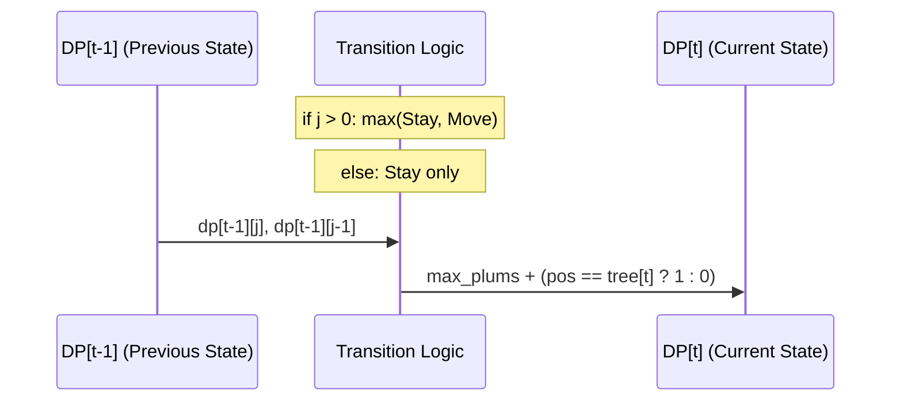

## 문제
이동횟수가 W로 제한되어있고, 시간 T 동안 떨어지는 자두 최대화하는 경로 탐색

- $ T \le 1000 , W \le 30 $ 

## 복잡도 분석
- 시간복잡도 O(T*W)
    - 1000 * 30 = 30000, 2초 제한 ok
- 공간복잡도 O(T*W)
    - 128MB 제한 문제 x

## 접근법

dp[t][j] 는 t초에 j번 이동했을 때 얻을 수 있는 최대 자두 개수이다.

- t-1에 j번 이동했을때 제자리에 있거나 (stay)
- (j>0 조건에서) t-1에 j-1번 이동했다가 현재 j번째 이동을 수행한 경우
- 현재 위치는 j%2==0?1:2 ,1번에서 시작

$dp[i][j] = max(dp[i-1][j],dp[i-1][j-1]) + (1 if 현재 위치가 자두 else 0)

## 풀이
```cpp
#include <bits/stdc++.h>
using namespace std;

using ll = long long;
using pii = pair<int, int>;
using pll = pair<ll, ll>;

const int INF = 1e9;
const ll LINF = 1e18;
const int MOD = 998244353; // or 1e9 + 7

#define rep(i, a, b) for (int i = (a); i < (b); ++i)
#define all(x) (x).begin(), (x).end()

int main() {
    ios::sync_with_stdio(0);
    cin.tie(0);

    int T,W; cin>>T>>W;
    vector<int> v(T+1);
    rep(i,1,T+1){
        cin>>v[i];
    }

    vector<vector<int>> dp(T+1,vector<int> (W+1));
    rep(i,1,T+1){
        rep(j,0,W+1){
            int pos = (j%2 == 0) ? 1:2;
            if (j>0){
                dp[i][j] = max(dp[i-1][j],dp[i-1][j-1]) + (pos==v[i]?1:0);
            } else {
                dp[i][j] = dp[i-1][j] + (pos==v[i]?1:0);
            }
        }
    }
    cout << *max_element(dp[T].begin(),dp[T].end());
    return 0;
}
```
생각해보니 마지막에 max_element(all(dp[T])) 이렇게 할수 있었네... 별로 중요한건 아니고

이동 횟수 홀짝을 이용해서 상태를 줄이고

j=0 은 한번도 움직이지 않고 시작 위치에서 가만히 있는걸 의미함. 이동해서 0번이 되는 건 없다. 그리고 예외처리 안하면 인덱스 오류

나한테는 어려운 문제였다.