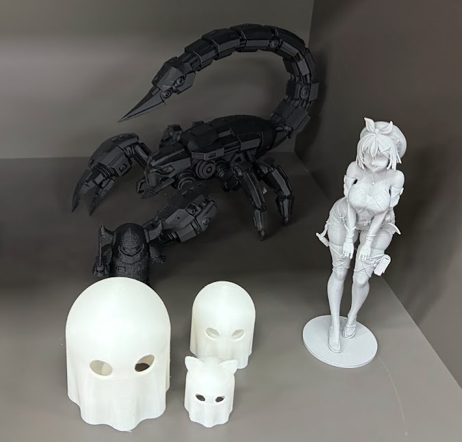
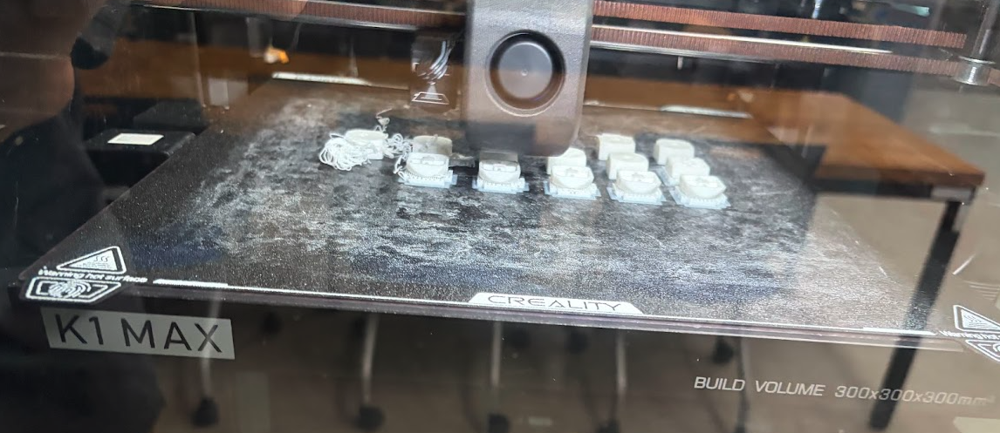
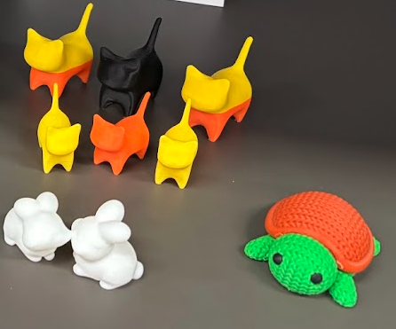

## 신청 계기

여름방학때 성남시 지방행정체험을 하게되었다. 이전에는 신청했다가 떨어지거나, 신청기간을 놓치거나 해서 못했었다. 다른 지역에 비해서 신청 기간이 짧고 일찍 신청을 받는것으로 알고있다. 인터넷에서 행정체험 관련 이야기를 처음 봤을때 신청해봐야겠다 생각은 했으나 4학년 방학때 하게된것은 아쉽게 생각한다.

다만 선발 과정에서 차상위나 다자녀 등 여러 단계의 기준을 두고 선발 우선순위를 두고 있는것으로 알고있고, 고학년을 먼저 선발하는것으로 알고있다. 실제로 교육중 다른 사람들의 생년월일을 얼핏 봤을때도 나랑 나이차가 크게 나지 않았던것을 보면 고학년을 더 뽑는것은 확실하고, 내가 일하던곳에서도 한명은 4학년 한명은 2학년이었다.

경쟁률은 알수 없으나 일의 강도가 낮다는 이야기가 돌아서 3:1, 4:1 정도의 경쟁률이 나오는것으로 알고있다. 어찌되었든 이번 여름방학때 하게 되었지만, 개인적으로는 저학년때부터 계속 신청을 해서 저학년때 경험해보는게 좋지 않을까 싶다. 고학년때는 가급적 인턴이나 전공 관련 활동으로...

## 업무

일했던 장소를 정확히 작성해두지는 않겠으나, 3D 프린터랑 다른 장비들을 갖추고 있는 복지관이었다. 내가 처음 가서 교육을 받을때는 장년층 대상으로 AI 교육(제미나이 프롬프트 작성해서 이미지 뽑아내기...)을 하고있었다. 첫날만 점심쯤에 가고, 이후에는 항상 오후-저녁 시간에 근무를 하게 되었다.

전체적인 일은 기기 관리, 3D프린터 예약한 사용자 응대, 교육 보조 이런 종류의 일이었고. 일을 하다가 한번 3D 프린터 사용 교육을 받았다. 교육 받고나서는 작은 문제 생기는건 대부분 어렵지 않게 해결할수 있었다. 일하는 시간은 평일 3시간이었는데 교육도 없고 장비 예약한 사람도 없어서 계속 혼자있는 날도 있었다. 개인 공부를 하려고 생각은 했는데 책상이나 환경이 깨끗하다는 느낌은 아니었고 학생들이 교육받는 태블릿이나 노트북 정리를 하고 나면 항상 손을 씻어야겠다는 생각이 들기도 했었고, Anki로 단어 돌려보거나 GPT로 개인적인 생각 떠오르는거나 정리할 일들 하면서 시간을 보냈다.

초반에는 담당자분이나 다른 일하시는 분이 와서 신경써주시는 때가 있기는 했는데 점점 시간이 지날수록 평온한 분위기에서 가끔 초등학생이나 중학생들이 교육받으러 오기도 하고, 비가 오는날 로비에서 고등학생들이 장소 빌려서 공연할때는 내가 있던 장소가 잠깐 대기실로 사용되기도 했었다.

업무 전반적으로 지루하다고 생각될 정도로... 그냥 정리하고 장비 문제있으면 이야기하고 이것저것 고쳐보고, 한번정도는 전체적인 노트북 재고 관리를 하거나 태블릿 업데이트하고 교육 전에 앱을 설치하거나, 다른 사람에게 맡겨졌던 일이지만 다른 교육용 소모품 재고 정리를 한다거나 이런 일도 있었다. 건물 내 포스터 부착도 2번정도 했었다.

내부에 미리 인쇄를 해둔 꽤 퀄리티가 높은 작품들도 있었는데, 교육에 사용되는 노트북 사양이 좋지 않아서 그런건지 아니면 학생들 대상으로 교육을 해서 그런지 퀄리티가 높은 결과물을 출력하는걸 많이 보지는 못했다. 대부분 저런 유령 느낌의 단순한것들 위주로 결과물이 나왔고. 결과물이 나오면 인쇄가 진행되는 보드에서 인쇄물을 떼어내고 인쇄 중에 나온 불필요한 부분을 니퍼로 잘라서 제거하면 저런식으로 모델링한것과 비슷한 느낌으로 결과물이 나온다.

이렇게 인쇄가 잘못 진행될때도 있다. 필라멘트가 녹아서 나오는 노즐 부분 확인하고, 여러번 정상 배출되는거 확인해도 저런식으로 허공에 인쇄를 해서 일부분이 잘못 나오는 경우가 꽤 많았다. 사진에서 플라스틱 선의 두께가 보이는데, 위에 사진에서 고퀄리티의 작품도 가까히서 보면 저런 두꼐의 플라스틱 결이 보인다. 엄청나게 고퀄리티의 플라스틱 작품을 찍어내는데는 부적합할수도 있어보이는데... 실제로 장비 예약해서 사용하는 사람들의 작품을 보면 장식품이나 필통 이런것을 꽤 괜찮은 퀄리티로 인쇄하는 사람도 있었고, 청소기 앞에 끼워서 쓰는 관이나 뭐 단순 소모품 이런것들도 인쇄해가는 사람도 있었다. 필요한 플라스틱 부품같은걸 인쇄하는 사람도 있었다.

사진에 보이는건 키캡인데, 몸통부분, 용수철 대신 쓰이는 플라스틱 부분, 원하는 내용이나 모양을 모델링한 키캡 부분을 인쇄해서 교육 받은 사람들이 찾아가기도 했다.

이런 장식물도 있었는데, 어쨌든 전반적으로 단순하면서 보기 좋은 작품들이 깔끔한것 같고. 필라멘트를 중간에 교체할수 없는 기기가 있어서 대부분 한가지로 인쇄된것이 많았다. 거북이의 경우에도 몸통과 등껍질을 따로 인쇄해서 접착제로 붙여놓은것으로 보인다. 가까히서 보이면 살짝 플라스틱 결의 거친 느낌이 있는데 멀리서 보면 꽤 괜찮게 보인다. 뒤집어보기도 했는데 속은 비어있고 인쇄 전에 어떤식으로 내부를 채워서 구조가 무너지지 않게 할지 설정하는게 모델링 프로그램에 있었다. 이게 용어가 있었는데 잊어버렸다.

## 마무리

교육이 끝나갈쯤에 성남하이테크밸리에 가서 3개 기업의 견학을 하기도 했다. 자생한방병원 한약 제조하는곳, 여의시스템, 아이지 이렇게 3개 기업이었고 나쁘지 않은 견학이었다. 대형 버스로 2팀이 견학했으니 80명 정도인가?

그리고 성남시청에서 재무 관련 교육과 청년정책 홍보 관련해서 전체 연수자가 모이는 시기가 있었다. 청년정책 홍보는 인쇄물과 동영상으로 그냥 간단히 진행했고, 재무 관련 교육은 재미도 있고 퀄리티도 꽤 좋았다. 200명이 모였는데 쉽고 잘 들어오는 이야기로 전체적으로 집중도가 높은 분위기였다. 

성남시의 경우 1회만 가능하다고 하는데 다른 지역은 어떤지 잘 모르겠다. 업무시간이 오후-저녁이라 공부하던 시간이 잘려나가긴 했는데, 일이 끝나고 항상 스터디카페에 와서 3시간정도 더 공부하려고 노력했다. 그래서 aws ccp랑 adsp 시험도 보기도 했고, 정수론도 강의를 하나 찾아서 다 보기도 하고...

그런데 8월 날씨가 너무 더웠어서 이동중에 항상 온몸이 땀 범벅이었다. 일하는 장소가 지하철에서 꽤 거리가 있었고, 사는 지역과도 생각보다 멀어서 힘들기도 했다. 나는 신청할때 희망 근무지 작성하는것을 업무 내용 위주로 생각해서 드론 관련 일과 3D 프린터 관련 일 이렇게 작성한것으로 기억하는데, 지금이라면 집에서 가까운 장소를 우선 선택했을것 같다. 일 끝나고 다시 공부하러 가는 길이 더 힘들었던것 같다. 작년보다 올해가 더 덥고 여러가지로 힘들다고 느꼈다.

개인적으로는... 이 시기에 학부연구생을 하거나 인턴을 하거나 그랬으면 좋았겠지만 여러가지 고민이 많은 상태에서 1학기를 보냈고, 그러다가 여러가지 시도를 하고 하나 얻어걸린게 이것뿐이라서 행정체험으로 여름방학을 마무리하게 되었다. 1학기 내내 스터디카페에서 지금 아니면 다시 자격증 공부에 시간 안쓰도록 어학이랑 기사 자격증이랑 여러가지로 공부하며 시간을 보냈고, 여름방학때도 흐름이 끊기지 않고 2학기를 대비한다는 생각이 있었는데 지금 돌이켜보면 잘 한것이 맞는지는 모르겠다.

다만 업무강도는 확실히 낮았고, 조금 심심하고 지루하다는 생각이 들기도 했어서 기분전환에는 확실히 도움이 되었고, 교육하시는 강사분들의 경우 전자공학과나 컴퓨터공학과 이쪽 분들이 있었어서 진로 관련해서 이런것도 있을수가 있겠구나 생각을 하게 되었다. 물론 3D프린터 기능사 교육 외에는 너무 지루하고 학생들 방과후에 시간 보내는 느낌의 교육이기는 했다. 복지관 안에 근처 학교 학생들이 꽤 많이 와서 시간을 보내는것으로 보인다.

관심이 있다면 저학년때부터 시기를 놓치지 말고 신청해서 저학년때 체험해보는게 좋을것으로 생각된다.