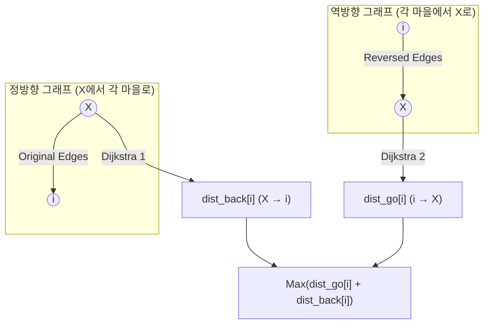

## 문제
**파티** [https://www.acmicpc.net/problem/1238](https://www.acmicpc.net/problem/1238)

$N$개의 마을에 사는 학생들이 $X$번 마을에 모여 파티를 연 후 다시 자기 마을로 돌아올 때, 각 학생의 '최단 왕복 시간' 중 가장 오래 걸리는 학생의 소요 시간을 구하는 문제입니다.

- $N \le 1,000$ / $M \le 10,000$
- 도로 가중치 $T \le 100$ (단방향)
- 시간 제한: 1초 / 메모리 제한: 128MB

## 복잡도 분석
- **Time Complexity**: $O(M \log N)$
    - 우선순위 큐를 이용한 다익스트라 알고리즘을 2회 수행합니다. 
    - 각각 $O(M \log N)$이며, $10,000 \times \log(1,000) \approx 10^5$ 정도로 1초 제한을 매우 여유롭게 통과합니다.
- **Space Complexity**: $O(N + M)$
    - 정방향/역방향 인접 리스트($2 \times M$)와 거리 배열($2 \times N$)을 사용하여 약 수 MB 정도의 메모리만 사용합니다.

## 접근법
핵심은 **'모든 정점에서 하나의 목적지(X)로 모이는 최단 거리'**를 어떻게 한 번에 구하느냐에 있습니다.

1. **오는 길 (X → i):** 정방향 그래프에서 $X$를 시작점으로 다익스트라를 돌립니다.
2. **가는 길 (i → X):** 모든 $i$에 대해 다익스트라를 $N$번 돌리는 것은 비효율적입니다. **간선 방향을 모두 뒤집은 역방향 그래프**를 생성한 뒤, $X$에서 다익스트라를 1회 돌리면 원래 그래프에서 $i \to X$로 가는 최단 거리를 모두 구할 수 있습니다.




## 풀이
```cpp
#include <bits/stdc++.h>
using namespace std;

struct Edge {
    int v, cost;
    // 우선순위 큐에서 최소 힙으로 동작하게 하기 위해 연산자 오버로딩
    bool operator<(const Edge& other) const {
        return cost > other.cost;
    }
};

int N, M, X;
vector<vector<Edge>> g1; // 정방향: X -> i (오는 길)
vector<vector<Edge>> g2; // 역방향: i -> X (가는 길)
vector<int> dist1;
vector<int> dist2;

void dijkstra(int start, vector<vector<Edge>> &g, vector<int> &dist) {
    priority_queue<Edge> pq;
    
    // [CRITICAL] 시작점의 거리는 반드시 0으로 초기화해야 합니다.
    dist[start] = 0; 
    pq.push({start, 0});

    while (!pq.empty()) {
        Edge curr = pq.top();
        pq.pop();

        if (dist[curr.v] < curr.cost) continue;

        for (const auto &next : g[curr.v]) {
            if (dist[next.v] > curr.cost + next.cost) {
                dist[next.v] = curr.cost + next.cost;
                pq.push({next.v, dist[next.v]});
            }
        }
    }
}

int main() {
    ios::sync_with_stdio(0);
    cin.tie(0);

    if (!(cin >> N >> M >> X)) return 0;

    g1.resize(N + 1);
    g2.resize(N + 1);
    dist1.assign(N + 1, 1e9);
    dist2.assign(N + 1, 1e9);

    for (int i = 0; i < M; i++) {
        int u, v, w;
        cin >> u >> v >> w;
        g1[u].push_back({v, w});
        g2[v].push_back({u, w});
    }

    dijkstra(X, g1, dist1); // X에서 각 마을로 가는 최단 거리 (Back)
    dijkstra(X, g2, dist2); // 각 마을에서 X로 오는 최단 거리 (Go)

    int max_time = 0;
    for (int i = 1; i <= N; i++) {
        // 경로가 없는 경우는 문제 조건상 배제되나, 안전하게 체크
        if (dist1[i] != 1e9 && dist2[i] != 1e9) {
            max_time = max(max_time, dist1[i] + dist2[i]);
        }
    }

    cout << max_time;

    return 0;
}
```

## Code Review
- **기점 초기화 누락 주의**: 다익스트라 함수 내 `dist[start] = 0;` 처리가 누락되면 모든 결과가 `INF`로 나오거나 엉뚱한 값이 계산됩니다. 시작점 설정은 다익스트라의 제1법칙입니다.
- **역방향 그래프 활용**: 'Many-to-One' 최단 거리를 'One-to-Many' 문제로 치환하는 역방향 그래프 테크닉은 $O(N \cdot M \log N)$을 $O(M \log N)$으로 줄여주는 핵심 아이디어입니다.
- **메모리 관리**: `vector::assign`을 사용하여 `resize`와 초기화를 동시에 처리하면 코드가 더 견고해집니다.
