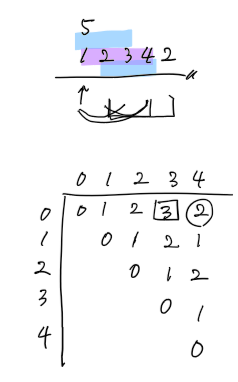
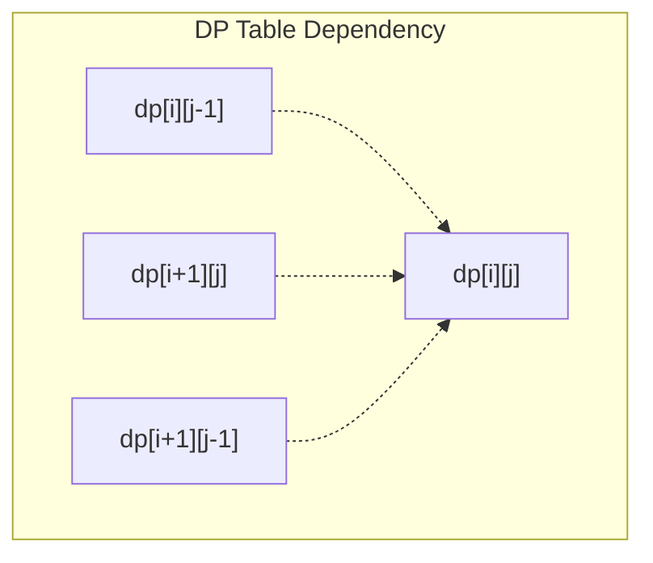

## 문제
[팰린드롬 만들기 (BOJ 1695)](https://www.acmicpc.net/problem/1695)

- 주어진 수열에 최소 개수의 숫자를 삽입하여 팰린드롬으로 만들기.
- 수열의 길이 $N \le 5,000$, 각 원소 $\le 10,000$.
- 시간 제한 2초, 메모리 제한 128MB.

## 복잡도 분석
- **Time Complexity**: $O(N^2)$
    - $N=5,000$일 때 중첩 반복문을 통해 약 $2,500$만 번의 연산을 수행하므로 2초 내에 충분히 통과 가능합니다.
- **Space Complexity**: $O(N^2)$
    - `int dp[5001][5001]` 배열은 약 $95.37$ MiB를 차지합니다. 문제의 제한인 128MB 내에 안정적으로 포함됩니다.

## 접근법
핵심은 **"현재 구간 $[i, j]$가 팰린드롬이 되기 위한 최적해는 하위 구간의 해로부터 도출된다"**는 점입니다.



### 1. 상태 정의
$dp[i][j]$를 수열의 $i$번째부터 $j$번째까지를 팰린드롬으로 만들기 위한 최소 삽입 횟수로 정의합니다.

### 2. 점화식
- **양 끝이 같을 때 ($v[i] == v[j]$):**
    - $dp[i][j] = dp[i+1][j-1]$ (추가 비용 없음)
- **양 끝이 다를 때 ($v[i] \neq v[j]$):**
    - 왼쪽에 $v[j]$와 같은 값을 삽입: $1 + dp[i][j-1]$
    - 오른쪽에 $v[i]$와 같은 값을 삽입: $1 + dp[i+1][j]$
    - $dp[i][j] = \min(dp[i][j-1], dp[i+1][j]) + 1$

### 3. 계산 순서 (Dependency)
`dp[i][j]`를 구하기 위해서는 아래(`i+1`)와 왼쪽(`j-1`)의 정보가 필요하므로, `j`는 증가하고 `i`는 감소하는 순서로 채워야 합니다.



## 풀이
```cpp
#include <bits/stdc++.h>
using namespace std;

int dp[5001][5001];

int main() {
    ios::sync_with_stdio(0);
    cin.tie(0);

    int N; cin >> N;
    vector<int> v;
    for(int i = 0; i < N; i++) {
        int x; cin >> x;
        v.push_back(x);
    }

    // j는 오른쪽으로, i는 왼쪽(아래)에서 위로 올라오며 채움
    for(int j = 1; j < N; j++) {
        for(int i = j - 1; i >= 0; i--) {
            if (v[i] == v[j]) {
                dp[i][j] = dp[i + 1][j - 1];
            } else {
                dp[i][j] = min(dp[i + 1][j], dp[i][j - 1]) + 1;
            }
        }
    }

    cout << dp[0][N - 1];

    return 0;
}
```
비슷한걸 봐서 잘 풀었음
