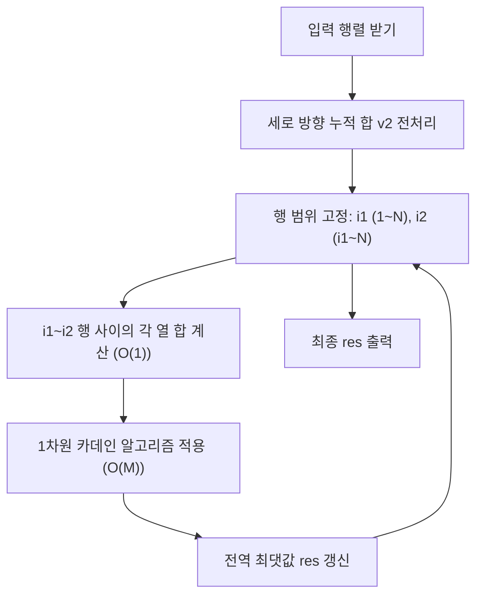

## 문제
[점수따기](https://www.acmicpc.net/problem/1749)
- $N \times M$ 행렬에서 합이 최대가 되는 부분 행렬(연속된 행과 열의 집합)의 합을 구하는 문제입니다.
- $1 \le N, M \le 200$, 원소의 값은 $-10,000 \sim 10,000$ 범위의 정수입니다.

## 복잡도 분석
- time complexity : $O(N^2 M)$
    - 행의 상단($i1$)과 하단($i2$)을 결정하는 모든 조합을 확인하는 데 $O(N^2)$이 소요됩니다.
    - 각 행 조합 내부에서 열 방향으로 순회하며 카데인 알고리즘을 적용하는 데 $O(M)$이 소요되어 총 $O(N^2 M)$입니다. $200^3 = 8,000,000$으로 시간 제한 2초 내에 충분합니다.
- space complexity : $O(NM)$
    - $N+1 \times M+1$ 크기의 2차원 누적합 배열을 생성하여 데이터를 저장하므로 약 $200^2 \times 4$ Byte의 공간이 필요합니다.

## 접근법
1. **차원 축소**: 2차원 배열의 모든 부분 행렬을 찾는 브루트 포스($O(N^4)$)를 피하기 위해, 행의 범위를 고정하여 문제를 1차원 배열의 최대 연속 부분 합 문제로 변환합니다.
2. **전처리**: 세로 방향의 누적 합을 미리 구해두면, 고정된 행 범위 $[i1, i2]$ 내의 특정 열 합을 $O(1)$ 만에 계산할 수 있습니다.
3. **카데인 알고리즘**: 압축된 1차원 배열에 카데인 알고리즘을 적용하여, 이전까지의 합이 현재 원소에 도움이 되지 않는(음수인) 경우 새로 시작하는 방식으로 $O(M)$에 최댓값을 도출합니다.



**핵심 아이디어:** 2차원 누적 합 전처리를 통해 행렬을 1차원으로 압축하고, DP 기반의 카데인 알고리즘을 결합하여 시간 복잡도를 한 차원 낮춘 것(Dimension Reduction)

## 풀이
```cpp
#include <bits/stdc++.h>
using namespace std;

using ll = long long;

int main() {
    ios::sync_with_stdio(0);
    cin.tie(0);

    int N,M;cin>>N>>M;
    vector<vector<int>> v(N+1,vector<int> (M+1));
    for(int i=1;i<N+1;i++){
        for(int j=1;j<M+1;j++){
            cin >> v[i][j];
        }
    }

    vector<vector<int>> v2(N+1,vector<int> (M+1)); // 세로 열로 누적합
    for(int i=1;i<N+1;i++){
        for(int j=1;j<M+1;j++){
                v2[i][j] = v2[i-1][j] + v[i][j];
        }
    }

    ll res = -2e18;
    for(int i1=1;i1<N+1;i1++){
        for(int i2=i1;i2<N+1;i2++){
            ll local_sum = 0;
            
            for(int j=1;j<M+1;j++){
                int val = v2[i2][j] - v2[i1-1][j];
                local_sum = max((ll)val, val+local_sum);
                res = max(res,local_sum);
            }
        }
    }
    cout << res;
    return 0;
}
```
받자마자 바로 누적합 계산도 가능한듯?
