## 3주차1st ch13-14

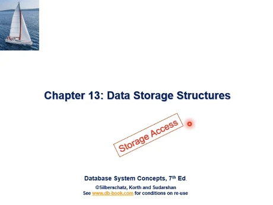

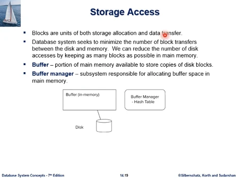  
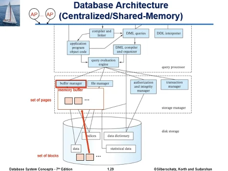

- 데이터베이스 스토리지에 대한 접근은 블록단위로, 디스크IO에 의해 이루어진다. 블록은 스토리지 할당과 데이터 전송 단위이다.
- db 시스템은 block transfer 횟수를 최소화하는 것을 추구한다(성능의 병목). 어떻게 하면 디스크IO를 줄일수 있는가? 메인메모리에 최대한 보유하고 있으면 된다.
- Application이 db에 블록을 접근할때는 먼저 버퍼에 원하는게 있는지 먼저 찾는다.(버퍼 - db일부분을 cache) 있다면 cache hit이고, 많다면 io 수가 줄어든다. 없다면 io를 해야한다
- Buffer manager는 버퍼공간을 할당하고 관리한다, 버퍼는 금방 가득찬다. 디스크 블록을 불러와도 자리가 없다. 기존 페이지를 내보내야 한다(페이지 교체) 이 기준을 담당

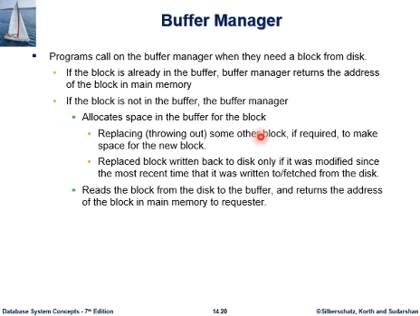  
Buffer manager가 수행하는 일

- 응용프로그램이 디스크의 블록을 요청하게 되면
- 버퍼매니저는 먼저 그 블록이 디스크에 올라와있는지 체크하고(cache hit인가)
- 맞다면 그 블록의 주소를 넘겨주어 접근하게 된다
- cache miss 라면 버퍼 매니저는 그 블록을 디스크에서 버퍼로 불러와서 응용이 사용할 수 있게 주소를 알려줘야 한다.
  - 그 전에 블록을 읽어오려면 버퍼에 공간을 마련해야 한다.
  - 항상 버퍼는 공간이 가득 차있다고 볼 수 있다.
  - 이미 있던 블록을 선택해서 내보내야 하고 버퍼 교체 알고리즘이 victim을 선택한다
  - 그런데 희생자로 선택된 블록이 버퍼에서 그동안 업데이트를 가지고 있다면, 그냥 버리지 말고 디스크로 IO하여 반영해야 한다.
  - 처음 디스크에서 그 블록이 fetch 되어서 버퍼에 올라온 이래로 update 되엇거나 그 블록이 버퍼에 올라와서 update 되었던 것이 디스크로 쓰여지고도 남아있을수 있는데, 남아있는데 또 새로운 업데이트 발생시, 교체될때 디스크에 반영되어야 한다.

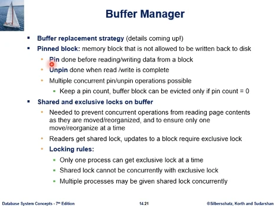  
버퍼매니저가 갖추고 있어야 할 기능

- 버퍼 교체 알고리즘, 자세한건 뒤에서 설명

데이터베이스는 공유자원이다. 모든 db접근은 버퍼를 공유해야 한다. 그러다보니 제한된 메모리 자원인 버퍼도 경쟁 대상이고 공유자원이다. 그래서 동시에 여러 프로그램이 버퍼공간을 접근할때 발생할 수 있는 잘못된 시나리오 고려해야 한다.

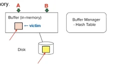  
예를 들어서 버퍼공간에 있는걸 읽어서 업데이트 도중, 교체되어 다른걸 읽거나 다른게 들어와서 잘못된 곳에 업데이트가 반영될수 있다.(A와 B간의 동시성 문제, 동시성 제어 필요)

- 동시성 제어 관점에서 필요한 연산
  - pin : app가 버퍼의 어떤 페이지를 읽거나 수정하기 위해서 접근하려면 먼저 pin 연산을 해야 한다(특정 페이지를 버퍼 내에 고정시키겠다). pin 되어있으면 페이지 교체 대상에서 면제된다.
  - unpin : R/W 완료시 고정을 풀어주는

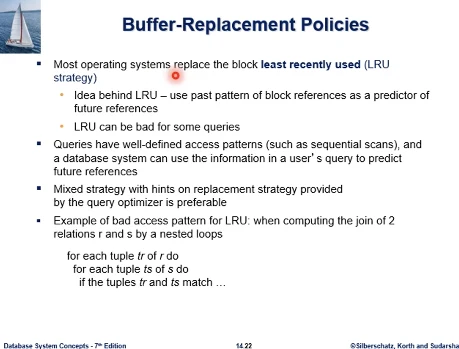  
버퍼 교체

- 대부분 OS에서 가상메모리 페이지교체 알고리즘으로 LRU를 쓰고있다.
  - 최근에 access 했던 data가 working set에 포함되어 있어서 또 접근될 가능성이 높다, locality of reference
  - 그런데 LRU는 DB환경에선 좋지 않다.

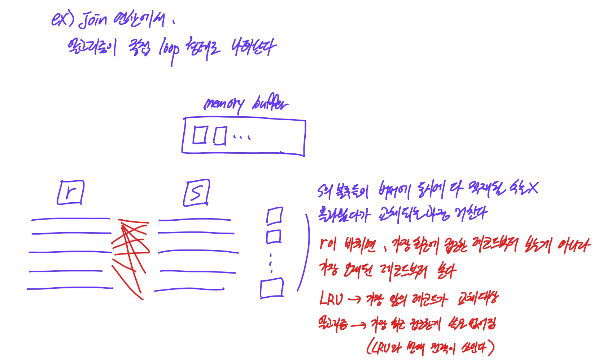  
join 연산에서 알고리즘이 중첩 loop 형태로 나타난다. 버퍼에 블록들이 다 적재될수가 없고, 루프 구조상 가장 오래된 레코드부터 보게된다. 가장 최근 접근한게 쓸모 없어지므로 LRU와 반대전략이 쓰여야 한다.

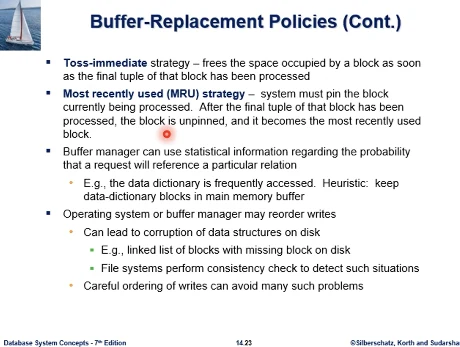  
그래서 데이터베이스 버퍼 매니저는 아래와 Toss-immediate, MRU와 같은 방법을 쓴다.

- Toss immdiate : 어떤 블록의 접근을 하게되면 마지막 튜플의 접근이 끝나자마자 그 블록이 차지하던 버퍼공간을 비워준다. (다 쓰면 한동안 안볼것이란 판단)
- MRU : 가장 최근에 접근한것을 희생자로 선택하여 교체

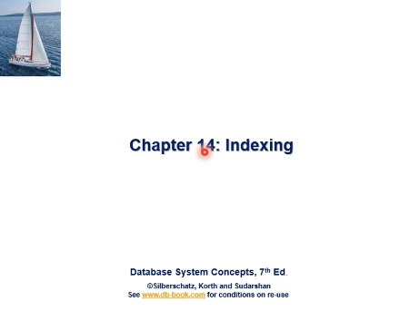  
14장  
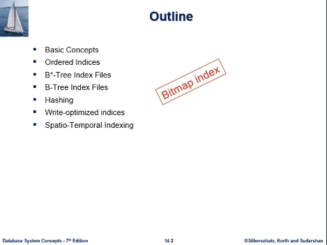  
목차 + bitmap 인덱스까지 공부한다

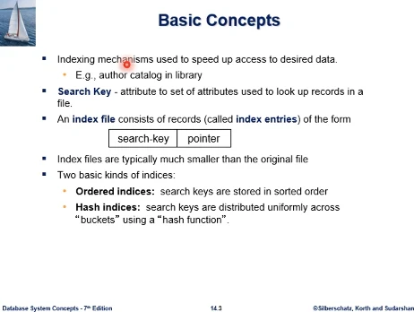  
기본개념.

- 인덱싱은 원하는 데이터의 검색속도를 향상시키기 위한 메커니즘이다. DB는 대용량이고 sql 검색시 성능향상 위해서 핈 사용한다.
- Search key : 레코드를 빨리 탐색하기 위해 인덱스를 만든 컬럼으로, 컬럼 1개나 합성일수도 있다. key와 마찬가지
- 인덱스 파일은 인덱스 엔트리의 집합이다. (search key + pointer)의 집합
- 인덱스 파일은 원본 데이터 파일보다 작다. 탐색시간이 적고, 검색 성능향상의 요인이다.
- 인덱스에는 두가지 기본 종류가 있다.
  - ordered index - B+tree같은것. 인덱스 파일 내에서 search key가 정렬되어 있다
  - hashed inxed - 인덱스 파일 내에서 정렬이 아님, 인덱스 엔트리를 hash function 이용하여 여러 버킷에 분산시킨다.

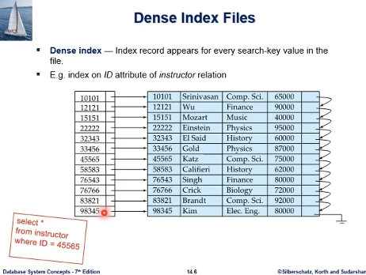  
id 컬럼에 대해 인덱스가 생성된 모습. 인덱스가 없다면 순차파일을 따라서 순차검색하여 레코드 검색해야 한다.  
인덱스가 배열처럼 그려져 있는데, 포인터가 파일에 어디에 가면 레코드가 있다는것을 가리켜줘서 접근할수 있게 한다.  
데이터파일 용량 대비 인덱스 파일은 작다. 따라서 파일에서 직접 레코드를 검색하는것보다 인덱스 파일에서 찾는게 빠르다.  
실제 DB 시스템은 배열이 아닌 b+tree 구성을 보통 사용한다.

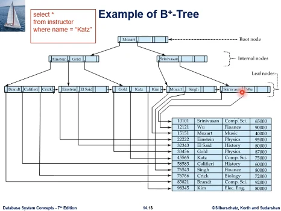  
b+tree 인덱스는 앞 슬라이드에서 배열처럼 되어있던 부분이 트리 형태를 띄고 있다. 이건 교수 이름 칼럼에 대해 만든것이다.  
binary search tree와 같은 탐색트리가 된다.  
우리가 아는 이진탐색트리는 메인메모리에 전체가 적재되는 자료구조이다. 반면 이것은 데이터베이스 환경으로, 인덱스와 파일 모두 크기가 크다. 뒤에서 공부함.
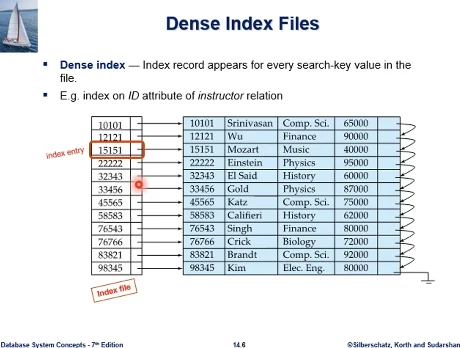  
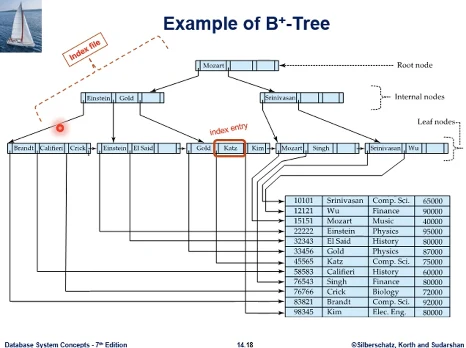  
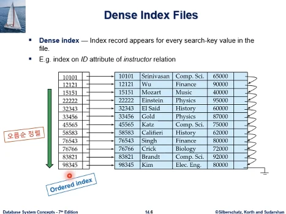  
우측 데이터파일도 인덱스를 생성한 ID에 대해 오름차순 되어있는데, 그렇지 않을 수도 있다.  
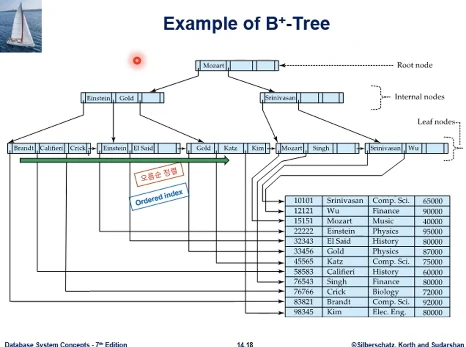  
b+tree가 ordered index이다.  
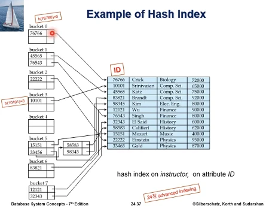  
hash index 참고용으로 보기

## 3주차2nd ch14

### 연습문제

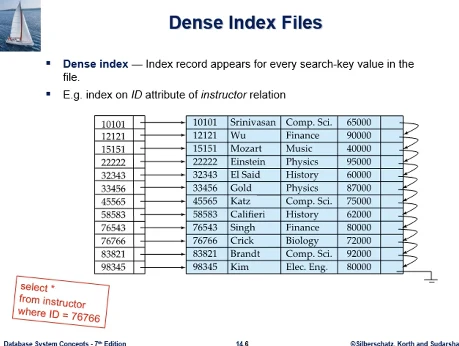  
문제1 : 검색하기 위해 필요한 io 횟수는? 결과 튜플은 저장하지 않는다고 가정, blocking factor = 2라고 하자. 인덱스 파일의 BF = 6.  
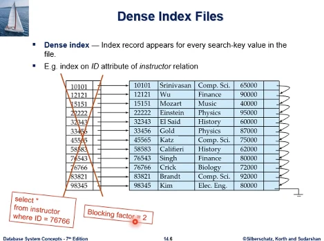  
인덱스를 통해서 검색성능이 얼마나 향상되는가 궁금하다. 먼저 인덱스가 없다고 해보자.  
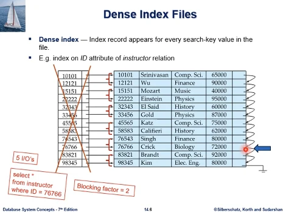  
그러면 답은 5번의 IO가 된다. 첫 레코드부터 순차 접근하여 찾아야 한다.  
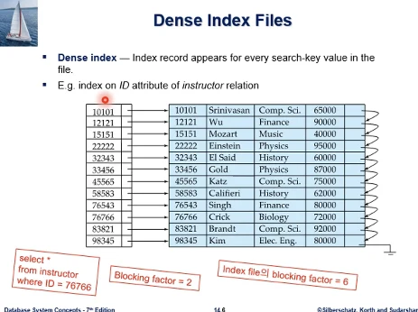  
인덱스가 그림처럼 존재하고 index file의 blocking factor = 6이라고 하자.  
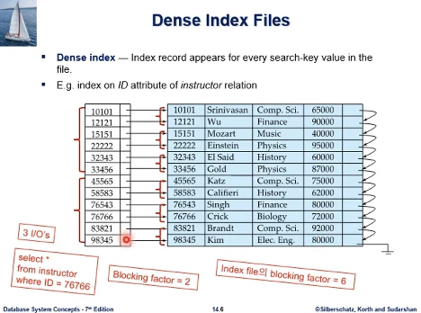  
인덱스 자체도 파일에 저장된다. 인덱스 파일에 bf가 있어야함. 인덱스 엔트리 크기는 해당 레코드 크기보다 아주 작다. BF값은 데이터 파일의 BF보다 훨씬 큰 값이 되어야 한다.  
답은 3번의 IO이다. 예시가 작아서 차이가 크지 않으나. 실제 데이터베이스 환경이라면 블록수가 더 많고 인덱스 여부에 따라서 IO수 차이는 더 크게 난다.

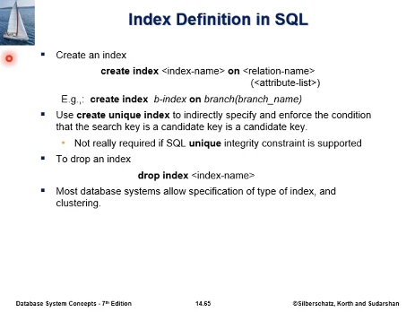  
14장 뒷부분 내용인데 당겨서 공부함.  
create index dept_salary_idx on instructor(dept_name,salary)
자주 사용하는 조건들에 대해 index 를 그냥 만들면 효율적이지 않을 수도 있다. (index 구성과 작동원리 이해가 필요) 특히 합성키에 대한 이해도가 필요  
인덱스가 성능을 향상시키지만 시스템 내 부담있다. 구문은 간단하지만 기술에 대한 이해가 필요하다.
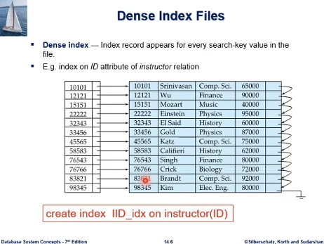  
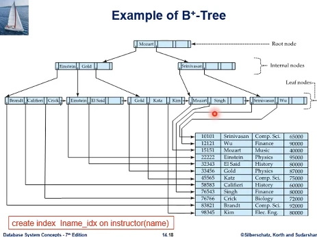  
생성문 예시

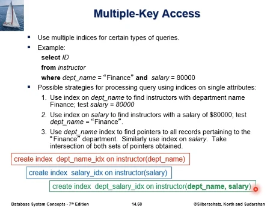  
합성 키에 대한 인덱스 예시  
where절에 검색조건이 and가 들어가면서 복잡해질수 있다.

- 학과 이름에 대한 인덱스를 만들어서 검색후 그 레코드들 중 급여로 필터링
- 급여에 대한 인덱스를 만들어서 검색후 학과에 대해 필터링
- 둘다에 대한 인덱스를 만들어서 학과 결과에 대한 레코드 포인터, 급여 결과에 대한 레코드 포인터의 교집합을 한다.
- 합성키에 대한 인덱스를 만드는 또 다른, 슬라이드에 없는 방법으로, 합성 키에 대한 인덱스를 만드는 방법이 있다. (컬럼이 여러개) 질의가 원하는 바를 바로 검색이 가능한 방식

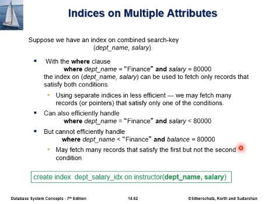  
그런데 이런 합성키 인덱스를 만들었지만. 등호 2개인 경우에는 도움이 되지만, where절 앞부분 조건이 부등호인 경우 도움이 되지 않을수도 있다.  
나중에 자세히 설명한다. 인덱스를 설정할때는 구성과 작동원리 이해가 필요, 합성키에 대한 이해도.  
인덱스가 성능을 향상시키지만 시스템에 부담주는 측면도 있다.

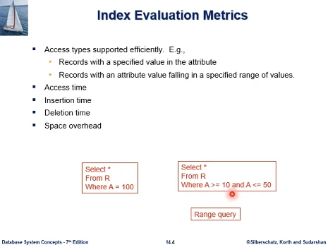  
인덱스의 평가 기준

- 검색성능이 얼마나 향상되는가? 인덱스가 아래 2개중 1만?2만?둘다? 잘 지원하는지 평가

  - 특정값 -> 해당 레코드 찾기
  - col값의 범위 -> 해당 레코드 찾기. 이러한 유형의 질의를 얼마나 잘 지원하는지

- 삽입과 삭제시간의 경우, db 업데이트 할때 인덱스는 그것에 맞추어서 update, maintanance 하는 부담 발생되므로 고려되어야 한다.
- 공간 오버헤드 - DB용량 크므로 인덱스 용량도 크게된다

ordered index는 인덱스 엔트리가 search key로 정렬되어 있다. 이전에 자세히 설명했음.  
인덱스의 형태가 clustered, nonclustered인가가 중요하다. 성능에 큰 차이를 보인다.  
용어정리를 먼저 하면 clustered(primary index) vs nonclustered(secondary) 우리말로 집중인덱스 vs 비집중 인덱스 로 부른다.

- clustered : ordered index 자체가 search key 값으로 정렬된다고 했었는데, 데이터 파일의 레코드 자체도 같은 search key, col값으로 정렬되어 있을때

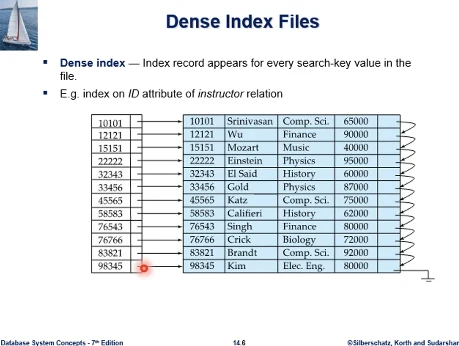  
교수 테이블의 레코드들이 id값 오름차순으로 정렬되어 있다. 이 데이터 파일에 대해 생성한 인덱스가 좌측인데, ordered index 이므로 search key이므로 어짜피 정렬이 된다. 그런데 데이터 파일이 꼭 id값으로 정렬되지 않을수도 있다. 이 예제는 정렬되어 있음  
성능에 큰 의미를 갖는 요소로 작용

- nonclustered : 인덱스의 정렬 순서와 데이터 파일의 레코드 정렬 순서가 다르다. 데이터파일은 정렬 안될수도 있다.

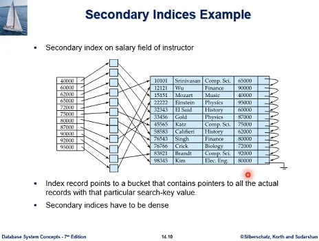  
예시를 보면 인덱스가 급여에 대해 만들어져있다. 인덱스 자체가 ordered index 이므로 인덱스는 정렬되어 있다. 그러나 레코드는 급여에 대해서는 정렬되어 있지 않다.  
예제는 id와 다르게 급여가 고유식별자가 아니라서 중복되는 레코드들이 있을수 있고, 80000 급여 레코드를 찾을때 여러개가 있게되어 bucket에 2자리가 있게 된다. 중간단계가 필요하게 된다. 새로운 레코드가 40000이 들어오거나 업데이트되면 지금은 한자리만 있던게 두자리가 될수도 있다.

집중 vs 비집중 정리해보면  
인덱스 자체는 search key 값으로 정렬되어 있다 ordered key에서.

- 인덱스가 가리키는 레코드 파일이 같은 기준으로 정렬되어 있다 -> 집중 (레코드들이 search key 기준으로 모여있는가, 레코드가 정렬되어 있으면 같은 값 가진 레코드가 디스크 같은 블록에 모일거니까)
- 정렬되어있지 않다 -> 비집중 (비집중이면 같은 값 가진 레코드가 디스크에서 여러 블록에 흩어지게 된다. 성능에 큰 영향)

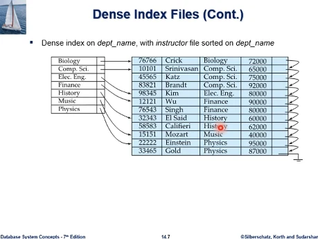  
이런 예를 보면 clustering 의 의미가 더 보인다. 위의 예제와 다르게 PK가 아닌 col에 인덱스를 만들었다.  
레코드가 여러개 있는데 하나만 가리키고 있다.  
학과 이름으로 정렬되어 있는데, 레코드도 그렇다. 그러다보니 Comp.sci 레코드가 여러개 있어도 모여있게 된다. 디스크상에 물리적으로 인접한 블록에 clustered 되어 모여서 들어가게 된다.  
집중 인덱스이므로 bucket도 필요없다. 학과 이름이 고유식별자가 아니더라도 clustered 되어있어서 첫번째만 가리켜주면 모여있다.

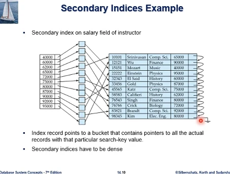  
이 예제를 보면 급여 80000이 다른 블록에 떨어져 있다. clustered 되어있지 않다.  
그래서 비 집중이므로 bucket도 필요했던 것이다.

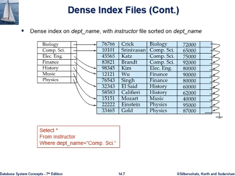  
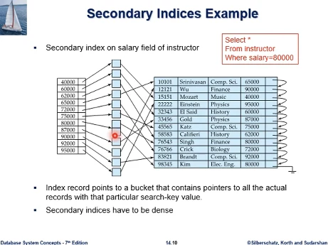  
집중과 비집중의 성능차이를 정리해보면. Comp.sci레코드를 찾으라고 하면. 디스크에 접근 seek time과 같은 작업을 조금만 해도 원하는 데이터가 같은 블록에 clustered 되어 있기 때문에 disk io를 조금만 해도 원하는 질의 결과를 얻을 수 있다.  
비집중의 경우에는 레코드 하나 꺼낼때마다 disk io를 해야한다(최악의 경우) 이런식으로 검색 성능에 현저한 차이를 가져오게 된다.

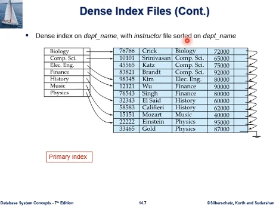  
교재 설명에 primary index 라고 해서, 이 용어가 PK에 대해서 만든 인덱스인가? 라고 하면 꼭 그렇지는 않다. 집중인덱스의 의미이다. 보다시피 학과는 PK가 아니지만 집중인덱스이다.

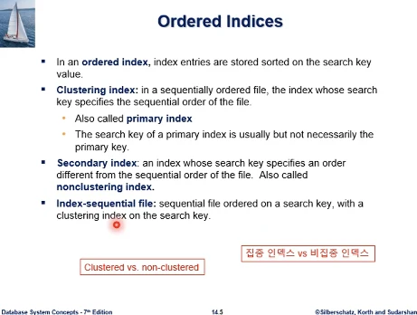  
마지막에 인덱스 된 순차파일이라는 용어가 나오는데, sequential 파일인데 집중인덱스가 탐색키에 대해서 설정되어 있는 경우이다.  
바로 위에 학과 인덱스에 대해서 집중 인덱스를 만들어놓은 경우가 된다.  
인덱스된 순차파일이라는 의미가 인덱스가 원하는 레코드를 항상 직접 가리켜주지는 않는다. 인덱스가 첫 지점을 가리켜주면 순차 접근에 의해서 원하는 레코드를 찾아간다는 의미이다.  
순차파일 접근방식과 인덱스 접근방식을 혼용하는 방식, 이것을 하려면 인덱스가 집중인덱스여야 한다.

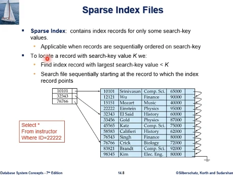  
인덱스된 순차파일의 모습  
22222를 찾으려면 10101-32343사이, 10101을 타고 파일에서 순차접근한다.  
이 파일구조의 의미는 레코드 수가 굉장히 많다는 것이다. 그런데 등장하는 키 값으로 전부 인덱스 엔트리를 만들면 인덱스 파일도 너무 커지므로, 그래서 인덱스 크기를 줄이고 일부는 순차접근으로 해결하자는 것이다.

최종 정리하면 인덱스가 집중 vs 비집중은 데이터베이스에서 인덱스를 활용할때 가장 중요한 내용중 하나다. 성능에 아주 큰 차이를 내는 요소다.

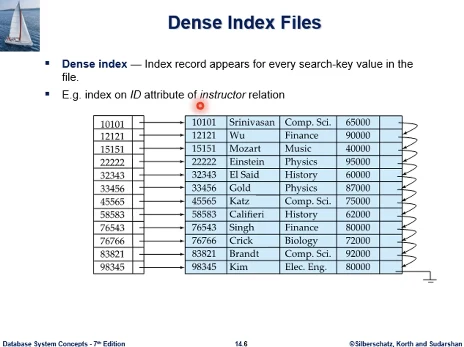  
dense index : 밀도가 높다. 데이터베이스의 탐색키 값이 인덱스 엔트리로 다 직접 존재한다.

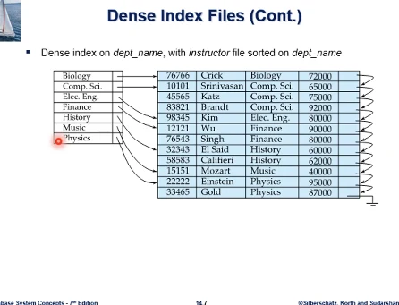  
dense index가 꼭 레코드 수만큼 엔트리가 있어야 하는것은 아니다. 인덱스가 고유식별자에 대한것이 아닐수도 있으므로, 단 학과 이름은 전부 인덱스 엔트리로 올라왔다.

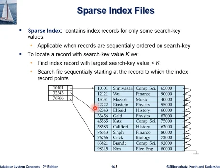  
sparse index : search key 값이 전부 인덱스 엔트리에 올라오지 않는다. dense 하게 만들면 너무 인덱스 크기가 커진다. 일부 값만 인덱스 엔트리로 올린다.  
이걸 하려면 기본 전제가 집중 인덱스여야 한다. 그래야 검색이 가능.  
search key가 K다 라고 할때, 엔트리가 바로 가리켜주지 않는다. K보다 작으면서 최대값인걸 찾아서 그 다음부터는 sequentially 레코드를 접근해서 찾아나간다.

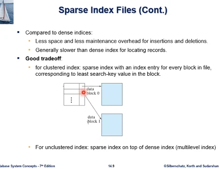

- sparse index는 dense index보다 공간을 적게 차지하고, db update 대한 maintenance 부담이 적다.
- 대신 부분적 순차접근을 요구하므로 검색성능이 떨어진다.

그림은 블록의 레코드들이 정렬되어있을때 sparse한 집중 인덱스를 만드는 방식으로, 블록에서 가장 작은값을 엔트리로 가져와서 만들게 된다.

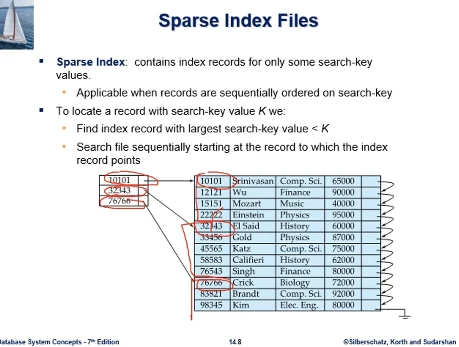  
이전 예제에서 그 방식을 생각해보면, 위처럼 구성할수 있다는 것이다.

## 3주차3rd ch14

### 연습문제

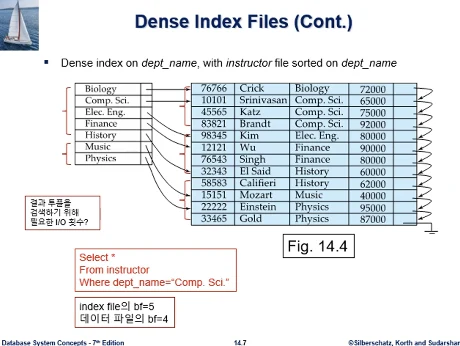  
문제1 : 인덱스파일의 BF, 데이터 파일의 BF를 알면 구할수 있다. 인덱스 파일의 BF=5, 데이터 파일의 BF = 4. 질의결과는 저장 안한다고 가정  
답 : 3 IO's, 인덱스 1회, 레코드 포인터를 쫓아서 2회, Comp.sci 레코드 3개를 보고, 질의 처리 과정중 다음 링크 포인터가 또 Comp.sci인줄 모른다. 그 다음 블록도 읽어야 한다.  
문제1-2 : data 파일 BF = 5라면?  
답 : 2번이 된다. 끝에 E-.Eng가 나오므로 더이상 Comp.sci가 없다는걸 알게된다.

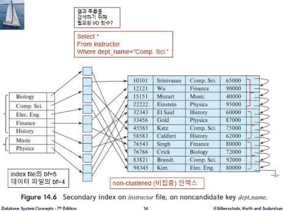  
학과명에 대해 인덱스를 만들었는데, dept_name이 고유식별자(noncandidate key)가 아니라서, 중간 bucket이 있다.  
학과로 정렬되어 있지 않으므로 비집중 인덱스의 케이스이다.  
문제2 : bucket쪽에 발생하는 블록IO는 단순하게 한블록이라고 가정한다.  
답 : 5 IO's, 인덱스에서 1번, 버킷에서 2번째, 레코드에서 3번째, 또 다른 레코드포인터에서 4번째, 또 다른 레코드포인터에서 5번째  
문제2-2: 데이터파일 BF=5라면?  
답 : 그래도 5 IO's, 버킷에서 가리키는 포인터를 따라서 3개 블록을 다 읽어야 한다. 여전히 io 수가 같다.

비집중을 통한 5번의 io수는 앞서 집중인덱스를 사용한 3번보다 많은 횟수이다. 집중인덱스에서 BF=5라면 2번으로 줄어든다. 집중인덱스와 비집중인덱스의 검색 성능차이를 보여주는 예시이다.

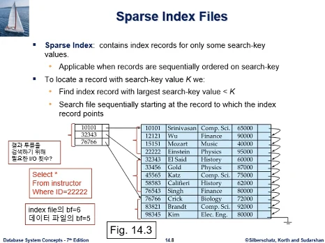  
문제3 : 데이터파일에서는 한 블록에 5개 레코드까지 들어가므로 위에서부터 4,5,3개 들어가있다.  
답 : 총 2번의 IO, 인덱스블록에서 한번, 데이터파일 한번이다. id 칼럼이 PK, 고유식별자이므로 더이상 다른 레코드가 있을수가 없다. 순차탐색의 포인터를 따라갈 필요가 없다. 찾고 끝난다.

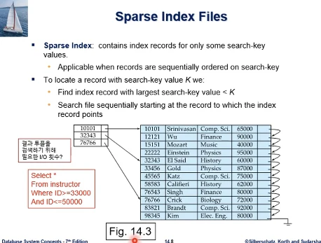  
문제4 : 질의문에 range가 주어졌다.  
답 : 2 IO's, 범위를 구성하는 33000-50000값이 두번째 블록에 다 모여있다. 그래서 인덱스 블록 한번, 범위 시작값 한번. 원하는 값이 블록 안에 다 있으므로 종료

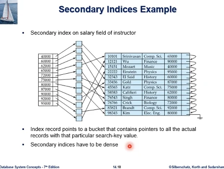  
비 집중 인덱스는 반드시 dense 한 인덱스여야 한다. sparse 하다면 부분적인 순차접근에 의해서 레코드 검색을 할 수가 없다. sparse 하다면 부분적인 순차접근에 의해 레코드 검색을 할 수가 없다. search key 값이 모두 등재되어야 함.

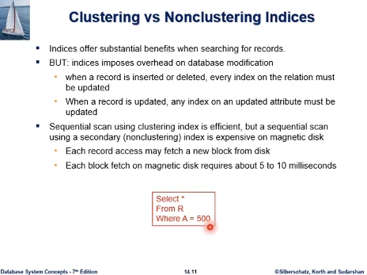  
인덱스가 집중 vs 비집중 정리  
인덱스가 검색성능을 향상시키지만 db 업데이트, 칼럼값 수정, 레코드 삽입삭제에 부담이 든다.

- 집중 인덱스는 원하는 레코드가 clustered 되어 있으므로 disk IO 줄어든다.
- 비집중은 그렇지 않다.

예를 들어 테이블 R의 col A의 인덱스가 만들어져 있는데, 위와같은 질의가 주어졌다고 하자.  
만약 이 인덱스가 집중인덱스라고 하면 A=500 블록이 같은 블록에 모여있다. 해당 블록에 대한 IO를 하면 조건 충족하는 레코드가 여러개 있으므로, 전체적으로 블록IO를 조금만 하고 질의처리 수행가능.  
반면 비집중 인덱스라면, A=500 인덱스가 전체 파일에 흩어져있게 된다. 그래서 최악의 경우 A=500레코드가 각각이 서로 다른 블록에 있을 수 있다. 레코드 하나 접근할때마다 블록 IO를 해야한다. 질의처리 시간이 길어진다.

  
DB 용량이 크다는 전제, 인덱스 용량도 커질수가 있다. 인덱스가 메인메모리 버퍼에 적재가 되면 검색에 도움이 되겠지만 인덱스도 크다.  
인덱스 접근하는데도 IO가 발생해서 검색 성능을 최대한 높이지 못하는 문제가 있게 되면 인덱스에 대한 인덱스를 만드는 것이다.

  
인덱스 자체를 data로 간주하고 그 위에 sparse 한 인덱스를 만드는 방식, outer index도 메모리에 적재가 안된다면 상단에 또 인덱스를 생성할 수 있다.

인덱스는 삽입과 삭제에 따른 maintenance 부담이 있다.

  
멀티 레벨 인덱스로서 db 시스템에서 널리 사용되는것이 b+tree인덱스이다.
순차파일이나 인덱스된 순차파일을 쓸떄, 시간이 흐름에 따라 파일크기가 커지고 오버플로우 블록들이 생겨나면서 성능저하를 가져오게 된다. 주기적으로 필요에 의해 파일 전체를 재구성해야 한다는 단점이 있다.

- b+인덱스를 사용하면 생기는 장점. db테이블에 대한 레코드 삽입 삭제에 대해서 인덱스 자체가 유지가 될때 그 부담 자체를 국소화 시킬수 있다. 적은 부담으로 파일 자체를 재구성하는 특성을 갖는다. 파일 전체를 재구성할 필요가 없이 좋은 성능을 담보할 수 있다.

그렇다고 삽입 삭제에 대한 유지부담이 전혀 없는것은 아니고, 인덱스가 차지하는 공간부담을 고려해야 한다. 장단점을 비교할때 장점이 많아서 db시스템에서 인덱스로 널리 쓴다.

  
교수 테이블의 교수 이름에 대해 생성한 인덱스이고, 루트노드에 리프노드로 구성된 탐색트리이다.  
앞부분이 포인터, 뒷부분이 search key로 엔트리가 구성된다.  
b+Tree는 탐색시 항상 leaf노드까지 도달하게 된다.  
이것은 디스크에 저장되는 트리로, 각각의 노드가 디스크의 한 블록이 된다. 그래서 노드에 접근한다는것은 io를 통해서 노드를 메모리 버퍼로 불러온다는 것이고, 포인터가 디스크 어디 블록에 노드가 있는지 알려주는 것이다.

Katz 교수 레코드 검색에 IO가 몇번 발생하는가? 루트, 왼쪽, gold의 오른쪽, 레코드 뽑기 위해서 한번. 그래서 4번이 된다. 이 4번의 횟수는 b+tree의 높이 + 1이다.

  
b+tree가 탐색트리라고 했는데, 조건을 충족해야 한다.

- 루트노드에서 리프노드에 이르는 모든 경로의 길이가 같다. 위 예제에서 레벨은 3, 모든 leaf가 있다. 일종의 balanced tree로 leaf 노드가 모두 같은 레벨에 존재한다.
- b+tree의 노드는 공간 사용 효율이 50%이상은 되어야 한다. 각 노드의 50%이상이 데이터가 차 있어야 한다. space requirement, 각 노드 50% 이상 full (root는 제외)
- 루트나 리프가 아닌 노드는 자식노드가 ceil(n/2) - n개의 노드를 가져야 한다. n은 각 노드가 가질 수 있는 자식노드 수의 최대 수를 말함. 자식 노드 수가 최소한 반은 된다는 것이다. 리프노드는 자식이 없으므로 예외이고, 루트노드는 공간 요건에서 루트가 면제이므로 제외한다.
- 리프노드는 자식은 없지만 데이터파일의 레코드를 가리키게 된다. 총 n-1개의 탐색키 값이 들어갈 수가 있는데, 그것의 반 이상은 가득차야 한다. ceil((n-1)/2) - (n-1)

  
n=4인 예제인데, 이것은 각 노드가 가질수 있는 자식수 max값을 말한다.  
공간사용 효율이 자식이 있다면 ceil(n/2)-n 으로 최소 2개 자식이 있어야 한다. 루트는 요건 면제.  
리프노드는 ceil((n-1)/2) - (n-1) 인데, (-1)의 의미는, 각 노드가 n개 자식을 가지므로 사이사이 들어가는 search key 값은 (n-1)개가 된다. 리프노드도 최대 3개. 그것의 절반은 되어야 한다. non leaf, leaf가 50%이상의 공간사용효율을 보여야 한다.

  
b+Tree가 디스크 기반 트리이고, 노드크기가 블록크기이다. 실제로는 n값이 200,300 이렇게 큰 값이다.

- 루트는 공간사용 요건을 면제한다고 했는데, leaf가 아닌 한 자식은 2개는 되어야 한다. search key 값이 하나는 있어서 왼쪽 오른쪽은 있어야 한다는것.
- 데이터 파일이 크지 않을 경우는 b+Tree에 루트만 있을수도 있다. 그렇게 되면 자식노드가 없는것이고 레코드만 가리키는 search key value만 있는데 그 개수는 n-1개 이다.

  
b+tree노드 구성. K로 구성된것이 키값이고, 전후로 포인터가 있다.  
search key 값은 max n-1개이고 오름차순 정렬되어있다.  
포인터는 이 노드가 자식이 있는 non leaf라면 자식노드 포인터가 되고, 리프 노드라면 레코드를 가리키는 포인터가 된다.

  
n=4예제에서 리프노드의 구조이다.  
리프노드는 n-1개의 키가 있다고 했었다.  
포인터는 탐색키 앞부분이 해당 레코드를 가리키는 것이다. 앞의 남는자리는 다음 leaf노드를 가리킨다.  
  
b+tree가 ordered index 이므로 리프노드의 키값도 오름순 정렬됨. 이 포인터가 정렬 순서상 다음 노드를 가리키는것이다.  
L_i, L_j가 leaf 노드인데 L_i의 search key 값들이 L_j의 search key값보다 작다. 리프노드의 키값들이 오름차순 정렬되어 있으니까 각 리프노드 다른 노드의 키값들도 정렬되어 있는것.(뒤쪽 노드 키값이 더 크거나 같다)

  
non leaf 노드에 대한 설명  
non leaf 노드는 leaf node 상단에서 multi level sparse index를 구성한다. 자식노드 수가 m개면 공간요건 충족때문에 ceil(n/2) and n 사이 값을 말함

  
탐색키가 K1보다 작을때 왼쪽으로 가고  
  
탐색키가 K\_(n-1)보다 크거나 같을때 가장 오른쪽으로 간다.
  
중간 부분은 왼쪽 K1보다 크거나 같고, K2보다 작을때 그때 P2로 간다

- 작을때 왼쪽, 크거나 같을때 오른쪽으로 간다

  
b+tree를 이해할때 non leaf노드를 볼때, 항상 키값보다 자식 포인터수가 1개 더 많다. 키값과 자식 포인터를 쌍을 지으면 키값이 하나 남게 된다. 그래서 동작원리를 이해할때, 맨 왼쪽을 고립시키고 키값과 우측을 쌍을 지어서 인덱스 엔트리라고 이해하면 삽입, 삭제연산 이해에 도움이 된다.

  
n=6 예제 이해

- n은 nonleaf가 자식노드를 몇개까지 가능한지 숫자이다.
- 두가지 기본요건, 균형트리이다. 리프노드가 모두 같은레벨
- 공간요건, 각 노드가 50%이상 공간사용, 단 루트만 면제
- leaf 경우에는 n=6이므로 탐색키가 5개까지 들어간다. 예제에서 3-5개 들어가야 한다.
- nonleaf 경우에는 3-6개 자식을 가져야 한다.
- root는 최소 자식 2개만 있으면 된다.
