## 6주차1st ch14

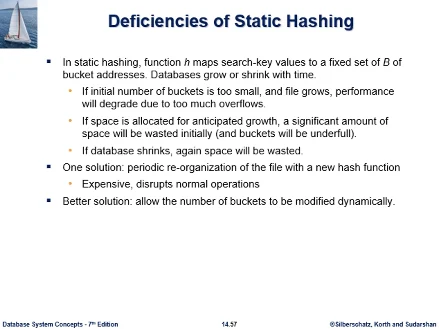  
static hashing에 대해 공부했었다. 정적 해싱에 대해 문제가 되는것은, 데이터베이스 환경은 계속 성장하거나 수축한다. 시간이 흐름에 따라 레코드가 삽입 삭제되면서 파일크기가 변한다.  
이런 변화에 해싱 기법이 공간 사용 효율 측면에서 잘 적응하지 못하는 문제가 있을수도 있다.

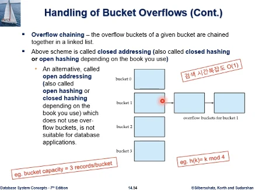
예를들어서 그림처럼 해쉬함수가 k mod 4로 4개 버킷을 가지고 저장할수 있게 시작해서, 버킷용량 3으로 모두 12개 저장하는걸로 충분하다고 생각했던것에서, 계속해서 삽입이 일어나면 공간이 부족하게 되고, 삭제가 일어나면 처음에 너무 많이 일어나게 된다.  
삽입의 경우 chaining으로 해결이 된다. 그러나 문제가 있다. 해싱의 장점은 검색시 시간복잡도가 O(1) 인, 파일크기에 무관하게 검색시간이 일정시간이 걸리는 장점이 있는데, chaining이 자꾸 일어나게 되면 더이상 O(1)이 일어나지 않게 된다. 버킷 엑세스 횟수가 1.0으로 upperbound 되지 못하고 초과하게 된다.

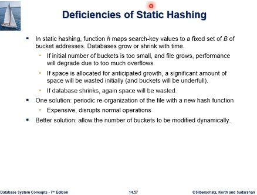  
버킷 공간을 아낄려고 너무 적게 할당했는데 삽입이 너무 자주 일어나서 파일이 성장하게 되면, 오버플로우가 너무 많이 생겨서 검색성능이 저하된다.  
그러나 처음에 너무 공간을 많이 할당시에는 공간이 낭비된다. 특히 초기에는 많이 낭비되고, 예측보다 파일이 커지지 않는다면 공간낭비가 심해진다. 운영의 변화에 따라 많이 삭제되어도 공간이 낭비된다.

이런 문제점으로 동적인 해싱을 쓰게된다. 하단의 better solution이라는 것은 동적인 해싱 기법을 의미하고. 동적으로 해쉬파일 구조 자체가 레코드수의 증감에 반응하는 구조로 가야한다.

기본적인 해법으로는 전체 해쉬파일을 처음부터 재구성하는 것이 있다.  
처음에 해쉬파일을 구성했을때는 오버플로우체인도 없고 빈공간도 많은 상황인데, 삽입이 자꾸 되고 버킷에 오버플로우 체인이 걸려서 검색성능이 저하되면, 전체를 다시 새로운 해쉬함수를 가지고 버킷수를 현 상황에 맞게 조정해서 레코드들을 해쉬함수에 따라 재배치 하게 된다. (re-organization)

DB의 파일 구조가 모두 재구성 이슈가 있다. 처음 파일 구성시에는 모든게 깔끔하다(검색성능, 공간사용효율 좋음) 이것이 시간이 흐름에 따라 성능이 저하되는데 재구성이 필요하게 된다. b+tree index에서도 rebuild라는것이 있었다. 인덱스를 만들어서 질의성능을 하다가 점차 시간이 흐름에 따라 성능이 떨어지는 현상이 벌어질 수 있다. 그런데 전체를 재구성하는것은 비용이 너무 높다. 파일사이즈가 너무 크다. 그리고 재구성중에는 질의처리같은 연산이 멈추기때문에 문제가 있다.  
그래서 better solution은 정적 해싱이 아닌 동적 해싱이다.

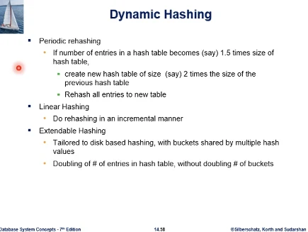  
해쉬파일 재구성과 동적 해싱을 정리하고 있다.  
재구성은 주기적으로 할수도 있고, 기준을 정해서 할수도 있다. 버킷에 들어있는 데이터크기가 기존의 1.5배쯤에 도달하면 전체 해쉬테이블의 크기를 기존의 2배짜리로 새로 해쉬함수를 정의하여 모든 레코드들을 새로 저장한다. 이것은 비용이 높다.  
동적 해싱은 이런 과정이 아닌 삽입 삭제가 일어내는 순간마다 해결해가는 파일구조이다.  
많은 기법이 있으나.

- 선형 해싱
- 확장성 해싱
  위와 같은것이 있다. 이 기법은 그 자체로 하나의 새로운 topic이 된다. 이부분은 14장에서는 언급만 함

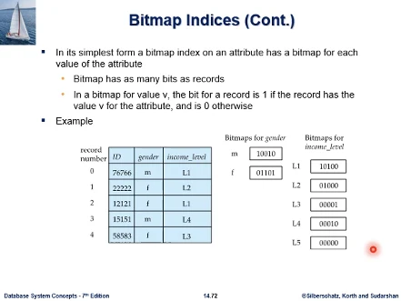  
특수한 형태의 인덱스로 Bitmap Index라는게 있다. 위와 같은 테이블이 있다고 할때 성별과 income_level이라는 col 이 보인다. income_level은 income 값의 범위에 따라서 여러 레벨로 나눈것인데 L1 - L5 같은 식으로 나누어져 있다.  
Bitmap Index라는 것은 기본적으로 bit 벡터이다. 현재 레코드가 0-4번까지 5개의 레코드가 있는데 이 bitmap 인덱스는 5개 비트짜리 벡터가 된다.  
그래서 성별 col에 대해서 인덱스르 만들면, 성별 col에 나타나는 값은 m,f 두종류 뿐이다. m 값에 대해서 5비트가 나타나고, f 값에서도 5비트가 나타난다. (m값에 대한 비트맵 인덱스 값은 - 0번 레코드부터 4번 레코드까지 값이 m이면 1 아니면 0 이런식으로 벡터가 나온다)  
income_level 에 대한 col에 대해서도 비트맵인덱스를 생성했는데, 컬럼에 등장할수 있는 서로다른 레벨값이 5종류 이므로 5개가 나왔다. 그래서 L1 (10100) 이런식으로 나온것이다.

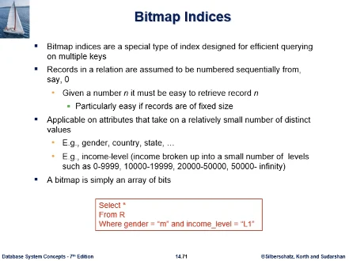  
정리를 해보면 특수한 형태의 인덱스이다. 테이블의 복수개의 col에 대한 질의처리를 돕기에 효율적인 인덱스다. 아래의 질의처럼 where절의 gender, income_level 처럼 여러 col에 대한 질의처리를 돕기에 효율적이다.  
전제는 파일 테이블의 레코드들이 0번부터 시작해서 n-1번까지 n개의 레코드가 번호를 주면, 해당 레코드를 효율적으로 검색해낼수 있는 저장체계가 뒷받침이 되어야 비트맵 인덱스를 쓴다. 예제 테이블 오른쪽에 record number 번호가 있었는데, 번호가 주어지면 해당 레코드를 빨리 찾을수 있게 파일이 organized 되어 있어야 비트맵 인덱스를 효율적으로 쓸 수 있다.  
비트맵 인덱스를 적용하는 응용의 특징은, 이 테이블의 비트맵 인덱스를 만드는 칼럼의 등장할수 있는 서로 다른 값의(distinct value) 개수가 그렇게 많지 않다. 대표적으로 성별과 같은 col이 있다. 성별의 경우 m, f 2개뿐이다. 학년이라면 1,2,3,4 이렇게 4개뿐이다. 예제에서는 나라와 주, income_level(범위에 따라서 5개 레벨로 나눈 형태) 이와 같이 칼럼에 등장할수 있는 서로 다른 값 개수가 적은 경우  
비트맵은 기본적으로 비트 벡터이다.

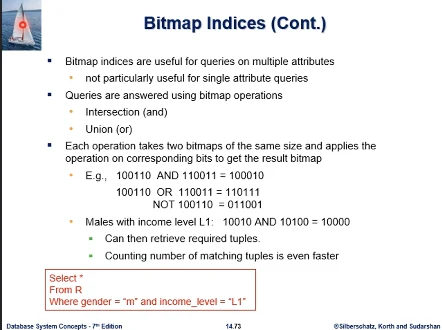  
비트맵 인덱스를 효율적으로 쓰는 질의는 여러 attribute에 대한 질의라고 했다. 특정 한 컬럼에만 질의의 조건이 있다면 그렇게 효용성이 높지 않다.  
왜 그런가? 조건 1에 대한 비트 벡터 (100110), 조건2 (110011) 만약 and 조건이라면 비트연산 and한것이 뽑히게 된다. 결과는 (100010) 인데, 1에 해당하는 레코드가 답이 된다(0,4번), 이전에 번호를 주면 테이블 파일에서 해당 레코드를 쉽게 접근할수 있다고 이야기 했었다.  
슬라이드에 비트맵 연산 관련 예제가 있다.  
질의에서 male, L1 조건인 질의를 보면 (10010) and (10100) = (10000) 0번 레코드만이 질의조건을 충족하고 있는것을 확인할 수 있다.

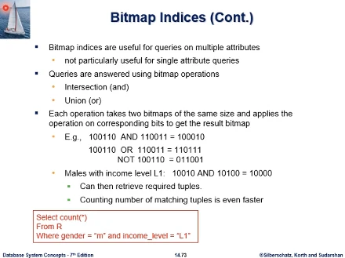  
또 비트맵 인덱스가 효율적으로 지원 가능한 것은, sql 집계함수중 count가 있었다. count가 들어가는 질의의 경우에는 비트연산 결과에서 1 비트인 수를 세면 된다.

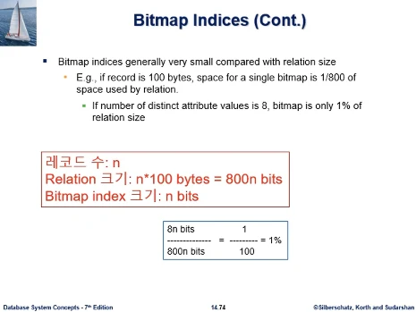  
비트맵 인덱스의 장점은 차지하는 공간이 굉장히 작다. 인덱스 대상 테이블 크기와 비교하면 더 그렇다. 테이블 레코드 1개가 100바이트라면 비트맵 인덱스 1개는 1/800의 공간이다.  
레코드하나가 100바이트면, n개 레코드라고 가정시 릴레이션, 테이블의 크기는 800n 비트가 된다.  
그러면 비트맵 인덱스 크기는 얼마가 되는가? 레코드가 n 개면 비트맵 인덱스는 n 비트가 된다, 벡터 길이가 레코드 수만큼으로 결정된다. 그래서 1/800이 된다.  
그래서 만약 비트맵 인덱스를 생성하는 컬럼의 서로 다른값이 8종류(성별의 경우 2개)라고 하면, n 비트짜리 비트맵 인덱스가 8개 나오게 된다. 그래서 n비트짜리가 8개 생기니까 8n비트가 된다. 그래서 1% 차지한다는 계산이 나온다.

### 연습문제

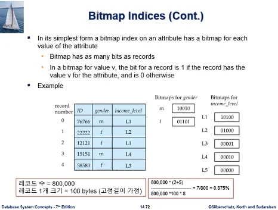  
예제에서 테이블사이즈 대비 비트맵 인덱스가 차지하는 공간의 비율은? 다만 그림이 너무 작으므로 레코드 수를 80만개로 늘리고, 1레코드의 크기는 100바이트로 해서 생각해보자. 각 레코드는 모두 고정길이라고 가정한다.  
답은 식을 풀어서 구하게 된다. 최종은 0.875%.  
분모를 보면 80만은 레코드수, 100은 각 레코드길이, 8은 단위를 비트로 바꾼것.  
분자는 비트맵 인덱스가 차지하는 크기를구한것. 80만은 레코드수인데 비트맵 인덱스의 비트 길이가 레코드수와 동일하다. (bitmap has as many bits as records) 거기에 (2+5) 곱한것은 성별 칼럼에는 비트맵이 2개가 있고, income_level에 대해서는 모두 5개의 비트맵이 있다. 그래서 총 7개가 80만 비트짜리 비트맵이 있다. 분모는 전체 테이블 크기이고 분자는 비트맵 인덱스의 크기이다.

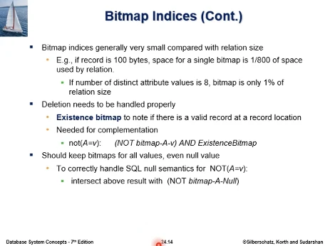

테이블에 레코드가 삽입삭제가 될땐데 그때마다 어떻게 maintanance할지 생각해보면. 삭제는 3번 레코드가 삭제되었다고 하면. 3번에 해당하는 비트들이 의미가 없어지게 된다. 5비트짜리를 4비트짜리로 바꿔야만 정확하게 맞지만 그런 처리가 부담스러우므로 그냥 내버려 둔다. 3번에 해당하는 비트 자체가 무의미 하다는것을 Existence bitmap이라는걸 써서 나타낸다.  
비트가 1이면 레코드가 있는거고 0이면 삭제되고 없는것이다. 이것은 24장 슬라이드이다.

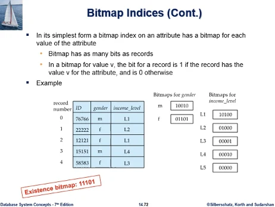  
3번 레코드가 삭제되었다면 (11101) 이 된다.

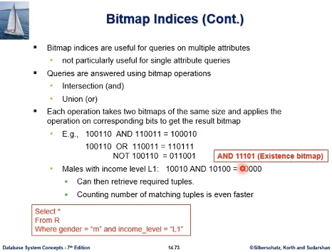  
그래서 질의를 처리할때 비트맵 인덱스를 and 연산하여 0번 레코드만 해당된다고 검색할때, 0번 레코드가 삭제안되고 남아있는지 의문이다. 그래서 결과에 다시 Existence bitmap에 다시한번 and 연산을 한다. 이 연산 이후의 결과가 1이라면 정말 존재하는것이 된다.

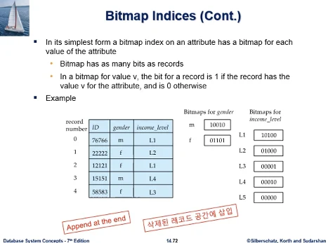  
레코드 삽입은 어떻게 할까? 삽입시 이전의 일부를 밀치고 넣는다면 비트맵 인덱스의 내용이 무너지게 된다. 그러므로 맨 뒤에 append 하거나 삭제되었던 레코드 공간에 삽입하면 된다.

## 6주차2nd ch15

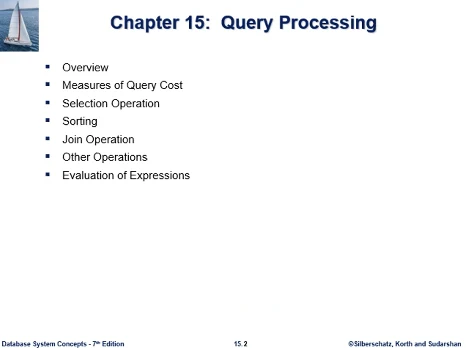  
15장 질의처리. Query Processing

- 개요
- 질의처리 비용 모델 정의
- select, join, 집계함수, 집합연산 처리
- sorting, 데이터베이스 환경이므로 외부정렬이다(external sorting), 정렬대상 데이터를 메모리버퍼에 전체 적재할수가 없다. 외부정렬은 join이나 다른 여러 연산의 한 요소로서 사용되게 된다.

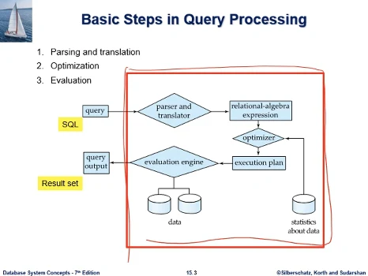  
RDB의 표준 질의어는 SQL이다. SQL로 질의를 하면 적색 박스로 표시된 DBMS의 질의처리 과정을 거쳐서 질의 결과가 나온다. 이것을 Result set 라고 한다.

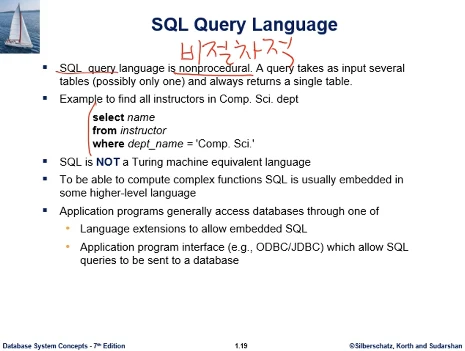  
교재 1장의 슬라이드이다.  
sql을 처음 소개하는 대목이다. 이와 같은 질의를 표현하는 sql 질의어가 비 절차적이다.(nonprocedural)

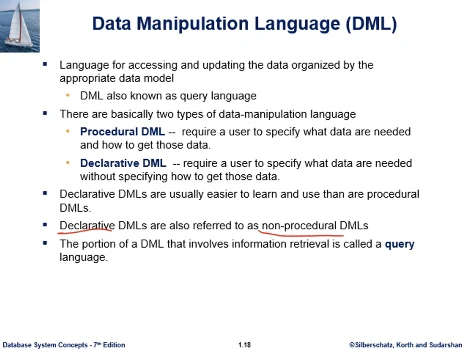  
sql이 비 절차적인 질의어라는것은 선언적인 질의어 라는것이다.  
이 선언적 declarative 이라는게 무슨 의미인가? 사용자가 어떤 데이터를 검색하고 싶은지를 명시하는것이지, 그 결과를 어떻게 어떤 절차로 얻어내라고 하는것은 명시하지 않는다. without specifying

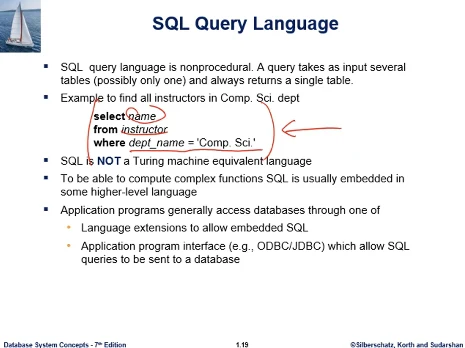  
예시를 보면 알수있듯이, 원하는 데이터만 명시를 했지 어떤 절차로 도출하라는 지시는 sql 언어상에 표현되고 있지 않다.

이 박스 내에서 비 절차적으로, 선언적으로 질의가 주어질때 그 결과를 얻기위한 절차를 마련하는 기술이 붉은 상자 내에서 필요하다. 15장에서는 그런 질의처리 방법에 대해 공부한다.

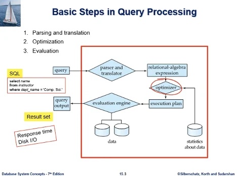  
사용자가 이와같은 질의를 던질때, 자신의 질의결과가 빨리 제공되기를 원할것이다. Response time, 빠른 응답시간이 요구되는것, 그러려면 DB시스템의 성능의 병목이 disk IO라고 했는데 이것을 조금만 하면서 원하는 질의결과를 산출할 수 있어야 한다.
그래서 이 DBMS의 질의처리기는 그러한 효율적인 방법을 찾아내야 한다. 일반적인 질의가 주어지면 그걸 찾아내는 방법은 여러가지가 존재한다. 그중 가장 최적의 방법을 찾는것이 질의최적화 기술이다. optimization  
박스 안에 optimizer라는 모듈이 보인다. 이것이 질의최적화를 수행하는 모듈이다.  
16장에서 query optimization 을 공부하게 된다.

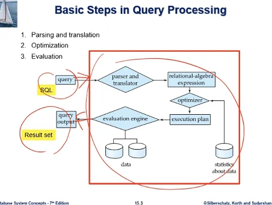
질의가 주어져서 그 결과가 산출되기까지 질의처리기 내에서 어떤 작업이 수행되는가?

1. parser and translator
   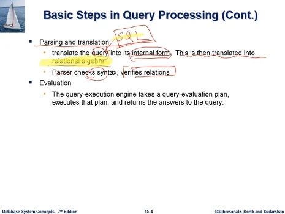

- sql도 하나의 언어이므로 파싱과정을 거치고, dbms 내부적으로 사용하는 표현체계로 변환되어야 한다. query는 sql문을 말함. 이것을 dbms가 처리하기 좋은 형태로 변환한다. 교재는 최종적으로 관계대수 연산으로 변환된다고 하고있다. 이것은 상용 dbms마다 다른 문제인데 교재에서는 개념설명을 위해서 이렇게 번역하여 설명하고 있다. (관계대수는 db설계과목에서 공부하는것으로 교재 2장에 있다.)
- parser는 sql구문오류, 합당한 스키마 정보, 테이블이름 칼럼이름에 대해 오류체크한다.

2. optimization
   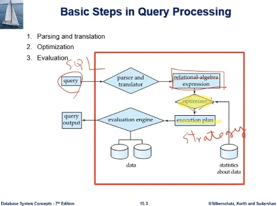
   sql이 관계대수 식으로 변환되었고. 그다음에 최적화모듈을 거치게 된다. 여기서 산출하는 것이 질의처리 전략 execution plan, strategy를 만들어내게 된다.
   이때 optimizer가 참조하는 데이터가 메타데이터를 참조하여 최적의 질의처리 전략을 만들어내게 된다. statistics about data

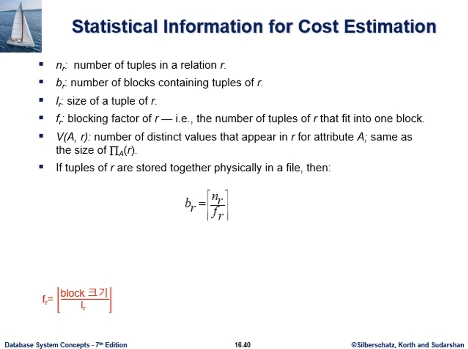  
16장에 나오는 내용이다. 메타데이터중 데이터에 관한 통계자료들, 예를들어

- 테이블 r에 레코드가 모두 몇개인가?
- 테이블 r이 디스크파일에 저장될때 입출력에 단위(디스크블록에) 몇개 저장되는가. - 이 블록수가 중요한 통계자료가 된다. 테이블 r의 레코드들을 전부다 읽어들이겠다고 하면, 테이블이 파일상에 차지하고 있는 블록수만큼 disk IO를 해야한다. db성능에 결정적인 영향을 미치는게 diskIO이므로 블록수는 중요한 통계자료이다.
- 각 테이블의 레코드 길이가 몇바이트 인가. - 대부분 가변길이이다. 평균길이와 같은 데이터 관리 필요
- blocking factor - 한 블록에 저장될 수 있는 튜플의 수 (floor(block크기/레코드 크기)), 실제로는 이런 단순한 식이 성립하지 않는다.

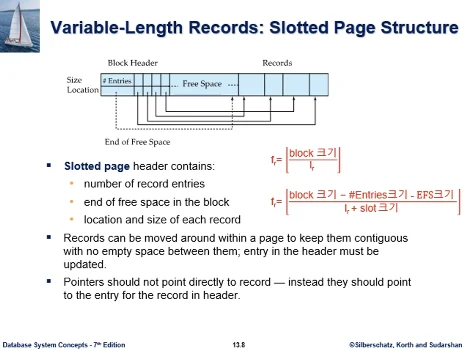  
13장에서 공부한 슬롯기반 페이지구조이다. 그림을 보면 단순한 식이 성립하지 않는걸 알수있다. 전체 블록크기가 다 레코드 저장에 사용되지 못하고 있다. 헤더가 차지하는공간은 제외되고 레코드가 들어간다. 따라서 단순했던 식은 구조를 감안하여 아래와같이 수정되어야 한다.  
블록크기에서 헤더에보면 #entry(몇개만큼 할당되었나), Location - end of free space(바이트 오프셋) 이 크기만큼을 빼주어야 한다.  
분모에는 레코드하나 들어갈때 매치되는 슬롯이 짝이 지어지므로, 슬롯크기가 더해져야한다.  
이 슬롯기반 페이지에서는 레코드들이 가변길이가 될수있는데, 이 blocking factor 구할때는 고정길이나 평균적인 레코드 길이의 고정된 값을 생각하게 된다.

### 연습문제

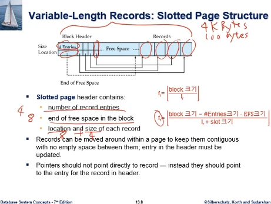  
전체 블록 크기 4KB, 레코드 크기는 고정길이로 가정해서 100byte, number of entries = 4, end of free space = 8 byte, 한 슬롯의 크기 12 byte(location = 8 byte, size 4byte) 이때 blocking factor가 얼마까지 나올수 있는가?  
답은 식에 대입해보면 된다.  
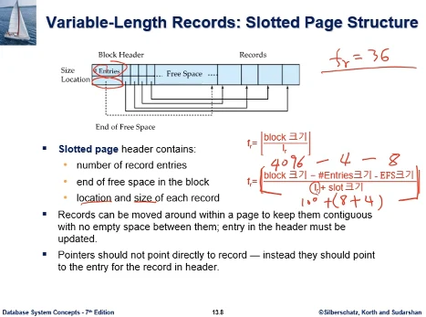  
floor(36.xx) = 36이 된다.

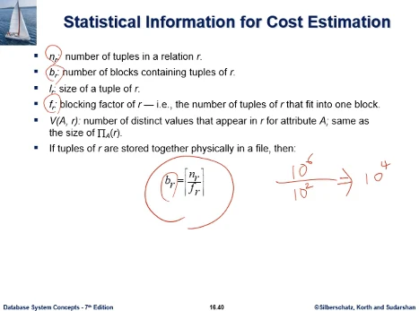  
아래의 식은 레코드수, 블록수, blocking factor 삼자간의 관계를 나타내고 있다. 어떤 테이블에 레코드가 100만개가 있고, blocking factor는 한 블록에 레코드가 100개씩 들어간다면, 이 계산은 이 테이블을 디스크에 저장할때 필요한 총 블록수가 나오게 된다. 10000개 블록이 필요하다.

### 연습문제

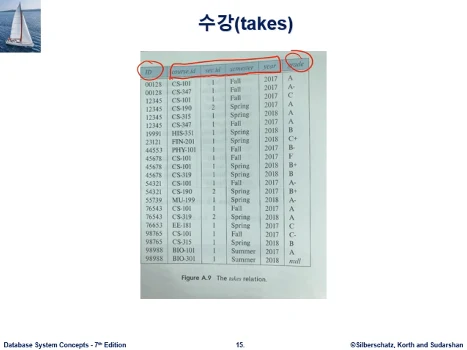  
교재의 대학 db의 수강테이블을 예시로, 수강테이블은 학번, 수강수업, 분반번호, 학기, 연도, 성적 으로 구성된 테이블이다.  
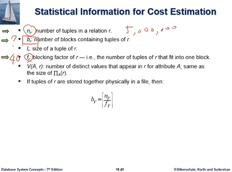  
수강 테이블의 레코드수를 총 500만개로 하고, blocking factor을 40이라고 하면, 수강 테이블은 모두 몇개의 디스크블록에 저장되는가?  
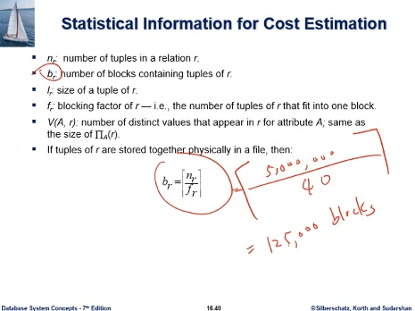  
답은 공식에 대입하면 된다. ceil(500만/40) = 125000블록

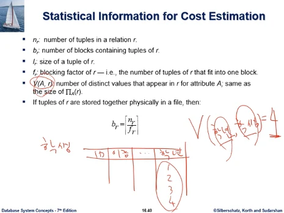  
질의처리 전략을 세우는데 있어서 중요한 역할을 하는것이 이 내용이다. r은 테이블명. A는 칼럼명이다. 테이블 r의 칼럼의 값들이 어떻게 분포되어있는가? distinct values는 서로 중복되지 않는 고유의 값들이 모두 몇종류 등장하는가 하는 이야기이다.  
예시를 들어서, 학생 테이블에 학년이라는 컬럼이 있다면, 이 학년 칼럼은 1-4학년의 4종류 값이 등장한다. 이 표기대로면 V(학년,학생) = 4 (학년 테이블의 학생 칼럼에는 4종류 값이 등장한다)  
이 값은 관계대수 식으로 쓰면 $ \Pi_A (r) $ 이 된다. 파이 기호는 프로젝트 연산으로, r 테이블 에서 A 칼럼을 추출한다. 이 관계대수 연산은 중복을 제거하므로 distinct value만 남기므로 중복을 제거하여 이 결과의 레코드수가 몇개인지가 V(A,r)에 해당한다.

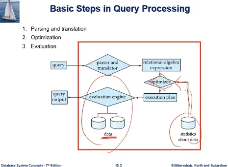  
결국 질의최적화 한다는것은 사용자가 sql로 선언적으로 원하는것을 명세하면 dbms가 어떻게 처리할지 전략을 만들어내야 하는데, 그 과정에서 중요하게 활용되는 메타데이터이다. 일단 처리전략이 수립되면 그 다음 단계는 실행하면 된다.  
그림에서 왼쪽 처리과정은 데이터(학생, 교수, 수강테이블), 최적화 과정에서 본건 통계데이터, 메타데이터이다. 그

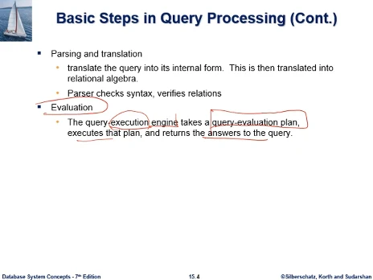  
그래서 query Evaluation한다는 것은, 쿼리를 실행해서 결과를 얻는다는 의미이다. 쿼리 실행 엔진은, 최적화기가 만들어준 처리전략을 그대로 실행해서 결과를 얻는 과정이 된다.

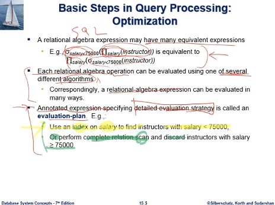  
교재에서는 sql문을 시스템에 요청하면, 내부적으로 관계대수 식으로 변환해서 실행전략을 세운다고 되어있다. 예제에 나온것은 select salary from instructor where salary < 75000 이런 결과를 얻자고 했을때 관계대수로 바꾼것인데, 문제는 관계대수식이 한개만 있는게 아니라 똑같은 결과를 내는것으로서 여러개 있을 수 있다.

- 예제에서 첫번째 관계대수 식은, 교수테이블에서 salary col만 뽑아낸다 (교수이름이나 학과는 필요없다), 먼저 테이블 사이즈를 줄이고, 시그마는 select연산으로 salary < 75000 인것만 뽑아내는 전략이다.
- 그 아래는 select 연산을 먼저하고, 교수테이블 레코드를 쭉 보면서 salary < 75000 인 레코드만 먼저 뽑아내고, 그다음 뽑힌 레코드에서 교수이름, 아이디, 학과정보 ... 중 원하는 정보만 나오게한다.

여러개 나온 각각의 관계대수 식도 연산을 어떤 알고리즘으로 구현할지 선택되어야 한다. 그러므로 관계대수식도 하나 선택되어야 하고, 관계대수식을 구성하는 각 연산에 대한 알고리즘도 선택되어야 한다.  
Annoted expression이라는 이야기는, 각각의 연산이 어떤 알고리즘으로 실행될지 명시한 구체적인 처리전략이다. (evaluation strategy, plan)

- 첫번째 전략은, salary < 75000 이 조건 충족하는 레코드 찾기위해서 급여 컬럼에 대해 인덱스가 있다면 활용하는 전략
- 인덱스가 없다면 complete relation scan(교수테이블의 레코드를 차례대로 다 점검하는것), 75000보다 크다면 버린다.
  인덱스가 있느냐 없느냐에 따라 전략의 결정이 나게 된다.

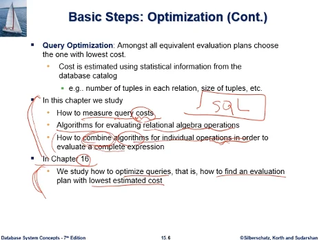  
그래서 질의최적화 문제의 어려운 부분이, 아주 간단한 select 문이라고 할지라도 이것을 처리하는 전략의 개수가 많아진다. 그중 비용이 가장 낮은거 하나를 고르는 과정이 최적화 과정인데, 후보처리전략의 개수가 적다면 쉽게 구하겠지만, 개수가 많아진다.  
핵심적인 사항이 후보로 거론되는 전략별로 통계적 데이터를 활용하여 비용을 추정하는 작업이 필요하고, 정확한 비용은 전략대로 실행해보면 알지만 이것은 실행이전에 전략을 선택하는 것이기에 추정한다는 말이 나왔다. 이것이 질의처리 과정에서 핵심적인 용어가 된다. 비용을 통계적 데이터(테이블 레코드수, 레코드 크기...) 를 사용해서 추정해야 한다.  
이 챕터에서는

- 이 질의처리 전략별 비용에 대한것을 어떻게 추정할 것인가 하는 내용
- 관계대수 연산을 수행하는 알고리즘에 어떤것이 있는가
- sql문이 복잡해지면, 관계대수 연산 여러개를 연쇄적으로 활용해서 질의결과를 얻게되는데, 각 연산별 처리 알고리즘을 어떻게 합칠지의 문제, 여기서 여러 연산들의 수행 알고리즘을 combine 한다는 의미는, 이전 예제에서 질의를 2개의 관계대수로 바꾼 예제가 있었다. (프로젝트 연산, 시그마가 조합된 연산), 프로젝트연산하는 알고리즘하고 select하는 알고리즘하고 합쳐져야 한다.

그 다음 챕터에서는 질의최적화에서 가장 비용낮은것을 어떻게 찾을지의 문제를 공부하게 된다.

## 6주차3rd ch15

지금까지 질의처리의 개요부분을 봤다. 이제 질의처리 비용에 대해 공부한다.
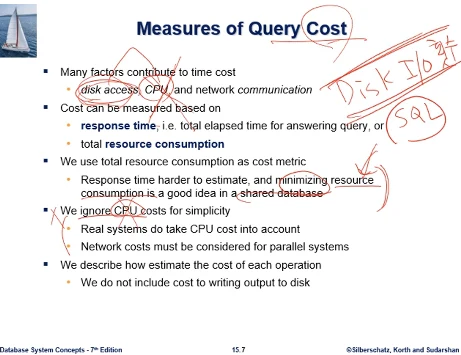  
질의처리의 비용이 무엇인지 정의하고 어떻게 측정할지 기준이 필요하다. dbms환경에서 사용자가 질의처리하는데 드는 시간적인 비용을 보면 diskIO, cpu processing time, 원격 db서버 접근이라면 통신비용도 들 것이다. 대부분의 경우에는 diskIO 위주로 측정하게 된다.  
크게보면 비용을 측정할때 response time하고, 시스템 자원 사용량이 있다. 전자는 sql을 시스템에 던졌을때 결과가 나오기까지 얼마나 기다려야 하는지 경과시간을 말하는 것이고, 사용자가 직접적으로 느끼는 비용은 이것이 된다.  
그런데 데이터베이스 환경에서는 response time을 비용의 기준으로 삼지 않는다, 일단 응답시간을 추정하는건 쉬운일이 아니고, 데이터베이스라는것 자체가 공유자원이다. 그래서 db 시스템 환경에 보면 디스크에 데이터가 있고, 여러 시스템 자원(IO,cpu processing)을 사용하게 되는데, 이 자원 자체가 여러 사용자가 공유하는 자원이다. 공유자원 차원에서 resource 소모 자체를 전체적으로 최소화하는, 질의당 사용하는 리소스 소모량을 최소화하는. 이전에 이야기한것처럼 디스크IO 횟수를 줄이는걸 비용의 기준으로 삼게된다.  
cpu cost는 무시한다고 되어있는데, 어떤 질의라면 cpu time이 많이 들기도 한다. 그러나 일반적인 db 환경에서는 둘을 비교하면 DiskIO에 비해서 이것은 마이너하다고 본다.  
간단하게 정리하면 하나의 sql문을 처리하는데 있어서 Disk IO 를 몇번 해야하는지, 비용에 관점을 두고 질의처리 전략을 수립하게 된다.  
맨 마지막 부분에는 관계대수 연산 각각에 대해 처리 알고리즘이 나오고 그것에 그 알고리즘의 비용을 diskIO 관점에서 비용공식을 만들어서 추정하도록 한다. 이 공식에는 결과(output, 결과가 클수 있다.)를 저장하는 비용은 뺀다고 되어있다, 저장하려면 IO를 해야함.

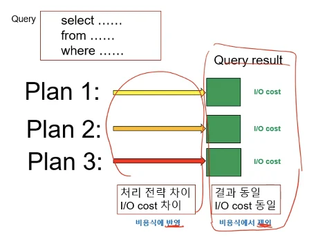  
예를 들어서 어떤 질의가 주어지고, 그 처리전략으로 3가지가 있다고 하자. 이들은 사용하는 알고리즘, 연산순서들이 서로간에 다르다. 따라서 소요되는 diskIO횟수가 차이가 나서 cost에 차이가 있다. 그런데 세 plan간에 동일한점이 있는데, 바로 질의결과가 같다는것이다. 처리전략은 달라도 결과는 같다. 같은 질의 결과니까.  
DB환경이어서 결과의 용량이 클수도 있다. 이 결과를 디스크에 써야한다고 하면 필요한 IO 횟수도 계획에 무관하게 동일하다. 우리의 관심은 질의에 대해서 서로 다른 Plan 중에서 어느것이 가장 비용이 낮은가 하는 것인데, 이들 전략간의 비용의 차이는 질의 결과를 IO하는 비용을 제외한 부분에서 나는 것이기에, 비용 식을 만들때 다른부분만 비용식에 반영하고, 결과를 write하는 부분은 비용식을 쓸때 제외하겠다는 것이다.

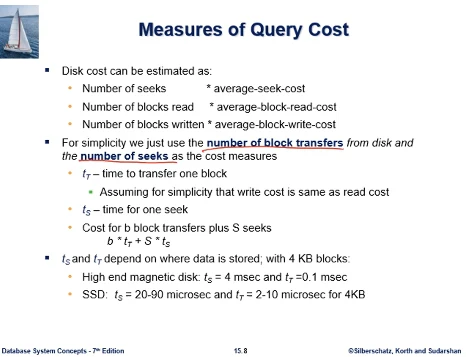  
교재에서 사용하는 질의처리 비용 모델에서는 디스크 비용을

- seek의 횟수 \* 비용
- 디스크 블록을 버퍼로 읽어들이는 횟수 \* 비용
- 블록을 디스크로 쓰는 횟수 \* 비용
  이런 내용으로 추정한다.

그래서 이 둘을 합쳐서 (디스크 블록 IO가 몇번 일어나는지의 횟수, seek가 몇번 일어나는지의 횟수) 비용식을 구성한다.

$ b*t\_\tau +S*t_s $

비용식의 일반형은 위와 같이 나온다. b는 디스크 IO의 횟수, s는 seek의 횟수, t_tau는 블록 1개를 IO할때 걸리는 transfer time이다. 블록의 읽기, 쓰기 cost는 동일하다고 가정했다. 최근 많이 사용하는 SSD는 시간 차이가 있다. t_s는 seek를 1회 할때 걸리는 시간이다.  
t_s, t_tau는 제품마다 값이 다를텐데, 교재에서 블록크기가 4KB라고 할때 값이 대략 위와 같은 식으로 있다고 안내하고 있다.

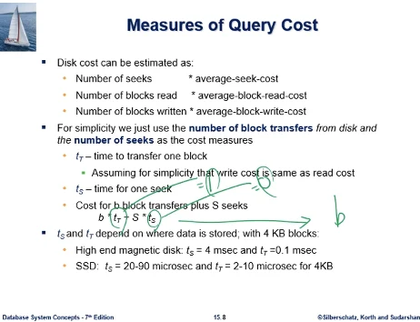  
교재에서 비용식의 일반형이 나왔는데, 보통 질의처리 연구에서 널리 통용되는 비용식 모델은 교재 것보다 더 간단하다. seek 횟수는 따로 고려하지 않고(S), blockIO 횟수(B)만 고려한다. seek의 횟수는 데이터블록들이 디스크에 물리적으로 어떻게 배치되어 있는가에 따라 결정되는데, 물리적 상태를 정확히 알기 어려울 수 있다.(같은 트랙에 있는가?? 같은 트랙이라면 seek가 1번이 된다.)  
일반적으로 데이터블록들이 디스크상 물리적으로 어떻게 배치되어있는지 알기 어려울수 있으므로, 게다가 보통 한 블록을 IO를 하면 그 속에 seek time이 내포된다고 생각할수 있으므로, seek time을 고려하지 않고 IO 횟수만 보통 고려하게 된다.  
그래서 앞으로는 교재의 비용식이 일반 형태로 나오게 되면. t_tau = 1, t_s = 0 이렇게 고쳐서 본다. 그러면 그냥 b가 된다. 이것은 총 디스크 블록 IO의 총 횟수이다. 이것만 따진다.

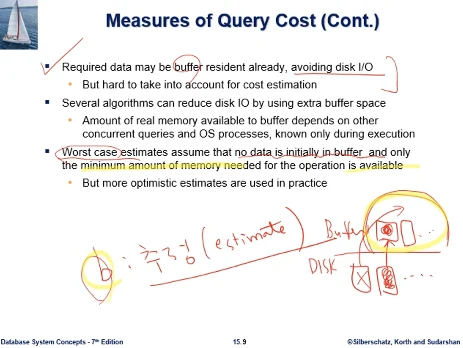  
앞으로 연산별로 IO횟수 b를 추정하는 공식을 이해하는것이 필요한데, 이것은 어디까지나 정확한 값이 아닌 추정이다. 정확한건 실행해봐야 아는데, 질의최적화는 실행 이전에 짐작하는 문제이므로 추정이다.  
정확성이 떨어지는 요인이, 디스크에 블록이 있고, 메모리 버퍼에 페이지들이 있어서 읽어오는 추상적 모델링을 하는데, 어떤 경우에는 디스크에서 이 블록을 읽고싶은데, 이미 버퍼에 들어와 있다면 IO를 안해도 된다. 그런데 버퍼는 제한된 공간이고, 원하는 블록이 이미 버퍼에 있는지 없는지 사전에 확인이 어렵다. 그래서 많은 경우에 worst case - 항상 디스크의 어떤 블록을 원하면 버퍼에 없고 IO를 해야 한다. (no data is initally in buffer)  
버퍼는 제한된 공간이고, 각 질의처리에 버퍼공간이 항상 풍족하게 배당되지 않는다. 그 연산 알고리즘을 수행하는데 정말 minimum으로 필요한 메모리만 주어져 있다는 가정하에 IO횟수를 추정하게 된다.

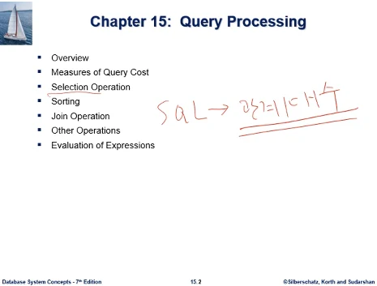  
15장 질의처리, Selection operation의 알고리즘과 비용식  
교재에서 sql문을 내부적으로 관계대수 식으로 표현하기에 관계대수에 대해 간단한 review 시간을 갖는다. 2장 필요시 보도록 하자.

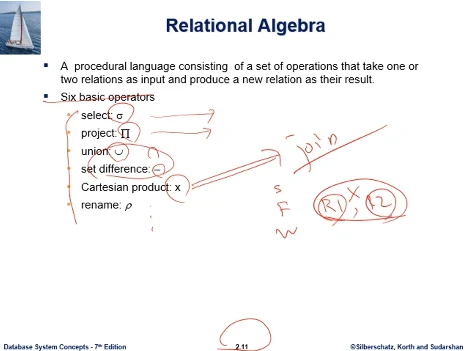  
6개의 기본연산자.

- select(시그마) - 레코드 추출
- project(파이) - 칼럼 추출
- union, 교집합, 차집합 등 집합연산
- 카테시안 곱(sql에서 테이블을 R1,R2 콤마로 여러개 쓸때 카테시안 곱이 이루어진다. 좌우 테이블의 레코드를 짝짓기 하는 과정) - join 연산

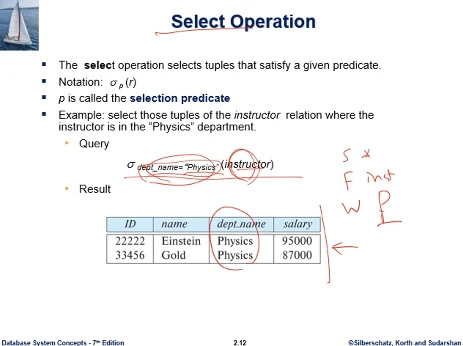  
select 연산은 테이블에서 조건을 주고, 조건을 충족하는 레코드를 뽑는 연산이었다.  
select - from - where P, 여기의 P 가 조건 내용이 된다.

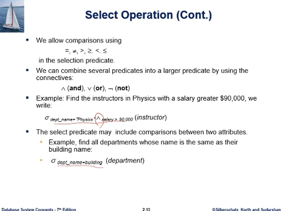  
이 조건은 and, not으로 다양하게 나타날 수 있다.

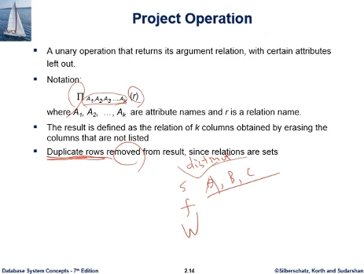  
Project는 col을 뽑는다. r 테이블에서 열거된 col만 뽑는다. 그 결과 중복된 레코드가 나오면, 관계대수 식에서는 삭제를 한다.  
sql에서는 select distinct- from- where-, distinct 쓰면 중복을 제거하는 기능이 있었다.

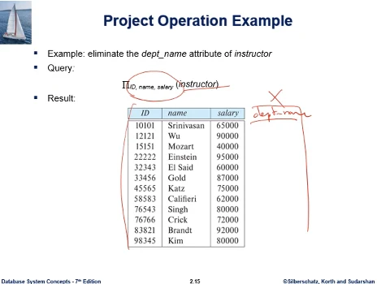  
교수테이블에 원래는 학과 이름 col 까지 있었는데, 세 col만 뽑은것이다.

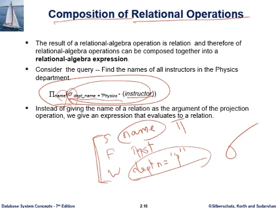  
sql로 S-F-W- 써 보면, 기본적으로 Select 연산과 project 연산이 같이 있는 경우가 많다. from 절에 instructor가 테이블에 들어가고, where 절에 조건이 들어간다. 이게 관계대수에서는 시그마, 마지막에 교수 이름 col만 뽑고 있는데, 이것이 project 연산이다.  
일반적으로 sql문이 있으면, 그것을 구현하기 위한 관계대수 연산은 select 연산을 먼저하고, 그 결과에서 project하는 식으로 여러개의 연산을 사용하게 된다.

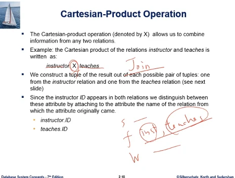  
카테시안 곱은 join 연산을 하게된다.  
S - F inst,teaches W- , 두 테이블간에 join을 수행하게 된다. 관계대수의 기본은 카테시안 곱을 먼저 하게되는 것이다.

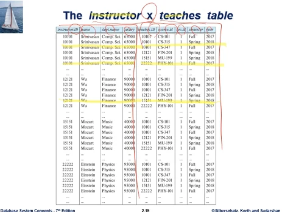  
카테시안 곱 한다는것은 두 테이블의 레코드들을 짝짓기 한다는 것이다.

  
sql문에서는 짝짓기하고 끝나는 경우는 없고, 조건을 줘서 짝짓기 결과에서 유의미한 레코드 짝만 골라내게 된다. 예시가 join의 조건이 된다.

  
앞 슬라이드에서 짝짓기 많이 한것에서, 조건이 옳은것만 골라낸 것이다. 그래야 실 세계에서 의미있는 짝이 된다.  
S- F inst,teaches W 조건, where 절에 조건이 들어가는 형태로 쓰여지게 되어서 join을 나타내게 된다.

  
join은 나비 기호로 관계대수에서 많이 표현하고, 가끔 세타를 표현해서 세타 조인이라는 용어를 쓰기도 하는데, 쎄타 자체가 교재에서는 임의의 조인 조건을 말하게 된다. 그래서 두 테이블의, 아래와 같은 조건(theta)으로 레코드짝을 짓자고 할때 이러한 문법을 쓰고 있다.

  
그 외에 관계대수에서 집합 연산이 있다. 두 관계식이 얻어낸 결과를 합집합 하는 내용이다.

  
두 관계식에서 얻어낸 결과를 합집합 한 결과이다.

  
교집합

  
차집합
