## 학습 범위

- shared lock과 exclusive lock
- locking protocol과 lock compatibility
- 2단계 잠금 프로토콜(2PL)과 serializability

## 13주차1st ch18

### Locking protocol

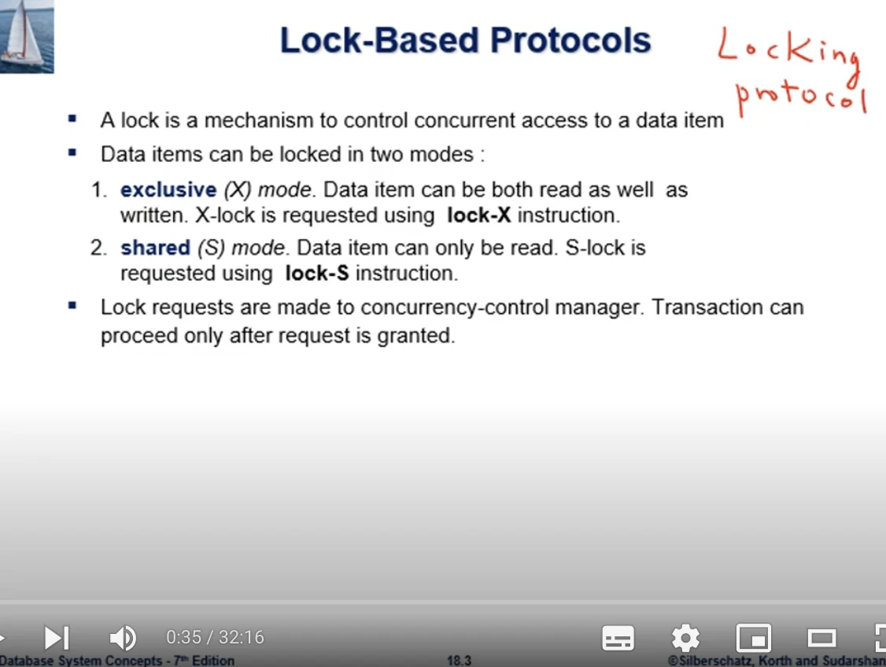

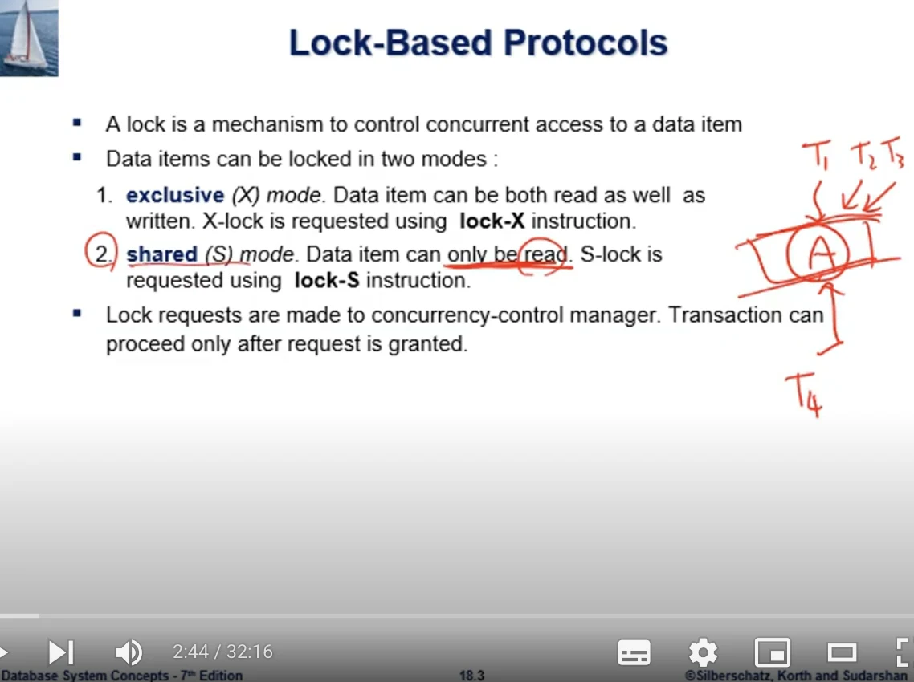

lock은 여러 트랜잭션이 같은 데이터 항목에 동시에 접근하는것을 제어하는 장치이다. 값을 읽고 쓸때는 exclusive lock인 X-lock을, 읽기만 할때는 shared lock인 S-lock을 요청한다.

X-lock을 잡으면 다른 트랜잭션은 그 항목에 S-lock과 X-lock을 모두 잡을수 없다. S-lock은 값을 바꾸지 않으므로 여러 트랜잭션이 동시에 잡고 읽는것이 가능하다.

호환성 표에서 S와 S만 true이고, 어느 한쪽이라도 X이면 false가 된다. concurrency-control manager는 요청된 lock이 기존 lock과 호환될때만 grant하고, 호환되지 않으면 기존 lock이 풀릴때까지 트랜잭션을 기다리게 한다.

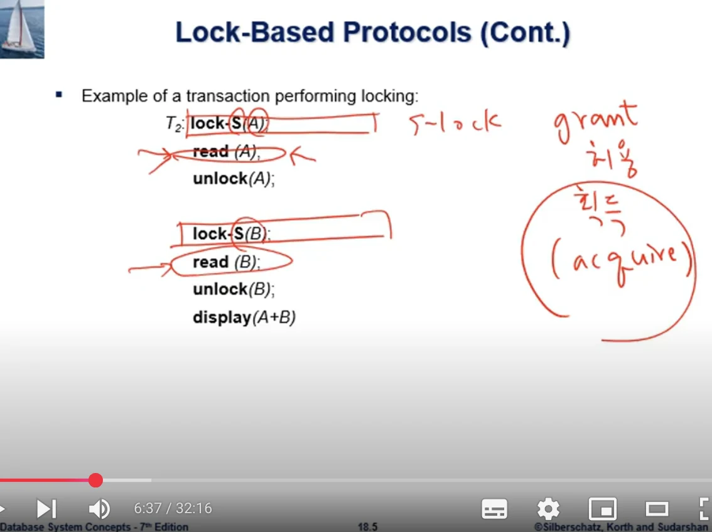

트랜잭션은 데이터에 접근하기 전에 lock을 요청하고 사용이 끝나면 unlock한다. 단순히 각 read와 write 앞뒤에 lock과 unlock을 붙이는것만으로는 충분하지 않고, lock을 언제 얻고 언제 풀수 있는지에 대한 공통 규칙이 필요하다.

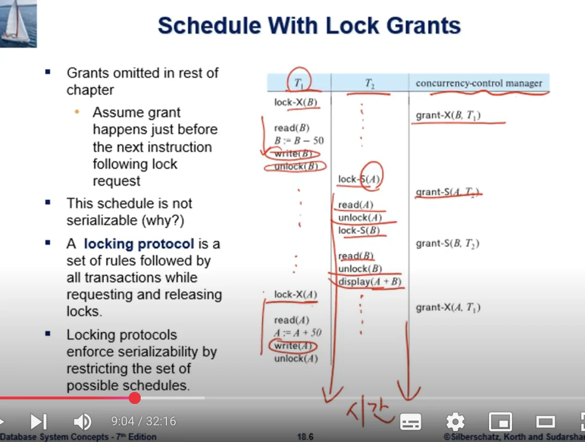

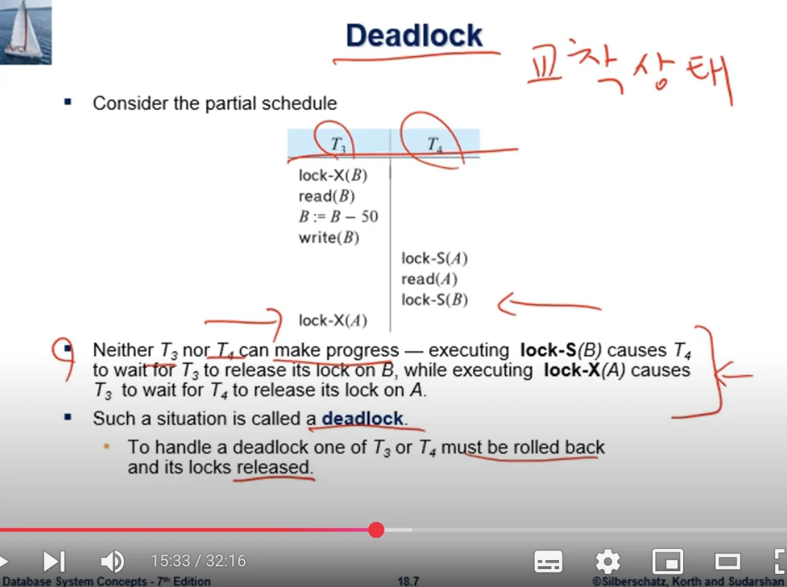

T3가 B의 lock을 가진채 A를 기다리고, T4가 A의 lock을 가진채 B를 기다리면 어느 쪽도 진행할수 없는 deadlock이 된다. 이 경우 한 트랜잭션을 rollback해서 lock을 풀어야 한다.

계속 같은 트랜잭션만 rollback 대상으로 선택하면 그 트랜잭션은 영원히 완료되지 못하는 starvation도 생길수 있다. 동시성 제어 관리자는 deadlock 처리와 함께 이런 기아상태도 막아야 한다.

### 연습문제

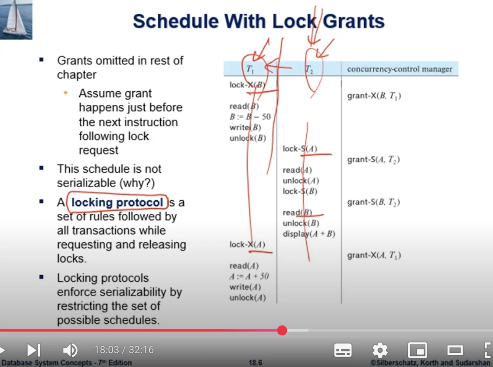

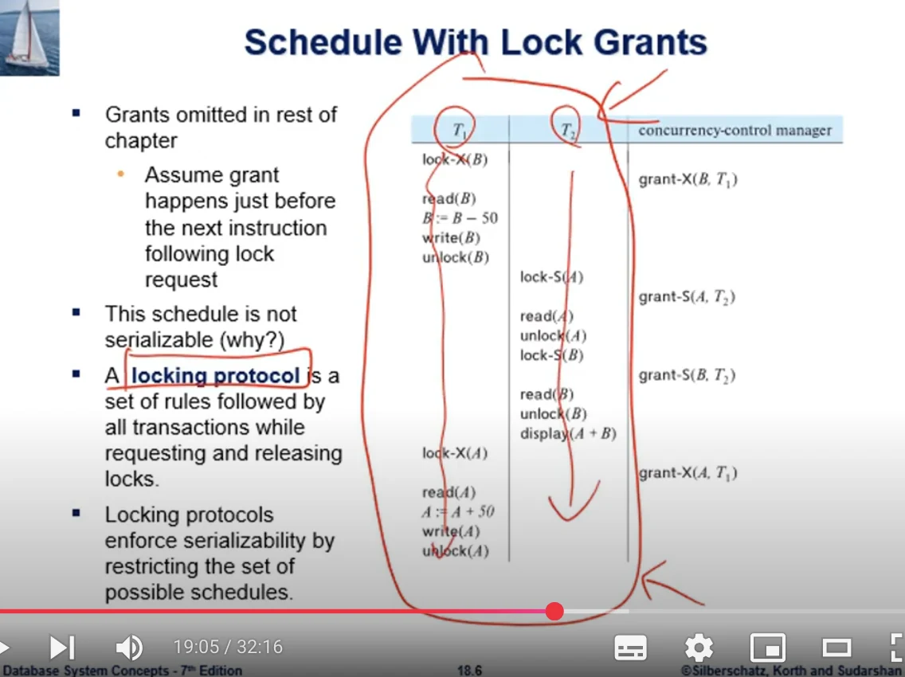

그림의 스케줄은 모든 접근에 lock을 사용했지만 serializable하지 않다. T2가 A에서는 T1보다 먼저인 값을 읽고 B에서는 T1이 변경한 뒤의 값을 읽기 때문이다. 즉 lock을 쓴다는 사실 자체가 아니라 모든 트랜잭션이 지킬 locking protocol이 있어야 한다.

### 2단계 locking protocol(2PL)

2단계 locking protocol은 lock을 얻기만 하는 growing phase와 lock을 풀기만 하는 shrinking phase로 나눈다. 하나의 lock을 풀기 시작한 뒤에는 새로운 lock을 얻을수 없다.

마지막 lock을 얻은 지점을 lock point라고 하는데, 트랜잭션들을 lock point 순서로 나열하면 직렬 순서를 얻을수 있다. 그래서 2PL을 지키는 스케줄은 conflict serializable하다.

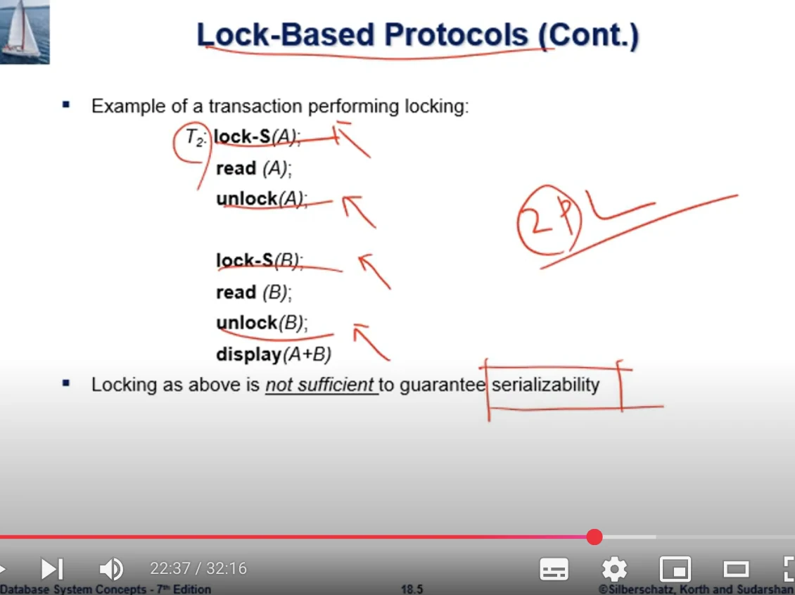

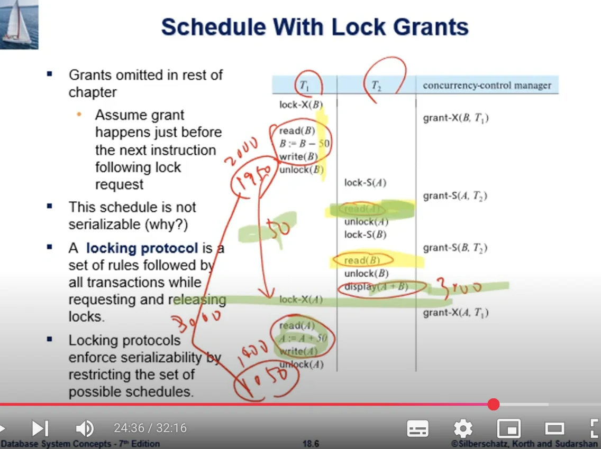

앞의 예제에 2PL을 적용하면 T1은 B의 lock을 푼 뒤 A의 lock을 새로 요청할수 없다. 필요한 lock을 먼저 얻은 다음 해제단계로 들어가야 하므로, 충돌하는 트랜잭션은 중간에 기다리게 되고 허용되는 스케줄이 직렬가능한 범위로 제한된다.

## 13주차2nd ch18

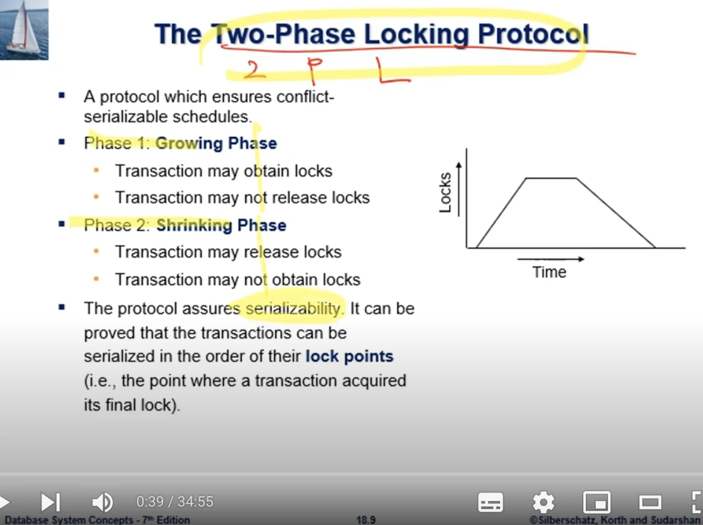

2PL은 직렬가능성을 보장하지만 deadlock이 생기지 않는것까지 보장하지는 않는다. 또한 기본 2PL만으로는 다른 트랜잭션이 commit하지 않은 값을 읽어서 연쇄 rollback이 생기는 문제도 남아있다.

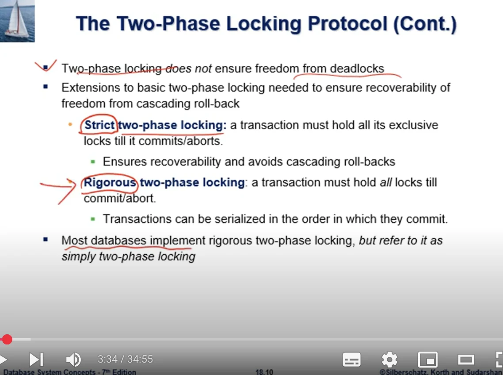

strict 2PL은 모든 X-lock을 commit이나 abort할때까지 유지한다. 그래서 미확정 변경값을 다른 트랜잭션이 읽거나 덮어쓰는 일을 막고, recoverable하며 연쇄 rollback이 없는 스케줄을 만든다.

rigorous 2PL은 X-lock뿐 아니라 S-lock을 포함한 모든 lock을 commit이나 abort까지 유지한다. 이 경우 트랜잭션의 commit 순서가 곧 직렬 순서가 된다. 실제 DBMS에서 단순히 2PL이라고 부르는 구현은 rigorous 2PL인 경우가 많다.
