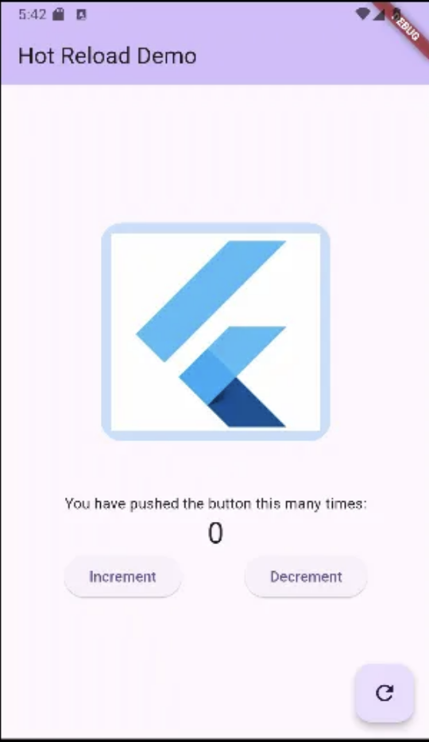

2024-2 모바일앱개발 flutter

```dart
import 'package:flutter/material.dart';

void main() {
  runApp(const MyApp());
}

class MyApp extends StatelessWidget {
  const MyApp({super.key});

  // This widget is the root of your application.
  @override
  Widget build(BuildContext context) {
    return MaterialApp(
      title: 'Flutter Demo',
      theme: ThemeData(
        colorScheme: ColorScheme.fromSeed(seedColor: Colors.deepPurple),
        useMaterial3: true,
      ),
      home: const MyHomePage(title: 'Hot Reload Demo'),
    );
  }
}

class MyHomePage extends StatefulWidget {
  const MyHomePage({super.key, required this.title});

  final String title;

  @override
  State<MyHomePage> createState() => _MyHomePageState();
}

class _MyHomePageState extends State<MyHomePage> {
  int _counter = 0;

  void _incrementCounter() {
    setState(() {
      _counter++;
    });
  }

  void _decrementCounter() {
    setState(() {
      _counter--;
    });
  }

  void _refreshCounter(){
    setState(() {
      _counter = 0;
    });
  }

  @override
  Widget build(BuildContext context) {
    return Scaffold(
      appBar: AppBar(
        backgroundColor: Theme.of(context).colorScheme.inversePrimary,
        title: Text(widget.title),
      ),
      body: Center(
        child: Column(
          mainAxisAlignment: MainAxisAlignment.center,
          children: <Widget>[
            Container(
              margin: EdgeInsets.only(bottom: 50.0),
              padding: EdgeInsets.all(10.0),
              decoration: BoxDecoration(
                color: Colors.blue.withOpacity(0.25),
                borderRadius: BorderRadius.circular(20.0)
              ),
              child: const Image(
                  image: AssetImage(
                    'assets/flutter.png'
                  ),
                //  -------- pubspec.yaml 에서
                //  assets: (주석해제후 앞에 두칸)
                //     - assets/
                width: 200,
              ),
            ),
            const Text(
              'You have pushed the button this many times:',
            ),
            Text(
              '$_counter',
              style: Theme.of(context).textTheme.headlineMedium,
            ),
            Row(
              mainAxisAlignment: MainAxisAlignment.spaceEvenly,
              //있어야 할 공간에 균일하게 정렬되는
              children: [
                ElevatedButton(
                    onPressed: _incrementCounter,
                    child: const Text('Increment')),
                ElevatedButton(
                    onPressed: _decrementCounter,
                    child: const Text('Decrement')),
              ],
            )
          ],
        ),
      ),
      floatingActionButton: FloatingActionButton(
        onPressed: _refreshCounter,
        tooltip: 'Increment',
        child: const Icon(Icons.refresh),
      ), // This trailing comma makes auto-formatting nicer for build methods.
    );
  }
}

```


