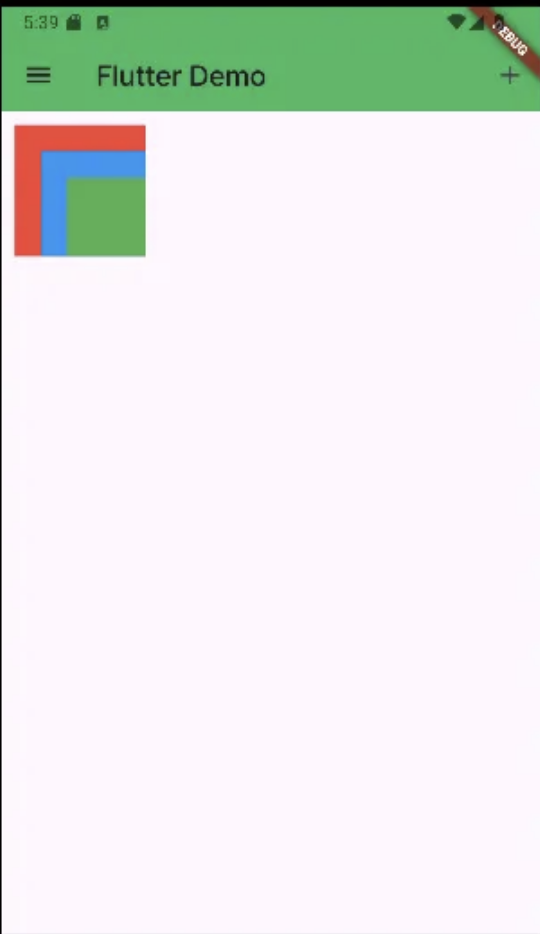
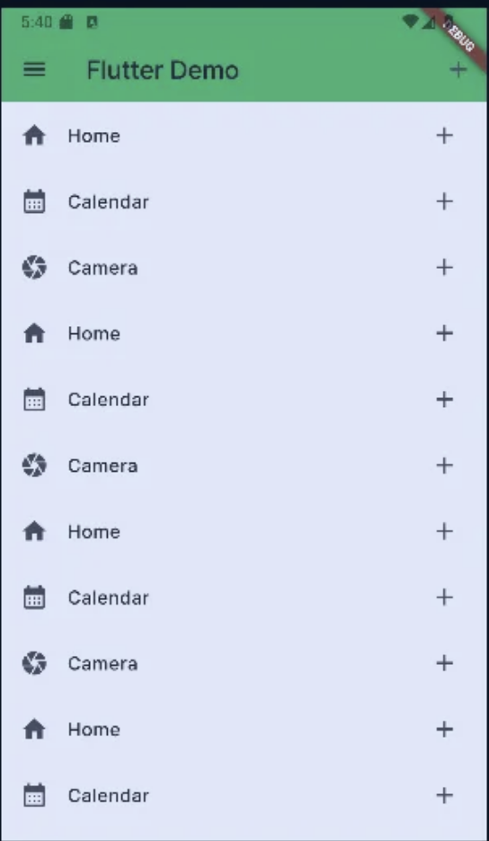

```dart
import 'package:flutter/material.dart';
import 'style.dart';

void main() {
  runApp(const MyApp());
}

class MyApp extends StatelessWidget {
  const MyApp({super.key});

  @override
  Widget build(BuildContext context) {
    return MaterialApp(
      title: 'First Flutter  App',
      theme: ThemeData(
        primaryColor: Colors.orange,
        primarySwatch: Colors.blue,
        fontFamily: 'Pretendard', // 폰트 넣기
      ),
      home: MyHomePage(),
    );
  }
}

class MyHomePage extends StatelessWidget {
  MyHomePage({super.key});
  final items = List.generate(100, (index)=>index).toList();

  @override
  Widget build(BuildContext context) {
    return Scaffold(
      appBar: AppBar(
        backgroundColor: AppColor.Malachite, // 추가한 색깔로 넣기
        title: const Text('Flutter Demo'),
        actions: [
          IconButton(onPressed: (){}, icon: const Icon(Icons.add))
        ],
        //leading: Icon(Icons.add),
      ),
      body: Stack(
        alignment: Alignment.bottomRight,
        children: [
          Container(
            color: Colors.red,
            width: 100.0,
            height: 100.0,
            padding: EdgeInsets.all(8),
            margin: EdgeInsets.all(10),
          ),
          Container(
            color: Colors.blue,
            width: 80.0,
            height: 80.0,
            padding: EdgeInsets.all(8),
            margin: EdgeInsets.all(10),
          ),
          Container(
            color: Colors.green,
            width: 60.0,
            height: 60.0,
            padding: EdgeInsets.all(8),
            margin: EdgeInsets.all(10),
          ),
        ],
      ),
      drawer: const Drawer(), // appbar가 아닌 scaffold 에서
    );
  }
}
```



```dart
import 'package:flutter/material.dart';
import 'style.dart';

void main() {
  runApp(const MyApp());
}

class MyApp extends StatelessWidget {
  const MyApp({super.key});

  @override
  Widget build(BuildContext context) {
    return MaterialApp(
      title: 'First Flutter  App',
      theme: ThemeData(
        primaryColor: Colors.orange,
        primarySwatch: Colors.blue,
        fontFamily: 'Pretendard', // 폰트 넣기
      ),
      home: MyHomePage(),
    );
  }
}

class MyHomePage extends StatelessWidget {
  MyHomePage({super.key});
  final items = List.generate(100, (index)=>index).toList();

  @override
  Widget build(BuildContext context) {
    return Scaffold(
      appBar: AppBar(
        backgroundColor: AppColor.Malachite, // 추가한 색깔로 넣기
        title: const Text('Flutter Demo'),
        actions: [
          IconButton(onPressed: (){}, icon: const Icon(Icons.add))
        ],
        //leading: Icon(Icons.add),
      ),
      body: ListView(
        scrollDirection: Axis.vertical,
        children: [
          ListTile(
            leading: const Icon(Icons.home),
            title: const Text('Home'),
            trailing: const Icon(Icons.add),
            onTap: (){},
          ),
          ListTile(
            leading: const Icon(Icons.calendar_month),
            title: const Text('Calendar'),
            trailing: const Icon(Icons.add),
            onTap: (){},
          ),
          ListTile(
            leading: const Icon(Icons.camera),
            title: const Text('Camera'),
            trailing: const Icon(Icons.add),
            onTap: (){},
          ),
          ListTile(
            leading: const Icon(Icons.home),
            title: const Text('Home'),
            trailing: const Icon(Icons.add),
            onTap: (){},
          ),
          ListTile(
            leading: const Icon(Icons.calendar_month),
            title: const Text('Calendar'),
            trailing: const Icon(Icons.add),
            onTap: (){},
          ),
          ListTile(
            leading: const Icon(Icons.camera),
            title: const Text('Camera'),
            trailing: const Icon(Icons.add),
            onTap: (){},
          ),
          ListTile(
            leading: const Icon(Icons.home),
            title: const Text('Home'),
            trailing: const Icon(Icons.add),
            onTap: (){},
          ),
          ListTile(
            leading: const Icon(Icons.calendar_month),
            title: const Text('Calendar'),
            trailing: const Icon(Icons.add),
            onTap: (){},
          ),
          ListTile(
            leading: const Icon(Icons.camera),
            title: const Text('Camera'),
            trailing: const Icon(Icons.add),
            onTap: (){},
          ),
          ListTile(
            leading: const Icon(Icons.home),
            title: const Text('Home'),
            trailing: const Icon(Icons.add),
            onTap: (){},
          ),
          ListTile(
            leading: const Icon(Icons.calendar_month),
            title: const Text('Calendar'),
            trailing: const Icon(Icons.add),
            onTap: (){},
          ),
          ListTile(
            leading: const Icon(Icons.camera),
            title: const Text('Camera'),
            trailing: const Icon(Icons.add),
            onTap: (){},
          ),
          ListTile(
            leading: const Icon(Icons.home),
            title: const Text('Home'),
            trailing: const Icon(Icons.add),
            onTap: (){},
          ),
          ListTile(
            leading: const Icon(Icons.calendar_month),
            title: const Text('Calendar'),
            trailing: const Icon(Icons.add),
            onTap: (){},
          ),
          ListTile(
            leading: const Icon(Icons.camera),
            title: const Text('Camera'),
            trailing: const Icon(Icons.add),
            onTap: (){},
          ),

        ],
        ),
      drawer: const Drawer(), // appbar가 아닌 scaffold 에서
    );
  }
}
```

