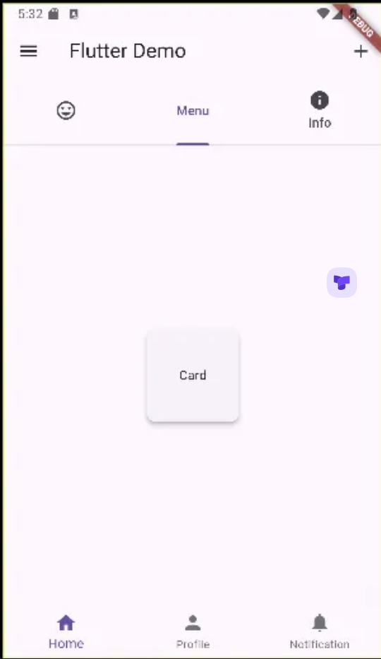
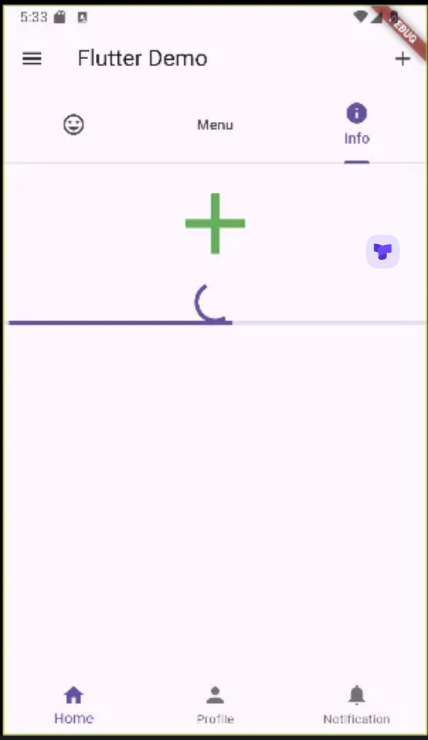

```dart
import 'package:flutter/material.dart';

void main() {
  runApp(const MyApp());
}

class MyApp extends StatelessWidget {
  const MyApp({super.key});

  @override
  Widget build(BuildContext context) {
    return MaterialApp(
      title: 'First Flutter  App',
      theme: ThemeData(
        primaryColor: Colors.orange,
        primarySwatch: Colors.blue,
      ),
      home: MyHomePage(),
    );
  }
}

class MyHomePage extends StatelessWidget {
  MyHomePage({super.key});
  final items = List.generate(100, (index)=>index).toList();

  @override
  Widget build(BuildContext context) {
    return DefaultTabController(
      length: 3,
      child: Scaffold(
        appBar: AppBar(
          title: const Text('Flutter Demo'),
          actions: [
            IconButton(onPressed: (){}, icon: const Icon(Icons.add))
          ],
          //leading: Icon(Icons.add),
          bottom: const TabBar(
            tabs: [
              Tab(icon: Icon(Icons.tag_faces),),
              Tab(text: 'Menu',),
              const Tab(icon: Icon(Icons.info), text: 'Info',)
            ],
          ),
        ),
        body: TabBarView(
          children: [
            Tab(
              child: Row(
                children: [
                  Expanded(
                    flex: 3,
                    child: Container(
                      color : Colors.red,
                      width: 100,
                      height: 100,
                    ),
                  ),
                  Expanded(
                    flex: 1,
                    child: Container(
                      color : Colors.green,
                      width: 100,
                      height: 100,
                    ),
                  ),
                  Expanded(
                    flex: 3,
                    child: Container(
                      color : Colors.blue,
                      width: 100,
                      height: 100,
                    ),
                  ),
                ],
              ),
            ),
            Tab(
              child: Card(
                shape: RoundedRectangleBorder(
                  borderRadius: BorderRadius.circular(10),
                ),
                elevation: 4,
                child: Container(
                  width: 100,
                  height: 100,
                  child: Center(child: Text('Card'),),
                ),
              ),
            ),
            Tab(
              child: Column(
                children: [
                  IconButton(
                      onPressed:(){},
                      icon: Icon(Icons.add),
                      iconSize: 100,
                      color: Colors.green,
                      //child: Text('Button')
                  ),
                  CircularProgressIndicator(),
                  LinearProgressIndicator()
                ],
              )
            ),

          ],
        ),
        drawer: const Drawer(), // appbar가 아닌 scaffold 에서
        bottomNavigationBar: BottomNavigationBar(
            items: [
              BottomNavigationBarItem(icon: Icon(Icons.home),label: 'Home'),
              BottomNavigationBarItem(icon: Icon(Icons.person),label: 'Profile'),
              BottomNavigationBarItem(icon: Icon(Icons.notifications),label: 'Notification'),
            ]
        ),
      ),
    );
  }
}
```



