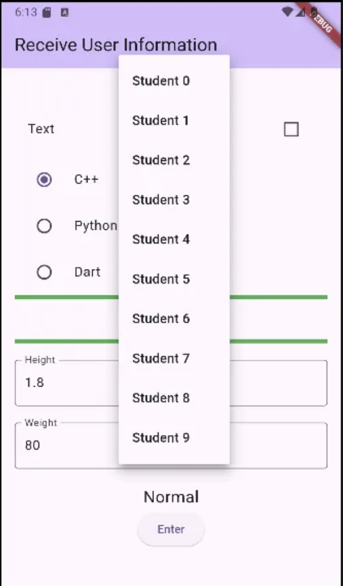
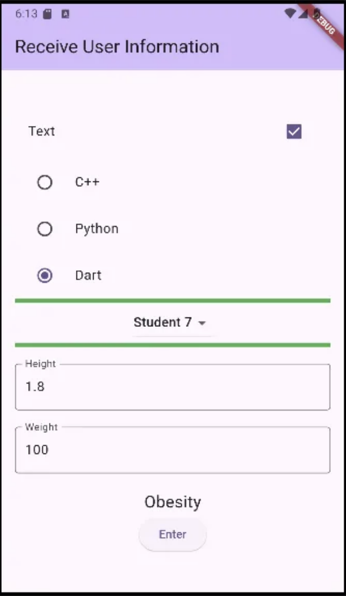

```dart
import 'package:flutter/material.dart';

enum Language {cpp,python,dart}

void main() {
  runApp(const MyApp());
}

class MyApp extends StatelessWidget {
  const MyApp({super.key});

  // This widget is the root of your application.
  @override
  Widget build(BuildContext context) {
    return MaterialApp(
      title: 'Flutter Demo',
      theme: ThemeData(
        primarySwatch: Colors.purple,
        colorScheme: ColorScheme.fromSeed(seedColor: Colors.deepPurple),
        useMaterial3: true,
      ),
      home: const MyHomePage(title: 'Receive User Information'),
    );
  }
}

class MyHomePage extends StatefulWidget {
  const MyHomePage({super.key, required this.title});

  final String title;

  @override
  State<MyHomePage> createState() => _MyHomePageState();
}

class _MyHomePageState extends State<MyHomePage> {
  final _heightController = TextEditingController();
  final _weightController = TextEditingController();
  String _obesity = 'Normal';

  bool _isChecked = false;
  Language _language = Language.cpp;
  final _valueList = List.generate(10, (i)=>'Student $i');
  var _selectedValue = 'Student 0';

  void dispose() {
    _heightController.dispose();
    _weightController.dispose();
    super.dispose();
  }

  @override
  Widget build(BuildContext context) {
    return Scaffold(
      appBar: AppBar(
        backgroundColor: Theme.of(context).colorScheme.inversePrimary,
        title: Text(widget.title),
      ),
      body: Padding(
        padding: const EdgeInsets.all(16.0),
        child: Center(
            child: Column(
              mainAxisAlignment: MainAxisAlignment.center,
              children: [
                CheckboxListTile(
                  title: Text('Text'),
                  value: _isChecked,
                  onChanged: (value) { // bool? value - null도 될수 있는 상태
                    setState(() {
                      _isChecked = value!; //
                    });
                  }
                ),
                Container(
                  height: 5,
                ),
                RadioListTile(
                  title: Text('C++'),
                    value: Language.cpp,
                    groupValue: _language,
                    onChanged: (value){
                    setState(() {
                      _language = value!;
                    });
                    }
                ),
                RadioListTile(
                    title: Text('Python'),
                    value: Language.python,
                    groupValue: _language,
                    onChanged: (value){
                      setState(() {
                        _language = value!;
                      });
                    }
                ),
                RadioListTile(
                    title: Text('Dart'),
                    value: Language.dart,
                    groupValue: _language,
                    onChanged: (value){
                      setState(() {
                        _language = value!;
                      });
                    }
                ),
                Container(
                  height:5,
                  color: Colors.green,
                ),
                DropdownButton(
                    value: _selectedValue,
                    items: _valueList.map(
                        (student) => DropdownMenuItem(
                          value: student,
                          child: Text(student))).toList(),
                    onChanged: (value){
                      setState(() {
                        _selectedValue = value!;
                      });
                    },
                ),
                Container(
                  height: 5,
                  color: Colors.green,
                ),
                Container(
                  height: 20,
                ),
                TextField(
                  decoration: InputDecoration(
                      border: OutlineInputBorder(),
                      labelText: 'Height'
                  ),
                  controller: _heightController,
                  keyboardType: TextInputType.number, // 숫자 키보드가 나오도록
                ),
                Container(
                  height: 20,
                ),
                TextField(
                  decoration: InputDecoration(
                    border: OutlineInputBorder(),
                    labelText: 'Weight'
                  ),
                  controller: _weightController,
                ),
                Container(
                  height: 20,
                ),
                Text(_obesity, style: TextStyle(fontSize: 20),),
                ElevatedButton(
                    onPressed: (){setState(() {
                      var heightValue = double.parse(_heightController.text.trim());
                      var weightValue = double.parse(_weightController.text.trim());
                      if (weightValue/(heightValue*heightValue) > 25) {
                        _obesity = 'Obesity';
                      } else {
                        _obesity = 'Normal';
                      }
                    });},
                    child: Text('Enter')
                )
              ],
            )
        ),
      ),
    );
  }
}
```


