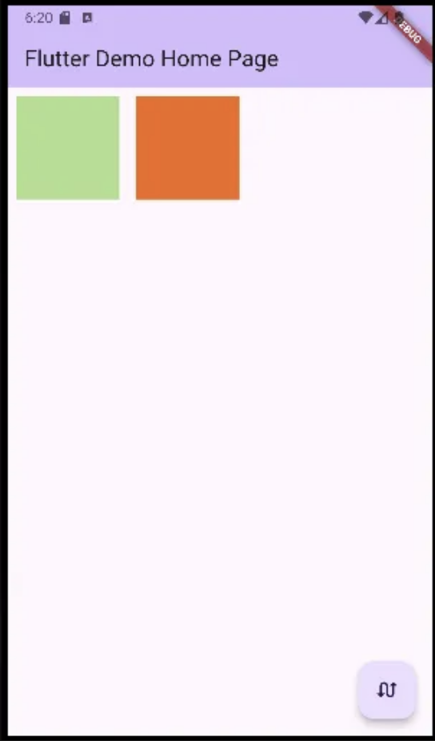
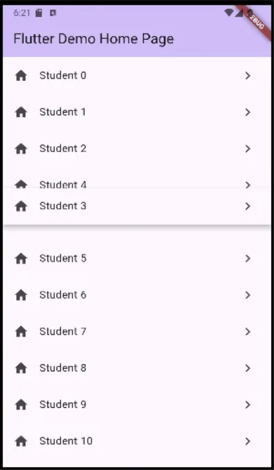
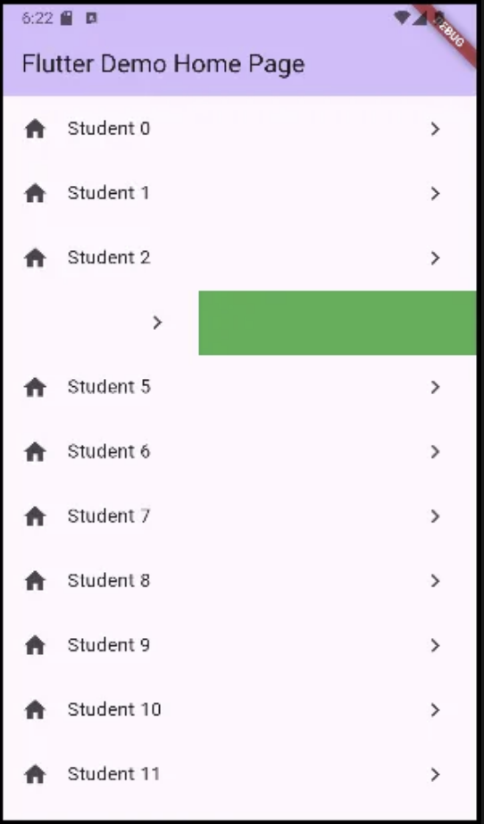

```dart
import 'dart:math';
import 'package:flutter/material.dart';

void main() {
  runApp(const MyApp());
}

class MyApp extends StatelessWidget {
  const MyApp({super.key});

  // This widget is the root of your application.
  @override
  Widget build(BuildContext context) {
    return MaterialApp(
      title: 'Flutter Demo',
      theme: ThemeData(
        colorScheme: ColorScheme.fromSeed(seedColor: Colors.deepPurple),
        useMaterial3: true,
      ),
      home: const MyHomePage(title: 'Flutter Demo Home Page'),
    );
  }
}

class MyHomePage extends StatefulWidget {
  const MyHomePage({super.key, required this.title});

  final String title;

  @override
  State<MyHomePage> createState() => _MyHomePageState();
}

class _MyHomePageState extends State<MyHomePage> {
  // mytile 타일을 바꾸는 순간 위에있는 부모의 자식들을 살펴보게 되는데
  // 그 자식들이 mytile밖에 없어서...
  // 의도대로 타일이 바뀌게 하려면
  // padding에 key 속성을 주어야 한다.
  List<Widget> mytiles = [Padding(
    key: UniqueKey(),
    padding: const EdgeInsets.all(8.0),
    child: MyTile(),
  ),Padding(
    key: UniqueKey(),
    padding: const EdgeInsets.all(8.0),
    child: MyTile(),
  )];
  @override
  Widget build(BuildContext context) {
    return Scaffold(
      appBar: AppBar(
        backgroundColor: Theme.of(context).colorScheme.inversePrimary,
        title: Text(widget.title),
      ),
      body: Row( // Row 바로 밑의 위젯이 padding 이니까!!
        children:
          mytiles,
      ),
      floatingActionButton:FloatingActionButton(
        child: const Icon(Icons.swap_calls),
        onPressed: () {
        setState(() {
          mytiles.insert(1, mytiles.removeAt(0));
        });}
      ),
    );
  }
}

class MyTile extends StatefulWidget {
  MyTile({super.key});

  @override
  State<MyTile> createState() => _MyTileState();
}

class _MyTileState extends State<MyTile> {
  final Color myColor = UniqueColorGenerator.getColor();

  @override
  Widget build(BuildContext context) {
    return Container(
      width: 100,
      height: 100,
      color: myColor,
    );
  }
}

class UniqueColorGenerator {
  static Random random = Random();
  static Color getColor() {
    return Color.fromARGB(
      255,random.nextInt(255),random.nextInt(255),random.nextInt(255)
    );
  }
}

```


```dart
import 'dart:math';
import 'package:flutter/material.dart';

void main() {
  runApp(const MyApp());
}

class MyApp extends StatelessWidget {
  const MyApp({super.key});

  // This widget is the root of your application.
  @override
  Widget build(BuildContext context) {
    return MaterialApp(
      title: 'Flutter Demo',
      theme: ThemeData(
        colorScheme: ColorScheme.fromSeed(seedColor: Colors.deepPurple),
        useMaterial3: true,
      ),
      home: const MyHomePage(title: 'Flutter Demo Home Page'),
    );
  }
}

class MyHomePage extends StatefulWidget {
  const MyHomePage({super.key, required this.title});

  final String title;

  @override
  State<MyHomePage> createState() => _MyHomePageState();
}

class _MyHomePageState extends State<MyHomePage> {
  List items = List.generate(20, (i) => i);
  @override
  Widget build(BuildContext context) {
    return Scaffold(
      appBar: AppBar(
        backgroundColor: Theme.of(context).colorScheme.inversePrimary,
        title: Text(widget.title),
      ),
      body: ReorderableListView.builder(
        // 모든 ReorderableListView는 키를 가지고 있어야 한다. 위치와 관련되어 있기에 민감한 이슈
        itemCount: items.length,
        itemBuilder: (c,i) { // context, iteration num
          return Dismissible( // 제거할수 있도록
            background: Container(color: Colors.green,),
            key: ValueKey(items[i]),
            direction: DismissDirection.endToStart,
            child: ListTile(
              title: Text('Student ${items[i]}'),
              leading: Icon(Icons.home),
              trailing: Icon(Icons.navigate_next),
            ),
            onDismissed: (direction) { // 왼쪽으로 밀때 제거가 된다.
              setState(() {
                items.removeAt(i);
                print(items);
              });
            },
          );
        },
        onReorder: (int oldIndex, int newIndex) {
          setState(() {
            if (oldIndex<newIndex){
              newIndex -= 1;
            }
            items.insert(newIndex, items.removeAt(oldIndex));
            print(items);
          });
        },
      ),
    );
  }
}
```


