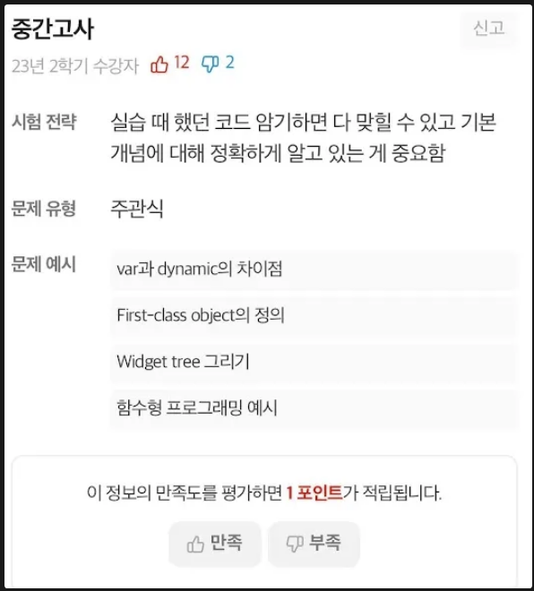
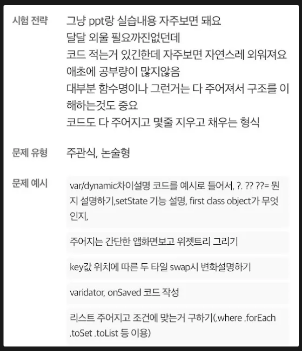

**일급 객체(First-class Object)**

일급 객체는 변수에 할당되거나, 함수의 매개변수로 전달되거나, 함수의 반환값으로 사용될 수 있습니다. 함수형 프로그래밍에서 함수는 일급 객체로 취급되며, 이러한 함수를 '일급 함수'라고 합니다. 또한, 함수형 프로그래밍에서는 함수를 매개변수로 받을 수 있는 '고차 함수(higher-order function)'도 자주 사용됩니다.
