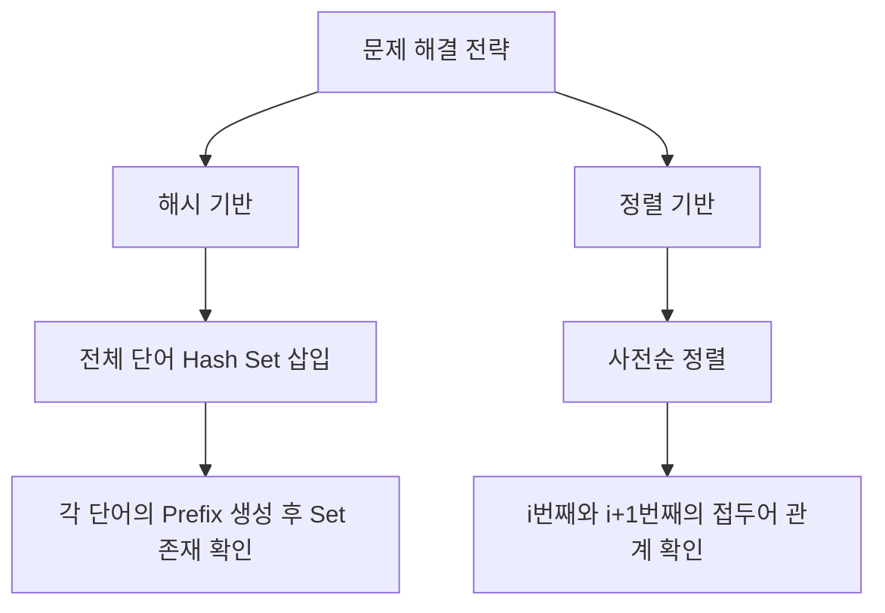

## 문제
전화번호 목록 [링크](https://school.programmers.co.kr/learn/courses/30/lessons/42577)
전화번호부에 적힌 전화번호 중, 한 번호가 다른 번호의 접두어인 경우가 있는지 확인하는 문제입니다.

- $N$ (전화번호 개수): 최대 1,000,000
- $L$ (전화번호 길이): 최대 20

문자열 문제인데 cpp로 해보는게 좋을것 같았음. 방법이 여러가지다.

## 복잡도 분석

### 1. Hash 방식
- **Time Complexity**: $O(N \cdot L^2)$
    - $N$개의 번호를 삽입($O(N \cdot L)$)하고, 각 번호마다 $L$개의 접두어를 생성하여 해시 셋에서 탐색($O(L)$)합니다.
- **Space Complexity**: $O(N \cdot L)$
    - 모든 문자열을 `unordered_set`에 저장합니다.

### 2. Sorting 방식
- **Time Complexity**: $O(L \cdot N \log N)$
    - 정렬에 $O(L \cdot N \log N)$이 소요되며, 이후 인접 원소 비교에 $O(N \cdot L)$이 소요됩니다.
- **Space Complexity**: $O(L)$
    - 정렬 시 발생하는 오버헤드 외에 추가 자료구조를 거의 사용하지 않습니다.

## 접근법

### 전략 1: 해시를 이용한 부분 문자열 탐색
모든 단어를 해시에 넣고, 각 단어의 모든 접두어가 해시에 있는지 묻는 방식입니다.

### 전략 2: 정렬을 이용한 인접 원소 비교
사전순으로 정렬하면 접두어 관계인 단어들은 반드시 붙어있게 된다는 성질을 이용합니다.



## 풀이

### [풀이 1] Hash 기반
```cpp
#include <string>
#include <vector>
#include <unordered_set>

using namespace std;

bool solution(vector<string> phone_book) {
    bool answer = true;
    unordered_set<string> s(phone_book.begin(), phone_book.end());
    for(const auto& e : phone_book){
        for(int i = 1; i < e.size(); i++){
            if (s.find(e.substr(0, i)) != s.end())
                return false;
        }
    }
    return answer;
}
```

### [풀이 2] Sorting 기반
```cpp
#include <string>
#include <vector>
#include <algorithm>

using namespace std;

bool solution(vector<string> phone_book) {
    bool answer = true;
    sort(phone_book.begin(), phone_book.end());
    for(int i = 0; i < phone_book.size() - 1; i++){
        // 앞의 번호가 뒤 번호의 접두어인지 확인
        if(phone_book[i] == phone_book[i+1].substr(0, phone_book[i].size()))
            return false;
    }
    return answer;
}
```

## Code Review

### 1. Hash vs Sorting
- **데이터 크기 관점**: $N=10^6$일 때, $N \log N$은 약 $2 \times 10^7$입니다. $L^2$은 $400$입니다. 두 방식 모두 시간 내에 충분히 들어오지만, **Sorting** 방식이 메모리 사용량 측면에서 훨씬 경제적입니다.
- **최적화**: Sorting 풀이에서 `substr()` 대신 `compare()` 또는 C++20의 `starts_with()`를 사용하면 불필요한 문자열 복사를 막아 성능을 극대화할 수 있습니다.

## trie
trie로 풀어보려고 공부중
