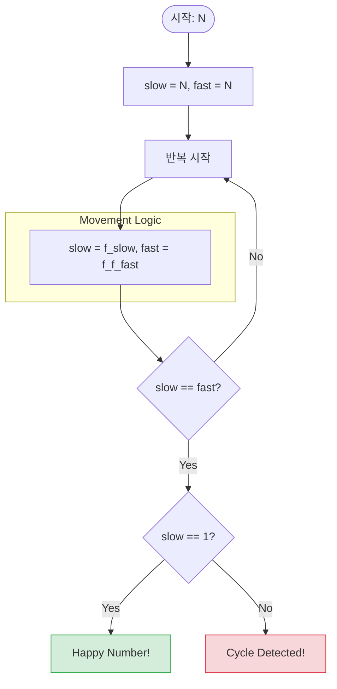

## Problem
정수 $N$에 "각 자릿수의 제곱의 합으로 대체"하는 연산을 반복하여 $1$이 되는지 판별.

$1 \le N \le 2026$.

숫자가 $1$이 되면 성공 (Yes), 아니라면 (No)

## Complexity Analysis

시간 복잡도: $O(K \log_{10} N)$
- $K$: $1$에 도달하거나 루프를 발견할 때까지의 단계 수. $N$의 범위가 매우 작으므로 $K$ 또한 매우 작은 상수 값에 가깝습니다.
- $\log_{10} N$: 각 단계에서 자릿수의 제곱합을 구하는 시간 (자릿수 개수).

공간 복잡도: $O(M)$
- $M$: 가능한 숫자의 최대 범위 ($2026$). 방문 처리를 위한 배열 크기에 비례합니다.

## Approach
어떻게 해야할지 몰라서 못풀었었다. 1이 되는 케이스가 아니라면 루프가 생긴다는것을 생각 못함.

주어진 숫자가 작고, 문제에서 주어진 자릿수 연산을 하면 숫자가 급격히 줄어들게 된다. 1999가 문제에서 주어진 연산을 했을때 가장 큰 숫자가 나오는 수가 된다.

계속 연산을 하다보면 숫자가 급격히 작아진 상태에서 루프를 돌거나, 1이 될 것이다. 루프를 돌게 된다는 생각을 못했는데 문제 예제에서 루프를 도는것 확인 가능.

비둘기집의 원리: $N=2026$일 때 첫 연산 결과는 $244$이며, 이후 모든 숫자는 이 범위 내에서 움직입니다. 유한한 범위 내에서 연산을 무한히 반복하면 반드시 같은 숫자가 다시 등장(Cycle)할 수밖에 없음을 활용합니다.

## solve
```cpp
#include<bits/stdc++.h>
#include<iostream>
using namespace std;

int add_num(int n){
    int res = 0;
    while (n > 0){
        res += (n%10)*(n%10);
        n /= 10;
    }
    return res;
}

int main(){
    ios::sync_with_stdio(0);
    cin.tie(0);cout.tie(0);

    int n; cin>>n;
    bool visited[2027] = {0,};
    visited[n] = true;

    while (true)
    {
        if (n==1) break;
        n = add_num(n);
        if(visited[n]) {
            cout << "No";
            return 0;
        }
        visited[n] = true;
    }
    cout << "Yes";

    return 0;
}
```
숫자가 커지면 set으로. 한번만 연산해도 숫자는 244 아래로 떨어지므로, 배열은 더 작게 해도 좋다


## 플로이드의 순환 알고리즘(Floyd's Cycle-finding Algorithm), 토끼와 거북이(Tortoise and Hare) 알고리즘

운동장 트랙에서 두 사람이 달린다고 상상해 보세요.

- 거북이(Slow): 한 번에 한 칸씩 이동합니다.
- 토끼(Fast): 한 번에 두 칸씩 이동합니다.

만약 트랙이 직선이라면 토끼는 영원히 거북이를 앞질러 멀어집니다. 하지만 트랙에 **사이클(원)**이 있다면, 속도가 더 빠른 토끼는 결국 거북이의 뒤를 따라잡아 서로 만나게 됩니다.



1. 초기화: slow와 fast 포인터를 모두 시작 숫자 $N$에 둡니다.
2. 이동:
    - slow는 함수를 한 번 적용한 값으로 바꿉니다. ($slow = f(slow)$)
    - fast는 함수를 두 번 적용한 값으로 바꿉니다. ($fast = f(f(fast))$)
3. 비교: slow와 fast가 같아질 때까지 반복합니다.
4. 결론:
    - 만약 두 포인터가 만난 지점이 1이라면, 수열이 1로 수렴한 것이므로 Yes.
    - 만약 두 포인터가 만난 지점이 1이 아니라면, 사이클에 진입하여 서로 만난 것이므로 No.

- 시간 복잡도 : $O(K)$
- 공간 복잡도 : $O(1)$ (변수 2개면 끝)

```cpp
#include <iostream>

using namespace std;

int get_next(int n) {
    int res = 0;
    while (n) {
        int d = n % 10;
        res += d * d;
        n /= 10;
    }
    return res;
}

bool isHappy(int n) {
    int slow = n;
    int fast = n;

    do {
        slow = get_next(slow);           // 한 칸 이동
        fast = get_next(get_next(fast)); // 두 칸 이동
        
        if (fast == 1) return true;      // 1에 도달하면 즉시 종료
    } while (slow != fast);              // 서로 만날 때까지 반복

    return slow == 1;
}

int main() {
    int n;
    cin >> n;
    if (isHappy(n)) cout << "Yes";
    else cout << "No";
    return 0;
}
```
공간을 최대한 줄인대신 연산량이 늘어난다.

이 방법은 언젠가 쓸일이 있지 않을까?

### 사이클이 시작되는 지점 알아내기
사이클의 존재 여부뿐만 아니라 **'사이클이 시작되는 지점(Cycle Entrance)'**을 정확히 찾아낼 수 있게 해줍니다. (P자 모양의 트랙을 생각)

1. 시각적 직관 (Geometric Interpretation)

먼저 상황을 기하학적으로 이해해 봅시다.
- L: 리스트의 시작점부터 사이클의 입구까지의 거리
- C: 사이클 전체의 길이
- x: 사이클 입구에서 토끼와 거북이가 처음 만난 지점($M$)까지의 거리
- C - x: 만난 지점($M$)에서 다시 사이클 입구까지 돌아가는 데 남은 거리

2. 수학적 유도 (Derivation Logic)
왜 한 명을 시작점으로 보내고 둘 다 한 칸씩 움직이면 입구에서 만나게 되는지 수식으로 증명해 보겠습니다.
- 거북이가 이동한 거리 ($d_{slow}$): $L + x$
- 토끼가 이동한 거리 ($d_{fast}$): $L + x + nC$ (여기서 $n$은 토끼가 사이클을 돈 횟수입니다.)
- 토끼의 속도는 거북이의 2배이므로 다음과 같은 식이 성립합니다:

$$d_{fast} = 2 \cdot d_{slow}$$

$$L + x + nC = 2(L + x)$$

$$L + x + nC = 2L + 2x$$

$$L = nC - x$$

다시 정리하면

$$L = (n-1)C + (C - x)$$

리스트 시작점부터 입구까지의 거리($L$)는, 사이클을 몇 바퀴 돌고($(n-1)C$) 남은 나머지 거리($C - x$)를 합친 것과 같습니다. $C-x$는 바로 만난 지점($M$)에서 사이클 입구까지 남은 거리입니다!

```cpp
struct Node {
    int data;
    Node* next;
};

Node* findCycleStart(Node* head) {
    if (!head || !head->next) return nullptr;

    Node* slow = head;
    Node* fast = head;

    // 1. Phase 1: 사이클 내의 만남 지점 찾기
    bool hasCycle = false;
    while (fast && fast->next) {
        slow = slow->next;
        fast = fast->next->next;
        if (slow == fast) {
            hasCycle = true;
            break;
        }
    }

    if (!hasCycle) return nullptr; // 사이클 없음

    // 2. Phase 2 & 3: 입구 찾기
    slow = head; // 하나를 시작점으로 보냄
    while (slow != fast) {
        slow = slow->next; // 한 칸씩 이동
        fast = fast->next; // 똑같이 한 칸씩 이동
    }

    return slow; // 두 포인터가 만난 곳이 입구
}
```
이 테크닉은 단순히 알고리즘 퍼즐에만 쓰이는 것이 아닙니다.

리소스 관리: OS나 서버 엔진에서 리소스 할당 그래프에 사이클이 생겼을 때, 어떤 프로세스가 '데드락(Deadlock)'의 근원인지 파악하는 데 유용합니다.

메모리 최적화: 방문 기록을 남길 수 없는(Read-only 메모리 등) 환경에서 구조적 결함을 찾아낼 수 있는 유일한 방법이기도 합니다.

이 원리를 적용해서 Happy Number 문제에서 루프가 시작되는 첫 번째 숫자를 찾을 수 있다는 것이다.

- 수열: $439 \rightarrow 106 \rightarrow 37 \rightarrow 58 \rightarrow 89 \rightarrow 145 \rightarrow 42 \rightarrow 20 \rightarrow 4 \rightarrow 16 \rightarrow \mathbf{37} \dots$

1. Phase 1 (만남): 토끼와 거북이가 이 수열을 따라가다가 루프 안의 어떤 숫자(예: 4)에서 만났다고 칩시다.
2. Phase 2 (재설정): 이제 거북이를 다시 맨 처음 숫자인 439로 보냅니다. 토끼는 만났던 자리인 4에 그대로 둡니다.
3. Phase 3 (동시 이동): 둘 다 한 칸씩만 움직입니다.
    - 거북이: $439 \rightarrow 106 \rightarrow \mathbf{37}$
    - 토끼: $4 \rightarrow 16 \rightarrow \mathbf{37}$
4. 결과: 둘은 정확히 루프가 시작되는 숫자인 37에서 다시 만나게 됩니다!

원점으로 돌리는 이유: 시작점에서 입구까지 가는 거리와, 루프 내부의 만남 지점에서 입구까지 가는 거리가 수학적으로 같도록 설계되었기 때문

아래 상황에서 사용
- 연결 리스트에 사이클이 있는지 확인하고, 있다면 그 시작 노드를 반환
- 특정 연산을 반복할 때 나타나는 수열에서 처음으로 반복되는 구간의 시작값을 찾아라
- 사이클의 길이는? - 둘이 만난 지점에서 한 명만 가만히 있고 다른 한 명이 다시 만날 때까지 돌면 된다
