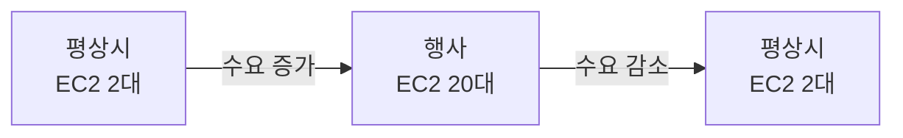
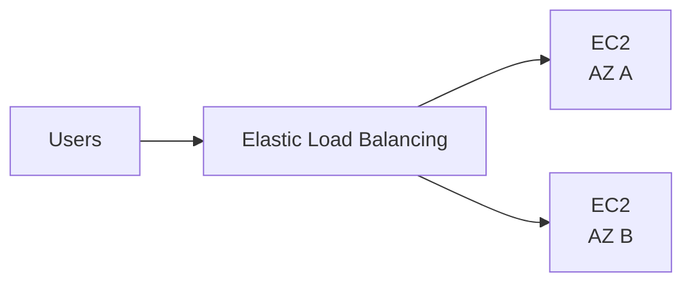
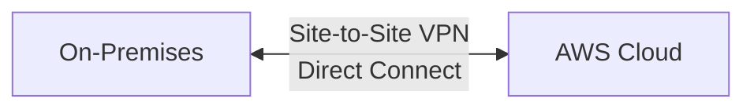
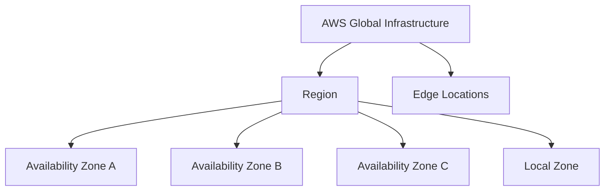
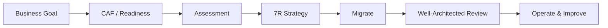

# 01. Cloud Concepts — 왜 AWS Cloud를 쓰는가

> **시험 비중:** Domain 1, 24%  
> **이 파일의 질문:** “Cloud가 왜 유리한가?”, “어떤 설계 원칙인가?”, “어떻게 이전하는가?”

CLF-C02는 직접 아키텍처를 구현하는 시험이 아니다. 상황의 핵심 요구를 읽고 **Cloud의 이점·설계 원칙·마이그레이션 전략·경제성 개념**을 고르는 시험이다.

## 1. Cloud Computing의 뜻

Cloud computing은 서버, 스토리지, 데이터베이스 같은 IT 리소스를 네트워크를 통해 **필요할 때 확보하고 사용량에 따라 비용을 지불**하는 방식이다.

| 구분 | On-Premises | AWS Cloud |
|---|---|---|
| 자원 확보 | 장비를 구매·설치 | 필요할 때 프로비저닝 |
| 비용 | 큰 선투자, 고정 비용 중심 | 사용량 기반 가변 비용 중심 |
| 용량 | 미래 수요를 미리 예측 | 수요에 맞춰 조정 |
| 물리 인프라 | 고객이 운영 | AWS가 운영 |
| 출시 속도 | 조달에 수주~수개월 가능 | 분 단위로 시작 가능 |

**용어 설명**

- **Provisioning**: 사용할 IT 리소스를 준비하고 할당하는 일
- **Pay-as-you-go**: 사용한 양에 따라 지불하는 종량제
- **Managed service**: 설치·패치·백업 등 운영의 일부를 AWS가 맡는 서비스

### Cloud의 다섯 가지 일반 특성

| 특성 | 뜻 | 문제의 단서 |
|---|---|---|
| On-demand self-service | 필요할 때 직접 리소스를 확보 | 승인·조달 대기 없음 |
| Broad network access | 네트워크를 통해 다양한 장치에서 접근 | 어디서나 접근 |
| Resource pooling | 공급자 자원을 여러 고객에게 논리적으로 분리해 제공 | Multi-tenant |
| Rapid elasticity | 수요에 맞춰 빠르게 확보·반납 | 급증 후 감소 |
| Measured service | 사용량을 측정해 과금 | 종량제 |

## 2. AWS Cloud의 핵심 이점

### 2.1 Scalability와 Elasticity

- **Scalability(확장성)**: 더 큰 부하를 처리하도록 용량을 키울 수 있는 능력
- **Elasticity(탄력성)**: 수요 변화에 맞춰 용량을 빠르게 늘리고 다시 줄이는 능력

Elasticity 자체가 반드시 “자동”만을 뜻하는 것은 아니다. AWS에서는 **Auto Scaling**으로 자동화하는 경우가 대표적이다.

| 방식 | 뜻 | 예 |
|---|---|---|
| Vertical scaling, scale up | 한 서버를 더 크게 | 2 vCPU → 16 vCPU |
| Horizontal scaling, scale out | 서버 수를 늘림 | EC2 2대 → 20대 |
| Scale in | 서버 수를 줄임 | 행사 종료 후 20대 → 2대 |



**시험 예제:** “연말에만 트래픽이 15배 증가하고 이후 다시 감소한다.” → **Elasticity**

### 2.2 Agility와 Speed of Deployment

**Agility(민첩성)**는 리소스를 빠르게 만들고 실험하여 출시 시간을 단축하는 능력이다.

```text
On-Premises: 구매 → 배송 → 설치 → 설정 → 배포
AWS Cloud:   콘솔/API/IaC → 생성 → 배포
```

문제에 **실험**, **몇 분 안에 시작**, **time to market**이 나오면 Agility를 생각한다.

### 2.3 High Availability와 Fault Tolerance

- **High Availability(고가용성)**: 장애 시간을 최소화해 서비스를 계속 사용할 수 있게 설계
- **Fault Tolerance(장애 허용)**: 구성 요소 장애가 발생해도 중단 없이 계속 동작하도록 더 강하게 설계



단일 데이터센터 장애 대응의 대표 답은 **여러 Availability Zone 사용**이다.

### 2.4 Global Reach

여러 Region과 Edge Location을 이용해 전 세계 사용자 가까이 서비스할 수 있다.

- 사용자 지연 시간 감소
- 여러 국가로 빠르게 확장
- 데이터 주권·규제 요구 대응
- 재해 복구와 비즈니스 연속성 설계

### 2.5 운영 부담 감소

서비스가 더 관리형일수록 고객이 관리하는 기반 계층이 줄어든다.

| 서비스 | 고객이 주로 관리 | AWS가 추가로 관리하는 영역 |
|---|---|---|
| EC2 | Guest OS, 앱, 데이터 | 물리 서버, 가상화 |
| RDS | 데이터, DB 계정, 접근 설정 | DB 인프라, 백업·패치 기능 |
| Lambda | 코드, 데이터, 권한 | 서버와 실행 인프라 |

데이터와 접근 권한까지 자동으로 AWS 책임이 되는 것은 아니다.

## 3. Cloud 서비스·배포 모델

### IaaS / PaaS / SaaS

| 모델 | 고객의 초점 | 공급자가 관리하는 범위 | 대표 예 |
|---|---|---|---|
| IaaS | OS부터 애플리케이션까지 | 물리 인프라·가상화 | Amazon EC2 |
| PaaS | 코드와 데이터 | 인프라·플랫폼 | Elastic Beanstalk 계열 |
| SaaS | 완성된 기능 사용 | 애플리케이션까지 | 웹 메일·협업 도구 |

Lambda는 보통 **FaaS/serverless compute**로 표현한다. 시험에서는 “서버 관리 없이 코드 실행”이 핵심이다.

### Public / Private / Hybrid / Multi-Cloud

| 모델 | 뜻 | 기억할 점 |
|---|---|---|
| Public Cloud | 공급자가 소유한 Cloud를 여러 고객에게 제공 | 논리적으로 격리 |
| Private Cloud | 한 조직만을 위한 Cloud 환경 | 통제성 높고 직접 운영 부담 가능 |
| Hybrid Cloud | On-Premises와 Public Cloud를 함께 사용 | VPN, Direct Connect, Outposts 등 |
| Multi-Cloud | 둘 이상의 Cloud provider 사용 | Hybrid와 다른 축의 개념 |

> VPC나 Dedicated Host를 사용한다고 AWS Public Cloud 자체가 Private Cloud로 바뀌는 것은 아니다. 이들은 AWS 안에서 네트워크 또는 물리 호스트 격리 요구를 충족하는 기능이다.



## 4. AWS Global Infrastructure



| 구성 요소 | 정확한 역할 | 선택 단서 |
|---|---|---|
| Region | 지리적으로 분리된 AWS 서비스 영역 | 데이터 주권, 가격, 서비스 가용성, 사용자 거리 |
| Availability Zone | Region 안의 하나 이상의 독립 데이터센터 | Multi-AZ 고가용성 |
| Edge Location | 사용자 가까이 콘텐츠·글로벌 서비스를 전달하는 거점 | CloudFront, 낮은 전송 지연 |
| Local Zone | Region을 대도시 가까이 확장한 일부 컴퓨팅·스토리지 위치 | 초저지연 워크로드 |

### Region을 고르는 기준

1. 법률·데이터 주권
2. 사용자와의 거리와 latency
3. 필요한 서비스 제공 여부
4. 가격

### Multi-AZ vs Multi-Region

| Multi-AZ | Multi-Region |
|---|---|
| 한 Region 안의 데이터센터 장애 대응 | Region 규모 재해·글로벌 사용자·데이터 주권 대응 |
| 고가용성의 대표 패턴 | 재해 복구·비즈니스 연속성에 사용 가능 |
| 상대적으로 가까운 AZ 간 구성 | 더 복잡하고 비용이 커질 수 있음 |

## 5. AWS Well-Architected Framework

워크로드를 모범 사례에 따라 **검토하고 개선**하기 위한 프레임워크다.

| Pillar | 핵심 질문 | 대표 단서 |
|---|---|---|
| Operational Excellence | 운영을 관찰하고 개선하는가? | 자동화, 작은 변경, 운영 절차 개선 |
| Security | 데이터·시스템·자산을 보호하는가? | 최소 권한, 암호화, 추적 |
| Reliability | 장애에서 복구하고 수요를 처리하는가? | Multi-AZ, 백업, 자동 복구 |
| Performance Efficiency | 적절한 기술을 효율적으로 쓰는가? | 워크로드에 맞는 자원 선택 |
| Cost Optimization | 불필요한 비용을 없앴는가? | rightsizing, idle 자원 제거 |
| Sustainability | 환경 영향을 줄이는가? | 자원 사용 효율, 불필요한 처리 축소 |

**예제**

- 반복 배포를 자동화하고 실패를 학습에 반영 → Operational Excellence
- 암호화와 최소 권한 적용 → Security
- 여러 AZ에 배치 → Reliability
- 서버리스로 실제 사용량에 맞춰 자원 사용 → Performance Efficiency 또는 Cost Optimization; 문제의 강조점을 본다.

## 6. AWS Cloud Adoption Framework(CAF)

Well-Architected가 **워크로드 설계**를 묻는다면 CAF는 **조직의 Cloud 전환**을 다룬다.

| CAF Perspective | 핵심 질문 | 대표 이해관계자/활동 |
|---|---|---|
| Business | 어떤 비즈니스 가치를 만드는가? | CEO, CFO, 전략·성과 |
| People | 조직과 역량이 준비되었는가? | HR, 교육, 역할 변화 |
| Governance | 가치·위험·비용을 어떻게 통제하는가? | 정책, 포트폴리오, 재무 |
| Platform | Cloud 기반을 어떻게 구축하는가? | CTO, 아키텍처, 마이그레이션 |
| Security | 기밀성·무결성·가용성을 어떻게 보호하는가? | CISO, 보안 통제 |
| Operations | 워크로드를 어떻게 운영·복구하는가? | 모니터링, 장애 대응 |

```text
CAF              = 조직이 Cloud로 전환할 준비와 방법
Well-Architected = 개별 workload를 잘 설계·운영하는 기준
```

## 7. Migration — 평가에서 개선까지



### Assessment와 TCO

Assessment는 단순히 서버 수만 세는 일이 아니다.

- CPU·메모리·스토리지 사용률과 peak
- OS·DB·애플리케이션 의존성
- 네트워크와 보안 요구
- 라이선스
- 전력·냉각·시설·인력까지 포함한 현재 비용

**TCO(Total Cost of Ownership)**는 구매 가격뿐 아니라 운영 기간 전체의 비용을 본다.

```text
절감률 = (현재 운영비 - AWS 예상 운영비) / 현재 운영비 × 100
```

원본 장표의 23.3억 원과 16.8억 원은 계산법을 보여 주는 가상 예시일 뿐 실제 할인 보장이 아니다.

### 7R Migration Strategies

원본 강의의 6R에 AWS의 현재 7R 분류인 **Relocate**를 보완한다.

| 전략 | 한 줄 뜻 | 예 |
|---|---|---|
| Rehost | 거의 변경 없이 이동 | VM → EC2, lift and shift |
| Relocate | 같은 플랫폼을 유지하며 인프라 묶음을 이동 | 기존 가상화 환경을 유사 환경으로 이전 |
| Replatform | 핵심 구조는 유지하고 일부 최적화 | 직접 운영 DB → 같은 엔진의 RDS |
| Repurchase | 다른 제품, 주로 SaaS로 교체 | 자체 CRM → SaaS |
| Refactor / Re-architect | Cloud-native하게 구조 재설계 | monolith → microservices |
| Retire | 불필요한 시스템 폐기 | 미사용 앱 종료 |
| Retain | 지금은 이전하지 않고 유지 | 규제·의존성 때문에 On-Premises 유지 |

### 주요 Migration 도구

| 요구 | 서비스/도구 |
|---|---|
| 환경 발견·의존성 수집 | AWS Application Discovery Service |
| TCO와 비즈니스 사례 평가 | Migration Evaluator |
| 여러 마이그레이션 진행 추적 | AWS Migration Hub |
| 서버·애플리케이션 이전 | AWS Application Migration Service |
| DB 데이터 이동·지속 복제 | AWS Database Migration Service(DMS) |
| 서로 다른 DB 엔진의 schema 변환 | AWS Schema Conversion Tool(SCT) |
| 네트워크가 어려운 대용량 데이터 | AWS Snow Family |

## 8. Cloud Economics

### CAPEX → OPEX, Fixed → Variable

| 개념 | 뜻 | 예 |
|---|---|---|
| CAPEX | 자산을 위한 큰 선투자 | 서버·데이터센터 구매 |
| OPEX | 운영하면서 발생하는 비용 | 월별 Cloud 사용료 |
| Fixed cost | 사용량과 관계없이 미리 발생 | 시설·장비 |
| Variable cost | 사용량에 따라 변함 | 컴퓨팅 실행 시간·스토리지 사용량 |

Cloud의 이점은 **CAPEX가 무조건 사라진다**가 아니라, 큰 고정 선투자를 줄이고 가변 비용으로 전환할 수 있다는 데 있다.

### Economies of Scale

AWS가 수많은 고객의 수요를 모아 대규모로 인프라를 운영하여 개별 조직보다 낮은 단위 비용을 제공할 수 있는 효과다.

### Rightsizing

워크로드에 맞는 리소스 크기·유형을 선택한다.

```text
평균 CPU 5%인 큰 인스턴스
        ↓
더 작은 적합한 인스턴스
        ↓
낭비 감소
```

### BYOL vs License Included

- **BYOL(Bring Your Own License)**: 기존 라이선스를 조건에 맞게 AWS에서 사용
- **License Included**: 서비스 요금에 소프트웨어 라이선스가 포함

라이선스 이동 가능 여부는 제품 계약에 따라 다르므로 시험에서는 두 모델의 개념만 구별한다.

## 9. 시험 문제를 푸는 방식

**상황:** “물리 장비 구매 없이 새 아이디어를 오늘 시험한다.”  
**단서:** 빠른 프로비저닝, 실험  
**답:** Agility

**상황:** “데이터센터 한 곳 장애에도 계속 서비스한다.”  
**단서:** 한 Region 안의 독립 위치  
**답:** Multi-AZ

**상황:** “기존 앱을 거의 수정하지 않고 빠르게 EC2로 옮긴다.”  
**단서:** lift and shift  
**답:** Rehost

**상황:** “조직·사람·거버넌스를 포함해 Cloud 전환을 준비한다.”  
**답:** AWS CAF

## References

- [AWS CLF-C02 시험 가이드](https://docs.aws.amazon.com/aws-certification/latest/cloud-practitioner-02/cloud-practitioner-02.html)
- [CLF-C02 Domain 1](https://docs.aws.amazon.com/aws-certification/latest/cloud-practitioner-02/cloud-practitioner-02-domain1.html)
- [AWS의 7R 마이그레이션 전략](https://docs.aws.amazon.com/prescriptive-guidance/latest/large-migration-guide/migration-strategies.html)
- 원본: `day1/1.1.md`~`day1/2.2.md`, `day2/2.3.md` 및 참조 이미지

---

## 반드시 알아야 할 핵심 비교

| 비교 | A | B |
|---|---|---|
| Scalability vs Elasticity | 더 큰 부하를 처리할 확장 능력 | 수요에 맞춰 빠르게 늘고 줄임 |
| High Availability vs Fault Tolerance | 중단 최소화 | 장애 중에도 계속 동작하는 더 강한 목표 |
| Region vs AZ | 지리적 서비스 영역 | Region 안의 독립 데이터센터 묶음 |
| Multi-AZ vs Multi-Region | 데이터센터 장애 대응 | Region 재해·글로벌·주권 대응 |
| CAF vs Well-Architected | 조직의 Cloud 전환 | 워크로드 설계·운영 검토 |
| Rehost vs Replatform | 거의 그대로 이동 | 일부 Cloud 최적화 |
| CAPEX vs OPEX | 선투자 자본 지출 | 운영 중 사용 비용 |

## 시험에서 헷갈리는 서비스

| 단서 | 정답 | 헷갈리는 오답 |
|---|---|---|
| 마이그레이션 전체 진행 추적 | Migration Hub | Application Migration Service는 실제 서버 이전 |
| 현재 환경 발견·의존성 수집 | Application Discovery Service | Migration Evaluator는 TCO 평가 중심 |
| DB 데이터 이동·복제 | DMS | SCT는 schema 변환 |
| 대용량 오프라인 전송 | Snow Family | Direct Connect는 전용 네트워크 연결 |
| 조직의 도입 준비 | AWS CAF | Well-Architected는 워크로드 검토 |

## 최종 암기표

| 키워드 | 한 줄 암기 |
|---|---|
| Pay-as-you-go | 사용한 만큼 지불 |
| Agility | 빠르게 만들고 실험 |
| Scalability | 더 큰 규모 처리 |
| Elasticity | 수요에 맞춰 늘리고 줄임 |
| Multi-AZ | 고가용성 |
| Multi-Region | DR·글로벌·데이터 주권 |
| CAF | Business, People, Governance, Platform, Security, Operations |
| Well-Architected | 운영, 보안, 신뢰성, 성능 효율, 비용, 지속 가능성 |
| 7R | Rehost, Relocate, Replatform, Repurchase, Refactor, Retire, Retain |
| TCO | 시설·전력·인력·라이선스까지 포함한 총소유비용 |
| Rightsizing | 워크로드에 맞는 크기 선택 |
| Economies of Scale | AWS의 규모로 단위 비용 절감 |
