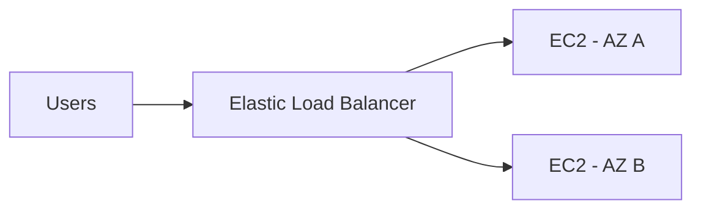
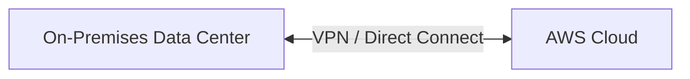
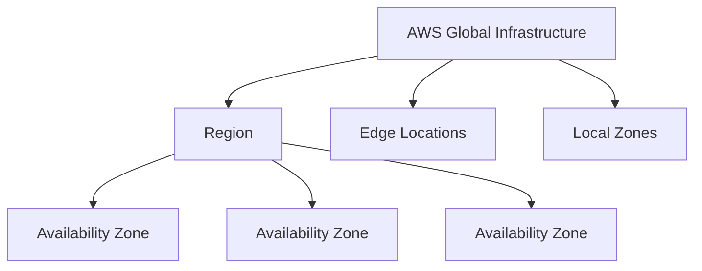
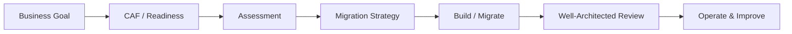

## 0. 시험에서 이 파일이 담당하는 범위

CLF-C02 Domain 1은 **Cloud Concepts (24%)**다.

핵심은 다음 네 가지다.

1. AWS Cloud의 이점
2. AWS Well-Architected Framework의 설계 원칙
3. AWS로의 마이그레이션 이점과 전략
4. Cloud Economics

시험은 아키텍처를 직접 설계하거나 구현하는 시험이 아니다.  
주어진 상황에서 **왜 Cloud가 유리한지**, **어떤 원칙/전략에 해당하는지**를 식별하는 문제가 중심이다.

---

# 1. Cloud Computing의 핵심

## On-Premises vs Cloud

| 구분 | On-Premises | Cloud |
|---|---|---|
| 인프라 | 직접 구매/설치 | 필요할 때 임대 |
| 초기 비용 | 큼 | 작음 |
| 확장 | 장비 구매 필요 | 빠르게 확장 |
| 유지보수 | 직접 수행 | 물리 인프라는 AWS가 관리 |
| 과금 | 선투자 중심 | 사용량 기반 |
| 구축 속도 | 느림 | 빠름 |

### 한 줄 기억

- **On-Premises** = 서버/스토리지/네트워크를 내가 소유·운영
- **Cloud** = 인터넷을 통해 필요한 IT 리소스를 필요할 때 사용
- **Pay-as-you-go** = 사용한 만큼 지불

---

# 2. Cloud의 5가지 일반 특성

Cloud의 다섯 가지 일반 특성을 시험 관점으로 정리한다.

| 특성 | 의미 | 시험 키워드 |
|---|---|---|
| On-demand self-service | 승인 대기 없이 필요할 때 리소스 생성 | 즉시 프로비저닝 |
| Broad network access | 네트워크를 통해 다양한 장치에서 접근 | 인터넷/네트워크 접근 |
| Resource pooling | 공급자의 물리 자원을 여러 고객이 공유 | Multi-tenant |
| Rapid elasticity | 수요에 따라 빠르게 늘고 줄어듦 | 자동 확장/축소 |
| Measured service | 사용량을 계량하고 그에 따라 과금 | 종량제 |

> 주의: AWS 시험에서는 이 다섯 개를 정의 자체로 묻기보다 **탄력성, 민첩성, 종량제** 같은 가치 제안으로 자주 바꿔 묻는다.

---

# 3. AWS Cloud의 대표 이점

## 3.1 Scalability — 확장성

서비스 성장에 맞춰 처리 능력을 증가시킬 수 있는 능력.

### Vertical Scaling (Scale Up)

한 서버 자체를 크게 만든다.

```text
2 vCPU / 4 GB
      ↓
8 vCPU / 32 GB
```

### Horizontal Scaling (Scale Out)

서버 개수를 늘린다.

```text
EC2 1대
   ↓
EC2 10대
```

AWS에서는 ELB + Auto Scaling과 함께 수평 확장을 자주 사용한다.

---

## 3.2 Elasticity — 탄력성

**수요가 변하면 리소스가 늘었다가 다시 줄어드는 능력**.

```text
평상시: EC2 2대
       ↓
이벤트: EC2 20대
       ↓
종료 후: EC2 2대
```

### Scalability vs Elasticity

| 개념 | 핵심 |
|---|---|
| Scalability | 더 큰 규모를 처리할 수 있도록 확장할 수 있는 능력 |
| Elasticity | 수요 변화에 따라 동적으로 늘고 줄어드는 능력 |

시험 문장에서 **“수요가 급증했다가 다시 감소”**, **“자동으로 추가/제거”**가 나오면 Elasticity를 먼저 생각한다.

---

## 3.3 Agility — 민첩성

새로운 리소스와 서비스를 빠르게 만들고 실험할 수 있는 능력.

On-Premises:

```text
장비 주문 → 배송 → 랙 설치 → OS 설치 → 네트워크 → 배포
```

AWS:

```text
콘솔/API/IaC → 리소스 생성 → 배포
```

**Time to market 단축**과 연결해서 기억한다.

---

## 3.4 High Availability — 고가용성

한 구성 요소가 장애 나도 서비스를 계속 제공하는 설계.

대표 패턴:



**여러 Availability Zone 사용**이 대표적인 고가용성 키워드다.

---

## 3.5 Global Reach — 글로벌 도달 범위

전 세계 여러 Region/Edge Location을 이용해 사용자 가까이 서비스를 배치할 수 있다.

장점:

- 지연 시간 감소
- 글로벌 서비스 출시 속도 향상
- 국가/지역별 데이터 요구 대응
- 장애 분산 가능

---

## 3.6 Managed Services의 운영 부담 감소

AWS가 인프라나 서비스 일부를 대신 관리한다.

예:

- EC2: 물리 서버/가상화는 AWS, OS 이상은 고객 책임이 큼
- RDS: DB 엔진 설치, 기본 패치/백업 등 상당 부분을 AWS가 관리
- Lambda: 서버/OS 운영 부담을 더 줄임

서비스가 더 관리형일수록 고객이 직접 운영하는 영역은 일반적으로 줄어든다.

---

# 4. CAPEX vs OPEX / Fixed vs Variable Cost

## CAPEX

Capital Expenditure, 자본 지출.

```text
서버 구매
스토리지 구매
네트워크 장비 구매
데이터센터 구축
```

특징:

- 큰 초기 투자
- 사용량과 무관하게 이미 비용 발생
- 용량 예측 실패 시 과잉 투자 가능

## OPEX

Operational Expenditure, 운영 지출.

AWS에서는 필요한 리소스를 사용하고 사용량에 따라 비용을 지불하는 방식이 대표적이다.

| CAPEX | OPEX |
|---|---|
| 장비 구매 | 리소스 사용료 |
| 큰 선투자 | 사용량 기반 |
| 용량을 미리 예측 | 필요할 때 확장 |
| 자산 유지보수 | 관리형 서비스 활용 가능 |

---

## Fixed Cost → Variable Cost

Cloud Economics에서 중요한 표현.

- **Fixed cost**: 데이터센터, 서버 구매 등 미리 발생하는 고정 비용
- **Variable cost**: 실제 사용량에 따라 변하는 비용

AWS Cloud의 가치 중 하나는 **큰 고정 비용을 가변 비용으로 바꾸는 것**이다.

---

## Economies of Scale — 규모의 경제

AWS는 매우 큰 규모로 인프라를 구매·운영하므로 개별 기업이 직접 구축하는 것보다 단위 비용을 낮출 수 있다.

시험 문장:

> 수많은 고객의 사용량을 집계해 더 낮은 가변 비용을 제공한다.

→ **Economies of Scale**

---

## Rightsizing — 적정 규모 조정

워크로드에 맞는 적절한 인스턴스/리소스 크기를 선택한다.

예:

```text
t3.2xlarge
CPU 평균 5%
     ↓
더 작은 인스턴스로 변경
     ↓
비용 절감
```

Cost Optimization과 매우 자주 연결된다.

---

## BYOL vs License Included

- **BYOL (Bring Your Own License)**: 기존 보유 라이선스를 AWS 환경에서 사용
- **License Included**: AWS 요금에 소프트웨어 라이선스 비용이 포함

Cloud Economics 문제에서 라이선스 전략을 구별할 수 있어야 한다.

---

# 5. Service Model — IaaS / PaaS / SaaS

| 모델 | 사용자가 주로 관리 | 공급자가 더 많이 관리 | 예시 |
|---|---|---|---|
| IaaS | OS, 미들웨어, 앱 | 물리 인프라/가상화 | EC2 |
| PaaS | 주로 애플리케이션 | 인프라+플랫폼 | Elastic Beanstalk 등 |
| SaaS | 사용만 함 | 거의 전체 | 완성형 소프트웨어 |

### 기억

- **IaaS**: 가장 자유도가 높고 운영 책임도 큼
- **PaaS**: 인프라 운영을 줄이고 코드/앱에 집중
- **SaaS**: 완성된 소프트웨어를 사용

> Lambda는 “Serverless/FaaS”로 보는 것이 가장 정확하다. 시험에서 서비스 모델 비교 시 PaaS에 가깝게 설명되는 자료가 있어도, 핵심은 **서버 관리 없이 코드 실행**이다.

---

# 6. Deployment Model

## Public Cloud

클라우드 서비스 제공자가 소유한 인프라를 여러 고객에게 제공.

- AWS가 대표적
- 빠른 구축
- 사용량 기반
- 물리 자원은 공유될 수 있지만 고객 환경은 논리적으로 격리

## Private Cloud

하나의 조직을 위해 전용으로 사용하는 클라우드 환경.

- 통제성 높음
- 비용/운영 부담 큼
- 규제/전용 환경 요구에 적합할 수 있음

## Hybrid Cloud

**On-Premises + Public Cloud를 함께 사용**.



대표 AWS 서비스:

- AWS Site-to-Site VPN
- AWS Direct Connect
- AWS Storage Gateway
- AWS Outposts
- AWS Systems Manager

## Multi-Cloud

AWS + Azure + Google Cloud 등 **둘 이상의 Cloud Provider**를 함께 사용하는 전략.

CLF-C02 핵심 출제 범위는 Public/Private/Hybrid가 더 중요하다.

---

# 7. AWS Global Infrastructure

핵심 관계를 다음 구조로 기억하면 된다.



---

## 7.1 Region

지리적으로 분리된 AWS 서비스 영역.

Region 선택 이유:

- 사용자와의 거리 / latency
- 가격
- 서비스 제공 여부
- 데이터 주권 / 규제
- 재해 복구 전략

---

## 7.2 Availability Zone (AZ)

Region 안에 존재하는 **하나 이상의 독립적인 데이터센터 묶음**.

특징:

- 독립적인 전력/네트워크 설계
- 같은 Region 안의 다른 AZ와 저지연 연결
- 여러 AZ에 배치하면 고가용성 향상

### 시험

> 데이터센터 장애에도 애플리케이션이 계속 동작해야 한다.

→ **Multi-AZ**

---

## 7.3 Edge Location

사용자 가까이 콘텐츠를 캐시/전달하는 거점.

대표 연결:

- CloudFront
- Route 53 등 글로벌 네트워크 서비스

```text
S3/Origin → CloudFront → Edge Location → User
```

---

## 7.4 Local Zone

특정 대도시 가까이에 컴퓨팅/스토리지 일부를 배치해 매우 낮은 지연을 제공.

용도 예:

- 실시간 게임
- 미디어
- AR/VR
- 초저지연 애플리케이션

CCP에서는 Region/AZ/Edge Location보다 우선순위가 낮다.

---

# 8. AWS Well-Architected Framework

좋은 AWS 아키텍처를 평가·개선하기 위한 모범 사례 프레임워크.

6 Pillars:

| Pillar | 핵심 질문 | 키워드 |
|---|---|---|
| Operational Excellence | 운영을 어떻게 개선할까? | 자동화, 관찰, 개선 |
| Security | 어떻게 안전하게 보호할까? | IAM, 암호화, 로그 |
| Reliability | 장애에도 계속 동작할까? | 복구, Multi-AZ, 자동화 |
| Performance Efficiency | 리소스를 효율적으로 사용할까? | 적절한 기술/확장 |
| Cost Optimization | 낭비를 줄였는가? | Rightsizing, 불필요 자원 제거 |
| Sustainability | 환경 영향을 줄였는가? | 효율적 자원 사용 |

### 시험용 연결

- 자동 배포/운영 개선 → Operational Excellence
- 데이터 암호화/최소 권한 → Security
- 장애 복구/Multi-AZ → Reliability
- 워크로드에 적합한 인스턴스/서비스 → Performance Efficiency
- Idle resource 제거 → Cost Optimization
- 리소스 사용 효율/탄소 영향 → Sustainability

---

# 9. AWS Cloud Adoption Framework (CAF)

기업이 AWS를 기술적으로만이 아니라 **조직 전체 관점에서 도입하도록 돕는 프레임워크**.

6 Perspectives:

| Perspective | 핵심 |
|---|---|
| Business | 비즈니스 가치, ROI, 목표 |
| People | 조직, 역할, 교육, 역량 |
| Governance | 정책, 비용, 리스크, 규정 |
| Platform | 인프라/애플리케이션 설계 |
| Security | IAM, 보호, 감사, 위협 대응 |
| Operations | 모니터링, 운영, 장애 대응 |

### CAF vs Well-Architected

| CAF | Well-Architected |
|---|---|
| 조직이 Cloud를 **도입/전환**하는 관점 | 구축된 workload를 **잘 설계/운영**하는 관점 |
| Business/People/Governance 포함 | 6 Architecture Pillars |
| Transformation 전략 | Architecture Best Practices |

---

# 10. Migration의 큰 흐름

마이그레이션의 전체 흐름을 시험 관점으로 압축하면:



---

## 10.1 Assessment

현재 환경(As-Is)을 파악한다.

예:

- 서버 수
- CPU/Memory 사용률
- 스토리지
- 네트워크
- OS/DB
- 라이선스
- 사용률/피크
- 비용

목적:

1. 무엇을 옮길지
2. 어떤 방식으로 옮길지
3. 비용/위험이 어떻게 바뀔지

를 결정하기 위한 자료를 만든다.

### 관련 서비스/도구

- Migration Evaluator
- AWS Application Discovery Service
- AWS Migration Hub

---

# 11. Migration Strategy — 6R

| 전략 | 의미 | 예 |
|---|---|---|
| Rehost | 거의 그대로 이전 | VM → EC2, Lift & Shift |
| Replatform | 일부 플랫폼 개선 | 자체 DB → RDS |
| Repurchase | SaaS/새 제품으로 교체 | 자체 솔루션 → SaaS |
| Refactor / Re-architect | 구조 자체를 재설계 | Monolith → Microservices |
| Retire | 사용 중단 | 불필요 시스템 제거 |
| Retain | 당분간 유지 | 규제/기술 이유로 On-Prem 유지 |

### 빠른 구별

- **그대로 옮김** → Rehost
- **조금 개선해서 옮김** → Replatform
- **제품 자체를 바꿈** → Repurchase
- **코드/아키텍처를 크게 재설계** → Refactor
- **버림** → Retire
- **안 옮김** → Retain

---

# 12. Migration 관련 주요 서비스 한 줄 정리

| 서비스 | 용도 |
|---|---|
| AWS Application Migration Service | 서버/애플리케이션을 AWS로 마이그레이션 |
| AWS Database Migration Service (DMS) | DB 데이터를 최소 다운타임으로 이동/복제 |
| AWS Schema Conversion Tool (SCT) | 서로 다른 DB 엔진 간 스키마 변환 지원 |
| AWS Snow Family | 네트워크로 옮기기 어려운 대용량 데이터 전송 |
| AWS Storage Gateway | On-Premises와 AWS Storage 연동 |
| AWS Direct Connect | 전용 네트워크 연결 |
| Migration Evaluator | TCO/현재 환경 평가 |
| AWS Migration Hub | 마이그레이션 진행 상황 통합 추적 |

---

# 13. Cloud Economics 시험 포인트

## On-Premises에서 발생하는 비용

단순 서버 가격만 보지 않는다.

- 서버
- 스토리지
- 네트워크
- 데이터센터 공간
- 전력
- 냉각
- 인력
- 유지보수
- 라이선스
- 장비 교체
- DR 설비

Cloud 전환의 경제성은 **TCO(Total Cost of Ownership)** 관점으로 본다.

---

## Automation의 경제적 효과

자동화는 단순히 “편리함”만이 아니다.

- 수동 작업 감소
- 사람 실수 감소
- 배포 속도 향상
- 운영 비용 감소
- 반복 가능한 환경

---

# 14. 자주 헷갈리는 개념

| A | B | 구별 |
|---|---|---|
| Scalability | Elasticity | 확장 능력 vs 수요에 따라 늘고 줄어듦 |
| Region | AZ | 큰 지리 영역 vs Region 내부 독립 데이터센터 묶음 |
| AZ | Edge Location | Workload 실행 위치 vs 콘텐츠 전달/캐시 거점 |
| CAF | Well-Architected | Cloud 도입 프레임워크 vs Architecture 평가 프레임워크 |
| Rehost | Replatform | 그대로 이동 vs 일부 개선 |
| CAPEX | OPEX | 선투자 자본 비용 vs 운영 비용 |
| Fixed Cost | Variable Cost | 고정 지출 vs 사용량에 따른 지출 |

---

# 15. 시험 직전 암기

```text
Elasticity        = 수요에 따라 자동으로 늘고 줄어듦
Scalability       = 규모를 키울 수 있는 능력
Agility           = 빠르게 만들고 실험
High Availability = 장애에도 계속 서비스
Pay-as-you-go     = 사용한 만큼 지불
Economies of Scale= AWS의 대규모 운영으로 단위 비용 감소
Rightsizing       = workload에 맞는 적정 크기

Region            = 지리적 서비스 영역
AZ                = Region 안 독립 데이터센터 묶음
Edge Location     = 사용자 근처 캐시/전달 거점

CAF               = 조직의 Cloud 도입
Well-Architected  = 좋은 Cloud Architecture 설계 원칙

Rehost            = 그대로
Replatform        = 조금 개선
Repurchase        = 제품 교체
Refactor          = 재설계
Retire            = 폐기
Retain            = 유지
```

---

## References

- AWS Certified Cloud Practitioner CLF-C02 Exam Guide:
  https://docs.aws.amazon.com/aws-certification/latest/cloud-practitioner-02/cloud-practitioner-02.html
- Domain 1:
  https://docs.aws.amazon.com/aws-certification/latest/cloud-practitioner-02/cloud-practitioner-02-domain1.html
