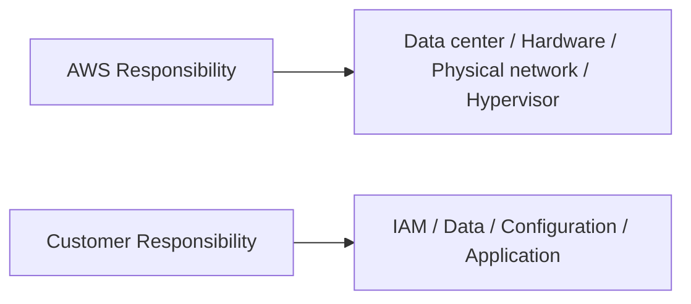
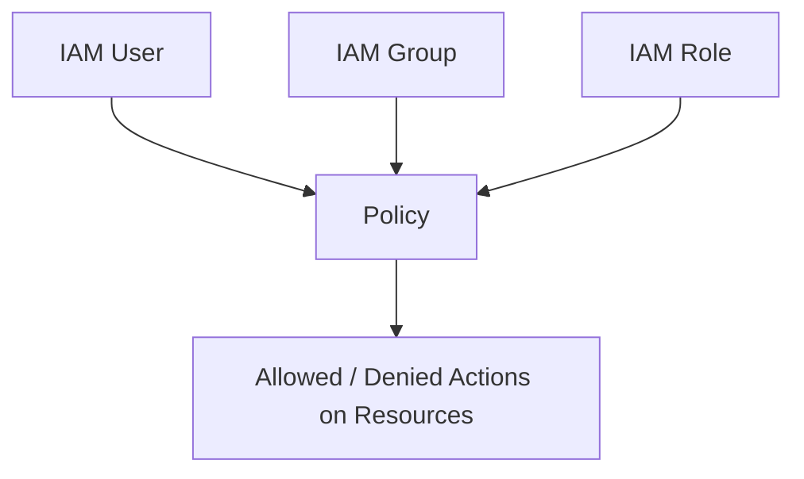
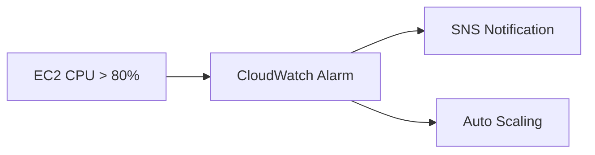

# 1. 가장 먼저: Shared Responsibility Model

핵심 문장:

- AWS → **Security OF the Cloud**
- Customer → **Security IN the Cloud**



## AWS가 책임지는 대표 영역

- 데이터센터 물리 보안
- 물리 서버
- 스토리지 하드웨어
- 네트워크 인프라
- 전력/냉각
- 가상화 인프라

## 고객이 책임지는 대표 영역

- 데이터
- IAM 사용자/권한
- 비밀번호/MFA
- 보안 그룹/NACL 등 설정
- 애플리케이션 보안
- EC2 게스트 OS 패치
- 암호화 설정 및 키 사용 방식

---

## 서비스에 따라 책임 경계가 달라진다

### EC2

고객 책임이 상대적으로 많다.

```text
AWS: 물리 서버, 네트워크, 하이퍼바이저
고객: Guest OS, Patch, App, IAM, Data, SG
```

### RDS

AWS가 DB 인프라/관리 작업 상당 부분을 맡는다.

```text
AWS: 물리 인프라 + DB 인프라 관리, 일부 패치/백업 기능
고객: 데이터, DB 계정/권한, 네트워크 접근, 암호화 선택/설정
```

### Lambda

서버/OS 관리 부담이 더 줄어든다.

```text
AWS: 서버, OS, 런타임 인프라
고객: 코드, 데이터, IAM 권한, 애플리케이션 로직
```

> 시험 포인트: **Managed Service / Serverless로 갈수록 AWS가 관리하는 영역이 증가하지만, 데이터와 접근 권한 책임까지 사라지는 것은 아니다.**

---

# 2. Root User — 반드시 보호

AWS Account를 처음 만들 때 생성되는 Root User는 매우 강한 권한을 가진다.

## 시험 원칙

- 일상 작업에 Root User 사용 금지
- MFA 활성화
- Root Access Key 생성/사용 지양
- 필요한 작업만 Root로 수행
- 일반 운영은 IAM 사용자/Role/Identity Center 사용

문제에서:

> Root 계정을 가장 안전하게 보호하는 방법?

→ **MFA + 일상 사용 금지 + 자격 증명 보호**

---

# 3. Least Privilege — 최소 권한

사용자/서비스에 **업무 수행에 필요한 최소 권한만** 부여한다.

나쁜 예:

```text
개발자가 S3 읽기만 필요
→ AdministratorAccess 부여
```

좋은 예:

```text
필요한 Bucket의 GetObject만 Allow
```

---

# 4. Authentication vs Authorization

| 개념 | 질문 |
|---|---|
| Authentication | “너 누구야?” |
| Authorization | “너 무엇을 할 수 있어?” |

예:

- Password + MFA → Authentication
- IAM Policy → Authorization

---

# 5. IAM 핵심 구조



---

## 5.1 IAM User

장기적인 AWS Identity.

대표 자격 증명:

- Console Password
- Access Key ID
- Secret Access Key

시험에서는 **장기 Access Key를 코드에 하드코딩하는 것**을 좋지 않은 패턴으로 본다.

---

## 5.2 IAM Group

IAM User들을 묶어 공통 Policy를 적용.

- Group 자체는 로그인 Identity가 아님
- User를 여러 Group에 넣을 수 있음

예:

```text
Developers Group
 ├─ userA
 ├─ userB
 └─ userC
```

---

## 5.3 IAM Role

특정 사용자/서비스/다른 Account가 **임시로 Assume**하여 사용하는 권한 집합.

대표 시나리오:

- EC2 → S3
- Lambda → DynamoDB
- Cross-account access
- Federation

### 매우 중요

```text
EC2가 S3에 접근
```

잘못된 방법:

```text
Access Key를 EC2 안에 저장
```

권장:

```text
IAM Role을 EC2에 부여
```

---

## 5.4 IAM Policy

권한을 정의하는 JSON 문서.

핵심 요소:

```json
{
  "Effect": "Allow",
  "Action": "s3:GetObject",
  "Resource": "arn:aws:s3:::example/*"
}
```

시험 수준에서는:

- Effect
- Action
- Resource

정도를 이해하면 충분하다.

---

## 5.5 AWS STS

Security Token Service.

**임시 보안 자격 증명** 발급.

```text
Assume Role
   ↓
STS
   ↓
Temporary Credentials
```

Role과 STS를 구별:

| Role | STS |
|---|---|
| 어떤 권한을 가질지 정의 | 임시 자격 증명을 발급 |
| Policy를 가짐 | AssumeRole 등을 통해 Token 발급 |

---

## 5.6 MFA

Password 이외의 추가 인증 요소.

Root User 및 중요한 계정 보호에 핵심.

---

## 5.7 IAM Identity Center

이전 이름: AWS Single Sign-On.

여러 AWS Account와 애플리케이션의 사용자 접근을 중앙에서 관리.

시험 키워드:

- 중앙 집중식 workforce access
- 여러 AWS Account에 SSO
- 조직 사용자 관리

---

## 5.8 Federation

외부 Identity Provider를 이용해 AWS에 접근.

예:

- 기업 Active Directory
- SAML/OIDC 기반 IdP

장기 IAM User를 모든 직원에게 새로 만들지 않고 기존 기업 Identity를 활용할 수 있다.

---

# 6. 암호화와 Secret

## Encryption at Rest

저장된 데이터 암호화.

예:

- S3
- EBS
- RDS
- EFS

## Encryption in Transit

네트워크로 이동 중인 데이터 암호화.

대표:

- TLS/HTTPS

---

# 7. AWS KMS

Key Management Service.

**암호화 Key 생성/관리/사용 제어**.

대표 연결:

- S3 Encryption
- EBS Encryption
- RDS Encryption
- EFS Encryption

### 기억

> “암호화 키를 관리” → KMS

---

# 8. AWS Secrets Manager

비밀번호, API Key, Token 같은 **Secret 값**을 저장/관리.

기능:

- 암호화 저장
- API로 조회
- Rotation 지원

### KMS vs Secrets Manager

| KMS | Secrets Manager |
|---|---|
| Encryption Key | Password/API Key/Token |
| 암호화 키 관리 | Secret 값 관리 |
| 다른 서비스 암호화에 사용 | 애플리케이션 자격 증명 저장 |

> 비밀번호 → Secrets Manager  
> 암호화 Key → KMS

---

# 9. 주요 Security Services

## 9.1 AWS WAF

Web Application Firewall.

대표 공격:

- SQL Injection
- XSS
- Bot/HTTP 요청 패턴

적용 대상 예:

- CloudFront
- ALB
- API Gateway

> “Web Layer 공격” → WAF

---

## 9.2 AWS Shield

DDoS 보호.

- Shield Standard
- Shield Advanced

> “DDoS” → Shield

---

## 9.3 Amazon GuardDuty

AWS Account/워크로드에서 **위협 행위 탐지**.

키워드:

- 비정상 API 호출
- 악성 IP
- Credential compromise
- 이상 행위

> “공격/위협이 발생하는지 탐지” → GuardDuty

---

## 9.4 Amazon Inspector

Workload **취약점 관리/스캔**.

대표 대상:

- EC2
- Container images
- Lambda

키워드:

- CVE
- 패키지 취약점
- 소프트웨어 취약점

> “취약점 검사” → Inspector

---

## 9.5 AWS Security Hub

여러 보안 서비스의 Finding을 모아 통합 관리.

```text
GuardDuty ─┐
Inspector ─┼→ Security Hub
Macie ─────┘
```

> “보안 Finding 중앙 통합” → Security Hub

---

## 9.6 Amazon Macie

S3 데이터에서 **민감 정보/개인정보 발견 및 분류**.

> “S3에 주민번호/카드번호 같은 민감 데이터가 있는지 찾기” → Macie

---

## 9.7 AWS Artifact

AWS의 **규정 준수 보고서/계약 문서**를 다운로드/검토하는 서비스.

시험:

> “AWS의 SOC/ISO 같은 Compliance Report는 어디에서?”

→ **AWS Artifact**

---

## 9.8 AWS Audit Manager

AWS 사용 환경의 감사 증거 수집과 Audit 준비를 자동화.

- Compliance evidence 수집
- Audit framework 기반 평가

> Artifact = AWS 자체 Compliance 문서  
> Audit Manager = **내 AWS 환경의 Audit 준비/증거 수집**

---

## 9.9 AWS Certificate Manager (ACM)

SSL/TLS 인증서 프로비저닝/관리.

> “AWS 서비스에 HTTPS 인증서” → ACM

---

## 9.10 AWS CloudHSM

전용 Hardware Security Module.

KMS보다 더 직접적인 HSM 제어 요구 시 사용.

CCP에서는 한 줄 식별 수준이면 충분하다.

---

## 9.11 Amazon Cognito

Web/Mobile Application의 최종 사용자 인증.

> “앱 사용자 회원가입/로그인” → Cognito  
> “AWS 관리자/직원의 AWS 권한” → IAM / Identity Center

---

## 9.12 Amazon Detective

보안 Finding과 로그를 분석해 **보안 사고 원인 조사**를 돕는다.

> Detect = GuardDuty  
> Investigate = Detective

---

## 9.13 AWS Firewall Manager

여러 Account/Resource의 Firewall/WAF/Shield 정책을 중앙 관리.

---

# 10. Audit / Monitoring 3대장

세 서비스의 핵심 질문과 목적을 함께 구별한다.

| 서비스 | 핵심 질문 | 목적 |
|---|---|---|
| CloudTrail | 누가 무엇을 했나? | API/Account activity 감사 |
| AWS Config | 리소스 설정이 어떻게 바뀌었나? | Configuration/Compliance |
| CloudWatch | 지금 시스템 상태가 어떤가? | Metrics/Logs/Alarms |

---

## 10.1 CloudTrail

AWS API Activity 기록.

기록 예:

- 누가 EC2를 종료했는가
- 누가 IAM User를 만들었는가
- 누가 Security Group Rule을 바꿨는가

```text
Who + When + Action + Resource + Source
```

> “누가?” → CloudTrail

---

## 10.2 AWS Config

AWS Resource Configuration 상태와 변경 이력을 추적.

Config Rule로 Compliance 여부 검사 가능.

예:

```text
Rule: S3 Bucket은 암호화 필수
         ↓
Encryption Disabled
         ↓
NON_COMPLIANT
```

> “설정 상태/변경 이력/규정 준수” → Config

---

## 10.3 Amazon CloudWatch

Metrics / Logs / Alarms / Dashboard.

예:

- EC2 CPU
- Network
- RDS Metrics
- Lambda Logs
- Application Logs
- Alarm



> “성능/상태/Metric/Alarm” → CloudWatch

---

# 11. CloudTrail vs Config vs CloudWatch

| 상황 | 정답 |
|---|---|
| EC2를 삭제한 사용자를 찾는다 | CloudTrail |
| SG가 언제 어떤 설정으로 바뀌었는지 본다 | Config |
| SG를 누가 바꿨는지 본다 | CloudTrail |
| CPU가 90%가 넘는지 본다 | CloudWatch |
| 특정 Resource가 회사 정책을 준수하는지 검사 | Config |
| Application Log를 수집 | CloudWatch Logs |

---

# 12. Compliance

## SOC

서비스 조직 통제에 대한 감사 보고서.

## ISO 27001

정보보호 관리체계 국제 표준.

## PCI DSS

Payment Card Industry Data Security Standard.

카드 결제 정보 보안.

## HIPAA

미국 의료정보 보호 관련 법/규정.

### 시험에서 중요한 것은

표준 세부 조항보다:

- 어떤 산업에 관련되는지
- AWS Compliance 보고서를 어디서 찾는지
- 고객도 자기 구성/데이터에 대한 Compliance 책임이 있다는 점

---

# 13. Governance / Compliance 관련 서비스

| 서비스 | 역할 |
|---|---|
| AWS Organizations | 여러 AWS Account 중앙 관리 |
| AWS Control Tower | Multi-account Landing Zone/Governance 자동화 |
| AWS Config | Resource Configuration/Compliance |
| AWS CloudTrail | API 감사 |
| AWS Audit Manager | Audit Evidence 자동 수집 |
| AWS Artifact | AWS Compliance Report/Agreement |
| AWS Service Catalog | 승인된 IT 서비스 Catalog 제공 |
| AWS Systems Manager | 운영/관리 자동화 |
| AWS Trusted Advisor | Best Practice 권고 |

---

# 14. 시험에서 자주 섞는 비교

## WAF vs Shield

| WAF | Shield |
|---|---|
| HTTP/HTTPS Web attack | DDoS |
| SQLi, XSS, Bot | Network/Transport/Application DDoS 완화 |
| Rule 기반 Web Request 제어 | DDoS 보호 |

## GuardDuty vs Inspector vs Macie vs Security Hub

| 서비스 | 핵심 |
|---|---|
| GuardDuty | Threat detection |
| Inspector | Vulnerability management |
| Macie | Sensitive data discovery in S3 |
| Security Hub | Findings aggregation |

## IAM vs Cognito

| IAM | Cognito |
|---|---|
| AWS Resource 접근 주체 | App End User |
| Admin/Developer/Service | Mobile/Web 회원 |

## KMS vs CloudHSM

| KMS | CloudHSM |
|---|---|
| Managed Key Service | Dedicated HSM |
| 일반적인 AWS Encryption | 직접적인 HSM 제어/전용 요구 |

---

# 15. Domain 2 시험 직전 치트시트

```text
Shared Responsibility:
AWS       = Security OF the Cloud
Customer  = Security IN the Cloud

Root      = MFA, 일상 사용 금지
Least Privilege = 필요한 최소 권한

User      = 장기 Identity
Group     = User 묶음
Role      = Assume하는 임시 권한
Policy    = 권한 JSON
STS       = Temporary Credentials
Identity Center = Multi-account SSO

KMS       = Encryption Key
Secrets Manager = Password/API Key
ACM       = TLS Certificate

WAF       = SQLi/XSS/Web attack
Shield    = DDoS
GuardDuty = Threat detection
Inspector = Vulnerability
Macie     = Sensitive data in S3
Security Hub = Security findings 통합
Detective = Security investigation

CloudTrail = 누가 무엇을 했나
Config     = 설정/변경/Compliance
CloudWatch = Metric/Log/Alarm

Artifact    = AWS Compliance 문서
Audit Manager = 내 환경 Audit evidence
```

---

## References

- CLF-C02 Domain 2:
  https://docs.aws.amazon.com/aws-certification/latest/cloud-practitioner-02/cloud-practitioner-02-domain2.html
- In-scope services:
  https://docs.aws.amazon.com/aws-certification/latest/cloud-practitioner-02/clf-02-in-scope-services.html
