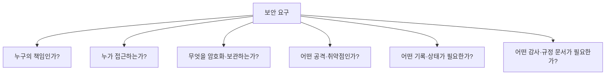
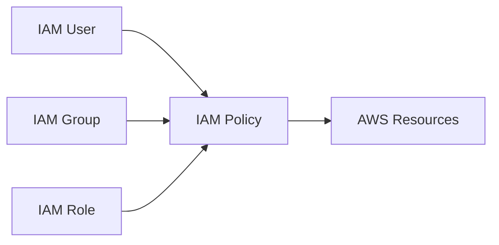
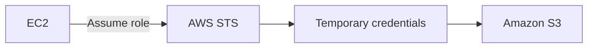
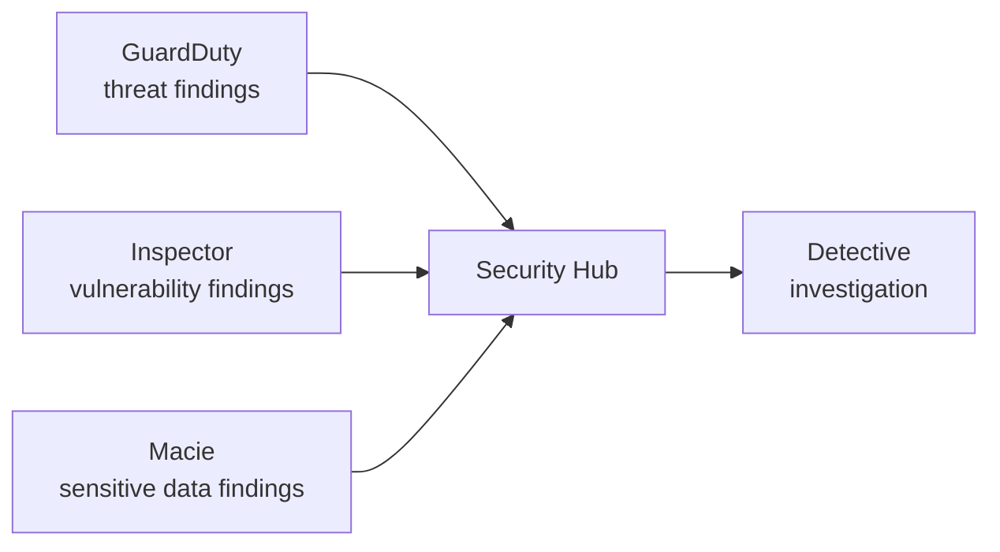
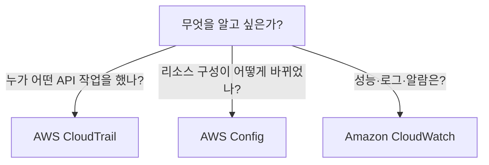

# 02. Security & Compliance — 누가 무엇을 보호하는가

> **시험 비중:** Domain 2, 30%  
> **학습 순서:** Shared Responsibility → IAM → Data Protection → Threat Protection → Monitoring/Audit → Compliance

보안 문제는 서비스 이름부터 외우지 말고 먼저 질문을 분류한다.



## 1. AWS Shared Responsibility Model

```text
AWS      = Security OF the Cloud
Customer = Security IN the Cloud
```

| AWS의 책임 | 고객의 책임 |
|---|---|
| 데이터센터와 물리 보안 | 고객 데이터와 분류 |
| 물리 서버·스토리지·네트워크 | IAM 사용자·역할·정책 |
| 전력·냉각 | 애플리케이션 보안 |
| 가상화 계층 | 암호화 선택과 키 접근 권한 |
| 관리형 서비스의 기반 인프라 | Security Group·NACL 등 구성 |

### 서비스에 따라 경계가 이동한다

| 계층 | EC2 | RDS | Lambda |
|---|---|---|---|
| 물리 시설·하드웨어 | AWS | AWS | AWS |
| Guest OS 패치 | 고객 | AWS | AWS |
| DB 엔진 운영 | 고객이 DB를 설치했다면 고객 | AWS가 관리 기능 제공 | 해당 없음 |
| 애플리케이션 코드 | 고객 | 고객 | 고객 |
| 데이터·IAM·접근 설정 | 고객 | 고객 | 고객 |

**핵심:** 관리형 서비스일수록 AWS의 운영 범위가 커지지만, **고객의 데이터·권한·안전한 사용 책임은 남는다.**

### Shared controls

Patch management, configuration management, 보안 인식 교육 같은 통제는 양쪽이 각각 담당 범위를 수행한다. 예를 들어 AWS는 관리하는 인프라를 패치하고, 고객은 EC2 Guest OS를 패치한다.

## 2. 계정 보호의 출발점

### Root user

AWS 계정을 만들 때 생기는 최고 권한 사용자다.

- Root user에 MFA를 활성화한다.
- 일상 작업에 사용하지 않는다.
- Root access key를 만들지 않거나, 이미 있다면 제거한다.
- Root만 가능한 계정 수준 작업에만 사용한다.

Root가 필요한 대표 상황은 standalone 계정의 root email/password/access key 변경, 계정 종료, 관리자 권한을 모두 잃었을 때 IAM 권한 복구 등이다. AWS Organizations의 중앙 root access를 쓰면 management account나 delegated administrator가 일부 member account 작업을 대신할 수 있으므로 “언제나 root 로그인만 가능”이라고 단정하지 않는다.

### Least privilege

필요한 작업에 필요한 최소 권한만 부여한다.

```text
나쁜 선택: 모든 개발자에게 AdministratorAccess
좋은 선택: 필요한 bucket의 s3:GetObject만 허용
```

### Authentication vs Authorization

| 개념 | 질문 | 예 |
|---|---|---|
| Authentication | “누구인가?” | password, access key, MFA, federation |
| Authorization | “무엇을 할 수 있는가?” | IAM policy |

## 3. AWS Identity and Access Management(IAM) — AWS 리소스 접근 제어

IAM은 AWS 리소스에 접근하는 **identity와 permission**을 관리하는 글로벌 서비스다.



| 구성 요소 | 뜻 | 시험 단서 |
|---|---|---|
| User | 장기 자격 증명을 가질 수 있는 IAM identity | 특정 사람의 콘솔·CLI 접근 |
| Group | 여러 IAM user에 공통 권한 부여 | 개발팀 사용자 묶음 |
| Role | 신뢰받는 주체가 assume하는 권한 | 임시 자격 증명, AWS 서비스, cross-account |
| Policy | 허용·거부할 작업과 리소스를 정의한 JSON 문서 | Effect, Action, Resource |

IAM group은 로그인 주체가 아니며 다른 group을 포함하지 않는다. 애플리케이션에 장기 access key를 저장하기보다 **IAM role과 임시 자격 증명**을 사용한다.

### Policy 판단의 기초

- 기본은 implicit deny다.
- 명시적 Allow가 있어야 허용된다.
- 적용되는 정책의 explicit deny는 allow보다 우선한다.

JSON 문법을 작성하는 시험은 아니지만 다음 의미는 알아야 한다.

```json
{
  "Effect": "Allow",
  "Action": "s3:GetObject",
  "Resource": "arn:aws:s3:::example/*"
}
```

### IAM Role과 AWS STS



- **IAM Role**: 어떤 권한을 위임할지 정의
- **AWS STS**: 제한된 수명의 임시 자격 증명을 발급

**시험 예제:** EC2가 S3 객체를 읽어야 한다. → 코드에 access key 저장이 아니라 **EC2에 IAM role 연결**

### IAM access report

- **IAM credential report**: 계정의 IAM user와 password, access key, MFA 같은 자격 증명 상태를 CSV로 감사
- **IAM Access Analyzer**: 외부·공개 접근과 권한 사용을 분석해 least privilege 개선 지원

## 4. Workforce와 Application 사용자 인증

| 요구 | 정답 |
|---|---|
| 직원이 여러 AWS 계정과 업무 앱에 SSO | AWS IAM Identity Center |
| 기존 기업 identity provider로 AWS 접근 | Federation(SAML/OIDC 등) |
| 웹·모바일 앱 고객의 회원가입·로그인 | Amazon Cognito |
| Microsoft Active Directory 워크로드 | AWS Directory Service |

```text
IAM / Identity Center = AWS를 사용하는 직원·관리자
Cognito               = 고객이 만든 앱의 최종 사용자
```

MFA는 password 외의 추가 인증 요소를 요구한다. 원본 IAM 장표의 SMS·email 예시는 IAM MFA의 일반 암기 항목으로 사용하지 않는다. 시험에서는 **Root와 중요 identity에 MFA 적용**을 기억한다.

## 5. Data Protection

### Encryption at rest vs in transit

| 구분 | 보호 대상 | 대표 방식 |
|---|---|---|
| At rest | 저장 중인 S3·EBS·RDS 데이터 | 서비스 암호화 + KMS key |
| In transit | 네트워크로 이동하는 데이터 | TLS/HTTPS |

### KMS / CloudHSM / Secrets Manager / ACM

| 서비스 | 관리 대상 | 선택 단서 |
|---|---|---|
| AWS Key Management Service(AWS KMS) | 암호화 key 생성·사용·접근 제어 | S3/EBS/RDS 암호화 key |
| AWS CloudHSM | 고객 전용 HSM 장비 | 전용 hardware와 세밀한 HSM 통제 |
| AWS Secrets Manager | DB password, API key, token | secret 저장·조회·rotation |
| Systems Manager Parameter Store | 설정값과 secret parameter | 계층형 configuration 관리 |
| AWS Certificate Manager(ACM) | SSL/TLS certificate | HTTPS 인증서 프로비저닝·관리 |

```text
암호화 key        → KMS
전용 HSM          → CloudHSM
DB password/token → Secrets Manager
TLS certificate   → ACM
```

## 6. 공격 차단과 중앙 정책

### AWS WAF vs AWS Shield

| AWS WAF | AWS Shield |
|---|---|
| HTTP(S) 요청을 규칙으로 검사 | DDoS 보호 |
| SQL injection, XSS, bot, IP 조건 | 대량 트래픽 공격 완화 |
| Web ACL | Standard / Advanced |

### AWS Firewall Manager

AWS Organizations의 여러 계정·리소스에 WAF, Shield Advanced, Security Group 등 보안 정책을 중앙 적용·관리한다.

```text
웹 요청 패턴 차단 → WAF
DDoS              → Shield
여러 계정 방화벽 정책 중앙 관리 → Firewall Manager
```

## 7. 탐지·취약점·민감 데이터·조사



| 서비스 | 답하는 질문 | 대표 단서 |
|---|---|---|
| Amazon GuardDuty | 공격·계정 탈취 징후가 있는가? | 악성 IP, 이상 API 활동, threat detection |
| Amazon Inspector | 워크로드에 알려진 취약점이 있는가? | EC2, ECR 이미지, Lambda, CVE |
| Amazon Macie | S3에 민감 데이터가 있는가? | PII, 신용카드 정보, 분류 |
| AWS Security Hub | 보안 결과를 한곳에서 보는가? | findings 집계·우선순위·보안 표준 |
| Amazon Detective | 탐지된 사건의 원인·관계를 조사하는가? | investigation, 관계 시각화 |

Security Hub가 모든 위협을 직접 탐지하는 것이 아니다. 여러 소스의 **finding을 통합**한다.

## 8. Monitoring, Logging, Audit



### AWS CloudTrail

AWS 계정의 사용자 활동과 API 작업을 기록해 감사·보안 조사에 사용한다.

- 누가, 언제, 어떤 API 작업을 했는가?
- 누가 EC2를 종료하거나 security group rule을 변경했는가?

“모든 이벤트가 아무 설정 없이 영구 보관된다”는 뜻은 아니다. 시험에서는 **API activity/audit** 역할을 구별한다.

### AWS Config

지원되는 AWS 리소스의 구성 상태와 변경 이력을 기록하고 Config rule로 준수 여부를 평가한다.

```text
규칙: S3 bucket은 암호화되어야 함
결과: COMPLIANT / NON_COMPLIANT
```

### Amazon CloudWatch

AWS 리소스와 애플리케이션을 관찰하는 서비스다.

- Metrics
- Logs
- Alarms
- Dashboards

EC2 기본 metric에는 CPU·network 등이 포함되지만 **Guest OS memory/disk 사용률은 CloudWatch agent 같은 추가 수집 설정이 필요**할 수 있다.

| 상황 | 서비스 |
|---|---|
| 누가 EC2를 삭제했는가? | CloudTrail |
| SG가 어떤 값으로 바뀌었는가? | AWS Config |
| S3 설정이 회사 규정을 준수하는가? | AWS Config |
| CPU가 임계값을 넘으면 알림 | CloudWatch Alarm |
| 애플리케이션 로그 검색 | CloudWatch Logs |

### VPC Flow Logs

VPC, subnet 또는 network interface의 IP traffic metadata를 기록한다. API 작업은 CloudTrail, 네트워크 흐름은 VPC Flow Logs다.

## 9. Compliance와 감사 자료

Cloud 규정 준수도 공동 책임이다. AWS가 인증을 보유해도 고객 애플리케이션이 자동으로 규정을 준수하는 것은 아니다.

| 표준·규정 | 관련 분야 |
|---|---|
| SOC | 서비스 조직 통제 감사 보고 |
| ISO 27001 | 정보보호 관리체계 |
| PCI DSS | 결제 카드 데이터 |
| HIPAA | 미국 의료정보 |

### AWS Artifact vs AWS Audit Manager

| AWS Artifact | AWS Audit Manager |
|---|---|
| AWS의 규정 준수 report·agreement 확인 | 고객 AWS 환경의 audit evidence 수집 자동화 |
| SOC·ISO 보고서가 필요 | 자체 감사를 준비·평가 |

### AWS Marketplace

AWS 자체 서비스가 아닌 제3자 보안 제품도 AWS Marketplace에서 찾고 구매할 수 있다.

## 10. Governance와 Multi-Account 보안

| 서비스 | 역할 |
|---|---|
| AWS Organizations | 여러 AWS 계정을 조직·OU로 중앙 관리 |
| Service Control Policy(SCP) | 조직 내 계정의 최대 사용 가능 권한을 제한; 직접 권한 부여는 아님 |
| AWS Control Tower | 모범 사례 기반 multi-account landing zone과 guardrail 구성 |
| AWS Resource Access Manager(RAM) | 지원되는 리소스를 계정 간 공유 |
| AWS Service Catalog | 조직이 승인한 제품·환경만 사용자가 배포하게 제공 |

**SCP 주의:** `Allow` SCP가 있다고 IAM user가 곧바로 권한을 얻는 것은 아니다. IAM policy 등에서 실제 권한도 허용되어야 한다.

## 11. 문제 풀이 예제

**상황:** “EC2에 설치된 패키지의 CVE를 찾는다.”  
**정답:** Amazon Inspector  
**오답 제거:** GuardDuty는 활동 기반 threat detection, Macie는 S3 민감 데이터다.

**상황:** “누가 bucket policy를 변경했는지 조사한다.”  
**정답:** AWS CloudTrail  
**연결:** 변경 후 구성 상태와 이력은 AWS Config가 보완한다.

**상황:** “회사 직원에게 여러 계정 SSO를 제공한다.”  
**정답:** IAM Identity Center  
**오답 제거:** Cognito는 앱 고객의 로그인이다.

**상황:** “AWS의 SOC 보고서를 내려받는다.”  
**정답:** AWS Artifact  
**오답 제거:** Audit Manager는 고객 환경의 증거 수집을 돕는다.

## References

- [CLF-C02 Domain 2](https://docs.aws.amazon.com/aws-certification/latest/cloud-practitioner-02/cloud-practitioner-02-domain2.html)
- [CLF-C02 In-Scope AWS Services](https://docs.aws.amazon.com/aws-certification/latest/cloud-practitioner-02/clf-02-in-scope-services.html)
- [AWS Shared Responsibility Model](https://aws.amazon.com/compliance/shared-responsibility-model/)
- [AWS account root user](https://docs.aws.amazon.com/IAM/latest/UserGuide/id_root-user.html)
- [IAM credential reports](https://docs.aws.amazon.com/IAM/latest/UserGuide/id_credentials_getting-report.html)
- 원본: `day1/1.1.md`, `day2/2.4.md`, `day2/2.5.md` 및 참조 이미지

---

## 반드시 알아야 할 핵심 비교

| 비교 | A | B | C |
|---|---|---|---|
| Security of vs in the Cloud | AWS 기반 인프라 책임 | 고객 데이터·권한·구성 책임 | — |
| Authentication vs Authorization | 누구인지 확인 | 무엇을 할 수 있는지 결정 | — |
| User vs Role | 장기 identity 가능 | assume하여 임시 자격 증명 사용 | — |
| KMS vs Secrets Manager | 암호화 key | password·token 같은 secret | — |
| WAF vs Shield | Web 요청 공격 | DDoS | — |
| GuardDuty vs Inspector | 위협 활동 | 소프트웨어 취약점 | — |
| CloudTrail vs Config vs CloudWatch | API 활동 | 구성·준수 | metric·log·alarm |
| Artifact vs Audit Manager | AWS 규정 문서 | 고객 환경 감사 증거 | — |

## 시험에서 헷갈리는 서비스

| 요구 | 정답 | 헷갈리는 서비스 |
|---|---|---|
| 직원의 multi-account SSO | IAM Identity Center | Cognito는 앱 사용자 |
| S3 개인정보 발견 | Macie | Inspector는 CVE |
| findings 통합 | Security Hub | GuardDuty는 위협 탐지 |
| 보안 사건 관계 조사 | Detective | CloudTrail은 API 기록 원천 |
| 전용 HSM | CloudHSM | KMS는 관리형 key 서비스 |
| 여러 계정 방화벽 정책 | Firewall Manager | WAF는 개별 Web ACL 역할 |
| 네트워크 흐름 기록 | VPC Flow Logs | CloudTrail은 API 활동 |

## 최종 암기표

| 키워드 | 한 줄 암기 |
|---|---|
| Root | MFA, 일상 사용 금지 |
| Least privilege | 필요한 최소 권한 |
| IAM Policy | permission 정의 |
| IAM Role + STS | 위임 권한 + 임시 자격 증명 |
| Identity Center | workforce SSO |
| Cognito | app user 로그인 |
| KMS | encryption key |
| Secrets Manager | password·API key·rotation |
| WAF / Shield | Web 공격 / DDoS |
| GuardDuty / Inspector / Macie | 위협 / 취약점 / S3 민감 데이터 |
| Security Hub / Detective | 결과 통합 / 사건 조사 |
| CloudTrail / Config / CloudWatch | 활동 / 구성 / 관찰 |
| Artifact / Audit Manager | AWS 문서 / 내 감사 증거 |
