## AWS-CCP
### 전통적인 IT 구조

- 기업이나 조직이 서버, Data Center 등의 물리적 IT Infrastructure를 직접 구축하고 운영
- 사용자가 직접 관리
  - Server / Data Center 설치 및 증설
  - OS 설치와 구성
  - Application 배포에 필요한 Software와 환경 설정
  - Infrastructure의 보안과 유지 보수

### 온프레미스 컴퓨팅의 한계점
- 장점
    - 요구에 맞게 시스템을 자유롭게 설계하고 구성 가능
    - 매우 큰 Infrastructure가 필요한 경우 비용 측면에서 유리할 수 있음
- 한계점
    - 확장성이 제한적
    - Computing Resource를 효율적으로 사용하기 어려움
    - 초기 투자와 관리 인력, 유지 보수 등의 고정 비용 발생
    - 장애 발생 시 유연한 대처가 어려움

> **On-Premises = Infrastructure를 직접 소유·구축·운영 · 높은 제어권 대신 초기 비용과 운영 부담이 큼**

### 클라우드 컴퓨팅

- 기업이나 조직이 인터넷을 통해 필요한 IT Resource를 사용하는 Computing 방식
  - Server, Database, Storage, Network, Software Solution 등을 필요에 따라 이용
  - 대표적인 Cloud Provider : AWS, Azure, GCP
- **On-Demand**
  - 필요한 IT Resource를 필요한 만큼 즉시 사용
- **Pay-as-you-go**
  - 사용한 Resource에 대해서만 비용 지불
- 큰 초기 투자 비용을 줄이고 Variable Cost 중심으로 전환 가능
- Infrastructure 관리 부담을 줄여 운영에 필요한 인력과 시간을 절약
- Scalability
  - 더 큰 Workload를 처리할 수 있도록 Resource 규모를 확장하는 능력
- Elasticity
  - 수요 변화에 따라 Resource를 빠르게 늘리거나 줄이는 능력
- 관리 책임 범위는 서비스 유형에 따라 달라짐
  - 모든 관리 책임이 AWS로 넘어가는 것은 아님

- 물리적 Server나 Data Center를 직접 증설하지 않고 빠르게 확장 가능
- 장애나 재해 발생 시 유연하게 대응 가능

> **Cloud Computing = 필요한 IT Resource를 On-Demand로 사용 · Pay-as-you-go · Scalability / Elasticity**

### 클라우드 컴퓨팅의 모델
- **On-Premise**
    - 고객이 인프라부터 시작해서 특정 서비스 개발에 필요한 모든 것을 다 관리
    - 집이나 회사의 개인 컴퓨터 환경
- **IaaS : Infrastructure as a Service**
    - 사용자 : OS, 런타임, 관련 데이터, 서비스되는 앱에 대한 관리 책임
    - 공급자 : 네트워크, 스토리지, 서버 가상화 자원 등에 대한 관리 책임
    - 대표적인 서비스 : EC2
- **PaaS : Platform as a Service**
    - 사용자 : 관련 데이터, 서비스되는 앱에 대한 관리 책임
    - 공급자 : 네트워크부터 런타임까지 전반적인 리소스에 대한 관리 책임
    - 대표적인 서비스 : Elastic Beanstalk
    - Lambda는 PaaS보다 **Serverless / FaaS**로 이해하는 것이 적절
- **SaaS : Software as a Service**
    - 사용자 : 공급자가 제공하는 서비스를 이용만 하면 됨
    - 공급자 : 앱, 데이터를 포함한 서비스 구성 관련 모든 리소스 관리 책임
    - 대표적인 서비스 : Gmail, Dropbox, Notion, Zoom


> **On-Premise = 사용자가 전체 관리 · IaaS = Infrastructure 제공 · PaaS = Platform까지 관리 · SaaS = 완성된 Software 사용**

### AWS 글로벌 인프라에 대한 이해
- **Region**
    - 서로 격리된 AWS의 지리적 영역
    - 하나의 Region은 여러 Availability Zone으로 구성되며, 각 Region은 다른 Region과 **물리적으로 격리**
    - 거의 모든 대륙과 주요 국가에 위치
    - 독립적인 네트워크 인프라와 전원 공급 시스템을 가져 장애 발생 시 **다른 Region에 영향을 주지 않음**
    - Region에 따라 사용 가능한 서비스와 가격이 다를 수 있음
        - 예 : EC2, Lambda, Glue 등
    - Region에 종속되지 않는 Global Service도 존재
        - 예 : IAM, Route 53
        - S3는 Global Interface를 제공하지만 **Bucket은 특정 Region에 생성**
    - Region 선택 기준
        - 사용자와의 Latency
        - 법률 / Data Residency
        - 서비스 제공 여부
        - 가격

- **Availability Zone (AZ)**
  - Region 내부의 독립된 위치
  - 하나 이상의 물리적 Data Center로 구성
  - 각 Region에는 최소 3개 이상의 AZ가 존재
  - Multi-AZ 구성으로 High Availability 향상
- **Edge Location**
    - AWS 글로벌 인프라의 사용자 가까이에 위치한 지점
    - 전 세계 사용자에게 **빠르고 안정적으로 콘텐츠를 제공하기 위한 거점**
    - 콘텐츠를 **캐싱**해 빠르게 제공
    - CloudFront
      - CDN
      - Content Cache
    - Global Accelerator
      - AWS Global Network를 이용한 Network Acceleration
      - Cache 서비스는 아님

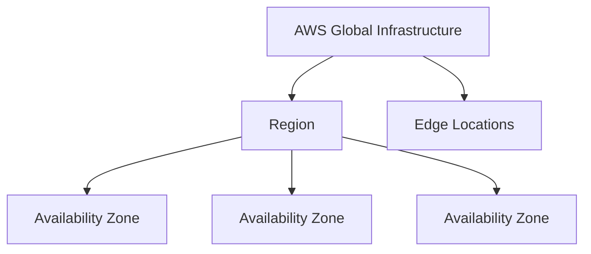

> **Region = 지리적 AWS 영역 · AZ = Region 내부의 독립된 위치 · Edge Location = 사용자 가까운 Global 전달 거점**

## IAM
### IAM 유저
- IAM User
  - AWS 계정에 접근하는 개별 사용자
  - 각 사용자는 고유한 자격 증명을 가짐
  - 생성 직후에는 기본적으로 권한이 없으며 Policy를 연결해 권한 부여
  - 하나의 AWS 계정에 속함
  - 접근 방식
    - AWS Console : Username + Password
    - AWS CLI / SDK : Access Key

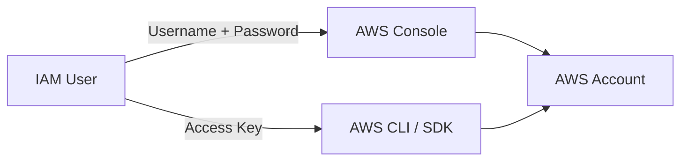

### IAM 그룹
- IAM Group
  - 여러 IAM User의 권한을 일괄적으로 관리하기 위한 사용자 집합
  - Group에 Policy를 연결하면 소속 User들이 해당 권한을 받음
  - 하나의 User는 여러 Group에 속할 수 있음
  - Group에는 User만 포함할 수 있으며 **다른 Group을 포함하거나 중첩할 수 없음**

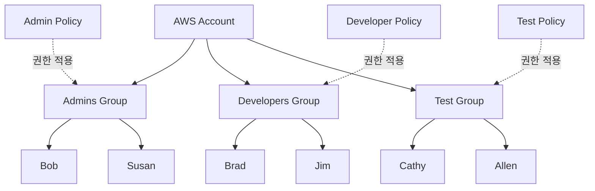

### IAM 정책
- IAM Policy
  - AWS Resource 접근에 대한 Permission을 정의
  - 기본적으로 요청은 **Implicit Deny**
  - **Explicit Allow**가 있어야 허용
  - **Explicit Deny는 Explicit Allow보다 우선**
  - User, Group, Role 등에 연결하여 접근 제어

```jsonc
{
  "Version": "2012-10-17",
  "Statement": [
    {
      // 정책 Statement를 구분하는 선택적 식별자
      "Sid": "1",

      // 요청을 허용할지 거부할지 지정
      "Effect": "Allow",

      // 정책이 적용되는 계정, 사용자, Role 등의 주체
      "Principal": {
        "AWS": ["arn:aws:iam::account-id:root"]
      },

      // 허용 또는 거부할 AWS 작업/API
      "Action": "s3:*",

      // 정책이 적용되는 AWS Resource
      "Resource": [
        "arn:aws:s3:::mybucket",
        "arn:aws:s3:::mybucket/*"
      ]
    }
  ]
}
```
- 주요 요소
  - Effect : Allow / Deny
  - Action : 허용 또는 거부할 AWS API 작업
  - Resource : 정책이 적용되는 Resource
  - Principal
    - Resource-based Policy나 Role Trust Policy에서 사용
    - 일반적인 Identity-based Policy에는 사용하지 않음

### IAM 역할
- IAM Role
  - **특정 권한을 임시로 위임하기 위한 IAM 자격 증명**
  - 특정 사용자 한 명에 고정되지 않으며, 필요한 사용자나 AWS 서비스가 Role을 Assume해서 사용
  - **장기 Password나 Access Key를 직접 가지지 않음, 장기 자격 증명이 없다**
  - Assume하면 **AWS STS를 통해 Temporary Credentials를 사용**
  - EC2, Lambda 등의 Workload에는 장기 Access Key보다 Role 사용 권장
  - 대표적인 사용 예
    - EC2 → S3 접근
    - Lambda → 다른 AWS 서비스 접근

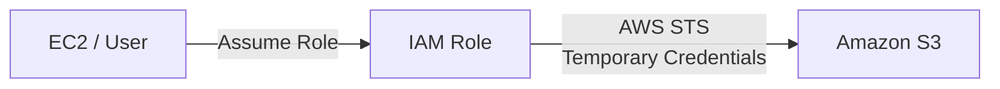

> **User = 개별 Identity · Group = User 묶음 · Policy = Permission 정의 · Role = 임시 권한 위임**

### IAM 보안 자격 증명 - 비밀번호
- AWS Management Console 로그인에 사용
  - Account ID 또는 Account Alias
  - IAM User Name
  - Password
- IAM User의 Password Policy를 설정할 수 있음
  - 비밀번호 길이
  - 대문자, 소문자, 숫자, 특수문자 조합
  - 계정 이름이나 이메일과 다른 비밀번호 사용
  - 비밀번호 만료 및 주기적 변경 정책 설정 가능

### IAM 보안 자격 증명 - MFA
- MFA : Multi-Factor Authentication
  - 비밀번호 외에 추가 인증 요소를 요구하는 보안 방식
  - Root User와 IAM User에 적용 가능
  - 대표적인 방식
    - Virtual MFA Device
    - Hardware Token
  - 계정 탈취 위험을 줄이기 위해 중요한 계정에 MFA 사용 권장

### IAM 보안 자격 증명 - Access Key
- Access Key
  - IAM User 또는 Root User가 프로그래밍 방식으로 AWS에 접근할 때 사용하는 **장기 보안 자격 증명**
  - Access Key ID와 Secret Access Key의 쌍으로 구성
  - AWS API, CLI 등을 통한 접근에 사용
  - **Secret Access Key는 생성 시 한 번만 확인·저장 가능**
    - 분실한 경우 기존 Access Key를 삭제하고 새로 생성
  - 안전한 장소에 보관하고 불필요하면 비활성화하거나 삭제

> **Password = Console Login · MFA = 추가 인증 · Access Key = 장기 Programmatic Credential**

### AWS 리소스 접근 - Management Console
- AWS Management Console
  - ID와 Password를 이용해 웹 브라우저에서 AWS에 접근
  - IAM User에게 할당된 권한에 따라 접근 가능한 서비스와 Resource가 제한됨
  - AWS Resource를 생성하고 관리할 수 있는 GUI 제공

### AWS 리소스 접근 - CLI
- AWS CLI : Command Line Interface
  - **Terminal에서 AWS API 사용**
  - 여러 AWS 서비스를 하나의 CLI 도구로 제어 가능
  - 스크립트를 이용한 자동화에 적합
  - AWS Management Console에서 가능한 대부분의 작업을 명령어로 수행 가능
  - IAM User의 Access Key ID + Secret Access Key 조합으로 인증하여 사용할 수 있음

### AWS 리소스 접근 - SDK
- AWS SDK : Software Development Kit
  - Python, Java 등의 코드에서 AWS 서비스와 Resource에 접근하기 위한 개발 도구
  - **Application Code에서 AWS API 사용**
  - 언어별 SDK 제공
    - 예 : Python `boto3`, Java SDK
  - 인증 정보가 필요하며 Access Key 등을 사용할 수 있음

> **Console = GUI · CLI = Terminal에서 AWS API · SDK = Application Code에서 AWS API**

### IAM Access Reports
- AWS Resource에 대한 **Access 상태와 이력을 모니터링, 검토하는 데 활용**
- Credential Report
  - **IAM User의 Credential 상태**를 확인
  - Password, Access Key, MFA 등의 상태 제공
  - 4시간에 한 번 새 Report 생성 가능
- IAM Access Analyzer
  - AWS Resource에 대한 Access를 분석
  - **Public / External / Cross-account Access** 등을 Finding으로 확인
  - 불필요하거나 사용되지 않는 Access 분석에도 활용

> **Credential Report = IAM Credential 상태 · Access Analyzer = Resource의 외부 Access 분석**

### IAM 권고 사항
- Root User는 계정 설정 등 꼭 필요한 경우에만 사용
- 강력한 Password Policy와 MFA 사용
- AWS 서비스에 **권한을 부여할 때 IAM Role 사용**
- **공통 권한은 Group에 Policy를 연결해 여러 User에게 적용**
- **장기 Access Key보다 IAM Role을 통한 임시 자격 증명 사용 권장**
- IAM User와 Access Key를 공유하지 않음
- Access Key를 GitHub 등 공개 저장소에 업로드하지 않음

## EC2 - AWS Elastic Compute Cloud

### EC2 개요
- EC2 : Elastic Compute Cloud
  - AWS에서 가상 서버를 제공하는 **IaaS 서비스**
  - 필요에 따라 컴퓨팅 리소스의 크기를 조정할 수 있음
  - 사용자가 필요한 만큼 가상 서버를 생성하여 사용
  - EC2의 가상 서버를 Instance라고 부름

> **EC2 = AWS의 IaaS Virtual Server · OS와 Instance 구성을 직접 선택 / 관리**

### EC2 Instance 유형
- Workload에 맞게 CPU, Memory, Storage, Network 조합의 성능이 다른 다양한 Instance Type 제공
- 비슷한 목적의 Instance Type은 Instance Family로 분류
- Instance Type에 따라 성능과 가격이 달라지므로 용도에 맞게 선택

### EC2 Instance Naming
- 예 : `c5a.large`
  - `c` : Instance Family
    - 목적에 따른 Instance 분류 (Compute, Memory, Storage 최적화 등)
  - `5` : Generation
    - Instance Family의 세대
  - `a` : Instance Option
    - 해당 Instance Family에서 추가적인 Hardware / Processor 등의 특성을 표현
      - `c5a.large`의 `a`는 AMD Processor 사용을 의미
  - `large` : Instance Size
    - Instance의 CPU, Memory 등 Hardware Spec 크기

### EC2 Instance 분류
- General Purpose, 범용
  - Compute, Memory, Network Resource를 균형 있게 제공
  - Web Server 등 여러 Resource를 비슷한 비율로 사용하는 Workload에 적합
- Compute Optimized, 컴퓨팅 최적화
  - 고성능 Processor가 필요한 Compute-intensive Workload에 적합
  - 예 : Batch Processing, High-performance Web Server, Scientific Modeling, ML Inference, Game Server
- Memory Optimized, 메모리 최적화
  - Memory에서 대규모 Data Set을 처리하는 Workload에 적합
- Accelerated Computing, 가속 컴퓨팅
  - Hardware Accelerator 또는 Co-processor를 사용해 특정 계산을 CPU보다 효율적으로 처리
  - 예 : Floating-point Calculation, Graphics Processing, Data Pattern Matching
- Storage Optimized, 스토리지 최적화
  - 매우 큰 Local Data Set에 대해 높은 Sequential Read/Write 성능이 필요한 Workload에 적합
  - 높은 IOPS와 짧은 I/O Latency에 최적화
- HPC Optimized, HPC 최적화
  - High Performance Computing Workload에 최적화
  - 대규모 Simulation, Deep Learning 등 고성능 Processor가 필요한 작업에 적합

> **General = 균형 · Compute = CPU · Memory = RAM · Storage = 높은 Storage I/O · Accelerated = GPU / Accelerator · HPC = 고성능 병렬 처리**

### ENI : Elastic Network Interface
- EC2 Instance가 VPC 내에서 Network Traffic을 주고받기 위한 가상 Network Interface
- 하나의 Subnet에 속함
- Private IP 등의 Network 정보를 가짐
- ENI에 Security Group을 연결하여 Inbound / Outbound Traffic 제어
- 하나의 EC2 Instance에 여러 ENI를 연결할 수 있음
  - Multi-Network 구성
  - Load Balancing 등에 활용

### Elastic IP
- EC2 Instance에 할당할 수 있는 **정적 IPv4 주소**
- 일반 Public IP는 Instance를 중지 후 다시 시작하면 변경될 수 있음
- **Elastic IP를 사용하면 고정된 Public IP 유지 가능**, 특정 IP 주소를 비용 지불 후 점유해서 사용
- **특정 Region에서만 사용** 가능하며 다른 Region으로 이전할 수 없음
- Instance에 연결하지 않아도 Elastic IP를 **점유하고 있으면 비용이 발생할 수 있음**

> **ENI = EC2의 Virtual Network Interface · Elastic IP = 고정 Public IPv4 Address**

### EC2 보안 그룹
- EC2 등 Resource의 Network Traffic을 제어하는 가상 Firewall
- Inbound / Outbound Rule을 설정
- **Allow Rule만 설정 가능**하며 Deny Rule은 직접 설정할 수 없음
- **허용되지 않은 Traffic은 기본적으로 차단**
- Inbound는 필요한 Port와 Source만 최소한으로 허용
- **Stateful**
  - 허용된 요청에 대한 응답 Traffic은 별도의 Outbound Rule 없이 자동 허용
- 기본 Security Group 생성 시 일반적인 기본값
  - Inbound : 명시적으로 허용하지 않은 외부 Traffic 차단
  - Outbound : 모든 Traffic 허용
- Rule에서 지정하는 항목
  - Traffic Type : SSH, HTTP 등
  - Protocol : TCP, UDP 등
  - Port : SSH 22, HTTP 80, HTTPS 443, RDP 3389 등
  - Source / Destination : IP Address, IP Range, 다른 Security Group 등

> **Security Group = Resource-level Virtual Firewall · Allow Rule만 사용 · Stateful**

### EC2 Key Pair
- EC2 Instance에 안전하게 접속하기 위한 Public Key / Private Key 쌍
  - Public Key
    - EC2 Instance에 저장
  - Private Key
    - 사용자가 안전하게 보관
    - AWS가 보관하지 않으며 생성 후 다시 다운로드할 수 없음
- Linux EC2 Instance에 SSH로 접속할 때 Private Key를 사용해 인증
- Private Key가 유출되면 Instance 접근에 악용될 수 있으므로 안전하게 보관
- 접속하려면 Key Pair뿐 아니라 Security Group에서 SSH(22) 등의 접근도 허용되어 있어야 함

### EC2 Instance 접속 방법

- SSH
  - Linux EC2 Instance에 **원격 접속하는 일반적인 방법**
  - Key Pair의 Private Key를 이용해 인증
  - Security Group에서 SSH Port(22) 접근 허용 필요

- EC2 Instance Connect
  - AWS Console이나 CLI에서 EC2에 SSH 접속할 수 있도록 지원
  - **임시 SSH Public Key**를 Instance에 전달하여 접속
  - 일반적인 SSH 연결에서는 Network 접근과 Security Group 설정이 필요

- AWS Systems Manager Session Manager
  - Browser 또는 CLI에서 EC2에 안전하게 접속
  - **SSH Key나 Inbound SSH Port를 열지 않고도 접속 가능**
  - 적절한 IAM 권한과 Systems Manager 설정 필요
  - 보안·운영 측면에서 SSH 직접 접속의 대안으로 자주 사용

- EC2 Serial Console
  - Instance의 Serial Port를 통해 접속
  - Network 설정이나 SSH에 문제가 있어도 Troubleshooting에 활용 가능
  - 주로 **Boot / Network 문제 해결**에 사용

> **SSH = Linux Remote Access · Instance Connect = 임시 SSH Public Key · Session Manager = SSH Key / Inbound Port 불필요 · Serial Console = Network / Boot Troubleshooting**

### EC2 Instance Role

- EC2 Instance가 다른 AWS Resource에 접근할 수 있도록 권한을 부여하는 IAM Role
- IAM에서 Role을 생성한 뒤 EC2 Instance에 연결
- 대표적인 사용 예
  - EC2 → S3 접근
  - EC2 → DynamoDB 접근
- EC2가 AWS Service에 접근할 때 **장기 Access Key를 저장하지 않고 IAM Role 사용**
- Role을 사용하면 **Temporary Credentials가 자동으로 제공**
- IAM Role의 권한은 Policy로 정의

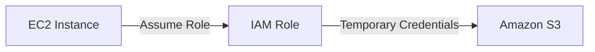

> **EC2 → AWS Service 접근 = Access Key를 저장하지 말고 IAM Role / Temporary Credentials 사용**

### EC2 구매 옵션

- On-Demand Instance
  - 장기 약정 없이 필요한 만큼 사용
  - 실행 시간에 따라 비용 지불
  - 단기적이거나 사용량을 예측하기 어려운 Workload에 적합
  - 중단되면 안 되는 Workload에도 사용 가능
  - 유연성이 높지만 할인 옵션보다 비용이 높음

- Spot Instance
  - AWS의 남는 EC2 Capacity를 저렴하게 사용
  - On-Demand 대비 최대 90%까지 저렴
  - AWS가 Capacity를 회수하면 Instance가 중단될 수 있음
  - 중단을 허용할 수 있는 Workload에 적합
    - Batch Processing
    - Data Analysis
    - CI/CD
    - 분산 처리
  - 지속 실행이 반드시 필요한 Workload에는 부적합

- Savings Plans
  - 1년 또는 3년 동안 일정한 사용 금액(`$/hour`)을 약정하여 할인
  - 약정한 금액까지 Savings Plans 가격이 적용되고 초과 사용량은 On-Demand 가격 적용
  - Compute Savings Plans
    - 최대 66% 할인
    - Instance Family, Size, Region, OS 등에 관계없이 유연하게 적용
    - EC2뿐 아니라 Fargate, Lambda에도 적용
  - EC2 Instance Savings Plans
    - 최대 72% 할인
    - 특정 Region의 특정 Instance Family에 대한 사용 금액 약정
    - 해당 Family 안에서는 Size, OS 등을 변경 가능

- Reserved Instance (RI)
  - 1년 또는 3년 동안 특정 EC2 사용 조건을 약정하여 할인
  - 예측 가능하고 지속적인 Workload에 적합
  - Standard RI
    - 할인율이 높지만 변경 유연성이 낮음
  - Convertible RI
    - 조건에 따라 Instance Family 등의 속성을 변경 가능
  - 결제 방식
    - All Upfront
    - Partial Upfront
    - No Upfront
  - CCP에서는 `장기간 예측 가능한 사용 → RI 또는 Savings Plans`로 구별
  - Scheduled RI는 현재 정리에서 제외

- On-Demand Capacity Reservation
  - 특정 Availability Zone의 EC2 Capacity를 미리 확보
  - 필요할 때 Instance를 실행하지 못하는 Capacity 부족 위험을 줄임
  - 일반적인 즉시 사용 Capacity Reservation은 1년/3년 약정이 필요하지 않음
  - 자체적인 요금 할인 목적이 아님
  - Savings Plans 또는 RI 할인과 함께 적용될 수 있음

- Dedicated Instance, 전용 인스턴스
  - **다른 AWS 고객과 물리적 Host를 공유하지 않는** Single-Tenant Hardware에서 Instance 실행
  - 같은 AWS Account의 다른 Dedicated Instance와 Host를 공유할 수 있음
  - 사용자는 물리 Host 자체를 직접 제어하지 않음

- Dedicated Host, 전용 호스트
  - **하나의 물리적 EC2 Host 전체를 특정 고객에게 전용으로 제공**
  - 물리 Host 수준의 제어 가능
  - Socket / Core 기반 Software License 사용 등에 적합
  - Dedicated Instance보다 Host에 대한 제어 수준이 높음

### 시험용 핵심 비교

- On-Demand
  - **약정 없음** / 중단 없음 / 유연성
- Spot
  - **중단 가능** / 가장 저렴
- Savings Plans
  - 1년·3년 **사용 금액 Commit** / 할인
- Reserved Instance
  - 1년·3년 **특정 EC2 조건 Commit** / 할인
- Capacity Reservation
  - 할인보다 **특정 AZ의 Capacity 확보**
- Dedicated Instance
  - **Single-Tenant Hardware**에서 Instance 사용
- Dedicated Host
  - **Physical Host 전체**를 전용으로 사용

## EC2 Instance Storage
### EBS : Elastic Block Store

- EC2에 연결해 사용하는 **영구 Block Storage**
  - EC2의 Local Disk처럼 사용
  - OS Disk, Database Volume 등에 적합
- EC2 Instance의 실행 수명과 **독립적**
  - Instance를 종료해도 EBS Volume은 유지될 수 있음
  - Root Volume은 `Delete on Termination` 설정에 따라 Instance 종료 시 함께 삭제될 수 있음
- **하나의 EC2 Instance에 여러 EBS Volume을 추가로 연결 가능**
- EC2와 EBS는 **같은 Availability Zone**에 있어야 연결 가능
- EBS Snapshot
  - 특정 시점의 Volume Backup
  - **Incremental Backup**
- **AWS KMS**를 이용해 암호화 가능
- EC2와 분리되어 있어도 EBS Volume을 유지하면 비용 발생

> **EBS = Persistent Block Storage · Instance와 수명 독립 · 같은 AZ · Snapshot = Backup · KMS = Encryption**

### EBS Snapshot

- EBS Volume의 **특정 시점(Point-in-Time) Backup**
  - 원본 EBS Volume과 독립적으로 유지
  - Snapshot을 이용해 새로운 EBS Volume으로 복원 가능
- **Incremental Backup**
  - 첫 Snapshot 이후에는 이전 Snapshot에서 **변경된 Block만 추가 저장**
  - 각 Snapshot만으로 해당 시점의 Volume을 복원할 수 있음
- Snapshot은 **Region 단위**
  - 같은 Region에서는 Snapshot으로 **어떤 AZ에도 EBS Volume 생성 가능**
  - 다른 Region에서 사용하려면 **Snapshot을 해당 Region으로 복사**
- Amazon Data Lifecycle Manager
  - Snapshot의 **생성·보존·삭제를 자동화**
  - 정기적인 Backup Schedule 구성 가능

> **EBS Snapshot = Point-in-Time Backup · Incremental · 같은 Region의 모든 AZ에서 복원 · 다른 Region은 Copy**

### AMI : Amazon Machine Image

- EC2 Instance를 생성하기 위한 **Template**
  - OS, Application, 설정 등이 포함된 서버 환경을 미리 구성
  - 동일한 AMI를 이용해 **같은 구성의 EC2 Instance를 여러 개 생성** 가능
- 기존 EC2 Instance를 기반으로 **Custom AMI**를 생성할 수 있음
- AMI는 **Region 단위**
  - 다른 Region에서 사용하려면 AMI를 해당 Region으로 복사
- AMI 제공 방식
  - **AWS 제공 AMI**
  - **AWS Marketplace AMI**
  - **사용자 Custom AMI**
- EBS 기반 AMI는 EBS Snapshot을 이용하지만 **AMI와 Snapshot은 같은 개념이 아님**
  - Snapshot = EBS Volume의 Backup
  - AMI = EC2 Instance를 생성하기 위한 Template

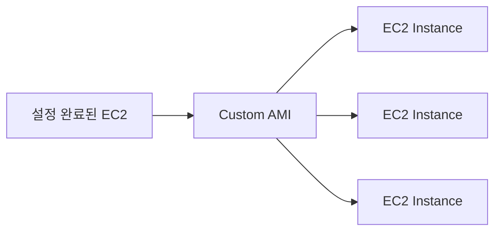

> **AMI = EC2 생성 Template · Snapshot = EBS Backup · 동일 환경의 EC2를 반복 생성**

### EC2 Image Builder

- Virtual Machine 및 Container Image를 **자동으로 생성·테스트·배포**하기 위한 서비스
- Image를 최신 상태로 유지하는 작업을 자동화
  - Software 설치 및 Update
  - Security 설정 적용
  - Image Test
  - 배포
- **자동화된 Image Pipeline**을 구성할 수 있음
  - Linux / Windows Image 생성 가능
  - 생성 주기를 Schedule로 설정 가능
    - 일별
    - 주별
    - Software Update 발생 시 등
- 기본 AWS Resource 사용 비용을 제외하면 **EC2 Image Builder 자체는 추가 비용 없이 제공**

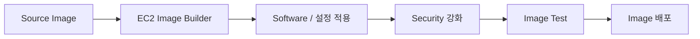

> **EC2 Image Builder = Image 생성 · 보안 적용 · 테스트 · 배포를 자동화**

### Instance Store

- EC2 Host에 **물리적으로 연결된 임시 Block Storage**
  - 매우 높은 I/O 성능이 필요한 작업에 적합
  - Instance Type에 따라 제공 여부와 용량이 다름
- EC2 Instance의 수명에 **종속적**
  - **Reboot : 데이터 유지**
  - **Stop / Hibernate / Terminate : 데이터 삭제**
  - 장기간 보존해야 하는 데이터 저장에는 부적합
- EBS처럼 Volume을 분리해서 다른 EC2에 다시 연결할 수 없음
- 임시 데이터 저장에 적합
  - Buffer
  - Cache
  - Scratch Data
  - 재생성 가능한 임시 데이터
- 영구 보관이 필요한 데이터는 **EBS, S3, EFS** 등에 저장

> **Instance Store = Temporary Local Block Storage · 높은 성능 · Stop/Terminate 시 데이터 소실**

### EFS : Elastic File System

- 여러 EC2 Instance가 동시에 사용할 수 있는 **공유 File Storage**
  - 주로 Linux Workload에서 사용
  - **NFS(Network File System)** 방식으로 Mount
- **Serverless / Fully Managed**
  - 별도의 File Server를 직접 구축하거나 관리할 필요 없음
  - 저장되는 데이터 양에 따라 자동으로 확장·축소
- 여러 EC2 Instance가 **동일한 파일을 공유**해야 하는 경우에 적합
- EFS는 기본적으로 여러 Availability Zone에서 사용할 수 있도록 구성 가능
  - 고가용성 File Storage 구성에 적합
- EC2에서 EFS에 접근하려면 Network와 Security Group 설정 필요
  - EFS Mount Target의 Security Group에서 **NFS Port 2049** 허용
  - 일반적으로 Source에 EC2의 Security Group을 지정

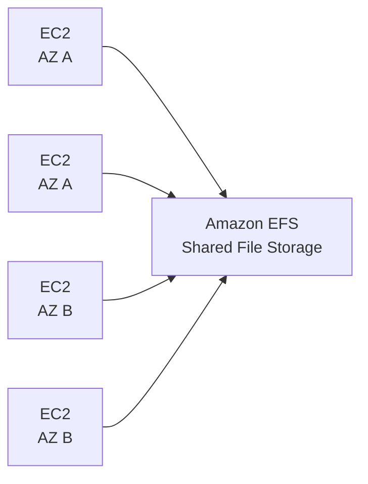

> **EFS = Shared File Storage · NFS · 여러 EC2에서 동시 Mount · 자동 확장**

## Load Balancer & Auto Scaling Group

### Scalability / Elasticity

- Scalability : 확장성
  - Workload나 수요 증가에 대응하도록 **Resource 규모를 확장할 수 있는 능력**
  - Horizontal Scaling, 수평적 확장 : **Scale Out**
    - Instance / Node의 **개수를 늘려** Workload를 분산
  - Vertical Scaling, 수직적 확장 : **Scale Up**
    - 기존 Instance의 **CPU, Memory 등 사양을 증가**

- Elasticity : 탄력성
  - 수요 변화에 따라 Resource를 **자동으로 늘리거나 줄이는 능력**
  - 필요한 만큼만 Resource를 사용하여 성능과 비용 효율성을 높임

> **Scalability = 증가한 수요를 처리할 수 있는 확장 능력 · Elasticity = 수요에 따라 Resource가 늘고 줄어드는 능력**

### Availability / High Availability / Resiliency / Recoverability

- Availability : 가용성
  - 시스템이 **정상적으로 사용 가능한 정도**

- High Availability : 고가용성
  - 장애가 발생해도 서비스를 **계속 사용할 수 있도록 중단을 최소화**하는 능력
  - 예 : 여러 AZ에 Resource를 분산하여 단일 장애 지점 제거

- Resiliency : 내결함성 / 복원력
  - Hardware나 Software 장애가 발생해도 **서비스를 계속 제공하거나 장애 영향을 최소화**하는 능력
  - 장애를 견디도록 중복 구성, Failover 등을 활용

- Recoverability : 회복력
  - 장애나 중단 이후 **정상 상태로 신속하게 복구**하는 능력
  - Backup, Restore, Disaster Recovery 등과 관련

> **High Availability = 중단 최소화 · Resiliency = 장애를 견딤 · Recoverability = 장애 후 복구**

### Load Balancer (LB)

- 여러 Server / Compute Resource로 들어오는 **Network Traffic을 분산**하는 시스템
- 하나의 Server에 Traffic이 집중되는 것을 방지하여 **가용성, 성능, 안정성 향상**
- AWS에서는 **Elastic Load Balancing (ELB)** 서비스로 제공
- **Health Check**를 통해 정상 상태인 Target으로 Traffic을 전달
- 여러 Availability Zone의 Instance로 Traffic을 분산하여 **High Availability** 구성에 활용

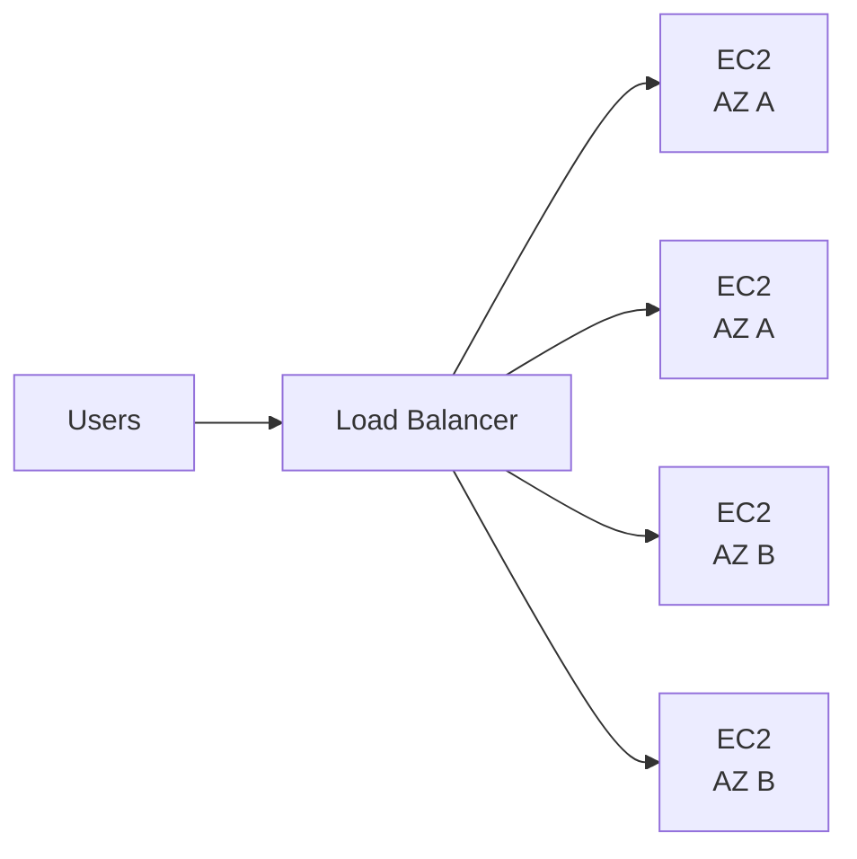

- Application Load Balancer (ALB)
  - **Layer 7 : HTTP / HTTPS**
  - URL Path, Host 등의 **HTTP Request 내용에 따라 Routing**
  - Web Application에 적합
- Network Load Balancer (NLB)
  - **Layer 4 : TCP / UDP / TLS**
  - 매우 높은 성능과 낮은 Latency가 필요한 Network Traffic에 적합
- Gateway Load Balancer (GWLB)
  - Firewall, IDS/IPS 같은 **가상 Network Appliance의 Traffic 분산**에 사용
  - CCP에서는 ALB / NLB보다 우선순위 낮음

> **ELB = Traffic 분산 · Health Check · High Availability / ALB = HTTP(S) · NLB = TCP/UDP**

### ELB : Elastic Load Balancing

- AWS에서 제공하는 **완전 관리형 Load Balancing 서비스**
- 들어오는 Traffic을 여러 Target으로 자동 분산
  - EC2 Instance
  - Container
  - IP Address 등
- **Health Check**를 통해 Target의 상태를 확인
  - 정상 상태인 Target에만 Traffic을 전달
- 여러 Availability Zone에 Target을 배치하여 **High Availability** 구성에 활용
- **Auto Scaling Group과 함께 사용**하는 경우가 많음
  - Auto Scaling Group : 수요에 따라 EC2 Instance를 추가 / 제거
  - ELB : 현재 정상 상태인 Instance들에 Traffic을 분산

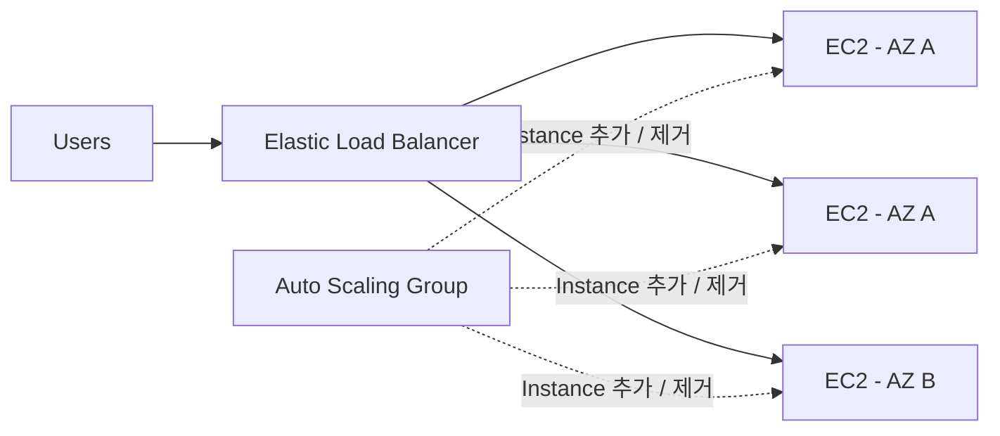

> **ELB = Traffic 분산 · Health Check · Multi-AZ / Auto Scaling = Instance 수 조절**

### Elastic Load Balancer 종류

- ALB : Application Load Balancer
  - **Layer 7 : Application Layer**
  - **HTTP / HTTPS** Traffic 처리
  - HTTP Request의 내용을 기준으로 정교한 Routing
    - URL Path
    - Host
    - HTTP Header 등
  - Web Application, API에 적합

- NLB : Network Load Balancer
  - **Layer 4 : Transport Layer**
  - **TCP / UDP / TLS** 등 Network Connection 처리
  - IP, Port, Protocol 등 **연결 수준에서 Traffic을 빠르게 분산**
  - 처리 과정이 단순해서 매우 높은 처리량과 낮은 Latency가 필요한 경우에 적합

- GWLB : Gateway Load Balancer
  - **Layer 3 : Network Layer**
  - 모든 IP Packet을 받아 **가상 Network Appliance**로 전달
    - Firewall
    - IDS / IPS
    - Deep Packet Inspection
  - **GENEVE Protocol, Port 6081** 사용
  - Network 보안 장비를 여러 개 배치하고 확장할 때 사용

| 구분 | ALB | NLB | GWLB |
|---|---|---|---|
| Layer | **7** | **4** | **3** |
| 기준 | HTTP Request 내용 | Network Connection | IP Packet |
| 대표 용도 | Web / API | 고성능 TCP/UDP | Firewall / IDS/IPS |

> **ALB = 요청 내용을 봄 · NLB = 연결을 봄 · GWLB = Network Packet을 보안 장비로 전달**

### ELB 작동 방식

- Client가 ELB에 Request 전송
- **Listener**
  - 특정 Protocol / Port에서 들어오는 연결을 대기
  - 예 : HTTP 80, HTTPS 443
  - Listener Rule에 따라 Request를 **Target Group**으로 전달
- **Target Group**
  - 실제 Traffic을 전달받을 Target들의 집합
  - 예 : EC2 Instance, IP Address, Lambda 등
  - Health Check를 통해 **Healthy Target**을 확인
- ELB는 선택된 Target Group 안의 정상 Target으로 Traffic을 분산
- Target이 처리한 Response는 ELB를 거쳐 Client에게 반환

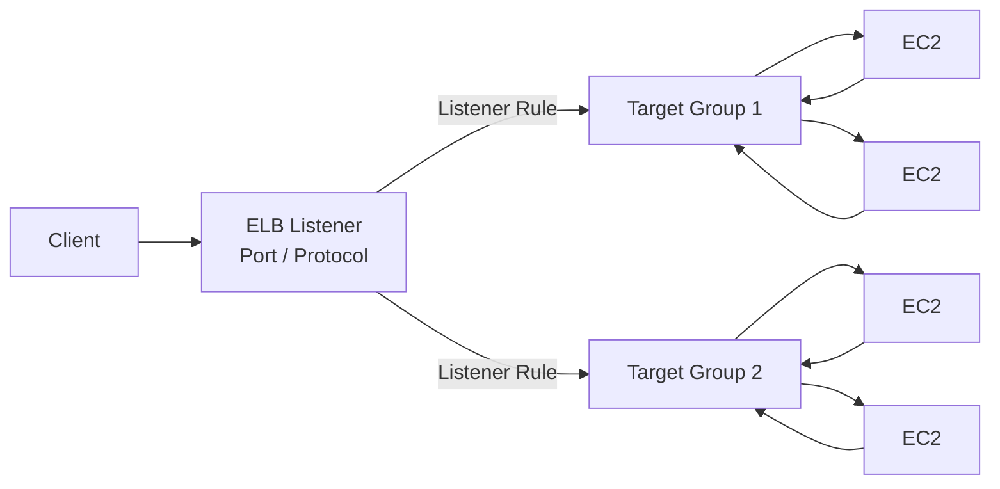

- Auto Scaling Group과 함께 사용하는 경우
  - **ASG = EC2 Instance 추가 / 제거**
  - 추가된 EC2를 Target Group에 등록
  - **ELB = 등록된 Healthy Instance로 Traffic 분산**

> **Listener = 요청을 받는 입구 · Target Group = 목적지 Server 묶음 · Target = 실제 Request 처리**

### Auto Scaling Group (ASG)

- EC2 Instance들을 하나의 Group으로 관리하고 **수요에 따라 Instance 수를 자동으로 조절**
  - **Scale Out** : Instance 추가
  - **Scale In** : Instance 제거
- Group 내 Instance의 상태를 확인하고 **비정상 Instance를 자동으로 교체**하여 필요한 Instance 수를 유지
- **On-Demand Instance와 Spot Instance**를 함께 구성할 수 있음
- ELB와 함께 사용하여 Traffic 변화에 유연하게 대응
  - **ASG = Instance 수 조절**
  - **ELB = Healthy Instance에 Traffic 분산**

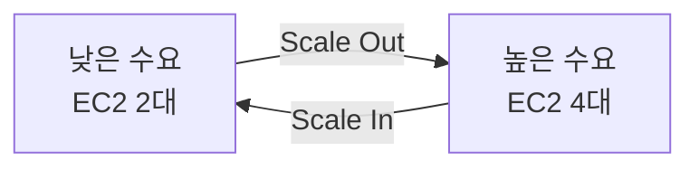

### Auto Scaling Group 구성 요소

- **Auto Scaling Group**
  - Auto Scaling으로 관리되는 EC2 Instance Group
  - Capacity 설정
    - **Minimum Capacity** : 최소 Instance 수
    - **Desired Capacity** : 유지하려는 Instance 수
    - **Maximum Capacity** : 최대 Instance 수

- **Launch Template**
  - 새 EC2 Instance를 **어떤 구성으로 생성할지 정의**
  - AMI, Instance Type, Security Group, Key Pair, Storage, User Data 등

- **Scaling 방식**
  - Manual Scaling
    - 사용자가 직접 Instance 수 변경
  - Dynamic Scaling
    - Metric 변화에 따라 자동 Scaling
    - **Target Tracking** : 목표 값을 유지하도록 조절
    - **Step Scaling** : Metric 변화 정도에 따라 단계적으로 조절
    - Simple Scaling : 조건 충족 시 정해진 만큼 조절
  - Scheduled Scaling
    - **정해진 시간이나 일정에 맞춰** Instance 수 조절

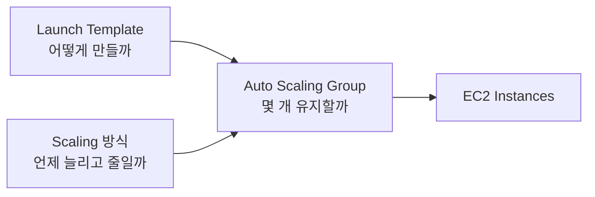

> **Launch Template = Instance 구성 · ASG Capacity = Instance 수 · Scaling = 언제 수를 바꿀지**

## Computing

### AWS Lambda

- 서버를 직접 Provisioning하거나 관리하지 않고 **Code를 실행하는 Serverless Compute Service**
  - AWS가 Server, OS, Runtime Infrastructure 등을 관리
  - 사용자는 **Code와 Application Logic**에 집중
- Request나 Event가 발생할 때 Function을 실행
  - 사용량에 따라 **자동 Scaling**
  - 요청할때만 시스템을 사용하는 온디맨드 방식의 실행으로 실제 실행한 만큼만 비용 지불
- 다양한 AWS Service와 연동하여 **Event-driven 처리** 가능
  - 예 : S3에 File Upload → Lambda 실행
- **Amazon CloudWatch**와 연동하여 Log와 Metric을 Monitoring
- 다양한 Runtime 지원
  - Node.js
  - Python
  - Java
  - .NET
  - Go 등
- Environment Variable, Version, Container Image 등 다양한 실행 설정 지원


- 주요 사용 사례
  - **S3 Event 처리**
    - File Upload를 Trigger로 Lambda 실행
    - 예 : Image Resize, File Processing
  - **Kinesis와 연동한 실시간 Streaming 처리**
  - **Serverless Web / Backend**
    - API 요청 처리
    - API Gateway 등과 연동
  - **Batch 작업**
  - 다른 AWS Service의 Event를 **Trigger**로 자동 작업 수행

> **Lambda = Event 발생 → Function 실행 → 필요한 작업 처리**

### AWS Batch

- 대규모 **Batch Computing 작업을 실행·스케줄링·관리**하는 완전 관리형 Service
- 대량의 계산 작업이나 데이터 처리처럼 **시작과 끝이 있는 작업**에 적합
  - Data Processing
  - ETL
  - Simulation
  - ML / Analytics Workload
- Job을 Queue에 넣으면 AWS Batch가 **필요한 Compute Resource를 자동으로 준비하고 실행**
- Container 기반으로 Job 실행
  - Amazon ECS
  - Amazon EKS
  - AWS Fargate
  - EC2 On-Demand / Spot 등을 활용 가능
- Workload에 따라 Compute Capacity를 자동으로 확장·축소
- 반복 작업이 필요하면 별도의 Scheduling과 연동 가능

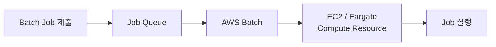

> **AWS Batch = 대규모 Batch Job을 Queue에 넣으면 필요한 Compute를 준비해서 실행**

### AWS Batch vs Lambda

| 구분 | AWS Batch | AWS Lambda |
|---|---|---|
| 주요 용도 | **대규모 Batch Computing** | **Event-driven Function 실행** |
| 실행 환경 | Container 기반 Compute (ECS, Fargate) | **Serverless** |
| 확장 | 필요한 Compute Resource를 확장·축소 | 요청/Event에 따라 **자동 Scaling** |
| 비용 | 사용한 Compute Resource에 따라 과금 (AWS Batch 자체 추가 요금 없음) | **요청 수 + 실행 시간**에 따라 과금 |
| 실행 시간 | **장시간 작업 가능** | **최대 15분** |
| 적합한 작업 | ETL, 대규모 데이터 처리, Simulation (대규모 컴퓨팅 작업) | API Backend, S3 Event 처리, 짧은 자동화 작업 (이벤트 기반 작업) |

> **Batch = 오래 걸리고 무거운 작업 · Lambda = 짧고 Event 중심인 작업**

### Amazon Lightsail

- AWS를 처음 사용하는 사람도 **간단한 웹 사이트나 Web Application을 쉽게 배포**할 수 있도록 단순화한 서비스
- 필요한 Resource를 한곳에서 간단하게 구성 가능
  - Virtual Server
  - Container
  - Managed Database
  - Storage
  - Load Balancer
  - DNS / CDN 등
- WordPress, LAMP, Node.js 등의 **Blueprint**를 이용해 미리 구성된 환경을 빠르게 생성 가능
- 복잡한 AWS 서비스들을 직접 조합하는 것보다 설정이 단순하고 **예측 가능한 요금제**를 제공
- 소규모 Web Site, 개인 Project, 간단한 Application Hosting 등에 적합

> **Lightsail = AWS를 단순화한 쉬운 Hosting / VPS 서비스 · 빠른 Web Application 배포**

### EC2 vs Amazon Lightsail

| 구분 | Amazon EC2 | Amazon Lightsail |
|---|---|---|
| 특징 | **범용 Virtual Server** | **단순화된 Hosting / VPS** |
| 설정 | 세부 설정과 제어 가능 | 미리 구성된 Plan / Blueprint로 쉽게 시작 |
| Instance | 매우 다양한 Type과 Size | 비교적 단순한 Instance Plan |
| Scaling | **Auto Scaling 구성 가능** | EC2 Auto Scaling 같은 자동 확장 기능은 제한적 |
| 가격 | On-Demand, Savings Plans, RI, Spot 등 다양한 방식 | **예측하기 쉬운 Bundle 요금** |
| AWS 연동 | 다양한 AWS Service와 직접 통합 | 다른 AWS Service와 연동 가능하지만 구조가 상대적으로 단순 |
| 적합한 용도 | 복잡하거나 확장성이 필요한 다양한 Workload | 개인 Website, 소규모 Web App, 간단한 Hosting |

> **EC2 = 높은 자유도와 확장성 · Lightsail = 단순하고 빠른 Hosting**

### Container

- Application과 실행에 필요한 **Library / Dependency를 하나로 Package**하여 격리된 환경에서 실행하는 방식
- **Host OS의 Kernel을 공유**하면서 각 Container는 서로 격리되어 실행
  - VM처럼 Container마다 별도의 OS를 실행하지 않아 **가볍고 빠름**
- **Container Image**
  - Application 실행에 필요한 Code, Library, 설정 등을 담은 Template
  - Image를 실행하면 Container가 생성됨
- 동일한 Image를 사용하면 개발 / 테스트 / 운영 환경에서 **일관된 실행 환경**을 구성하기 쉬움
- 빠른 배포와 확장이 가능하여 **Microservices Architecture**에서 많이 사용
- 대표 기술
  - **Docker** : Container 생성·실행
  - **Kubernetes** : 여러 Container의 배포·확장·운영을 관리하는 Orchestration Platform

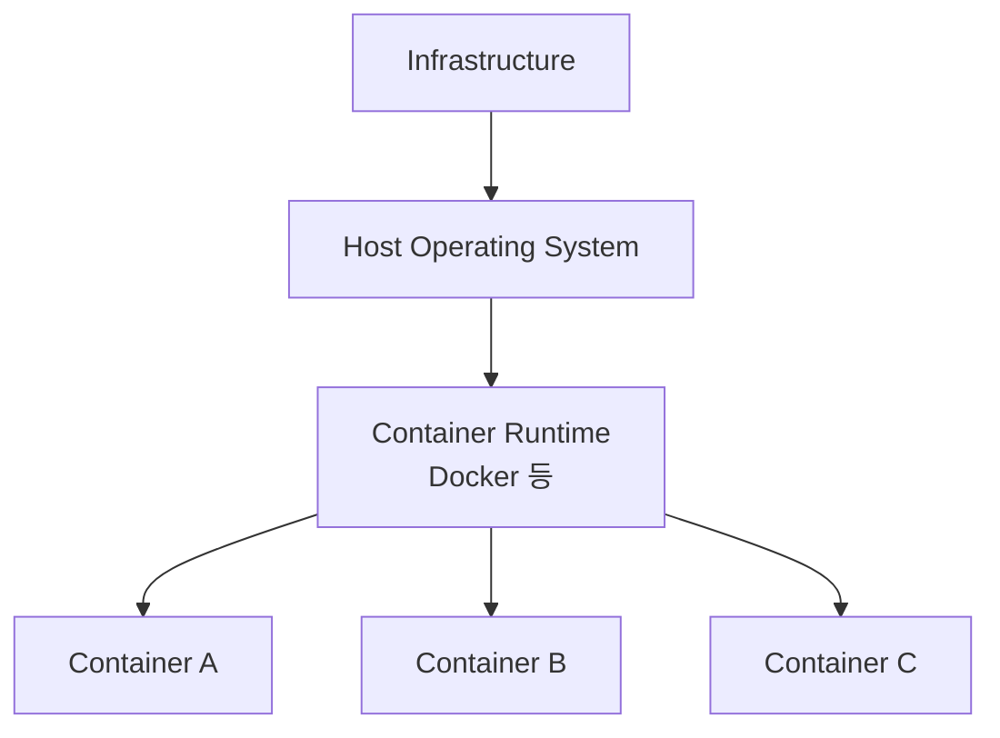

> **Image = Container를 만드는 Template · Container = Image를 실제로 실행한 Instance**

### ECR : Elastic Container Registry

- Container Image를 **저장·관리·배포하는 완전 관리형 Container Registry**
  - AWS에서 사용하는 **Docker Hub 같은 Image 저장소**
- Container Image를 Repository에 저장하고 ECS, EKS 등의 서비스에서 가져와 실행 가능
- **IAM과 통합**
  - IAM Policy를 통해 Image / Repository에 대한 접근 권한 제어
- Repository 유형
  - **Private Repository**
    - 권한이 있는 사용자나 AWS Resource만 접근 가능
  - **Public Repository**
    - 외부 사용자도 공개된 Image에 접근 가능

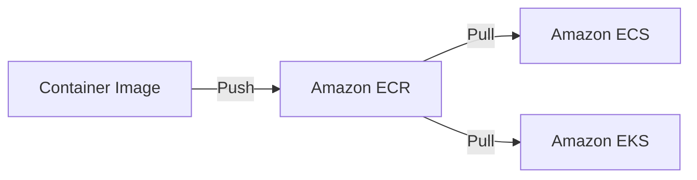

> **ECR = Container Image 저장소 · IAM으로 접근 제어 · ECS/EKS가 Image를 Pull해서 실행**

## Simple Storage Service (S3)

### Amazon S3 : Simple Storage Service

- 거의 무제한으로 확장 가능한 **Object Storage Service**
  - File System이나 Block Storage가 아니라 데이터를 **Object 단위**로 저장
- 데이터 구조
  - **Bucket** : Object를 저장하는 Container
  - **Object** : 실제 저장되는 File / Data
- S3 Bucket은 **특정 Region에 생성**
  - 명시적으로 다른 Region으로 복제하지 않는 한 데이터는 해당 Region에 유지
- S3 Standard는 **99.999999999% (11 nines) Durability**를 목표로 설계
  - 데이터를 **최소 3개 Availability Zone**에 걸쳐 중복 저장
  - 단, S3 One Zone 계열은 하나의 AZ에 저장
- 저장 용량에 맞춰 자동으로 확장되므로 사용자가 Storage Server를 직접 관리할 필요 없음
- 저장 기능 외에도 다양한 기능 제공
  - **Versioning** : Object의 이전 Version 보존 및 복구
  - **Static Website Hosting**
  - Backup / Archive
  - Access Control 등

> **S3 = Object Storage · Bucket 안에 Object 저장 · 높은 Durability · Region 기반 · Versioning**

### S3 Bucket / Object

- **Bucket**
  - S3 Object를 저장하는 Container
  - **글로벌 서비스지만 특정 AWS Region에 생성**
  - 일반적인 General Purpose Bucket은 기본적으로 **Global Namespace**를 사용하므로 Bucket Name이 고유해야 함

- **Object**
  - S3에 실제로 저장되는 Data / File
  - 각 Object는 Bucket 안에서 고유한 **Key**를 가짐

- Object Key
  - 예 : `test_dir/another_dir/my_file.txt`
  - S3에는 실제 Directory / Folder 계층이 없음
  - `/`를 포함한 **Prefix를 이용해 Folder처럼 표현**

```text
s3://test-bucket/test_dir/another_dir/my_file.txt
     └─ Bucket ─┘└────────── Object Key ──────────┘

Object Key
= Prefix + Object Name

Prefix      : test_dir/another_dir/
Object Name : my_file.txt
```

- 큰 Object는 **Multipart Upload**를 이용해 여러 Part로 나누어 Upload 가능
  - 일부 Part 전송이 실패해도 해당 Part만 다시 Upload 가능

> **S3 = Bucket 안에 Object 저장 · Object는 Key로 식별 · Folder처럼 보이는 것은 실제 Directory가 아니라 Prefix**

### S3 사용 사례

- **Backup / Storage**
  - 개인 및 기업 Data Backup
  - 장기간 Data 보관
- **Data Lake**
  - 대규모 Data를 저장하고 Analytics / Big Data 처리의 저장소로 활용
- **Static Website Hosting**
  - HTML, CSS, JavaScript 등의 정적 Website Hosting
  - 서버 측 Code를 직접 실행하는 용도는 아님
- **Media / File Hosting**
  - Image, Video, Document 등 다양한 File 저장 및 배포
- **Versioning**
  - Object의 여러 Version을 보존하여 삭제·변경된 Data 복구 가능
- **Access Control**
  - IAM, Bucket Policy 등을 이용해 Data 접근 권한 제어
- **Archive / Disaster Recovery**
  - 장기 보관 및 재해 복구용 Data 저장
  - 저비용 Archive가 필요한 경우 S3 Glacier Storage Class 활용

> **S3 = Backup · Data Lake · Static Website · File Hosting · Versioning · Archive**

### S3 Bucket Policy

- S3 Bucket과 Object에 대한 접근 권한을 제어하는 **Resource-based Policy**
  - JSON 형식으로 작성
  - Bucket 자체에 연결하여 적용
- 주요 요소
  - **Effect** : `Allow` / `Deny`
  - **Principal** : 누구에게 권한을 줄지 지정
  - **Action** : 허용하거나 거부할 S3 작업
    - 예 : `s3:GetObject`, `s3:ListBucket`
  - **Resource** : Policy가 적용될 Bucket / Object
  - **Condition** : 특정 조건에서만 Policy가 적용되도록 설정
- 다른 AWS Account에 S3 접근 권한을 주는 **Cross-account Access**에도 활용
- `Explicit Deny`가 존재하면 `Allow`보다 우선
- **S3 Block Public Access**
  - Bucket이나 Object가 실수로 Public으로 공개되는 것을 방지
  - Public Access가 필요하지 않다면 활성화하는 것이 권장됨

```jsonc
{
  "Version": "2012-10-17",
  "Statement": [
    {
      "Effect": "Allow",

      // 권한을 받을 사용자 / 계정 등의 주체
      "Principal": {
        "AWS": "arn:aws:iam::111122223333:user/JohnDoe"
      },

      // 허용할 S3 작업
      "Action": [
        "s3:GetObject"
      ],

      // 접근을 허용할 Object
      "Resource": "arn:aws:s3:::example-bucket/*"
    }
  ]
}
```

> **Bucket Policy = S3 Resource에 붙이는 Resource-based Policy · Principal로 접근 주체 지정 · Public / Cross-account Access 제어에 활용**

### S3 Block Public Access

- S3 Bucket / Object가 실수로 외부에 공개되는 것을 막기 위한 **Public Access 차단 기능**
  - 데이터의 무단 접근이나 외부 노출 방지
- 새로 생성되는 S3 Bucket은 기본적으로 **Public Access가 차단**
- Public Access 차단 설정
  - **ACL을 통한 Public Access 차단**
  - **Bucket Policy / Access Point Policy를 통한 Public Access 차단**
  - 새로 설정되는 Public Access뿐 아니라 기존 설정에 의한 Public Access도 차단 가능
- Static Website Hosting이나 외부에 Resource를 공개해야 하는 경우에는 필요한 Public Access 설정을 별도로 허용

> **Block Public Access = S3의 의도하지 않은 외부 공개를 막는 안전장치**

### S3 ACL : Access Control List

- Bucket이나 Object에 대해 **개별적인 접근 권한을 부여하는 방식**
  - Read / Write 등의 권한 설정 가능
  - 특정 AWS Account나 미리 정의된 Group에 권한 부여 가능
- 비교적 오래된 S3 Access Control 방식
  - 현재는 **IAM Policy / Bucket Policy 사용이 일반적으로 권장**
- 새 S3 Bucket은 기본적으로 **ACL이 비활성화**
  - S3 Object Ownership의 `Bucket owner enforced`가 기본값
  - Bucket Owner가 모든 Object를 소유
  - 접근 권한은 Policy를 통해 관리
- 특별히 Object 단위의 ACL 기반 권한 관리가 필요한 경우 ACL을 활성화해서 사용할 수 있음

> **ACL = Bucket/Object별 세부 권한 제어 · 현재는 기본 비활성화 · 대부분 Policy 사용 권장**

### S3 Versioning

- Bucket 내 Object의 **여러 Version을 보존하고 관리**하는 기능
- Versioning을 활성화하면 같은 Key의 Object를 다시 Upload해도 기존 Object를 덮어쓰지 않고 **새 Version으로 저장**
  - 이전 Version으로 복원 가능
  - 실수로 덮어쓰거나 삭제한 Data 복구에 유용
- Object를 일반적인 방식으로 삭제하면 실제 Version이 바로 제거되지 않고 **Delete Marker**가 생성
  - Delete Marker 때문에 Object가 삭제된 것처럼 보임
  - Delete Marker를 제거하면 이전 Version을 다시 표시할 수 있음
  - 특정 Version을 영구 삭제하려면 **해당 Version ID를 지정하여 삭제**
- Versioning을 한 번 활성화하면 완전히 Disabled 상태로 되돌릴 수 없으며 **Suspend**는 가능
- 이전 Version들도 Storage를 사용하므로 **각 Version에 대해 저장 비용이 발생**

> **Versioning = 덮어쓰기·삭제로부터 복구 · 같은 Key의 여러 Version 보존 · 삭제 시 Delete Marker 생성**

### S3 Replication

- S3 Bucket의 Object를 다른 Bucket으로 **자동 복제**하는 기능
  - **SRR : Same-Region Replication**
    - 같은 Region의 Bucket으로 복제
  - **CRR : Cross-Region Replication**
    - 다른 Region의 Bucket으로 복제
- 복제는 **비동기 방식**으로 수행
- 여러 위치에 Data를 복제하여
  - 가용성 향상
  - Disaster Recovery
  - 규정 준수 및 Data 지역 분산 등에 활용
- S3가 사용자를 대신해 Object를 복제할 수 있도록 **IAM Role** 필요
- Replication을 사용하려면 **Source와 Destination Bucket에서 Versioning이 활성화**되어 있어야 함

> **S3 Replication = SRR / CRR · 비동기 복제 · Versioning 필요 · IAM Role 필요**

### S3 Static Website Hosting

- S3 Bucket에 저장된 파일을 이용해 **정적 Website를 Hosting**하는 기능
  - HTML
  - CSS
  - JavaScript
  - Image 등
- **Server-side Code를 직접 실행할 수 없음**
  - 동적 처리가 필요한 경우 Lambda, EC2 등의 Compute Service 사용
- 별도의 Web Server를 직접 구축하거나 관리할 필요 없음
- Website를 외부에 직접 공개하려면 Bucket의 **Public Read Access** 설정 필요
- Bucket을 Static Website Hosting으로 설정하면 **Website Endpoint URL**이 생성됨

> **S3 Static Website Hosting = HTML/CSS/JS 같은 정적 콘텐츠 Hosting · 동적 Server Code 실행 불가**

### S3 Storage Class

- **S3 Standard**
  - 가장 일반적인 기본 Storage Class
  - **자주 Access하는 Data**에 적합
  - 여러 Availability Zone에 Data를 저장하여 높은 가용성과 내구성 제공
  - Website, Content Distribution, Big Data 등 다양한 Workload에 사용

- **S3 Standard-IA : Infrequent Access**
  - **자주 Access하지 않지만 필요할 때 즉시 Access해야 하는 Data**에 적합
  - Standard보다 Storage 비용이 저렴
  - Backup, Disaster Recovery, 장기 보관 Data 등에 적합

- **S3 One Zone-IA**
  - Standard-IA와 비슷하지만 Data를 **하나의 Availability Zone에만 저장**
  - Standard-IA보다 저렴하지만 AZ 장애에 취약
  - **재생성 가능한 Data**나 가용성 요구가 낮은 Data에 적합

> **Standard = 자주 사용 · Standard-IA = 드물게 사용하지만 즉시 Access · One Zone-IA = 드물게 사용 + 단일 AZ로 더 저렴**

- **S3 Intelligent-Tiering**
  - Object의 **Access Pattern을 자동으로 분석**하여 비용 효율적인 Tier로 이동
  - Access Pattern을 예측하기 어렵거나 자주 변하는 Data에 적합
  - 사용자가 직접 Storage Class를 계속 변경할 필요 없음

- **S3 Glacier Instant Retrieval**
  - 거의 Access하지 않지만 필요할 때는 **즉시 Access**해야 하는 Archive Data
  - **Millisecond 단위 Retrieval**
  - 장기간 보관하면서 빠른 조회가 필요한 Data에 적합

- **S3 Glacier Flexible Retrieval**
  - 거의 Access하지 않는 **Backup / Archive Data**에 적합
  - Storage 비용이 저렴하지만 **즉시 Access할 수 없음**
  - Retrieval에 **몇 분 ~ 수 시간**이 걸릴 수 있음
  - Backup, Disaster Recovery 등에 적합

- **S3 Glacier Deep Archive**
  - 거의 Access하지 않는 **장기 Archive Data**에 적합
  - S3에서 가장 저렴한 Storage Class 중 하나
  - Retrieval에 **수 시간 이상** 걸릴 수 있음
  - 장기간 보존해야 하는 규정 / Compliance Data 등에 적합

> **Intelligent-Tiering = Access Pattern을 모르면 자동 최적화 · Glacier Instant = Archive지만 즉시 조회 · Flexible = 저렴한 Archive · Deep Archive = 가장 장기적이고 저렴한 Archive**

### S3 Lifecycle

- S3 Object의 **수명 주기를 자동으로 관리**하는 기능
- Lifecycle Rule을 설정하여 Object에 자동 작업 수행
  - **Transition**
    - 일정 기간이 지나면 더 저렴한 Storage Class로 이동
    - 예 : Standard → Standard-IA → Glacier
  - **Expiration**
    - 일정 기간이 지난 Object를 자동 삭제
- 오래된 Data를 저렴한 Storage Class로 이동하여 **Storage 비용 절감**
- Bucket 전체 또는 특정 Prefix / Tag 등의 Object에 Lifecycle Rule 적용 가능

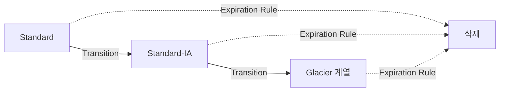

> **S3 Lifecycle = 오래된 Object를 저렴한 Storage Class로 자동 이동하거나 삭제**

### S3 Encryption

- S3 Data는 **저장 중(At Rest)**과 **전송 중(In Transit)** 암호화 가능
- 새로 Upload되는 S3 Object는 기본적으로 **SSE-S3로 자동 암호화**

- Server-side Encryption
  - **SSE-S3**
    - S3가 관리하는 Key를 사용
    - **AES-256**으로 암호화
    - 가장 기본적인 방식
  - **SSE-KMS**
    - AWS KMS의 Key를 사용
    - Key 권한 관리, 감사, Rotation 등 **더 세밀한 Key 관리** 가능
  - **SSE-C**
    - 사용자가 직접 제공하는 Key를 사용
    - AWS는 Key를 저장하지 않으며 사용자가 Key를 관리

- 전송 중 암호화
  - **HTTPS / TLS**를 사용하여 Client와 S3 사이의 Data 보호

> **SSE-S3 = S3가 Key 관리 · SSE-KMS = KMS로 세밀한 Key 관리 · SSE-C = 사용자가 Key 직접 관리**

### S3 Storage Lens

- 조직 전체의 S3 Storage 사용 현황을 **모니터링하고 분석**하는 서비스
- 여러 Account / Bucket의 S3 데이터를 하나의 Dashboard에서 확인 가능
- 다양한 Metric을 통해 S3 사용 상태를 분석
  - **Storage 사용량**
  - **Object 수**
  - **Access Pattern / 활동**
  - **비용 효율성**
  - **Data Protection / 보안 상태**
- Dashboard를 통해 Storage 사용량과 활동의 **추세를 시각화**
- 분석 결과와 권장 사항을 활용하여 **비용 최적화와 관리 개선**에 활용

> **S3 Storage Lens = 여러 Bucket / Account의 S3 사용 현황을 한눈에 분석하고 최적화**

### S3 Transfer Acceleration

- 전 세계에서 S3로 **Upload / Download할 때 전송 속도를 향상**시키는 기능
- 사용자는 가까운 **AWS Edge Location**으로 데이터를 전송
  - 이후 AWS의 Global Network를 통해 대상 S3 Bucket까지 빠르게 전달
- 특히 사용자와 S3 Bucket 사이의 **물리적 거리가 멀 때** 효과적
- 기존 Application Code를 크게 변경하지 않고 별도의 **Accelerate Endpoint**를 사용해 적용 가능
- 추가 비용이 발생할 수 있음

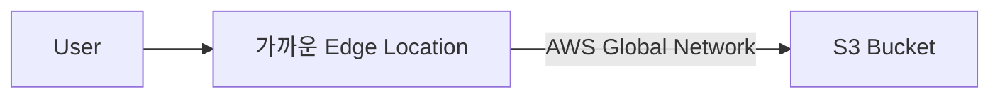

> **Transfer Acceleration = 가까운 Edge Location까지 먼저 전송 → AWS Network를 이용해 S3까지 빠르게 전달**

## Database

### 관계형 데이터베이스란?

- 구조화된 Data를 **Table** 형태로 저장하고 관리
- Table은 **Row / Column**으로 구성
- **Primary Key**로 각 Row를 식별하고, Key를 이용해 Table 간 관계를 표현
- **SQL**을 사용하여 Data를 조회하고 관리

> **RDB = Table / Relation 기반 구조 · SQL 사용 · Transactional Workload에 적합**

### Amazon RDS : Relational Database Service

- AWS의 **Managed Relational Database Service**
  - Database Infrastructure 운영 부담을 줄이고 쉽게 관계형 DB를 구축·관리
- 다양한 Database Engine 지원
  - MySQL
  - PostgreSQL
  - MariaDB
  - Oracle
  - Microsoft SQL Server 등
- AWS가 Database 운영에 필요한 여러 관리 작업을 지원
  - **자동 Backup**
  - Patch / Maintenance
  - Monitoring
  - 장애 복구 등
- 필요에 따라 Instance 성능과 Storage 용량을 조절 가능

- **Read Replica**
  - 원본 DB의 데이터를 복제한 **읽기 전용 DB**
  - 원본에서 Replica로 **비동기 복제**
  - Read Traffic을 여러 Replica로 분산하여 **읽기 성능 확장**
  - 필요하면 Replica를 독립 DB로 Promotion 가능

- **Multi-AZ**
  - 다른 Availability Zone에 **Standby DB**를 구성
  - Primary DB 장애 발생 시 Standby로 **자동 Failover**
  - 성능 확장보다는 **High Availability / 장애 대응**이 목적

> **Read Replica = 읽기 성능 확장 · Multi-AZ = 고가용성 / 자동 Failover**

### Amazon Aurora

- AWS가 자체 개발한 **완전 관리형 관계형 Database**
  - Amazon RDS에서 사용할 수 있는 Database Engine 중 하나
- **MySQL / PostgreSQL과 호환**
  - 기존 MySQL / PostgreSQL Application과 Tool을 대부분 그대로 사용 가능
- 높은 **성능, 가용성, 확장성**을 제공하도록 AWS Cloud에 최적화
- **Cluster 기반**으로 동작
  - 여러 DB Instance가 하나의 분산 Storage를 공유
  - Read Replica를 추가하여 **Read 성능 확장** 가능
- Storage는 Data 증가에 따라 **자동으로 확장**
- Provisioning, Patch, Backup, Recovery 등의 관리 작업을 AWS가 지원
- **Aurora Serverless**
  - Application 수요에 따라 Database Compute Capacity를 **자동으로 확장·축소**
  - 사용량이 일정하지 않거나 예측하기 어려운 Workload에 적합

> **Aurora = AWS 자체 관계형 DB · MySQL/PostgreSQL 호환 · 고성능/고가용성 · 자동 Storage 확장 · Serverless 지원**

### NoSQL : Non-Relational Database

- 관계형 Table 구조에 한정되지 않는 **비관계형 Database**
  - 일반적으로 **Not Only SQL**이라는 의미로 사용
- 고정된 Schema보다 **유연한 Data Model**을 사용할 수 있어 구조 변경과 확장이 용이
- 대규모 Data와 높은 처리량을 처리하도록 **수평적 확장(Scale Out)**에 유리한 경우가 많음
- Data 특성에 따라 다양한 Model 사용
  - **Key-Value** : Key와 Value 쌍
  - **Document** : JSON과 유사한 Document 형태
  - **Wide-Column** : Column 기반
  - **Graph** : Node와 Relationship 기반
- AWS의 대표적인 NoSQL Service
  - **Amazon DynamoDB** : Key-Value / Document
  - Amazon DocumentDB : Document
  - Amazon Neptune : Graph

> **RDB = 정형화된 관계형 구조 · NoSQL = 유연한 Data Model과 Scale Out에 적합**

### Amazon DynamoDB

- AWS의 **Serverless NoSQL Database Service**
  - Server Provisioning, Patch, 관리 작업을 직접 수행할 필요 없음
- Data를 여러 Availability Zone에 복제하여 **High Availability와 Durability** 제공
- 매우 높은 처리량과 **낮은 Latency**가 필요한 Application에 적합
  - 대규모 Request 처리 가능
  - 일반적으로 **밀리초 단위의 빠른 응답**
- **Multi-Region / Multi-Active** Database 구성 지원
  - 여러 Region에서 Read / Write 가능
  - Application의 Global Availability와 Disaster Recovery 향상
- **DAX : DynamoDB Accelerator**
  - DynamoDB용 완전 관리형 **In-Memory Cache**
  - 반복적으로 조회되는 Data의 응답 속도를 더욱 향상

> **DynamoDB = Serverless NoSQL · 높은 확장성 · 낮은 Latency · Multi-Region 지원 · DAX로 Cache**

### Amazon DocumentDB

- AWS의 **완전 관리형 Document Database Service**
- **MongoDB 호환** API를 제공
  - 기존 MongoDB Application Code, Driver, Tool을 활용하기 쉬움
- JSON과 유사한 **Document 형태의 Data** 저장에 적합
- AWS가 Database 운영과 Scaling 등의 관리 작업을 지원

> **DocumentDB = MongoDB 호환 · Document Database · 완전 관리형**

### Amazon Keyspaces

- AWS의 **Serverless Apache Cassandra 호환 Database Service**
- 기존 Cassandra Application Code와 Driver를 활용하여 AWS에서 Workload 실행 가능
- Server Provisioning이나 운영·관리 없이 사용 가능
- Application 수요에 따라 자동으로 확장되어 **대규모 Cassandra Workload** 처리에 적합

> **Keyspaces = Cassandra 호환 · Serverless · 자동 Scaling**

### In-Memory Database

- Data를 Disk가 아니라 **Main Memory(RAM)**에 저장하고 처리하는 Database
- Disk I/O를 줄여 **매우 빠른 Read / Write와 낮은 Latency** 제공
- 빠른 응답이 필요한 Workload에 적합
  - Cache
  - Session Store
  - Real-time Ranking / Leaderboard
  - 실시간 Application Data
- 일반적인 Disk 기반 Database보다 빠르지만, Memory를 사용하므로 비용과 영속성 특성을 고려해야 함
- AWS의 대표적인 In-Memory Service
  - **Amazon ElastiCache**
    - Redis OSS / Valkey / Memcached 기반
  - **Amazon MemoryDB**
    - Valkey / Redis OSS 호환의 Durable In-Memory Database

> **In-Memory = RAM에 Data 저장 → 매우 빠른 응답 · Cache와 실시간 처리에 적합**

### Amazon ElastiCache

- AWS의 **완전 관리형 In-Memory Cache Service**
- 자주 조회되는 Data를 RAM에 Cache하여 **Database 부하를 줄이고 응답 속도를 향상**
- 지원 Engine
  - **Valkey**
  - Redis OSS
  - Memcached
- **Microsecond 수준의 낮은 Latency** 제공
- Session Store, Database Query Cache, 실시간 Application 등에 활용
- Cluster 구성, Monitoring, Failover 등의 운영 작업을 AWS가 지원

> **ElastiCache = 자주 읽는 Data를 RAM에 Cache → 기존 Database의 성능 향상**

### Amazon MemoryDB

- AWS의 **완전 관리형 Durable In-Memory Database**
- **Valkey / Redis OSS 호환**
- Memory 기반의 빠른 성능과 함께 **Data Durability**를 제공
- 기존 Valkey / Redis OSS Application, Client, Tool을 활용하기 쉬움
- 매우 낮은 Latency가 필요하면서 **Database 자체로 Data를 보존**해야 하는 Workload에 적합

> **MemoryDB = 빠른 In-Memory Database + Data 영속성**

> **ElastiCache = Cache가 중심 · MemoryDB = Database 자체가 중심**

### Amazon Neptune

- AWS의 **완전 관리형 Graph Database Service**
- Node와 Edge를 이용해 **Data 간의 복잡한 관계**를 저장하고 탐색하는 데 적합
- 관계가 많은 Data를 빠르게 조회하도록 최적화
- 대표적인 사용 사례
  - **추천 시스템**
  - Fraud Detection
  - Knowledge Graph
  - Social Network
  - Network / Security 관계 분석

> **Neptune = 관계가 복잡하게 연결된 Data를 위한 Graph Database**

### Amazon Timestream

- 시간의 흐름에 따라 발생하는 Data를 저장·분석하는 **Time Series Database**
- 시간에 따라 지속적으로 생성되는 Data에 적합
  - IoT Sensor Data
  - Application Metric
  - Monitoring Data
- 현재 **Timestream for LiveAnalytics는 신규 고객 사용이 제한**되어 있음

> **Timestream = 시간에 따라 발생하는 Time Series Data**

### AWS Database 정리

| Data Model / 용도 | AWS Service | 핵심 |
|---|---|---|
| **Relational** | Amazon RDS | Managed 관계형 DB, MySQL/PostgreSQL/Oracle/SQL Server 등 지원 |
| **Relational** | Amazon Aurora | AWS 자체 관계형 DB, **MySQL/PostgreSQL 호환**, 고성능·고가용성 |
| **Key-Value / Document** | Amazon DynamoDB | **Serverless NoSQL**, 낮은 Latency와 대규모 Scaling |
| **Document** | Amazon DocumentDB | **MongoDB 호환** Document Database |
| **Wide-Column** | Amazon Keyspaces | **Apache Cassandra 호환 Serverless DB** |
| **Graph** | Amazon Neptune | Node / Edge / Relationship 기반 **Graph Database** |
| **In-Memory Cache** | Amazon ElastiCache | 자주 사용하는 Data를 Cache하여 **DB 부하 감소 및 응답 속도 향상** |
| **In-Memory Database** | Amazon MemoryDB | **Durable In-Memory Database**, Valkey / Redis OSS 호환 |
| **Time Series** | Amazon Timestream | 시간에 따라 발생하는 Metric / IoT 등의 **Time Series Data** |
| **Data Warehouse** | Amazon Redshift | 대규모 Data를 SQL로 분석하는 **OLAP / Data Warehouse** |

> **RDS/Aurora = 관계형 · DynamoDB = Key-Value/Document · DocumentDB = MongoDB · Keyspaces = Cassandra · Neptune = Graph · ElastiCache = Cache · MemoryDB = Durable In-Memory · Redshift = Data Warehouse**

## Data Analysis

```mermaid
flowchart LR
    SD[Streaming Data] --> K[Kinesis<br/>수집 / 처리]
    S3[S3 Data] --> G[AWS Glue<br/>Data 준비 / Catalog]
    S3 --> A[Amazon Athena<br/>S3 SQL Query]
    S3 --> E[Amazon EMR<br/>Hadoop / Spark Processing]
    G -.Data Catalog.-> A
    G --> R[Amazon Redshift<br/>Data Warehouse / Analytics]
    A --> Q[Amazon QuickSight<br/>Visualization]
    R --> Q
```

### AWS DMS : Database Migration Service

- Database를 AWS로 **이동하거나 지속적으로 복제**하는 완전 관리형 Service
- 다양한 Database Migration 지원
  - **Homogeneous Migration**
    - 같은 종류의 Database Engine 간 Migration
    - 예 : MySQL → Amazon RDS for MySQL
  - **Heterogeneous Migration**
    - 서로 다른 Database Engine 간 Migration
    - 예 : Oracle → PostgreSQL
- On-Premises ↔ AWS, AWS 내 Database 간 Migration 등에 활용
- 기존 Source DB를 계속 운영하면서 변경 Data를 복제할 수 있어 **Downtime을 최소화**하는 Migration에 적합
- 서로 다른 Database Engine으로 이전할 때는 Schema 변환이 필요할 수 있음
  - **DMS Schema Conversion / AWS SCT** 등을 이용해 Schema와 일부 DB Code 변환

> **DMS = Database Data 이동·복제 · 최소 Downtime Migration**
> **Schema Conversion = 서로 다른 DB Engine의 Schema 변환**

### Amazon EMR : Elastic MapReduce

- AWS의 **Managed Big Data Processing Service**
  - Hadoop, **Apache Spark** 등의 Open Source Framework를 이용한 대규모 Data 처리 / 분석에 활용
- 필요한 Cluster를 쉽게 생성하고 관리할 수 있어 직접 Hadoop Infrastructure를 구축하는 부담을 줄임
- 다양한 AWS Data Source와 연계 가능
  - **Amazon S3**
  - DynamoDB
  - RDS
  - Redshift 등
- Workload에 따라 Cluster의 Compute Resource를 **확장 / 축소** 가능
- EC2 **Spot Instance / Reserved Instance** 등을 활용하여 비용 최적화 가능
- **EMR Serverless**
  - Cluster나 Server를 직접 Provisioning / 관리하지 않고 Spark 등의 Big Data Workload 실행 가능

> **EMR = Hadoop / Spark 기반 대규모 Data Processing · Big Data 분석 · Managed Cluster**

### Amazon Athena

- Amazon S3에 저장된 Data를 **Standard SQL로 직접 분석**하는 Serverless Query Service
- 별도의 Database Server나 Cluster를 Provisioning / 관리할 필요 없음
- S3 Data를 별도로 다른 Database에 적재하지 않고 **바로 Query 가능**
- 다양한 Data Format 지원
  - CSV
  - JSON
  - Parquet
  - ORC
  - Avro 등
- AWS Glue Data Catalog와 연계하여 Table / Schema 정보를 관리할 수 있음
- Query에서 **Scan한 Data 양을 기준으로 과금**
  - 따라서 Partitioning, Compression, Parquet / ORC 같은 Columnar Format을 사용하면 비용 절감 가능

> **Athena = Serverless SQL · S3 Data를 바로 Query · 별도 Data 적재 불필요**

### AWS Glue

- 여러 Source의 Data를 **검색·준비·이동·통합**할 수 있도록 하는 **Serverless Data Integration Service**
- **완전 관리형 ETL(Extract, Transform, Load) Service**
  - Data를 추출하고 변환하여 원하는 Data Store로 적재
- Data Pipeline 구축과 실행을 지원
  - Scheduling
  - Monitoring
  - Data Transformation
- 시각적 Interface를 이용해 **Code 작성 없이 ETL 작업을 구성**할 수도 있음
- **AWS Glue Data Catalog**
  - Data의 **Schema와 Metadata를 저장·관리**
  - Data가 어디에 있고 어떤 구조인지 다른 분석 Service가 활용할 수 있도록 제공
- S3, Redshift 등 다양한 AWS 및 외부 Data Source와 연동 가능

> **Glue = Serverless Data Integration · ETL · Data Catalog**
> **Athena = S3 Data를 SQL로 분석 / Glue = Data를 준비·변환하고 Catalog 관리**

### Amazon Redshift

- AWS의 **완전 관리형 Data Warehouse Service**
  - 대규모 Data를 저장하고 **SQL로 분석하는 OLAP Workload**에 적합
- **Columnar Storage**
  - Data를 Column 단위로 저장하여 대규모 분석 Query와 압축에 유리
- **MPP : Massively Parallel Processing**
  - Query를 여러 Compute Resource에서 병렬 처리하여 대규모 Data를 빠르게 분석
- 기존 BI Tool과 연동하여 Data 분석 및 Reporting 가능
  - 예 : Amazon QuickSight
- **Redshift Serverless**
  - Data Warehouse Cluster를 직접 Provisioning / 관리하지 않고 분석 가능
  - Workload에 따라 Compute Capacity를 **자동으로 확장·조절**

> **Redshift = Data Warehouse · OLAP · Columnar Storage · MPP · 대규모 SQL Analytics**
> **RDS / Aurora = Transaction 처리(OLTP) · Redshift = 대규모 분석(OLAP)**

### Amazon Kinesis

- **실시간 Streaming Data를 수집하고 처리**하기 위한 AWS Service 계열
- Log, Clickstream, IoT Event 등 지속적으로 발생하는 Data를 실시간으로 처리하는 데 활용

- **Kinesis Data Streams**
  - 대규모 Streaming Data를 **실시간으로 수집하고 저장**
  - Application이 Stream의 Data를 읽어 직접 처리
  - Log, Event, Clickstream 등의 Real-time Processing에 적합

- **Amazon Data Firehose**
  - 이전 이름 : `Kinesis Data Firehose`
  - Streaming Data를 받아 **S3, Redshift, OpenSearch 등의 Destination으로 자동 전달**
  - Server / Consumer Application을 직접 운영할 필요를 줄임
  - Lambda를 이용해 전달 전에 Data Transformation 가능

- **Amazon Managed Service for Apache Flink**
  - 이전 이름 : `Kinesis Data Analytics`
  - Streaming Data를 Apache Flink로 **실시간 처리·분석**
  - 집계, 실시간 Metric, Streaming Analytics 등에 활용

- **Kinesis Video Streams**
  - Video / Audio 등의 Streaming Data를 수집·저장·처리

> **Data Streams = Stream을 받아두고 Application이 처리**
> **Data Firehose = Stream을 목적지로 자동 전달**
> **Managed Flink = Stream을 실시간 분석**

### Amazon Managed Service for Apache Flink

- **Apache Flink Application을 완전 관리형으로 실행**하는 Service
- Apache Flink를 이용해 대규모 Data의 **실시간 Streaming 처리와 Batch 처리** 가능
- Streaming Data를 실시간으로 **변환·분석**
- Kinesis Data Streams, Amazon MSK, S3 등의 Data Source와 연동 가능
- 처리 결과를 다른 AWS Service나 Application으로 전달 가능

> **Managed Service for Apache Flink = Streaming Data를 실시간으로 처리·분석**

### Amazon Kinesis Video Streams

- **Video / Audio Streaming Data를 수집·저장·처리**하기 위한 Service
- 다양한 Source에서 Live Video Data를 수집 가능
  - Smartphone
  - Security Camera
  - Webcam
  - Drone 등
- 수집한 Video Data를 실시간 또는 Batch 방식으로 분석하는 Application에 활용

> **Kinesis Video Streams = Video / Audio Streaming Data 수집·처리**

### Amazon OpenSearch Service

- AWS의 **완전 관리형 Search / Analytics Service**
  - OpenSearch Cluster의 배포, 운영, 확장 부담을 줄여줌
- 대규모 Data를 **Indexing하여 빠르게 검색하고 분석**
- 특히 **Log Data와 실시간 Monitoring Data 분석**에 많이 활용
- 대표적인 사용 사례
  - **Application / Infrastructure Log 분석**
  - 실시간 Monitoring
  - Security Log / Event 분석
  - Website / Application Search
- Workload에 따라 Cluster의 Compute / Storage를 확장 가능
- OpenSearch Dashboards를 이용해 검색 결과와 Log Data를 시각화할 수 있음

> **OpenSearch = Search + Log Analytics · 대규모 Data Indexing / 검색**

### Amazon QuickSight

- AWS의 **Business Intelligence(BI) / Data Visualization Service**
- 다양한 Data Source를 연결하여 **Dashboard와 Chart를 생성**
  - Amazon S3
  - Athena
  - RDS
  - Redshift
  - 외부 / SaaS Data Source 등
- Data를 시각화하여 **추세, 패턴, 지표를 분석**
- Dashboard를 다른 사용자와 공유하여 Business Insight 제공
- Data Source가 갱신되면 Dashboard도 최신 Data를 기반으로 분석 가능

> **QuickSight = BI Dashboard · Data Visualization · 여러 AWS Data Source 연결**

## Deployments & Managing Infra at Scale

### AWS CloudFormation

- AWS Infrastructure를 **Code로 정의하고 자동으로 Provisioning**하는 IaC(Infrastructure as Code) Service
- **Template**에 원하는 AWS Resource와 설정을 작성
  - EC2
  - VPC
  - S3
  - IAM
  - RDS 등
- Template을 기반으로 **Stack**을 생성하여 여러 AWS Resource를 한꺼번에 생성·관리
- 같은 Template을 반복 사용하여 **동일한 Infrastructure를 재현**할 수 있음
  - 개발 / 테스트 / 운영 환경의 일관성 유지에 유용
- Template을 수정하여 Stack을 Update하면 Infrastructure의 변경 사항을 자동으로 적용
- Resource 간 **Dependency를 자동으로 처리**
- Stack 생성이나 Update가 실패한 경우 **Rollback** 기능을 통해 안정적인 상태로 복구 가능
- Infrastructure 생성·변경·삭제를 자동화하여 수동 설정과 Human Error를 줄일 수 있음

> **CloudFormation = Infrastructure as Code · Template → Stack · AWS Resource 자동 생성/관리**

### AWS CDK : Cloud Development Kit

- AWS Infrastructure를 **Programming Language로 정의**하는 Open Source IaC Framework
- 익숙한 Programming Language를 사용하여 AWS Resource를 구성
  - TypeScript / JavaScript
  - Python
  - Java
  - C#
  - Go
- 일반 Programming의 장점을 Infrastructure 정의에도 활용 가능
  - 함수 / 반복문 / 조건문
  - 객체 지향
  - Code 재사용
  - Module화
- **Construct**라는 재사용 가능한 Component를 조합하여 Infrastructure 구성
- CDK Code는 `cdk synth`를 통해 **CloudFormation Template으로 변환**
  - 이후 CloudFormation을 통해 AWS Resource를 Provisioning

> **CloudFormation = YAML / JSON Template으로 IaC**
> **CDK = Programming Language로 IaC → CloudFormation으로 변환하여 배포**

### AWS Elastic Beanstalk

- Web Application을 **쉽게 배포하고 관리**할 수 있도록 해주는 Managed Application Platform
- Application Code를 Upload하면 Elastic Beanstalk가 실행 환경을 자동으로 구성
  - **EC2 Instance Provisioning**
  - **Load Balancing**
  - **Auto Scaling**
  - **Application Health Monitoring**
- 개발자는 Infrastructure 관리 부담을 줄이고 **Application Code에 더 집중**
- **Java, .NET, Node.js, Python, Ruby, PHP, Docker 등 다양한 Platform 지원**
- Elastic Beanstalk 자체에는 **추가 Service 요금이 없음**
  - 대신 생성된 EC2, ELB, S3 등의 AWS Resource 사용료는 발생
- 기반 AWS Resource에 대한 접근과 설정이 가능하여 완전히 통제권을 잃는 것은 아님

> **Elastic Beanstalk = Code Upload → EC2 / Load Balancing / Auto Scaling 등을 자동 구성하여 Web App 배포**
> **CloudFormation = Infrastructure 자체를 Code로 정의 · Elastic Beanstalk = Application 배포 환경을 자동 구성**

### AWS Developer / Code Services

- Software 개발의 **Source → Build/Test → Deploy** 과정을 관리하고 자동화하는 AWS Developer Service

- **AWS CodeCommit**
  - AWS의 **Managed Private Git Repository**
  - Source Code 저장 및 Version Control

- **AWS CodeBuild**
  - Source Code를 **Build / Test**하는 완전 관리형 Service
  - 별도의 Build Server를 직접 관리할 필요 없음

- **AWS CodeDeploy**
  - Application을 **자동 배포**
  - EC2, ECS, Lambda, On-Premises Server 등에 배포 가능

- **AWS CodePipeline**
  - Source → Build → Test → Deploy 단계를 연결하여 **CI/CD Pipeline 전체를 자동화**
  - CodeBuild, CodeDeploy 및 외부 Tool과 연동 가능

- **AWS CodeArtifact**
  - Application 개발에 사용하는 **Software Package / Dependency Repository**
  - npm, Maven, pip, NuGet 등의 Package 저장 및 공유

```mermaid
flowchart LR
    C[CodeCommit<br/>Source] --> B[CodeBuild<br/>Build / Test]
    B --> D[CodeDeploy<br/>Deploy]
    P[CodePipeline<br/>CI/CD Orchestration] -.Orchestrate.-> C
    P -.Orchestrate.-> B
    P -.Orchestrate.-> D
    A[CodeArtifact<br/>Package / Dependency] --> B
```

> **CodeCommit = Source · CodeBuild = Build/Test · CodeDeploy = Deploy · CodePipeline = CI/CD 전체 흐름 · CodeArtifact = Package Repository**

## Global Infra

### DNS : Domain Name System

- 사람이 읽기 쉬운 **Domain Name을 IP Address로 변환**하는 시스템
  - 예 : `www.example.com` → `192.0.2.44`
- 사용자가 Domain으로 Website에 접속하면 DNS가 해당 Domain의 **IP Address를 조회**
- DNS 정보를 일정 시간 **Cache**하여 반복적인 조회를 줄이고 응답 속도를 향상
- AWS의 대표적인 Managed DNS Service는 **Amazon Route 53**

```mermaid
flowchart LR
    U[User] --> R[DNS Resolver]
    R --> Root[Root Name Server]
    Root --> TLD[TLD Name Server]
    TLD --> A[Authoritative Name Server]
    A --> R
    R -->|IP Address 반환| U
    U -->|IP로 접속| S[Web Server]
```

> **DNS = Domain Name → IP Address · AWS DNS = Route 53**

### Amazon Route 53

- AWS의 **완전 관리형 DNS Service**
  - Domain Name을 AWS Resource나 IP Address에 연결
- 주요 기능
  - **Domain 등록**
  - DNS Record 생성 / 관리
  - **Traffic Routing**
  - **Health Check**
- EC2, ELB, CloudFront, S3 Website 등의 AWS Resource로 Traffic Routing 가능
- Health Check를 통해 Endpoint의 상태를 확인하고 정상적인 Endpoint로 Traffic을 Routing 가능
- DNS 응답의 위변조를 방지하기 위한 **DNSSEC** 지원

- **Routing Policy, 라우팅 정책**
  - **Simple, 단순 라우팅**
    - 하나의 Resource 또는 기본적인 DNS Routing에 사용
  - **Weighted, 가중치 기반 라우팅**
    - Resource별로 **가중치를 지정하여 일정 비율로 Traffic 분배**
    - 예 : A 70% / B 30%
  - **Latency-based, 지연 시간 기반 라우팅**
    - 사용자에게 **Network Latency가 가장 낮은 Region**으로 Routing
  - **Failover, 장애 조치 라우팅**
    - **Primary Resource 장애 시 Secondary Resource로 Traffic 전환**
    - Health Check와 함께 사용
  - **Geolocation, 지리 위치 라우팅**
    - **사용자의 지리적 위치**에 따라 서로 다른 Resource로 Routing
  - **Multi-Value Answer, 다중 응답 라우팅**
    - 하나의 DNS Query에 대해 **여러 정상 Resource의 IP Address를 반환**
    - Health Check와 결합하여 비정상 Resource를 응답에서 제외 가능

> **Route 53 = DNS · Domain 등록 · Health Check · Traffic Routing**
> **Weighted = 비율 · Latency = 낮은 지연 · Failover = 장애 대응 · Geolocation = 사용자 위치 · Multi-Value = 여러 정상 IP 반환**

### Amazon CloudFront

- AWS의 **CDN(Content Delivery Network), 콘텐츠 전송 네트워크 Service**
- 전 세계의 **Edge Location, 엣지 로케이션**을 이용해 사용자에게 Content를 빠르게 전달
- 사용자와 가까운 Edge Location에서 Content를 **Cache, 캐싱**하여
  - Latency 감소
  - Origin Server의 부하 감소
  - Global 사용자에게 빠른 Content 제공
- **Static Content, 정적 콘텐츠**와 **Dynamic Content, 동적 콘텐츠** 모두 전달 가능
- Content의 원본인 **Origin, 오리진**으로 다양한 AWS Resource 사용 가능
  - Amazon S3
  - Application Load Balancer
  - EC2
  - 기타 HTTP Server 등
- HTTPS를 통한 암호화된 Content 전송 지원
- **AWS WAF / AWS Shield**와 연동하여 Web Application을 보호할 수 있음

```mermaid
flowchart LR
    U[User] --> E[CloudFront Edge Location]
    E -->|Cache Hit| U
    E -->|Cache Miss| O[Origin<br/>S3 / ALB / EC2]
    O --> E
```

> **CloudFront = CDN · Edge Location에 Cache · Latency와 Origin 부하 감소**
> **Cache Hit = Edge에서 바로 응답 · Cache Miss = Origin에서 받아와 전달 / Cache**

### AWS Global Accelerator

- AWS의 **Global Network, 글로벌 네트워크**를 이용해 Application으로 향하는 Traffic의 **성능과 가용성을 향상**시키는 Service
- 사용자는 가까운 **AWS Edge Location, 엣지 로케이션**으로 접속
  - 이후 Traffic을 일반 Public Internet 경로에 오래 맡기지 않고 **AWS Global Network**를 통해 Endpoint까지 전달
- **Static Anycast IP, 고정 Anycast IP**를 제공
  - 전 세계 사용자가 동일한 IP Address를 사용해 Application에 접근 가능
- 다양한 AWS Endpoint와 연결 가능
  - **Application Load Balancer(ALB), Network Load Balancer(NLB), EC2 Instance, Elastic IP**
- Endpoint의 **Health Check, 상태 확인**을 통해 장애가 발생하면 정상 Endpoint로 Traffic을 Routing
- Global Application의 **Latency 감소와 Availability 향상**에 적합

```mermaid
flowchart LR
    U[Global User] --> E[Nearest AWS Edge Location]
    E -->|AWS Global Network| A[Healthy Endpoint A]
    E -->|Failover| B[Healthy Endpoint B]
```

> **Global Accelerator = Static Anycast IP · 가까운 Edge 진입 · AWS Global Network로 Application Traffic 가속 · Health Check / Failover**
> **CloudFront = Content Cache / CDN · Global Accelerator = Network Traffic 자체를 가속**

## Integration

### Amazon SQS : Simple Queue Service

- Application / Service 간 Message 전달에 사용하는 **완전 관리형 Message Queue Service**
- Producer와 Consumer 사이에 Queue를 두어 **Service 간 Decoupling, 결합도 감소**에 활용
  - SQS가 없으면 Producer가 각 Consumer를 직접 호출해야 함
  - SQS를 사용하면 Producer는 **Queue에 Message만 전달**
  - Consumer는 자신의 처리 속도에 맞춰 Queue에서 Message를 가져가 처리
  - Consumer가 일시적으로 느려지거나 장애가 발생해도 Message를 Queue에 보관하여 시스템 전체에 미치는 영향을 줄일 수 있음
- 대규모 Message 처리량에 따라 자동으로 확장 가능
- 주요 기능
  - **Dead-Letter Queue(DLQ), 배달 못한 Message 격리**
  - Message Timer
  - Short Polling / Long Polling

- **Standard Queue, 표준 Queue**
  - 높은 처리량에 적합
  - **Message 순서가 항상 보장되지는 않음**

- **FIFO Queue, 선입선출 Queue**
  - **Message 처리 순서를 보장**
  - 순서가 중요한 Workload에 적합

```mermaid
flowchart LR
    P[Producer / App] --> Q[SQS Queue]
    Q --> C1[Consumer 1]
    Q --> C2[Consumer 2]
    Q --> C3[Consumer 3]
```

> **SQS = Message Queue · Service Decoupling · Producer와 Consumer를 분리**
> **Standard = 순서 보장 X · FIFO = 순서 보장**

### Amazon SNS : Simple Notification Service

- AWS의 **완전 관리형 Pub/Sub Messaging Service**
- **Topic, 토픽**을 기반으로 하나의 Message를 여러 Subscriber에게 동시에 전달
  - **Fan-out, 팬아웃** 구조에 적합
- 다양한 Endpoint로 Message 전송 가능
  - **Email, SMS, HTTP/HTTPS, Lambda, SQS 등**
- Event 발생 시 Message를 자동으로 전달하여 **Event-driven Application** 구성에 활용
- Publisher는 Topic에 Message를 보내기만 하면 되고, SNS가 연결된 Subscriber들에게 **Push 방식으로 전달**

```mermaid
flowchart LR
    P[Publisher] --> T[SNS Topic]
    T --> E[Email / SMS]
    T --> Q[SQS Queue]
    T --> L[Lambda]
    T --> H[HTTP / HTTPS Endpoint]
```

> **SNS = Pub/Sub · Push · 하나의 Message를 여러 Subscriber에게 Fan-out**
> **SQS = Queue에 Message 저장 · Consumer가 가져가 처리**

### Amazon SES : Simple Email Service

- AWS의 **완전 관리형 Email Service**
  - Application에서 Email을 **대규모로 발송하거나 수신**할 수 있도록 지원
- **Marketing Email, Newsletter, 알림, Transactional Email** 등 다양한 용도로 사용
- 대량의 Email을 다수의 수신자에게 안정적으로 전송 가능
- **발신자 Identity 인증**과 Spam 관련 기능을 지원하여 Email 신뢰성과 전달 품질 관리
- 전송 결과에 대한 **통계 / Monitoring** 기능 제공
- S3, SNS, Lambda 등 다른 AWS Service와 연동 가능

> **SES = Application용 Email 발송 / 수신 Service · 대량 Email / 알림 / Marketing / Transactional Email**
> **SNS = 여러 종류의 Notification · SES = Email 자체에 특화**

### Amazon API Gateway

- REST / WebSocket API를 **생성·게시·관리·모니터링**하는 완전 관리형 API Service
- Client의 요청을 받아 Backend Service로 전달하는 **API Front Door, API 진입점** 역할
- 다양한 Backend와 연동 가능
  - **AWS Lambda, EC2, 다른 AWS Service, 외부 HTTP Endpoint 등**
- API Response **Caching**을 통해 반복 요청의 응답 속도를 향상하고 Backend 부하 감소
- Amazon CloudWatch와 연동하여 **API 사용량, 성능, 상태를 Monitoring / Logging**
- **Stage, 스테이지**를 사용하여 Development / Test / Production 등 여러 환경 관리 가능
- Lambda와 함께 사용하면 Server를 직접 관리하지 않는 **Serverless API Backend** 구성 가능

```mermaid
flowchart LR
    C[Web / Mobile Client] --> A[API Gateway]
    A --> L[AWS Lambda]
    A --> E[EC2 / ECS]
    A --> S[Other AWS Services]
    A --> H[HTTP Endpoint]
```

> **API Gateway = API Front Door · 요청 Routing · Monitoring · Caching**
> **API Gateway + Lambda = 대표적인 Serverless API 구조**

### Amazon Cognito

- Web / Mobile Application의 **사용자 인증(Authentication)과 사용자 관리**를 제공하는 완전 관리형 Service
- ID / Password 로그인뿐 아니라 **Google, Apple, Facebook 등의 Social Login**과 연동 가능
- MFA 등 사용자 인증 보안 기능 지원

- **User Pool, 사용자 풀**
  - Application 사용자의 **가입 / 로그인 / 계정 관리** 담당
  - 인증된 사용자에게 Token을 발급
  - 쉽게 말해 **“이 사용자가 누구인지 인증”**

- **Identity Pool, 자격 증명 풀**
  - 인증된 사용자에게 **AWS Resource에 접근할 수 있는 임시 AWS Credential / 권한**을 제공
  - IAM Role과 연동하여 S3 등의 AWS Service 접근 제어
  - 쉽게 말해 **“인증된 사용자가 AWS에서 무엇을 할 수 있는지 연결”**

```mermaid
flowchart LR
    U[Application User] --> UP[Cognito User Pool]
    UP -->|Login / Authentication| T[Token]
    T --> IP[Cognito Identity Pool]
    IP -->|Temporary AWS Credentials| R[AWS Resources]
```

> **Cognito = Application 사용자 인증 / 관리**
> **User Pool = 사용자 가입·로그인, Identity Pool = AWS Resource 접근 권한 연결**

### Amazon EventBridge

- **Event-driven Architecture, 이벤트 중심 아키텍처**를 구축하고 관리하기 위한 완전 관리형 Service
- AWS Service 등에서 발생한 **Event를 수신하고 조건에 따라 다른 Service로 전달**
- **Event Pattern / Filter**를 사용하여 원하는 Event만 선택해서 처리 가능
- **Rule, 규칙**에 맞는 Event가 발생하면 지정된 **Target, 대상**을 자동 실행
  - Lambda
  - SQS
  - SNS
  - 기타 AWS Service 등
- 시간이나 일정에 따른 Event를 생성하여 **자동화 작업**에도 활용 가능
- 대표적인 사용 예
  - 특정 시간 → Lambda 실행
  - EC2 상태 변경 → Lambda 실행
  - Event 발생 → SQS Queue로 Message 전달

```mermaid
flowchart LR
    S[AWS Services / Application] --> E[Amazon EventBridge]
    E --> R[Rule / Event Pattern]
    R --> L[Lambda]
    R --> Q[SQS]
    R --> N[SNS]
    R --> O[Other AWS Services]
```

> **EventBridge = Event Routing · Rule로 Event를 선별 · 조건에 맞으면 Target 실행**
> **SQS = Queue, SNS = Fan-out / Notification, EventBridge = Event를 조건에 따라 Routing**

### AWS Step Functions

- 여러 AWS Service와 작업을 **순서대로 연결하여 Workflow를 구성하는 Serverless Orchestration Service**
- 각 작업을 **State, 상태**로 정의하고 State 간 전환을 통해 전체 처리 흐름을 제어
- Workflow에서 다양한 제어 기능 지원
  - **순차 실행**
  - **조건 분기**
  - **병렬 실행**
  - **Retry, 재시도**
  - **Error Handling, 오류 처리**
- Lambda 등 다양한 AWS Service를 직접 호출하여 복잡한 Application Workflow를 자동화
- **Workflow Studio**를 이용해 각 단계와 상태 전이를 시각적으로 설계 가능
- 대표적인 사용 사례 : Microservice Orchestration, ETL Workflow, 대규모 병렬 처리

```mermaid
flowchart LR
    A[Start] --> L1[Lambda 작업 1]
    L1 --> C{조건 확인}
    C -->|성공| L2[Lambda 작업 2]
    C -->|실패| R[Retry / Error 처리]
    L2 --> E[End]
    R --> L1
```

> **Step Functions = 여러 Task의 순서 / 조건 / 재시도 등을 정의하여 Workflow Orchestration**
> **EventBridge = Event가 발생하면 어디로 보낼지 Routing, Step Functions = 여러 작업을 어떤 순서로 실행할지 Workflow 제어**

- **Workflow Type, 워크플로 유형**
  - **Standard, 표준**
    - **장시간 실행되고 복잡한 Workflow**에 적합
    - 실행 시간 최대 **1년**
    - Execution History 최대 **25,000 Events**
    - 높은 내구성과 복잡한 Error Handling이 필요한 작업에 적합
    - 예 : ETL, 장시간 Data Processing
  - **Express, 익스프레스**
    - **짧은 시간에 매우 많은 실행**이 필요한 Workflow에 적합
    - 실행 시간 최대 **5분**
    - 매우 높은 처리량 지원
    - Event-driven / Streaming 같은 대규모 단기 처리에 적합

> **Standard = 장시간·복잡한 Workflow, Express = 단시간·대량 실행**

## Monitoring / Observability

### Amazon CloudWatch

- AWS Resource와 Application을 **Monitoring, 모니터링 / Observability, 관찰**하기 위한 Service
- 다양한 AWS Resource의 **Metric, 지표**를 수집하고 Monitoring
  - 예 : EC2 CPU 사용률, Network Traffic 등
- **CloudWatch Logs**
  - Application / System의 **Log를 수집·저장·분석**
- **CloudWatch Alarm**
  - Metric이 설정한 **Threshold, 임계값**을 초과하면 Alarm 발생
  - SNS Notification이나 Auto Scaling 등의 Action과 연계 가능
- **CloudWatch Dashboard**
  - 여러 Metric을 하나의 화면에서 시각화하여 Monitoring
- **CloudWatch Agent**
  - EC2, On-Premises Server 등에서 **추가 System Metric / Log를 수집**
  - Memory, Disk 등의 OS 내부 Metric 수집에 활용
- Event 기반 자동화는 **Amazon EventBridge**와 연동

> **CloudWatch = Metric / Log / Alarm / Monitoring**
> **CloudWatch = Resource 상태 관찰, EventBridge = Event Routing / 자동화**

### AWS CloudTrail

- AWS Account에서 발생한 **사용자 / Role / AWS Service의 활동을 Event로 기록**하는 Service
- 누가, 언제, 어디서, 어떤 AWS Resource에 **무슨 작업을 했는지 추적**하는 데 활용
- AWS Management Console, CLI, SDK, API 등을 통한 활동을 기록
- Event에는 요청 주체, 시간, Source IP, Action, Resource 등의 정보가 포함될 수 있음
- **Audit, 감사 / Governance / Compliance / Security Investigation**에 활용
- **Event History**
  - 기본적으로 최근 **90일의 Management Event**를 조회 가능
- 장기간 기록이 필요하면 **Trail**을 생성하여 Event를 Amazon S3 등에 저장 가능

> **CloudTrail = AWS Account 활동 / API Event 기록 · 누가 무엇을 했는지 추적**
> **CloudWatch = Resource 상태 / 성능 Monitoring, CloudTrail = 사용자 / API 활동 Audit**

### AWS X-Ray

- **분산 Application의 요청 흐름을 추적·분석**하는 Distributed Tracing Service
- 하나의 요청이 여러 Service를 거치는 과정을 추적하여 **어디에서 지연이나 오류가 발생하는지 확인**
- Application 구성 요소 간 호출 관계를 **Service Map**으로 시각화
- 각 요청의 **Trace / Segment** 정보를 수집하여 성능 분석
  - Response Time
  - Error / Fault
  - Service별 Latency
- Microservice, Serverless 등 여러 Service가 연결된 Application의 **병목 구간과 장애 원인 분석**에 활용

> **X-Ray = Distributed Tracing · 요청이 여러 Service를 어떻게 지나가는지 추적**
> **CloudWatch = Metric / Log Monitoring, X-Ray = 개별 요청의 End-to-End 흐름 추적**

### AWS Config

- AWS Resource의 **Configuration, 구성 상태와 변경 이력**을 기록하고 Monitoring하는 Service
- Resource가 언제 어떻게 변경되었는지 **Configuration History**를 추적 가능
  - 예 : Security Group 수정, IAM Role 변경 등
- **AWS Config Rules**
  - Resource의 설정이 지정한 규칙을 준수하는지 자동 평가
  - **Compliance, 규정 준수 상태**를 확인
- Security / Governance / Compliance Audit 등에 활용
- Configuration Snapshot과 History를 Amazon S3에 저장하여 장기 보관 가능
- 규정을 위반한 Resource에는 **Remediation, 교정 작업**을 설정하여 자동 또는 수동으로 수정 가능

> **AWS Config = Resource 구성 상태 / 변경 이력 / Compliance**
> **CloudTrail = 누가 어떤 API 작업을 했는지, Config = Resource 설정이 어떻게 바뀌었고 규정을 준수하는지**

### AWS Health Dashboard

- AWS Service와 Resource에 영향을 줄 수 있는 **운영 이벤트와 상태 정보를 확인**하는 Dashboard
- 두 종류의 Health 정보를 제공
  - **Service Health**
    - AWS 전체의 공개적인 Service 장애 / 상태 정보를 확인
    - AWS Account가 없어도 확인 가능
  - **Your Account Health**
    - **내 AWS Account / Resource에 실제로 영향을 주는 Event**를 개인화해서 제공
    - 예정된 Maintenance, Resource 문제, Service 장애 등의 정보 확인
- Event 상세 정보에서 영향받는 **Region / Service / Resource / 시간 / 상태** 등을 확인 가능
- AWS Organizations와 연동하여 **Organization 전체 Account의 Health Event를 중앙에서 확인** 가능
- Amazon EventBridge와 연동하여 Health Event 발생 시 **Notification / 자동화 작업** 구성 가능

> **AWS Health Dashboard = AWS Service 상태 + 내 Account에 영향을 주는 Health Event 확인**
> **Service Health = AWS 전체 상태, Account Health = 내 Resource에 미치는 영향**

### AWS Compute Optimizer

- AWS Resource의 **구성과 실제 사용량을 분석하여 최적의 Resource 구성을 권장**하는 Service
- Historical Utilization Metric을 분석하여 **Rightsizing, 적정 규모 조정** 권장 사항 제공
  - 과도하게 큰 Resource → 더 작은 구성으로 변경하여 **비용 절감**
  - 성능이 부족한 Resource → 더 적절한 구성으로 변경하여 **성능 개선**
- Machine Learning을 활용하여 Workload의 사용 Pattern을 분석
- EC2, Auto Scaling Group, EBS, Lambda, ECS 등 **다양한 AWS Resource의 최적화 권장 사항** 제공
- 현재 Resource와 권장 Resource의 **예상 성능 / 비용 절감 효과**를 비교할 수 있음

> **Compute Optimizer = Resource 사용량 분석 · Rightsizing 권장 · 비용 / 성능 최적화**
> **Trusted Advisor = AWS 환경 전반의 Best Practice 권장, Compute Optimizer = Resource 크기 / 구성 최적화에 집중**

## Multi-Account / Identity Management

### AWS Organizations

- 여러 **AWS Account를 중앙에서 통합 관리**하는 Service
- Account를 **OU(Organizational Unit), 조직 단위**로 그룹화하여 계층적으로 관리
- **Management Account, 관리 계정**에서 Organization과 Member Account를 관리
- **Consolidated Billing, 통합 결제**
  - 여러 Member Account의 비용을 하나로 통합하여 결제하고 관리
- **SCP(Service Control Policy), 서비스 제어 정책**
  - Account / OU가 사용할 수 있는 AWS Service와 Action의 **최대 권한 범위를 제한**
  - SCP 자체가 사용자나 Role에게 권한을 직접 부여하는 것은 아님, SCP가 Allow했다고 바로 권한이 생기는 건 아니다
  - 실제 권한은 IAM Policy 등으로 별도로 허용되어야 함
- OU에 SCP를 적용하면 해당 OU와 **하위 OU / Account에 정책이 상속**

```mermaid
flowchart TD
    M[Management Account] --> O1[OU]
    M --> O2[OU]
    O1 --> A1[Member Account]
    O1 --> A2[Member Account]
    O2 --> A3[Member Account]

    SCP[SCP] -.권한 범위 제한.-> O1
```

> **Organizations = Multi-Account 중앙 관리 · OU = Account 그룹화 · Consolidated Billing = 통합 결제 · SCP = 권한 Guardrail**
> **IAM Policy = 권한을 Allow / Deny, SCP = Organization 차원에서 사용할 수 있는 최대 권한 범위를 제한**

### AWS Control Tower

- AWS의 **Multi-Account 환경을 Best Practice에 맞게 쉽게 구축하고 Governance하는 Service**
- **AWS Organizations를 기반으로** 여러 AWS 관리 Service를 통합하여 Multi-Account 환경을 구성
- **Landing Zone, 랜딩 존**
  - 보안, 계정 구조, Logging, Governance 등이 기본 설정된 **표준 Multi-Account 환경**
- **Controls, 컨트롤**
  - OU / Account에 Security / Compliance 규칙을 적용하여 지속적으로 Governance
  - 이전에는 **Guardrails, 가드레일**이라고도 불림
- **Account Factory, 계정 팩토리**
  - 미리 정해진 표준에 맞춰 새로운 AWS Account를 쉽게 생성 / Provisioning
- 새 Account를 추가해도 기존 Governance 정책과 Controls를 일관되게 적용 가능

> **Control Tower = Multi-Account Landing Zone · Account 생성 표준화 · Controls로 Governance**
> **Organizations = Account / OU / SCP 관리, Control Tower = Organizations 기반 환경을 Best Practice에 맞게 자동 구성·운영**

### AWS IAM Identity Center

- 여러 AWS Account와 Application에 대한 **Workforce User Access를 중앙에서 관리**하는 Service
- 이전 이름은 **AWS Single Sign-On(AWS SSO)**
- 사용자와 Group을 중앙에서 관리하고 여러 AWS Account에 대한 Access를 일관되게 부여
- 하나의 Login을 통해 권한이 있는 여러 AWS Account / Application에 **SSO, Single Sign-On**으로 접근 가능
- AWS Organizations와 함께 사용하여 **Multi-Account 환경의 사용자 접근 관리**에 적합
- 기존 기업 Identity Provider와 Federation하여 기존 사용자 Identity를 활용할 수도 있음

```mermaid
flowchart LR
    U[Workforce User] --> I[IAM Identity Center]
    I --> A1[AWS Account A]
    I --> A2[AWS Account B]
    I --> APP[Business Application]
```

> **IAM Identity Center = Workforce SSO · Multi-Account 사용자 Access 중앙 관리**
> **IAM = AWS Resource 권한 관리, Identity Center = 여러 Account의 Workforce Access 중앙 관리**

### AWS Directory Service

- AWS에서 **Microsoft Active Directory(AD)를 사용하고 연결**할 수 있도록 지원하는 Directory Service
- User, Group, Computer 등의 Identity 정보를 관리하고 AWS Resource / Application의 Access와 연동
- On-Premises AD와 AWS를 연결하여 **Hybrid Identity 환경** 구성 가능

- **AWS Managed Microsoft AD**
  - AWS에서 운영하는 **실제 Microsoft Active Directory**
  - Microsoft AD 기능이 필요한 AWS Workload에 적합
  - Amazon EC2, WorkSpaces, FSx for Windows 등 다양한 AWS Service와 연동 가능

- **AD Connector**
  - AWS에 새로운 Directory를 만드는 것이 아니라 **기존 On-Premises Microsoft AD를 AWS Service와 연결하는 Proxy**
  - 기존 회사 AD Credential을 그대로 활용하고 싶을 때 사용

- **Simple AD**
  - Samba 4 기반의 **간단한 AD 호환 Directory**
  - 현재 신규 고객에게는 제공되지 않음

> **Directory Service = Microsoft AD를 AWS에서 사용 / 연결**
> **Managed Microsoft AD = AWS에 AD 구축, AD Connector = 기존 On-Prem AD 연결**
> **Cognito = Web / Mobile App 사용자 인증, Directory Service = 기업 Workforce / AD 환경**

### AWS Resource Access Manager (RAM)

- 여러 **AWS Account 간 AWS Resource를 공유**하고 중앙에서 관리하는 Service
- AWS Organizations와 연동하여 **Organization / OU / 특정 Account**를 대상으로 Resource 공유 가능
- Resource를 각 Account마다 중복 생성하지 않고 **하나의 Resource를 여러 Account가 공동 사용**
  - Resource 활용도 향상
  - 중복 Resource 생성 감소 및 비용 절감
- **Resource Share**를 생성하여
  - 공유할 Resource 선택
  - 사용할 수 있는 Permission 지정
  - 공유 대상 Account / OU / Organization 지정
- Multi-Account 환경에서 공통 Infrastructure Resource를 공유할 때 유용

> **AWS RAM = 여러 AWS Account 간 Resource 공유**
> **Organizations = Account를 중앙 관리, RAM = Account 간 Resource를 공유**
