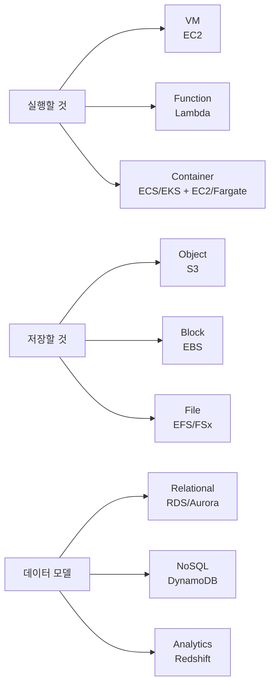
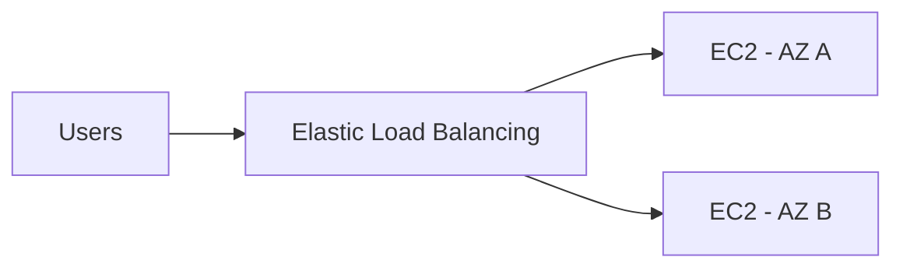
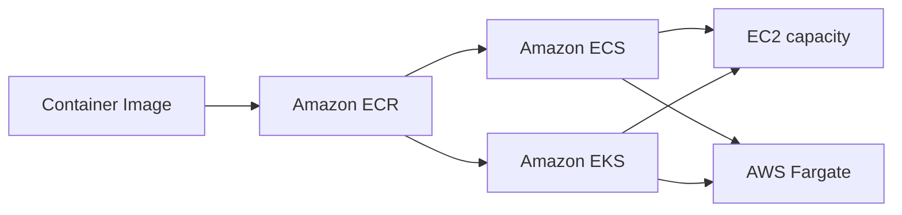
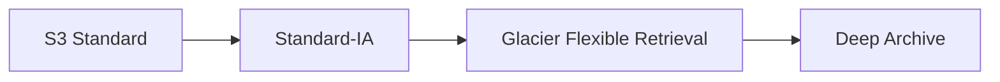
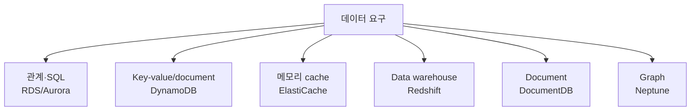

# 03. Compute → Container → Storage → Database

> **시험 비중:** Domain 3 전체 34% 중 핵심 서비스 영역  
> **풀이 원칙:** 구현 방법이 아니라 workload의 형태와 관리 책임을 보고 서비스를 고른다.



## 1. Compute 선택 지도

| 요구 | 먼저 떠올릴 서비스 |
|---|---|
| OS를 직접 제어하는 범용 VM | Amazon EC2 |
| 이벤트가 있을 때 코드 실행 | AWS Lambda |
| Docker container 관리 | Amazon ECS |
| Kubernetes | Amazon EKS |
| 서버 노드 없이 container 실행 | AWS Fargate |
| 소규모 웹사이트·WordPress를 단순하게 | Amazon Lightsail |
| 코드 배포 중심의 관리형 앱 플랫폼 | AWS Elastic Beanstalk |
| 대량 batch job | AWS Batch |
| 고객 데이터센터에 AWS 인프라 배치 | AWS Outposts |

## 2. Amazon EC2 — 제어권이 큰 가상 서버

EC2(Elastic Compute Cloud)는 AWS에서 VM을 실행하는 서비스다.

고객이 선택·관리하는 대표 항목:

- instance type(vCPU, memory, network 등)
- AMI와 Guest OS
- block storage
- VPC, subnet, security group
- 애플리케이션과 데이터

**문제 단서:** “특정 OS 설치”, “관리자 권한 필요”, “오래 실행되는 범용 서버” → EC2

### EC2 instance family의 목적

시험에서는 구체적 이름보다 workload와 최적화 방향을 연결한다.

| 유형 | 최적화 대상 | 예 |
|---|---|---|
| General purpose | compute·memory·network 균형 | 웹 서버, 일반 앱 |
| Compute optimized | CPU 집약 | batch processing, 게임 서버 |
| Memory optimized | 큰 memory | in-memory 분석, 큰 DB |
| Storage optimized | 높은 local I/O | 대규모 데이터 처리 |
| Accelerated computing | GPU·전용 가속기 | ML 학습, 그래픽 |

### AMI

Amazon Machine Image는 EC2를 시작하는 template이다. OS, 소프트웨어, 설정과 block device mapping 정보를 포함할 수 있다.

```text
표준 EC2 구성 → AMI 생성 → 같은 구성의 EC2 반복 시작
```

AMI는 실행 중인 VM이 아니라 **VM을 만들기 위한 이미지**다.

## 3. EC2 storage — EBS vs Instance Store

| Amazon Elastic Block Store(Amazon EBS) | Instance Store |
|---|---|
| network-attached block storage | EC2 host에 물리적으로 연결된 local block storage |
| EC2와 분리된 수명 주기 가능 | instance 수명과 밀접한 임시 저장소 |
| snapshot으로 S3에 백업 가능 | 영구 보관용이 아님 |
| OS disk, DB volume | cache, buffer, scratch data |

> “EC2를 중지·종료한 뒤에도 보존해야 하는 disk” → EBS  
> “손실되어도 되는 매우 빠른 임시 local data” → Instance Store

EBS volume과 EC2의 연결 가능 범위·유형은 세부 제약이 있으므로 CCP에서는 **persistent block vs ephemeral local**을 우선 기억한다.

## 4. Elasticity와 Availability

### EC2 Auto Scaling

수요 또는 정책에 따라 instance 수를 늘리고 줄이며, 원하는 수의 healthy instance를 유지한다.

```text
수요 증가 → scale out
수요 감소 → scale in
비정상 instance → 교체
```

### Elastic Load Balancing(ELB)

여러 target으로 트래픽을 분산하고 health check 결과에 따라 healthy target으로 보낸다.



| 유형 | 대표 traffic | CCP 수준의 구별 |
|---|---|---|
| ALB | HTTP/HTTPS | Web application, path/host 기반 routing |
| NLB | TCP/UDP/TLS | 매우 높은 성능, network 연결 |
| GWLB | IP traffic | 가상 network appliance 배치 |

**ELB는 분산**, **Auto Scaling은 수량 조절**이다. 둘을 함께 사용하지만 같은 기능은 아니다.

## 5. Serverless compute

Serverless는 서버가 실제로 없다는 뜻이 아니다. 고객이 서버를 프로비저닝·패치·용량 관리하지 않고 **코드나 container workload에 집중**한다는 뜻이다.

### AWS Lambda

- function 단위 코드 실행
- event-driven
- 자동 확장
- 요청 수와 실행 시간·구성 자원 등을 기준으로 과금
- 짧은 API 처리, 파일 변환, 자동화에 적합

```text
S3 object upload → Lambda → thumbnail 생성
```

### AWS Fargate

- ECS 또는 EKS에서 사용할 수 있는 serverless container compute
- EC2 worker node를 직접 프로비저닝·패치하지 않음
- container image와 task/pod 자원 요구를 정의

Fargate를 “Lambda의 container 버전”이라고 외우면 안 된다. Lambda는 **function 실행 모델**, Fargate는 **container 실행 용량**이다.

### EC2 vs Lambda vs Fargate

| EC2 | Lambda | Fargate |
|---|---|---|
| VM | function | container compute |
| OS 제어·관리 | 서버 관리 없음 | 노드 관리 없음 |
| 장기 실행·특수 OS | event-driven code | containerized app |
| 가장 큰 제어권 | 가장 작은 실행 단위 | container 이식성 |

## 6. Container 핵심

### VM vs Container

| VM | Container |
|---|---|
| 각 VM이 Guest OS 포함 | 보통 host OS kernel 공유 |
| 무겁고 부팅이 상대적으로 느림 | 가볍고 시작이 빠름 |
| 서로 다른 OS 전체 격리 | app와 dependency를 패키징 |

- **Image**: container를 만들기 위한 읽기 전용 template
- **Container**: image를 실행한 instance
- **Registry**: image 저장소
- **Docker**: image 생성·container 실행에 널리 쓰이는 플랫폼

원본의 Xen 그림(`day3/image-1.png`)은 hypervisor 내부 구조 예시지만 CLF-C02에서는 이 정도 상세 구현을 암기할 필요가 없다.

### ECR / ECS / EKS / Fargate



| 서비스 | 역할 | 단서 |
|---|---|---|
| Amazon ECR | container image registry | image 저장·배포 |
| Amazon ECS | AWS-native container orchestration | task, service, cluster |
| Amazon EKS | managed Kubernetes | pod, Kubernetes |
| AWS Fargate | serverless container compute | EC2 node 관리 없음 |

```text
ECS/EKS = container를 오케스트레이션하는 방법
Fargate = 그 container를 서버 관리 없이 실행하는 용량
```

## 7. 기타 compute 서비스

| 서비스 | 한 줄 설명 | 대표 상황 |
|---|---|---|
| Lightsail | VM·SSD·network 등을 단순한 bundle로 제공 | 개인 사이트, WordPress |
| Elastic Beanstalk | 코드를 배포하면 EC2·Auto Scaling·ELB 환경 구성을 지원 | 전통 Web app의 빠른 배포 |
| AWS Batch | 필요한 compute를 준비해 batch job 실행을 관리 | 대규모 계산·렌더링 |
| AWS Outposts | AWS 인프라·서비스 일부를 고객 시설에 설치 | on-premises 저지연·local processing |

## 8. Storage 선택 지도

| 저장 방식 | 서비스 | 데이터 접근 방식 |
|---|---|---|
| Object | Amazon S3 | bucket/key, API |
| Block | Amazon EBS | EC2의 disk volume |
| Local block | Instance Store | host-local 임시 disk |
| File | Amazon EFS | shared NFS |
| Specialized file | Amazon FSx | Windows, Lustre, ONTAP, OpenZFS |
| Hybrid storage | AWS Storage Gateway | on-premises와 AWS storage 연결 |

## 9. Amazon S3 — object storage

S3는 object를 bucket에 저장하는 고확장성 object storage다.

```text
Bucket
 ├── images/cat.jpg  ← key
 └── logs/app.log    ← object
```

핵심 특성:

- 사실상 매우 큰 확장성
- 여러 AZ에 걸쳐 설계된 높은 내구성(일반 class 기준)
- versioning, encryption, lifecycle
- 정적 파일, backup, log, data lake

“무제한 저장”이라는 표현은 **사실상 확장 가능한 서비스**라는 의미로 이해한다. 개별 object 크기 등 서비스 제한은 존재한다.

### S3 storage classes와 Amazon S3 Glacier

| class | 접근 패턴 | 핵심 trade-off |
|---|---|---|
| S3 Standard | 자주 접근 | 기본 범용, 여러 AZ |
| S3 Intelligent-Tiering | 패턴 예측 어려움 | 접근에 따라 tier 자동 이동, monitoring 비용 고려 |
| S3 Standard-IA | 드물지만 즉시 필요 | 낮은 저장 비용, retrieval 비용·최소 기간 |
| S3 One Zone-IA | 재생성 가능한 비중요 IA | 한 AZ, 더 저렴 |
| Glacier Instant Retrieval | 거의 안 쓰지만 즉시 필요 | archive + millisecond access |
| Glacier Flexible Retrieval | archive | retrieval에 분~시간 |
| Glacier Deep Archive | 장기 보존 | 가장 느린 시간 단위 retrieval |
| S3 Express One Zone | 매우 높은 성능·낮은 latency | 한 AZ의 고성능 object class |

### Lifecycle policy

시간이 지나며 덜 쓰는 데이터를 자동으로 저렴한 class로 이동하거나 만료한다.



정확한 일수는 업무 요구와 각 class의 최소 보관 조건에 따라 정한다. 원본의 `30일 → 90일 → 365일`은 가능한 예시이지 고정 규칙이 아니다.

## 10. File·hybrid·backup storage

### Amazon Elastic File System(Amazon EFS) vs Amazon FSx

| Amazon EFS | Amazon FSx |
|---|---|
| managed NFS file system | 특정 file system의 managed service |
| Linux workload의 공유 file | Windows SMB, Lustre HPC, NetApp ONTAP, OpenZFS |
| 여러 compute에서 동시 mount | workload별 특화 기능 |

### AWS Storage Gateway

On-Premises 애플리케이션이 표준 storage protocol을 사용하면서 AWS storage와 연결하도록 돕는 hybrid storage 서비스다.

### AWS Backup

여러 AWS 서비스의 backup plan, 정책, 보존을 중앙 관리한다.

### AWS Elastic Disaster Recovery

서버를 AWS에 지속 복제해 재해 시 복구하는 서비스다. **AWS Backup은 backup 중앙 관리**, **Elastic Disaster Recovery는 서버 수준 DR**에 초점이 있다.

## 11. Database 선택 지도

먼저 데이터 모델과 사용 목적을 묻는다.



### DB on EC2 vs managed database

| DB on EC2 | Managed DB |
|---|---|
| OS·DB 설치와 patch를 직접 제어 | provisioning·backup·patch 기능을 AWS가 더 많이 관리 |
| 특수 설정·엔진 제어에 유리 | 운영 부담 감소 |
| 고객 책임 범위가 큼 | 데이터·계정·접근 설정은 여전히 고객 책임 |

## 12. Amazon RDS와 Aurora

### Amazon RDS

MySQL, PostgreSQL, MariaDB, Oracle, SQL Server, Db2 같은 관계형 엔진을 관리형으로 운영한다.

- SQL, table, relation
- 자동 backup 기능
- Multi-AZ와 read replica 옵션
- OS와 DB 인프라 관리 부담 감소

### Amazon Aurora

AWS가 설계한 MySQL/PostgreSQL-compatible managed relational database다. RDS 관리 인터페이스와 통합되지만 시험에서는 일반 RDS 엔진과 구별해 **AWS-native 고성능·고가용성 관계형 DB**로 기억한다.

### Multi-AZ vs Read Replica

| Multi-AZ | Read Replica |
|---|---|
| 고가용성·failover | read scaling |
| 장애 시 standby로 전환 | 읽기 요청 분산 |
| 주목적은 가용성 | 주목적은 성능 확장 |

**시험 예제:** “DB 장애 시 자동 failover” → Multi-AZ  
“읽기 요청이 너무 많다” → Read Replica

## 13. DynamoDB, ElastiCache, Redshift

### Amazon DynamoDB

완전관리형 serverless NoSQL key-value/document database다.

- 매우 큰 scale과 낮은 latency
- 자동 확장 옵션
- game, mobile, shopping cart, session metadata

SQL join과 복잡한 관계가 핵심이면 RDS/Aurora를 먼저 생각한다.

### Amazon ElastiCache

Valkey, Memcached, Redis OSS 계열의 managed in-memory cache다.

```text
App → cache hit → 빠른 응답
   ↘ cache miss → DB 조회 → cache 저장
```

DB 앞에서 반복 조회를 줄이고 응답 속도를 높인다. 영구 원본 DB와 같은 역할로 단정하지 않는다.

### Amazon Redshift

대규모 데이터를 **저장하고 분석**하는 data warehouse다.

- columnar storage
- SQL analytics
- OLAP, BI, 과거 매출 분석

원본의 “데이터를 저장하는 목적이 아니다”는 부정확하다. 운영 transaction DB가 아니라 **분석용 저장·처리**가 목적이다.

### OLTP vs OLAP

| OLTP | OLAP |
|---|---|
| 주문·결제·회원가입 같은 실시간 거래 | 과거 대량 데이터 분석 |
| 짧은 읽기·쓰기 transaction | 복잡한 집계 query |
| RDS, Aurora | Redshift |

## 14. 목적별 database

| 서비스 | 데이터 모델·역할 | 시험 단서 |
|---|---|---|
| Amazon DocumentDB | MongoDB-compatible document DB | JSON document, MongoDB workload |
| Amazon Neptune | graph DB | node·edge·relationship, 추천·사기 관계 |

원본 데이터베이스 이미지에는 Keyspaces, Timestream, QLDB, MemoryDB도 나오지만 현재 CLF-C02의 명시적 in-scope 목록에는 없다. 이미지 내용은 확인했으나 시험 직전 핵심 표에는 확대하지 않는다.

## 15. Database migration — DMS vs SCT

| AWS DMS | AWS SCT |
|---|---|
| 데이터 이동·지속 복제 | 서로 다른 DB 엔진 간 schema·일부 code 변환 지원 |
| homogeneous와 heterogeneous migration | heterogeneous migration에서 주로 사용 |
| downtime 최소화에 활용 | 실제 데이터 이동 서비스가 아님 |

```text
Oracle → PostgreSQL
schema 변환: SCT
data 이동:    DMS
```

## 16. 문제 풀이 예제

**상황:** “Kubernetes는 필요하지만 worker node를 관리하지 않는다.”  
**정답:** Amazon EKS + AWS Fargate

**상황:** “여러 Linux EC2가 같은 파일 경로를 mount한다.”  
**정답:** Amazon EFS

**상황:** “접근 패턴을 예측할 수 없는 S3 데이터의 비용을 자동 최적화한다.”  
**정답:** S3 Intelligent-Tiering

**상황:** “주문 DB 장애 시 자동으로 standby로 failover한다.”  
**정답:** Amazon RDS Multi-AZ

**상황:** “10년치 판매 데이터를 SQL로 집계한다.”  
**정답:** Amazon Redshift

## References

- [CLF-C02 Domain 3](https://docs.aws.amazon.com/aws-certification/latest/cloud-practitioner-02/cloud-practitioner-02-domain3.html)
- [CLF-C02 In-Scope AWS Services](https://docs.aws.amazon.com/aws-certification/latest/cloud-practitioner-02/clf-02-in-scope-services.html)
- 원본: `day2/3.1.md`~`day2/3.3.md`, `day3/3.5.md`, `day3/3.6.md` 및 참조 이미지

---

## 반드시 알아야 할 핵심 비교

| 비교 | A | B | C |
|---|---|---|---|
| EC2 vs Lambda vs Fargate | VM | function | serverless container compute |
| ECS vs EKS | AWS-native orchestration | managed Kubernetes | — |
| ELB vs Auto Scaling | traffic 분산 | instance 수 조절 | — |
| EBS vs Instance Store | persistent network block | ephemeral local block | — |
| S3 vs EBS vs EFS | object | block | shared file |
| EFS vs FSx | 범용 managed NFS | 특화 file system | — |
| RDS/Aurora vs DynamoDB | relational SQL | NoSQL key-value/document | — |
| Multi-AZ vs Read Replica | availability/failover | read scaling | — |
| RDS vs Redshift | OLTP | OLAP/data warehouse | — |
| DMS vs SCT | data 이동 | schema 변환 | — |

## 시험에서 헷갈리는 서비스

| 요구 | 정답 | 헷갈리는 서비스 |
|---|---|---|
| container image 저장 | ECR | ECS는 실행 관리 |
| 서버 없이 container 실행 | Fargate | Lambda는 function |
| 단순한 VPS bundle | Lightsail | EC2는 더 세밀한 제어 |
| Windows file share | FSx for Windows | EFS는 NFS |
| 중앙 backup 정책 | AWS Backup | Elastic Disaster Recovery는 server DR |
| in-memory cache | ElastiCache | DynamoDB는 NoSQL DB |
| MongoDB 호환 | DocumentDB | DynamoDB는 AWS-native NoSQL |
| 관계 분석 | Neptune | Redshift는 warehouse |

## 최종 암기표

| 키워드 | 한 줄 암기 |
|---|---|
| EC2 / AMI | VM / VM template |
| Auto Scaling / ELB | 수량 / 분산 |
| Lambda | event-driven function |
| ECR / ECS / EKS / Fargate | image / AWS container / Kubernetes / serverless capacity |
| S3 / EBS / EFS | object / block / file |
| Instance Store | 임시 local block |
| Glacier | archive class |
| Lifecycle | class 이동·만료 자동화 |
| RDS / Aurora | managed relational / AWS-native compatible relational |
| DynamoDB | serverless NoSQL |
| ElastiCache | in-memory cache |
| Redshift | OLAP data warehouse |
| DocumentDB / Neptune | document / graph |
| DMS / SCT | data / schema |
