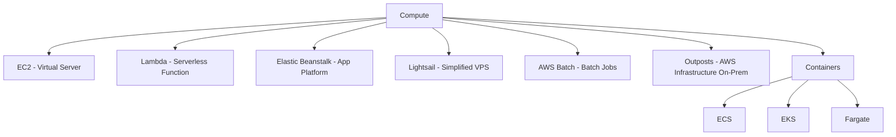
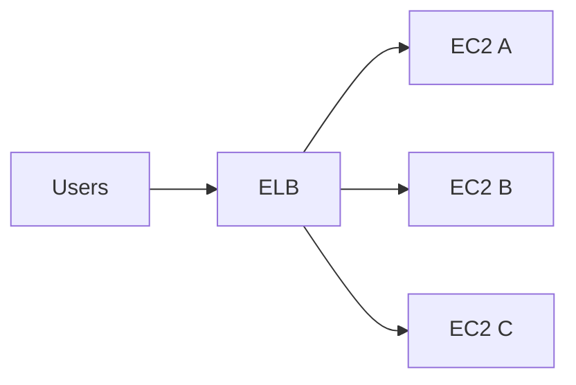
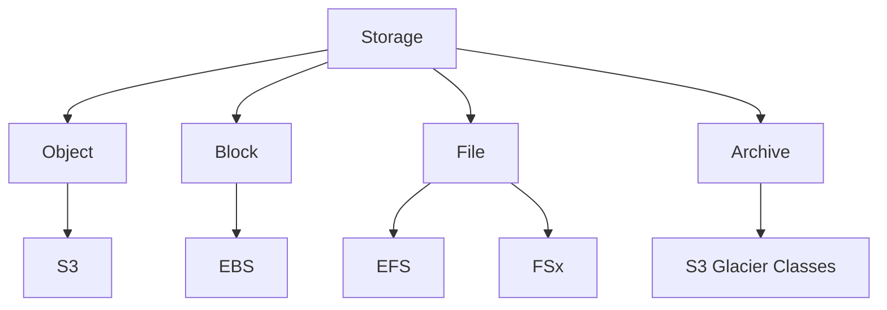
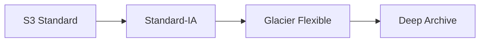
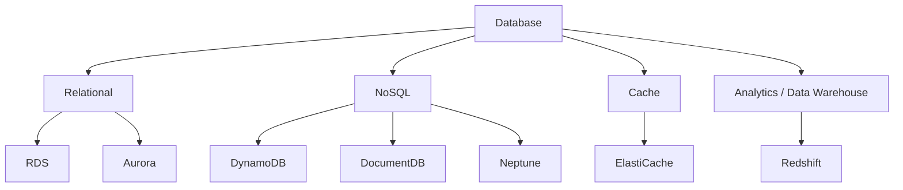

# 1. Compute 전체 지도



---

# 2. Amazon EC2

Elastic Compute Cloud.

**가상 서버**를 임대하는 서비스.

사용자가 선택:

- Instance Type
- vCPU/Memory
- OS/AMI
- Storage
- Network
- Region/AZ

사용 사례:

- Web Server
- Application Server
- Game Server
- Self-managed DB
- Container Host

### 시험 키워드

> “OS를 직접 제어해야 한다”  
> “가상 머신이 필요하다”

→ EC2

---

# 3. AMI

Amazon Machine Image.

EC2 생성에 사용하는 이미지.

포함 가능:

- OS
- Application
- Library
- Configuration

```text
Configured EC2
     ↓
Create AMI
     ↓
Same EC2 environment repeatedly launch
```

---

# 4. EC2 Storage — EBS vs Instance Store

## EBS

Elastic Block Store.

EC2에 연결하는 **Persistent Block Storage**.

특징:

- Volume
- Snapshot
- EC2와 분리된 수명주기 가능
- DB/OS Disk 등에 사용

## Instance Store

EC2 Host에 물리적으로 연결된 **Ephemeral Storage**.

특징:

- 매우 빠른 Local Storage
- Instance stop/terminate 등에서 데이터 유지가 보장되지 않음
- Temporary/Cache/Scratch Data에 적합

### EBS vs Instance Store

| EBS | Instance Store |
|---|---|
| Persistent | Ephemeral |
| Network-attached block storage | Host-local storage |
| Snapshot 가능 | 임시 데이터 용도 |
| 일반 OS/DB Disk | Cache/Scratch |

---

# 5. Auto Scaling

수요에 따라 EC2 Instance 수를 자동 조절.

```text
CPU ↑ / Request ↑
      ↓
Scale Out

수요 ↓
      ↓
Scale In
```

목적:

- Elasticity
- Availability
- Cost Optimization

---

# 6. Elastic Load Balancing (ELB)

여러 Target으로 Traffic을 분산.



대표 타입:

- ALB: HTTP/HTTPS, Layer 7
- NLB: TCP/UDP/TLS, 고성능
- GWLB: Virtual Network Appliance 통합

CCP에서는 **“트래픽 분산/Healthy target으로 전달”** 정도가 핵심.

---

# 7. AWS Lambda

Serverless Function Compute.

- 서버 프로비저닝 불필요
- Event-driven
- 자동 확장
- 실행량/시간 기준 과금

예:

```text
S3 Upload
  ↓
Lambda
  ↓
Thumbnail generation
```

> “짧은 이벤트 기반 코드”, “서버 관리 없음” → Lambda

---

# 8. Lightsail

단순한 VPS 형태.

서버, SSD, IP, Network 설정 등을 패키지 형태로 쉽게 제공.

사용 사례:

- 간단한 Website
- WordPress
- 개인 프로젝트

> “AWS 초보자용 단순 VPS” → Lightsail

---

# 9. Elastic Beanstalk

Application을 배포하면 EC2/Load Balancing/Auto Scaling 등 환경 구성을 도와주는 **Managed Application Platform**.

사용자는 코드에 더 집중.

> “Web Application을 빠르게 배포하되 기반 EC2 환경도 사용” → Elastic Beanstalk

---

# 10. AWS Batch

Batch Computing Job을 실행/스케줄.

예:

- 대규모 계산
- Batch Data Processing
- Render/Scientific Job

---

# 11. AWS Outposts

AWS Infrastructure/Service 일부를 고객 On-Premises에 설치.

> “AWS 경험을 Data Center 안에서도 사용” → Outposts

Hybrid Cloud와 연결.

---

# 12. Docker / Container — CCP에 필요한 만큼만

## Container

Application + Dependency를 묶은 실행 단위.

VM과 달리 일반적으로 Host OS Kernel을 공유해 가볍다.

## Docker

Container Image를 만들고 실행·관리하는 대표적인 Container Platform.

### CCP에서 중요한 연결

- ECS = AWS-native Container Orchestration
- EKS = Managed Kubernetes
- Fargate = Serverless Container Compute
- ECR = Container Image Registry

---

# 13. Amazon ECS

Elastic Container Service.

AWS 자체 Container Orchestration.

개념:

```text
Cluster
  └─ Service
      └─ Task
          └─ Container
```

> “AWS 방식으로 Container 관리” → ECS

---

# 14. Amazon EKS

Elastic Kubernetes Service.

Managed Kubernetes.

> “Kubernetes가 명시” → EKS

---

# 15. AWS Fargate

서버/EC2 Node를 직접 관리하지 않고 Container를 실행하는 Serverless Compute Engine.

ECS/EKS와 함께 사용.

### ECS vs Fargate

- ECS = Container를 **어떻게 관리할지**
- Fargate = Container를 **어디서 서버 관리 없이 실행할지**

---

# 16. Amazon ECR

Elastic Container Registry.

Container Image 저장소.

```text
Build Image → ECR → ECS/EKS/Fargate
```

---

# 17. Storage 전체 지도



---

# 18. Amazon S3

Simple Storage Service.

**Object Storage**.

구성:

```text
Bucket
 ├─ object1
 ├─ object2
 └─ object3
```

핵심:

- 사실상 매우 큰 확장성
- 11 nines durability로 알려짐
- Bucket/Object/Key
- Versioning
- Encryption
- Lifecycle
- Static files, Backup, Data Lake, Logs

> “Object / Bucket / Image / Backup / Static file” → S3

---

# 19. S3 Storage Classes

시험에서 **접근 빈도와 복구 시간**을 보고 선택한다.

| Class | 용도 |
|---|---|
| S3 Standard | 자주 접근, 일반 목적 |
| Intelligent-Tiering | Access pattern을 예측하기 어려움 |
| Standard-IA | 덜 자주 접근하지만 필요 시 빠르게 |
| One Zone-IA | 한 AZ, 재생성 가능한 덜 중요한 IA Data |
| Glacier Instant Retrieval | Archive지만 즉시 접근 요구 |
| Glacier Flexible Retrieval | Archive, 분~시간 단위 Retrieval |
| Glacier Deep Archive | 가장 장기 보관, Retrieval이 매우 느림 |
| S3 Express One Zone | 한 AZ, 초저지연/고성능 Object Access |

### Lifecycle



> 오래될수록 더 저렴한 Class로 자동 전환 → **Lifecycle Policy**

---

# 20. Amazon EFS

Elastic File System.

Managed NFS File System.

- 여러 Linux EC2가 동시 Mount
- 자동 확장
- File Storage
- Multi-AZ 구성 가능

> “여러 Linux Server가 같은 파일 공유” → EFS

---

# 21. Amazon FSx

관리형 특정 File System.

대표:

- FSx for Windows File Server → SMB/Windows
- FSx for Lustre → HPC/고성능
- FSx for NetApp ONTAP
- FSx for OpenZFS

### EFS vs FSx

| EFS | FSx |
|---|---|
| AWS Managed NFS | 특정 File System 구현 |
| Linux 범용 공유 | Windows/Lustre/NetApp/OpenZFS |

---

# 22. S3 Glacier

별도 “일반 Disk”가 아니라 S3의 Archive Storage 계층으로 이해하면 편하다.

용도:

- 장기 백업
- 법률/금융 기록
- 거의 접근하지 않는 데이터

---

# 23. AWS Storage Gateway

On-Premises 환경과 AWS Cloud Storage를 연결하는 Hybrid Storage.

> “사내 File/Backup 환경을 AWS Storage와 연결” → Storage Gateway

---

# 24. AWS Backup

여러 AWS Service의 Backup을 중앙에서 관리.

시험 키워드:

- Centralized backup
- Backup policy
- Multiple services

---

# 25. Storage 비교

| 요구 | 서비스 |
|---|---|
| Object 저장 | S3 |
| EC2 Block Disk | EBS |
| EC2 Local temporary disk | Instance Store |
| Linux Shared File | EFS |
| Windows File Share | FSx for Windows |
| HPC File System | FSx for Lustre |
| 장기 Archive | S3 Glacier Class |
| On-Prem ↔ Cloud Storage | Storage Gateway |
| Backup 중앙 관리 | AWS Backup |

---

# 26. Database 전체 지도



---

# 27. Amazon RDS

Managed Relational Database.

지원 엔진 예:

- MySQL
- PostgreSQL
- MariaDB
- Oracle
- SQL Server
- Aurora

AWS가 관리하는 대표 영역:

- Provisioning
- Patch 일부
- Backup 기능
- Monitoring 기반 기능
- Failure recovery 기능

### Multi-AZ vs Read Replica

- **Multi-AZ** → High Availability / Failover
- **Read Replica** → Read Scaling

이 구별은 매우 중요.

---

# 28. Amazon Aurora

AWS가 만든 MySQL/PostgreSQL compatible relational database.

- RDS Family
- 높은 성능/가용성
- 분산 Storage Architecture

> “AWS-native relational DB, MySQL/PostgreSQL compatible” → Aurora

---

# 29. Amazon DynamoDB

Fully managed NoSQL Key-Value/Document Database.

- Serverless style managed DB
- 자동 확장
- 낮은 latency
- 대규모 Web/Mobile/Game/IoT

> “NoSQL, Key-Value, 매우 큰 Scale” → DynamoDB

---

# 30. Amazon Redshift

Data Warehouse / Analytics.

- Columnar
- OLAP
- 대규모 분석
- SQL

### OLTP vs OLAP

| OLTP | OLAP |
|---|---|
| 실시간 거래 | 분석 |
| 주문/결제/로그인 | 과거 매출 분석 |
| RDS/Aurora | Redshift |

---

# 31. Amazon ElastiCache

In-memory Cache.

대표 엔진:

- Redis 계열
- Memcached

용도:

- Session
- Frequently accessed data
- DB Load 감소
- 빠른 응답

```text
App → Cache Hit → 즉시 응답
  ↘ Cache Miss → DB → Cache 저장
```

---

# 32. Amazon DocumentDB

MongoDB-compatible Document Database.

> “Document DB / MongoDB compatibility” → DocumentDB

---

# 33. Amazon Neptune

Graph Database.

사용 사례:

- Social graph
- Recommendation relationship
- Fraud relationship

> “Node/Edge/Relationship” → Neptune

---

# 34. Database Migration

## AWS DMS

Database Migration Service.

DB 데이터를 AWS로 이동/복제.

- Homogeneous migration
- Heterogeneous migration
- 최소 downtime migration에 활용

## AWS SCT

Schema Conversion Tool.

DB Engine이 달라질 때 Schema/Code 변환 지원.

```text
Oracle → PostgreSQL
Schema conversion: SCT
Data movement: DMS
```

---

# 35. 핵심 비교표

## EC2 vs Lambda vs Fargate

| EC2 | Lambda | Fargate |
|---|---|---|
| VM | Function | Container Compute |
| OS 관리 필요 | 서버 관리 없음 | 서버 관리 없음 |
| 장시간/범용 | Event-driven | Container workload |

## ECS vs EKS

| ECS | EKS |
|---|---|
| AWS-native | Kubernetes |
| 단순 | Kubernetes ecosystem |
| AWS 중심 | K8s 표준 |

## S3 vs EBS vs EFS

| S3 | EBS | EFS |
|---|---|---|
| Object | Block | File |
| Bucket/Object | EC2 Disk | Shared NFS |
| Web/Backup/Data Lake | OS/DB Disk | 여러 Linux EC2 공유 |

## RDS vs DynamoDB vs Redshift

| RDS | DynamoDB | Redshift |
|---|---|---|
| Relational | NoSQL | Data Warehouse |
| OLTP | Key-Value/Document | OLAP |
| SQL | NoSQL API | SQL Analytics |

---

# 36. 시험 직전 치트시트

```text
EC2       = Virtual Server
AMI       = EC2 Image
EBS       = Persistent Block Storage
Instance Store = Temporary Local Block Storage
Auto Scaling = EC2 자동 증감
ELB       = Traffic 분산
Lambda    = Serverless Function
Lightsail = Simple VPS
Beanstalk = Managed App Deployment
Batch     = Batch Computing
Outposts  = AWS Infrastructure On-Prem

ECR       = Container Image Registry
ECS       = AWS Container Orchestration
EKS       = Managed Kubernetes
Fargate   = Serverless Container Runtime

S3        = Object
EBS       = Block
EFS       = Shared NFS
FSx       = Managed specialized File Systems
Glacier   = Archive
Storage Gateway = Hybrid Storage
AWS Backup= Central Backup

RDS       = Managed Relational DB
Aurora    = AWS-native MySQL/PostgreSQL-compatible Relational DB
DynamoDB  = NoSQL
Redshift  = Data Warehouse / OLAP
ElastiCache = In-memory Cache
DocumentDB  = MongoDB-compatible Document DB
Neptune     = Graph DB
DMS         = DB Data Migration
SCT         = DB Schema Conversion
```

---

## References

- CLF-C02 Domain 3:
  https://docs.aws.amazon.com/aws-certification/latest/cloud-practitioner-02/cloud-practitioner-02-domain3.html
- In-scope services:
  https://docs.aws.amazon.com/aws-certification/latest/cloud-practitioner-02/clf-02-in-scope-services.html
