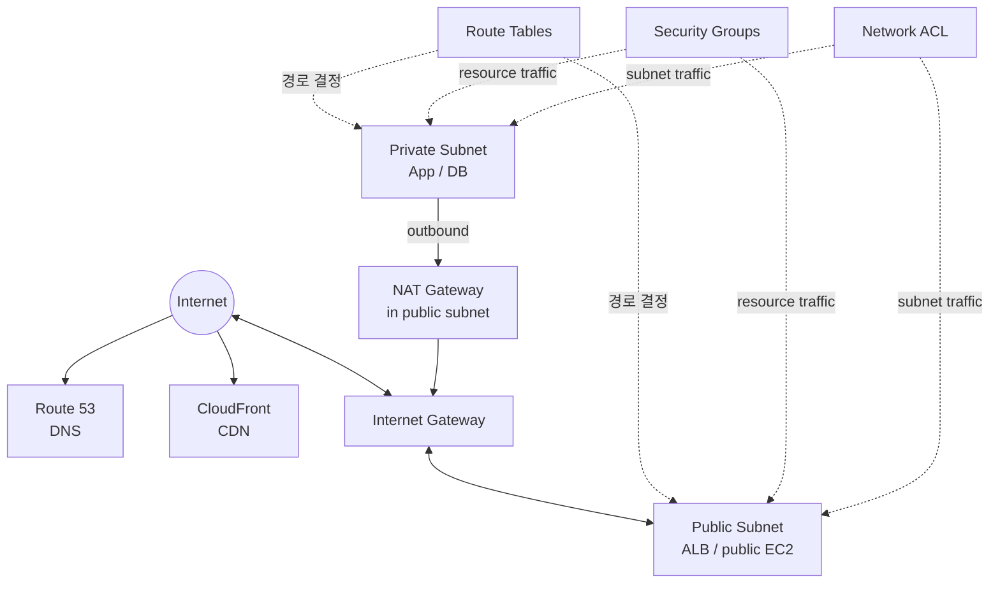
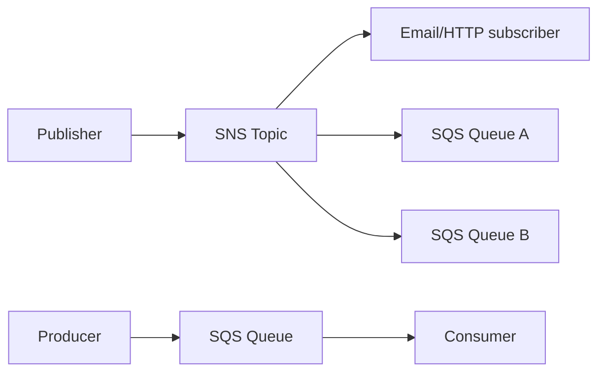

# 04. Networking → Connectivity → Integration → Other Services

> **Domain 3 핵심:** 서비스의 세부 설정이 아니라 **무슨 문제를 해결하는지** 구별한다.

## 1. VPC 전체 그림



이 그림은 역할 관계를 보여 줄 뿐 모든 요청이 Route 53 → CloudFront → IGW 순서로 지나야 한다는 뜻은 아니다.

## 2. Amazon VPC와 Subnet

### Amazon VPC

AWS 계정에 만드는 논리적으로 격리된 가상 네트워크다.

- CIDR IP 범위
- subnet
- route table
- gateway
- security group과 network ACL

### Subnet

VPC의 IP 범위를 나눈 network segment이며 **하나의 Availability Zone에 속한다.**

| Public subnet | Private subnet |
|---|---|
| route table에 Internet Gateway 경로가 있음 | Internet Gateway로 직접 향하는 경로가 없음 |
| public address 등 조건을 갖춘 resource가 인터넷 통신 가능 | 필요하면 NAT Gateway를 통해 outbound 인터넷 사용 |
| internet-facing ALB, NAT Gateway | app server, DB, cache |

Public subnet에 있다는 사실만으로 resource가 자동으로 인터넷에 노출되지는 않는다. **route, public IP/address, security rule** 등 조건이 함께 필요하다.

## 3. Route Table, IGW, NAT Gateway

### Route Table

목적지 traffic을 어느 target으로 보낼지 결정한다.

```text
Public subnet:  0.0.0.0/0 → Internet Gateway
Private subnet: 0.0.0.0/0 → NAT Gateway
```

### Internet Gateway(IGW)

VPC와 인터넷 간 통신을 지원하는 gateway다. Public IPv4/IPv6 주소와 route·보안 설정 같은 조건도 필요하다.

### NAT Gateway

Private subnet의 resource가 인터넷으로 outbound 연결을 시작하도록 한다.

```text
Private EC2 → NAT Gateway(public subnet) → IGW → Internet
```

Internet 사용자가 NAT Gateway를 통해 private EC2에 임의의 연결을 시작하게 만드는 용도가 아니다.

## 4. Security Group vs Network ACL

| Security Group | Network ACL |
|---|---|
| resource/network interface 수준 | subnet 수준 |
| stateful | stateless |
| allow rule | allow와 deny rule |
| 허용된 요청의 응답 traffic 자동 허용 | inbound·outbound를 각각 평가 |

```text
SG   = resource 앞의 stateful firewall
NACL = subnet 경계의 stateless firewall
```

기본 Security Group·기본 NACL의 상세 기본값을 섞지 말고, 시험에서는 적용 범위와 stateful/stateless를 먼저 구별한다.

## 5. VPC의 private 연결과 기록

### VPC Endpoint와 AWS PrivateLink

Public IP나 Internet Gateway 없이 지원되는 서비스에 private하게 접근한다.

- **Gateway endpoint**: Amazon S3, DynamoDB에 사용하는 대표 endpoint 유형
- **Interface endpoint**: AWS PrivateLink 기반으로 ENI를 통해 service에 private 접근
- **AWS PrivateLink**: service provider와 consumer를 private하게 연결; 전체 network를 서로 routing하는 기능과는 다름

### VPC Peering vs Transit Gateway

| VPC Peering | AWS Transit Gateway |
|---|---|
| 두 VPC 간 직접 private 연결 | 여러 VPC·on-premises 연결을 중앙 hub로 관리 |
| transitive routing이 아님 | hub-and-spoke 확장에 적합 |
| 소수의 직접 연결 | 많은 network 연결 중앙화 |

### VPC Flow Logs

VPC, subnet, network interface의 IP traffic metadata를 기록한다.

```text
API 작업 감사     → CloudTrail
network flow 기록 → VPC Flow Logs
```

## 6. Hybrid connectivity — VPN vs Direct Connect

| AWS Site-to-Site VPN | AWS Direct Connect |
|---|---|
| 인터넷 위의 암호화 tunnel | 고객 network와 AWS 간 전용 network 연결 |
| 비교적 빠르게 구축 | 회선 provisioning 시간 필요 |
| 인터넷 품질에 영향 | 더 일관된 network 경험·대역폭 |
| 암호화 연결이 핵심 | 전용 연결 자체가 자동 암호화를 뜻하지는 않음 |

Direct Connect와 VPN을 함께 사용해 private 연결과 암호화를 결합할 수도 있다.

### Site-to-Site VPN vs Client VPN

| AWS Site-to-Site VPN | AWS Client VPN |
|---|---|
| 회사 network와 VPC를 연결 | 개별 사용자의 device와 AWS/on-premises network를 연결 |
| network-to-network | user-to-network, managed remote access |

## 7. Amazon Route 53

도메인 등록, authoritative DNS, health check, traffic routing을 제공한다.

| Routing policy | 선택 기준 |
|---|---|
| Simple | 단순한 단일 응답 |
| Weighted | 90%/10%처럼 비율 분산 |
| Latency-based | AWS가 측정한 더 낮은 latency의 Region으로 |
| Geolocation | 사용자 위치에 따른 정책 |
| Failover | primary health check 실패 시 secondary |

Latency routing은 단순히 지도상 가장 가까운 Region을 고르는 것과 다르다.

## 8. CloudFront vs Global Accelerator

### Amazon CloudFront

Edge Location을 이용하는 CDN이다. origin의 cacheable content와 web delivery를 사용자 가까이에서 제공해 latency와 origin 부하를 줄인다.

```text
User → Edge
       ├─ cache hit  → 바로 응답
       └─ cache miss → origin(S3/ALB 등) → cache → 응답
```

정적 파일만 전달한다고 한정하지 않는다. 동적 content delivery와 보안 연계도 지원한다.

### AWS Global Accelerator

정적 anycast IP와 AWS global network를 이용해 regional endpoint로 TCP/UDP traffic을 전달하고 application availability와 성능을 개선한다.

| CloudFront | Global Accelerator |
|---|---|
| CDN, edge caching | network acceleration |
| HTTP(S) content delivery 중심 | TCP/UDP application 포함 |
| cache가 핵심 | anycast IP와 endpoint health가 핵심 |

## 9. API Gateway와 application integration

### Amazon API Gateway

API의 managed front door다.

- REST/HTTP/WebSocket API
- 인증·권한 연동
- throttling
- request/response 처리와 routing
- Lambda, HTTP service 등 backend 연결

```text
Web/Mobile client → API Gateway → Lambda 또는 application backend
```

### EventBridge / SNS / SQS / Step Functions

이 네 서비스는 선형 파이프라인이 아니라 서로 다른 문제를 해결한다.

| 서비스 | 핵심 역할 | 문제의 동사 |
|---|---|---|
| Amazon EventBridge | event bus에서 규칙에 따라 target으로 routing | 사건을 분류·연결한다 |
| Amazon SNS | pub/sub로 한 message를 여러 subscriber에 push | 알림·fan-out한다 |
| Amazon SQS | queue에 message를 보관해 producer와 consumer 분리 | 쌓아 두고 처리한다 |
| AWS Step Functions | 여러 task를 state machine workflow로 orchestration | 순서·분기·retry를 제어한다 |



**SNS + SQS fan-out:** 하나의 event를 여러 queue에 복사해 각 consumer가 독립적으로 처리할 수 있다.

SQS의 **Standard queue**는 높은 처리량, **FIFO queue**는 순서와 중복 제거 요구를 우선할 때 선택한다.

### Amazon SES와 Amazon Connect

| 서비스 | 역할 |
|---|---|
| Amazon SES | 애플리케이션의 transactional·대량 email 발송 |
| Amazon Connect | cloud contact center/call center |

## 10. AWS에 접근하고 반복 배포하는 방법

| 방법 | 적합한 상황 |
|---|---|
| AWS Management Console | 사람이 일회성·시각적 작업 |
| AWS CLI | shell에서 명령·script 자동화 |
| AWS SDK | application code에서 AWS API 호출 |
| API | programmatic access의 기반 |
| AWS CloudFormation | template으로 인프라를 반복·일관되게 배포(IaC) |

**시험 예제:** “동일한 VPC와 EC2 환경을 여러 계정에 반복 배포” → CloudFormation

## 11. Developer·management 서비스

| 서비스 | 한 줄 역할 |
|---|---|
| AWS CodeBuild | source code build·test |
| AWS CodePipeline | source부터 build·deploy까지 pipeline orchestration |
| AWS X-Ray | distributed request trace와 성능 문제 분석 |
| AWS Systems Manager | node·운영 작업·automation 중앙 관리 |
| AWS Compute Optimizer | 사용률을 분석해 resource 구성 권고 |
| AWS License Manager | software license 사용·규칙·추적 중앙 관리 |
| Service Quotas | AWS service quota 확인·관리 |
| AWS Well-Architected Tool | Well-Architected review 수행·기록 |

원본 서비스 지도에는 CodeCommit, CodeDeploy도 있지만 현재 CLF-C02의 명시적 in-scope service 목록에는 없다. 시험 직전 핵심으로 확대하지 않는다.

## 12. AI/ML 서비스 — 이름과 작업 연결

깊은 ML 구현보다 “무슨 입력을 받아 무슨 일을 하는가”를 본다.

| 서비스 | 작업 | 기억 문장 |
|---|---|---|
| Amazon SageMaker AI | ML model build·train·deploy | ML 개발 platform |
| Amazon Lex | text/voice conversational interface | chatbot |
| Amazon Kendra | enterprise intelligent search | 사내 문서 검색 |
| Amazon Comprehend | text에서 sentiment·entity 등 추출 | NLP 분석 |
| Amazon Polly | text → speech | 글을 음성으로 |
| Amazon Rekognition | image/video 분석 | 시각 자료 인식 |
| Amazon Textract | document의 text·form·table 추출 | OCR + 문서 구조 |
| Amazon Transcribe | speech → text | 음성을 글로 |
| Amazon Translate | machine translation | 번역 |
| Amazon Q | generative AI assistant 계열 | 질의·업무 지원 |

```text
Text → Speech = Polly
Speech → Text = Transcribe
문서의 글·표 = Textract
사진·영상 분석 = Rekognition
텍스트 의미·감정 = Comprehend
```

## 13. Analytics 서비스 — 데이터 위치와 처리 방식

| 서비스 | 한 줄 역할 | 대표 단서 |
|---|---|---|
| Amazon Athena | S3 데이터를 serverless SQL query | S3 log를 바로 SQL |
| AWS Glue | serverless data integration, ETL, Data Catalog | 발견·변환·catalog |
| Amazon Kinesis | real-time streaming data | clickstream, IoT stream |
| Amazon QuickSight | BI dashboard·visualization | 경영 dashboard |
| Amazon EMR | Hadoop·Spark 등 big data framework | managed cluster |
| Amazon OpenSearch Service | search와 log analytics | 검색·log 분석 |
| Amazon Redshift | data warehouse·OLAP | 대규모 SQL 분석 |

| Athena | Redshift |
|---|---|
| S3의 데이터를 필요할 때 query | warehouse에 데이터를 적재해 반복 분석 |
| serverless query | managed data warehouse |

## 14. 기타 in-scope 서비스 지도

### End-user computing

| 서비스 | 선택 단서 |
|---|---|
| Amazon WorkSpaces | 관리형 virtual desktop 전체 |
| Amazon AppStream 2.0 | desktop app을 사용자 장치로 streaming |
| WorkSpaces Secure Browser | 관리형 secure browser access |

### Frontend web/mobile와 IoT

| 서비스 | 선택 단서 |
|---|---|
| AWS Amplify | frontend/mobile 앱 build·host·deploy 지원 |
| AWS AppSync | managed GraphQL API |
| AWS IoT Core | IoT device를 cloud에 연결하고 message 처리 |

## 15. 이미지에만 있던 정보의 처리

원본 종합 장표에는 VPC Peering, VPC endpoint, Flow Logs 같은 유용한 관계가 있어 본문에 반영했다. 반면 Wavelength, Pinpoint, AppFlow와 일부 개발·DB 서비스는 현재 CLF-C02 명시 목록에서 벗어나므로 이름을 억지로 외우는 범위로 확대하지 않았다. 모든 장표는 판독 가능했으며 추정으로 채운 항목은 없다.

## 16. 문제 풀이 예제

**상황:** “Private EC2가 OS update를 받되 인터넷에서 시작한 연결은 받지 않는다.”  
**정답:** NAT Gateway

**상황:** “수십 개 VPC와 on-premises를 hub로 연결한다.”  
**정답:** AWS Transit Gateway

**상황:** “한 주문 event를 email과 두 개의 처리 시스템에 동시에 보낸다.”  
**정답:** Amazon SNS fan-out, 필요하면 각 consumer 앞에 SQS

**상황:** “S3 CSV를 옮기지 않고 SQL로 일회성 분석한다.”  
**정답:** Amazon Athena

**상황:** “음성 파일을 자막 text로 바꾼다.”  
**정답:** Amazon Transcribe

## References

- [CLF-C02 Domain 3](https://docs.aws.amazon.com/aws-certification/latest/cloud-practitioner-02/cloud-practitioner-02-domain3.html)
- [CLF-C02 In-Scope AWS Services](https://docs.aws.amazon.com/aws-certification/latest/cloud-practitioner-02/clf-02-in-scope-services.html)
- 원본: `day3/3.4.md`~`day3/3.6.md`, 전체 서비스·네트워크·serverless 참조 이미지

---

## 반드시 알아야 할 핵심 비교

| 비교 | A | B | C |
|---|---|---|---|
| Public vs Private subnet | IGW 경로 | 직접 IGW 경로 없음 | — |
| IGW vs NAT Gateway | VPC 인터넷 연결 | private resource의 outbound | — |
| Security Group vs NACL | stateful resource firewall | stateless subnet firewall | — |
| VPN vs Direct Connect | 인터넷 암호화 tunnel | 전용 network connection | — |
| Peering vs Transit Gateway | 두 VPC 직접 연결 | 다수 network hub | — |
| CloudFront vs Global Accelerator | CDN/cache | network acceleration | — |
| EventBridge vs SNS vs SQS | event routing | pub/sub fan-out | queue/buffer |
| Console vs CLI vs CloudFormation | UI | command | IaC |
| Athena vs Redshift | SQL on S3 | data warehouse | — |
| WorkSpaces vs AppStream | desktop | application streaming | — |

## 시험에서 헷갈리는 서비스

| 요구 | 정답 | 헷갈리는 서비스 |
|---|---|---|
| DNS와 routing policy | Route 53 | Route table은 VPC packet 경로 |
| private service endpoint | PrivateLink/interface endpoint | Peering은 VPC network 연결 |
| event를 규칙으로 target에 전달 | EventBridge | SNS는 subscriber fan-out |
| producer/consumer decoupling | SQS | SNS는 push 알림 |
| 여러 task의 순서·retry | Step Functions | EventBridge는 workflow engine이 아님 |
| 문서의 form·table 추출 | Textract | Rekognition은 image/video 분석 |
| text 감정·entity | Comprehend | Translate는 언어 번역 |
| S3 SQL query | Athena | Glue는 ETL/catalog |

## 최종 암기표

| 키워드 | 한 줄 암기 |
|---|---|
| VPC / Subnet | 격리 network / AZ 단위 segment |
| IGW / NAT | 인터넷 gateway / private outbound |
| SG / NACL | stateful / stateless |
| Route 53 / CloudFront | DNS / CDN |
| Direct Connect / VPN | 전용 연결 / 암호화 tunnel |
| PrivateLink / Transit Gateway | private service / network hub |
| API Gateway | API front door |
| EventBridge / SNS / SQS / Step Functions | route / fan-out / queue / workflow |
| CloudFormation | Infrastructure as Code |
| Polly / Transcribe / Translate | text→speech / speech→text / 번역 |
| Rekognition / Textract / Comprehend | image / document / text 의미 |
| Athena / Glue / Kinesis / QuickSight | query / ETL / stream / BI |
