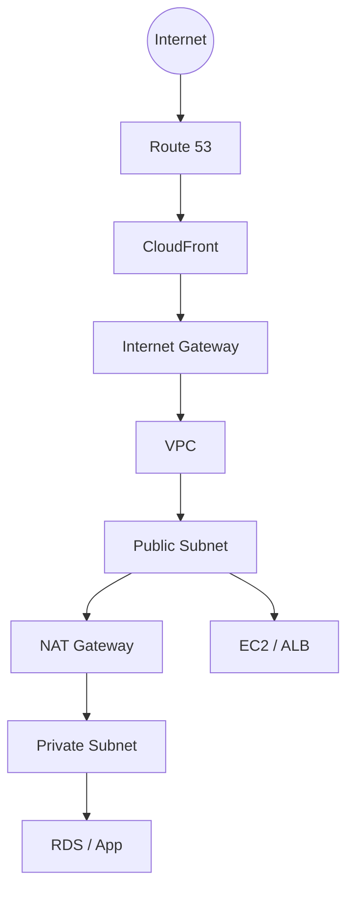
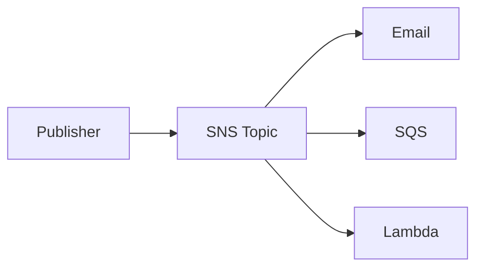
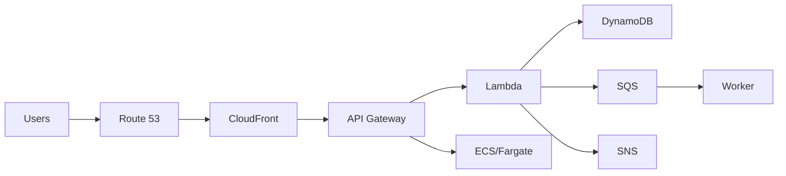

# 1. VPC 전체 구조



이 그림에서 시험에 필요한 것은 각 구성 요소의 **역할**이다.

---

# 2. Amazon VPC

Virtual Private Cloud.

AWS 안에 만드는 논리적으로 격리된 Network.

설정 요소:

- CIDR
- Subnet
- Route Table
- Internet Gateway
- NAT Gateway
- Security Group
- Network ACL

> “AWS 안의 사설 네트워크” → VPC

---

# 3. Subnet

VPC의 IP 범위를 나눈 Network Segment.

## Public Subnet

Internet Gateway로 향하는 Route가 있고, Public IP 등 필요한 조건을 갖춘 Resource가 Internet과 통신할 수 있는 Subnet.

대표:

- Public ALB
- Bastion
- NAT Gateway
- Internet-facing Web Resource

## Private Subnet

Internet에서 직접 들어오는 경로를 두지 않는 Subnet.

대표:

- Database
- Internal App
- Cache

> 단순히 “Public Subnet = 무조건 Internet 가능”이라고 외우기보다 **Route Table + IGW + Resource의 Public Address 조건**이 필요하다는 감각을 가진다.

---

# 4. Route Table

Traffic이 어느 Target으로 갈지 결정.

예:

```text
0.0.0.0/0 → Internet Gateway
```

또는 Private Subnet outbound:

```text
0.0.0.0/0 → NAT Gateway
```

---

# 5. Internet Gateway

VPC와 Internet 간 연결 Gateway.

> Public Internet 연결 → IGW

---

# 6. NAT Gateway

Private Subnet Resource가 Internet으로 **Outbound** 연결할 수 있도록 한다.

대표:

```text
Private EC2 → NAT Gateway → Internet
```

Internet에서 NAT Gateway를 통해 Private EC2로 임의의 Inbound 연결을 시작하는 용도가 아니다.

> “Private Subnet에서 패키지 Update/외부 API 호출” → NAT Gateway

---

# 7. Security Group vs Network ACL

| Security Group | Network ACL |
|---|---|
| Resource/ENI Level | Subnet Level |
| Stateful | Stateless |
| Allow Rules | Allow + Deny Rules |
| Return Traffic 자동 허용 | Inbound/Outbound 각각 평가 |

### 암기

```text
SG   = Stateful
NACL = Stateless
```

---

# 8. Amazon Route 53

Managed DNS.

기능:

- Domain Registration
- DNS Routing
- Health Check
- Routing Policies

대표 Routing Policy:

- Simple
- Weighted
- Latency-based
- Geolocation
- Failover

### 시험 연결

- “DNS” → Route 53
- “사용자 latency가 가장 낮은 Region으로” → Latency Routing
- “70%/30% Traffic 분배” → Weighted
- “Primary 장애 시 Secondary” → Failover

---

# 9. Amazon CloudFront

CDN.

Edge Location에 Content를 Cache해 사용자에게 빠르게 제공.

```text
User → Edge Location
       ├─ Cache Hit → 즉시 응답
       └─ Cache Miss → Origin(S3/ALB/EC2) → Cache
```

장점:

- Latency 감소
- Origin Load 감소
- Global Content Delivery
- WAF/Shield와 연계 가능

---

# 10. VPN vs Direct Connect

## AWS VPN / Site-to-Site VPN

Internet 위에 암호화 Tunnel.

- 빠르게 구축
- Internet 품질에 영향

## AWS Direct Connect

Customer Network와 AWS를 전용 회선으로 연결.

- 일관된 Network 경험
- 대용량/Hybrid 요구
- 물리 연결 Provisioning에 시간이 걸림

| VPN | Direct Connect |
|---|---|
| Internet 기반 암호화 | Dedicated connection |
| 빠른 시작 | 안정적/일관된 연결 |
| 일반 Hybrid | 지속적 대역폭/기업 환경 |

---

# 11. AWS PrivateLink

VPC 간 또는 VPC와 Service 간 통신을 Public Internet에 노출하지 않고 Private Connectivity로 제공.

> “Private하게 Service 제공/접근” → PrivateLink

---

# 12. AWS Transit Gateway

여러 VPC와 On-Premises Network를 중앙 Hub처럼 연결.

```text
VPC A ─┐
VPC B ─┼→ Transit Gateway → On-Prem
VPC C ─┘
```

> “많은 VPC Network 연결을 중앙화” → Transit Gateway

---

# 13. AWS Global Accelerator

AWS Global Network를 이용해 Global Application의 Availability/Performance를 향상.

CloudFront와 구별:

- CloudFront → Content Cache/CDN
- Global Accelerator → Network Traffic을 AWS Global Network로 최적화, Static Anycast IP 제공

---

# 14. API Gateway

API의 Managed Front Door.

기능:

- HTTP/REST API
- Authentication/Authorization 연동
- Throttling
- Routing
- Logging
- Lambda 등 Backend 연결

```text
Mobile/Web Client
      ↓
API Gateway
      ↓
Lambda / ECS / EC2
```

---

# 15. EventBridge / SNS / SQS / Step Functions

시험에서 매우 자주 섞는다.

## Amazon EventBridge

Event Bus / Event Routing.

```text
Event 발생 → Rule → Target
```

예:

- EC2 state change
- SaaS Event
- Scheduled Event

---

## Amazon SNS

Simple Notification Service.

**Pub/Sub, Fan-out, Notification**.



> “하나의 Message를 여러 Subscriber에게 Push” → SNS

---

## Amazon SQS

Simple Queue Service.

**Message Queue / Decoupling / Buffering**.

```text
Producer → SQS Queue → Consumer
```

> “Producer와 Consumer를 분리”, “작업을 Queue에 쌓음” → SQS

---

## SNS vs SQS

| SNS | SQS |
|---|---|
| Push / Pub-Sub | Queue / Pull |
| 여러 Subscriber Fan-out | Message를 보관 후 Consumer 처리 |
| Notification | Decoupling/Buffer |

---

## AWS Step Functions

여러 Service/Task를 State Machine으로 Orchestrate.

- 순서
- Branch
- Retry
- Error Handling

> “여러 Lambda/Task를 단계별 Workflow로” → Step Functions

---

# 16. Amazon SES / Amazon Connect

## Amazon SES

Simple Email Service.

대량/Transactional Email 전송.

> “Application이 Email 발송” → SES

## Amazon Connect

Cloud Contact Center.

> “고객센터/Call Center” → Amazon Connect

---

# 17. Developer Tools

## AWS CodeBuild

Source Code를 Build/Test.

> “Build” → CodeBuild

## AWS CodePipeline

CI/CD Pipeline Orchestration.

```text
Source → Build → Test → Deploy
```

> “Release Pipeline 자동화” → CodePipeline

## AWS X-Ray

Distributed Application Request Trace/Debug.

> “Microservice 요청이 어디에서 느린지 Trace” → X-Ray

## AWS CLI

Command Line으로 AWS API를 사용.

## AWS CloudFormation

Infrastructure as Code.

Template으로 AWS Resource를 반복 배포.

> “AWS Infrastructure를 Template으로 생성” → CloudFormation

---

# 18. Management & Governance 한 줄 정리

| 서비스 | 역할 |
|---|---|
| AWS Management Console | Web UI |
| AWS CLI | Command line |
| CloudFormation | Infrastructure as Code |
| Systems Manager | Fleet/Operations Management |
| Organizations | Multi-account 관리 |
| Control Tower | Landing Zone/Governance |
| Service Catalog | 승인된 Product Catalog |
| Service Quotas | 서비스 할당량 확인/관리 |
| Compute Optimizer | Resource 최적화 권고 |
| Trusted Advisor | Best Practice 권고 |
| AWS Health Dashboard | Account/Resource에 영향을 주는 AWS Event |

---

# 19. AI/ML Services — Domain 3.7

공식 CLF-C02에는 AI/ML 서비스 **이름 ↔ 수행 작업** 구별이 포함된다. 깊은 ML 지식은 필요 없다.

| 서비스 | 한 줄 용도 |
|---|---|
| Amazon SageMaker AI | ML Model Build/Train/Deploy |
| Amazon Lex | Chatbot / Conversational Interface |
| Amazon Kendra | Enterprise Intelligent Search |
| Amazon Comprehend | NLP/Text 분석, 감정/Entity 등 |
| Amazon Polly | Text → Speech |
| Amazon Rekognition | Image/Video 분석 |
| Amazon Textract | Document에서 Text/Table/Form 추출 |
| Amazon Transcribe | Speech → Text |
| Amazon Translate | Machine Translation |
| Amazon Q | AWS의 Generative AI Assistant 계열 |

### 암기 연결

```text
ML 개발 전체      → SageMaker
챗봇              → Lex
기업 검색          → Kendra
자연어 분석        → Comprehend
글을 음성으로      → Polly
이미지/영상 분석   → Rekognition
문서 OCR/표 추출   → Textract
음성을 글로        → Transcribe
번역              → Translate
```

---

# 20. Analytics Services

## Amazon Athena

S3 Data를 **Serverless SQL Query**.

> “S3에 있는 Log/CSV를 SQL로 바로 분석” → Athena

## AWS Glue

Serverless Data Integration / ETL + Data Catalog.

> “데이터 발견/정리/변환/ETL” → Glue

## Amazon Kinesis

Real-time Streaming Data.

> “실시간 Clickstream/IoT/Event Stream” → Kinesis

## Amazon QuickSight

Business Intelligence / Dashboard / Visualization.

> “BI Dashboard” → QuickSight

## Amazon EMR

Big Data Framework(Hadoop/Spark 등) Managed Cluster.

> “Hadoop/Spark Big Data Processing” → EMR

## Amazon OpenSearch Service

Search/Log Analytics.

> “Search, Log Analytics” → OpenSearch

## Amazon Redshift

Data Warehouse/OLAP.

> “기업 대규모 SQL 분석” → Redshift

---

# 21. Analytics 비교

| 상황 | 서비스 |
|---|---|
| S3의 파일을 SQL Query | Athena |
| ETL / Data Catalog | Glue |
| Real-time Stream | Kinesis |
| Dashboard/BI | QuickSight |
| Hadoop/Spark | EMR |
| Search/Log Analytics | OpenSearch |
| Data Warehouse | Redshift |

---

# 22. End User Computing

## Amazon WorkSpaces

Managed Virtual Desktop.

> “직원에게 Cloud Desktop 제공” → WorkSpaces

## Amazon AppStream 2.0

Application을 Streaming해 End User Device에서 사용.

> “Desktop 전체가 아니라 Application Streaming” → AppStream 2.0

## WorkSpaces Secure Browser

Managed Secure Browser access.

---

# 23. Frontend Web / Mobile

## AWS Amplify

Frontend/Mobile App Build/Host/Deploy를 쉽게 지원.

> “Frontend/Mobile App 개발·배포” → Amplify

## AWS AppSync

Managed GraphQL API.

> “GraphQL” → AppSync

---

# 24. IoT

## AWS IoT Core

IoT Device를 Cloud에 안전하게 연결하고 Message 처리.

> “IoT Device 연결/관리” → IoT Core

---

# 25. High-Yield Architecture 연결



이 그림을 외우라는 뜻이 아니라, 서비스 역할을 서로 연결해서 기억한다.

---

# 26. 매우 자주 헷갈리는 것

## CloudFront vs Global Accelerator

| CloudFront | Global Accelerator |
|---|---|
| CDN/Cache | Network Acceleration |
| HTTP Content 중심 | TCP/UDP Application 포함 |
| Edge Cache | Anycast IP + AWS Global Network |

## EventBridge vs SNS vs SQS

| EventBridge | SNS | SQS |
|---|---|---|
| Event Routing | Pub/Sub Push | Queue |
| Rule/Target | Fan-out | Buffer/Decouple |
| Event Bus | Notification | Work Queue |

## Athena vs Redshift

| Athena | Redshift |
|---|---|
| Serverless Query on S3 | Data Warehouse |
| 필요할 때 Query | Analytics DB |
| Data 이동 없이 분석 가능 | 데이터를 Warehouse에 적재해 분석 |

## Lex vs Polly vs Transcribe

```text
Lex        = 대화/챗봇
Polly      = Text → Speech
Transcribe = Speech → Text
```

---

# 27. 시험 직전 치트시트

```text
VPC           = AWS Private Network
Subnet        = VPC Network Segment
Route Table   = Traffic Route
IGW           = VPC ↔ Internet
NAT Gateway   = Private → Internet outbound
SG            = Stateful Resource Firewall
NACL          = Stateless Subnet Firewall
Route 53      = DNS
CloudFront    = CDN
Direct Connect= Dedicated Network
VPN           = Encrypted Internet Tunnel
PrivateLink   = Private Service Connectivity
Transit GW    = Multi-VPC Network Hub
Global Accelerator = Global Network Acceleration

API Gateway   = API Front Door
EventBridge   = Event Routing
SNS           = Pub/Sub / Notification
SQS           = Queue / Decoupling
Step Functions= Workflow
SES           = Email
Connect       = Contact Center

CodeBuild     = Build
CodePipeline  = CI/CD Pipeline
X-Ray         = Distributed Trace
CloudFormation= IaC

SageMaker     = ML Platform
Lex           = Chatbot
Kendra        = Enterprise Search
Comprehend    = NLP
Polly         = Text→Speech
Rekognition   = Image/Video
Textract      = Document extraction
Transcribe    = Speech→Text
Translate     = Translation

Athena        = SQL on S3
Glue          = ETL/Catalog
Kinesis       = Streaming
QuickSight    = BI Dashboard
EMR           = Hadoop/Spark
OpenSearch    = Search/Logs

WorkSpaces    = Virtual Desktop
AppStream 2.0 = Application Streaming
Amplify       = Frontend/Mobile
AppSync       = GraphQL
IoT Core      = IoT
```

---

## References

- CLF-C02 Domain 3:
  https://docs.aws.amazon.com/aws-certification/latest/cloud-practitioner-02/cloud-practitioner-02-domain3.html
- In-scope services:
  https://docs.aws.amazon.com/aws-certification/latest/cloud-practitioner-02/clf-02-in-scope-services.html
