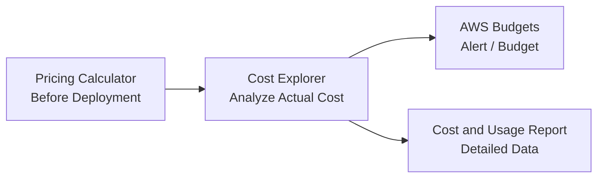

# 1. AWS Pricing의 기본 사고

핵심 원칙:

- Pay-as-you-go
- 장기 Commit 시 Discount
- 중단 가능한 Workload는 Spot
- Storage도 Access Pattern/성능/복구 시간에 따라 가격이 달라짐
- Data Transfer 비용은 방향/Region에 따라 다를 수 있음

---

# 2. EC2 구매 옵션

## 2.1 On-Demand

약정 없음.

- 예측하기 어려운 Workload
- 단기 개발/테스트
- 처음 사용하는 Workload

> “언제 얼마나 쓸지 모름, 약정 싫음” → On-Demand

---

## 2.2 Reserved Instances (RI)

일정 기간 사용을 Commit해 Discount.

대표:

- 1년 / 3년
- 안정적이고 예측 가능한 사용량

시험에서는 세부 할인율보다:

> “장기간 지속적으로 사용” → RI 또는 Savings Plans

를 이해한다.

---

## 2.3 Spot Instances

AWS의 여유 EC2 Capacity를 큰 Discount로 사용하지만 **중단될 수 있음**.

적합:

- Batch
- Rendering
- Fault-tolerant Processing
- 일부 ML Training
- CI/CD Worker

부적합:

- 중단을 견딜 수 없는 단일 DB
- Mission-critical stateful workload

> “중단 가능 + 최대 비용 절감” → Spot

---

## 2.4 Savings Plans

1년/3년 동안 일정 수준의 Compute 사용 금액($/hour)을 Commit.

대표:

- Compute Savings Plans
- EC2 Instance Savings Plans

RI보다 Instance 변경 등에 더 유연한 옵션이 존재.

> “장기 Compute 사용 + 유연성” → Savings Plans

---

# 3. Dedicated / Capacity 옵션

공식 CLF-C02 Domain 4에서 구별을 요구하는 항목이다.

## Dedicated Host

고객 전용 **물리 서버**.

용도:

- Software License 요구
- Compliance
- Host-level visibility/control

> “물리 Host 전체가 전용” → Dedicated Host

## Dedicated Instance

다른 고객 Instance와 물리 Host를 공유하지 않는 전용 Hardware에서 실행되지만 Host 자체 관리/지정은 Dedicated Host보다 적다.

> “전용 Hardware 필요, Host 자체 제어는 핵심 아님” → Dedicated Instance

## On-Demand Capacity Reservation

특정 AZ의 EC2 Capacity를 미리 확보.

> “할인이 아니라 Capacity 확보” → Capacity Reservation

---

# 4. 구매 옵션 비교

| 옵션 | 약정 | 중단 | 핵심 목적 |
|---|---|---|---|
| On-Demand | 없음 | 없음 | 최대 유연성 |
| RI | 1/3년 | 없음 | 장기 사용 할인 |
| Savings Plans | 1/3년 | 없음 | 장기 Compute 할인 + 유연성 |
| Spot | 없음 | 가능 | 최대 비용 절감 |
| Dedicated Host | 별도 | 없음 | 전용 물리 Host/License |
| Capacity Reservation | 기간에 따라 | 없음 | Capacity 확보 |

---

# 5. Storage Pricing 사고

Storage 비용은 단순 GB만 보지 않는다.

고려 요소:

- 저장 용량
- Storage Class
- Request
- Retrieval
- Data Transfer
- 최소 보관 기간 등

### S3 예

- 자주 사용 → Standard
- 패턴 모름 → Intelligent-Tiering
- 드물게 사용 → IA
- Archive → Glacier 계열

---

# 6. Data Transfer

시험에서 세부 가격 숫자를 외울 필요는 없다.

대신:

- Inbound와 Outbound 비용 구조가 다를 수 있음
- Region 간 Transfer는 비용 발생 가능
- 같은 Region/AZ 여부에 따라 가격 구조가 달라질 수 있음

> “AWS로 들어오는 데이터는 일반적으로 더 유리하고, 나가거나 Region 간 이동하는 데이터는 비용을 주의” 정도의 방향성을 기억하되, 실제 가격은 서비스별 공식 Pricing 확인.

---

# 7. Cost Management 4대장

각 비용 관리 서비스의 역할을 흐름으로 구별한다.



---

## 7.1 AWS Pricing Calculator

**사용 전에 예상 비용 계산**.

> “이 Architecture를 만들면 월 얼마?” → Pricing Calculator

---

## 7.2 AWS Cost Explorer

이미 발생한 Cost/Usage를 시각적으로 분석.

- Service별
- Account별
- Tag별
- 기간별
- Forecast

> “지난 6개월 EC2 비용 추세” → Cost Explorer

---

## 7.3 AWS Budgets

Budget/Usage Threshold를 설정하고 알림.

> “월 $100을 넘으면 알림” → Budgets

---

## 7.4 Cost and Usage Report (CUR)

가장 상세한 Cost/Usage Data.

- S3에 Delivery 가능
- Athena 등으로 분석 가능
- Account/Service/Tag/Discount 등 세부 정보

> “가장 상세한 Raw Billing Data” → CUR

---

# 8. Calculator vs Explorer vs Budgets vs CUR

| 질문 | 정답 |
|---|---|
| 만들기 전에 얼마 나올까? | Pricing Calculator |
| 실제 얼마 썼고 추세는? | Cost Explorer |
| 일정 금액을 넘으면 알려줘 | AWS Budgets |
| 모든 비용 데이터를 세밀하게 분석 | CUR |

---

# 9. AWS Organizations

여러 AWS Account를 중앙 관리.

핵심:

- Management account + Member accounts
- Organizational Units
- SCP(Service Control Policies)
- Consolidated Billing

---

## Consolidated Billing

Organization의 여러 Account 비용을 한 곳에서 통합.

장점:

- 단일 Bill
- 여러 Account 비용 가시성
- 일부 Volume Discount/RI/Savings 관련 이점 공유 가능

> “여러 AWS Account의 Bill을 하나로” → Organizations Consolidated Billing

---

# 10. Cost Allocation Tags

Resource Tag를 Billing 분석에 사용.

예:

```text
Project = A
Team = Security
Environment = Prod
```

활용:

- Cost Explorer
- CUR
- 부서/Project별 비용 배분

> “어느 팀이 얼마 썼는지” → Cost Allocation Tags

---

# 11. AWS Marketplace

AWS에서 Third-party Software/SaaS/Data 등을 검색·구매/배포하는 Digital Catalog.

시험에서는:

- Partner/ISV Solution
- Third-party Security Product
- Marketplace Billing/Governance

등과 연결.

---

# 12. AWS Support — 시험과 2026 실제 서비스의 차이

이 부분은 자료가 바뀌는 중이라 **시험 가이드와 현재 상품을 구분**한다.

## CLF-C02 시험 가이드에 나타나는 전통적 Support 이름

- Basic
- Developer Support
- Business Support
- Enterprise On-Ramp
- Enterprise Support

따라서 문제은행/시험 문제에서 위 이름이 나오면 식별할 수 있어야 한다.

## 2026-07 현재 실제 AWS Support 상품

AWS 공식 Support 문서는 현재 다음을 안내한다.

- Basic
- Business Support+
- Enterprise Support
- Unified Operations

또한 Developer Support, 기존 Business Support, Enterprise On-Ramp는 **2027-01-01 종료 예정**이며 2026년에 전환이 진행 중이다.

### 공부 원칙

1. **시험에서 오래된 이름이 나오면 CLF-C02 Exam Guide 문맥으로 푼다.**
2. 실제 AWS 운영 지식으로는 현재 Support Product 변경을 별도로 기억한다.

---

# 13. 시험용 Support 개념

## Basic

모든 AWS Customer에게 기본 제공.

- Customer service
- Documentation
- Whitepaper
- Community/Support resource
- Billing 관련 도움

기술 Case의 깊은 지원은 Premium Plan에서 제공.

---

## Developer / Business / Enterprise 계열

시험에서 구별하는 대표 방향:

- Developer → 개발/테스트 환경 기술 지원
- Business → Production workload, 24x7 Support 범위 확대
- Enterprise → Mission-critical + TAM 등 고급 지원
- Enterprise On-Ramp → Enterprise와 Business 사이의 전통적 Tier로 시험 가이드에 등장 가능

> 특정 Response Time 숫자는 상품 변경 가능성이 크므로 문제은행이 오래된 자료라면 공식 CLF-C02 기준과 문제 출처 날짜를 구별한다.

---

# 14. AWS Trusted Advisor

AWS 환경을 Best Practice 관점에서 검사하고 권고.

대표 분야:

- Cost Optimization
- Performance
- Security
- Fault Tolerance
- Service Limits/Quotas

> “사용하지 않는 EC2, 보안 설정, Limit 등을 검사해 개선 권고” → Trusted Advisor

---

# 15. AWS Health Dashboard

AWS Event 중 **내 Account/Resource에 영향을 줄 수 있는 Event/상태**를 확인.

### CloudWatch vs Health Dashboard

- CloudWatch → 내 Resource Metric/Log
- Health Dashboard → AWS Service Event와 내 환경 영향

---

# 16. Support Center

AWS Support Case 생성/관리.

> “AWS에 Technical Support Case를 연다” → Support Center

---

# 17. Knowledge / Learning / Guidance Resources

공식 Domain 4는 다음 리소스를 구별할 수 있어야 한다.

## AWS Documentation

서비스 공식 설명/가이드.

## AWS Whitepapers

Architecture, Security, Economics 등 Best Practice 문서.

## AWS re:Post

AWS Community Q&A / Knowledge sharing.

## AWS Knowledge Center

자주 발생하는 AWS 기술 질문/해결 자료.

## AWS Prescriptive Guidance

Migration/Modernization/Architecture 등에 대한 구체적인 Pattern/Guidance.

---

# 18. AWS Partner Network / Professional Services

## AWS Partner

ISV, Consulting/System Integrator 등 AWS Ecosystem의 파트너.

## AWS Professional Services

AWS 전문가가 고객의 Cloud Project/Transformation을 직접 지원.

## AWS Solutions Architect

Architecture Guidance를 제공하는 AWS 기술 역할.

## AWS Trust & Safety

AWS Resource Abuse/악용 신고와 관련된 조직.

---

# 19. Billing / Support 시험 직전 치트시트

```text
On-Demand       = 약정 없음
Reserved        = 장기 안정 사용 할인
Savings Plans   = 장기 Compute Commit + 더 유연
Spot            = 중단 가능, 가장 저렴
Dedicated Host  = 전용 물리 Host
Capacity Reservation = 할인보다 Capacity 확보

Pricing Calculator = 사용 전 예상
Cost Explorer      = 실제 비용/추세 분석
Budgets            = 예산/알림
CUR                = 가장 상세한 비용 Raw Data

Organizations      = Multi-account 관리
Consolidated Billing = 여러 Account 통합 결제
Cost Allocation Tag = Team/Project별 비용 분류
Marketplace        = Third-party 제품/서비스 Catalog

Trusted Advisor    = Best Practice 권고
Health Dashboard   = AWS Event가 내 Account에 미치는 영향
Support Center     = Support Case
re:Post            = Community Q&A
Knowledge Center   = 해결 자료
Prescriptive Guidance = 구체적 Cloud Pattern/Guidance
Professional Services = AWS 전문가 Project 지원
```

---

# 20. FINAL CCP SERVICE MAP

시험 직전에 이것만 빠르게 훑는 용도.

## Cloud / Architecture

```text
CAF              = Cloud Adoption Framework
Well-Architected = 6 Architecture Pillars
Region           = Geographic area
AZ               = Independent data center group
Edge Location    = CDN/Global delivery point
```

## Compute

```text
EC2              = Virtual Server
Lambda           = Serverless Function
Lightsail        = Simple VPS
Elastic Beanstalk= Managed App Platform
Batch            = Batch Computing
Outposts         = AWS Infrastructure On-Prem
```

## Containers

```text
ECR              = Container Registry
ECS              = AWS Container Orchestration
EKS              = Managed Kubernetes
Fargate          = Serverless Container Compute
```

## Storage

```text
S3               = Object
EBS              = Block
Instance Store   = Ephemeral Local Block
EFS              = Shared NFS
FSx              = Managed File Systems
Glacier          = Archive
Storage Gateway  = Hybrid Storage
AWS Backup       = Central Backup
```

## Database

```text
RDS              = Managed Relational
Aurora           = AWS-native MySQL/PostgreSQL-compatible
DynamoDB         = NoSQL
Redshift         = Data Warehouse
ElastiCache      = In-memory Cache
DocumentDB       = MongoDB-compatible
Neptune          = Graph
DMS              = DB Data Migration
SCT              = Schema Conversion
```

## Network

```text
VPC              = Private Network
IGW              = Internet Gateway
NAT Gateway      = Private outbound Internet
SG               = Stateful Firewall
NACL             = Stateless Firewall
Route 53         = DNS
CloudFront       = CDN
Direct Connect   = Dedicated Network
VPN              = Encrypted Tunnel
PrivateLink      = Private Service Connectivity
Transit Gateway  = Network Hub
Global Accelerator = Network Acceleration
```

## App Integration

```text
API Gateway      = API Front Door
EventBridge      = Event Routing
SNS              = Pub/Sub Push
SQS              = Queue
Step Functions   = Workflow
SES              = Email
Connect          = Contact Center
```

## Security

```text
IAM              = AWS Access Management
Identity Center  = Workforce SSO
KMS              = Encryption Key
Secrets Manager  = Secret
WAF              = Web Attack
Shield           = DDoS
GuardDuty        = Threat Detection
Inspector        = Vulnerability
Macie            = Sensitive Data in S3
Security Hub     = Findings Aggregation
Detective        = Investigation
Artifact         = AWS Compliance Documents
Audit Manager    = Audit Evidence
ACM              = TLS Certificate
Cognito          = App User Authentication
```

## Management

```text
CloudWatch       = Metrics / Logs / Alarm
CloudTrail       = API Activity Audit
Config           = Configuration / Compliance
CloudFormation   = IaC
Systems Manager  = Operations Management
Organizations    = Multi-account
Control Tower    = Landing Zone / Governance
Trusted Advisor  = Best Practice Recommendation
```

## Analytics

```text
Athena           = SQL on S3
Glue             = ETL / Data Catalog
Kinesis          = Streaming
QuickSight       = BI
EMR              = Hadoop / Spark
OpenSearch       = Search / Log Analytics
Redshift         = Data Warehouse
```

## AI/ML

```text
SageMaker AI     = ML Build/Train/Deploy
Lex              = Chatbot
Kendra           = Enterprise Search
Comprehend       = NLP
Polly            = Text → Speech
Rekognition      = Image/Video
Textract         = Document extraction
Transcribe       = Speech → Text
Translate        = Translation
Amazon Q         = Generative AI assistant
```

## End User / Frontend / IoT

```text
WorkSpaces       = Virtual Desktop
AppStream 2.0    = Application Streaming
Amplify          = Frontend/Mobile Build
AppSync          = GraphQL
IoT Core         = IoT Device Connectivity
```

---

# 21. 30분 최종 복습 순서

시험 직전 시간이 정말 부족하면:

### 0~5분
- Shared Responsibility
- IAM User/Role/Policy
- CloudTrail/Config/CloudWatch

### 5~10분
- EC2/Lambda/ECS/EKS/Fargate
- S3/EBS/EFS
- RDS/DynamoDB/Redshift

### 10~15분
- VPC/IGW/NAT
- SG/NACL
- Route53/CloudFront
- SNS/SQS/EventBridge

### 15~20분
- WAF/Shield/GuardDuty/Inspector/Macie
- KMS/Secrets Manager
- Artifact/Audit Manager

### 20~25분
- On-Demand/RI/Spot/Savings Plans
- Calculator/Explorer/Budgets/CUR
- Organizations

### 25~30분
- AI/ML 서비스 이름-용도
- Analytics 서비스 이름-용도
- Support/Trusted Advisor/Health

---

# 22. 문제풀이에서 사용하는 규칙

문제를 읽고 먼저 **명사/동사 Keyword**를 찾는다.

```text
“누가 삭제?”              → CloudTrail
“CPU 80%?”                → CloudWatch
“설정 규정 준수?”         → Config

“웹 공격?”                → WAF
“DDoS?”                   → Shield
“위협 탐지?”              → GuardDuty
“취약점?”                 → Inspector
“S3 개인정보?”            → Macie

“Queue?”                   → SQS
“Notification/Fan-out?”   → SNS
“Event routing?”          → EventBridge
“Workflow?”                → Step Functions

“예상 비용?”              → Pricing Calculator
“실제 비용 추세?”         → Cost Explorer
“예산 초과 알림?”         → Budgets
“상세 비용 데이터?”       → CUR
```

정답을 외우는 것보다 이 **Keyword → Service Mapping**을 만드는 것이 CCP 단기 준비에 효과적이다.

---

## 현재 Support Product 변경 주의

2026-07 현재 실제 AWS Support는 Basic, Business Support+, Enterprise Support, Unified Operations를 중심으로 개편되어 있다. Developer Support, 기존 Business Support, Enterprise On-Ramp는 2027-01-01 종료 공지가 나와 있다.

그러나 CLF-C02 시험 가이드에는 아직 Developer / Business / Enterprise On-Ramp / Enterprise Support 명칭이 포함되어 있으므로 **시험 문제에서는 가이드에 적힌 전통적 명칭을 인식할 수 있어야 한다.**

---

## References

- CLF-C02 Domain 4:
  https://docs.aws.amazon.com/aws-certification/latest/cloud-practitioner-02/cloud-practitioner-02-domain4.html
- CLF-C02 in-scope services:
  https://docs.aws.amazon.com/aws-certification/latest/cloud-practitioner-02/clf-02-in-scope-services.html
- AWS Support plans (current):
  https://docs.aws.amazon.com/awssupport/latest/user/aws-support-plans.html
