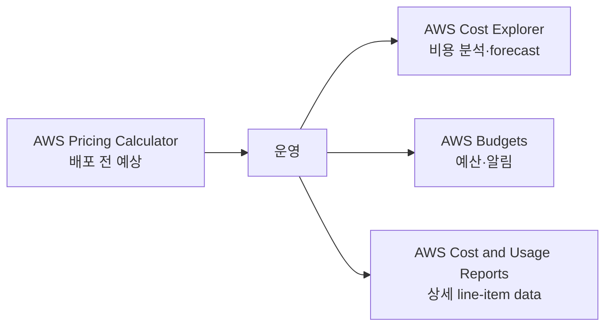

# 05. Pricing → Cost Management → Organizations → Support

> **시험 비중:** Domain 4, 12%  
> **주의:** Support 상품은 2026년에 전환 중이다. 이 노트는 **CLF-C02 시험 가이드의 기존 명칭**과 **2026-08-11 현재 상품**을 분리한다.

## 1. 시험 자체를 먼저 이해하기

| 항목 | CLF-C02 |
|---|---|
| 시간 | 90분 |
| 문항 | 65문항, 객관식·복수 응답 |
| 채점 | 50문항 채점 + 15문항 비채점, 비채점 문항은 표시 안 됨 |
| 합격 기준 | 100~1,000 환산 점수 중 700 |
| Domain | 1: 24%, 2: 30%, 3: 34%, 4: 12% |

오답 감점은 없으므로 빈 답을 남기지 않는다. 구현·코딩·문제 해결보다 **서비스와 개념의 적합한 사용 사례 식별**이 중심이다.

## 2. AWS 가격의 기본 사고

1. 사용량에 따라 지불한다.
2. 장기 사용을 약정하면 할인을 받을 수 있다.
3. 중단 가능한 workload는 Spot으로 절감할 수 있다.
4. 저장 비용은 용량뿐 아니라 class, request, retrieval, 성능에 따라 달라진다.
5. data transfer는 방향과 위치에 따라 과금이 다르다.

시험은 할인율 숫자보다 **수요의 예측 가능성, 약정, 중단 허용, 전용 hardware, capacity 보장**을 묻는다.

## 3. EC2 purchasing options

### On-Demand Instances

장기 약정 없이 사용한다.

- 새롭거나 사용량을 예측하기 어려운 workload
- 단기 개발·테스트
- 사용 패턴을 먼저 측정할 때

```text
약정 없음 + 최대 유연성 → On-Demand
```

### Reserved Instances(RI)

1년 또는 3년의 특정 속성 사용을 약정해 할인받는 **billing benefit**이다. “이미 실행 중인 특정 EC2 한 대를 이름으로 예약”하는 개념이 아니다.

- 예측 가능한 상시 workload
- Standard RI: 할인은 크지만 변경 유연성이 낮음
- Convertible RI: 조건에 맞는 다른 RI로 교환할 유연성
- payment option: All Upfront, Partial Upfront, No Upfront

일부 zonal RI는 capacity reservation 효과도 있지만, **할인 목적의 RI**와 **On-Demand Capacity Reservation**을 구별한다.

### Spot Instances

AWS의 여유 EC2 capacity를 큰 할인으로 사용하지만 capacity가 필요해지면 중단될 수 있다.

적합:

- batch·rendering
- fault-tolerant distributed processing
- checkpoint·재시작 가능한 ML training
- CI worker

부적합:

- 중단을 견딜 수 없는 단일 stateful DB
- 대체 수단 없는 mission-critical workload

### Savings Plans

1년 또는 3년 동안 일정 compute 사용 금액($/hour)을 약정한다.

| Compute Savings Plans | EC2 Instance Savings Plans |
|---|---|
| EC2 family·Region 등에 더 유연 | 특정 Region의 instance family에 약정 |
| EC2, Fargate, Lambda에 적용 가능 | EC2에 초점 |
| 유연성 우선 | 더 높은 할인 가능성 |

### Dedicated·capacity options

| 옵션 | 핵심 목적 | 문제 단서 |
|---|---|---|
| Dedicated Host | 고객 전용 물리 host 전체 | socket/core visibility, host-bound license |
| Dedicated Instance | 다른 고객 instance와 host를 공유하지 않는 tenancy | 전용 hardware, host 제어는 불필요 |
| On-Demand Capacity Reservation | 특정 AZ의 EC2 capacity 확보 | 할인보다 capacity 보장 |

### 한 번에 비교

| 옵션 | 장기 약정 | AWS에 의한 중단 | 핵심 가치 |
|---|---:|---:|---|
| On-Demand | 없음 | 없음 | 유연성 |
| RI | 1/3년 | 없음 | 예측 가능한 사용 할인 |
| Savings Plans | 1/3년 | 없음 | compute 약정 할인·유연성 |
| Spot | 없음 | 가능 | 중단 허용 시 큰 절감 |
| Dedicated Host | 별도 구매 방식 | 없음 | 전용 물리 host·license |
| Capacity Reservation | 장기 할인 약정과 별개 | 없음 | capacity 확보 |

## 4. Storage와 data transfer 가격

### Storage 가격 요소

- 저장한 GB와 기간
- storage class/tier
- request 횟수·유형
- retrieval 용량과 속도
- provisioned performance(IOPS·throughput 등)
- 최소 보관 기간·조기 삭제 조건
- data transfer

```text
자주 접근          → S3 Standard
패턴 예측 어려움   → Intelligent-Tiering
드물지만 즉시 접근 → Standard-IA
장기 archive       → Glacier classes
```

### Data transfer

- AWS로 들어오는 internet data transfer는 많은 경우 무료지만 서비스별 예외를 확인한다.
- internet으로 나가는 data, Region 간, AZ 간 전송은 비용이 발생할 수 있다.
- CloudFront 같은 서비스가 origin의 반복 전송과 최종 사용자 전송 비용 구조를 바꿀 수 있다.

시험에서는 세부 단가를 외우지 말고 **inbound vs outbound**, **same AZ vs cross-AZ**, **same Region vs cross-Region**을 구별한다.

## 5. Cost Management 도구



| 도구 | 답하는 질문 | 핵심 기능 |
|---|---|---|
| AWS Pricing Calculator | “만들기 전에 얼마인가?” | 구성별 예상 견적·scenario 비교 |
| AWS Cost Explorer | “실제로 어디에 얼마 썼는가?” | chart, filter, trend, forecast |
| AWS Budgets | “예산·사용량 임계값에 도달했는가?” | actual/forecast budget alert, action 연계 |
| AWS Cost and Usage Reports(CUR) | “가장 상세한 원시 비용·사용 내역은?” | S3 delivery, line item, Athena/BI 분석 |

이 네 도구가 반드시 순서대로 실행되어야 하는 것은 아니다. 목적별로 함께 사용한다.

**예제**

- 새 architecture의 월 예상 비용 → Pricing Calculator
- 지난 6개월 EC2 비용 추세 → Cost Explorer
- 월 $500의 80%에 도달하면 알림 → AWS Budgets
- account·tag·discount별 상세 사용량을 SQL로 분석 → CUR + S3 + Athena

## 6. AWS Organizations와 비용 배분

### Consolidated billing

여러 AWS 계정의 비용과 결제를 management account에서 통합한다.

- 여러 계정에 대한 bill 통합
- 조직 전체 사용량 집계로 volume tier 혜택 가능
- RI와 Savings Plans 할인 공유 가능
- 계정별 비용 가시성 유지

할인 공유는 설정과 적용 규칙의 영향을 받는다. 시험에서는 **한 계정이 산 RI/Savings Plans 혜택이 consolidated billing family의 적격 사용량에 적용될 수 있다**는 개념을 기억한다.

### Cost allocation tags

리소스에 key-value metadata를 붙여 비용을 분류한다.

```text
Project=Checkout
Team=Platform
Environment=Prod
```

- AWS-generated tag와 user-defined tag가 있다.
- 비용 보고에 쓰려면 Billing에서 cost allocation tag로 활성화해야 하는 경우가 있다.
- tag에 PII나 secret을 넣지 않는다.

**Resource tag**는 분류 정보이고, **SCP**는 계정의 최대 권한을 제한하며, **AWS Budgets**는 비용 임계값을 감시한다.

## 7. AWS Marketplace

AWS에서 third-party software, SaaS, data, professional service 등을 찾고 구매하는 digital catalog다.

- security·network 등 partner 제품 배포
- AWS bill과 결제 통합 가능
- 조직의 private marketplace와 entitlement/governance 활용 가능

AWS Marketplace는 AWS가 직접 제공하는 모든 native service의 목록이 아니다.

## 8. AWS Support — 시험 명칭과 현재 상품 분리

### 8.1 CLF-C02 시험 가이드의 기존 명칭

현재 시험 가이드는 다음 명칭을 Support option 예로 계속 적고 있다.

| 기존 시험 명칭 | 식별 키워드 |
|---|---|
| Basic | 모든 고객, account·billing, 문서·community, 기본 health·Trusted Advisor 접근 |
| Developer Support | 개발·테스트, business-hours email 중심 |
| Business Support | production workload, 24x7 phone·chat·web, critical case 1시간 수준 |
| Enterprise On-Ramp | Business와 Enterprise 사이, business-critical, TAM pool·30분 수준 |
| Enterprise Support | mission-critical, designated TAM, 15분 수준 |

정확한 응답 목표는 case severity와 공식 조건에 따라 달라진다. 문제에서 기존 명칭만 주어지면 **그 문제의 기존 체계 안에서** 가장 적합한 plan을 고른다.

### 8.2 2026-08-11 현재 실제 상품

AWS Support 문서가 안내하는 현재 주력 plan:

| 현재 plan | 핵심 |
|---|---|
| Basic | account·billing, forum, health check, 문서 |
| AWS Business Support+ | 24x7 phone/web/chat, 생성형 AI 응답, critical down 시 30분 미만 human engagement |
| AWS Enterprise Support | designated TAM, production-critical 최대 15분 응답, 전략 review |
| AWS Unified Operations | application guidance, TAM+DSE, runbook·운영 중심 지원 |

Developer Support와 기존 Business Support는 2027-01-01 종료 예정이며 기존 고객은 그전까지 전환할 수 있다. Enterprise On-Ramp도 2027-01-01 종료 예정이고 2026년 중 Enterprise Support로 전환된다.

> **시험 원칙:** 보기의 명칭과 시험 가이드 문맥을 먼저 따른다. 실제 운영 질문이면 현재 Support 문서를 확인한다.

원본 Support 이미지의 plan 순서·TAM·응답 시간 일부는 서로 모순되어 있어 그대로 암기하지 않는다.

## 9. AWS Trusted Advisor

AWS 환경을 best practice와 비교하여 권고를 제공한다.

현재 check category는 여섯 가지다.

1. Cost Optimization
2. Performance
3. Security
4. Fault Tolerance
5. Service Limits
6. Operational Excellence

원본 강의의 다섯 category 표에는 후에 추가된 **Operational Excellence**가 빠져 있다.

### 접근 범위

- Basic: Service Limits 전체와 Security·Fault Tolerance의 일부 check 등 제한된 핵심 접근
- Business Support+, Enterprise Support, Unified Operations: 모든 Trusted Advisor check와 API 접근
- 기존 시험 문맥: Business/Enterprise 계열에서 전체 기능이라는 전통적 구별을 사용

Trusted Advisor는 권고 도구다. 고객 승인 없이 모든 문제를 자동으로 수정하는 서비스가 아니다.

## 10. Health와 지원 요청

| 리소스 | 역할 | CloudWatch와 차이 |
|---|---|---|
| AWS Health Dashboard | AWS service event와 계정·resource 영향 확인 | CloudWatch는 내 metric·log·alarm 관찰 |
| AWS Health API | health event를 programmatic하게 조회 | 자동화·통합 |
| AWS Support Center | support case 생성·관리 | 운영 metric 도구가 아님 |

```text
내 EC2 CPU가 높음       → CloudWatch
AWS event가 내 resource에 영향 → AWS Health Dashboard
AWS engineer에게 case 제출      → Support Center
```

## 11. 공식 지식·지원 리소스

| 요구 | 리소스 |
|---|---|
| 서비스 사용법과 API | AWS Documentation |
| architecture·security·economics 모범 사례 | AWS Whitepapers |
| community Q&A와 지식 공유 | AWS re:Post |
| 자주 발생하는 기술 문제 해결 글 | AWS Knowledge Center |
| migration·modernization pattern | AWS Prescriptive Guidance |
| 보안 소식과 guidance | AWS Security Blog / Security Center |
| AWS resource 악용 신고 | AWS Trust & Safety |

## 12. 전문가·partner 지원

| 대상 | 역할 |
|---|---|
| AWS Partner Network(APN) | ISV와 system integrator 등 partner 생태계 |
| AWS Professional Services | AWS 전문가가 transformation/project 수행 지원 |
| AWS Solutions Architect | 요구에 맞는 architecture guidance |
| Independent Software Vendor(ISV) | AWS에서 동작하는 software product 제공 |
| System Integrator(SI) | 고객 system 구축·통합·migration 지원 |

AWS Partner가 되면 partner training·certification, 행사·공동 판매 기회, 등급과 프로그램에 따른 혜택을 받을 수 있다. “모든 Partner에게 항상 같은 할인”으로 단정하지 않고, 시험에서는 **AWS가 검증한 전문 생태계와 고객 지원 경로**라는 역할을 기억한다.

## 13. 문제 풀이 예제

**상황:** “중단 가능하고 재시작 가능한 nightly batch의 EC2 비용을 최소화한다.”  
**정답:** Spot Instances

**상황:** “특정 AZ에서 launch할 EC2 capacity를 확보해야 한다. 할인보다 가용 capacity가 중요하다.”  
**정답:** On-Demand Capacity Reservation

**상황:** “여러 계정의 비용을 하나의 bill로 받고 RI 혜택을 공유한다.”  
**정답:** AWS Organizations consolidated billing

**상황:** “AWS event가 내 계정 resource에 영향을 주는지 본다.”  
**정답:** AWS Health Dashboard

**상황:** “시험 보기에서 TAM과 mission-critical 15분 응답이 나온다.”  
**정답:** Enterprise Support

## 14. 시험 직전 30분 복습

| 시간 | 볼 것 |
|---|---|
| 0~5분 | Shared Responsibility, Root/MFA, IAM Role |
| 5~10분 | CloudTrail/Config/CloudWatch, WAF/Shield, GuardDuty/Inspector/Macie |
| 10~15분 | EC2/Lambda/Fargate, S3/EBS/EFS, RDS/DynamoDB/Redshift |
| 15~20분 | IGW/NAT, SG/NACL, Route 53/CloudFront, SNS/SQS/EventBridge |
| 20~25분 | On-Demand/RI/Spot/Savings Plans, Calculator/Explorer/Budgets/CUR |
| 25~30분 | Well-Architected, CAF, Support, AI·ML 이름↔작업 |

### 마지막 문제 풀이 규칙

1. 문제에서 **동사**를 찾는다: 저장, 분산, 탐지, 감사, 알림, 분석.
2. 요구 조건을 표시한다: managed, serverless, relational, archive, private, global.
3. 중복 기능이 보이면 **가장 직접적인 서비스**를 고른다.
4. “가장 비용 효율적”은 중단·약정·성능 조건을 모두 확인한다.
5. 복수 응답은 요구사항을 각각 충족하는지 독립적으로 검사한다.

## References

- [CLF-C02 Domain 4](https://docs.aws.amazon.com/aws-certification/latest/cloud-practitioner-02/cloud-practitioner-02-domain4.html)
- [AWS Support Plans — current](https://docs.aws.amazon.com/awssupport/latest/user/aws-support-plans.html)
- [AWS Trusted Advisor](https://docs.aws.amazon.com/awssupport/latest/user/trusted-advisor.html)
- [AWS Organizations Consolidated Billing](https://docs.aws.amazon.com/awsaccountbilling/latest/aboutv2/consolidated-billing.html)
- [AWS Certified Cloud Practitioner 시험 준비](https://aws.amazon.com/certification/certified-cloud-practitioner/)
- 원본: `day3/4.1.md`~`day3/4.3.md`, `day3/ex1.md` 및 참조 이미지

---

## 반드시 알아야 할 핵심 비교

| 비교 | A | B | C |
|---|---|---|---|
| On-Demand vs Spot | 약정·중단 없음 | 중단 가능, 큰 할인 | — |
| RI vs Savings Plans | 속성에 묶인 예약 할인 | $/hour compute 약정과 더 큰 유연성 | — |
| Dedicated Host vs Dedicated Instance | 물리 host 전체 제어 | 전용 tenancy, host 제어 적음 | — |
| RI vs Capacity Reservation | 할인 | 특정 AZ capacity 확보 | — |
| Calculator vs Explorer | 배포 전 예상 | 실제 비용·추세 | — |
| Budgets vs CUR | 임계값·알림 | 가장 상세한 비용 data | — |
| Tag vs Budget vs SCP | 비용 분류 | 비용 감시 | 권한 제한 |
| CloudWatch vs Health Dashboard | 내 metric·log | AWS event의 내 계정 영향 | — |

## 시험에서 헷갈리는 서비스

| 요구 | 정답 | 헷갈리는 서비스 |
|---|---|---|
| 중단 가능한 compute 최저 비용 | Spot | RI는 장기 약정 |
| 장기 compute + family/Region 유연성 | Compute Savings Plans | EC2 Instance SP는 더 제한적 |
| 가장 상세한 billing line item | CUR | Cost Explorer는 시각 분석 |
| 여러 계정 통합 bill | Organizations | Budgets는 예산 알림 |
| best-practice 권고 | Trusted Advisor | Compute Optimizer는 resource 구성 권고 중심 |
| support case | Support Center | re:Post는 community Q&A |
| AWS 악용 신고 | Trust & Safety | Support Center는 일반 support case |
| third-party software 구매 | Marketplace | Service Catalog는 조직 승인 제품 배포 |

## 최종 암기표

| 키워드 | 한 줄 암기 |
|---|---|
| On-Demand | 약정 없음 |
| RI | 예측 가능한 1/3년 사용 할인 |
| Spot | 중단 가능 |
| Savings Plans | compute $/hour 약정 |
| Dedicated Host | 전용 물리 host·license |
| Capacity Reservation | capacity 확보 |
| Pricing Calculator | 배포 전 예상 |
| Cost Explorer | 실제 비용·forecast |
| AWS Budgets | 예산·알림 |
| CUR | 상세 비용 data |
| Organizations | multi-account·consolidated billing |
| Cost allocation tags | 팀·project별 비용 분류 |
| Trusted Advisor | 비용·성능·보안·복원력·quota·운영 권고 |
| Health Dashboard | AWS event의 내 환경 영향 |
| Enterprise Support | designated TAM·mission-critical |
