# 01. Cloud Concepts — 왜 AWS Cloud를 쓰는가

> **시험 비중:** Domain 1, 24%  
> **이 파일의 질문:** “Cloud가 왜 유리한가?”, “어떤 설계 원칙인가?”, “어떻게 이전하는가?”

CLF-C02는 직접 아키텍처를 구현하는 시험이 아니다. 상황의 핵심 요구를 읽고 **Cloud의 이점·설계 원칙·마이그레이션 전략·경제성 개념**을 고르는 시험이다.

## 1. Cloud Computing의 뜻

Cloud computing은 서버, 스토리지, 데이터베이스 같은 IT 리소스를 네트워크를 통해 **필요할 때 확보하고 사용량에 따라 비용을 지불**하는 방식이다.

| 구분 | On-Premises | AWS Cloud |
|---|---|---|
| 자원 확보 | 장비를 구매·설치 | 필요할 때 프로비저닝 |
| 비용 | 큰 선투자, 고정 비용 중심 | 사용량 기반 가변 비용 중심 |
| 용량 | 미래 수요를 미리 예측 | 수요에 맞춰 조정 |
| 물리 인프라 | 고객이 운영 | AWS가 운영 |
| 출시 속도 | 조달에 수주~수개월 가능 | 분 단위로 시작 가능 |

**용어 설명**

- **Provisioning**: 사용할 IT 리소스를 준비하고 할당하는 일
- **Pay-as-you-go**: 사용한 양에 따라 지불하는 종량제
- **Managed service**: 설치·패치·백업 등 운영의 일부를 AWS가 맡는 서비스

### Cloud의 다섯 가지 일반 특성

| 특성 | 뜻 | 문제의 단서 |
|---|---|---|
| On-demand self-service | 필요할 때 직접 리소스를 확보 | 승인·조달 대기 없음 |
| Broad network access | 네트워크를 통해 다양한 장치에서 접근 | 어디서나 접근 |
| Resource pooling | 공급자 자원을 여러 고객에게 논리적으로 분리해 제공 | Multi-tenant |
| Rapid elasticity | 수요에 맞춰 빠르게 확보·반납 | 급증 후 감소 |
| Measured service | 사용량을 측정해 과금 | 종량제 |

## 2. AWS Cloud의 핵심 이점

### 2.1 Scalability와 Elasticity

- **Scalability(확장성)**: 더 큰 부하를 처리하도록 용량을 키울 수 있는 능력
- **Elasticity(탄력성)**: 수요 변화에 맞춰 용량을 빠르게 늘리고 다시 줄이는 능력

Elasticity 자체가 반드시 “자동”만을 뜻하는 것은 아니다. AWS에서는 **Auto Scaling**으로 자동화하는 경우가 대표적이다.

| 방식 | 뜻 | 예 |
|---|---|---|
| Vertical scaling, scale up | 한 서버를 더 크게 | 2 vCPU → 16 vCPU |
| Horizontal scaling, scale out | 서버 수를 늘림 | EC2 2대 → 20대 |
| Scale in | 서버 수를 줄임 | 행사 종료 후 20대 → 2대 |

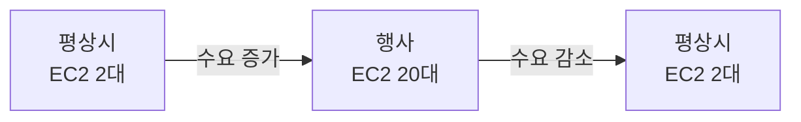

**시험 예제:** “연말에만 트래픽이 15배 증가하고 이후 다시 감소한다.” → **Elasticity**

### 2.2 Agility와 Speed of Deployment

**Agility(민첩성)**는 리소스를 빠르게 만들고 실험하여 출시 시간을 단축하는 능력이다.

```text
On-Premises: 구매 → 배송 → 설치 → 설정 → 배포
AWS Cloud:   콘솔/API/IaC → 생성 → 배포
```

문제에 **실험**, **몇 분 안에 시작**, **time to market**이 나오면 Agility를 생각한다.

### 2.3 High Availability와 Fault Tolerance

- **High Availability(고가용성)**: 장애 시간을 최소화해 서비스를 계속 사용할 수 있게 설계
- **Fault Tolerance(장애 허용)**: 구성 요소 장애가 발생해도 중단 없이 계속 동작하도록 더 강하게 설계

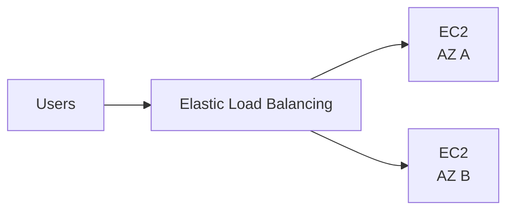

단일 데이터센터 장애 대응의 대표 답은 **여러 Availability Zone 사용**이다.

### 2.4 Global Reach

여러 Region과 Edge Location을 이용해 전 세계 사용자 가까이 서비스할 수 있다.

- 사용자 지연 시간 감소
- 여러 국가로 빠르게 확장
- 데이터 주권·규제 요구 대응
- 재해 복구와 비즈니스 연속성 설계

### 2.5 운영 부담 감소

서비스가 더 관리형일수록 고객이 관리하는 기반 계층이 줄어든다.

| 서비스 | 고객이 주로 관리 | AWS가 추가로 관리하는 영역 |
|---|---|---|
| EC2 | Guest OS, 앱, 데이터 | 물리 서버, 가상화 |
| RDS | 데이터, DB 계정, 접근 설정 | DB 인프라, 백업·패치 기능 |
| Lambda | 코드, 데이터, 권한 | 서버와 실행 인프라 |

데이터와 접근 권한까지 자동으로 AWS 책임이 되는 것은 아니다.

## 3. Cloud 서비스·배포 모델

### IaaS / PaaS / SaaS

| 모델 | 고객의 초점 | 공급자가 관리하는 범위 | 대표 예 |
|---|---|---|---|
| IaaS | OS부터 애플리케이션까지 | 물리 인프라·가상화 | Amazon EC2 |
| PaaS | 코드와 데이터 | 인프라·플랫폼 | Elastic Beanstalk 계열 |
| SaaS | 완성된 기능 사용 | 애플리케이션까지 | 웹 메일·협업 도구 |

Lambda는 보통 **FaaS/serverless compute**로 표현한다. 시험에서는 “서버 관리 없이 코드 실행”이 핵심이다.

### Public / Private / Hybrid / Multi-Cloud

| 모델 | 뜻 | 기억할 점 |
|---|---|---|
| Public Cloud | 공급자가 소유한 Cloud를 여러 고객에게 제공 | 논리적으로 격리 |
| Private Cloud | 한 조직만을 위한 Cloud 환경 | 통제성 높고 직접 운영 부담 가능 |
| Hybrid Cloud | On-Premises와 Public Cloud를 함께 사용 | VPN, Direct Connect, Outposts 등 |
| Multi-Cloud | 둘 이상의 Cloud provider 사용 | Hybrid와 다른 축의 개념 |

> VPC나 Dedicated Host를 사용한다고 AWS Public Cloud 자체가 Private Cloud로 바뀌는 것은 아니다. 이들은 AWS 안에서 네트워크 또는 물리 호스트 격리 요구를 충족하는 기능이다.

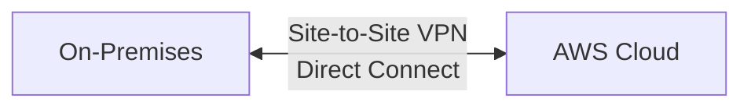

## 4. AWS Global Infrastructure

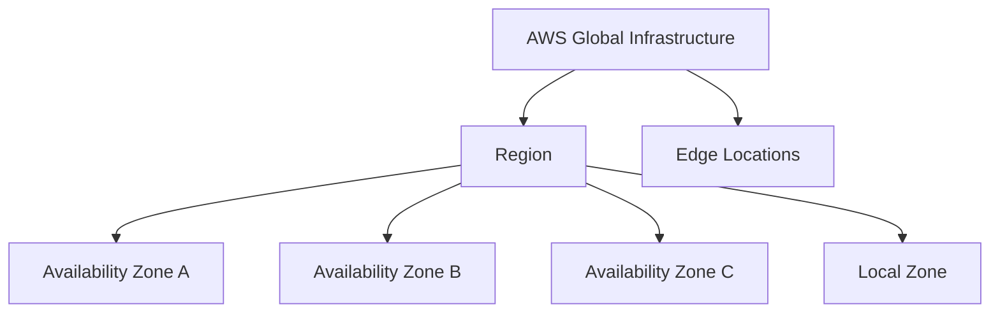

| 구성 요소 | 정확한 역할 | 선택 단서 |
|---|---|---|
| Region | 지리적으로 분리된 AWS 서비스 영역 | 데이터 주권, 가격, 서비스 가용성, 사용자 거리 |
| Availability Zone | Region 안의 하나 이상의 독립 데이터센터 | Multi-AZ 고가용성 |
| Edge Location | 사용자 가까이 콘텐츠·글로벌 서비스를 전달하는 거점 | CloudFront, 낮은 전송 지연 |
| Local Zone | Region을 대도시 가까이 확장한 일부 컴퓨팅·스토리지 위치 | 초저지연 워크로드 |

### Region을 고르는 기준

1. 법률·데이터 주권
2. 사용자와의 거리와 latency
3. 필요한 서비스 제공 여부
4. 가격

### Multi-AZ vs Multi-Region

| Multi-AZ | Multi-Region |
|---|---|
| 한 Region 안의 데이터센터 장애 대응 | Region 규모 재해·글로벌 사용자·데이터 주권 대응 |
| 고가용성의 대표 패턴 | 재해 복구·비즈니스 연속성에 사용 가능 |
| 상대적으로 가까운 AZ 간 구성 | 더 복잡하고 비용이 커질 수 있음 |

## 5. AWS Well-Architected Framework

워크로드를 모범 사례에 따라 **검토하고 개선**하기 위한 프레임워크다.

| Pillar | 핵심 질문 | 대표 단서 |
|---|---|---|
| Operational Excellence | 운영을 관찰하고 개선하는가? | 자동화, 작은 변경, 운영 절차 개선 |
| Security | 데이터·시스템·자산을 보호하는가? | 최소 권한, 암호화, 추적 |
| Reliability | 장애에서 복구하고 수요를 처리하는가? | Multi-AZ, 백업, 자동 복구 |
| Performance Efficiency | 적절한 기술을 효율적으로 쓰는가? | 워크로드에 맞는 자원 선택 |
| Cost Optimization | 불필요한 비용을 없앴는가? | rightsizing, idle 자원 제거 |
| Sustainability | 환경 영향을 줄이는가? | 자원 사용 효율, 불필요한 처리 축소 |

**예제**

- 반복 배포를 자동화하고 실패를 학습에 반영 → Operational Excellence
- 암호화와 최소 권한 적용 → Security
- 여러 AZ에 배치 → Reliability
- 서버리스로 실제 사용량에 맞춰 자원 사용 → Performance Efficiency 또는 Cost Optimization; 문제의 강조점을 본다.

## 6. AWS Cloud Adoption Framework(CAF)

Well-Architected가 **워크로드 설계**를 묻는다면 CAF는 **조직의 Cloud 전환**을 다룬다.

| CAF Perspective | 핵심 질문 | 대표 이해관계자/활동 |
|---|---|---|
| Business | 어떤 비즈니스 가치를 만드는가? | CEO, CFO, 전략·성과 |
| People | 조직과 역량이 준비되었는가? | HR, 교육, 역할 변화 |
| Governance | 가치·위험·비용을 어떻게 통제하는가? | 정책, 포트폴리오, 재무 |
| Platform | Cloud 기반을 어떻게 구축하는가? | CTO, 아키텍처, 마이그레이션 |
| Security | 기밀성·무결성·가용성을 어떻게 보호하는가? | CISO, 보안 통제 |
| Operations | 워크로드를 어떻게 운영·복구하는가? | 모니터링, 장애 대응 |

```text
CAF              = 조직이 Cloud로 전환할 준비와 방법
Well-Architected = 개별 workload를 잘 설계·운영하는 기준
```

## 7. Migration — 평가에서 개선까지

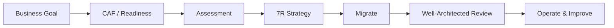

### Assessment와 TCO

Assessment는 단순히 서버 수만 세는 일이 아니다.

- CPU·메모리·스토리지 사용률과 peak
- OS·DB·애플리케이션 의존성
- 네트워크와 보안 요구
- 라이선스
- 전력·냉각·시설·인력까지 포함한 현재 비용

**TCO(Total Cost of Ownership)**는 구매 가격뿐 아니라 운영 기간 전체의 비용을 본다.

```text
절감률 = (현재 운영비 - AWS 예상 운영비) / 현재 운영비 × 100
```

원본 장표의 23.3억 원과 16.8억 원은 계산법을 보여 주는 가상 예시일 뿐 실제 할인 보장이 아니다.

### 7R Migration Strategies

원본 강의의 6R에 AWS의 현재 7R 분류인 **Relocate**를 보완한다.

| 전략 | 한 줄 뜻 | 예 |
|---|---|---|
| Rehost | 거의 변경 없이 이동 | VM → EC2, lift and shift |
| Relocate | 같은 플랫폼을 유지하며 인프라 묶음을 이동 | 기존 가상화 환경을 유사 환경으로 이전 |
| Replatform | 핵심 구조는 유지하고 일부 최적화 | 직접 운영 DB → 같은 엔진의 RDS |
| Repurchase | 다른 제품, 주로 SaaS로 교체 | 자체 CRM → SaaS |
| Refactor / Re-architect | Cloud-native하게 구조 재설계 | monolith → microservices |
| Retire | 불필요한 시스템 폐기 | 미사용 앱 종료 |
| Retain | 지금은 이전하지 않고 유지 | 규제·의존성 때문에 On-Premises 유지 |

### 주요 Migration 도구

| 요구 | 서비스/도구 |
|---|---|
| 환경 발견·의존성 수집 | AWS Application Discovery Service |
| TCO와 비즈니스 사례 평가 | Migration Evaluator |
| 여러 마이그레이션 진행 추적 | AWS Migration Hub |
| 서버·애플리케이션 이전 | AWS Application Migration Service |
| DB 데이터 이동·지속 복제 | AWS Database Migration Service(DMS) |
| 서로 다른 DB 엔진의 schema 변환 | AWS Schema Conversion Tool(SCT) |
| 네트워크가 어려운 대용량 데이터 | AWS Snow Family |

## 8. Cloud Economics

### CAPEX → OPEX, Fixed → Variable

| 개념 | 뜻 | 예 |
|---|---|---|
| CAPEX | 자산을 위한 큰 선투자 | 서버·데이터센터 구매 |
| OPEX | 운영하면서 발생하는 비용 | 월별 Cloud 사용료 |
| Fixed cost | 사용량과 관계없이 미리 발생 | 시설·장비 |
| Variable cost | 사용량에 따라 변함 | 컴퓨팅 실행 시간·스토리지 사용량 |

Cloud의 이점은 **CAPEX가 무조건 사라진다**가 아니라, 큰 고정 선투자를 줄이고 가변 비용으로 전환할 수 있다는 데 있다.

### Economies of Scale

AWS가 수많은 고객의 수요를 모아 대규모로 인프라를 운영하여 개별 조직보다 낮은 단위 비용을 제공할 수 있는 효과다.

### Rightsizing

워크로드에 맞는 리소스 크기·유형을 선택한다.

```text
평균 CPU 5%인 큰 인스턴스
        ↓
더 작은 적합한 인스턴스
        ↓
낭비 감소
```

### BYOL vs License Included

- **BYOL(Bring Your Own License)**: 기존 라이선스를 조건에 맞게 AWS에서 사용
- **License Included**: 서비스 요금에 소프트웨어 라이선스가 포함

라이선스 이동 가능 여부는 제품 계약에 따라 다르므로 시험에서는 두 모델의 개념만 구별한다.

## 9. 시험 문제를 푸는 방식

**상황:** “물리 장비 구매 없이 새 아이디어를 오늘 시험한다.”  
**단서:** 빠른 프로비저닝, 실험  
**답:** Agility

**상황:** “데이터센터 한 곳 장애에도 계속 서비스한다.”  
**단서:** 한 Region 안의 독립 위치  
**답:** Multi-AZ

**상황:** “기존 앱을 거의 수정하지 않고 빠르게 EC2로 옮긴다.”  
**단서:** lift and shift  
**답:** Rehost

**상황:** “조직·사람·거버넌스를 포함해 Cloud 전환을 준비한다.”  
**답:** AWS CAF

## References

- [AWS CLF-C02 시험 가이드](https://docs.aws.amazon.com/aws-certification/latest/cloud-practitioner-02/cloud-practitioner-02.html)
- [CLF-C02 Domain 1](https://docs.aws.amazon.com/aws-certification/latest/cloud-practitioner-02/cloud-practitioner-02-domain1.html)
- [AWS의 7R 마이그레이션 전략](https://docs.aws.amazon.com/prescriptive-guidance/latest/large-migration-guide/migration-strategies.html)
- 원본: `day1/1.1.md`~`day1/2.2.md`, `day2/2.3.md` 및 참조 이미지

---

## 반드시 알아야 할 핵심 비교

| 비교 | A | B |
|---|---|---|
| Scalability vs Elasticity | 더 큰 부하를 처리할 확장 능력 | 수요에 맞춰 빠르게 늘고 줄임 |
| High Availability vs Fault Tolerance | 중단 최소화 | 장애 중에도 계속 동작하는 더 강한 목표 |
| Region vs AZ | 지리적 서비스 영역 | Region 안의 독립 데이터센터 묶음 |
| Multi-AZ vs Multi-Region | 데이터센터 장애 대응 | Region 재해·글로벌·주권 대응 |
| CAF vs Well-Architected | 조직의 Cloud 전환 | 워크로드 설계·운영 검토 |
| Rehost vs Replatform | 거의 그대로 이동 | 일부 Cloud 최적화 |
| CAPEX vs OPEX | 선투자 자본 지출 | 운영 중 사용 비용 |

## 시험에서 헷갈리는 서비스

| 단서 | 정답 | 헷갈리는 오답 |
|---|---|---|
| 마이그레이션 전체 진행 추적 | Migration Hub | Application Migration Service는 실제 서버 이전 |
| 현재 환경 발견·의존성 수집 | Application Discovery Service | Migration Evaluator는 TCO 평가 중심 |
| DB 데이터 이동·복제 | DMS | SCT는 schema 변환 |
| 대용량 오프라인 전송 | Snow Family | Direct Connect는 전용 네트워크 연결 |
| 조직의 도입 준비 | AWS CAF | Well-Architected는 워크로드 검토 |

## 최종 암기표

| 키워드 | 한 줄 암기 |
|---|---|
| Pay-as-you-go | 사용한 만큼 지불 |
| Agility | 빠르게 만들고 실험 |
| Scalability | 더 큰 규모 처리 |
| Elasticity | 수요에 맞춰 늘리고 줄임 |
| Multi-AZ | 고가용성 |
| Multi-Region | DR·글로벌·데이터 주권 |
| CAF | Business, People, Governance, Platform, Security, Operations |
| Well-Architected | 운영, 보안, 신뢰성, 성능 효율, 비용, 지속 가능성 |
| 7R | Rehost, Relocate, Replatform, Repurchase, Refactor, Retire, Retain |
| TCO | 시설·전력·인력·라이선스까지 포함한 총소유비용 |
| Rightsizing | 워크로드에 맞는 크기 선택 |
| Economies of Scale | AWS의 규모로 단위 비용 절감 |

# 02. Security & Compliance — 누가 무엇을 보호하는가

> **시험 비중:** Domain 2, 30%  
> **학습 순서:** Shared Responsibility → IAM → Data Protection → Threat Protection → Monitoring/Audit → Compliance

보안 문제는 서비스 이름부터 외우지 말고 먼저 질문을 분류한다.

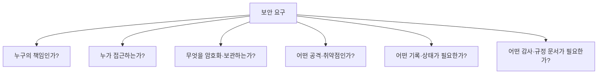

## 1. AWS Shared Responsibility Model

```text
AWS      = Security OF the Cloud
Customer = Security IN the Cloud
```

| AWS의 책임 | 고객의 책임 |
|---|---|
| 데이터센터와 물리 보안 | 고객 데이터와 분류 |
| 물리 서버·스토리지·네트워크 | IAM 사용자·역할·정책 |
| 전력·냉각 | 애플리케이션 보안 |
| 가상화 계층 | 암호화 선택과 키 접근 권한 |
| 관리형 서비스의 기반 인프라 | Security Group·NACL 등 구성 |

### 서비스에 따라 경계가 이동한다

| 계층 | EC2 | RDS | Lambda |
|---|---|---|---|
| 물리 시설·하드웨어 | AWS | AWS | AWS |
| Guest OS 패치 | 고객 | AWS | AWS |
| DB 엔진 운영 | 고객이 DB를 설치했다면 고객 | AWS가 관리 기능 제공 | 해당 없음 |
| 애플리케이션 코드 | 고객 | 고객 | 고객 |
| 데이터·IAM·접근 설정 | 고객 | 고객 | 고객 |

**핵심:** 관리형 서비스일수록 AWS의 운영 범위가 커지지만, **고객의 데이터·권한·안전한 사용 책임은 남는다.**

### Shared controls

Patch management, configuration management, 보안 인식 교육 같은 통제는 양쪽이 각각 담당 범위를 수행한다. 예를 들어 AWS는 관리하는 인프라를 패치하고, 고객은 EC2 Guest OS를 패치한다.

## 2. 계정 보호의 출발점

### Root user

AWS 계정을 만들 때 생기는 최고 권한 사용자다.

- Root user에 MFA를 활성화한다.
- 일상 작업에 사용하지 않는다.
- Root access key를 만들지 않거나, 이미 있다면 제거한다.
- Root만 가능한 계정 수준 작업에만 사용한다.

Root가 필요한 대표 상황은 standalone 계정의 root email/password/access key 변경, 계정 종료, 관리자 권한을 모두 잃었을 때 IAM 권한 복구 등이다. AWS Organizations의 중앙 root access를 쓰면 management account나 delegated administrator가 일부 member account 작업을 대신할 수 있으므로 “언제나 root 로그인만 가능”이라고 단정하지 않는다.

### Least privilege

필요한 작업에 필요한 최소 권한만 부여한다.

```text
나쁜 선택: 모든 개발자에게 AdministratorAccess
좋은 선택: 필요한 bucket의 s3:GetObject만 허용
```

### Authentication vs Authorization

| 개념 | 질문 | 예 |
|---|---|---|
| Authentication | “누구인가?” | password, access key, MFA, federation |
| Authorization | “무엇을 할 수 있는가?” | IAM policy |

## 3. AWS Identity and Access Management(IAM) — AWS 리소스 접근 제어

IAM은 AWS 리소스에 접근하는 **identity와 permission**을 관리하는 글로벌 서비스다.

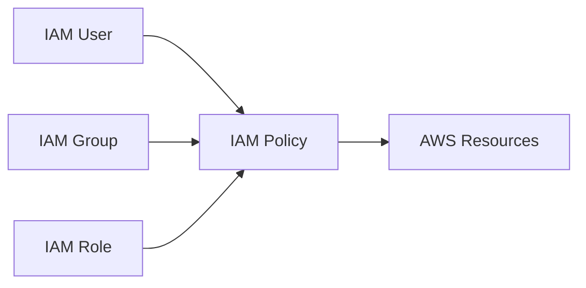

| 구성 요소 | 뜻 | 시험 단서 |
|---|---|---|
| User | 장기 자격 증명을 가질 수 있는 IAM identity | 특정 사람의 콘솔·CLI 접근 |
| Group | 여러 IAM user에 공통 권한 부여 | 개발팀 사용자 묶음 |
| Role | 신뢰받는 주체가 assume하는 권한 | 임시 자격 증명, AWS 서비스, cross-account |
| Policy | 허용·거부할 작업과 리소스를 정의한 JSON 문서 | Effect, Action, Resource |

IAM group은 로그인 주체가 아니며 다른 group을 포함하지 않는다. 애플리케이션에 장기 access key를 저장하기보다 **IAM role과 임시 자격 증명**을 사용한다.

### Policy 판단의 기초

- 기본은 implicit deny다.
- 명시적 Allow가 있어야 허용된다.
- 적용되는 정책의 explicit deny는 allow보다 우선한다.

JSON 문법을 작성하는 시험은 아니지만 다음 의미는 알아야 한다.

```json
{
  "Effect": "Allow",
  "Action": "s3:GetObject",
  "Resource": "arn:aws:s3:::example/*"
}
```

### IAM Role과 AWS STS

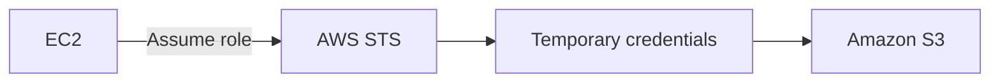

- **IAM Role**: 어떤 권한을 위임할지 정의
- **AWS STS**: 제한된 수명의 임시 자격 증명을 발급

**시험 예제:** EC2가 S3 객체를 읽어야 한다. → 코드에 access key 저장이 아니라 **EC2에 IAM role 연결**

### IAM access report

- **IAM credential report**: 계정의 IAM user와 password, access key, MFA 같은 자격 증명 상태를 CSV로 감사
- **IAM Access Analyzer**: 외부·공개 접근과 권한 사용을 분석해 least privilege 개선 지원

## 4. Workforce와 Application 사용자 인증

| 요구 | 정답 |
|---|---|
| 직원이 여러 AWS 계정과 업무 앱에 SSO | AWS IAM Identity Center |
| 기존 기업 identity provider로 AWS 접근 | Federation(SAML/OIDC 등) |
| 웹·모바일 앱 고객의 회원가입·로그인 | Amazon Cognito |
| Microsoft Active Directory 워크로드 | AWS Directory Service |

```text
IAM / Identity Center = AWS를 사용하는 직원·관리자
Cognito               = 고객이 만든 앱의 최종 사용자
```

MFA는 password 외의 추가 인증 요소를 요구한다. 원본 IAM 장표의 SMS·email 예시는 IAM MFA의 일반 암기 항목으로 사용하지 않는다. 시험에서는 **Root와 중요 identity에 MFA 적용**을 기억한다.

## 5. Data Protection

### Encryption at rest vs in transit

| 구분 | 보호 대상 | 대표 방식 |
|---|---|---|
| At rest | 저장 중인 S3·EBS·RDS 데이터 | 서비스 암호화 + KMS key |
| In transit | 네트워크로 이동하는 데이터 | TLS/HTTPS |

### KMS / CloudHSM / Secrets Manager / ACM

| 서비스 | 관리 대상 | 선택 단서 |
|---|---|---|
| AWS Key Management Service(AWS KMS) | 암호화 key 생성·사용·접근 제어 | S3/EBS/RDS 암호화 key |
| AWS CloudHSM | 고객 전용 HSM 장비 | 전용 hardware와 세밀한 HSM 통제 |
| AWS Secrets Manager | DB password, API key, token | secret 저장·조회·rotation |
| Systems Manager Parameter Store | 설정값과 secret parameter | 계층형 configuration 관리 |
| AWS Certificate Manager(ACM) | SSL/TLS certificate | HTTPS 인증서 프로비저닝·관리 |

```text
암호화 key        → KMS
전용 HSM          → CloudHSM
DB password/token → Secrets Manager
TLS certificate   → ACM
```

## 6. 공격 차단과 중앙 정책

### AWS WAF vs AWS Shield

| AWS WAF | AWS Shield |
|---|---|
| HTTP(S) 요청을 규칙으로 검사 | DDoS 보호 |
| SQL injection, XSS, bot, IP 조건 | 대량 트래픽 공격 완화 |
| Web ACL | Standard / Advanced |

### AWS Firewall Manager

AWS Organizations의 여러 계정·리소스에 WAF, Shield Advanced, Security Group 등 보안 정책을 중앙 적용·관리한다.

```text
웹 요청 패턴 차단 → WAF
DDoS              → Shield
여러 계정 방화벽 정책 중앙 관리 → Firewall Manager
```

## 7. 탐지·취약점·민감 데이터·조사

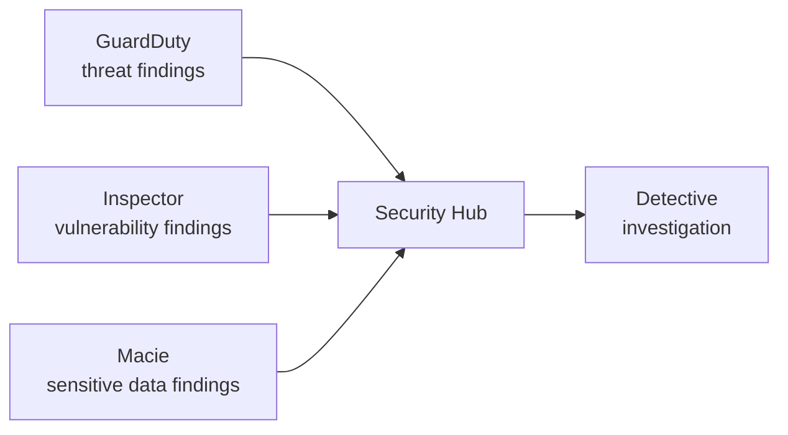

| 서비스 | 답하는 질문 | 대표 단서 |
|---|---|---|
| Amazon GuardDuty | 공격·계정 탈취 징후가 있는가? | 악성 IP, 이상 API 활동, threat detection |
| Amazon Inspector | 워크로드에 알려진 취약점이 있는가? | EC2, ECR 이미지, Lambda, CVE |
| Amazon Macie | S3에 민감 데이터가 있는가? | PII, 신용카드 정보, 분류 |
| AWS Security Hub | 보안 결과를 한곳에서 보는가? | findings 집계·우선순위·보안 표준 |
| Amazon Detective | 탐지된 사건의 원인·관계를 조사하는가? | investigation, 관계 시각화 |

Security Hub가 모든 위협을 직접 탐지하는 것이 아니다. 여러 소스의 **finding을 통합**한다.

## 8. Monitoring, Logging, Audit

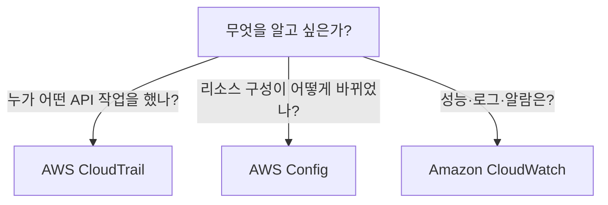

### AWS CloudTrail

AWS 계정의 사용자 활동과 API 작업을 기록해 감사·보안 조사에 사용한다.

- 누가, 언제, 어떤 API 작업을 했는가?
- 누가 EC2를 종료하거나 security group rule을 변경했는가?

“모든 이벤트가 아무 설정 없이 영구 보관된다”는 뜻은 아니다. 시험에서는 **API activity/audit** 역할을 구별한다.

### AWS Config

지원되는 AWS 리소스의 구성 상태와 변경 이력을 기록하고 Config rule로 준수 여부를 평가한다.

```text
규칙: S3 bucket은 암호화되어야 함
결과: COMPLIANT / NON_COMPLIANT
```

### Amazon CloudWatch

AWS 리소스와 애플리케이션을 관찰하는 서비스다.

- Metrics
- Logs
- Alarms
- Dashboards

EC2 기본 metric에는 CPU·network 등이 포함되지만 **Guest OS memory/disk 사용률은 CloudWatch agent 같은 추가 수집 설정이 필요**할 수 있다.

| 상황 | 서비스 |
|---|---|
| 누가 EC2를 삭제했는가? | CloudTrail |
| SG가 어떤 값으로 바뀌었는가? | AWS Config |
| S3 설정이 회사 규정을 준수하는가? | AWS Config |
| CPU가 임계값을 넘으면 알림 | CloudWatch Alarm |
| 애플리케이션 로그 검색 | CloudWatch Logs |

### VPC Flow Logs

VPC, subnet 또는 network interface의 IP traffic metadata를 기록한다. API 작업은 CloudTrail, 네트워크 흐름은 VPC Flow Logs다.

## 9. Compliance와 감사 자료

Cloud 규정 준수도 공동 책임이다. AWS가 인증을 보유해도 고객 애플리케이션이 자동으로 규정을 준수하는 것은 아니다.

| 표준·규정 | 관련 분야 |
|---|---|
| SOC | 서비스 조직 통제 감사 보고 |
| ISO 27001 | 정보보호 관리체계 |
| PCI DSS | 결제 카드 데이터 |
| HIPAA | 미국 의료정보 |

### AWS Artifact vs AWS Audit Manager

| AWS Artifact | AWS Audit Manager |
|---|---|
| AWS의 규정 준수 report·agreement 확인 | 고객 AWS 환경의 audit evidence 수집 자동화 |
| SOC·ISO 보고서가 필요 | 자체 감사를 준비·평가 |

### AWS Marketplace

AWS 자체 서비스가 아닌 제3자 보안 제품도 AWS Marketplace에서 찾고 구매할 수 있다.

## 10. Governance와 Multi-Account 보안

| 서비스 | 역할 |
|---|---|
| AWS Organizations | 여러 AWS 계정을 조직·OU로 중앙 관리 |
| Service Control Policy(SCP) | 조직 내 계정의 최대 사용 가능 권한을 제한; 직접 권한 부여는 아님 |
| AWS Control Tower | 모범 사례 기반 multi-account landing zone과 guardrail 구성 |
| AWS Resource Access Manager(RAM) | 지원되는 리소스를 계정 간 공유 |
| AWS Service Catalog | 조직이 승인한 제품·환경만 사용자가 배포하게 제공 |

**SCP 주의:** `Allow` SCP가 있다고 IAM user가 곧바로 권한을 얻는 것은 아니다. IAM policy 등에서 실제 권한도 허용되어야 한다.

## 11. 문제 풀이 예제

**상황:** “EC2에 설치된 패키지의 CVE를 찾는다.”  
**정답:** Amazon Inspector  
**오답 제거:** GuardDuty는 활동 기반 threat detection, Macie는 S3 민감 데이터다.

**상황:** “누가 bucket policy를 변경했는지 조사한다.”  
**정답:** AWS CloudTrail  
**연결:** 변경 후 구성 상태와 이력은 AWS Config가 보완한다.

**상황:** “회사 직원에게 여러 계정 SSO를 제공한다.”  
**정답:** IAM Identity Center  
**오답 제거:** Cognito는 앱 고객의 로그인이다.

**상황:** “AWS의 SOC 보고서를 내려받는다.”  
**정답:** AWS Artifact  
**오답 제거:** Audit Manager는 고객 환경의 증거 수집을 돕는다.

## References

- [CLF-C02 Domain 2](https://docs.aws.amazon.com/aws-certification/latest/cloud-practitioner-02/cloud-practitioner-02-domain2.html)
- [CLF-C02 In-Scope AWS Services](https://docs.aws.amazon.com/aws-certification/latest/cloud-practitioner-02/clf-02-in-scope-services.html)
- [AWS Shared Responsibility Model](https://aws.amazon.com/compliance/shared-responsibility-model/)
- [AWS account root user](https://docs.aws.amazon.com/IAM/latest/UserGuide/id_root-user.html)
- [IAM credential reports](https://docs.aws.amazon.com/IAM/latest/UserGuide/id_credentials_getting-report.html)
- 원본: `day1/1.1.md`, `day2/2.4.md`, `day2/2.5.md` 및 참조 이미지

---

## 반드시 알아야 할 핵심 비교

| 비교 | A | B | C |
|---|---|---|---|
| Security of vs in the Cloud | AWS 기반 인프라 책임 | 고객 데이터·권한·구성 책임 | — |
| Authentication vs Authorization | 누구인지 확인 | 무엇을 할 수 있는지 결정 | — |
| User vs Role | 장기 identity 가능 | assume하여 임시 자격 증명 사용 | — |
| KMS vs Secrets Manager | 암호화 key | password·token 같은 secret | — |
| WAF vs Shield | Web 요청 공격 | DDoS | — |
| GuardDuty vs Inspector | 위협 활동 | 소프트웨어 취약점 | — |
| CloudTrail vs Config vs CloudWatch | API 활동 | 구성·준수 | metric·log·alarm |
| Artifact vs Audit Manager | AWS 규정 문서 | 고객 환경 감사 증거 | — |

## 시험에서 헷갈리는 서비스

| 요구 | 정답 | 헷갈리는 서비스 |
|---|---|---|
| 직원의 multi-account SSO | IAM Identity Center | Cognito는 앱 사용자 |
| S3 개인정보 발견 | Macie | Inspector는 CVE |
| findings 통합 | Security Hub | GuardDuty는 위협 탐지 |
| 보안 사건 관계 조사 | Detective | CloudTrail은 API 기록 원천 |
| 전용 HSM | CloudHSM | KMS는 관리형 key 서비스 |
| 여러 계정 방화벽 정책 | Firewall Manager | WAF는 개별 Web ACL 역할 |
| 네트워크 흐름 기록 | VPC Flow Logs | CloudTrail은 API 활동 |

## 최종 암기표

| 키워드 | 한 줄 암기 |
|---|---|
| Root | MFA, 일상 사용 금지 |
| Least privilege | 필요한 최소 권한 |
| IAM Policy | permission 정의 |
| IAM Role + STS | 위임 권한 + 임시 자격 증명 |
| Identity Center | workforce SSO |
| Cognito | app user 로그인 |
| KMS | encryption key |
| Secrets Manager | password·API key·rotation |
| WAF / Shield | Web 공격 / DDoS |
| GuardDuty / Inspector / Macie | 위협 / 취약점 / S3 민감 데이터 |
| Security Hub / Detective | 결과 통합 / 사건 조사 |
| CloudTrail / Config / CloudWatch | 활동 / 구성 / 관찰 |
| Artifact / Audit Manager | AWS 문서 / 내 감사 증거 |


# 03. Compute → Container → Storage → Database

> **시험 비중:** Domain 3 전체 34% 중 핵심 서비스 영역  
> **풀이 원칙:** 구현 방법이 아니라 workload의 형태와 관리 책임을 보고 서비스를 고른다.

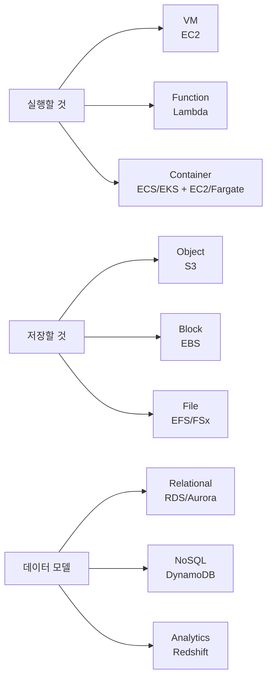

## 1. Compute 선택 지도

| 요구 | 먼저 떠올릴 서비스 |
|---|---|
| OS를 직접 제어하는 범용 VM | Amazon EC2 |
| 이벤트가 있을 때 코드 실행 | AWS Lambda |
| Docker container 관리 | Amazon ECS |
| Kubernetes | Amazon EKS |
| 서버 노드 없이 container 실행 | AWS Fargate |
| 소규모 웹사이트·WordPress를 단순하게 | Amazon Lightsail |
| 코드 배포 중심의 관리형 앱 플랫폼 | AWS Elastic Beanstalk |
| 대량 batch job | AWS Batch |
| 고객 데이터센터에 AWS 인프라 배치 | AWS Outposts |

## 2. Amazon EC2 — 제어권이 큰 가상 서버

EC2(Elastic Compute Cloud)는 AWS에서 VM을 실행하는 서비스다.

고객이 선택·관리하는 대표 항목:

- instance type(vCPU, memory, network 등)
- AMI와 Guest OS
- block storage
- VPC, subnet, security group
- 애플리케이션과 데이터

**문제 단서:** “특정 OS 설치”, “관리자 권한 필요”, “오래 실행되는 범용 서버” → EC2

### EC2 instance family의 목적

시험에서는 구체적 이름보다 workload와 최적화 방향을 연결한다.

| 유형 | 최적화 대상 | 예 |
|---|---|---|
| General purpose | compute·memory·network 균형 | 웹 서버, 일반 앱 |
| Compute optimized | CPU 집약 | batch processing, 게임 서버 |
| Memory optimized | 큰 memory | in-memory 분석, 큰 DB |
| Storage optimized | 높은 local I/O | 대규모 데이터 처리 |
| Accelerated computing | GPU·전용 가속기 | ML 학습, 그래픽 |

### AMI

Amazon Machine Image는 EC2를 시작하는 template이다. OS, 소프트웨어, 설정과 block device mapping 정보를 포함할 수 있다.

```text
표준 EC2 구성 → AMI 생성 → 같은 구성의 EC2 반복 시작
```

AMI는 실행 중인 VM이 아니라 **VM을 만들기 위한 이미지**다.

## 3. EC2 storage — EBS vs Instance Store

| Amazon Elastic Block Store(Amazon EBS) | Instance Store |
|---|---|
| network-attached block storage | EC2 host에 물리적으로 연결된 local block storage |
| EC2와 분리된 수명 주기 가능 | instance 수명과 밀접한 임시 저장소 |
| snapshot으로 S3에 백업 가능 | 영구 보관용이 아님 |
| OS disk, DB volume | cache, buffer, scratch data |

> “EC2를 중지·종료한 뒤에도 보존해야 하는 disk” → EBS  
> “손실되어도 되는 매우 빠른 임시 local data” → Instance Store

EBS volume과 EC2의 연결 가능 범위·유형은 세부 제약이 있으므로 CCP에서는 **persistent block vs ephemeral local**을 우선 기억한다.

## 4. Elasticity와 Availability

### EC2 Auto Scaling

수요 또는 정책에 따라 instance 수를 늘리고 줄이며, 원하는 수의 healthy instance를 유지한다.

```text
수요 증가 → scale out
수요 감소 → scale in
비정상 instance → 교체
```

### Elastic Load Balancing(ELB)

여러 target으로 트래픽을 분산하고 health check 결과에 따라 healthy target으로 보낸다.

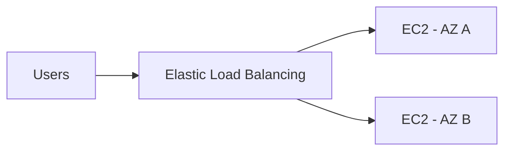

| 유형 | 대표 traffic | CCP 수준의 구별 |
|---|---|---|
| ALB | HTTP/HTTPS | Web application, path/host 기반 routing |
| NLB | TCP/UDP/TLS | 매우 높은 성능, network 연결 |
| GWLB | IP traffic | 가상 network appliance 배치 |

**ELB는 분산**, **Auto Scaling은 수량 조절**이다. 둘을 함께 사용하지만 같은 기능은 아니다.

## 5. Serverless compute

Serverless는 서버가 실제로 없다는 뜻이 아니다. 고객이 서버를 프로비저닝·패치·용량 관리하지 않고 **코드나 container workload에 집중**한다는 뜻이다.

### AWS Lambda

- function 단위 코드 실행
- event-driven
- 자동 확장
- 요청 수와 실행 시간·구성 자원 등을 기준으로 과금
- 짧은 API 처리, 파일 변환, 자동화에 적합

```text
S3 object upload → Lambda → thumbnail 생성
```

### AWS Fargate

- ECS 또는 EKS에서 사용할 수 있는 serverless container compute
- EC2 worker node를 직접 프로비저닝·패치하지 않음
- container image와 task/pod 자원 요구를 정의

Fargate를 “Lambda의 container 버전”이라고 외우면 안 된다. Lambda는 **function 실행 모델**, Fargate는 **container 실행 용량**이다.

### EC2 vs Lambda vs Fargate

| EC2 | Lambda | Fargate |
|---|---|---|
| VM | function | container compute |
| OS 제어·관리 | 서버 관리 없음 | 노드 관리 없음 |
| 장기 실행·특수 OS | event-driven code | containerized app |
| 가장 큰 제어권 | 가장 작은 실행 단위 | container 이식성 |

## 6. Container 핵심

### VM vs Container

| VM | Container |
|---|---|
| 각 VM이 Guest OS 포함 | 보통 host OS kernel 공유 |
| 무겁고 부팅이 상대적으로 느림 | 가볍고 시작이 빠름 |
| 서로 다른 OS 전체 격리 | app와 dependency를 패키징 |

- **Image**: container를 만들기 위한 읽기 전용 template
- **Container**: image를 실행한 instance
- **Registry**: image 저장소
- **Docker**: image 생성·container 실행에 널리 쓰이는 플랫폼

원본의 Xen 그림(`day3/image-1.png`)은 hypervisor 내부 구조 예시지만 CLF-C02에서는 이 정도 상세 구현을 암기할 필요가 없다.

### ECR / ECS / EKS / Fargate

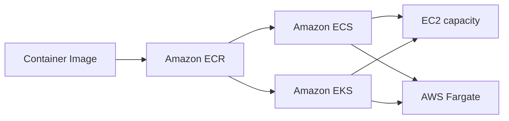

| 서비스 | 역할 | 단서 |
|---|---|---|
| Amazon ECR | container image registry | image 저장·배포 |
| Amazon ECS | AWS-native container orchestration | task, service, cluster |
| Amazon EKS | managed Kubernetes | pod, Kubernetes |
| AWS Fargate | serverless container compute | EC2 node 관리 없음 |

```text
ECS/EKS = container를 오케스트레이션하는 방법
Fargate = 그 container를 서버 관리 없이 실행하는 용량
```

## 7. 기타 compute 서비스

| 서비스 | 한 줄 설명 | 대표 상황 |
|---|---|---|
| Lightsail | VM·SSD·network 등을 단순한 bundle로 제공 | 개인 사이트, WordPress |
| Elastic Beanstalk | 코드를 배포하면 EC2·Auto Scaling·ELB 환경 구성을 지원 | 전통 Web app의 빠른 배포 |
| AWS Batch | 필요한 compute를 준비해 batch job 실행을 관리 | 대규모 계산·렌더링 |
| AWS Outposts | AWS 인프라·서비스 일부를 고객 시설에 설치 | on-premises 저지연·local processing |

## 8. Storage 선택 지도

| 저장 방식 | 서비스 | 데이터 접근 방식 |
|---|---|---|
| Object | Amazon S3 | bucket/key, API |
| Block | Amazon EBS | EC2의 disk volume |
| Local block | Instance Store | host-local 임시 disk |
| File | Amazon EFS | shared NFS |
| Specialized file | Amazon FSx | Windows, Lustre, ONTAP, OpenZFS |
| Hybrid storage | AWS Storage Gateway | on-premises와 AWS storage 연결 |

## 9. Amazon S3 — object storage

S3는 object를 bucket에 저장하는 고확장성 object storage다.

```text
Bucket
 ├── images/cat.jpg  ← key
 └── logs/app.log    ← object
```

핵심 특성:

- 사실상 매우 큰 확장성
- 여러 AZ에 걸쳐 설계된 높은 내구성(일반 class 기준)
- versioning, encryption, lifecycle
- 정적 파일, backup, log, data lake

“무제한 저장”이라는 표현은 **사실상 확장 가능한 서비스**라는 의미로 이해한다. 개별 object 크기 등 서비스 제한은 존재한다.

### S3 storage classes와 Amazon S3 Glacier

| class | 접근 패턴 | 핵심 trade-off |
|---|---|---|
| S3 Standard | 자주 접근 | 기본 범용, 여러 AZ |
| S3 Intelligent-Tiering | 패턴 예측 어려움 | 접근에 따라 tier 자동 이동, monitoring 비용 고려 |
| S3 Standard-IA | 드물지만 즉시 필요 | 낮은 저장 비용, retrieval 비용·최소 기간 |
| S3 One Zone-IA | 재생성 가능한 비중요 IA | 한 AZ, 더 저렴 |
| Glacier Instant Retrieval | 거의 안 쓰지만 즉시 필요 | archive + millisecond access |
| Glacier Flexible Retrieval | archive | retrieval에 분~시간 |
| Glacier Deep Archive | 장기 보존 | 가장 느린 시간 단위 retrieval |
| S3 Express One Zone | 매우 높은 성능·낮은 latency | 한 AZ의 고성능 object class |

### Lifecycle policy

시간이 지나며 덜 쓰는 데이터를 자동으로 저렴한 class로 이동하거나 만료한다.

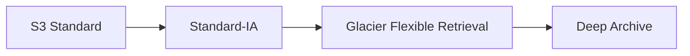

정확한 일수는 업무 요구와 각 class의 최소 보관 조건에 따라 정한다. 원본의 `30일 → 90일 → 365일`은 가능한 예시이지 고정 규칙이 아니다.

## 10. File·hybrid·backup storage

### Amazon Elastic File System(Amazon EFS) vs Amazon FSx

| Amazon EFS | Amazon FSx |
|---|---|
| managed NFS file system | 특정 file system의 managed service |
| Linux workload의 공유 file | Windows SMB, Lustre HPC, NetApp ONTAP, OpenZFS |
| 여러 compute에서 동시 mount | workload별 특화 기능 |

### AWS Storage Gateway

On-Premises 애플리케이션이 표준 storage protocol을 사용하면서 AWS storage와 연결하도록 돕는 hybrid storage 서비스다.

### AWS Backup

여러 AWS 서비스의 backup plan, 정책, 보존을 중앙 관리한다.

### AWS Elastic Disaster Recovery

서버를 AWS에 지속 복제해 재해 시 복구하는 서비스다. **AWS Backup은 backup 중앙 관리**, **Elastic Disaster Recovery는 서버 수준 DR**에 초점이 있다.

## 11. Database 선택 지도

먼저 데이터 모델과 사용 목적을 묻는다.

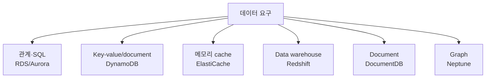

### DB on EC2 vs managed database

| DB on EC2 | Managed DB |
|---|---|
| OS·DB 설치와 patch를 직접 제어 | provisioning·backup·patch 기능을 AWS가 더 많이 관리 |
| 특수 설정·엔진 제어에 유리 | 운영 부담 감소 |
| 고객 책임 범위가 큼 | 데이터·계정·접근 설정은 여전히 고객 책임 |

## 12. Amazon RDS와 Aurora

### Amazon RDS

MySQL, PostgreSQL, MariaDB, Oracle, SQL Server, Db2 같은 관계형 엔진을 관리형으로 운영한다.

- SQL, table, relation
- 자동 backup 기능
- Multi-AZ와 read replica 옵션
- OS와 DB 인프라 관리 부담 감소

### Amazon Aurora

AWS가 설계한 MySQL/PostgreSQL-compatible managed relational database다. RDS 관리 인터페이스와 통합되지만 시험에서는 일반 RDS 엔진과 구별해 **AWS-native 고성능·고가용성 관계형 DB**로 기억한다.

### Multi-AZ vs Read Replica

| Multi-AZ | Read Replica |
|---|---|
| 고가용성·failover | read scaling |
| 장애 시 standby로 전환 | 읽기 요청 분산 |
| 주목적은 가용성 | 주목적은 성능 확장 |

**시험 예제:** “DB 장애 시 자동 failover” → Multi-AZ  
“읽기 요청이 너무 많다” → Read Replica

## 13. DynamoDB, ElastiCache, Redshift

### Amazon DynamoDB

완전관리형 serverless NoSQL key-value/document database다.

- 매우 큰 scale과 낮은 latency
- 자동 확장 옵션
- game, mobile, shopping cart, session metadata

SQL join과 복잡한 관계가 핵심이면 RDS/Aurora를 먼저 생각한다.

### Amazon ElastiCache

Valkey, Memcached, Redis OSS 계열의 managed in-memory cache다.

```text
App → cache hit → 빠른 응답
   ↘ cache miss → DB 조회 → cache 저장
```

DB 앞에서 반복 조회를 줄이고 응답 속도를 높인다. 영구 원본 DB와 같은 역할로 단정하지 않는다.

### Amazon Redshift

대규모 데이터를 **저장하고 분석**하는 data warehouse다.

- columnar storage
- SQL analytics
- OLAP, BI, 과거 매출 분석

원본의 “데이터를 저장하는 목적이 아니다”는 부정확하다. 운영 transaction DB가 아니라 **분석용 저장·처리**가 목적이다.

### OLTP vs OLAP

| OLTP | OLAP |
|---|---|
| 주문·결제·회원가입 같은 실시간 거래 | 과거 대량 데이터 분석 |
| 짧은 읽기·쓰기 transaction | 복잡한 집계 query |
| RDS, Aurora | Redshift |

## 14. 목적별 database

| 서비스 | 데이터 모델·역할 | 시험 단서 |
|---|---|---|
| Amazon DocumentDB | MongoDB-compatible document DB | JSON document, MongoDB workload |
| Amazon Neptune | graph DB | node·edge·relationship, 추천·사기 관계 |

원본 데이터베이스 이미지에는 Keyspaces, Timestream, QLDB, MemoryDB도 나오지만 현재 CLF-C02의 명시적 in-scope 목록에는 없다. 이미지 내용은 확인했으나 시험 직전 핵심 표에는 확대하지 않는다.

## 15. Database migration — DMS vs SCT

| AWS DMS | AWS SCT |
|---|---|
| 데이터 이동·지속 복제 | 서로 다른 DB 엔진 간 schema·일부 code 변환 지원 |
| homogeneous와 heterogeneous migration | heterogeneous migration에서 주로 사용 |
| downtime 최소화에 활용 | 실제 데이터 이동 서비스가 아님 |

```text
Oracle → PostgreSQL
schema 변환: SCT
data 이동:    DMS
```

## 16. 문제 풀이 예제

**상황:** “Kubernetes는 필요하지만 worker node를 관리하지 않는다.”  
**정답:** Amazon EKS + AWS Fargate

**상황:** “여러 Linux EC2가 같은 파일 경로를 mount한다.”  
**정답:** Amazon EFS

**상황:** “접근 패턴을 예측할 수 없는 S3 데이터의 비용을 자동 최적화한다.”  
**정답:** S3 Intelligent-Tiering

**상황:** “주문 DB 장애 시 자동으로 standby로 failover한다.”  
**정답:** Amazon RDS Multi-AZ

**상황:** “10년치 판매 데이터를 SQL로 집계한다.”  
**정답:** Amazon Redshift

## References

- [CLF-C02 Domain 3](https://docs.aws.amazon.com/aws-certification/latest/cloud-practitioner-02/cloud-practitioner-02-domain3.html)
- [CLF-C02 In-Scope AWS Services](https://docs.aws.amazon.com/aws-certification/latest/cloud-practitioner-02/clf-02-in-scope-services.html)
- 원본: `day2/3.1.md`~`day2/3.3.md`, `day3/3.5.md`, `day3/3.6.md` 및 참조 이미지

---

## 반드시 알아야 할 핵심 비교

| 비교 | A | B | C |
|---|---|---|---|
| EC2 vs Lambda vs Fargate | VM | function | serverless container compute |
| ECS vs EKS | AWS-native orchestration | managed Kubernetes | — |
| ELB vs Auto Scaling | traffic 분산 | instance 수 조절 | — |
| EBS vs Instance Store | persistent network block | ephemeral local block | — |
| S3 vs EBS vs EFS | object | block | shared file |
| EFS vs FSx | 범용 managed NFS | 특화 file system | — |
| RDS/Aurora vs DynamoDB | relational SQL | NoSQL key-value/document | — |
| Multi-AZ vs Read Replica | availability/failover | read scaling | — |
| RDS vs Redshift | OLTP | OLAP/data warehouse | — |
| DMS vs SCT | data 이동 | schema 변환 | — |

## 시험에서 헷갈리는 서비스

| 요구 | 정답 | 헷갈리는 서비스 |
|---|---|---|
| container image 저장 | ECR | ECS는 실행 관리 |
| 서버 없이 container 실행 | Fargate | Lambda는 function |
| 단순한 VPS bundle | Lightsail | EC2는 더 세밀한 제어 |
| Windows file share | FSx for Windows | EFS는 NFS |
| 중앙 backup 정책 | AWS Backup | Elastic Disaster Recovery는 server DR |
| in-memory cache | ElastiCache | DynamoDB는 NoSQL DB |
| MongoDB 호환 | DocumentDB | DynamoDB는 AWS-native NoSQL |
| 관계 분석 | Neptune | Redshift는 warehouse |

## 최종 암기표

| 키워드 | 한 줄 암기 |
|---|---|
| EC2 / AMI | VM / VM template |
| Auto Scaling / ELB | 수량 / 분산 |
| Lambda | event-driven function |
| ECR / ECS / EKS / Fargate | image / AWS container / Kubernetes / serverless capacity |
| S3 / EBS / EFS | object / block / file |
| Instance Store | 임시 local block |
| Glacier | archive class |
| Lifecycle | class 이동·만료 자동화 |
| RDS / Aurora | managed relational / AWS-native compatible relational |
| DynamoDB | serverless NoSQL |
| ElastiCache | in-memory cache |
| Redshift | OLAP data warehouse |
| DocumentDB / Neptune | document / graph |
| DMS / SCT | data / schema |


# 04. Networking → Connectivity → Integration → Other Services

> **Domain 3 핵심:** 서비스의 세부 설정이 아니라 **무슨 문제를 해결하는지** 구별한다.

## 1. VPC 전체 그림

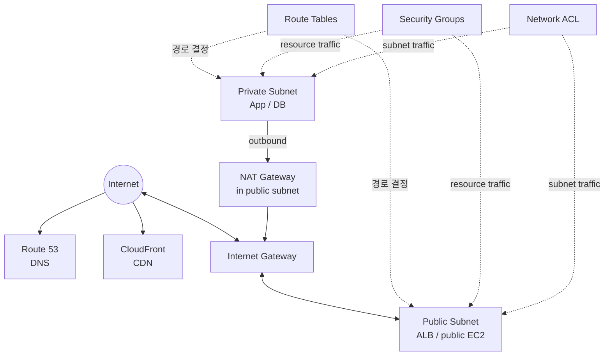

이 그림은 역할 관계를 보여 줄 뿐 모든 요청이 Route 53 → CloudFront → IGW 순서로 지나야 한다는 뜻은 아니다.

## 2. Amazon VPC와 Subnet

### Amazon VPC

AWS 계정에 만드는 논리적으로 격리된 가상 네트워크다.

- CIDR IP 범위
- subnet
- route table
- gateway
- security group과 network ACL

### Subnet

VPC의 IP 범위를 나눈 network segment이며 **하나의 Availability Zone에 속한다.**

| Public subnet | Private subnet |
|---|---|
| route table에 Internet Gateway 경로가 있음 | Internet Gateway로 직접 향하는 경로가 없음 |
| public address 등 조건을 갖춘 resource가 인터넷 통신 가능 | 필요하면 NAT Gateway를 통해 outbound 인터넷 사용 |
| internet-facing ALB, NAT Gateway | app server, DB, cache |

Public subnet에 있다는 사실만으로 resource가 자동으로 인터넷에 노출되지는 않는다. **route, public IP/address, security rule** 등 조건이 함께 필요하다.

## 3. Route Table, IGW, NAT Gateway

### Route Table

목적지 traffic을 어느 target으로 보낼지 결정한다.

```text
Public subnet:  0.0.0.0/0 → Internet Gateway
Private subnet: 0.0.0.0/0 → NAT Gateway
```

### Internet Gateway(IGW)

VPC와 인터넷 간 통신을 지원하는 gateway다. Public IPv4/IPv6 주소와 route·보안 설정 같은 조건도 필요하다.

### NAT Gateway

Private subnet의 resource가 인터넷으로 outbound 연결을 시작하도록 한다.

```text
Private EC2 → NAT Gateway(public subnet) → IGW → Internet
```

Internet 사용자가 NAT Gateway를 통해 private EC2에 임의의 연결을 시작하게 만드는 용도가 아니다.

## 4. Security Group vs Network ACL

| Security Group | Network ACL |
|---|---|
| resource/network interface 수준 | subnet 수준 |
| stateful | stateless |
| allow rule | allow와 deny rule |
| 허용된 요청의 응답 traffic 자동 허용 | inbound·outbound를 각각 평가 |

```text
SG   = resource 앞의 stateful firewall
NACL = subnet 경계의 stateless firewall
```

기본 Security Group·기본 NACL의 상세 기본값을 섞지 말고, 시험에서는 적용 범위와 stateful/stateless를 먼저 구별한다.

## 5. VPC의 private 연결과 기록

### VPC Endpoint와 AWS PrivateLink

Public IP나 Internet Gateway 없이 지원되는 서비스에 private하게 접근한다.

- **Gateway endpoint**: Amazon S3, DynamoDB에 사용하는 대표 endpoint 유형
- **Interface endpoint**: AWS PrivateLink 기반으로 ENI를 통해 service에 private 접근
- **AWS PrivateLink**: service provider와 consumer를 private하게 연결; 전체 network를 서로 routing하는 기능과는 다름

### VPC Peering vs Transit Gateway

| VPC Peering | AWS Transit Gateway |
|---|---|
| 두 VPC 간 직접 private 연결 | 여러 VPC·on-premises 연결을 중앙 hub로 관리 |
| transitive routing이 아님 | hub-and-spoke 확장에 적합 |
| 소수의 직접 연결 | 많은 network 연결 중앙화 |

### VPC Flow Logs

VPC, subnet, network interface의 IP traffic metadata를 기록한다.

```text
API 작업 감사     → CloudTrail
network flow 기록 → VPC Flow Logs
```

## 6. Hybrid connectivity — VPN vs Direct Connect

| AWS Site-to-Site VPN | AWS Direct Connect |
|---|---|
| 인터넷 위의 암호화 tunnel | 고객 network와 AWS 간 전용 network 연결 |
| 비교적 빠르게 구축 | 회선 provisioning 시간 필요 |
| 인터넷 품질에 영향 | 더 일관된 network 경험·대역폭 |
| 암호화 연결이 핵심 | 전용 연결 자체가 자동 암호화를 뜻하지는 않음 |

Direct Connect와 VPN을 함께 사용해 private 연결과 암호화를 결합할 수도 있다.

### Site-to-Site VPN vs Client VPN

| AWS Site-to-Site VPN | AWS Client VPN |
|---|---|
| 회사 network와 VPC를 연결 | 개별 사용자의 device와 AWS/on-premises network를 연결 |
| network-to-network | user-to-network, managed remote access |

## 7. Amazon Route 53

도메인 등록, authoritative DNS, health check, traffic routing을 제공한다.

| Routing policy | 선택 기준 |
|---|---|
| Simple | 단순한 단일 응답 |
| Weighted | 90%/10%처럼 비율 분산 |
| Latency-based | AWS가 측정한 더 낮은 latency의 Region으로 |
| Geolocation | 사용자 위치에 따른 정책 |
| Failover | primary health check 실패 시 secondary |

Latency routing은 단순히 지도상 가장 가까운 Region을 고르는 것과 다르다.

## 8. CloudFront vs Global Accelerator

### Amazon CloudFront

Edge Location을 이용하는 CDN이다. origin의 cacheable content와 web delivery를 사용자 가까이에서 제공해 latency와 origin 부하를 줄인다.

```text
User → Edge
       ├─ cache hit  → 바로 응답
       └─ cache miss → origin(S3/ALB 등) → cache → 응답
```

정적 파일만 전달한다고 한정하지 않는다. 동적 content delivery와 보안 연계도 지원한다.

### AWS Global Accelerator

정적 anycast IP와 AWS global network를 이용해 regional endpoint로 TCP/UDP traffic을 전달하고 application availability와 성능을 개선한다.

| CloudFront | Global Accelerator |
|---|---|
| CDN, edge caching | network acceleration |
| HTTP(S) content delivery 중심 | TCP/UDP application 포함 |
| cache가 핵심 | anycast IP와 endpoint health가 핵심 |

## 9. API Gateway와 application integration

### Amazon API Gateway

API의 managed front door다.

- REST/HTTP/WebSocket API
- 인증·권한 연동
- throttling
- request/response 처리와 routing
- Lambda, HTTP service 등 backend 연결

```text
Web/Mobile client → API Gateway → Lambda 또는 application backend
```

### EventBridge / SNS / SQS / Step Functions

이 네 서비스는 선형 파이프라인이 아니라 서로 다른 문제를 해결한다.

| 서비스 | 핵심 역할 | 문제의 동사 |
|---|---|---|
| Amazon EventBridge | event bus에서 규칙에 따라 target으로 routing | 사건을 분류·연결한다 |
| Amazon SNS | pub/sub로 한 message를 여러 subscriber에 push | 알림·fan-out한다 |
| Amazon SQS | queue에 message를 보관해 producer와 consumer 분리 | 쌓아 두고 처리한다 |
| AWS Step Functions | 여러 task를 state machine workflow로 orchestration | 순서·분기·retry를 제어한다 |

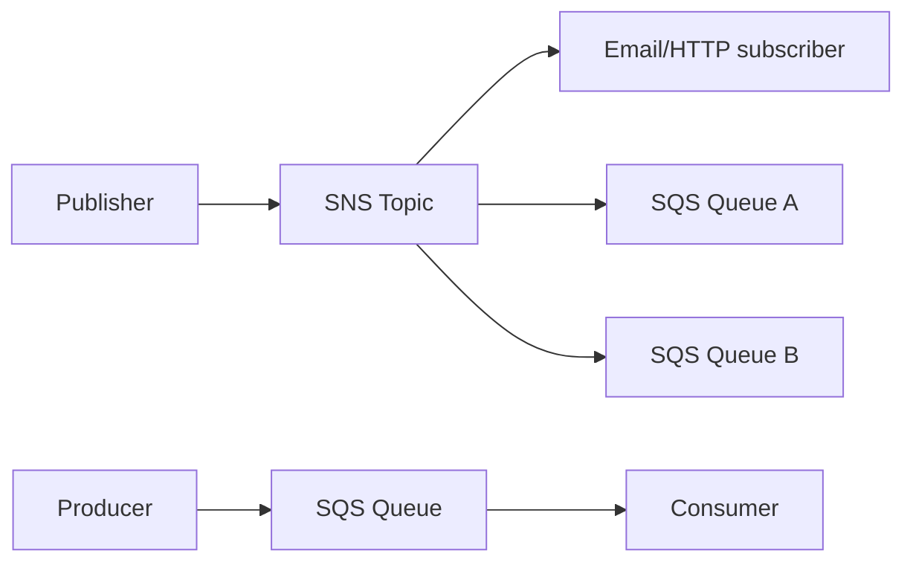

**SNS + SQS fan-out:** 하나의 event를 여러 queue에 복사해 각 consumer가 독립적으로 처리할 수 있다.

SQS의 **Standard queue**는 높은 처리량, **FIFO queue**는 순서와 중복 제거 요구를 우선할 때 선택한다.

### Amazon SES와 Amazon Connect

| 서비스 | 역할 |
|---|---|
| Amazon SES | 애플리케이션의 transactional·대량 email 발송 |
| Amazon Connect | cloud contact center/call center |

## 10. AWS에 접근하고 반복 배포하는 방법

| 방법 | 적합한 상황 |
|---|---|
| AWS Management Console | 사람이 일회성·시각적 작업 |
| AWS CLI | shell에서 명령·script 자동화 |
| AWS SDK | application code에서 AWS API 호출 |
| API | programmatic access의 기반 |
| AWS CloudFormation | template으로 인프라를 반복·일관되게 배포(IaC) |

**시험 예제:** “동일한 VPC와 EC2 환경을 여러 계정에 반복 배포” → CloudFormation

## 11. Developer·management 서비스

| 서비스 | 한 줄 역할 |
|---|---|
| AWS CodeBuild | source code build·test |
| AWS CodePipeline | source부터 build·deploy까지 pipeline orchestration |
| AWS X-Ray | distributed request trace와 성능 문제 분석 |
| AWS Systems Manager | node·운영 작업·automation 중앙 관리 |
| AWS Compute Optimizer | 사용률을 분석해 resource 구성 권고 |
| AWS License Manager | software license 사용·규칙·추적 중앙 관리 |
| Service Quotas | AWS service quota 확인·관리 |
| AWS Well-Architected Tool | Well-Architected review 수행·기록 |

원본 서비스 지도에는 CodeCommit, CodeDeploy도 있지만 현재 CLF-C02의 명시적 in-scope service 목록에는 없다. 시험 직전 핵심으로 확대하지 않는다.

## 12. AI/ML 서비스 — 이름과 작업 연결

깊은 ML 구현보다 “무슨 입력을 받아 무슨 일을 하는가”를 본다.

| 서비스 | 작업 | 기억 문장 |
|---|---|---|
| Amazon SageMaker AI | ML model build·train·deploy | ML 개발 platform |
| Amazon Lex | text/voice conversational interface | chatbot |
| Amazon Kendra | enterprise intelligent search | 사내 문서 검색 |
| Amazon Comprehend | text에서 sentiment·entity 등 추출 | NLP 분석 |
| Amazon Polly | text → speech | 글을 음성으로 |
| Amazon Rekognition | image/video 분석 | 시각 자료 인식 |
| Amazon Textract | document의 text·form·table 추출 | OCR + 문서 구조 |
| Amazon Transcribe | speech → text | 음성을 글로 |
| Amazon Translate | machine translation | 번역 |
| Amazon Q | generative AI assistant 계열 | 질의·업무 지원 |

```text
Text → Speech = Polly
Speech → Text = Transcribe
문서의 글·표 = Textract
사진·영상 분석 = Rekognition
텍스트 의미·감정 = Comprehend
```

## 13. Analytics 서비스 — 데이터 위치와 처리 방식

| 서비스 | 한 줄 역할 | 대표 단서 |
|---|---|---|
| Amazon Athena | S3 데이터를 serverless SQL query | S3 log를 바로 SQL |
| AWS Glue | serverless data integration, ETL, Data Catalog | 발견·변환·catalog |
| Amazon Kinesis | real-time streaming data | clickstream, IoT stream |
| Amazon QuickSight | BI dashboard·visualization | 경영 dashboard |
| Amazon EMR | Hadoop·Spark 등 big data framework | managed cluster |
| Amazon OpenSearch Service | search와 log analytics | 검색·log 분석 |
| Amazon Redshift | data warehouse·OLAP | 대규모 SQL 분석 |

| Athena | Redshift |
|---|---|
| S3의 데이터를 필요할 때 query | warehouse에 데이터를 적재해 반복 분석 |
| serverless query | managed data warehouse |

## 14. 기타 in-scope 서비스 지도

### End-user computing

| 서비스 | 선택 단서 |
|---|---|
| Amazon WorkSpaces | 관리형 virtual desktop 전체 |
| Amazon AppStream 2.0 | desktop app을 사용자 장치로 streaming |
| WorkSpaces Secure Browser | 관리형 secure browser access |

### Frontend web/mobile와 IoT

| 서비스 | 선택 단서 |
|---|---|
| AWS Amplify | frontend/mobile 앱 build·host·deploy 지원 |
| AWS AppSync | managed GraphQL API |
| AWS IoT Core | IoT device를 cloud에 연결하고 message 처리 |

## 15. 이미지에만 있던 정보의 처리

원본 종합 장표에는 VPC Peering, VPC endpoint, Flow Logs 같은 유용한 관계가 있어 본문에 반영했다. 반면 Wavelength, Pinpoint, AppFlow와 일부 개발·DB 서비스는 현재 CLF-C02 명시 목록에서 벗어나므로 이름을 억지로 외우는 범위로 확대하지 않았다. 모든 장표는 판독 가능했으며 추정으로 채운 항목은 없다.

## 16. 문제 풀이 예제

**상황:** “Private EC2가 OS update를 받되 인터넷에서 시작한 연결은 받지 않는다.”  
**정답:** NAT Gateway

**상황:** “수십 개 VPC와 on-premises를 hub로 연결한다.”  
**정답:** AWS Transit Gateway

**상황:** “한 주문 event를 email과 두 개의 처리 시스템에 동시에 보낸다.”  
**정답:** Amazon SNS fan-out, 필요하면 각 consumer 앞에 SQS

**상황:** “S3 CSV를 옮기지 않고 SQL로 일회성 분석한다.”  
**정답:** Amazon Athena

**상황:** “음성 파일을 자막 text로 바꾼다.”  
**정답:** Amazon Transcribe

## References

- [CLF-C02 Domain 3](https://docs.aws.amazon.com/aws-certification/latest/cloud-practitioner-02/cloud-practitioner-02-domain3.html)
- [CLF-C02 In-Scope AWS Services](https://docs.aws.amazon.com/aws-certification/latest/cloud-practitioner-02/clf-02-in-scope-services.html)
- 원본: `day3/3.4.md`~`day3/3.6.md`, 전체 서비스·네트워크·serverless 참조 이미지

---

## 반드시 알아야 할 핵심 비교

| 비교 | A | B | C |
|---|---|---|---|
| Public vs Private subnet | IGW 경로 | 직접 IGW 경로 없음 | — |
| IGW vs NAT Gateway | VPC 인터넷 연결 | private resource의 outbound | — |
| Security Group vs NACL | stateful resource firewall | stateless subnet firewall | — |
| VPN vs Direct Connect | 인터넷 암호화 tunnel | 전용 network connection | — |
| Peering vs Transit Gateway | 두 VPC 직접 연결 | 다수 network hub | — |
| CloudFront vs Global Accelerator | CDN/cache | network acceleration | — |
| EventBridge vs SNS vs SQS | event routing | pub/sub fan-out | queue/buffer |
| Console vs CLI vs CloudFormation | UI | command | IaC |
| Athena vs Redshift | SQL on S3 | data warehouse | — |
| WorkSpaces vs AppStream | desktop | application streaming | — |

## 시험에서 헷갈리는 서비스

| 요구 | 정답 | 헷갈리는 서비스 |
|---|---|---|
| DNS와 routing policy | Route 53 | Route table은 VPC packet 경로 |
| private service endpoint | PrivateLink/interface endpoint | Peering은 VPC network 연결 |
| event를 규칙으로 target에 전달 | EventBridge | SNS는 subscriber fan-out |
| producer/consumer decoupling | SQS | SNS는 push 알림 |
| 여러 task의 순서·retry | Step Functions | EventBridge는 workflow engine이 아님 |
| 문서의 form·table 추출 | Textract | Rekognition은 image/video 분석 |
| text 감정·entity | Comprehend | Translate는 언어 번역 |
| S3 SQL query | Athena | Glue는 ETL/catalog |

## 최종 암기표

| 키워드 | 한 줄 암기 |
|---|---|
| VPC / Subnet | 격리 network / AZ 단위 segment |
| IGW / NAT | 인터넷 gateway / private outbound |
| SG / NACL | stateful / stateless |
| Route 53 / CloudFront | DNS / CDN |
| Direct Connect / VPN | 전용 연결 / 암호화 tunnel |
| PrivateLink / Transit Gateway | private service / network hub |
| API Gateway | API front door |
| EventBridge / SNS / SQS / Step Functions | route / fan-out / queue / workflow |
| CloudFormation | Infrastructure as Code |
| Polly / Transcribe / Translate | text→speech / speech→text / 번역 |
| Rekognition / Textract / Comprehend | image / document / text 의미 |
| Athena / Glue / Kinesis / QuickSight | query / ETL / stream / BI |


# 05. Pricing → Cost Management → Organizations → Support

> **시험 비중:** Domain 4, 12%  
> **주의:** Support 상품은 2026년에 전환 중이다. 이 노트는 **CLF-C02 시험 가이드의 기존 명칭**과 **2026-08-11 현재 상품**을 분리한다.

## 1. 시험 자체를 먼저 이해하기

| 항목 | CLF-C02 |
|---|---|
| 시간 | 90분 |
| 문항 | 65문항, 객관식·복수 응답 |
| 채점 | 50문항 채점 + 15문항 비채점, 비채점 문항은 표시 안 됨 |
| 합격 기준 | 100~1,000 환산 점수 중 700 |
| Domain | 1: 24%, 2: 30%, 3: 34%, 4: 12% |

오답 감점은 없으므로 빈 답을 남기지 않는다. 구현·코딩·문제 해결보다 **서비스와 개념의 적합한 사용 사례 식별**이 중심이다.

## 2. AWS 가격의 기본 사고

1. 사용량에 따라 지불한다.
2. 장기 사용을 약정하면 할인을 받을 수 있다.
3. 중단 가능한 workload는 Spot으로 절감할 수 있다.
4. 저장 비용은 용량뿐 아니라 class, request, retrieval, 성능에 따라 달라진다.
5. data transfer는 방향과 위치에 따라 과금이 다르다.

시험은 할인율 숫자보다 **수요의 예측 가능성, 약정, 중단 허용, 전용 hardware, capacity 보장**을 묻는다.

## 3. EC2 purchasing options

### On-Demand Instances

장기 약정 없이 사용한다.

- 새롭거나 사용량을 예측하기 어려운 workload
- 단기 개발·테스트
- 사용 패턴을 먼저 측정할 때

```text
약정 없음 + 최대 유연성 → On-Demand
```

### Reserved Instances(RI)

1년 또는 3년의 특정 속성 사용을 약정해 할인받는 **billing benefit**이다. “이미 실행 중인 특정 EC2 한 대를 이름으로 예약”하는 개념이 아니다.

- 예측 가능한 상시 workload
- Standard RI: 할인은 크지만 변경 유연성이 낮음
- Convertible RI: 조건에 맞는 다른 RI로 교환할 유연성
- payment option: All Upfront, Partial Upfront, No Upfront

일부 zonal RI는 capacity reservation 효과도 있지만, **할인 목적의 RI**와 **On-Demand Capacity Reservation**을 구별한다.

### Spot Instances

AWS의 여유 EC2 capacity를 큰 할인으로 사용하지만 capacity가 필요해지면 중단될 수 있다.

적합:

- batch·rendering
- fault-tolerant distributed processing
- checkpoint·재시작 가능한 ML training
- CI worker

부적합:

- 중단을 견딜 수 없는 단일 stateful DB
- 대체 수단 없는 mission-critical workload

### Savings Plans

1년 또는 3년 동안 일정 compute 사용 금액($/hour)을 약정한다.

| Compute Savings Plans | EC2 Instance Savings Plans |
|---|---|
| EC2 family·Region 등에 더 유연 | 특정 Region의 instance family에 약정 |
| EC2, Fargate, Lambda에 적용 가능 | EC2에 초점 |
| 유연성 우선 | 더 높은 할인 가능성 |

### Dedicated·capacity options

| 옵션 | 핵심 목적 | 문제 단서 |
|---|---|---|
| Dedicated Host | 고객 전용 물리 host 전체 | socket/core visibility, host-bound license |
| Dedicated Instance | 다른 고객 instance와 host를 공유하지 않는 tenancy | 전용 hardware, host 제어는 불필요 |
| On-Demand Capacity Reservation | 특정 AZ의 EC2 capacity 확보 | 할인보다 capacity 보장 |

### 한 번에 비교

| 옵션 | 장기 약정 | AWS에 의한 중단 | 핵심 가치 |
|---|---:|---:|---|
| On-Demand | 없음 | 없음 | 유연성 |
| RI | 1/3년 | 없음 | 예측 가능한 사용 할인 |
| Savings Plans | 1/3년 | 없음 | compute 약정 할인·유연성 |
| Spot | 없음 | 가능 | 중단 허용 시 큰 절감 |
| Dedicated Host | 별도 구매 방식 | 없음 | 전용 물리 host·license |
| Capacity Reservation | 장기 할인 약정과 별개 | 없음 | capacity 확보 |

## 4. Storage와 data transfer 가격

### Storage 가격 요소

- 저장한 GB와 기간
- storage class/tier
- request 횟수·유형
- retrieval 용량과 속도
- provisioned performance(IOPS·throughput 등)
- 최소 보관 기간·조기 삭제 조건
- data transfer

```text
자주 접근          → S3 Standard
패턴 예측 어려움   → Intelligent-Tiering
드물지만 즉시 접근 → Standard-IA
장기 archive       → Glacier classes
```

### Data transfer

- AWS로 들어오는 internet data transfer는 많은 경우 무료지만 서비스별 예외를 확인한다.
- internet으로 나가는 data, Region 간, AZ 간 전송은 비용이 발생할 수 있다.
- CloudFront 같은 서비스가 origin의 반복 전송과 최종 사용자 전송 비용 구조를 바꿀 수 있다.

시험에서는 세부 단가를 외우지 말고 **inbound vs outbound**, **same AZ vs cross-AZ**, **same Region vs cross-Region**을 구별한다.

## 5. Cost Management 도구

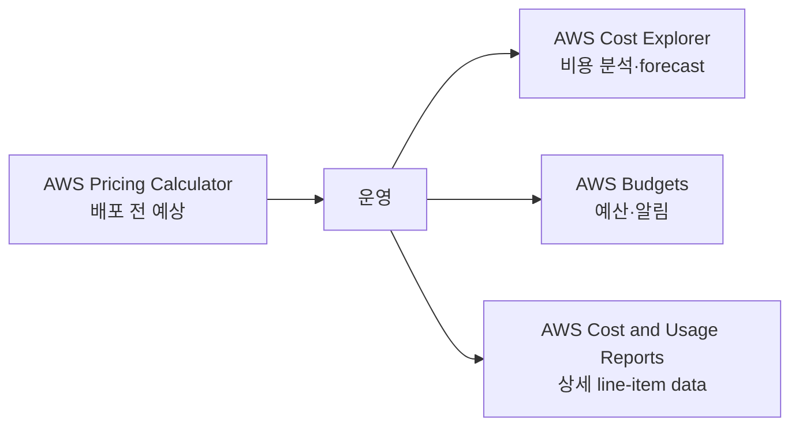

| 도구 | 답하는 질문 | 핵심 기능 |
|---|---|---|
| AWS Pricing Calculator | “만들기 전에 얼마인가?” | 구성별 예상 견적·scenario 비교 |
| AWS Cost Explorer | “실제로 어디에 얼마 썼는가?” | chart, filter, trend, forecast |
| AWS Budgets | “예산·사용량 임계값에 도달했는가?” | actual/forecast budget alert, action 연계 |
| AWS Cost and Usage Reports(CUR) | “가장 상세한 원시 비용·사용 내역은?” | S3 delivery, line item, Athena/BI 분석 |

이 네 도구가 반드시 순서대로 실행되어야 하는 것은 아니다. 목적별로 함께 사용한다.

**예제**

- 새 architecture의 월 예상 비용 → Pricing Calculator
- 지난 6개월 EC2 비용 추세 → Cost Explorer
- 월 $500의 80%에 도달하면 알림 → AWS Budgets
- account·tag·discount별 상세 사용량을 SQL로 분석 → CUR + S3 + Athena

## 6. AWS Organizations와 비용 배분

### Consolidated billing

여러 AWS 계정의 비용과 결제를 management account에서 통합한다.

- 여러 계정에 대한 bill 통합
- 조직 전체 사용량 집계로 volume tier 혜택 가능
- RI와 Savings Plans 할인 공유 가능
- 계정별 비용 가시성 유지

할인 공유는 설정과 적용 규칙의 영향을 받는다. 시험에서는 **한 계정이 산 RI/Savings Plans 혜택이 consolidated billing family의 적격 사용량에 적용될 수 있다**는 개념을 기억한다.

### Cost allocation tags

리소스에 key-value metadata를 붙여 비용을 분류한다.

```text
Project=Checkout
Team=Platform
Environment=Prod
```

- AWS-generated tag와 user-defined tag가 있다.
- 비용 보고에 쓰려면 Billing에서 cost allocation tag로 활성화해야 하는 경우가 있다.
- tag에 PII나 secret을 넣지 않는다.

**Resource tag**는 분류 정보이고, **SCP**는 계정의 최대 권한을 제한하며, **AWS Budgets**는 비용 임계값을 감시한다.

## 7. AWS Marketplace

AWS에서 third-party software, SaaS, data, professional service 등을 찾고 구매하는 digital catalog다.

- security·network 등 partner 제품 배포
- AWS bill과 결제 통합 가능
- 조직의 private marketplace와 entitlement/governance 활용 가능

AWS Marketplace는 AWS가 직접 제공하는 모든 native service의 목록이 아니다.

## 8. AWS Support — 시험 명칭과 현재 상품 분리

### 8.1 CLF-C02 시험 가이드의 기존 명칭

현재 시험 가이드는 다음 명칭을 Support option 예로 계속 적고 있다.

| 기존 시험 명칭 | 식별 키워드 |
|---|---|
| Basic | 모든 고객, account·billing, 문서·community, 기본 health·Trusted Advisor 접근 |
| Developer Support | 개발·테스트, business-hours email 중심 |
| Business Support | production workload, 24x7 phone·chat·web, critical case 1시간 수준 |
| Enterprise On-Ramp | Business와 Enterprise 사이, business-critical, TAM pool·30분 수준 |
| Enterprise Support | mission-critical, designated TAM, 15분 수준 |

정확한 응답 목표는 case severity와 공식 조건에 따라 달라진다. 문제에서 기존 명칭만 주어지면 **그 문제의 기존 체계 안에서** 가장 적합한 plan을 고른다.

### 8.2 2026-08-11 현재 실제 상품

AWS Support 문서가 안내하는 현재 주력 plan:

| 현재 plan | 핵심 |
|---|---|
| Basic | account·billing, forum, health check, 문서 |
| AWS Business Support+ | 24x7 phone/web/chat, 생성형 AI 응답, critical down 시 30분 미만 human engagement |
| AWS Enterprise Support | designated TAM, production-critical 최대 15분 응답, 전략 review |
| AWS Unified Operations | application guidance, TAM+DSE, runbook·운영 중심 지원 |

Developer Support와 기존 Business Support는 2027-01-01 종료 예정이며 기존 고객은 그전까지 전환할 수 있다. Enterprise On-Ramp도 2027-01-01 종료 예정이고 2026년 중 Enterprise Support로 전환된다.

> **시험 원칙:** 보기의 명칭과 시험 가이드 문맥을 먼저 따른다. 실제 운영 질문이면 현재 Support 문서를 확인한다.

원본 Support 이미지의 plan 순서·TAM·응답 시간 일부는 서로 모순되어 있어 그대로 암기하지 않는다.

## 9. AWS Trusted Advisor

AWS 환경을 best practice와 비교하여 권고를 제공한다.

현재 check category는 여섯 가지다.

1. Cost Optimization
2. Performance
3. Security
4. Fault Tolerance
5. Service Limits
6. Operational Excellence

원본 강의의 다섯 category 표에는 후에 추가된 **Operational Excellence**가 빠져 있다.

### 접근 범위

- Basic: Service Limits 전체와 Security·Fault Tolerance의 일부 check 등 제한된 핵심 접근
- Business Support+, Enterprise Support, Unified Operations: 모든 Trusted Advisor check와 API 접근
- 기존 시험 문맥: Business/Enterprise 계열에서 전체 기능이라는 전통적 구별을 사용

Trusted Advisor는 권고 도구다. 고객 승인 없이 모든 문제를 자동으로 수정하는 서비스가 아니다.

## 10. Health와 지원 요청

| 리소스 | 역할 | CloudWatch와 차이 |
|---|---|---|
| AWS Health Dashboard | AWS service event와 계정·resource 영향 확인 | CloudWatch는 내 metric·log·alarm 관찰 |
| AWS Health API | health event를 programmatic하게 조회 | 자동화·통합 |
| AWS Support Center | support case 생성·관리 | 운영 metric 도구가 아님 |

```text
내 EC2 CPU가 높음       → CloudWatch
AWS event가 내 resource에 영향 → AWS Health Dashboard
AWS engineer에게 case 제출      → Support Center
```

## 11. 공식 지식·지원 리소스

| 요구 | 리소스 |
|---|---|
| 서비스 사용법과 API | AWS Documentation |
| architecture·security·economics 모범 사례 | AWS Whitepapers |
| community Q&A와 지식 공유 | AWS re:Post |
| 자주 발생하는 기술 문제 해결 글 | AWS Knowledge Center |
| migration·modernization pattern | AWS Prescriptive Guidance |
| 보안 소식과 guidance | AWS Security Blog / Security Center |
| AWS resource 악용 신고 | AWS Trust & Safety |

## 12. 전문가·partner 지원

| 대상 | 역할 |
|---|---|
| AWS Partner Network(APN) | ISV와 system integrator 등 partner 생태계 |
| AWS Professional Services | AWS 전문가가 transformation/project 수행 지원 |
| AWS Solutions Architect | 요구에 맞는 architecture guidance |
| Independent Software Vendor(ISV) | AWS에서 동작하는 software product 제공 |
| System Integrator(SI) | 고객 system 구축·통합·migration 지원 |

AWS Partner가 되면 partner training·certification, 행사·공동 판매 기회, 등급과 프로그램에 따른 혜택을 받을 수 있다. “모든 Partner에게 항상 같은 할인”으로 단정하지 않고, 시험에서는 **AWS가 검증한 전문 생태계와 고객 지원 경로**라는 역할을 기억한다.

## 13. 문제 풀이 예제

**상황:** “중단 가능하고 재시작 가능한 nightly batch의 EC2 비용을 최소화한다.”  
**정답:** Spot Instances

**상황:** “특정 AZ에서 launch할 EC2 capacity를 확보해야 한다. 할인보다 가용 capacity가 중요하다.”  
**정답:** On-Demand Capacity Reservation

**상황:** “여러 계정의 비용을 하나의 bill로 받고 RI 혜택을 공유한다.”  
**정답:** AWS Organizations consolidated billing

**상황:** “AWS event가 내 계정 resource에 영향을 주는지 본다.”  
**정답:** AWS Health Dashboard

**상황:** “시험 보기에서 TAM과 mission-critical 15분 응답이 나온다.”  
**정답:** Enterprise Support

## 14. 시험 직전 30분 복습

| 시간 | 볼 것 |
|---|---|
| 0~5분 | Shared Responsibility, Root/MFA, IAM Role |
| 5~10분 | CloudTrail/Config/CloudWatch, WAF/Shield, GuardDuty/Inspector/Macie |
| 10~15분 | EC2/Lambda/Fargate, S3/EBS/EFS, RDS/DynamoDB/Redshift |
| 15~20분 | IGW/NAT, SG/NACL, Route 53/CloudFront, SNS/SQS/EventBridge |
| 20~25분 | On-Demand/RI/Spot/Savings Plans, Calculator/Explorer/Budgets/CUR |
| 25~30분 | Well-Architected, CAF, Support, AI·ML 이름↔작업 |

### 마지막 문제 풀이 규칙

1. 문제에서 **동사**를 찾는다: 저장, 분산, 탐지, 감사, 알림, 분석.
2. 요구 조건을 표시한다: managed, serverless, relational, archive, private, global.
3. 중복 기능이 보이면 **가장 직접적인 서비스**를 고른다.
4. “가장 비용 효율적”은 중단·약정·성능 조건을 모두 확인한다.
5. 복수 응답은 요구사항을 각각 충족하는지 독립적으로 검사한다.

## References

- [CLF-C02 Domain 4](https://docs.aws.amazon.com/aws-certification/latest/cloud-practitioner-02/cloud-practitioner-02-domain4.html)
- [AWS Support Plans — current](https://docs.aws.amazon.com/awssupport/latest/user/aws-support-plans.html)
- [AWS Trusted Advisor](https://docs.aws.amazon.com/awssupport/latest/user/trusted-advisor.html)
- [AWS Organizations Consolidated Billing](https://docs.aws.amazon.com/awsaccountbilling/latest/aboutv2/consolidated-billing.html)
- [AWS Certified Cloud Practitioner 시험 준비](https://aws.amazon.com/certification/certified-cloud-practitioner/)
- 원본: `day3/4.1.md`~`day3/4.3.md`, `day3/ex1.md` 및 참조 이미지

---

## 반드시 알아야 할 핵심 비교

| 비교 | A | B | C |
|---|---|---|---|
| On-Demand vs Spot | 약정·중단 없음 | 중단 가능, 큰 할인 | — |
| RI vs Savings Plans | 속성에 묶인 예약 할인 | $/hour compute 약정과 더 큰 유연성 | — |
| Dedicated Host vs Dedicated Instance | 물리 host 전체 제어 | 전용 tenancy, host 제어 적음 | — |
| RI vs Capacity Reservation | 할인 | 특정 AZ capacity 확보 | — |
| Calculator vs Explorer | 배포 전 예상 | 실제 비용·추세 | — |
| Budgets vs CUR | 임계값·알림 | 가장 상세한 비용 data | — |
| Tag vs Budget vs SCP | 비용 분류 | 비용 감시 | 권한 제한 |
| CloudWatch vs Health Dashboard | 내 metric·log | AWS event의 내 계정 영향 | — |

## 시험에서 헷갈리는 서비스

| 요구 | 정답 | 헷갈리는 서비스 |
|---|---|---|
| 중단 가능한 compute 최저 비용 | Spot | RI는 장기 약정 |
| 장기 compute + family/Region 유연성 | Compute Savings Plans | EC2 Instance SP는 더 제한적 |
| 가장 상세한 billing line item | CUR | Cost Explorer는 시각 분석 |
| 여러 계정 통합 bill | Organizations | Budgets는 예산 알림 |
| best-practice 권고 | Trusted Advisor | Compute Optimizer는 resource 구성 권고 중심 |
| support case | Support Center | re:Post는 community Q&A |
| AWS 악용 신고 | Trust & Safety | Support Center는 일반 support case |
| third-party software 구매 | Marketplace | Service Catalog는 조직 승인 제품 배포 |

## 최종 암기표

| 키워드 | 한 줄 암기 |
|---|---|
| On-Demand | 약정 없음 |
| RI | 예측 가능한 1/3년 사용 할인 |
| Spot | 중단 가능 |
| Savings Plans | compute $/hour 약정 |
| Dedicated Host | 전용 물리 host·license |
| Capacity Reservation | capacity 확보 |
| Pricing Calculator | 배포 전 예상 |
| Cost Explorer | 실제 비용·forecast |
| AWS Budgets | 예산·알림 |
| CUR | 상세 비용 data |
| Organizations | multi-account·consolidated billing |
| Cost allocation tags | 팀·project별 비용 분류 |
| Trusted Advisor | 비용·성능·보안·복원력·quota·운영 권고 |
| Health Dashboard | AWS event의 내 환경 영향 |
| Enterprise Support | designated TAM·mission-critical |
