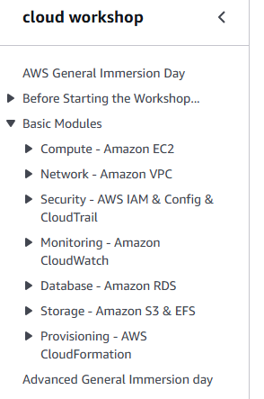
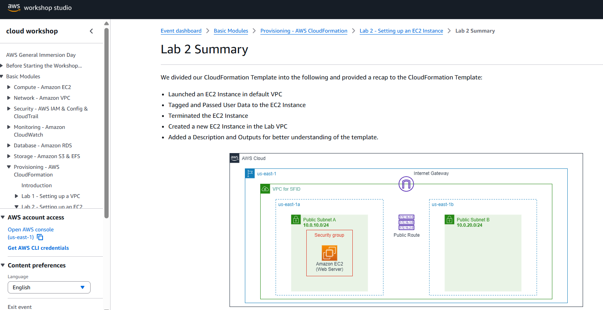

## AWS General Immersion Day workshop

BOB에서 수업을 듣고 aws workshop을 무료로 진행할수 있도록 어카운트를 받아서 Basic Modules 까지 진행했다.  
끝까지 하다보면 Advanced로 넘어갈 수 있는 링크도 나오는데, 마지막 CloudFormation 부분부터는 거의 머리를 비운상태로 진행해서 이 뒤로 진행하기에는 지금 실력으로나 시간상으로나 힘들다고 생각되어서 여기까지 했다.

만약 다음주에도 어카운트를 사용할 수 있게 된다면 계속 진행하고, 아니라면 이대로 마무리를 하는게 맞는것 같다. 과제와 별개로 여기까지 진행한걸 기록해두면 좋겠다는 생각이 들어서 기록을 남긴다.

수업들은 다 재미있고, 내가 학교에서 배웠어야하는데 그러지 못했던것들을 여기서 메꾸는 느낌이 들어서 좋다. 내가 생각한것 이상으로 수업 퀄리티가 높다. 보안 관련해서는 머리아픈 수업도 있다

## 개인적인 생각

시간이 있을때 바로 백엔드 공부를 안했던건 후회가 많이 된다. 웹개발 하려고 컴퓨터공학과를 원했던건 아니었지만... 남들이 보통 하는일만 잘 따라갔어도 얻는게 많았을것 같은데.  
그런 후회를 할 틈도 없이 여기에서는 과제로 FastAPI도 해보고, Flask도 해보고 있다. AI공부는 해봐야겠다 생각만 하지 행동으로 옮기지는 않았었는데 여기에서 또 하고 있다. 학교에서 했던것 보다는 쉽다. 학교에서 처음에 너무 어렵게 해서 잘 따라가지를 못했다. 3학년때부터 시작했으니 어쩔수 없는 과목이 몇개 있다고 생각해두고... 지금 슬슬 수업듣고 기억할거 기억해두고, 예전에 봐뒀던 책을 올해 말까지 볼 계획이다.

다른사람들은 학교를 병행하려는 사람도 있는것 같고, 수업이 길어질수록 지치고 분위기가 쳐지는 느낌도 있다. 나는 일단 휴학을 했고, 졸업을 하려면 2학기를 다녀야만 하기에 휴학을 내년까지 할 계획이다. 아마 졸업요건을 마무리하고, BOB를 마치고 내년 봄부터 새로 해나갈수 있는 일을 찾기도 하고, 못했던 공부를 하면서 지낼것 같다.

자대 진학한다고 하면 4-1학기까지 성적을 보는것 같으니, 학교성적은 마무리가 되었다. 개인적으로는 아쉽지만... 열심히 했다.  
타대 진학을 한다고 하면... BOB에서 뭔가 의미있는 성과를 얻어낸다면 서울대나 카이스트 지원정도는 해볼수 있는것 아닐까? 컨택을 해도 결국 밟는 절차가 있어서 그냥 해볼만 한것 같은데, 아니라면 그냥 그대로 좋다. 암호학으로 대학원에 간다고 마음에 정해놓기는 했지만 준비가 된 것은 아무것도 없다. 학교 교수님도 자대가 가장 심리적으로는 좋은데, 중앙대에 너무 오래 있었다는게 마음에 걸린다. 이것 말고는 불만은 아무것도 없다. 

얼마전에는 학교 GDGoC 지원을 했다. 할수 있다면 좋을것 같다. 휴학을 해서 이걸 할수있는것이기도 하고, 작년에 했어야 하는데 여러가지 일도 있었고 어쨌든 못했던 일들을 이제 한다. 면접이 2일 뒤인가? 이걸 못하게 된다고 하더라도 공부를 좀 더 해서 개발동아리 몇개를 지원해볼 생각이다. 올해 1학기에도 2군데정도 서류합격은 했었지만, 한곳은 아파서 면접을 못봤었고, 다른 한곳은 메일이 스팸메일에 들어가버려서 합격한줄도 몰랐었다.

그냥 이런 생각들을 하면서 지내고 있다...
