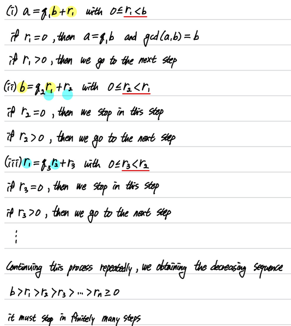
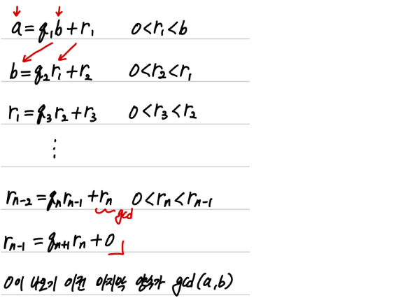
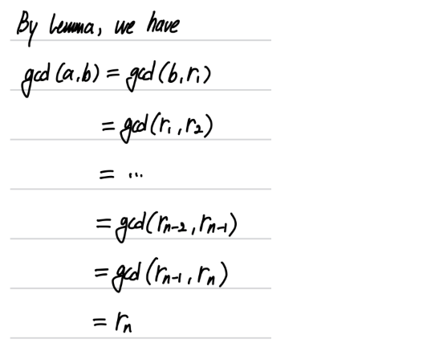
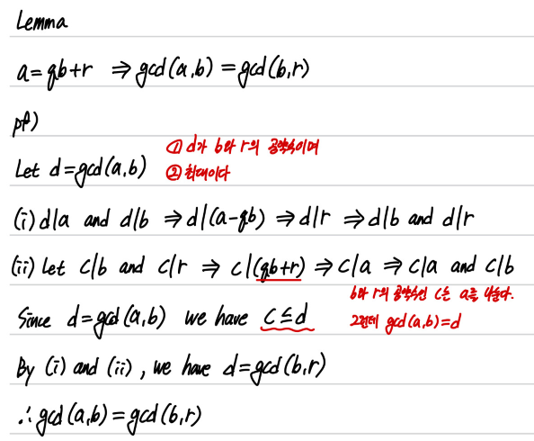
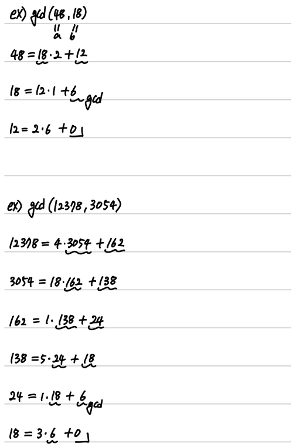
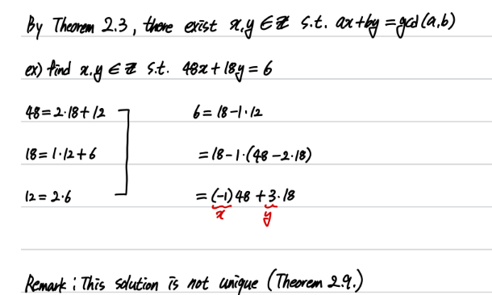
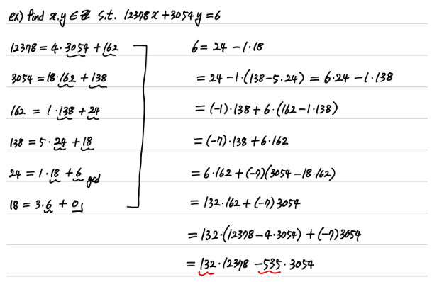
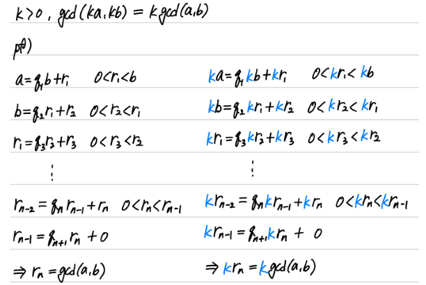

## 2.4.1 The Euclidean Algorithm $(a \le b < 0)$

### Lemma (will be proved)
$ a =qb + r \Rightarrow gcd(a,b) = gcd(b,r) $

### Proof of $gcd(a,b) = r_{n}$

### pf

## example
숫자가 클수록 모든 positive divisor을 구하기는 어렵다

## 정리
- prove the Euclidean Algorithm
- We can compute the gcd(a,b) using Euclidean Algorithm (even for large a and b)

## 2.4.2 Find $x,y \in \mathbb{Z} \text{ with } ax+by=gcd(a,b)$
유클리드 호제법의 응용

답중의 하나를 위의 방법으로 구할 수 있다.

## Theorem 2.7

Euclidean Algorithm 이용해서 증명함

## 정리
- We can find $ x,y \in \mathbb{Z} \text{ s.t. } ax+by=gcd(a,b)$ using the Euclidean Algorithm

## 2.4.3 The Least Common Multiple

### Definition 2.4
Given $a,b \in \mathbb{Z} \left( a \neq 0 \text{ or } b \neq 0 \right)$, the least common multiple of $\text{a and b}$ is the positive integer m satisfying

(a) $a \mid m $ and $b \mid m $ (common multiple)  
(b) $a \mid c $ and $b \mid c \Rightarrow m \le c$ (least)

In this case, we write $m = lcm(a,b$)

### Theorem 2.8
$ gcd(a,b) lcm(a,b) = ab$

### Corollary 2.8
For any $a,b \in \mathbb{N}, lcm(a,b)=ab \Longleftrightarrow gcd(a,b) = 1$

### Proof of Theorem 2.8

## 정리
- We can write the definition of $lcm(a,b)$
- We can prove the relation between $gcd(a,b) \text{ and } lcm(a,b)$
