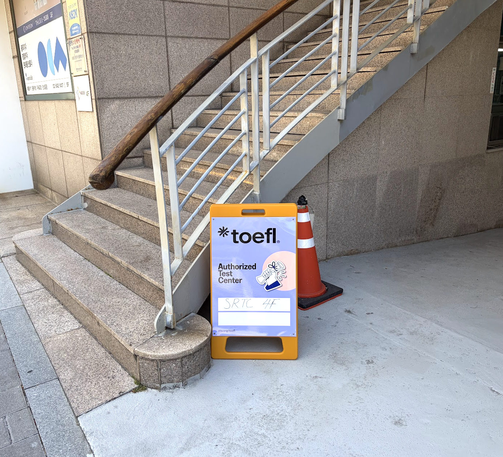
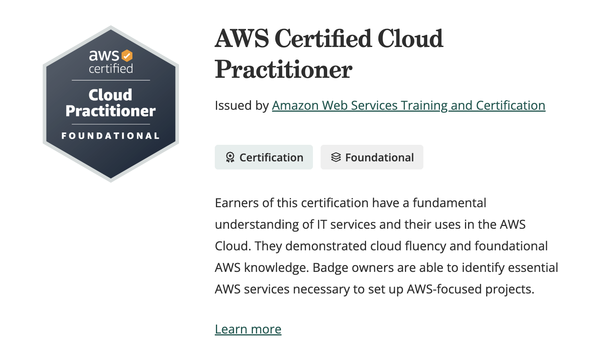

## 응시 계기

교내에 AWS 자격증 교육과 시험 지원 공지가 올라와 신청했다. 교육은 외부 교육기관에서 진행했으며, 신청자 중 선착순 30명에게 시험 바우처도 제공되었다. 운 좋게 바우처를 받아 무료로 시험을 치를 수 있었다.

교육은 3일 동안 진행되었다. 시험 내용이 아주 깊지는 않았기 때문에 개념을 세세하게 파고들기보다 AWS 서비스 이름과 용어에 익숙해지는 데 신경을 썼다.

현재 하고 있는 일이 오후 7시에 끝나는데 강의도 같은 시간에 시작해서, 퇴근길 지하철에서 휴대폰으로 들어야 했던 점은 조금 힘들었다. 휴대폰 데이터가...

## 시험 준비

시험 전날에는 내가 정리한 파일을 GPT에 넣고, 학습한 범위 안에서 연습문제를 10문제씩 만들어 달라고 했다. 문제를 풀고 채점과 해설을 받은 다음 부족한 부분의 용어를 다시 정리하는 식으로 약 50문제를 반복해서 풀었다.

이동하면서 휴대폰으로 문제를 풀고 바로 해설을 확인할 수 있어서 시험 직전 복습에는 괜찮았다.

## 시험 당일

선정릉역 인근 SRTC 시험센터 입구.

시험 당일 오전 10시에 수강신청이 있었고 시험은 10시 45분에 시작했다. 두 일정이 겹칠 것을 미처 생각하지 못해 역 앞 카페에서 급하게 수강신청을 마친 뒤, 시험장 건물로 올라가면서 연습문제를 풀며 마지막으로 복습했다.

시험장에서는 신분증과 여권으로 신분 확인을 한 뒤 짐을 맡기고 입실했다. 체감 난이도는 준비하면서 풀었던 연습문제와 비슷했다. 시험 준비 과정에서는 GPT한테 문제를 받으면서도 시험 문제랑 얼마나 난이도가 비슷한지 계속 물어보기도 하고 시험에 나오는 유형이 맞긴 한지 잘 공부하고 있는지 의문이 있었는데, 그런 걱정을 할 정도의 시험은 아니다.

시험은 한국어로 신청했지만 번역된 문장이 어색하게 느껴질 때가 있어 영어 원문을 함께 보며 풀었다. 문제 화면에서 영어 원문을 확인할 수 있는 버튼이 있다.

시험장 시스템은 전반적으로 깔끔했다. 시험 직후 화면에서 합격 여부를 확인할 수 있었지만, 휴대폰을 맡기고 입실하는 구조라 별도로 촬영하지는 못했다.

## 결과

공식 결과는 5일 이내에 이메일로 발송된다는 안내를 받았고, 나는 시험 다음 날 확인할 수 있었다. 해외 기관에서 주관하는 자격시험은 처음이었는데 시험 절차와 환경을 경험해 본 것 자체도 좋았다.

합격 후 AWS Certified Cloud Practitioner 디지털 배지를 받았다.
