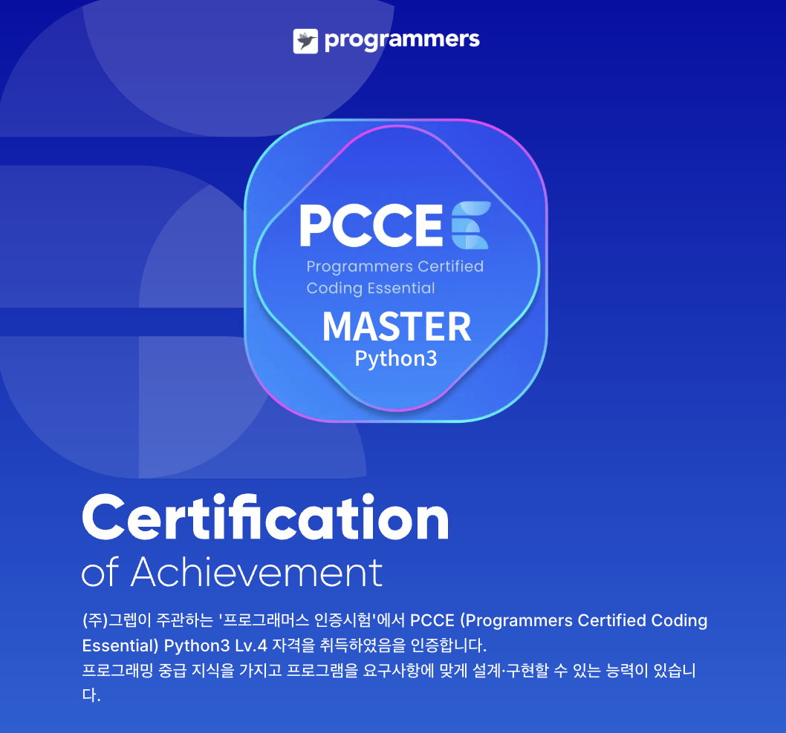

## 응시 계기

교내에 PCCE 교육과 시험 지원 공지가 올라와 신청했다.

교육 과정에서 공지된 링크가 잘못되어 강의 접속이 안되는 일도 있기도 했고, 내용이 쉽기도 했고... 그러다보니 수업을 아주 열심히 듣지는 않았다. 수업 시작 후 일하러 가야해서 지하철에서 폰으로 듣다보니 데이터가 부족하기도 했고...

## 시험 구성과 환경

시험은 모니토 앱을 이용한 비대면 감독 방식으로 진행되었다. 문제를 푸는 화면은 평소 프로그래머스에서 코딩테스트 문제를 풀 때와 비슷했다.

PCCE는 빈칸 채우기, 디버깅, 코드 작성 유형의 총 10문항으로 구성되며 시험 시간은 50분이다. 코드 쓰는것도 줄글로 설명 나와있는걸 그대로 코드로 옮기면 된다.

난이도는 매우 쉽지만 10문제중 한문제쯤은 막힐수도 있다. 나는 7번쯤에서 이상하게 막혀서 다른문제를 풀다가 돌아왔는데 시험 30초 남기고 이런걸 왜 못풀지 이런 생각을 하면서 한숨을 쉬고 노트북을 밀치다가 답을 찾고 제출완료했다. 시험감독하는 사람이 나의 그런 모습을 보지 않았을까...

```python
for i in range(1,10):
    a+=b; print(a)
```

개인적인 팁을 남기자면 파이썬은 한줄 끝나고 세미콜론으로 줄을 끊고 print가 가능하다. 다른 언어는 가능할지 잘 모르겠다.

## 결과



결과는 1000점 만점으로 Python3 Level 4(Master)를 받았다. PCCP는 국민은행이나 공기업이나 쓸모가 있는것 같지만 PCCE는 그런 시험은 아닌듯. 쉬운 시험이었지만 결과 후기중에 만점을 받지 못한 결과도 가끔 보였다. 무료로 기회가 주어진다면 한번은 볼만한 시험이다. 그냥 재미삼아서...
