## 1주차1st ch12

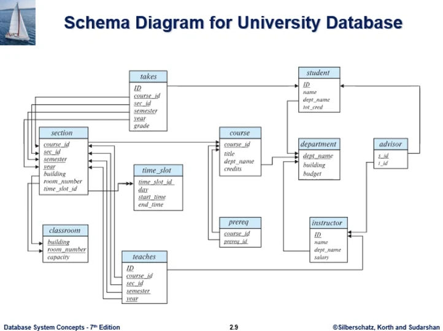  
그림 2.9  
교재에는 오타가 있다. 강의실 테이블에는 pk 밑줄이 Room_number도 같이 그어져야 한다(합성키)

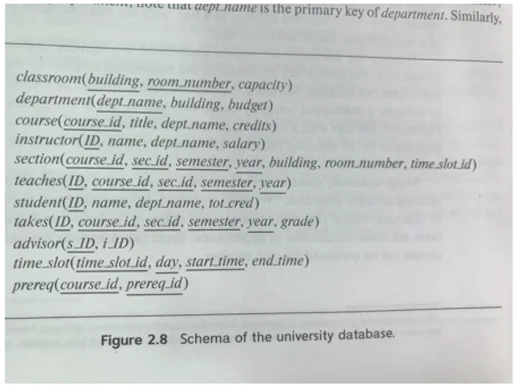  
여기 스키마에는 밑줄이 잘 그어져 있다.

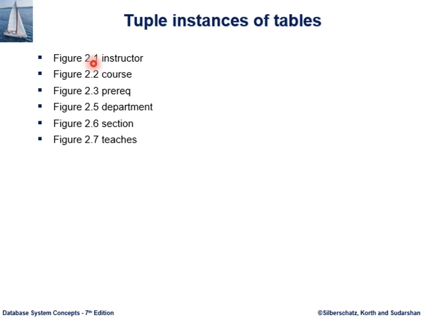  
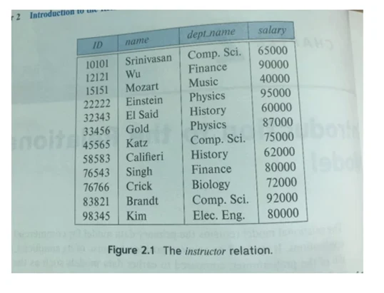  
교수 정보
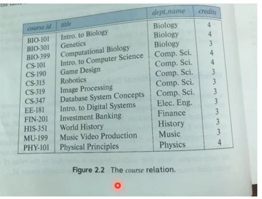
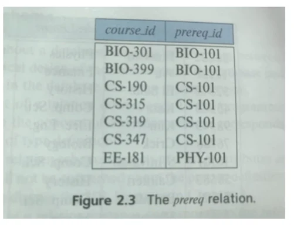  
선수과목  
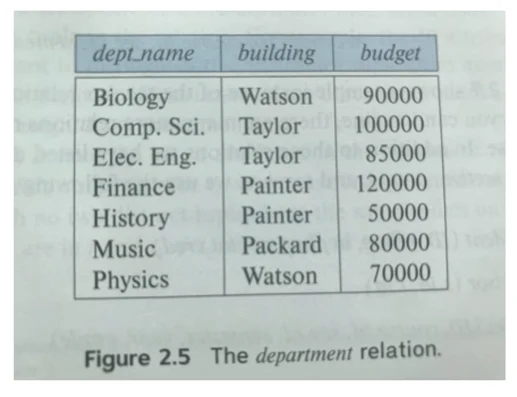  
학과  
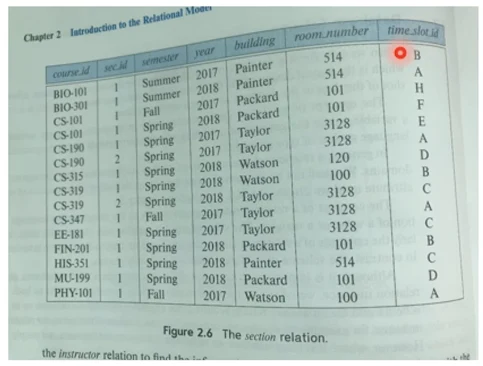  
수업, BIO-101과목이 1학기 여름에 개설이 되었는데 painter 빌딩 514호 시간표 코드 B  
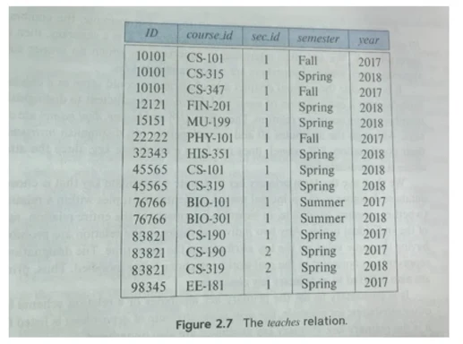  
어떤 교수가 어떤 학기에 가르쳤다 나타내는 테이블

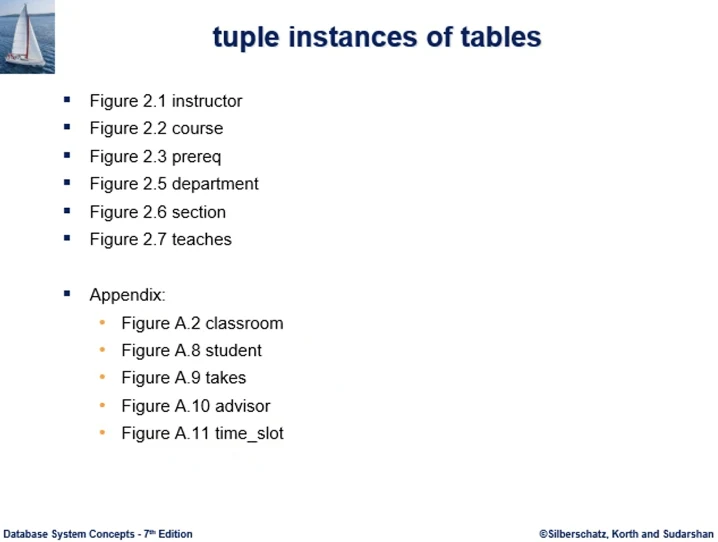

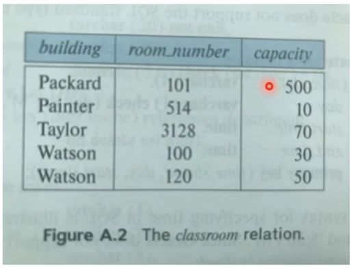  
강의실  
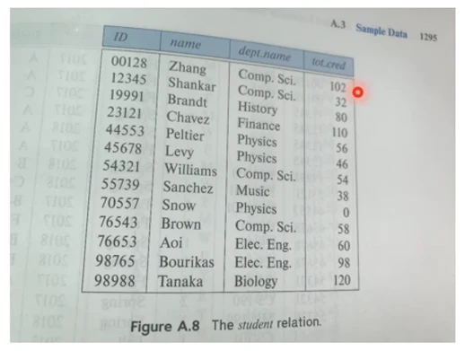  
학생, 끝에건 수강한 총 학점  
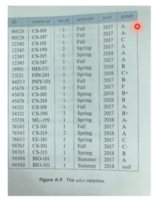  
수강 테이블, - 학생이 - 학기에 - 과목을 수강해서 - 학점을 받았다는 tuple instance  
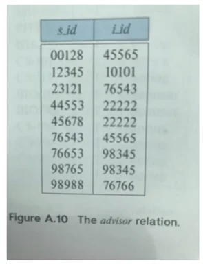  
지도교수 배정  
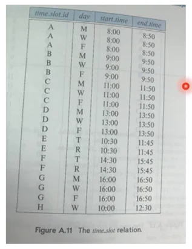  
시간표 정보, 시간표 코드 B는 월수금 3번 0900-0950 수업끝

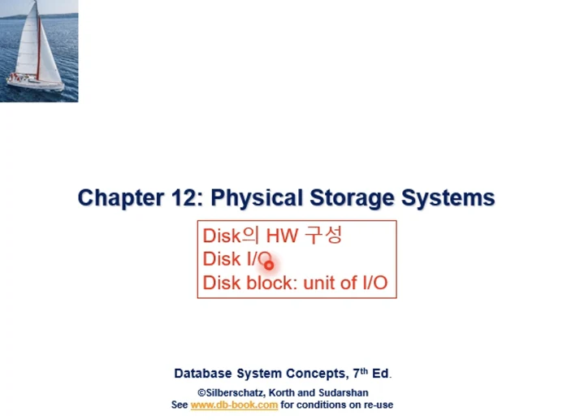  
12장. 디스크의 하드웨어 구성, 디스크와 주기억 장치간의 데이터 입출력, 디스크 블록 - 디스크 입출력 단위 에 대해서 배운다.

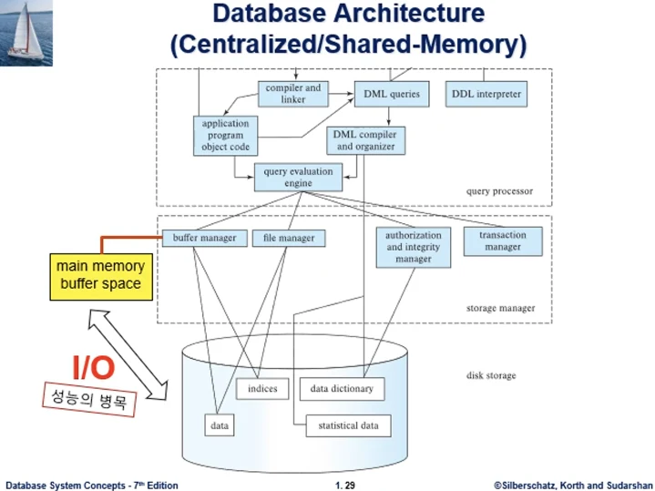
db시스템 구조  
두 점선박스가 dbms, 상단이 쿼리 프로세서, 하단이 스토리지 매니저이다. 이 둘이 DBMS엔진에 해당한다.  
db의 데이터는 파일에 저장이 된다. 파일 매니저 모듈이 위에 보인다. 이 파일들이 디스크 장치에 저장된다.  
응용프로그램에서 db의 데이터에 접근하려면 디스크의 데이터를 주기억장치 버퍼공간에 가져와야 한다.  
응용프로그램에서 db에 데이터를 업데이트 할때도 버퍼에 업데이트 될 데이터를 준비후 디스크에 써야 한다.  
버퍼와 데이터간 입출력이 Disk IO 이다. 이것은 시간이 오래걸려서 db 시스템 성능의 병목이 된다. 이 횟수를 줄이려고 한다.

  
이것이 느린 이유는 디스크의 하드웨어 구성을 보면 알수 있다.

- 데이터를 기록하는 디스크 원판이 platter, 양면에 데이터를 기록할수 있고 surface라고 한다.
- 각각 surface에는 원형의 track가 있고 이 track에 데이터가 기록되는데, sector라는 단위로 나뉜다. 이것은 데이터를 쓰거나 읽을때의 기본단위가 된다.
- 각 면에 track은 회전축 spindle을 중심으로 동심원을 그리고 여러 트랙이 존재
- read/write head가 있는데 sector는 head 밑을 지나면서 데이터를 읽거나 쓰게 된다.
- arm assembly는 1개뿐으로, 원하는 트랙에 head를 위치 시키려면 arm이 움직여야 한다.

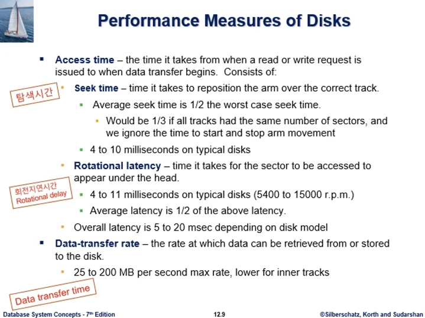  
디스크 access time은 3가지 요소로 구성된다.

- 탐색시간 seek time - arm을 track 상에 오게 움직이는 시간
- 회전 지연시간 rotational delay - 원하는 sector가 head 밑에 도달하도록 원판이 회전하는데 걸리는 시간. 평균 반바퀴고 최악이 한바퀴이다.
- 데이터 전송시간 (데이터 전송률로 나타내고, 단위시간당 얼마의 데이터를 전송할 수 있는가) data transfer time - 실제 sector가 head를 통과하면서 데이터를 전송하는 시간. 실질적으로 디스크에 데이터를 access하는데 걸리는 시간으로, 위의 2개는 준비시간이 된다.

3개 구성요소에서 위의 2개는 전자적 시간이 아닌 기계적 시간으로, 오버헤드에 해당하는 기계적 동작이 access time이 전체 access 시간의 대부분을 차지한다. 동작 자체가 기계적이므로 시간의 대부분을 차지하고 DB시스템의 성능의 병목이 된다.

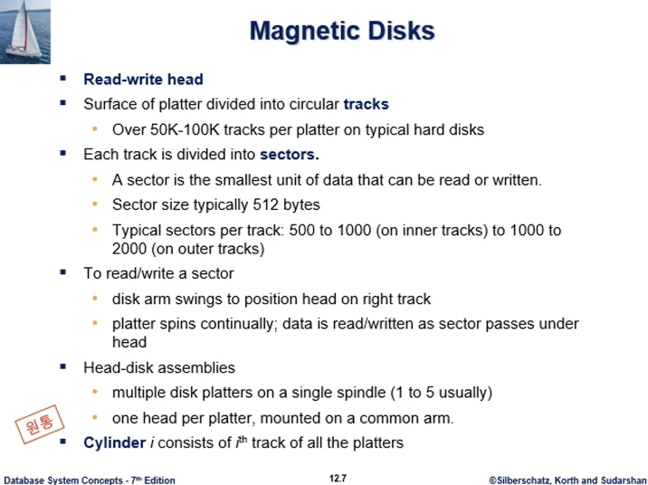  
여러 용어를 정리한것  
Cylinder - 원통

그림에서 점선으로 표시된, 뚜껑과 점선이 실린더이다. 회전축 중심에서 같은 반경을 갖는 트랙을 모은것이다. 가상의 원통으로 트랙의 집합이다.  
실린더 상의 트랙의 데이터를 읽고 쓰는데 더이상의 seek time은 필요가 없다. (overhead x)  
함께 읽어야 할 관련된 데이터를 같은 트랙상에 위치시키는것 뿐 아니라 같은 실린더 상에 위치시키게 되면, 한번에 seek time만 들여서 접근 가능해진다.  
실린더는 각 surface의 트랙이 여러개 이므로 중심축 반경 크기만큼의 실린더들이 여러개 있게 된다.

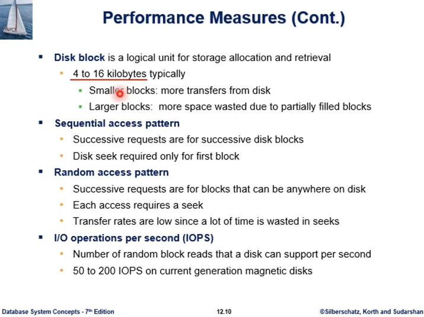  
디스크 블록, 이번 학기에 많이 보게 될 용어이다.  
이것은 disk IO의 논리적인 단위이다. 통상적으로 4-16kb이고 더 클수도 있다. io를 할때 정해진 크기로 이루어진다는 것이다. 항상 정해진 크기만큼 버퍼로 들여오고 쓰고 하면서 정해진 크기로 이루어진다.

- 블록크기가 너무 작다면 IO횟수가 늘어나게 된다. 각 횟수마다 seek,회전지연등 기계적 동작이 부여되므로 성능이 떨어질 수 있다.
- 블록이 너무 크다면 seek시간은 줄어들겠지만 원하는 데이터가 큰 블록의 일부만 될수도 있다. 불필요한 낭비가 발생할수 있는것.

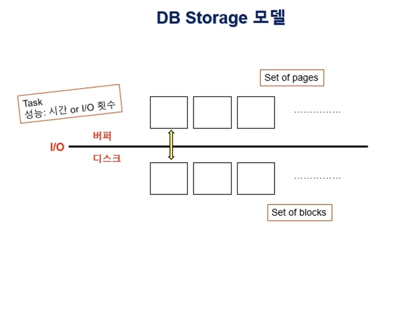  
보통 db시스템 기술의 연구개발이나 학습에서는 블록 단위에 맞추어서 이런 모델을 사용한다.

- 박스 하나가 1개 블록이다. 4-16kb(정해진크기)가 된다. 디스크 공간 자체를 여러 블록들의 집합으로 추상화해서 생각한다.
- 버퍼공간은 많은 디스크 블록 중 일부를 주기억 장치로 가져오는데 쓰는 공간이다, 버퍼는 디스크 블록 일부를 캐쉬한 공간이다.
- 디스크 블록이 버퍼로 들어오면 페이지라고 부르며, 버퍼공간은 페이지의 집합이다.
- 버퍼 공간은 제한된 공간이다. 응용프로그램이 db에 접근하려면 거쳐야 하는데, 경쟁하는 자원이 된다.
- 디스크 서로 다른 블록들은 같은 트랙에 있거나 실린더 상에 있을수도 있다, 아닐수도 있고. 최악은 서로 다른 트랙에 있는것
- 블록별로 io 할때마다, 블록당 seek, 회전지연, 전송시간이 소요되는것으로 생각한다.
- 따라서 어떤 Task 수행에 있어서 성능을 측정할때 시간이 얼마인가? 할수도 있지만. 모델을 잡았으므로 IO(성능의 병목)를 총 몇번하는가로 성능을 측정할 수 있다.

## 1주차2nd ch13

### 연습문제

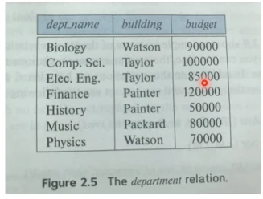  
학과 테이블, 스키마 칼럼 3개... 이렇게 이해하는것은 Logical view 이다.  
물리적으로는 이 데이터가 파일의 형태로 디스크에 저장된다.  
tuple들은 file의 레코드가 되는것.  
물리적으로는 레코드들이 여러개으 블록들로 나뉘어서 디스크에 저장된다.

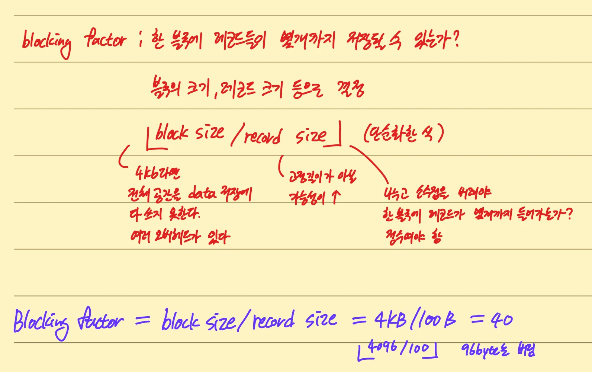

- Blocking factor : 한 블록에 레코드들이 몇개까지 저장될수 있는가? (블록의 크기, 레코드 크기 등으로 결정)

- floor(block Size/record Size)

위의 것은 단순화한 식이다.  
4kb라면 전체 공간을 데이터 저장에 다 쓰지 못한다. 여러 오버헤드가 있다.  
레코드 크기는 고정길이가 아닐 가능성이 높다.  
나누고 소수점을 버려야 한 블록에 레코드가 몇개까지 들어가는가지 따질수 있다. 정수여야 한다.

예를 들어서 학과테이블에 저장하는 블록이 4KB, 레코드 크기가 100B라고 하면, floor(4096/100) = 40

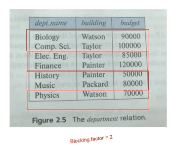  
연습문제에서 blocking factor=2로 하자. 그럼 모두 4개 블록이 된다.

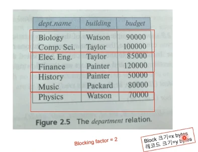  
Q1 : 테이블의 레코드 1개를 디스크에서 버퍼로 읽고 싶은데, 그러기 위해서 디스크에서 버퍼로 전송하는 데이터의 최소 크기는 몇 byte 인가?
A : x byte이다.  
y byte를 읽고 싶었던 것이다. 디스크 IO단위가 블록이므로 블록 단위로 읽어야 한다. 일부만 읽을수는 없다.

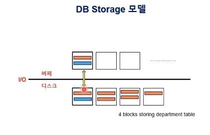  
학과 테이블은 4개 블록으로 디스크에 저장되어 있다. 파란 표시된 레코드만 읽고 싶어도 그것만 가져올수는 없다. 레코드를 포함한 블록 전체를 읽어야 한다.

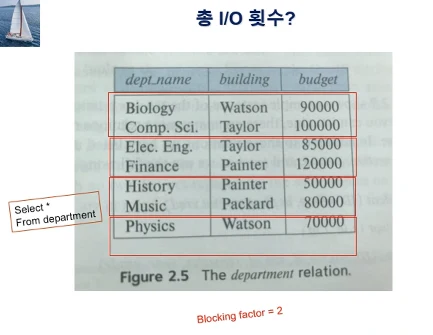  
Q2: 위의 질의가 주어질때, bf=2 라고 가정. 질의 결과 set을 얻기 위해 필요한 io 수는? 질의 결과 set은 저장하지 않는다고 가정한다. 결과 set에 포함된 튜플을 검색할때마다 Display하는 방식으로 처리하던지.
A : 4회 IO 필요, where절 조건이 없으니 블록 다 읽어와야 한다.

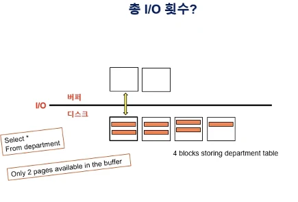  
Q3 : 위 질의 처리할때 버퍼 공간은 2page만 질의처리를 위해서 쓸 수 있다고 할때 IO횟수는? 결과셋은 저장 안한다고 가정  
A : 4 IO's 어쨌든 4번

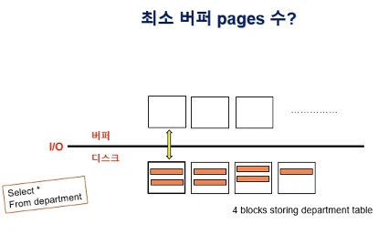  
Q4 : 위 질의처리에 필요한 버퍼 페이지 수는 최소 몇개인가? 결과셋 저장안함  
A : 1페이지만 있어도 된다.

### 13장

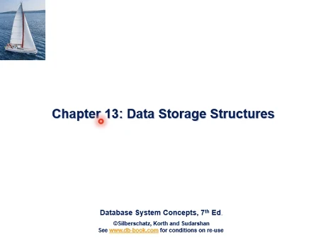  
13장

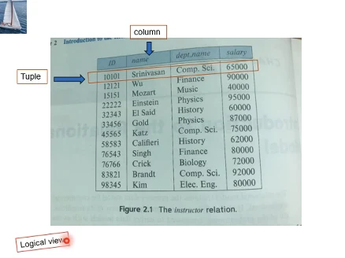  
논리적인 관점

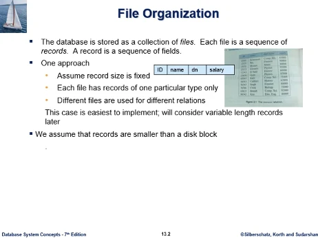  
데이터베이스의 데이터는 물리적으로 여러개의 파일에 저장된다. 레코드 여러개가 파일을 구성한다. 교수 테이블 각각의 튜플이 레코드로 구현되는것. 각 레코드는 여러개의 필드로 구성된다.

이걸 가장 쉽게 구현한다면

- 고정길이 레코드
- 각 파일이 저장되는 레코드 타입은 1가지뿐, 모든 레코드가 똑같은 필드구성으로 되어있다.
- 각 테이블마다 독립된 별도의 파일을 배정해준다. 교재 대학 db 테이블 11개라면 11개 파일에 저장.

이런 방법이 구현은 쉬워보이지만 일반적으로 성립 안한다

- 가변길이 레코드
- 11개 테이블이 11개 파일에, 자연스러운것 같지만 꼭 그렇지는 않다. 테이블마다 독립된 파일을 배정하는게 아니라 관련된 테이블의 튜플을 물리적으로 1개 파일에 같이 모아서 저장할수도 있다.

그러나 지금은 위의 가정으로 설명하기로 한다.

그리고 또 하나 가정하는 것은 각각의 레코드들의 크기가 블록크기보다 작다. 레코드 하나가 한 블록 안에 들어간다고 가정, 이것은 대부분의 rdb application에서는 타당한 가정이다.

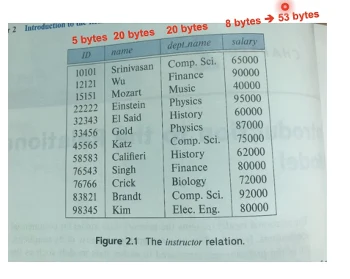  
한 레코드 길이를 53바이트로 할당해서 구현한다.

오타가 있다 n\*i가 맞다.  
n이 각 레코드의 고정길이. 0번부터 레코드 번호를 넘버링하면,

- 0 - n-1번 바이트(52)
- n - 2n-1번 바이트

이런식으로 저장이 된다.

n번 레코드가 시작되는 byte 위치의 식은 n\*i, i번 레코드가 파일의 시작에서부터 몇 바이트 떨어진 곳에서 시작하는가를 나타내는 식이기도 하다. 이 떨어진 거리를 byte offset 라고도 한다.  
이 파일 구성에서는 레코드가 고정길이이고, 시작 위치를 식에 의해서 알고 있으므로 구현이 쉽다.

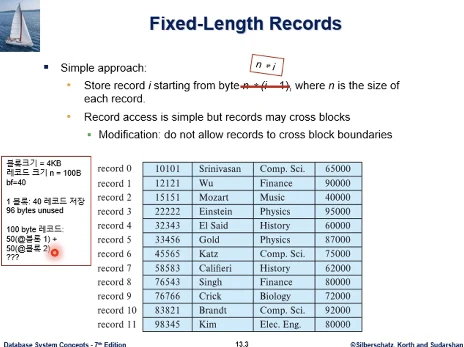  
1개 레코드가 2개 블록에 나누어 걸쳐서 저장되지는 않도록 한다.  
추가로 100byte레코드가 있을때 앞부분 저장을 남은것에 하고, 뒷부분은 그 다음 블록에 저장(block boundary cross) 그렇게 하지는 않는다는것.  
일반적으로는 블록당 여유공간을 남겨두는 것이 보통이고, 그게 더 유리하다.  
나중에 테이블에 새로운 튜플이 삽입되므로 그때 여유공간 활용가능

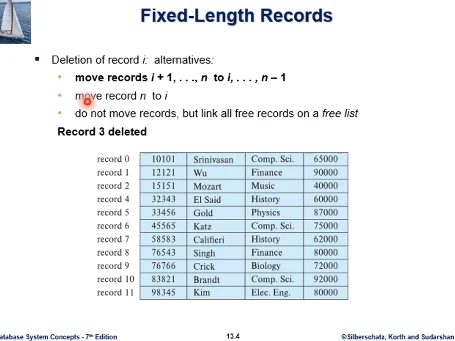  
고정길이 레코드 파일에서 또 하나의 문제점은 레코드가 삭제되었을때 삭제된자리 빈공간 처리의 문제가 있다.  
3번 레코드가 지워진 상태이다.

1.삭제된 레코드 다음부터 마지막까지를 한 위치씩 shift

- 배열에서 한 위치씩 shift 하는것과 다르다. 배열은 배열 자체가 메인메모리에 적재되어 있다. 배열 크기가 커도 실행시간면에서 큰 부담이 없다.
- 지금은 파일이 디스크에 있고. 데이터에 접근할때는 디스크상에서 shift 하는게 아니라 내용을 전부 메모리 버퍼를 통해서 io로 읽어와서 작업하고 다시 io로 써야하는 문제가 있다.

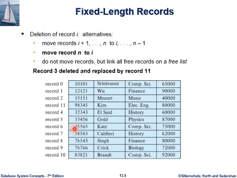  
2.레코드 n번째를 삭제된 i 번으로 이동.

- 이것도 전체 데이터가 메모리에 적재된것이 아니므로, 11번 레코드를 가지고 있던 디스크 블록이 11번이 나간 상태로 버퍼에서 업데이트 되었다가 디스크에 다시 쓰여져야 하고, 3번자리가 있던 블록도 11번 디스크를 채워서 내보내야 한다.
- 위의 것보다는 io가 작을 수 있다.

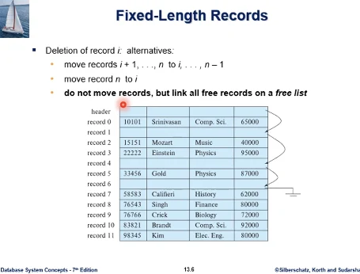  
3.링크드 리스트처럼, 레코드를 움직이지 않고, 삭제되어 생긴 빈자리를 free list 로 유지

- 파일의 전체적인 정보를 저장하는 header block 을 둔다. 다음 비어있는 레코드 자리를 저장하는 포인터를 가지고 있다.
- 메인메모리 상이 아닌, disk 상에서의 블록의 위치, 블록 내에서 record의 byte offset 정보가 다 있어야 포인터가 구성이 된다.
- 공간 사용효율이 떨어진다? 응용에 따라서 삽입을 간단히 처리하는등 장점이 있다.

## 1주차3rd ch13

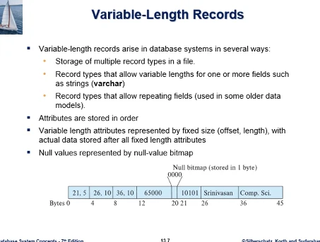  
가변길이 레코드, 파일 레코드가 가변적인게 더 일반적이다.  
가변길이 레코드가 발생하는 몇가지 이유

- 한 파일에 복수개의 레코드 타입 저장 (교재 대학 db 학과 테이블에서 교수테이블의 레코드와 학과테이블의 레코드를 한 파일에 저장할 수 있다. 성능상의 이유로...)
- 필드의 값 자체가 가변길이 (가장 긴 이름을 염두에 두고 일정크기를 할당할수 있지만 공간낭비가 있다.)
- repeating fields 레코드마다 반복되는 횟수가 다른 경우 (rdb에서는 잘x, 아래 예시에는 없다. 어떤 교수는 휴대폰 번호가 3개이고 어떤 교수는 2개라면 레코드마다 반복되는 전화번호의 필드 개수가 달라질수 있고, 길이가 달라진다.)

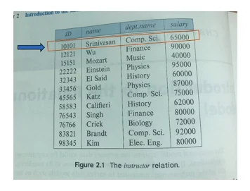  
가변길이 레코드 포멧을 보자. 이 레코드를 포맷팅한것이 자료 아래의 모습이다.  
0번부터 해서 포맷팅 결과 46바이트이다.  
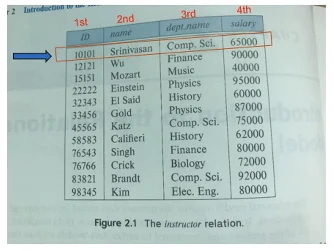  
레코드 포맷에서 필드들의 저장순서를 정해두어야 한다. (Attribute는 테이블의 칼럼, 레코드의 필드 를 말함)  
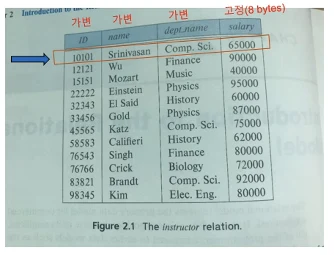  
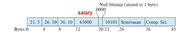  
레코드 필드는 고정길이, 가변길이가 있다. 교수테이블의 경우 급여만 8byte 고정길이. 고정길이 필드는 레코드 포맷에서 필드 저장 순서에따라 정해진 위치에 길이만큼 공간을 배정하여 값을 직접 저장한다.  
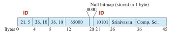  
가변길이 필드의 값은 레코드마다 길이가 다를 수 있으므로, 일정크기의 offset, length에 의해 표현되고 실제 data 값은 레코드 후반부에 attach 된다. (offset,length)은 합쳐서 고정길이에 정확히는 각각 정해져 있어야 한다.  
예시를 보면 offset = 21, length = 5 이고 레코드 시작부터 21byte 떨어진 위치에서(0번부터 20바이트까지- 21바이트), 그 다음부터 ID값이 저장되고 있다, 그 길이는 5바이트  
이 (offset,length)를 알면 해당 필드에서 레코드값 추출 가능하다.  
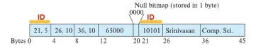  
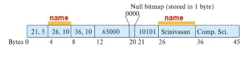  
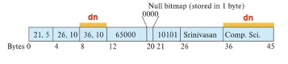  
이 위치에 가변길이 레코드가 저장되었다.  
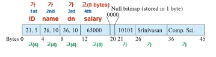
가변길이 필드는 (offset,length) 로 표현하는데. 이것은 합쳐서 고정길이를 갖는다. 예제에서는 4바이트이다. 정확히는 각각 크기가 정해져 있어야 한다.  
가변길이 필드의 데이터 값은 레코드 후반부에 attach 되고, 고정길이 필드의 데이터 값은 지정된 위치에 직접 저장된다.  
가변길이의 경우 데이터가 가변길이고 오프셋은 고정길이가 된다.

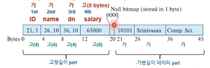  
레코드 포맷 구성은 전반부에는 고정길이part, 후반부에 가변길이 데이터값이 붙는다. 두부분 사이에 null value bitmap이 붙는다.  
테이블 튜플의 칼럼 값은 null 일수 있다. null비트맵은 각 필드의 값이 null인지 아닌지 여부를 나타낸다. 이것은 필드의 수만큼의 비트를 가지고 있다.  
예제에서는 필드가 4개이므로 4비트를 필요로 한다. 필드값이 0이라는 것은 null이 아니라는 것이다.

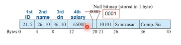  
만약 이중 1이라는것이 있으면 필드값이 null이라는것을 나타낸다.  
예를 들어서 4번째 비트가 1이면, 4번째는 급여 필드이다. 4번째 필드에 8비트가 할당은 되어있지만 그 값은 무의미하고 조회할 필요가 없다.  
어떤 필드의 값이 null이라는것을 나타내는 방식이 null 비트맵의 해당 비트를 1로 세트하는 것이지. 해당 필드에 Null문자나 약속된 값을 넣는게 아니다.

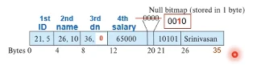  
만약 가변길이 필드의 값이 Null 이라면 어떻게 될까? 3번재 필드의 학과명이 null 이라고 해보자.
offset,length에서 length=0 이 되고, 뒷부분 학과명 데이터값을 붙일 필요가 없게 된다. 레코드는 총 36 바이트에서 끝나게 된다.

  
두번째 필드인 name이 Null이라면 이렇게 된다. id값 다음 교수명 데이터값을 붙일 필요가 없다.  
학과명의 offset=26이 된다. 총 36바이트로 포맷팅 된다.

  
예시에서 Null비트맵은 필드가 4개이므로 4비트만 있으면 된다. 하지만 레코드 포맷에서 공간을 바이트 단위로 할당하므로, null 비트맵도 바이트 단위로 할당한다. 예시에서는 1 바이트를 할당했다. 예제 20번 바이트이다.  
예제 null비트맵을 정확히 표현하면 0000xxxx 가 되지만. 뒤의 값은 의미가 없으므로 조회하지 않는다.  
만약 필드가 8개가 넘어가면 Null비트맵은 1바이트로 구성 불가능하다. 필드 수만큼 충분한 비트 수를 가지도록 여러 바이트를 할당해야 할것이다.

### 연습문제

  
문제1 : 2번째 레코드를 가변길이 레코드 포맷으로 구성, 컬럼 순서는 id,이름, 과이름, 급여 순서로 가변, 가변, 가변, 고정 이고, (offset,length) = 4byte, 급여는 고정길이 8byte 이다.  

  
문제2 : 컬럼 순서를 교재와 역순으로 구성
  

문제3 : 1번 칼럼에서 급여가 null이면 레코드 포맷은?  
  
원래 급여 내용 자리에는 어떤값이 와도 상관이 없다, 의미가 없고. 급여 칼럼이 고정길이 8byte이므로 나머지 칼럼에 대한 정보를 정확히 추출 가능하다.

이것이 공간낭비 아닌가?  
수업에서 배운 포맷으로는 8바이트 차지해야 한다. 이것은 그렇게 되어야 나머지 칼럼 정보를 정확히 추출 가능하므로.  
공간낭비를 해결하려면 포맷팅 방식을 바꿔야 한다. null 비트맵을 항상 맨 앞에 오도록.

문제4 : null비트맵이 시작되는 바이트 번호는?, null bitmap 앞에 몇 바이트가 있는가? 그 위치를 묻는것이다.  
답4 : 20번 바이트이다. 그 앞에 20개의 바이트가 있다. 질문의 의미는 null bitmap을 access할수 있다. 추출할수 있다는것이다.  

