## 2주차1st ch13

슬롯 기반 페이지 구조.  
가변길이 레코드 포맷을 배웠었다. 실제로 여러개의 레코드가 db의 디스크 블록 안에 모여서 저장될 것이다. 여러개의 가변길이 레코드들을 하나의 블록 안에 저장할때 어떻게 저장될 것인가.
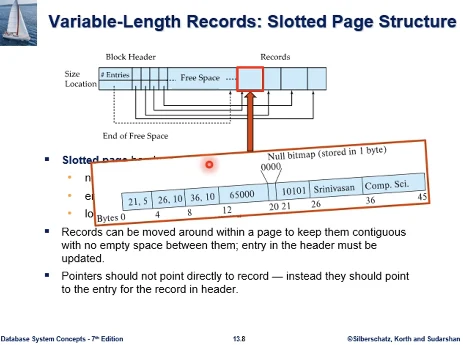

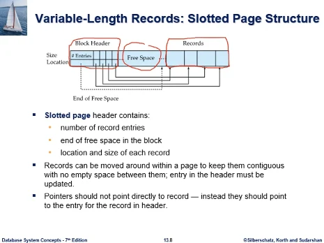  
한 박스가 디스크 한 블록이다. 4-16kb정도의 크기를 갖는다고 했었다. 하나의 블록 내에 가변길이 레코드가 여러개 모여서 들어가게 된다.  
많은 db시스템에서 널리 사용되고 있다.  
앞부분은 블록헤더, 뒷부분은 레코드, 사이에 빈 공간이 있다.

먼저 블록 헤더부분부터 보자. 헤더는 3가지 정보를 갖는다.

- 블록 내 레코드 수(정확한 의미는 뒤에서 설명)
- 레코드 삽입시에 빈공간에 삽입하게 되는데 빈공간의 끝이 어디인가? (끝부터 앞쪽으로 넣게 된다.) 이러한 포인터는 byte offset로 구현된다. 시작점부터 얼마나 떨어져있는지
- 각 레코드에 상응해서 앞쪽 헤더에 4개 자리가 있다(슬롯). 위는 size(길이), 아래는 location(시작점) 정보가 있다. 레코드를 정확히 추출할수가 있다.

레코드가 있으면 슬롯도 같은 수가 있어야 한다. 예제를 보면 슬롯순서와 레코드 순서가 일치하지는 않는다.

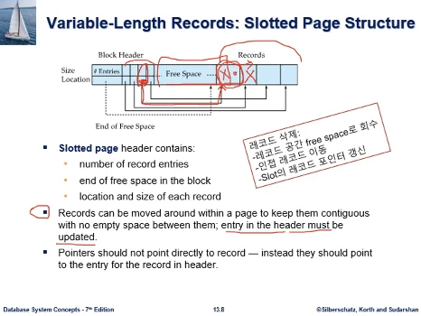  
왜 이런 자료구조를 갖는가? 레코드들은 물리적으로 인접하게 붙어있고, 레코드 사이에 사용하지 않는 빈 공간은 없다. 공간을 효율적으로 컴팩트하게 쓰자는것이다.  
만약 레코드를 삭제하게 된다면. 레코드를 차지하고 있던 공간이 빈 공간이 되어 공간사용효율이 떨어지게 되고, 앞에것을 이동시켜서 메우게 된다. 그럼 free space가 늘어나게 된다.  
레코드를 이동하면 헤더의 location은 업데이트 되어야 한다. 레코드 이동시 슬롯부분이 업데이트 되어야 하는것.  
공간의 fragmentation을 없애는 구조이다. 공간 사용효율이 높다.

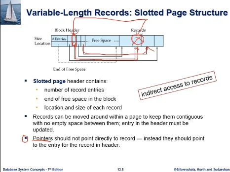  
포인터는 레코드를 직접 가리키면 안되고, 헤더에 있는 해당 슬롯을 가리켜야 한다. 설명 이 부분에서 말하는 포인터는 그림의 화살표가 아니다.  
데이터베이스 시스템 블록 외부에서 해당 레코드를 가리키는 포인터를 말한다. (인덱스처럼)  
논리적으로는 인덱스가 어떤 레코드를 가리킨다고 하면 뒤의 레코드를 직접 가리켜야 할것 같지만, 실제로는 헤더의 슬롯 부분을 포인터가 가리켜서, 내부적으로 포인터가 있어서 다시 레코드에 접근하게 된다. indirect access to records  
레코드가 자유롭게 위치를 이동할수 있다. 레코드가 삭제된다거나 하면 전체 공간을 컴팩트하게 유지하기 위해서 각각의 레코드는 위치를 이동할수가 있다. 그래서 간접적으로 레코드를 접근하는 체제가 필요하다.

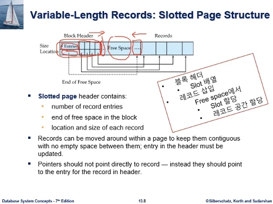  
슬롯기반 페이지구조는 많은 데이터베이스 시스템에서 널리 사용되는 자료구조이다.  
정확히 이 모습은 아니고 시스템마다 특성을 갖기는 한다.  
기본 원리는 위와 같다. 블록헤더에서 현재 레코드수, 빈공간수, 슬롯의 배열에서 각각 크기와 위치, free space, 레코드  
빈공간을 중앙에 두고 양쪽에서 이용하는 구조

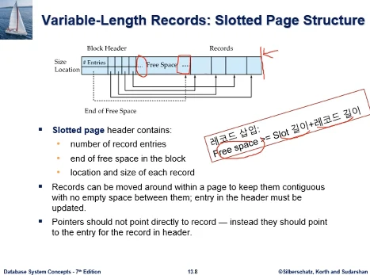  
레코드 삽입시 빈공간 앞에 슬롯이 삽입되어야 하고, 레코드가 빈공간 뒤에 삽입되어야 한다.  
삽입할때 레코드길이 뿐 아니라 슬롯길이 까지 고려하여 그것을 합한 길이가 빈공간보다 작아야 삽입이 가능하다.

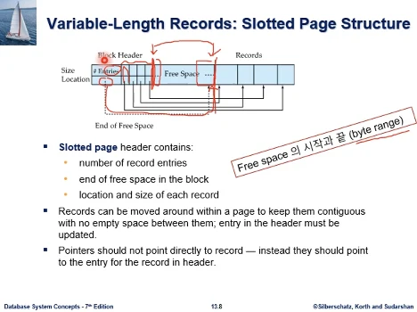  
레코드를 삽입할때 저장시스템은 free space의 위치를 정확히 알아야 한다. 앞은 슬롯을 할당할 자리, 뒤는 레코드자리.  
그래서 free space가 어디부터 어디까지인지 byte range를 정확히 알아야 한다.  
지금 교재 헤더에 보면 점선으로 된 포인터가 끝을 가리켜 주고 있고.  
현재 슬롯이 몇개인지 알고있고, 슬롯길이를 알고있으므로 앞쪽 계산이 가능하다. 앞을 가리켜주는 포인터를 헤더에 넣을 수도 있다.

그래서 레코드 삽입시에 공간이 충분한지 따져야 하는데. 교재 헤더구조에 빈공간이 얼마인지 명시적으로 저장하는 필드는 없다. 그걸 만들어둘수도 있지만. 앞뒤 위치를 알고 있으므로 판단이 가능하다.

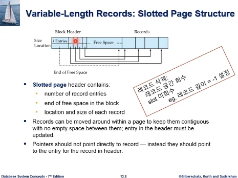  
레코드 삭제의 경우, 레코드가 삭제가 되면 그 빈공간을 활용하기 위해 앞의 레코드들이 이동하고, 이동포인터를 업데이트 한다고 했다.  
그런데 레코드가 삭제되었을때 해당 슬롯은 그냥 내버려 둔다. 슬롯을 없애게 되면 다른 슬롯을 이동시켜서 빈공간을 컴팩트하게 해야 하는데. 외부에서 인덱스같은 것이 슬롯을 가리킨다고 했었다. 이런 상황에서 문제가 생기게 된다.  
그래서 레코드는 삭제하지만 슬롯은 그대로 둔다.  
해당 레코드가 없어졌으므로 포인터는 무의미해지고 슬롯이 삭제된것을 가리킨다는 것은 길이에 (-1)을 넣는다던지 해서 표시를 한다.  
미사용 슬롯은 새로운 레코드 삽입시 활용 가능하다.

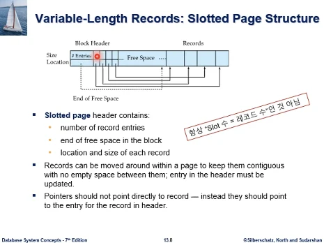  
그래서 이것에 관련하여, #Entries는 슬롯의 개수를 의미하게 되는데, 이것이 레코드수와 같지는 않을수도 있다.  
레코드 수는 별도 필드를 둘수도 있고, 레코드 length을 스캔해보면, 레코드 삭제후 특별한 값(-1)을 표시한 값이 있는 슬롯을 빼면 레코드 길이를 알 수도 있다.

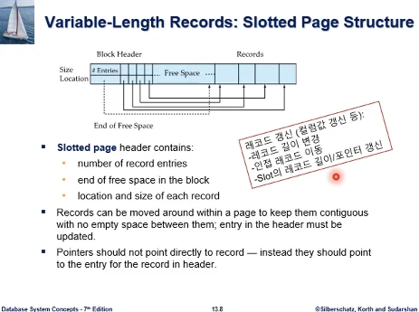  
레코드 값이 업데이트 될수도 있다.  
가변길이 레코드이므로 레코드 길이에 변화가 올수도 있는데, 공간을 컴팩트하게 쓰기 위해서 인접 레코드가 위치를 이동하게 되고, 슬롯의 레코드 포인터를 업데이트 해주고, 슬롯의 레코드 길이를 업데이트 하게 된다.

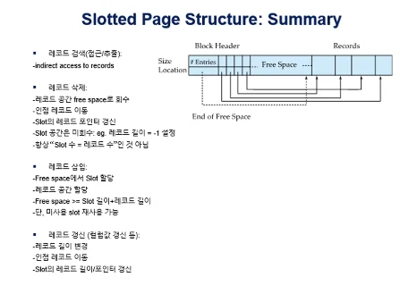  
전체적으로 모아서 연산별로 정리해보자.

- 레코드 검색은 슬롯을 통해서 indirect access 한다고 했었다.
- 레코드 삭제는 레코드가 차지하던 공간은 free space로 회수하고, 슬롯 공간은 회수하지 않는다. 다만 레코드 길이는 레코드를 가리키는걸 아니라는걸 표시하기 위해서 약속된 값(-1)로 표시한다. 그래서 슬롯의 수가 항상 레코드수와 같지는 않다.
- 레코드 삽입은 free Space에서 슬롯 공간과 레코드를 저장할 공간을 할당해서 삽입하게 된다. Free space >= slot 길이 + 레코드 길이. 다만 앞에서 삭제할때 미사용 표시한 슬롯은 할당하지 않고 재사용 가능
- 레코드 갱신은 레코드 길이에 변화가 와서 인접 레코드들이 이동하게 되고, 슬롯 배열에 업데이트가 일어나게 된다.

### 연습문제

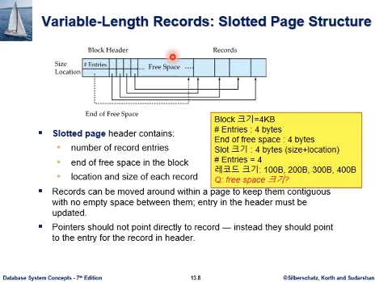  
문제1  
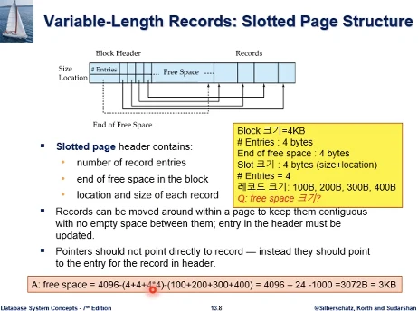

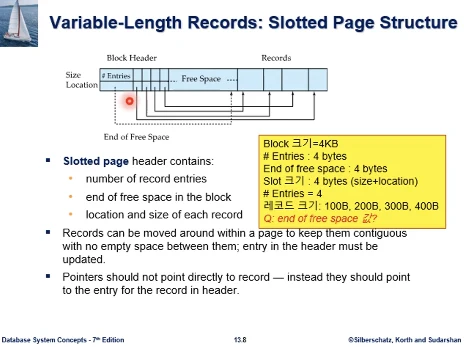  
문제2  
헤더의 end of free space 필드에 들어갈 값을 묻는것이다  
header + free space = 24 + 3072(앞에서 나왔다) = 3096, 0번부터 시작이므로 마지막 위치는 3095byte에 해당한다.  
end of free space = 3095(마지막 byte 가리킴)

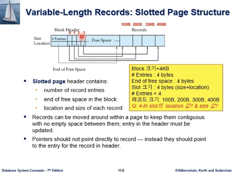  
문제3  
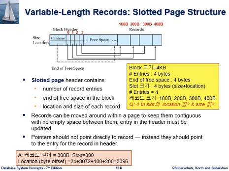  
size는 화살표를 따라가보면 300, location은 byte offset으로 시작에서부터 레코드 시작까지의 크기를 알면 된다.  
header(24) + free space (3072) + 100(레코드) + 200(레코드) = 3396, 0번부터 시작한다고 하면 3396byte 부터 레코드가 시작하게 되는 것이다. 그 앞이 0-3395 이므로

## 2주차2nd ch13

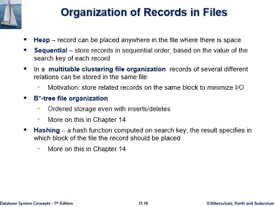  
파일의 레코드들을 어떻게 Organization할것인가? 이것은 파일구조의 문제다. 여러 레코드들을 어떻게 저장할 것인가?
Heap(어원 - 장작더미)

- 레코드를 빈공간이 있는 블록 내에 순서없이 저장, 기본

sequential

- 레코드들 간에 순서 부여, 순차 파일구조 ( 학생 테이블 - 학번순, 정렬의 기준은 각 레코드의 탐색 키)

multitable clustering file organization

- 여러 테이블이 있는데 각 테이블별로 별도의 파일을 배당하는 것이 아니고, 여러 테이블별로 한 파일에 넣는다. 성능 향상을 위해서 (교수 테이블, 학과 테이블, 같은 과 교수의 레코드를 학과와 같이 저장. 그렇게 하여 접근할때 발생하는 disk io 최소화)

B+tree(db 인덱스로 널리 쓰임) ,hashing은 다음 챕터에서

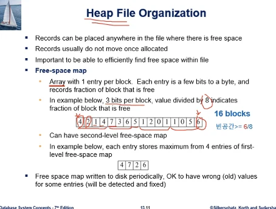  
레코드들은 빈 공간이 있으면 어디든 저장될수가 있다. 순서가 없으므로.  
레코드들은 할당이 되면 잘 움직이지 않는다. 페이지 내에서 이동을 안한다는 것이 아니다.(슬롯 기반 페이지 구조 안에는 움직였었다) 힙 파일을 구성하는 여러 블록들간에 이동하지 않는다는 것이다. (순서가 중요하지 않으므로 이동할 일이 많지 않다.)  
파일의 레코드들이 정렬하는 경우가 있을 수 있는데, 이때 블록간의 레코드 이동이 크게 일어날 수 있다. 그런데 힙 구조는 원래 순서가 없고, 정렬하는 의미가 없다.

힙 파일에 레코드를 삽입하는 경우 어느 블록에 빈공간이 있는지 효율적으로 알아내는 것이 중요하다. 순서개념 없고, 어디든 상관없으나 공간은 충분해야 한다.  
이것때문에 Free-space map이라는 자료구조로 각 블록별 빈공간 상태정보를 유지하게 된다. 이것은 기본적으로 배열이라고 생각하면 된다.

예제를 보면  
배열크기 16은 힙 파일을 구성하는 슬롯기반 페이지 블록들이 16개 있다는 것이다. 실제로는 이것보단 크다.  
각 블록별로 배열에 값을 가진것인데. 해당 블록의 빈공간 상태가 어떤지 나타낸 것이다.  
배열에 각각 값을 3비트씩 할당해서 표현한 것이다. 2^3 = 8인데, 만약 값이 6이라고 하면, 빈공간 >= 6/8 이라는것, 최소한 6/8만큼의 빈공간이 있다.

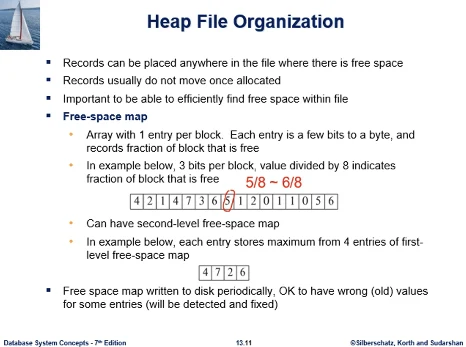  
다른 블록의 예를 보면 5라고 쓰인 블록이 정확히 얼마인가 말하는것이 아니라 최소한 5/8만큼 있다는 것이다. 이것보다 더 있을수 있다. 그러나 6/8만큼은 아니다.

그래서 free space map의 값을 8로 나누었는데, 이것은 블록당 3비트를 할당해서 그렇다. 비트수가 많아지게 되면 더 정교한 표현이 가능해진다.

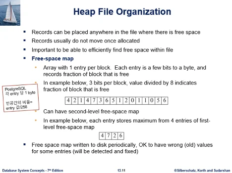  
교재에서는 PostgreSQL의 예를 들었는데, 각 엔트리당 1byte를 할당했다. 그러면 8비트가 되므로, 엔트리의 값은 0-255값을 가지게 된다. 빈공간의 값을 256으로 나누어서 표현할 수 있다.

레코드를 삽입할때 삽입에 필요한 공간정보가 주어질텐데, 레코드 자체길이 + 슬롯길이 등.. 그걸 충족할수 있는 후보 블록을 이 map을 보고 찾을 수 있을것이다. 그 중 하나에 가서 삽입하면 된다.

그런데 실제 상황에서는 블록이 굉장히 많아서 배열의 크기가 커질것이다. 스캔 작업도 부하가 있을것이다.  
그래서 second level free space map을 만든다. 예제는 4개씩 묶은것이다.  
4개씩 묶어서 가장 큰 값을 쓴다. 4,7,2,6 에서 값이 7이면, 7/8인 블록이 최소 한개는 있다는 것이다.

예제에서는 배열 길이가 1/4가 되었는데, 실제로는 map의 길이가 더 길고, 그래서 단축 효과가 더 클 것이다. second level에서 공간요건 충족하는 블록을 검토하고, 다시 원래 공간에 가서 재검토하는 방식이다.

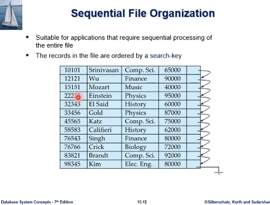  
순차파일구조는 레코드들간 순서가 있다고 했었다. 과제로 구현할 자료구조이다  
파일구조상에서 순서구현 방법은 링크를 구현하여, 링크드리스트처럼 구현  
만약 Einstein 레코드에 접근하려면, 처음 레코드부터 순차적으로 접근해야 한다. 교수 이름은 동명이인이 있을 수 있으므로 결국 끝까지 접근해야 한다.(파일의 모든 레코드를 순차적으로 접근하는 연산이 많이 발생하는 경우 유리)  
특정 레코드 하나만 검색할때는 효율적이지 않다.  
예제에서 레코드의 논리적 순서와 물리적 순서가 일치하는 상태가 되어있으나, 항상 이런것은 아니다. 테이블이 초기화될때는 이런 모습일 수 있다.

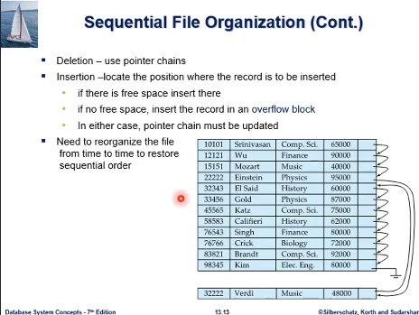  
순차파일구조에서 삭제 삽입.  
새 레코드를 삽입하는 과정은

- 그 레코드가 삽입되어야 할 정렬 순서상의 위치를 알아야 하고, 알아내는 과정은 파일 레코드 자체가 순차적 접근만 허용하므로, 첫번째 레코드부터 링크를 쫓아서
- 하나의 표처럼 그림이 되어있으나, 여러 레코드들이 하나의 슬롯 기반 페이지 안에 들어가 있다. 새 레코드가 저장될 위치가 있는 페이지에 링크대로 저장해야 하는데
  - 빈 공간이 충분하다면, 그 곳에 레코드를 삽입하고, 링크는 업데이트 해야함
  - 공간 부족시, 임시 저장 장소인 overflow block을 마련해서 레코드를 저장, 그림처럼 overflow block을 향하게 링크 update
- 삽입할 페이지에 공간이 있든 없든 chain은 수정이 되어야 한다.

레코드가 삭제되는 경우는 링크드 리스트에서 했던것처럼 포인터를 조정하여 할 수 있다. 다만 레코드들이 메모리에 적재된 것이 아니라 디스크 블록에 있다는 점은 감안해야 한다.  
과정을 거치다보면, 다음 레코드의 링크 자체가 복잡한 형태를 띄게 된다. 레코드 검색시 검색 성능에도 영향을 끼치게 된다.

예를 들어 Verdi 레코드 검색 시 링크를 순차적으로 접근하는데, 이전 레코드들이 같은 블록에 있다면 IO한번에 링크를 쫓아오게 된다. 그러나 오버플로우 블록에 간다고 하면, 다른 블록에 존재하므로 IO를 또 해서 버퍼로 읽어들여야 한다. 그리고 그 다음 레코드가 또 다른 블록이라면 또 IO 해야 한다.

삽입과 삭제가 많이 일어날수록 파일의 검색성능을 저하시키고, 공간사용 효율을 떨어뜨리는 문제가 누적된다. 그래서 reorganize 해야함.  
주기적으로 or 삽입 삭제 연삽 빈도를 감안하여 파일을 reorganize 해야하는 부담이 따르는 자료구조이다. 처음 테이블이 초기화 되었을때 모습처럼 순차적인 레코드들이 물리적으로 인접한 형태로 재구성된다. 이것은 파일의 용량이 크므로 상당한 시간적인 오버플로우로 작용

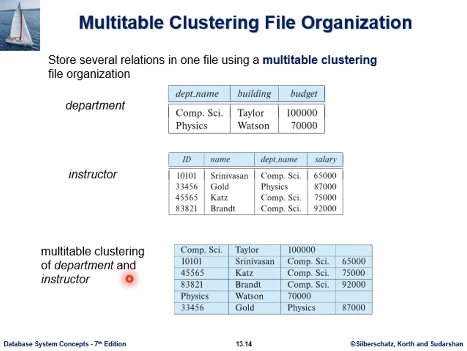  
세번째 파일구조인 multitable clustering file organization  
보통 데이터베이스에 저장시스템을 구현한다고 할때, 각 테이블별로 별도의 파일을 할당하는 방식을 생각할 수 있다. 테이블 당 복수개의 파일을 배정하는 방식을 생각해볼수 있다.  
그런데 이 방식은 논리적으로 다른 테이블의 레코드를 동일한 테이블에 저장하는 것이다.

레코드가 너무 많다면 레코드들을 분할아여 테이블당 복수개의 파일을 배정한다. 레코드의 format이 이질적인데 한 파일에 저장되어 있다.

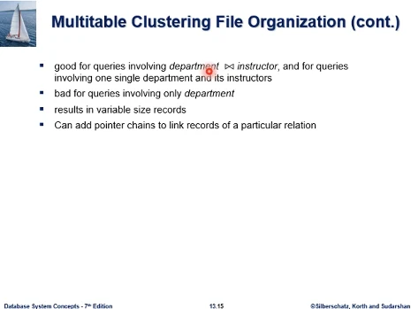

- 왜 이런 클러스터링을 할까? 이 파일구조로 효율적인 질의가 있다. 그런 질의 빈도가 높다면 이 파일구조는 효율적인 자료구조가 된다. 나비모양 기호는 자연조인을 나타낸다.
- 학과 테이블의 레코드만 접근해서 질의결과를 얻는 경우 파일 내에 교수테이블 레코드와 섞여있어서 학과 레코드만 골라내야 하는 추가적인 작업 발생, 이런 질의에는 좋지 않다.
- 파일 내의 레코드들은 자연히 가변길이 레코드가 된다. 레코드 format이 다르므로.
- 특정한 테이블의 레코드만 접근하는 것에 문제점이 있다. 특정테이블의 레코드들은 그들간의 링크를 연결해서 접근할 수 있게 하는 보완 방법이 있다.

학과 레코드, 교수 레코드를 물리적으로 인접한 곳에 저장한다. 저장할때 join이 수행된 형태로 저장되었다고 볼 수 있다.  
이 레코드들이 모두 같은 페이지에 있다면, 블록IO를 한번만 하고도 그 결과를 찾을 수 있다.

의문점으로, 만약 교수 테이블만 별도 파일에 저장한 기존의 경우라면, Comp.Sci 한 학과에 대해 검색하는 일이 상대적으로 쉽다. 그런데 섞어두면 검색이 어려워지는 것이 아닌가?? 아니다 오히려 유리하다, 한 학과만 묶어서 클러스터링을 해두었기 때문이다.

### 연습문제

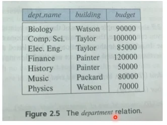  
  
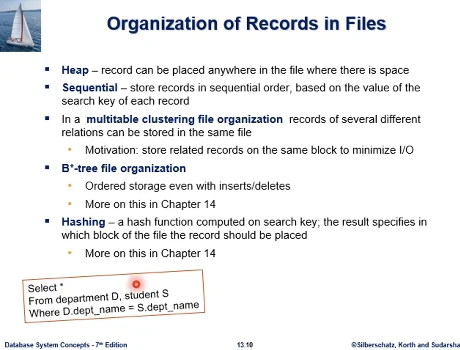  
문제1 : 학과와 학생을 과 이름으로 조인하는 질의이다. 이 질의처리를 생각해볼때, 어느 파일구조를 가질때 가장 유리한가?  
답은 Multitable Clustering 파일구조

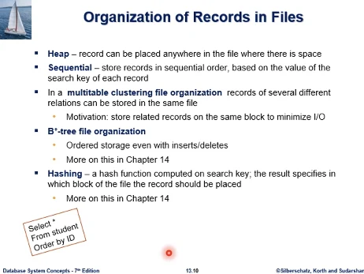  
문제2 : 학생 테이블에서 어떤 파일구조로 위 질의를 처리할때 가장 효과적인가?  
답은 순차파일. where절에 조건이 없고, 모든 레코드를 검색해야 하고, 요구되는 순서가, 파일 구조가 순서를 지원하고 있다.

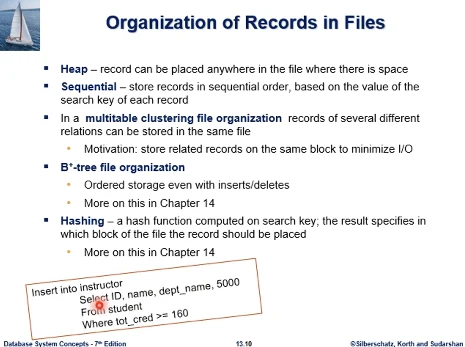  
문제3 : 수강학점 160이상인 학생을 강사자격 부여하는, 학번은 교수id로 급여는 5000, 위 insert를 효율적으로 수행하기 위해서 교수 테이블이 어떤 파일구조여야 하나?  
답은 Heap 파일구조, 선택된 학생레코드를 삽입하는데 heap은 레코드간 순서개념이 없고 아무데나 들어갈 수 있다. 순서제약이 없어서 효율적일 수 있다. 순차파일이라면, 학생Id가 교수 id로 삽입되어야 한다. 선택된 학생의 id는 순서에 맞지 않고 랜덤일 것이다. 삽입을 할때 id값 순서를 지켜야 하기 때문에 삽입은 효율적이지 않을 가능성이 높다.

## 2주차3rd ch13

Data Dictionary storage

Data Dictionary 저장에 대해서 공부한다. Data Dictionary란 db에 저장된 데이터 (대학db 예시의 경우 11개 테이블, 그 테이블의 레코드들이 파일에 저장되어 있다. 이 데이터에 대한 데이터, metadata를 저장하는 곳을 말한다) 시스템 카탈로그 라고도 한다.  
메타데이터의 예시

- 테이블에 대한 메타데이터
  - 각 테이블에 대한 정보, 테이블 이름
  - 여러 컬럼의 이름, 데이터 타입, 길이
  - 가상 테이블(view)의 이름과 정의
  - 제약사항 (db의 데이터는 제약사항을 지키며 삽입되어야함)
- db시스템 사용자정보, 비번정보, 사용에 대한 과금위한 정보..(계정정보 아닌가)
- 통계 데이터(각 테이블별 레코드 수, 삽입 삭제에 따라서 변경될 것이다. sql질의 최적화 전략 수립에 사용)
- 물리적인 저장 구조에 대한 정보
  - 각 릴레이션이 어떤 파일 구조로 저장되어 있는가
  - 각 테이블이 물리적인 저장장치 어느 위치에 있는가
- 인덱스에 대한 정보

데이터베이스는 데이터뿐 아니라 메타데이터도 가지고 있어야 작동하게 된다.

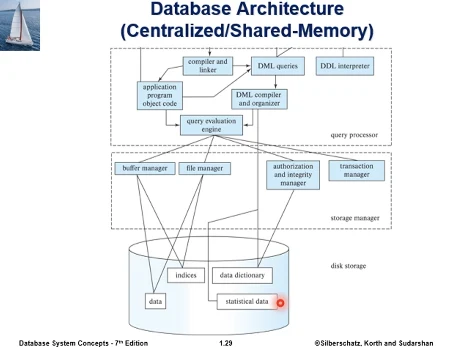  
앞에서 본 이 그림에서도 파일에 저장되는 데이터 외에 data dictionary, statistical data로 표시되어 있다.

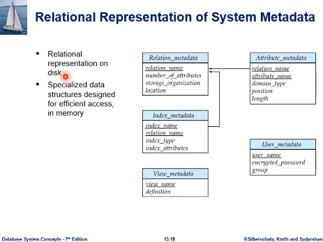  
rdb의 경우 메타데이터는 일반 데이터와 같이 테이블에 저장할 수 있다.  
예시에 보면, 릴레이션 메타데이터 (테이블이름, 칼럼수, 테이블 저장하는 파일구조, 저장시스템 어디에서 접근가능)가 있다. 실제로는 메타데이터 정보항목이 더 많다.  
그 왼쪽에는 Attribute metadata에서 테이블의 모든 컬럼 각각에 대해 정보를 저장하고 있다. (컬럼이 어느 테이블 소속인지, 컬럼이름...)  
그리고 인덱스가 만들어지면 그 정보가 아래에 있고, 뷰 정보, 사용자 정보가 있다.  
이런 정보가 디스크의 일반 테이블과 마찬가지로 테이블로 저장되어 있다. 그래서 sql문으로 검색해볼수 있다.  
db 시스템이 구동을 시작하면 db에 대한 데이터 접근은 메타데이터 정보를 알아야 접근이 이루어진다. 그래서 빈번하게 접근하는 내용이 된다. db시스템이 구동되면 이 정보들은 메모리 버퍼로 먼저 불러들여서 메모리에 적재시켜놓고 동작한다. in memory에 효율적인 자료구조로 metadata를 적재시킨다
