## 4주차 1st ch14

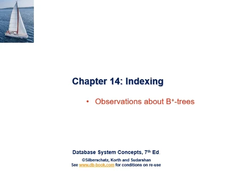  
b+tree 에 대한 observations

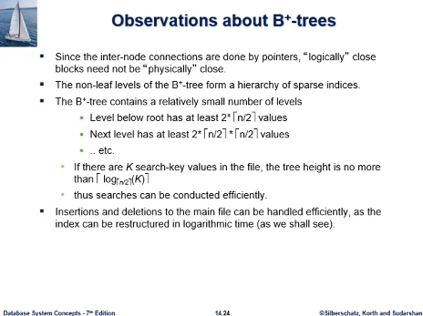

- 노드들은 포인터로 연결되어 있다. 논리적(부모자식,형제)으로 인접한 블록들이 물리적으로는 그렇지 않을수도 있다.
- 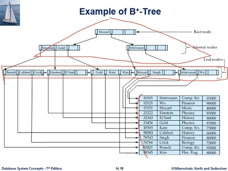
- b+Tree의 non leaf 노드들은 multi level sparse를 구성하고 있다. 리프노드 자체가 데이터 파일의 탐색키와 대응되는 첫 레벨 인덱스라고 볼수 있다.

- b+tree의 높이가 그렇게 높지 않다. 만약 k개의 search key가 있다면 최대 높이가 ceil(log\_(ceil(n/2) (K))) 이다. 레코드가 100만개라고 해도 n이 수백이라면 높이는 3-4 이정도로 높지 않다.

이것이 search 가 효율적으로 수행되는 요인이 된다.  
검색성능에 있어서는 좋은데, 데이터에 삽입삭제가 일어날때, 인덱스 유지보수 부담이 어느정도로 작용하는가? 이것도 효율적이다. 시간복잡도가 log time

### 연습문제

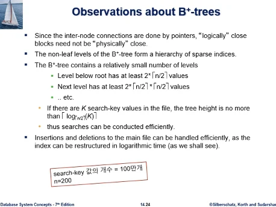  
문제1 : b+tree 높이 상한값은?  
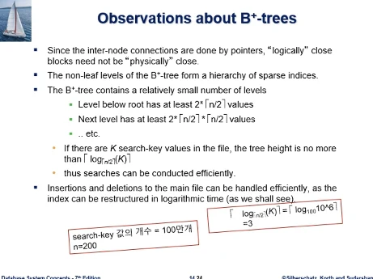

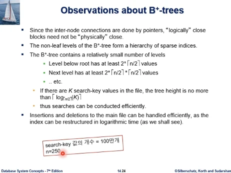  
문제2 : n=250이라면?  
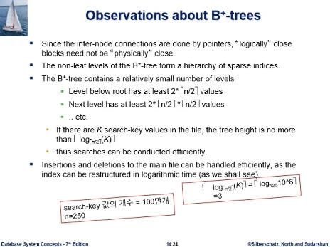  
데이터파일에 레코드가 있고, b+tree 리프노드에 탐색키가 있다. 이 레코드 수는 최소한 탐색키 개수보다 적지는 않다. 만약 탐색키가 고유식별자라면 레코드 수와 탐색키 수가 같다. 탐색키 값의 수가 100만개라는건 테이블의 레코드수가 100만개는 된다는것인데 매우 큰 테이블이다. 그에 반해서 b+Tree 높이가 높지는 않다. 그 이유는 식에서 n 값(branching factor)가 매우 큰 탐색트리여서 그렇다.

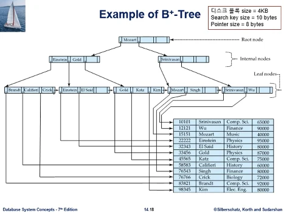  
문제3 : 이 그림에서 n=4이다. n이 매우 작은 예시이다. 만약 주어진 정보가 위와 같다면 n 값은?  
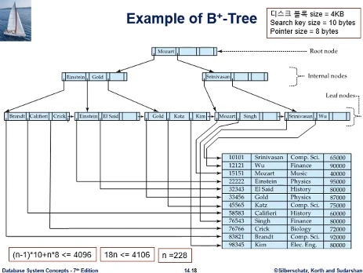  
답 : (n-1)\*10 + n\*8 <= 4096 을 풀면 된다.  
4096은 노드 크기, n-1은 각 노드의 탐색키 최대 수다. n은 각 노드가 가지는 포인터의 최대 개수다. 이 합이 노드 크기를 넘어서면 안된다. n은 정의상 정수여야 한다.

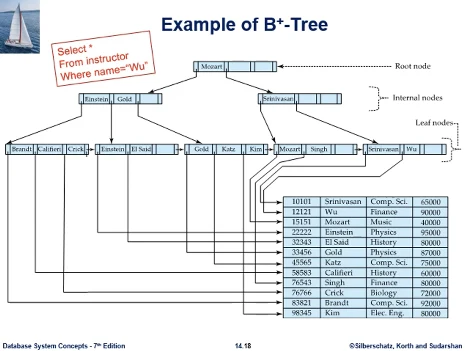  
문제4 : 교수 이름에 대한 b+Tree인데 동명이인은 없다고 가정한다. 위 질의를 처리할때 필요한 io 수는? 이 문제를 풀때 데이터파일의 bf를 알아야 할까? 상관이 없을까?  
답 : 교수 이름이 고유식별자처럼 동명이인이 없다고 했으므로, 찾는 레코드는 1개뿐이다. 그래서 bf를 몰라도 io횟수 구하는데 문제가 없다. 한 레코드 크기를 한 블록의 크기보다 작다고 하면 데이터 파일의 bf와 무관하게 찾는 레코드는 어떤 한 블록에 들어가 있다. b+Tree인덱스를 통해서 해당 블록 1개만 access 하면 된다.  
답은 4번의 IO이다. b+tree 높이가 3이고, 데이터 파일 블록 1블록 그래서 4번.

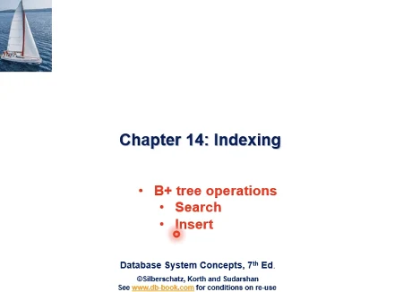  
b+Tree 연산

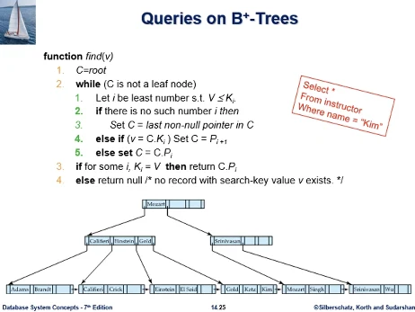  
b+tree에서 특정 search key를 검색하는 과정을 나타낸 것이다. v값을 갖는 레코드를 찾을때 쓴다. 항상 탐색은 루트노드에서 시작하고 반드시 리프노드에 가서 종료가 된다. 그래서 while루프를 돌면 leaf 가 아닌 한 계속 loop를 돈다.

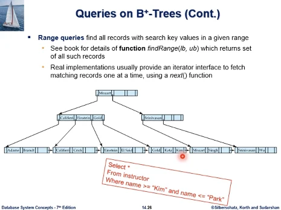  
b+tree가 range query도 잘 지원한다. 위와 같은 내용이 있다고 할때, Kim을 찾고, 링크를 쫓아서 다음 노드로 계속 간다. Park의 값을 넘어서는 데까지 간다.

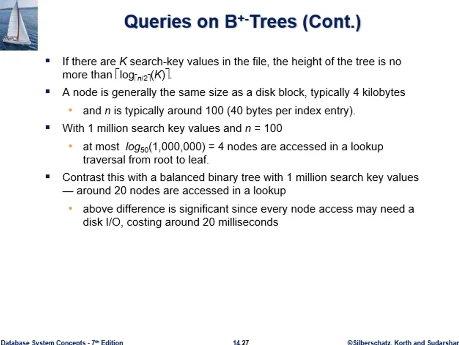  
b+tree 검색의 가장 중요한 성능을 좌우하는 것은 b+Tree의 높이이다. 상한 계산을 이전에 공부했었다.  
왜 검색 성능에 결정적인가? 모든 검색이 루트에서 리프까지 진행되므로.  
높이 상한값 공식에서 n값을 알려면, 연습문제에서도 했지만. 노드 크기를 알아야 하고, 인덱스 엔트리 크기를 알아야 한다.

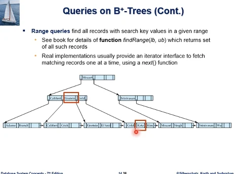  
노드 크기는 각 노드가 디스크 블록이므로 4kb이고, 인덱스 엔트리는 탐색키와 포인터 크기 합이다.  
인덱스 엔트리를 예를들어서 40바이트라고 하면 n은 100정도 나오게 된다. 그럼 search key가 1million이라고 하면 n=4이다. 높이가 높지 않다.  
반면 이진 탐색트리를 균형트리로 하면 높이가 20정도가 나온다.

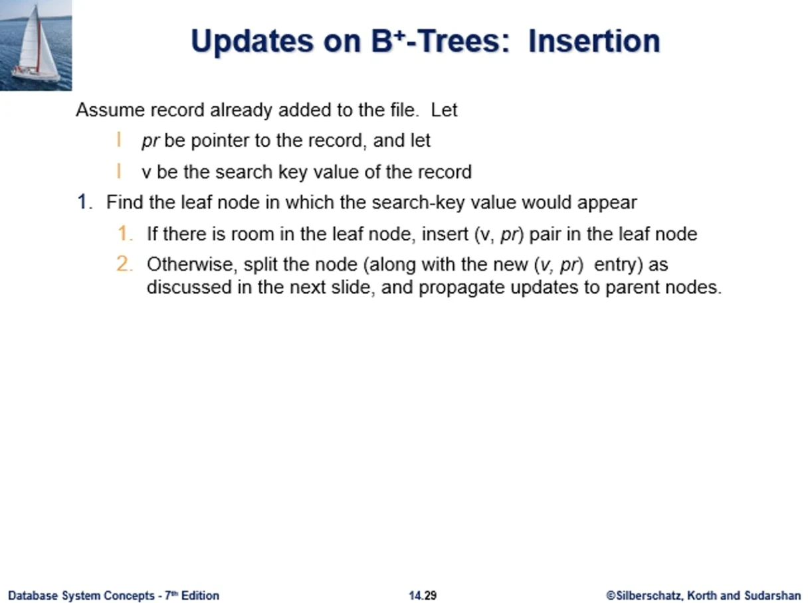
b+tree업데이트 삽입  
데이터파일에 레코드가 하나 삽입이 됨으로 인해서 b+트리에 삽입이 일어나야 하는데  
삽입된 레코드를 가리키는 포인터가 pr, 삽입된 레코드의 search key가 v 이다 그러면,
(v,pr) 엔트리가 b+tree에 삽입되어야 한다

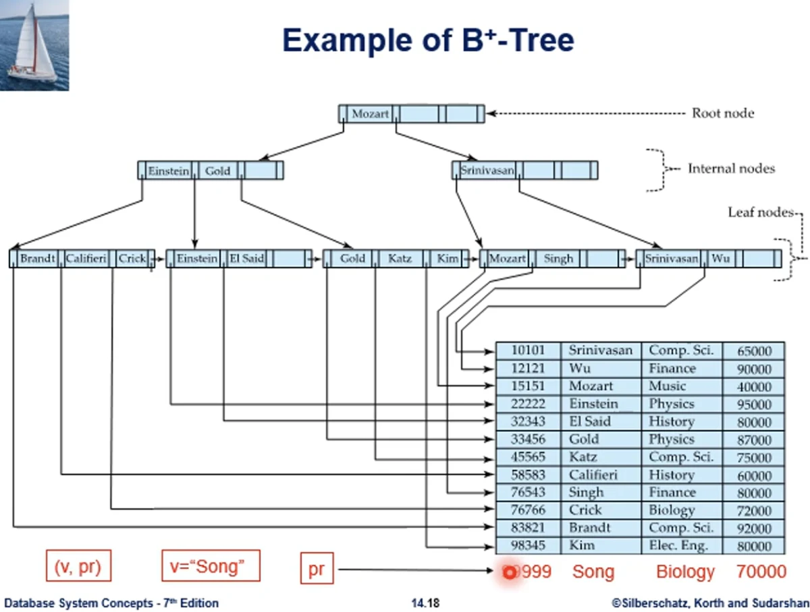
예를들어서  
그림과 같은 레코드가 삽입이 된다면  
search key = 'Song'  
(v,pr) 엔트리가 삽입되어서 가리키게 해야하는 상황이다

두가지 경우가 있다.  
첫번째는 간단한 경우로서, search key 값을 가지고 루트부터 리프까지 검색을 한다. (v,pr) 엔트리가 들어가야 할 리프 노드에 도달하게 될거고, 리프노드에 빈공간이 있다고 하면, 그곳에 삽입하고 종료한다  
빈공간이 없을때 문제가 되는데. 자료에 노드의 분할 알고리즘에 대한 이야기가 있다.

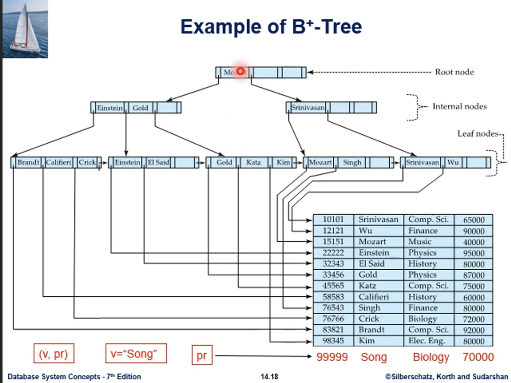
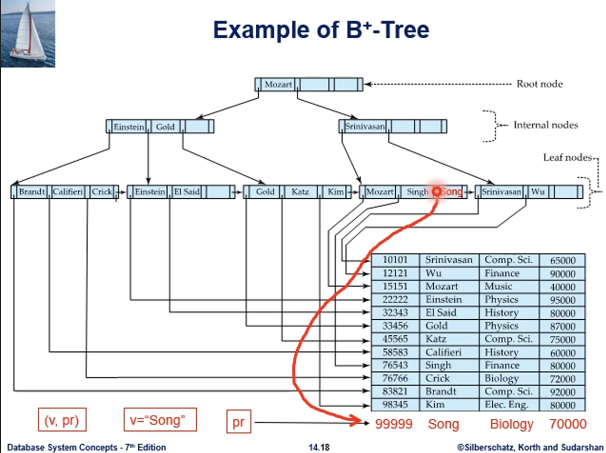
Song 이라는 값을 삽입해야 하므로 위부터 탐색한다.  
모차르트부터 크니까 오른쪽, Sri- 보다 작으므로 왼쪽으로 와서,  
리프노드에 도달해서 정렬순으로 보면 Mozart, Singh 다음인데, 마침 빈자리가 있다.  
이 경우는 단순하게 Song을 삽입하고, 레코드포인터 pr이 주어진걸 넣으면 이것으로 종료가 되는것이다.

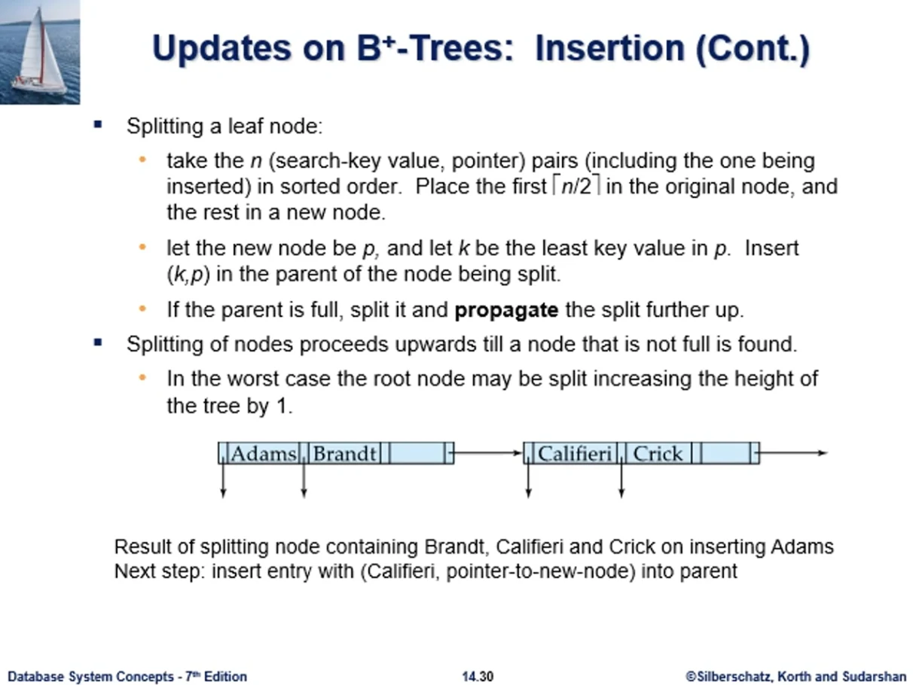
문제는 공간이없어서 노드를 분할해야 하는 상황이다.  
리프노드에 왔는데 빈공간이 없다고 하면 노드를 분할하게 된다.

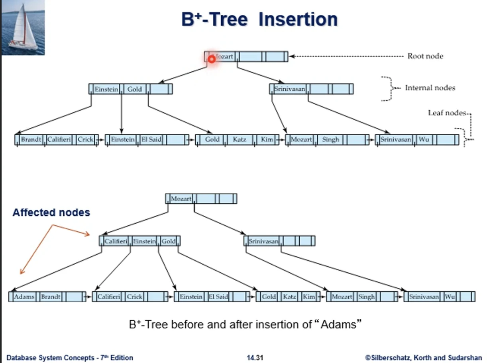
예를 들어서  
Adams를 삽입하는 예제이다. M보다 작고, E보다 작아서 가장 왼쪽 노드에 Adams가 들어가야하는데 빈공간이 없으므로 분할한다.  
결과적으로 아래와 같이 된다.  
결과를 보면 루트노드와 자식노드는 형태가 그대로 있고, 리프노드가 여섯이 되었다. 리프노드가 오른쪽 형제노드가 하나 더 생긴것이다.

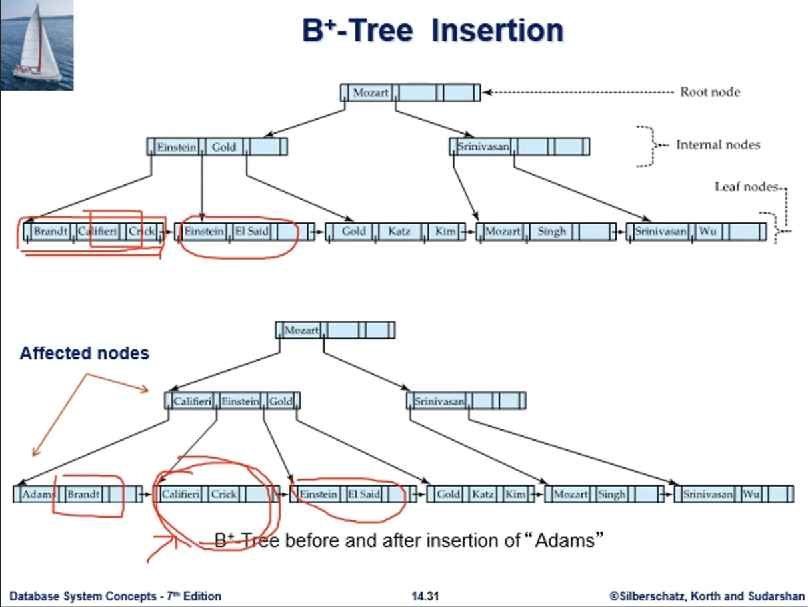
원래 물리적으로 같은 노드와 그것의 오른쪽 노드들은 그대로이고, 오른쪽에 노드가 새로 할당된 노드이다.  
오버플로우 노드의 오른쪽 형제노드를 만들게 된다.

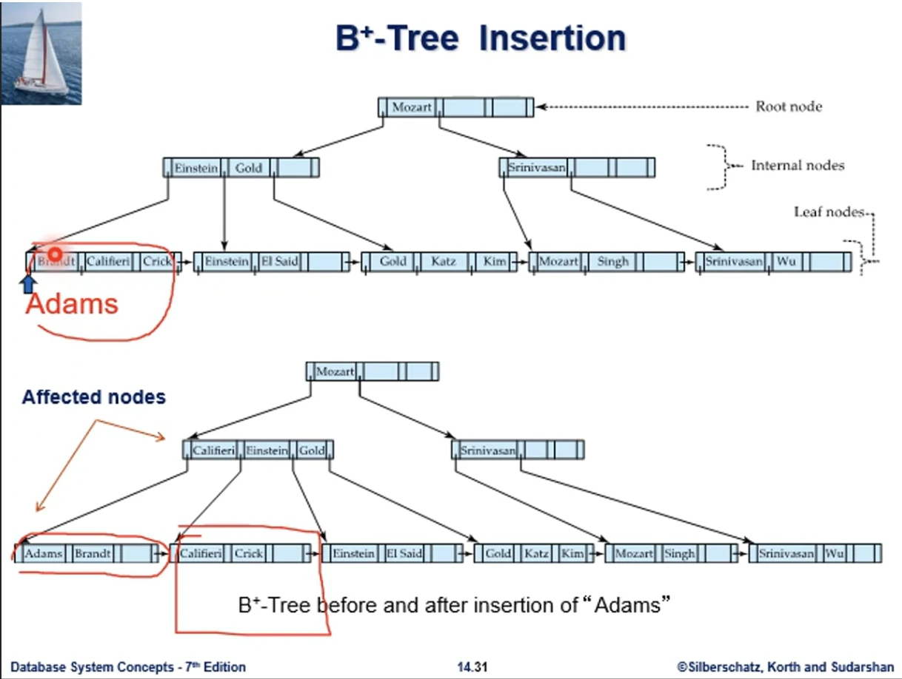
4개의 키가 있으니까 순서대로 2개씩으로 나눈다

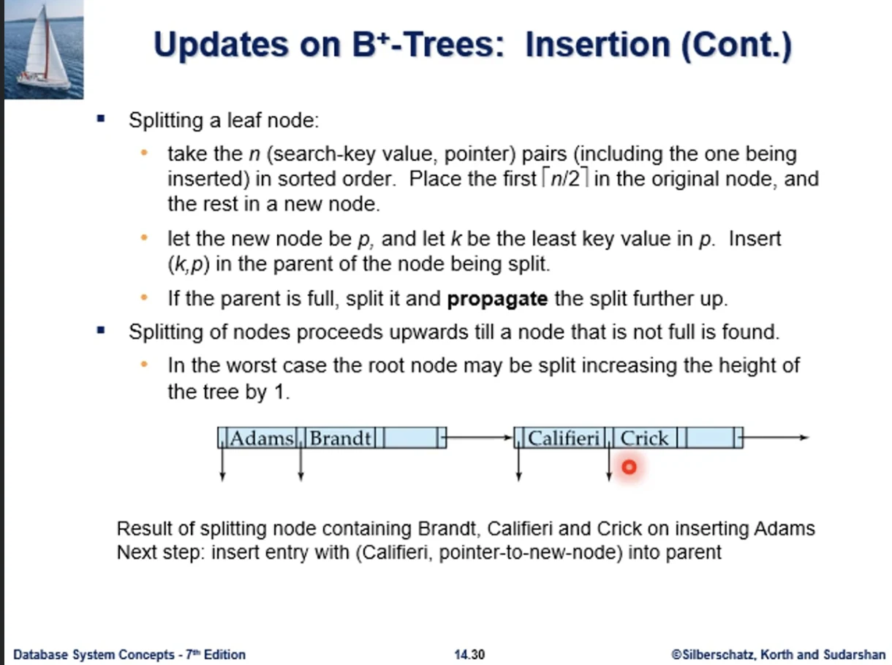
그래서 알고리즘을 기술한 것인데, 원래 리프노드에 맥시멈으로 들어갈수 있는게 n-1개 키값인데, Adams가 와서 n개가 되어서 오버플로우 발생.  
n개를 정렬순으로 n/2개씩 나눈것이다.  
방금 본 예제가 n=4이므로 ceil(n/2) 이므로 원래 노드에 2개가 남고, 오른쪽 형제노드에 2개를 넣는다

중요한것은 오른쪽에 새로 형제노드가 생겼으므로, 부모노드에서 왼쪽, 오른쪽 자식하고 분기를 해주어야 한다.  
insert parent node에 (k,p) 엔트리를 삽입하라고 해서, k는 search key 값이고, p는 새로 할당해준 형제노드를 가리키는 포인터이다.

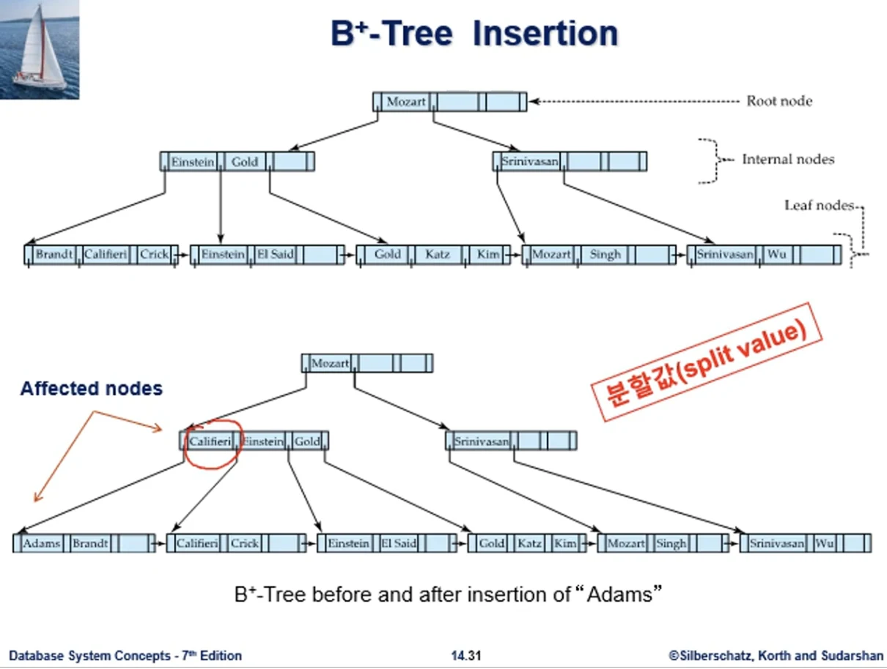
오른쪽에 형제노드가 새로 할당되다보니, Califieri 값으로 이것보다 작거나 큰 값들로 구분해주는 역할이 필요하다.  
이와같이 non leaf 에 있는 값들을 search key라고도 하지만, 분할값(split value)라고도 한다.  
이것은 위에는 없던 entry인데 구분하기 위한 분할값이 부모노드에 삽입이 된 것이다.  
알고리즘상으로 마지막에 체크할것은 분할값을 가진 엔트리가 들어갈 자리이다. 부모노드 어디에 삽입할까? 이것이 정렬순으로 되어야 한다.  
방법은 오버플로우가 난 노드를 가리키는 포인터의 오른쪽에 엔트리를 넣는것이다. 항상 그렇게만 하면 정렬순이 유지가 된다.

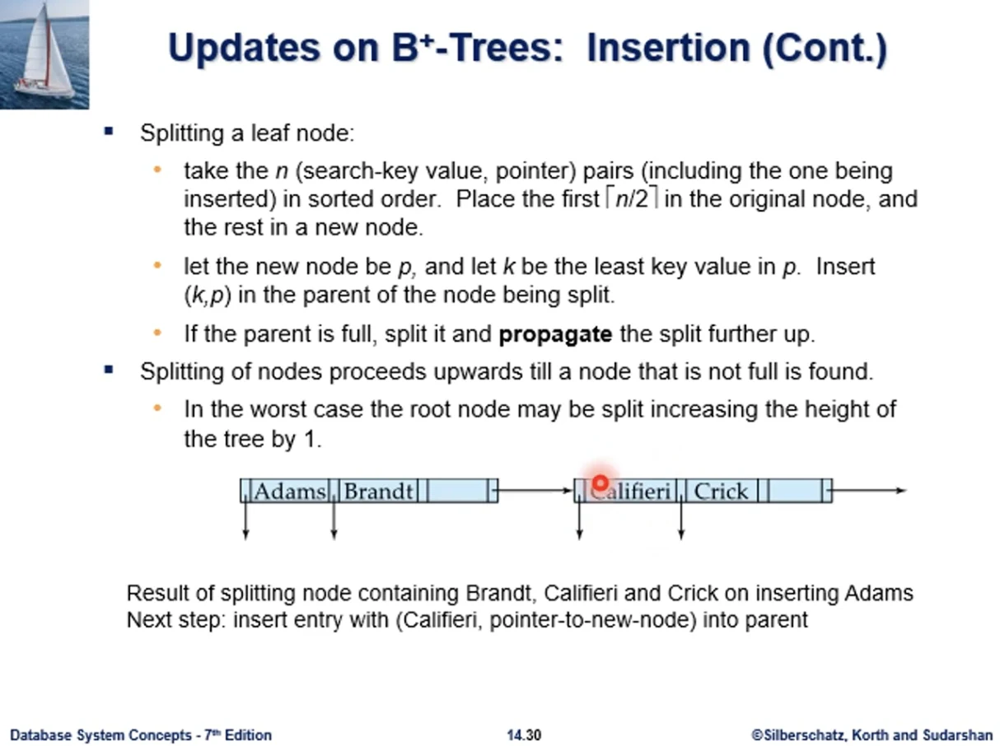
새로 할당한 node p, 거기에서 제일 작은값을 분할값으로 해서(Calif-) k, (k,p) 쌍을 부모노드에 삽입하는것이다.  
리프노드에 빈 공간이 없어서 노드를 분할했고, 그로 인해서 부모노드에도 삽입이 일어난다. 그 시점에 부모노드도 공간이 없다면 부모노드도 분할하고 그것의 부모노드에도 삽입이 일어나는.. 이 과정이 트리 상부로 파급해서 올라가게 된다.  
어떤 노드가 공간이 있을때까지 이 작업은 진행되고, 최악은 루트노드까지 올라갔는데 루트도 공간이 없는것인데. 이럴때는 루트도 분할하여 새로운 루트가 생기고, 트리의 높이가 1 증가하게 된다.

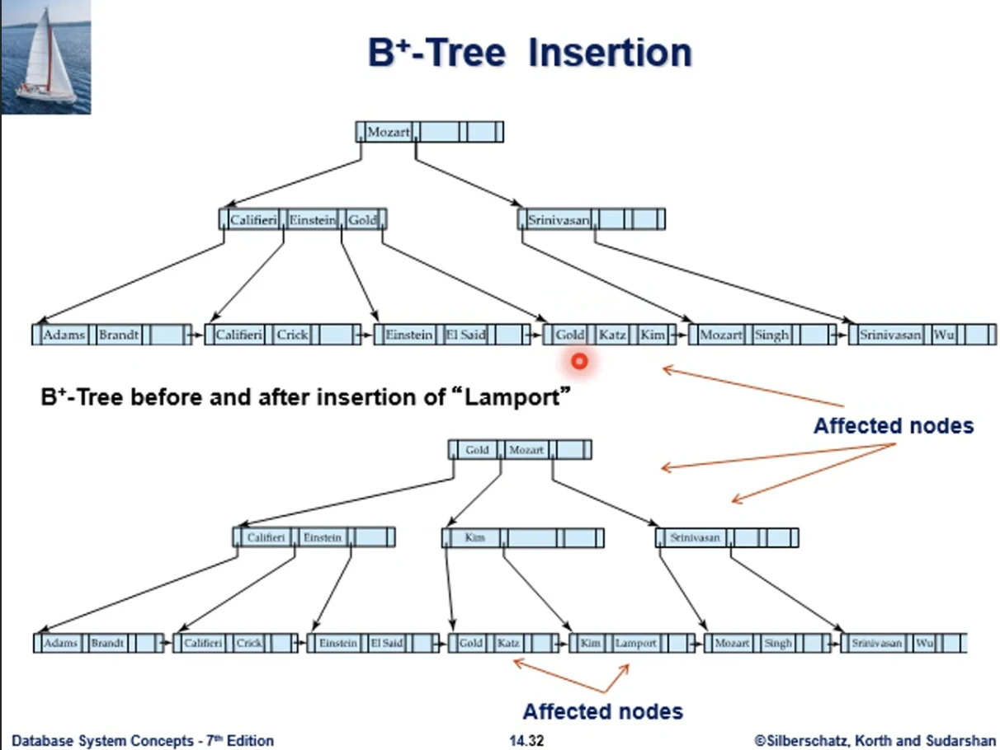
부모노드를 분할해야 하는 상황을 보자  
Lamport를 삽입하는 예제이다. 먼저 삽입할 값을 탐색한다.  
빈공간이 없이 오버플로우가 났으므로 리프노드를 분할한다.

원래 있던 노드의 오른쪽에 새 노드를 할당해서 4개의 키값을 2,2개로 나눈것이다.  
오버플로우가 난 노드의 부모노드로 새 노드의 포인터와 가장 작은값인 Kim을 넣어야 한다.  
삽입하러 갔는데, 삽입할 위치는 원래 오버플로우가 난 노드를 가리키던 포인터의 오른쪽이다. 그런데 공간이 없다.

그것을 다시 분할하여 처리한 결과가 아래이다.  
원래 물리적으로 같은 노드는 왼쪽에 있다. 분할은 항상 오른쪽 형제노드에 새로 할당한다.  
Kim이라는 값이 새로 올라갔는데. non leaf 노드를 처리하는 방식은 leaf 하고 조금 다르다.  
Califeri, Einstein은 남고, Gold는 split value로 부모노드로 올라간다. 리프에서 올라온 Kim이 새 노드에 혼자 들어간 모습이다.

이전에 leaf노드만 분할할때는 4개 값을 2,2로 나뉘었는데
non leaf는 kim이 오면, 2개, 1개(부모노드로), 1개가 된다.  
gold가 부모노드에 삽입될때는 빈자리가 루트에 있으므로 그림과 같이 처리되고 끝났다.

## 4주차 2nd ch14

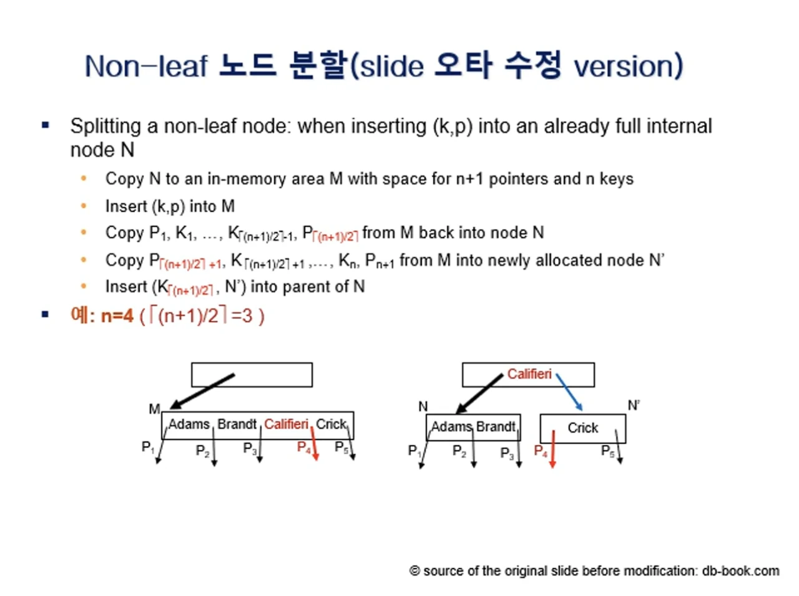
non leaf를 분할하는 알고리즘을 정리한것이다.
N 이라고 쓴것이 오버플로우가 발생한 non leaf 노드이다. 그 자식레벨에 (k,p)를 삽입해 달라는것.

원래 N은 n개의 자식만을 max로 가질수 있다. 근데 n+1이 되어버린 상황  
정상적인 노드가 소화를 못하므로, 조금 더 큰 M이라는 임시버퍼를 하나 만든다.  
원래 4개까지 자식이 가능한데, 조금 더 커서 자식을 5개 가진 상황이다.  
원래 노드에 있던값들하고 정렬순으로 준비를 한다.

이 값들을 오버플로우 난 노드와 오른쪽 형제로 새로 나누는데 나눈 결과는 오른쪽과 같다.  
P_1, K_1, ... K\_(ceil((n+1)/2)-1), P\_(ceil((n+1)/2))  
맨 왼쪽포인터부터 마지막에 올 포인터 자리까지를 옮긴다  
P\_(ceil((n+1)/2)) 이 값의 의미는 포인터수가 n+1개이므로 그것의 절반이라는 것이다.

그것의 다음 포인터부터 맨 마지막까지를 새로 할당한 노드로 옮겨온다.

그다음에 분할값을 부모노드로 옮기는데 그 값은 예제에서 K_3이다.  
인덱스 enrty는 항상 분할값하고 자식노드 포인터로 쌍을 이룬다고 했는데 항상 우측은 새로 할당된 노드를 가리킨다(파란색)

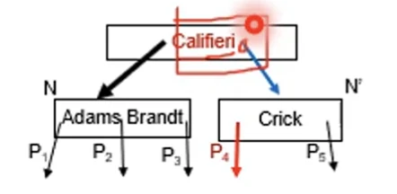  
(값,우측 자식노드 포인터) 쌍이 삽입이 된 것이다.  
항상 분할이 일어나서 부모노드에 엔트리가 삽입될때는, 그 위치가 오버플로우 난 노드를 가리키는 포인터의 바로 오른쪽이라고 했었다.

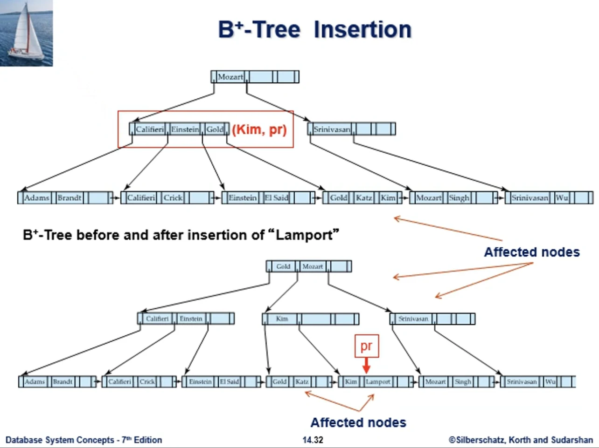
리프에서 오버플로우가 났다.  
위로 삽입해야 하는 내용은 분할한 둘을 구분할수 있는 내용이 되어야 한다.  
그 값은 (kim,pr), 부모노드에 삽입되어야 하고, 삽입위치는 오버플로우 난 노드를 가리키는 포인터의 우측이다.  
그런데 다시 오버플로우라서 그것을 처리한 결과가 아래이다

이 분할을 수행하기 위해서 아까 봤던 패턴이 적용되는데  
n=4 이므로, P_1, P_2, P_3 까지가 원본에 남고, P_3 다음의 나머지부분이 우측 형제노드로 복사된다.

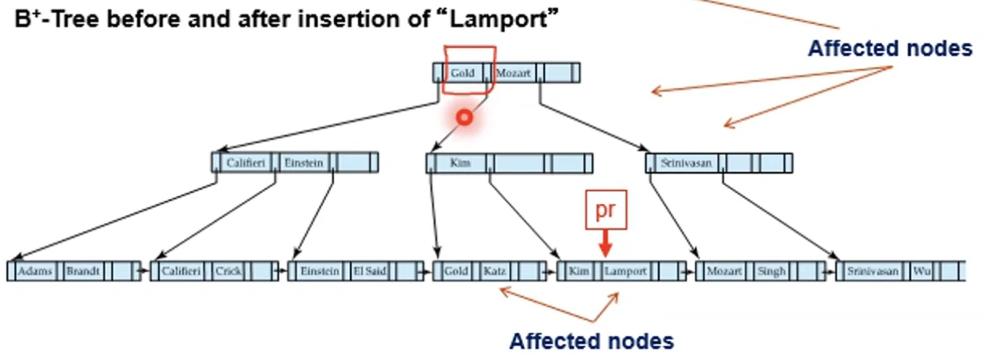
K_3가 부모노드로 올라간것을 볼수있고, 올라갈때는 항상 오른쪽의 자식포인터와 인덱스 엔트리가 쌍을 짓는다. 오른쪽 포인터는 항상 새로 할당한 노드이다.

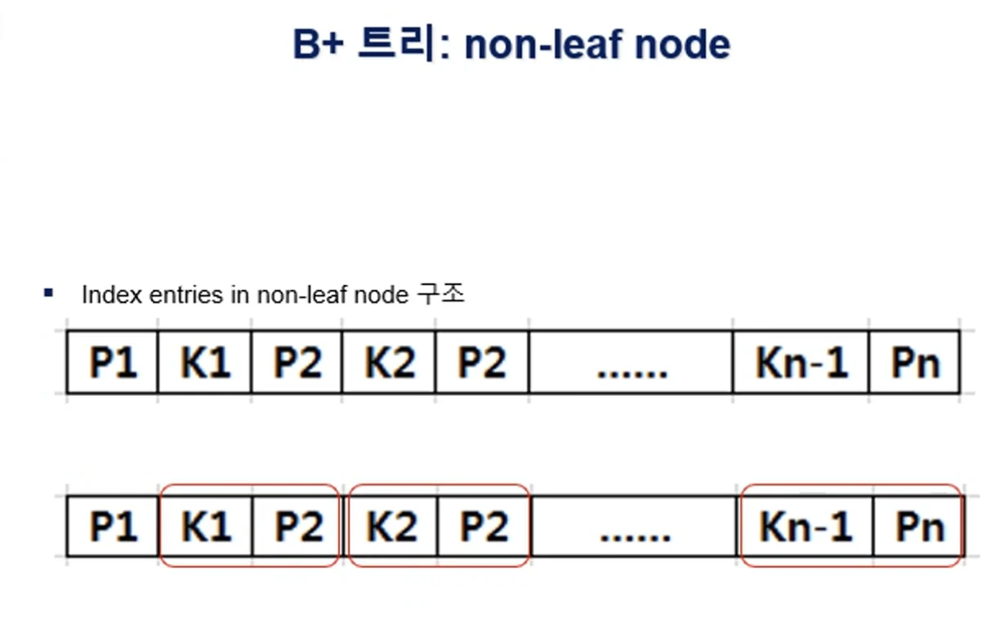
지난 수업에서 non leaf node 구조에서  
가장 왼쪽의 자식포인터를 고립시키고, 나머지 분할값과 오른쪽 자식포인터를 묶어서 인덱스 엔트리로 보라는 이야기를 했었다.  
지금 삽입 알고리즘 동작과정에서 인덱스 엔트리 단위로 알고리즘이 동작하는것을 볼수 있었다

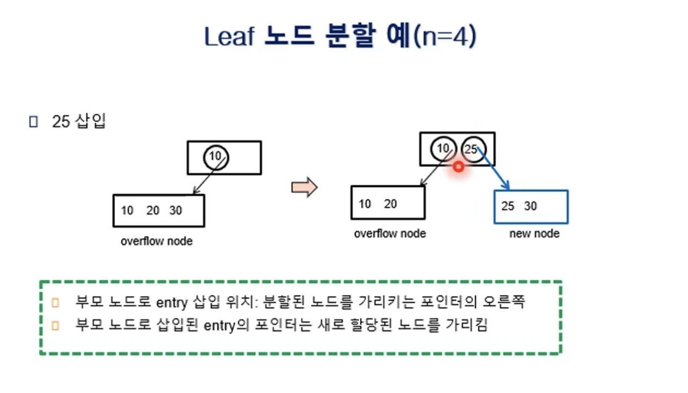
삽입 과정에서 노드의 분할은 leaf, non leaf 가 있었다.  
leaf의 경우에는 형제노드를 새 노드로 할당해서..  
부모 노드에서는 구분자가 필요. split value = 25는 새 노드의 가장 작은값이 들어간다.  
이때 패턴의 규칙은

- 오버플로우가 발생해서 분할하는 노드의 오른쪽에 분할값이 들어가고
- 부모노드로 삽입된 entry 포인터는 새로 할당된 노드 가리킨다 (오른쪽 자식포인터 묶어서 엔트리로 본다)

non leaf는 설명했으니 넘어감

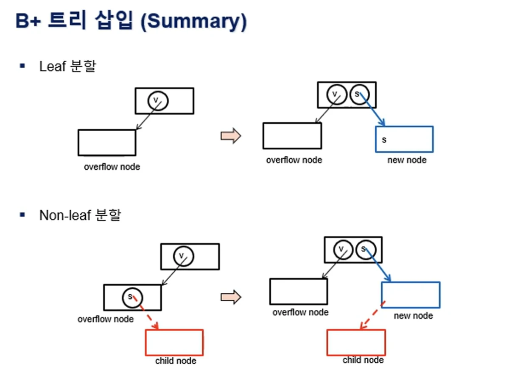
b+tree 삽입 알고리즘  
leaf, non leaf분할이 조금씩 달랐다  
leaf - 오른쪽 형제 노드를 새로 할당하고, 부모노드에서 오버플로우노드를 가리키는 오른쪽에 엔트리를 집어넣는다. 엔트리의 분할값은 새노드의 가장 작은값, 포인터는 새 노드를 가리키는 포인터  
non leaf - non leaf가 아닌 노드에서 overflow 발생, 그것의 오른쪽 형제노드를 새 노드로 할당하고, 분할되었으니 구분값 s가 필요해서 양쪽을 나누어야함 s라는 값은 overflow난것의 중간의 값이 올라가고, 포인터는 항상 새 노드를 가리킨다. 원래 s에 엔트리로 묶여있던 포인터는 새 노드의 맨 왼쪽 포인터가 된다

b+tree 삽입 알고리즘은 결국 노드분할에서 2가지 패턴을 구현한것이다. 길지 않은 코딩으로 구현가능

### 연습문제

풀어보자
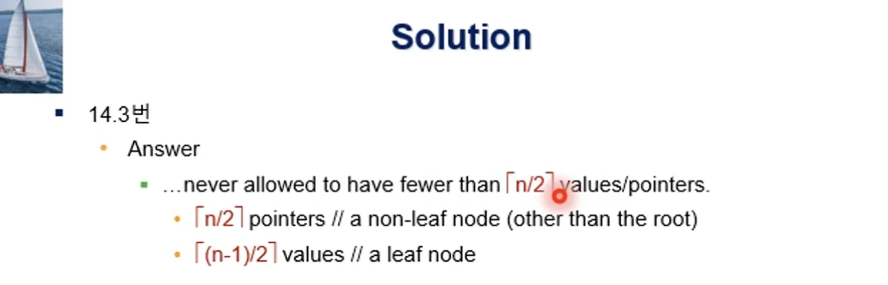
답을 보면 위와 같은 표현이 나온다.  
포인터의 수는 ceil(n/2) 보다 크거나 같아야하고  
search key의 수는 ceil((n-1)/2) 보다 크거나 같아야 한다

## B+ tree deletion

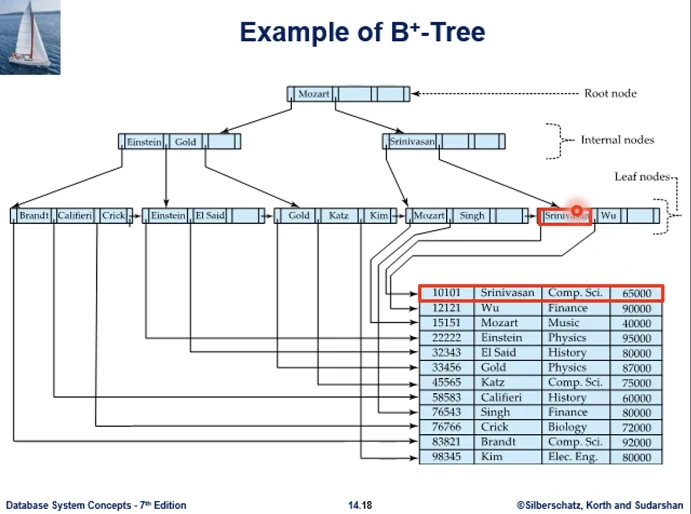  
데이터 파일에서 레코드가 삭제되어서 b+tree에서 인덱스 엔트리가 필요 없어졌다
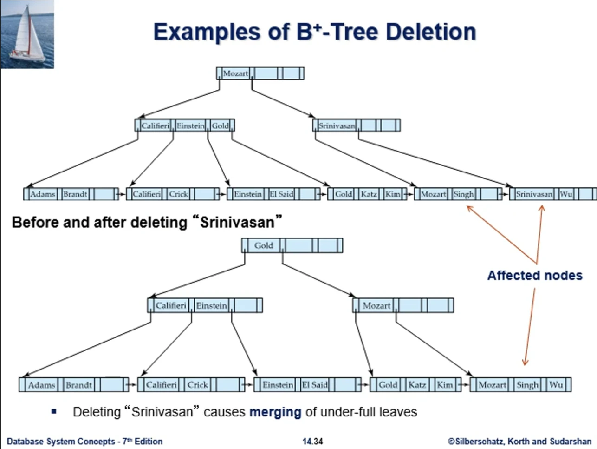
Srinivasan이라는 탐색키의 삭제 모습이다. 위는 삭제전 아래는 삭제후  
삭제하려면 먼저 Srinivasan을 탐색키로 해서 찾는다.  
탐색은 항상 리프노드에서 종료된다.

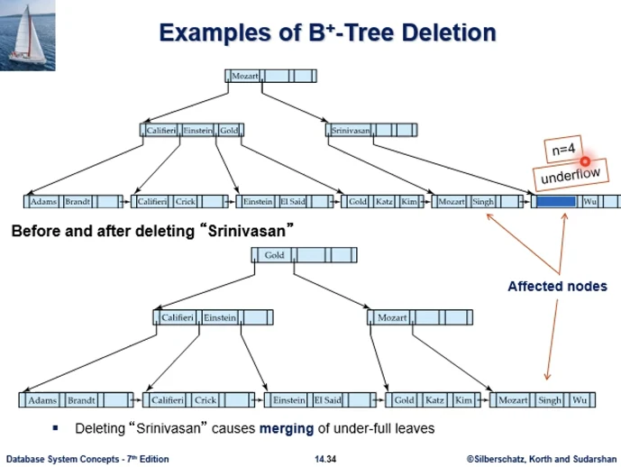  
엔트리를 삭제하면 n=4이므로 underflow가 발생한다.  
leaf 노드는 키가 2개는 있어야한다는 공간요건을 충족하지 못하고 있다.  
언더플로우가 아니었다면 삭제처리는 그냥 종료되었을 것이다.  
삽입때의 오버플로우는 노드분할로 해결했었는데. 언더플로우는 노드 병함 merge로 해결한다.

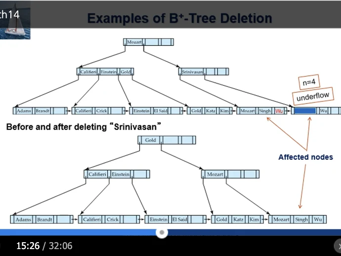  
형제 노드의 빈 공간을 이용해서 두 노드를 병합할 수 있으면 병합한다.  
지금 왼쪽 노드 옆에 빈공간이 한자리 있고, 삭제한 노드에 키가 하나이므로 병합이 가능하다.  
병합을 할때는 항상 오른쪽 노드의 값을 왼쪽 노드로 몰아주고, 오른쪽 노드는 삭제한다.  
오른쪽의 Wu가 왼쪽으로 오고, 우측 노드는 삭제된다

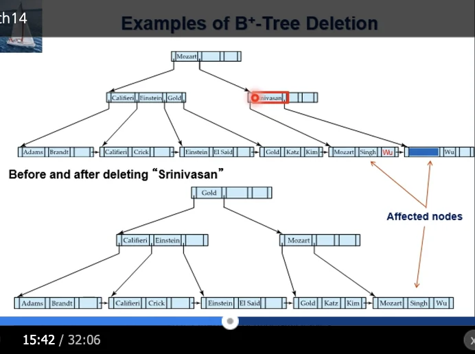  
우측 노드가 삭제되면 두 노드를 구분하던 이 엔트리가 필요 없어져서 역시 삭제된다.  
자식 노드의 병합이 부모노드에서 삭제를 초래하는 것이다.

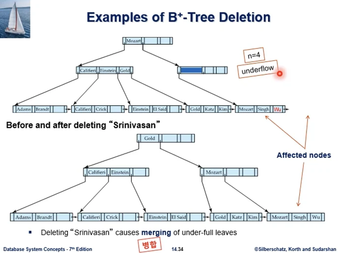  
삭제하면 이 노드는 다시 언더플로우가 발생한다.  
n=4이므로 non leaf노드는 자식 포인터가 2개는 되어야 한다는 공간요건을 충족하지 못하고 있다.  
형제 노드와 병합을 고려해보는데 형제노드는 가득 차있고 병합이 불가능한 상태이다.

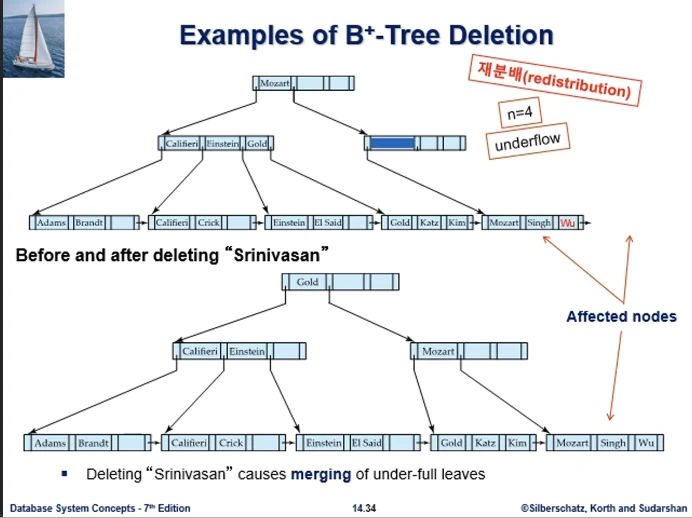  
병합이 불가능하면 키의 재분배로 해결할수 있다.  
이 노드는 non leaf 노드이다.

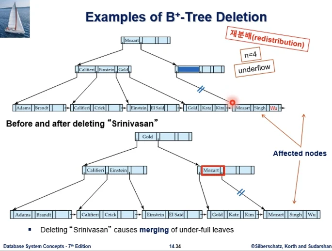  
non leaf에서 키의 재분배  
지워진곳에 키가 하나 있어야 하므로, 부모의 Mozart가 내려오고, Gold가 Mozart자리로 올라가야 한다. (아래 그림이 그 모습이다)  
Mozart가 자식 노드로 내려오면 이렇게 인덱스 엔트리를 구성하는데  
이때 짝짓겨야 하는 이 포인터는, Mozart가 내려오기 전의 오른쪽 자식의 가장 왼쪽 포인터이다

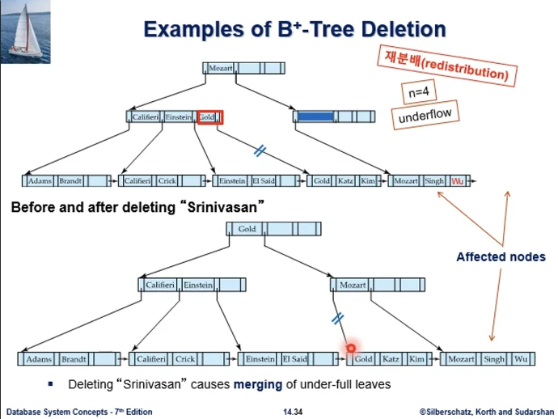  
Gold가 위로 올라가면, 위에서 Gold의 우측이었던 포인터는,  
아래에서는 Gold의 오른쪽 자식의 가장 왼쪽 포인터가 된다.

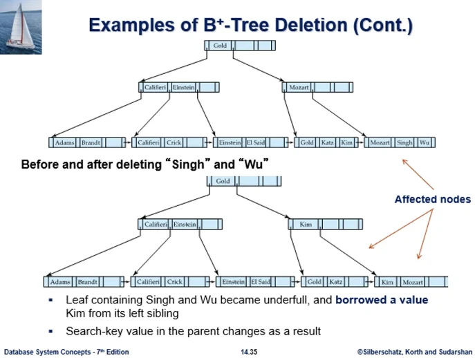
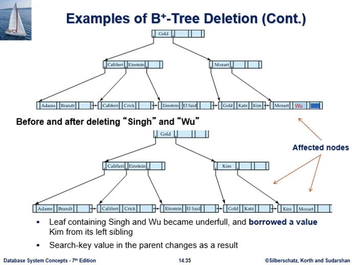  
두번째 예는 Singh 과 Wu를 차례로 삭제하는 것이다  
Singh을 탐색하여 삭제하면 언더플로우가 아니어서 삭제 처리는 종료된다.

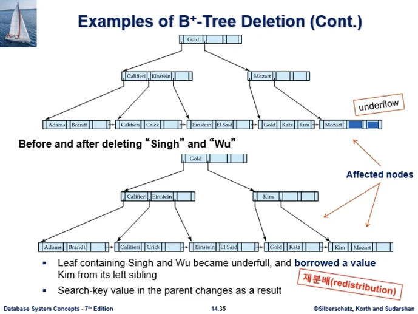  
Wu를 탐색하여 삭제하면 이제 언더플로우가 된다.  
형제 노드가 가득 차있고 병합은 불가능하다. 이것은 Key의 재분배로 해결한다.

from its left sibling - borrored a value -  
형제에서 값을 빌린다는 표현이 키의 재분배를 의미한다.

이 노드는 리프노드이다.  
리프노드의 키의 재분배.  
형제에서 Kim이 넘어와서 아래와 같이 되고, 그 부모의 구분값 Mozart를 Kim 으로 업데이트 한다.  
부모를 Mozart로 그냥 두면 옮겨간 Kim과 크기관계가 맞지 않게 된다.  
따라서 재분배를 하고나서 오른쪽 형제노드에서 가장 작은값 Kim이 부모노드에서 두 노드를 구분하게 되는것이다.

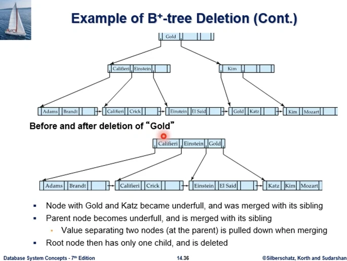  
세번째 예는 Gold를 삭제하는 것이다.
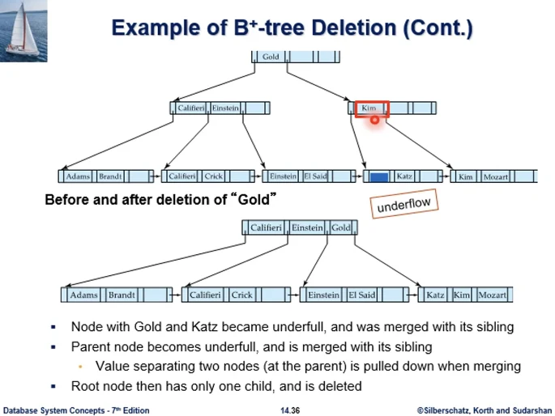  
Gold를 탐색하여 삭제하면 언더플로우가 된다. 형제 노드와 병합이 가능하다.  
병합할때는 오른쪽 노드의 내용을 왼쪽으로 몰아주고, 오른쪽 내용은 삭제한다고 했었다.  
부모 노드에서 두 노드를 구분하던 엔트리인 Kim도 삭제한다고 했었다,

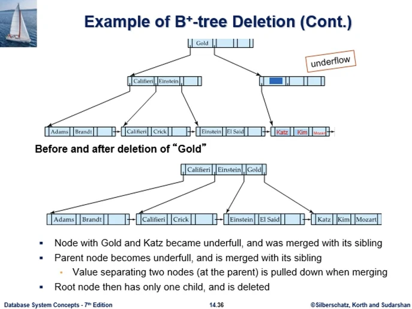  
처리하고 나면 위와 같은 모습이 된다.  
부모 노드에 언더플로우가 발생했다. 형제 노드와 병합이 가능하다.  
이들은 non leaf 노드이다.

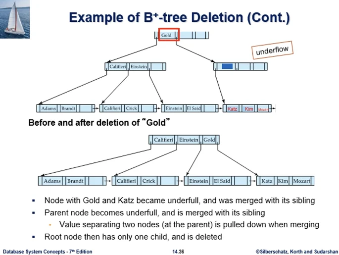  
non leaf 노드의 병합  
병합할때는 항상 오른쪽 노드의 내용을 왼쪽으로 몰아주고 오른쪽 노드는 삭제한다고 했는데. non leaf의 경우에는 부모 노드에서 두 노드의 구분자인 gold도 왼쪽 자식으로 내려온다.

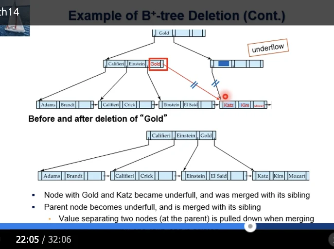  
gold가 내려오고 오른쪽 노드의 내용 전부 (하나만 있던 포인터), 왼쪽으로 모두 복사하고 나면 위와 같은 모습이 된다.  
자식으로 내려온 gold가 짝짓게 되는 포인터는, gold가 내려오기 전의 오른쪽 자식의 가장 왼쪽 포인터이다.

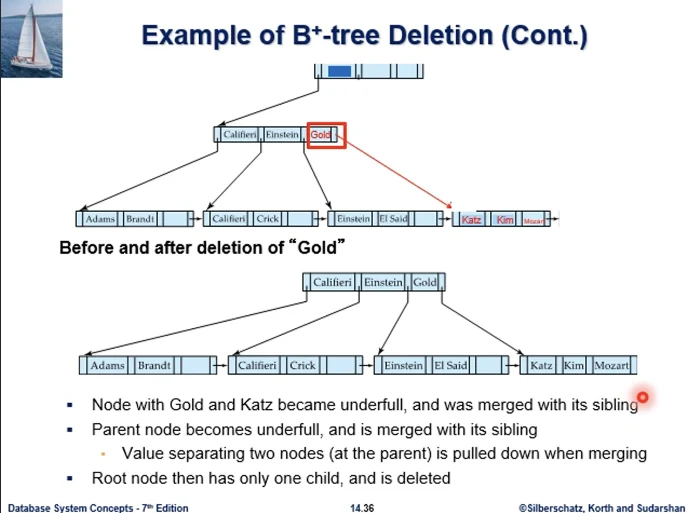  
오른쪽 노드가 삭제되면 부모노드에서 두 노드를 구분하던 엔트리도 삭제된다고 했었다.  
삭제까지 다 처리하고 나면 위와같은 모습이 된다.  
루트가 자식노드를 하나만 가지게 되었다. 그러면 루트를 삭제하고 이 노드가 새 루트가 되어 아래 그림과 같은 모습이 된다.  
b+tree의 높이가 1 줄어들었다

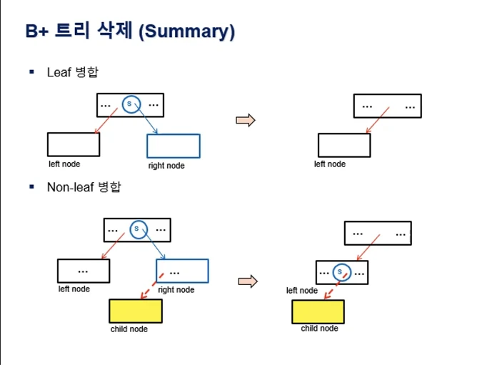  
b+tree 삭제 알고리즘의 요약  
leaf의 병합, 오른쪽 노드는 그 내용을 왼쪽으로 다 옮기고 삭제된다. 따라서 부모의 구분자 엔트리도 삭제된다.

non leaf의 병합, 오른쪽 노드는 그 내용을 왼쪽으로 다 옮기고 삭제된다. 따라서 부모의 구분자 엔트리는 없어지는데. 이 값 s는 왼쪽 자식으로 내려와서 s의 오른쪽 자식의 가장 왼쪽 포인터(점선 붉은 포인터)와 짝을 지어서 인덱스 엔트리를 구성한다.

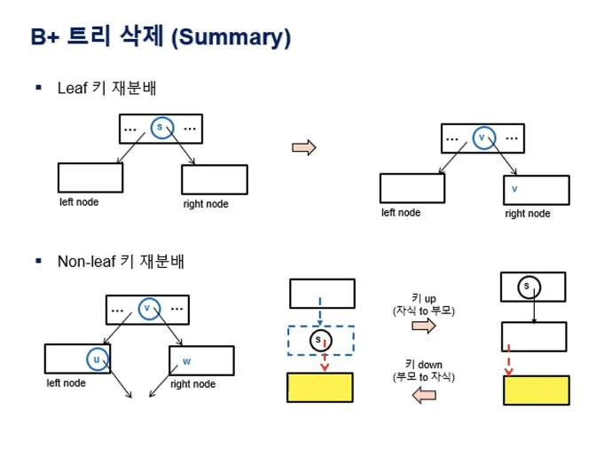  
leaf의 키 재분배  
왼쪽이든 오른쪽이든 어느 한쪽에서 언더플로우가 발생하면, 그 반대쪽에서 키값을 하나 빌려준다.  
그리고 부모의 구분자 값을 오른쪽 노드의 최소 키값으로 업데이트 한다.

non leaf의 키 재분배  
오른쪽 자식에서 언더플로우가 발생하면, 왼쪽 자식노드에서 부모노드로 키값이 하나 올라가고, 부모노드에서 오른쪽 자식노드로 키값이 하나 내려간다.  
만약 왼쪽 자식에서 언더플로우가 발생시, 오른쪽 자식노드에서 부모노드로 키값이 하나 올라가고, 부모노드에서 왼쪽 자식노드로 키값이 하나 내려간다.  
어느 경우든 자식에서 부모로 키값이 하나 올라가고, 부모에서 자식으로 키값이 하나 내려간다.  
키가 올라가는 변화를 보면. 값 s가 부모로 올라가면, 짝짓고 있던 포인터는 (붉은 점선) s의 오른쪽 자식의 가장 왼쪽 포인터가 된다.  
키가 내려가는 변화를 보면, 값 s가 자식으로 내려가면, 값 s가 자식으로 내려가면, s의 오른쪽 자식의 가장 왼쪽 포인터가 (붉은 점선) 짝을 지어 인덱스 엔트리를 구성한다.

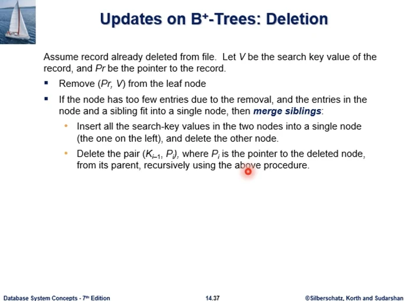  
삭제 알고리즘을 정리  
왜 삭제가 일어나는가? 데이터 파일에서 레코드가 삭제되는게 먼저고, 인덱스를 삭제하러 온것
해당 search key는 v, 가리키던 레코드 포인터는 Pr이다 Pr은 없어진것, 그래서 인덱스에 가서 b+tree에서 없애기.  
삭제했을때 leaf에서 v를 찾아가서 삭제하는데, 삭제결과 언더플로우가 안나면 삭제작업은 끝이다
문제는 언더플로우가 나면, too few entries(공간요건 충족못함) 그러면 형제노드가 언더플로우를 소화할수 있으면 합치라는것.  
예제에서 볼때 합칠때는 왼쪽으로 몰아주고 오른쪽은 없애는 패턴이다.  
부모 레벨로 갔을때 방금 자식레벨에서 합쳤으면, 그것을 구분해주던 구분자 엔트리가 필요 없어지니까 삭제하게 되고, 또 언더플로우가 발생한다면 이 과정이 재귀적으로 루트를 향해서 계속 진행되는것

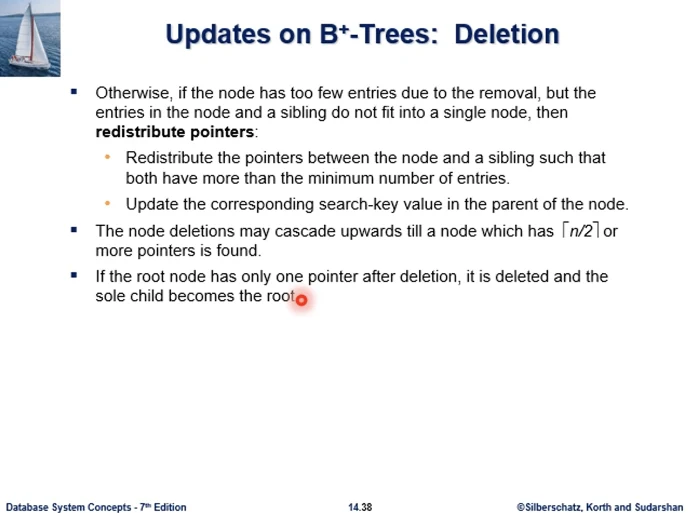  
근데 형제노드가 언더플로우 난 노드를 받아줄 공간이 없다면, 병합이 안되는 상황이라고 하면.  
형제노드로부터 값을 재분배한다고 했었다. 재분배를 통해서 언더플로우를 해결  
그래서 삭제시 언더플로우의 처리는 병합 아니면 재분배로 처리하게 되고  
예시에서 본것처럼 어떤 레벨의 삭제가 언더플로우가 나서 병합이 일어나게 되면, 부모 레벨에서 삭제가 일어나고 그것이 재귀적으로 루트까지 갈수가 있다는것.  
최악의 경우 루트가 자식이 하나만 남게되면, 그 하나의 자식이 새로운 루트가 되고 트리의 높이가 1 줄어든다.

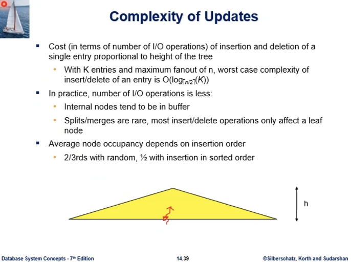  
b+tree 업데이트의 시간복잡도는 빅오 notation으로 order of 높이로 나타난다.  
삽입삭제가 항상 리프노드에서 시작해서 부모노드로.. 루트로 이론적으로 파급될수 있다는것. worst case로 높이만큼의 시간복잡도를 갖는다  
실제 상황은 대부분의 경우 leaf노드에서 처리가 끝이 나고  
노드 분할이나 병합등의 오버플로우나 언더플로우의 경우가 빈번하게 일어나지는 않는다.

특히나 실질적인 b+tree를 보면, 영향받는 부분이 전체 트리의 일부분이 된다. 트리는 각 노드가 있으면 부모노드는 unique하게 1개뿐이다. 그래서 루트까지 경로는 unique하다. 그 경로와 주변 형제노드 일부만 영향을 받고, 전체가 영향을 받는게 아니다.  
b+tree는 n이 굉장히 큰, 옆으로 퍼져있는 트리인데, 삽입삭제가 영향을 주는 부분은, leaf에서 root까지의 unique한 경로상의 형제를 포함한 일부만 영향을 준다.

b+tree가 삽입 삭제로 인한 오버헤드가 있지만. 검색성능이 좋고, 삽입 삭제의 부담이 높지않다. 인덱스로서 대부분의 db시스템에서 널리 사용되고 있다.

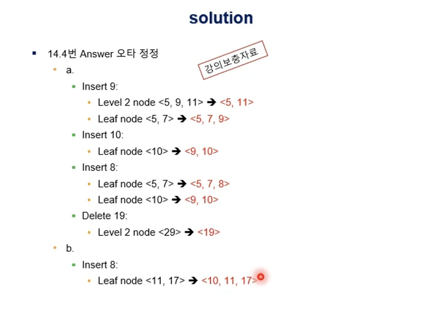  
b+tree 삭제 연습문제. 답은 교재 홈페이지에 나와있는데 오타가 있다. 강의 보충자료 확인하면서 풀기  
빨갛게 쓴게 정정된 내용

## 4주차 3rd ch14

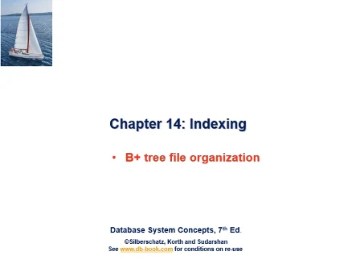  
b+tree file organization

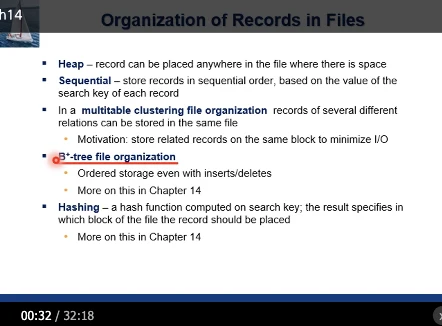  
13장에서 여러가지 파일구조를 공부했었다.  
힙, 순차, 멀티테이블 클러스터링 3가지를 공부했었다  
이제 4번째 파일구조인 b+tree file organization을 학습하자

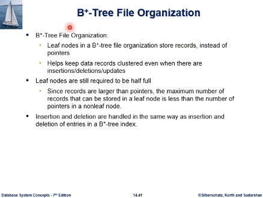  
정의를 보면 b+tree의 leaf노드가 저장하는 내용이 레코드 자체를 저장한다. 원래는 레코드 포인터가 있어야 하는데 레코드 자체를 저장한다고 되어있다.

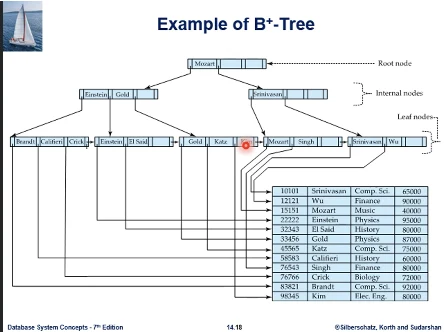  
모든 리프노드에 search key값하고 쌍을 이루는 레코드 포인터가 저장되어 있다.  
이것이 우리가 알던 형태이다

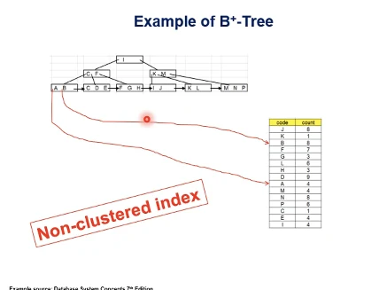  
다른 예를 보면 테이블이 있고, 컬럼이 2개가 있는데 code라는 컬럼에 대해서 인덱스를 만들었다.  
그래서 리프노드에 보면 A라는 값에 대해서 레코드 포인터가 해당 레코드를 가리킨다.  
나머지는 그리지 않았는데. 다 레코드 포인터가 있다.  
지금 보면 테이블이 code값으로 정렬되어 있지 않다. 그런데 인덱스의 리프노드는 항상 ordered index 항상 정렬되게 되어 있다.  
지난 수업에서 했던 용어로 비집중 인덱스가 되겠다. 인덱스 리프노드의 정렬순서와 레코드 순서가 다르다

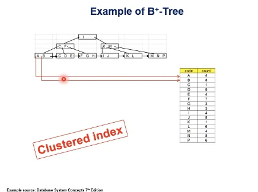  
반면 이 예시는 같은 데이터인데 테이블이 code 컬럼으로 오름차순 정렬되어있다. 그래서 리프노드의 정렬순서와 일치하고 있다.  
이것은 집중 인덱스가 된다.

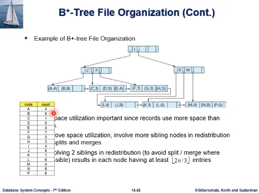  
지금 본 예제들에서는 그동안 알고있었듯이. b+tree의 리프노드에 레코드의 포인터가 저장되어 있었다. 그런데 b+tree file organization에서는 포인터 대신 레코드 자체가 저장된다고 이야기함.  
예시를 보면 리프노드에 가보면 정렬된것을 볼수있는데, 키 옆에 해당 레코드에 대한 포인터가 있어야 하는데, 옆에 값이 있다.  
(A,4), (B,8) 이것들은 레코드를 말하는것이다.  
리프노드에 레코드 자체가 직접 저장되어 있는것을 볼 수 있다.

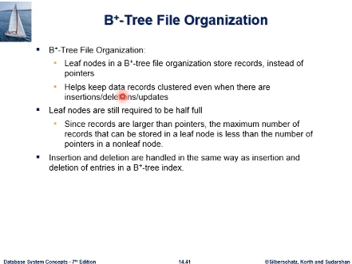  
예제는 컬럼이 2개밖에 없지만, 모든 컬럼값들을 리프노드에 가져와서 저장하자는것이다. 이러면 레코드 포인터가 필요 없어지고 파일 자체가 필요 없어지게 될 것이다.  
데이터파일의 존재 이유가 없어지고 리프노드를 쫓아가보면 레코드를 쫓아가는것과 똑같게 된다.  
데이터파일이 리프노드에 사실상 다 있고, 파일 자체의 인덱스가 얹혀져서 한 파일을 형성하고 있는 것이다.

데이터의 레코드들이 항상 clustered 된다. leaf는 항상 정렬되는데 데이터가 항상 같게 정렬되느냐가 문제였는데. b+tree의 leaf들이 search key값으로 되어 있기때문에 자연스럽게 레코드들이 search key값으로 정렬된 형태가 된다.

데이터파일 레코드의 삽입 삭제 변경 등의 연산이 search key 순서대로 되는것은 아닌데, 임의의 순서로 이루어지더라도 leaf노드의 레코드들은 항상 search key값으로 정렬상태를 유지한다.

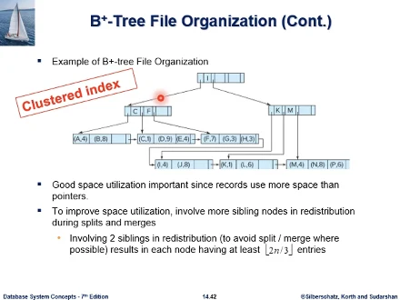  
그래서 테이블을 이런 파일구조를 유지하게 되면. 리프노드 레코드에 얹혀져 있는 인덱스 자체는 자연히 clustered index가 된다.

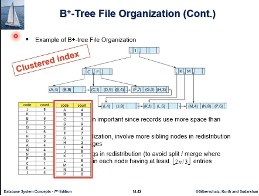  
이런 파일 구조상에서는 데이터파일이 다 리프노드에 들어있기때문에 트리만 갖고있다. 리프노드의 레코드들이 정렬된 상태이기 때문에 아래와 같은 상태와 마찬가지다.

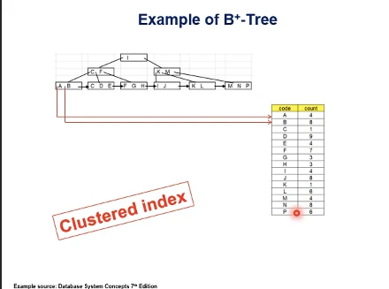  
그래서 이 파일 구조가 dbms에서 clustered index를 구현하는 방법중 하나가 된다. 이 방법 말고 다른방법으로 구현하겠다고 하면, 데이터 파일을 별도로 두고 인덱스를 얹혀서 쓰는데, 그때 이 데이터파일의 레코드들을 탐색키 컬럼값으로 정렬상태를 유지할 필요가 생긴다. 일반적으로 데이터 파일의 테이블의 레코드가, 삽입, 삭제, 갱신되는 순서가 꼭 키값으로 되는것은 아니므로 이걸 정렬상태로 유지하는 것은 부담스러운 일이다.

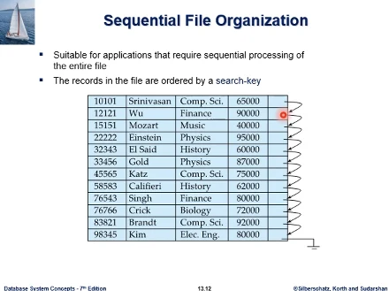  
앞서 파일 구조에서 순차파일 구조가 있었다. 이 그림은 교수 테이블을 순차파일 구조로 구현한 예시인데, 레코드들이 search key인 교수의 id값으로 정렬되어있고, 레코드 포인터가 그 정렬순서를 구현하고 있다.

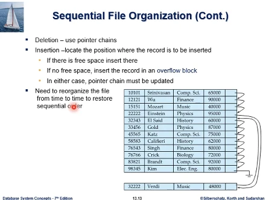  
그러나 순차파일은 정렬순서를 유지하는것에 부담이 있다는것도 학습했었다.  
그림은 verdi 레코드가 삽입되는 상황. 삽입될 위치에 free space가 없는경우 별도의 오버플로우 블록을 마련해서, verdi 레코드를 삽입하고 레코드 포인터가 순서를 유지한것이다.  
결과적으로 순차파일구조는 시간이 흐름에 따라서 삭제, 삽입이 반복되어 레코드의 논리적 순서와 물리적 순서가 일치하지 않게 된다.  
from time to time, 때때로 전체 파일을 reorganize해서 논리적 순서와 물리적 순서를 맞추어주는 파일 재구성의 부담이 따른다는 이야기를 했었다.

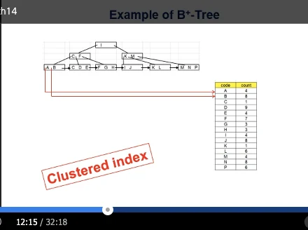  
데이터파일 따로, b+tree 인덱스 따로 분리해서 운영하고, 여기를 순차파일구조와 같은 것으로 정렬 순서를 유지함으로서 집중 인덱스를 구현하는 방식은 부담이 있을 수 있다,

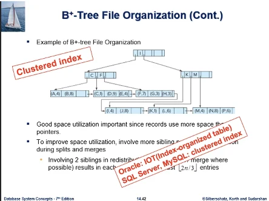  
그래서 이 구조는 상용 dbms 시스템에서 많이 채택되고 있고. 오라클에서는 이렇게 만든 파일구조를 IOT(index-organized table)이라고 한다. mysql에서는 clustered index라고 부르고 있다.

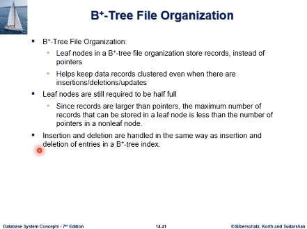  
정리하면 b+tree 이므로 leaf 노드의 공간사용 요건은 50%이상이 가득차야 한다는 조건이 그대로 적용이 된다. 그런데 리프노드의 레코드 포인터가 아닌 레코드 자체이므로, 개수가 포인터를 넣는것보다는 레코드를 넣는경우가 더 적게 들어갈것이다. 이점이 감안되어서 공간사용 효율에 대한 고려가 다시 필요하다.  
테이블의 레코드 삽입삭제가 처리되는 방안, 그것이 b+tree에 반영되는 과정은 우리가 삽입삭제에서 공부했던 과정과 동일하다. search key값과 포인터가 있느냐, search key와 나머지 col이 있느냐의 차이일 뿐이다.

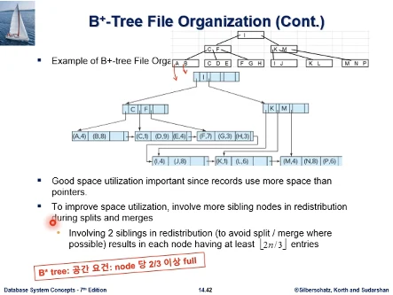  
good space utilization이 중요하다. 레코드 크기가 포인터 크기보다 커서 공간을 많이 먹기 때문이다...  
통상적인 b+tree에서는 레코드 포인터가 있었는데, 여기서는 레코드 자체가 있는것이므로 엔트리 개수가 더 적을것이다. 공간 사용 효율이 중요하다.  
상용 dbms가 많이 쓰는 방법이 b+tree의 변종들이 있다. 그 중에서 b\*tree를 쓴다. 공간 요건은 2/3이상 가득차야 한다.(67%로 공간 요건을 올린 변종)  
교재에 설명이 있지만. 대략, 우리가 노드에 삽입 상황이 벌어질때 오버플로우가 난다고 하면 b+tree에서는 분할을 해서 처리한다. b\*tree에서는 옆에 형제노드의 빈공간을 활용해서 key값들을 이동시켜서 redistribution 분할하지 않고 최대한 활용한다. 그러다가 오버플로우 발생때 형제노드에도 공간이 없다고 하면, 가득 찬 형제노드 2개를 3개로 분할하는 것이다. 가득 차있던것을 2/3로 배분해서 가지게 되는것.

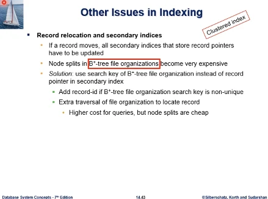  
clustered index를 b+tree파일구조로 구현할때, 추가적으로 비집중 인덱스 secondary index를 생성하게 되면 어떤 문제가 있을수 있는지 살펴보자.

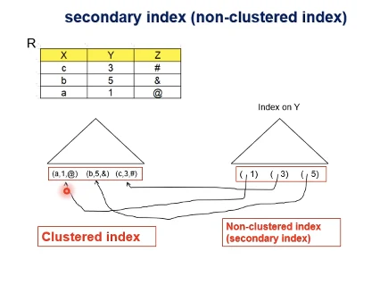  
예를 들어서 R이라는 테이블이 있다고 하자. X col에 대해서 집중인덱스를 b+tree 파일구조로 만들었다.  
leaf 레벨에서 레코드가 x col값 기준으로 저장된 채로 정렬된것을 볼수있다. 위의 표는 없는것이다. 이런 상태에서 Y col기준으로도 secondary index를 만들어보자.

리프노드에서 각 레코드별로 해당 레코드를 가리켜야 할 것이다. 이 경우에는 리프노드와 테이블상의 정렬 순서가 다르므로 비집중인덱스가 된다.  
그런데 지금 리프노드에서 레코드를 가리켜야 하는데 파일 자체가 없다. 전부 leaf 레벨에 있다.

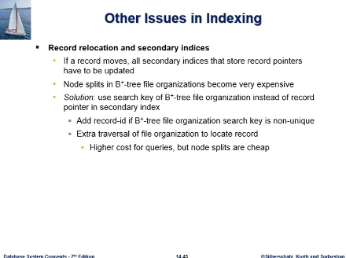  
이런상황에서 문제가 무엇이냐.  
record relocation은 레코드 이동을 말한다.  
secondary 인덱스의 해당 이동한 레코드를 가리키고 있던 포인터들이 다 업데이트 되어야 한다. 레코드 이동은 b+tree 구조로 되어있으므로 삽입, 삭제과정에서 노드 분할이 일어나고 인덱스 엔트리가 한 노드에서 새 노드로 이동하는 일이 벌어진다.  
secondary index의 유지보수 비용이 높아진다.

왼쪽 b+tree에서 노드 분할로 인해서 새 노드로 이동하는 일이 일어날 수 있다. 그런 업데이트까지는 했는데 Y인덱스에서 포인터도 업데이트를 해주어야만 한다.

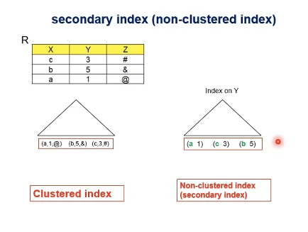  
그래서 solution은 secondary 인덱스가 레코드의 포인터 대신에 b+tree file organization을 구성하고 있는 인덱스의 search key값을 대신 저장한다.

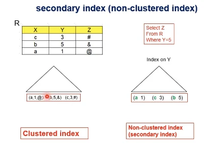  
그러면 Y col에 대한 질의를 했을때 어떻게 찾게 될까.  
이 인덱스를 활용할 경우 (b 5)를 찾고  
b라는 값으로 clustered index를 탐색한다.

질의 처리 관점에서 생각해보면 단점이 생긴다. Extra traversal of file organization - 인덱스를 두번봐야 하는 문제가 생긴다. 질의처리의 비용이 올라간다.

대신 clustered index 부분에서 노드 분할에 대한 처리 부담은 없어졌다. 그래서 대표적인 상용 dbms들이 secondary index를 구현하는 체제를 이와 같은 방식으로 사용하고 있다.

### 연습문제

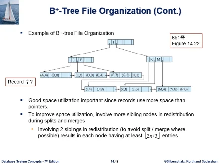  
이 파일에 저장된 레코드는 모두 몇개인가?  
정답은 15개이다.  
리프 노드에 있는것이 인덱스 엔트리가 아닌 레코드 자체이다.

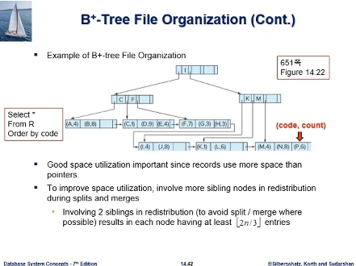  
이 파일이 관계테이블 R을 저장한 것이라고 하고, 테이블 R의 col은 (code, count) 2개가 있다. 이 질의 처리에 필요한 IO는 모두 몇번인가?  
질의 결과는 저장하지 않는다고 가정  
답은 8 I/O's  
질의에 where절 조건이 없다. 그래서 모든 레코드를 다 탐색해야 한다. 리프노드를 다 스캔하면 되는데 order by절을 어떻게 할지의 문제도, 이미 search key가 code col이다. 이미 알파벳 순으로 정렬되어있다.  
그래서 가장 왼쪽 리프에서 끝까지 스캔하면 된다. 루트에서 3번째만에 가장 왼쪽 리프에 도달하고 8번의 I/O로 질의처리가 종료된다.  
참고로 I/O수가 8번보다 작을수도 있다. 지금 b+tree 파일 구조에서는 리프노드에 레코드가 직접있다. (A,4) 가 첫번째 레코드이다.(가장 왼쪽) 루트에서 탐색해서 가장 왼쪽에 도달하는것이 아닌. db시스템이 파일의 가장 왼쪽 리프노드 위치를 직접 알고있을수도 있다. 그렇다면 바로 갈수도 있어서 그 경우 I/O 수가 줄어들게 된다.

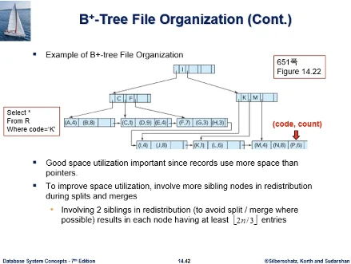
이 질의처리에 필요한 I/O수는? 결과는 저장하지 않는다고 가정.  
답은 3 I/O's  
search key = 'K', 루트에서부터 3번. 리프노드에 도달해서 해당 레코드가 하나 있다는 것을 알게된다.

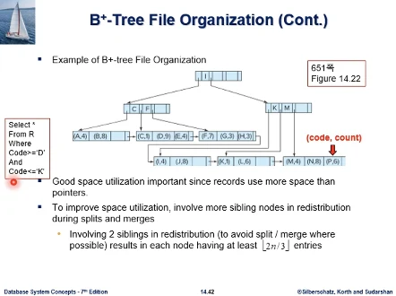  
위 질의 처리의 I/O수는? where 절이 range query 인 경우. 결과는 저장하지 않는다고 가정한다.  
답은 6번  
루트에서부터 D 레코드를 만나고. K가 나올때까지 리프노드를 스캔한다.

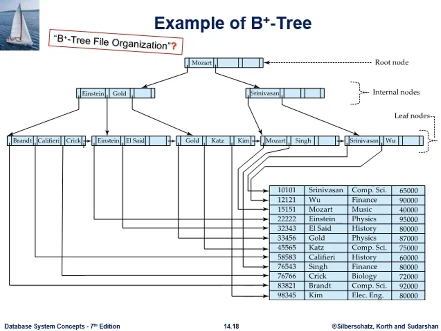  
앞에서 본 이 예시는 b+tree file organization인가?  
답은 NO  
리프 노드에는 레코드 자체가 아닌 레코드 포인터가 저장되어 있고, 레코드 파일이 따로 있다.
b+tree 인덱스가 사용되고 있지만. b+tree file organization 라는 명칭의 파일구조는 아님
