## 5주차1st ch14

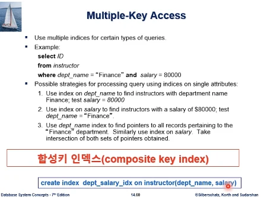
합성키 인덱스는 인덱스를 생성할때 테이블이 있고, col을 쓰는데 col이 여러개가 되는 경우를 말한다. 인덱스 활용하는데 있어서 중요한 역할을 한다.

위와 같은 질의에서 합성키가 아닌 col 한개에 대해서만 인덱스가 있는 경우를 생각해보자.

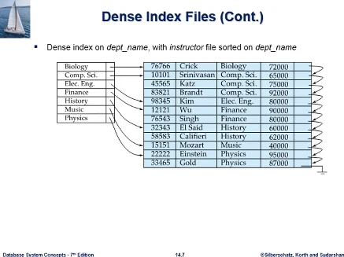  
이 그림은 b+tree 인덱스는 아니다

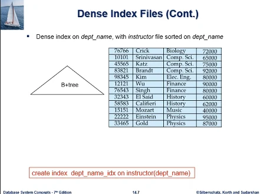  
만약 b+tree인덱스로 과 이름에 대해 인덱스를 만들었다고 한다.

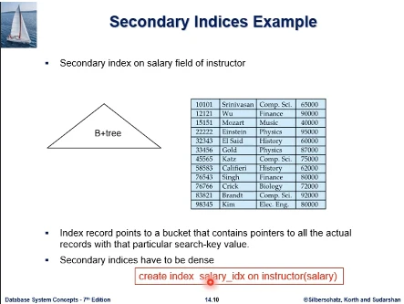
그 다음엔 salary col에 대해 b+tree 인덱스르 만들었다고 하자. 이와 같이 2개의 인덱스가 있을때 이 질의를 인덱스를 활용해서 처리하는 방안을 보면

1. 학과이름 인덱스를 써서 이 조건을 충족하는 레코드를 뽑고, 그다음에 급여에 대해 조건을 충족하는걸 뽑는다
1. 급여에 대해 조건을 충족하는걸 뽑고, 다음에 학과이름으로 필터링
1. 두 인덱스를 동시에 다 쓴다, 학과이름으로 레코드를 뽑는게 아니라 레코드 포인터만 뽑고, 급여로 레코드 포인터만 뽑아서 교집합에 포함되는 포인터만 뽑아서 레코드를 접근한다.

이런 single col에 대한 인덱스 말고, 합성 인덱스를 만드는 방법도 생각해볼 수 있다.

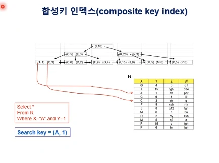  
교재 대학 db가 아닌 다른 예제로 개념설명.  
R이란 테이블이 있고, col 4개다. 이 테이블에 대해서 두 컬럼이 합성된 인덱스를 생성한다. 각 노드에 (X,Y) 가 합성된 상태로 탐색키를 구성하게 된다.  
이와 같은 합성키가 있을때 위와 같은 질의가 들어오게 되면 search key = (A,1)이 된다.

Single Col에 대한 인덱스가 있을때 탐색키로 b+tree를 탐색한다는 것은, 키 값을 비교해가면서 원하는 목적지로 찾아나간다.

합성키 인덱스도 같은 이치인데, 탐색키를 구성하는 값이 2개가 연합되어 있다는 차이밖에 없다. (i,10) 과 (A,1)을 비교하여 어느쪽이 큰지 작은지 정의가 있어야 한다.

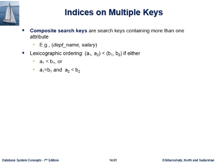
그 부분을 정의해주는것이 Lexicographic ordering이라고 해서. 먼저 첫번째 col로 비교한다. 첫번째에서 대소관계가 있다면 더 볼 필요가 없다, 만약 같다면 두번째 col을 비교해나간다.

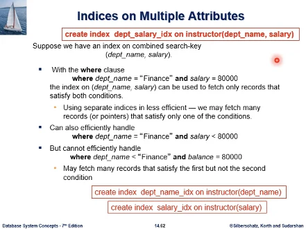  
학과이름하고 급여에 대한 합성 인덱스가 있을때, select문의 where절 조건이 바로 학과이름, salary가 있으면 이 인덱스가 그대로 활용될 수 있다.  
그래서 별도의 인덱스(학과이름, 급여 따로)를 쓰는것은 비효율적이다 is less efficient- , 이것은 질의 결과에 해당하는 레코드보다 더 많은 레코드를 검색하게 될 것이다.  
조건1 = A and 조건2 = B, 인 상황에서는 합성인덱스가 효율적으로 쓰인다.(등호 2개 and)

### 연습문제

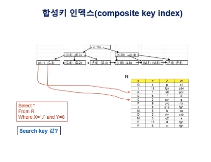  
create index XY_idx on R(X,Y) 로 합성 인덱스를 만들었을때, 이 질의처리에 필요한 search key값은 무엇인가?  
답은 (J,8) 두 칼럼의 값이 따로가 아닌 합성해서 탐색키 값을 구성하고 있는것

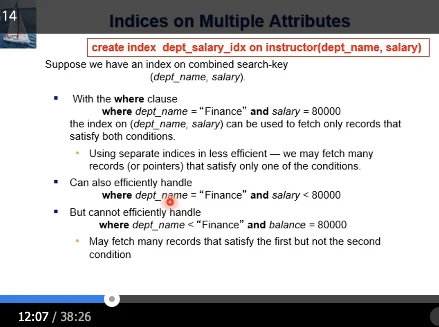  
질의조건이 부등호가 오는 경우에도 합성키 인덱스가 효율적으로 쓰이는 경우가 있다. 질의조건이 첫번째 col은 등호, 두번째는 부등호인 경우를 생각해보면.

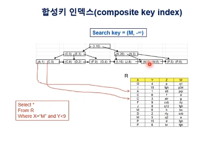  
예제를 보자, 해당되는것이 leaf 노드에서 보면 (M,5) (M,6) 에 해당이 된다.
b+tree에서 조건을 충족하는 레코드를 찾기위해서 탐색해야 하는데, 어떤 값으로 탐색을 시작해야 하는지 문제가 있다. X는 M으로 하고, Y col은 마이너스 무한대 숫자가 아닌, 데이터베이스 메타데이터에 Y Col에 등장할 수 있는 가장 작은 값 정보를 가질수 있다. 그 정보로 탐색을 한다.  
루트에서 리프노드로 탐색하고, 리프노드에서 M보다 작은 값부터(예제는 바로 M이 나옴), M을 만날때까지 가고, 그 다음에는 해당되는 엔트리들이 연이어서 있다. 다음 노드 링크를 쫓아서 쭉 연속해서 찾아나간다.  
그래서 이런 형태 조건에는 합성키 인덱스가 효율적으로 사용될 수 있다.

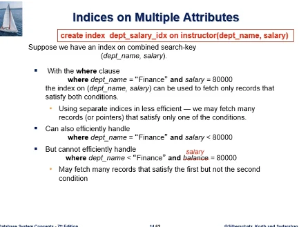  
그러나 마지막 경우에는, 합성키 인덱스가 효율적이지 못할 수 있다. 첫번째는 충족하지만 두번째는 충족하지 못하는 레코드들을 너무 많이 검색해낼 가능성이 있다.

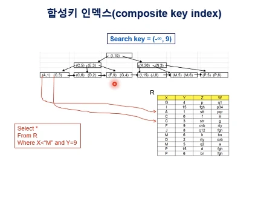  
첫번째로는 (A,1) - (M,6) 이 해당되는데, 그중 일부만이 두번째 조건을 충족하고 있다. 이 질의의 탐색키를 X를 최소값으로 잡고 탐색하면 leaf노드의 가장 왼쪽에 도달하게 된다. 그리고 M을 만날떄까지 스캔해나간다. 스캔하면서 Y=9인것을 찾아나간다. leaf노드를 탐색하는 부담이 많을수가 있다.

그래서 합성키는 그 구성과 동작원리에 대해서 내부적인 내용을 알고있어야 질의 성능향상에 잘 이용할 수 있다.

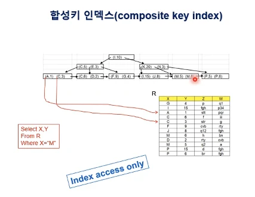  
X,Y에 대한 합성키 인덱스를 이런 상황에도 쓸수있다. where절에 X에 대한 언급만 있다. 여기서 보면 인덱스 탐색으로 바로 M을 찾을수 있다면, 이 질의의 답은 인덱스에 다 있다. 그래서 테이블에 접근할 필요가 없다. 리프노드 레벨에서 질의결과를 얻을수가 있다.  
그래서 인덱스만 접근해서 질의결과를 얻는데 이 인덱스가 사용될 수 있다.

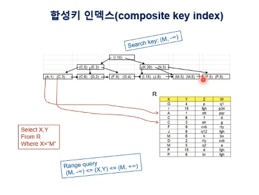
어떻게 M,5엔트리를 바로 탐색해서 찾을수 있는지 생각해보면, Y값은 뭐가 되어도 괜찮으므로 이 범위에 해당하는 레코드들을 찾으면 된다.  
(M,1)부터 있는지 찾고, M이 없다면 질의처리를 종료시킬수 있다,

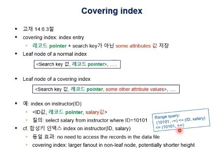  
covering index는 인덱스 엔트리 상에, 레코드 포인터 + 탐색키 가 아닌 다른 속성의 값을 같이 저장하고 있는 인덱스이다.  
우리가 평상시에 알던 인덱스의 리프 노드에 보면 [Search key 값, 레코드 포인터] 이렇게 있다.  
covering index는 다른 속성의 값을 추가적으로 같이 저장하고 있다는 것이다.  
이것의 장점은, select salary from instructor where ID=10101 의 경우, salary 속성만 원하므로 실제 데이터 파일에 레코드포인터로 접근할 필요가 없다.  
합성키 인덱스도 covering index와 똑같은 효과를 얻을수가 있다. 이 질의는 range query로 처리가 된다. 인덱스가 id와 급여 합성이므로.  
해당되는 엔트리를 찾았을때, 질의가 원하는 급여가 인덱스에 있으므로 실제 데이터파일을 엑세스하라 필요가 없다.

그러나 두 경우에 차이가 있다. covering index에는 급여가 리프노드에만 저장되고, non leaf에는
탐색키가 id만 있다.  
반면 합성키 인덱스는 모두 포함해서 합성 search key로 저장된다.  
그래서 covering index는 fanout이 더 non leaf노드가 더 클수도 있다. id값만 저장되기 때문에...  
합성키는 급여도 같이 탐색키이므로 탐색키 길이가 길어지므로 팬아웃이 줄어든다, 그래서 잠재적으로 b+tree 인덱스 높이도 covering 인덱스쪽이 더 낮아질 가능성이 있다. 그래서 예시의 경우에 합성키 체제보다 covering 인덱스 형성이 더 유리하다.

- 팬아웃(Fan‑out)이란?
   B⁺‑트리에서 하나의 내부(non‑leaf) 노드가 가리킬 수 있는 자식 노드의 개수를 말합니다. 즉, 분기(branch) 개수·브랜칭 팩터라고도 불러요. 내부 노드가 k개의 탐색키를 담고 있으면 보통 k + 1개의 포인터(자식)가 있으므로 그 값이 팬아웃입니다.

- 왜 중요할까?
   팬아웃이 크면 트리가 ‘한 번에’ 더 넓게 퍼지므로 같은 레코드 수를 저장할 때 트리의 높이(height)가 낮아집니다. 높이가 낮으면 디스크 I/O(페이지 접근) 횟수가 줄어들어 검색·삽입·삭제가 빨라져요.

### 연습문제

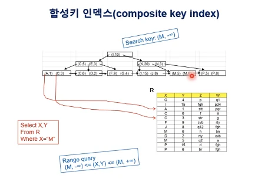  
합성키 인덱스와 질의가 있다, 질의에 필요한 I/O수는? 질의결과는 저장하지 않음.  
루트에서 리프 찾으면 데이터파일에 올 필요는 없다. X,Y 이므로.  
루트에서부터 리프까지 3번. 그리고 리프에서 형제노드로 가서 (M,-) 값이 있을수 있으므로 가봐야 한다. 그래서 없으므로 질의가 종료. 총 4번이다.

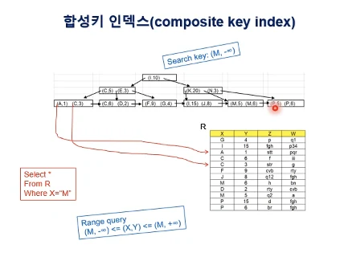  
이번에는 select \* 이다. 모든 컬럼을 요구한다. 이 질의처리에 필요한 io수는? 질의결과는 저장하지 않음.  
이 질의에서는 엔트리에서 해당 레코드를 찾아와야 한다. 이들이 서로 같은 블록에 있을지 다른 블록에 있을지 알수 없는데, 최악의 경우 다 다른 블록에 있다고 가정하면.  
b+tree높이 3번, 레코드2개 합해서 5번, 그 다음 리프노드 가서 M 없는거 확인하고 종료해서 6번.

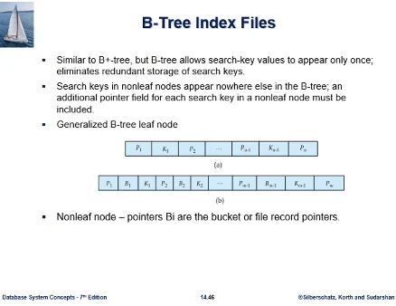  
b+tree는 변종이 많이 있다. 그냥 b tree 가 있다. 둘을 구분 안하는 경우가 있는데 엄연히 다른것이다.

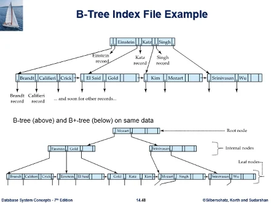  
그동안 본 b+tree는 항상 모든 탐색이 리프노드에 도달하게 되어있고, 리프노드에 와야 해당 레코드 포인터를 통해서 레코드에 접근할수 있었다.  
그냥 b tree는 non leaf 노드에서도 레코드 포인터를 다 갖는다. b+tree에서는 non leaf에서도 Einstein을 만나지만 그것은 분할값에 불과하다. 리프에 와서야 Einstein 레코드 포인터가 있다.

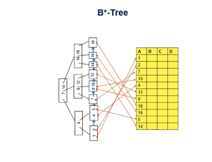  
레코드를 가리키는건 leaf만 있고, non leaf는 분할값에 불과하다.

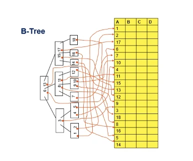  
b tree는 non leaf에 나타나는 search key도 해당 레코드를 가리키고 있다.

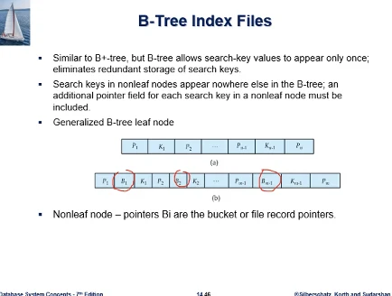  
그래서 b tree의 노드구조는 달라지는데. non leaf에서도 레코드를 직접 가리켜야 하므로, 아니면 버킷을 가리키므로 포인터가 있다 (B_i)  
리프노드의 구조는 b+tree와 동일하다. non leaf 노드에는 포인터 B_i가 bucket 또는 레코드포인터로 들어와있어서 차이가 있다.

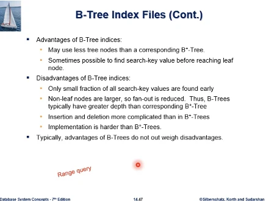  
b+tree와 비교해서 b tree의 장점은. 루트노드에서 시작해서 탐색키를 탐색할때 리프노드에 도달하기 전에 탐색이 짧게 끝날 수 있다.  
단점은 여러가지가 있다. 구현도 복잡하고, non leaf노드가 레코드포인터를 동시에 가져야 하기 때문에 탐색키에 대해 부가적인 정보량이 많아서 branch factor가 줄어들어서, 팬아웃이 줄어들어서 트리의 높이가 높아질 수가 있다.  
무엇보다도 여기에 언급안된것이 있는데. b tree는 range query에 취약하다.

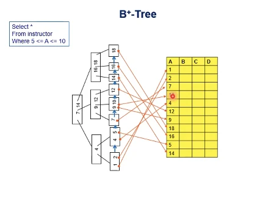  
예를 들어서 위와 같은 범위질의가 있다고 해보자. 앞에서 본 방식대로 하면 된다.

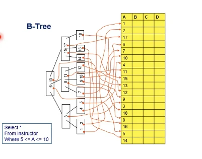  
그냥 b tree에서는 일단 5라는 값 탐색해서 리프까지 가면 레코드를 뽑고, 6은 그 부모에 있다. 다시 올라가야 함. 다시 내려가서 7을 뽑고... 위아래로 부모자식간에 트리를 왔다갔다 해야하는 상황이 발생한다. 범위질의를 지원 못하는건 아니지만 성능이 떨어지는 근본적인 단점을 가지고 있다.

### 연습문제

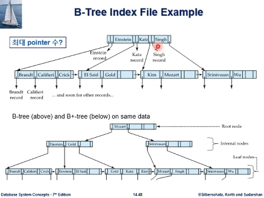  
b tree에 non leaf 노드 하나에 키가 3개까지 들어간다면, non leaf노드에 포인터는 최대 몇개가 있을 수 있는가.
답은 7개, 키가 3개면 자식노드 포인터는 자연스럽게 1개 더 많아서 4개, 그리고 키가 3개이므로 b tree는 해당 레코드 포인터를 바로 가지고 있어서 7개이다.

## 5주차2nd ch14

14장 인덱싱 - 인덱스 생성  
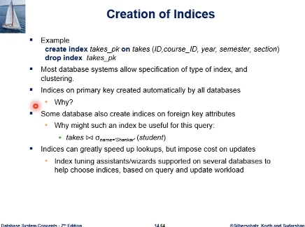  
db 시스템들이 인덱스 생성과 삭제에 대한 구문을 제공하고 있다, 상용 시스템을 보면 기본적인 구문 이외에 확장된 syntax을 지원하고 있고, 여러 타입의 인덱스를 지원하고 있어서 타입을 명시할수 있고, 클러스터링에 대한 정보를 표시할수 있도록 하고 있다.  
테이블을 생성할때 PK 지정을 거의 한다고 볼수 있는데, 대부분 상용 시스템이 자동으로 인덱스를 생성한다. 왜 그럴까?

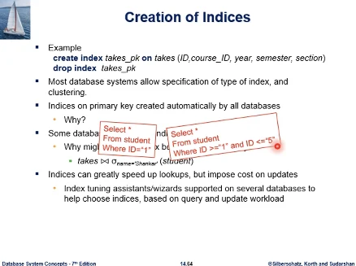
첫번째 이유는, 질의검색 성능향상 때문이다.

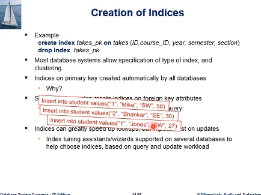  
insert문 처리에 있어서도 도움이 된다. PK이므로 id 값은 중복이 허용되지 않고, 그래서 나중에 다시 id=1 의 경우라면 수행되면 안된다. 레코드 값이 1이 있나 없나 체크하는것을 학생테이블 레코드 전체를 검색하는것이 아니라, 인덱스에서 1을 탐색키로 검색해보면, 리프노드에 이 값이 있으면 값이 중복되었다는걸 알고, 이 insert 문을 오류처리 할 수 있다.

그리고 rdb 경우에 외래키를 많이 설정해서 쓰게 된다. PK처럼 FK에서도 인덱스를 생성하는걸 생각해볼수 있는데, 이것은 보편적인 정책은 아니다.

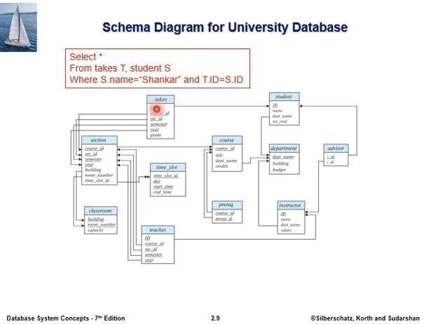  
shankar학생이 수강한 내용을 조회하자.  
수강의 학번값과 학생의 학번값이 조인이 되고, 이런 질의는 처리전략이 이름이 같은 학생 동명이인은 있겠으나 소수의 레코드가 나올것이므로, 먼저 레코드를 검색하면 그 학번값들하고 조인해서 찾는과정이다.  
이 패턴이 rdb에서 흔하게 나타나는 패턴이다. 외래키가 PK를 참조하는데 equal로 조인하는. 이때 외래키로 인덱스를 만들어두면 유용하다.

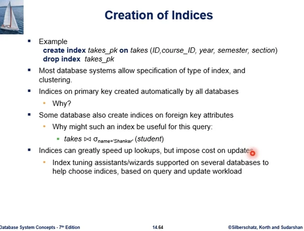
인덱스는 데이터 검색성능을 높여주지만, 유지보수 비용이 있으므로, 무조건 많이 만들수는 없다. 그래서 인덱스를 선택적으로 생성하고 관리하고 해야 함. 특히 db는 공유자원이므로 많은 사용자가 동시접속해서 경쟁하는 자원이므로, 인덱스를 잘 선택해서 질의성능을 보장해야 한다.  
운용을 런칭할때 인덱스가 제공되어야 하고, life cycle로 들어가면 통계치가 누적되어 인덱스를 recommendation해주는 툴이 있다. 질의빈도나 변경빈도로 판단이 가능.

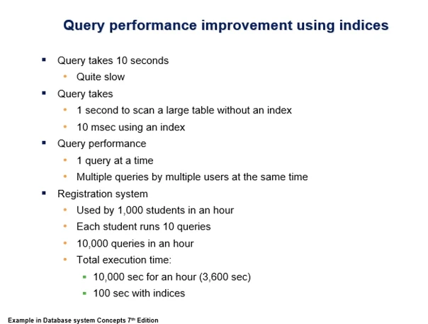
질의 하나가 10초가 걸린다. 테스트 과정에서 발견되면 너무 느리다고 금방 알수 있다.  
대용량 테이블에서 스캔하는데 인덱스 없이 1초 걸린다고 하면, 인덱스로 시간을 줄일수 있음에도 1초가 acceptable하다고 생각할수 있는데 그러면 안된다.  
질의성능이라고 하는것이 한번에 하나씩이 아니라 여러 사용자가 동시접속하여 사용하는것을 생각해야 한다.  
교재에서 1시간에 1000명이 동시접속해서 10개 쿼리 실행한다고 하면 한시간에 10000개가 실행되는 작업 부하이다. 한시간은 3600초 이므로 각 사용자는 시스템의 반응이 아주 느린 반응을 받게 될 것이다. 이런것을 고려하여 인덱스 선택을 잘 해서 쿼리 퍼포먼스 향상을 고려해야.

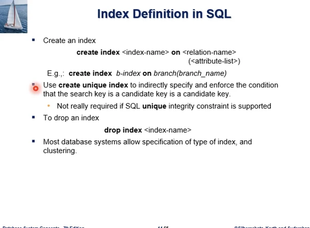
대표적인 db 시스템들이 보면 unique index를 지원한다. create index가 아닌 create unique index이다. 이것이 무엇이며 왜 쓰는지, 어떤 역할을 하는지 보자.

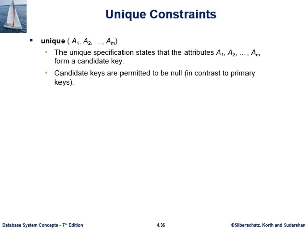  
db 테이블 생성할때, col이름, 타입, 제약사항을 줄수 있었다. 이때 unique절이 있었다. 여기에 col이 하나가 오거나, 합성키가 올수도 있는데 여기에 명시된 키가 후보키. 고유식별성을 갖는다. 튜플간에 값들이 중복될수 없다는걸 나타낸다.

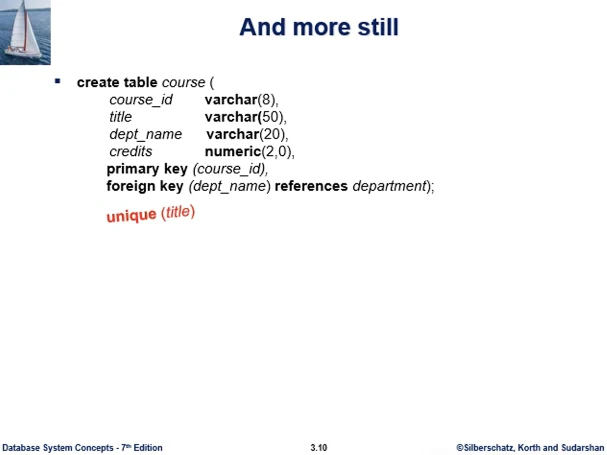  
과목 테이블을 생성하는 구문에서 과목번호, 과목명, 학과명, 몇학점 ...  
PK는 과목번호, FK는 과목명 설정 한 것이다. 여기에서 과목번호는 고유식별자로서 튜플간에 중복값을 갖지 못하고 null값도 갖지 못한다.  
그런데 만약 unique(title) 절까지 같이 있다고 하면 title col 값이 중복될 수 없다. title Col 도 후보키가 된다.  
그래서 course테이블에 실수로 title 값을 중복되게 하면 시스템이 reject 하게 된다.

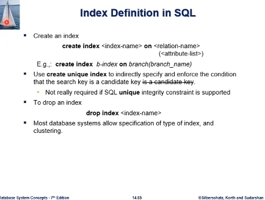  
그래서 unique index를 생성하면, 인덱스를 만든 search key가 후보키임을 명시함과 동시에 만약 사용자가 insert를 중복되는 값을 삽입하려고 하면 이 후보키 조건을 강제하여 해당 삽입을 오류처리하여 uniqueness를 유지.  
예를 들어서 create unique index b-index on branch(branch_name) 이라면, branch테이블의 레코드들은 branch_name 값 간의 중복이 없다는 의미가 된다. 만약 중복된 값을 삽입하려 하면 시스템이 enforce 한다.

create unique index는 간접적으로 인덱스를 생성하는 search key가 후보키임을 명시를 하고, 중복안되는 조건을 강제해서 시스템을 유지한다.

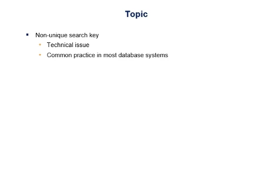  
인덱스 생성에 대한 내용까지 다 정리해서 앞으로 남은 내용 하나가 non unique search key이다. 이것은 사용자 입장에서는 몰라도 되는데, 테크니컬한 이슈가 된다. 대부분 상용 dbms들이 채택하고 있다.

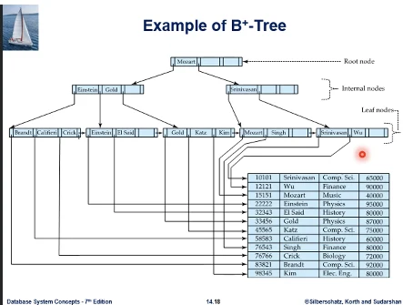  
예제에서 보면 이름 칼럼에 대해 인덱스를 만들었으므로 unique하지 않다. 동명이인이 있다. 그래서 인덱스가 그림과 같이 된다면 완전한 그림이 되지 않는다. Kim이 두명 있을수도 있으니까.

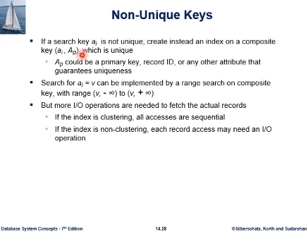  
인덱스를 생성하려는 칼럼이 고유 식별자가 아니라서 인덱스를 구현할때 생기는 문제점을 해결하기 위해 합성키를 사용할 수 있다.

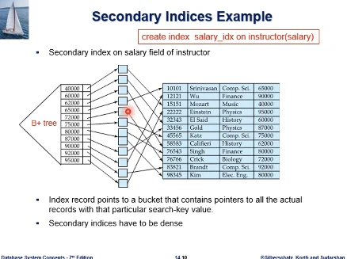  
교수테이블의 급여에 대해 인덱스를 만들었던 것이다. 고유식별자가 아니므로 80000 레코드들이 여러개 있을수 있고, 중간에 bucket이라는 중단단계를 필요로 한다.  
그래서 create index salary_idx - 하면 b+tree로 이와 같이 만들때, 리프노드에서 레코드를 직접 가리키지 못하고, 버킷을 거친다음에 레코드를 가리키는 형태가 된다. 그런데 버킷 자체가 중복 여부에 따라 가변적이게 된다. 그러면 이런 구현이 불가능한건 아니지만 단점이 많다.

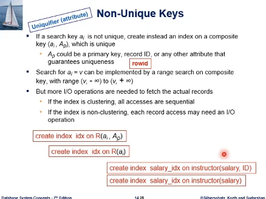  
그래서 (a_i,A_p) 와 같이 (a_i 는 급여과 같은 칼럼이다.) 다른 컬럼과 합성해서 값 자체를 unique하게 만들자는 것이다. 합성하는 값은 그 테이블의 PK이거나 시스템 내부적으로 각 레코드에 부여되는 고유식별자 (rowid), 또는 테이블 내의 어떤 유니크한 성격이 보장되는 칼럼이 있으면 합성시켜서 search key를 unique하게 만들어서 a_i에 대한 인덱스가 아닌 합성에 대한 인덱스를 만든다.  
그렇게 해서 버킷의 중간단계를 없앤다.  
값을 unique하게 만들기 위해 붙이는 값을 uniquifier라고 하고, PK나 다른 col이면 uniquifier attribute라고 부른다.  
그런데 유의할점은 create index를 아래에서 위 아래의 2가지를 보였는데 사용자는 이걸 알 필요가 없다. 시스템 내부적으로 벌어지는 일이다.

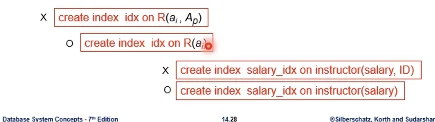  
그래서 사용자가 이와 같이 합성키를 명시적으로 만들 필요는 없다. 시스템이 내부적으로 unique하지 않으므로 구현에 발생하는 어려움을 해결하기위해 내부적으로 합성한다. 사용자는 그냥 인덱스 생성 요청하면 된다.

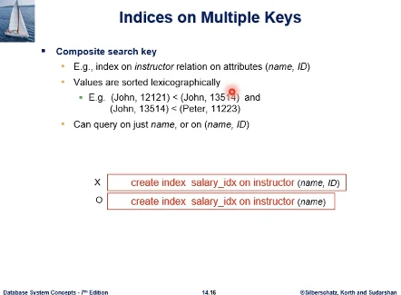  
교수테이블에서 사용자가 name 컬럼에 대해서 인덱스 생성 요청을 하게 되면, 아래와 같이 하면 되고, db시스템이 내부적으로 uniquifier id를 갖다 붙여서 인덱스를 실질적으로 만들게 되고. John이 동명이인이 여럿 있지만 그 아이디는 유일하기에 합성하면 구분이 된다. 그 인덱스 상의 모든 search key 값은 unique해지는 효과를 가져온다.

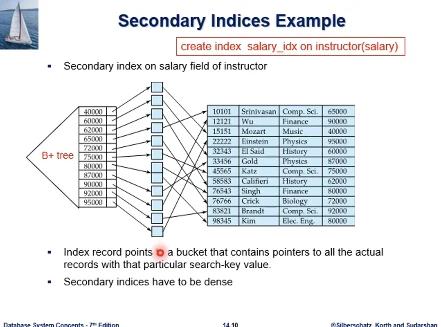  
그래서 중간 버킷 단계가 필요없어진다.  
사용자는 급여에 대해서만 인덱스를 만들었지만, 실제로는 리프노드에 급여값만 있는게 아니라 uniquifier까지 합성된 인덱스이다. 이것은 unique 하다. 그 레코드는 하나뿐이다. 그러므로 가변길이의 bucket 자료구조를 필요로 하지 않는다.

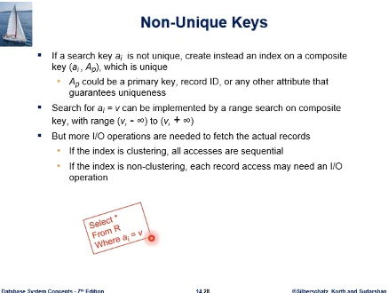  
그래서 이와 같이 하게되면, 사용자는 a_i col에 인덱스가 있다고 생각하고 이런 질의를 요청했을때, 실제는 a_i col만으로 인덱스가 존재하는 상황이 아니다. 이 조건을 충족하는걸 합성키에서 어떻게 찾는가?

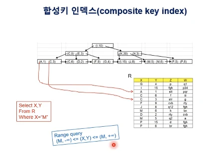  
이것은 이전의 예제에서 (X,Y) 합성키에대한 인덱스인데 조건에 X값만 주면 Y값은 뭐든 상관없게 된다. 그래서 Y는 범위에서 찾는 방식이 된다.

그래서 여기서도 a_i = v가 된다면 (v,-inf), (v,inf) 범위에 해당하는 레코드를 다 검색하면 된다.

마지막에 그러나 IO가 늘어난다고 되어있는데, 합성키 떄문에 늘어난다고 보는것보단. 근원적으로 a_i 컬럼이 unique 한 것이 아니기에 충족하는 레코드 수가 복수개가 존재한다. 레코드를 여러개 fetch 해야되기에 시간이 더 걸리는 것인데.  
그나마 인덱스가 집중 인덱스라면 a_i = v 레코드가 모여 있을 것이고, 아니라면 흩어져 있을 것이다. 이것이 최악의 경우가 된다. 위의 경우는 그나마 클러스터링 효과를 보게된다.

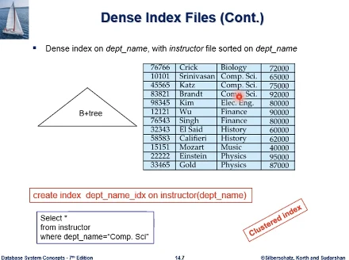  
과 이름으로 인덱스를 만든것인데, 과 이름으로 정렬되어 있으니 clustered index 이다.  
b+tree로 인덱스를 만들었고, 위와 같은 질의문으로 만들게 되면, 내부적으로 합성키 인덱스로 생성을 해두었다고 했다면.  
만약 질의가 들어올때, 엔트리에서는 uniquifier가 붙어서 해당 레코드를 각각 가리킬 것이다. (comp.sci가 3개...) 그렇지만 그들이 물리적으로 인접해있을 가능성이 높기에 IO시간이 줄어든다.

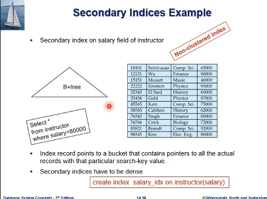  
급여에 대해서 만든 비집중 인덱스이다. 실제로는 급여에 uniquifier가 붙어서 인덱스가 만들어져 있다. 급여 =80000을 찾으면 (80000,98345), (80000,76543)을 찾는다. 문제는 디스크상에 흩어져있기에 IO가 많이 발생할 것이다.

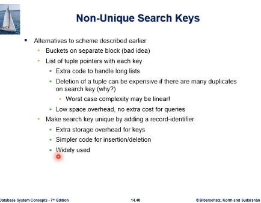  
정리하면 탐색키가 unique하지 않을때, 우리가 중간단계 버킷을 두거나 b+tree 리프노드에 탐색키 값 옆에 레코드 포인터를 두는 것이었는데, 지금 유니크하지 않으므로 레코드 포인터가 복수개가 나올것이다. 복수개를 레코드 포인터 리스트를 두는 구현방법도 있을수 있는데, 이 리스트는 가변길이가 되고 구현이 복잡해진다. (리프노드를 벗어남 - 버킷, 리프노드상에 리스트)  
그러므로 탐색키 자체를 유니크하게 만들자. 방법은 레코드 식별자 또는 PK등 uniquifier을 합성해서 만든다. 단점은 b+tree의 인덱스의 탐색키 자체가 합성키가 되므로 공간을 많이 차지한다. 그러나 이 b+tree의 탐색키가 유니크하기에 삽입 삭제 등에서 효율적으로 구현 가능하다.  
대표적인 dbms들이 다 이 방법을 쓰고있다.

### 연습문제

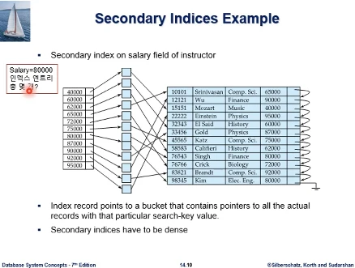  
교수테이블의 급여 필드에 대해 인덱스가 존재한다고 하자. b+tree인덱스라고 생각하자. 급여는 고유식별성이 없기에 80000이 2개이다. 버킷이 있는 체제로 인덱스가 구성되어 있다고 할때, 급여 = 80000인 인덱스 엔트리는 모두 몇개인가?  
답은 1개이다. 그림은 b+tree가 아니긴 한데 b+tree가 있고 리프노드에 1개가 있다. 왜 레코드가 2개인데 왜 엔트리가 1개인가? 2개의 레코드 포인터는 버킷에 있다. 인덱스 엔트리는 버킷을 가리킨다.

  
이번엔 버킷 없이 uniquifier을 사용해서 급여에 대해서 인덱스를 구성했다고 할때, 이 인덱스에서 급여=80000인 인덱스 엔트리는 총 몇개인가?  
답은 2개이다. 그림은 버킷이 있을때 그림이지만 uniquifier를 넣어서 인덱스를 구성하게 되면, 탐색키 값이 급여와 uniquifier을 합성한 값이다. 80000이 2개지만 uniquifier가 합성되면 고유한 값이 된다. 인덱스 상에서 2개이다.

  
b+인덱스 단원을 마치면서 코멘트.  
인덱스를 만들어놓고는 쓰다보면 성능이 떨어지는 상황이 생길수 있다. 대부분 상용 dbms 시스템이 인덱스 리빌드 기능을 제공하고 있다.  
우리가 왜 b+tree 인덱스가 시간이 지나면 성능이 떨어질까?

  
그림에서 형제 노드가 논리적으로 가까운 노드이고, 초기 인덱스 생성되었을때 실제로 물리적으로도 가까운 위치에 있을 가능성이 높다.

  
  
하드디스크 구성에서 arm assembly가 기계적인 운동으로 원하는 트랙상의 헤드에 위치하는 내용이 있었다. 디스크 access에 걸리는 시간 중에 seek time 이라는것이 arm assembly의 기계적 운동에 소요되는 시간이 커서 IO 시간이 길어지는 요인이 되는것이다.  
초기에 인덱스를 만들면 논리적으로 가까운 노드들이 같은 트랙이나 실린더에 위치해서, 우리가 리프노드를 링크를 통해 스캔해가는 과정을 생각할때, seek time을 앞에서 지불하면 그 다음에는 추가적인 seek 없이 형제노드를 검색할수 있을 가능성이 높다.  
그러나 시간이 지나면 DB에 데이터의 삽입과 삭제가 일어나면서 노드의 분할 병합이 일어나면서, 논리적으로 형제인 노드가 물리적으로는 다른 트랙이나 실린더에 존재할 가능성이 높아진다. 링크를 쫓아 형제노드를 스캔하는 과정 자체가 매 노드마다 seek time을 소모하는 그런 시나리오가 될 가능성이 높아진다. 시간이 지나면 인덱스를 만들고 나서 인덱스 질의처리 성능이 초기보다 떨어질 수 있다.  
그래서 대부분 dbms들이 리빌드 하는 기능을 제공하고 있고, 그 구문에 대해서는 각자 사용하는 시스템을 보고 고려할 필요가 있다.

## 5주차3rd ch14

  
Hashing 파일구조  
데이터베이스의 테이블 저장구조에서 b+tree 인덱스를 활용한 인덱싱 기법을 많이 쓰고있지만, db 시스템들은 다른 저장 체계로 해싱 기법을 사용하고 있다.  
해싱은 보편적으로 널리 사용되는 기법으로, 자료구조나 데이터가 메모리에 적재되는 상황에서 많이 쓰고있고, DB환경에서 보면 데이터가 메모리에 동시에 전체 적재될수 없는 상황이고 데이터가 디스크에 있는 상황이다. 그런 상황에서도 해싱 기법을 사용하고 있다.  
통상 잘 알고있는 해싱이 정적인 해싱이다. 보통은 그냥 해싱이라고 하면 정적인 해싱을 말한다.  
반대는 동적 해싱 기법으로 이것은 데이터베이스 환경에서 중요한 의미를 갖는다.

몇가지 용어가 있다. 버킷, 해쉬함수 - 테이블의 컬럼 값을 해쉬함수에 적용하면 해쉬함수가 해당 레코드를 저장할 버킷 주소를 계산해준다. 그러면 버킷에 레코드를 저장하는 체제가 된다.
그런데 환경 자체가 메인메모리에 데이터를 적재하는게 아닌, 데이터가 디스크에 있는 파일구조이다. 보편적으로 typically 구현을 할때, 버킷이 한 디스크 블록이 되도록 보통 구현하게 되고, 한 블록안에는 레코드가 여러개가 들어가게 된다. 그래서 해쉬함수가 버킷 주소를 계산해주면 해당 버킷의 레코드 여러개가 같이 저장된다.

  
해싱 기법에서는 동의어,synonym 라는것이 있다. 서로 다른 키값에 해쉬함수 계산결과가 같게 나오는 경우.  
관련해서 충돌이라는 용어를 쓴다. 같은 해쉬 value를 갖게 되므로 충돌이 발생했다.  
한 버킷이 디스크 블록 사이즈이므로 동의어에 해당하는 레코드들이 같은 버킷, 같은 디스크 블록에 저장된다.

  
예를 들어보자. 교재대학 db instructor 테이블을 파일에 해싱을 통해서 저장.  
총 8개의 버킷이 보이고 있고, 레코드들이 들어있는게 보인다. 버킷 하나하나가 디스크 블록에 해당한다.  
해쉬함수의 인자에 해당하는 search key가 학과이름이다. 그래서 보면 같은 학과면 같은 버킷에 모이게 되어있다. 근데 3번 버킷에 보면 해쉬 함수에 Physics, Elec을 넣어도 3이다. 이것은 동의어이다.  
충돌이 발생한건데 버킷 하나에 레코드를 딱 한개만 넣을수 있는것이 아니기에 괜찮다. 한 버킷에 저장할수 있는 레코드 수까지는 괜찮다.

  
해쉬함수는 어떻게 만들었을까? 예제에서 보면 파일의 크기를 버킷 10개로, 디스크 블록 10개로 설정했고, 그것은 키값을 10으로해서 mod 10한것... 다른 형태의 해싱을 쓸수도 있지만 mod 많이 사용한다.  
교수테이블 예제의 경우에 k 인자가 학과이름, 문자열이다. 문자열을 10으로 나누는것이 안되니까. 그래서 교재의 예제는 문자열을 받으면 2진수 표현체계로 변환하는데 학과이름의 i번째 문자를 해당하는 숫자로 변환한 다음에 그것들을 모두 더한 값을 10으로 나누어서 나머지를 취한 값이다.

  
이와 같이 파일구성을 했을때 해쉬함수를 통해서 레코드 삽입 검색, 삽입, 삭제 등을 다 처리할 수 있다. 예를 들어서 위와 같은 질의가 나오면, 학과이름을 해쉬함수에 적용한다. 그러면 3번 버킷을 가리키고, 3번 버킷 디스크 블록에 접근해서 Physics레코드를 찾게 된다.  
그런데 3번 버킷에는 동의어인 다른 레코드도 있을수가 있다. 다른 search key value가 같은 버킷에 매핑되어 저장될 수 있다. 그러므로 버킷의 모든 레코드를 다 순차적으로 점검해야 한다.  
근데 어짜피 3번 버킷이 하나의 디스크 블록이고 이것을 메모리로 읽어들여서 메모리 버퍼에 올려뒀기 때문에 그 내부를 다 보는것은 큰 부담이 아니다. 이미 IO를 했으니까.

  
삽입도 값이 주어지면 과 이름을 버킷 주소 계산하여, 버킷에 빈자리가 있다면 삽입하면 된다.

  
삭제도 구문이 주어졌을때, 조건에 Physics가 있으니 3번 버킷을 알게되고, 해당 레코드가 있는지 추가조건을 봐서 삭제를 수행하게 된다.

  
해싱을 통한 테이블 저장구조는 2가지를 생각해볼 수 있는데

1. 해시 인덱스로 구성해서, b+tree인덱스처럼, 버킷에 레코드를 직접 저장하는게 아니라. 레코드들은 힙 파일같은데 저장해두고, 버킷은 해당 레코드에 포인터를 저장하는 방식을 생각해 볼 수 있고.
2. 또 하나는 예제처럼 버킷 내에 레코드를 저장하는 형태이다.

  
레코드들이 저장된 데이터파일이 있고, 왼쪽의 부분이 인덱스 역할을 하는 부분이다. 해싱에 의해서 각 버킷에는 인덱스 엔트리가 들어있다. search key값과 해당 레코드 포인터가 데이터파일의 해당 레코드를 가리키는 구조이다.  
이 예제는 ID컬럼에 대해서 해쉬함수를 적용한 것이다. 76766을 계산하면 버킷 주소가 0번이 된다. 0번 버킷에 엔트리를 둔다. search key와 해당 레코드 포인터 이렇게.  
해쉬 인덱스를 쓸때 이 데이터 파일 부분은 힙이 아닌 정렬한 상태 또는 순차파일 구조로 유지할 수도 있다. 예제는 해싱에 사용한 컬럼이 아닌 학과이름 컬럼으로 정렬된 형태인데, 해쉬 인덱스는 오른쪽의 데이터파일이 어떤 구조로 유지되든 상관이 없다.

  
또하나는 버킷 자체 안에 레코드를 직접 저장하는 형태이다. 이미 본것

  
해싱기법을 쓸때 레코드 삽입 경우에 버킷 오버플로우가 발생할 수 있다. 그 레코드를 삽입해야할 버킷에 갔을때 공간이 없는 경우이다. 만약 Bucket full, Bucket overflow 발생시 어떻게 할 것인가?  
버킷 오버플로우가 발생하는 이유는, 삽입되는 레코드 수를 충분히 소화하지 못할 정도로 버킷 공간을 충분히 할당해주지 못하면 자연히 오버플로우가 발생하게 된다.  
그 다음엔 해싱 기법의 단점인데, 해싱이 이상적으로는 레코드를 여러 공간에 균등하게 uniform 하게 배분해주는게 목적이다. 그러나 search key값을 사전에 다 알지 못하므로, 어떤 값이 삽입될지 전혀 예측하지 못하는 경우도 있다. 그러므로 해쉬 함수가 버킷 주소를 계산해서 분포시켜줄때 비균등하게 분포가 일어날 수 있다.  
어떤 버킷은 공간이 많이 남았는데, 어떤 버킷은 데이터가 몰려서 Skew현상이 발생하여 오버플로우가 발생할 수 있다.  
그래서 이런 부분은 해쉬함수를 설계할때, 응용의 Search key값 분포를 고려하여 최대한 Skew하지 않고 uniform 한 distribution이 되도록 애를 쓸 수는 있지만 이것을 근원적으로 없는 문제로 보장하긴 힘들다. 그래서 해싱기법은 반드시 버킷 오버플로우에 대한 해결책을 가지고 있어야 한다.

  
그래서 보편적으로 제일 많이 쓰는것은 bucket chaining이다. 위의 그림처럼 bucket1이 초과하면 링크를 걸어서 다른 오버플로우 버킷을 할당하는 것이다. 이론적으로 여러개가 연결될수 있다.  
참고로 해싱에서 버킷 오버플로우를 근본적으로 해결하는 방법 2가지가

1. closed addressing - chaining
2. open addressing

  
예를 들어서 한 버킷의 capacity가 3개라고 하면, 처음에는 12개의 레코드를 저장하겠다는 생각이 된다. 예측하지 못한 삽입으로 인해서 오버플로우가 발생하면,
3번 블록에서 오버플로우가 발생했다고 하자. 현재 상황이 총 12개 저장 가능한 상황에 파일 전체로 보면 6개가 저장 가능한 상황이다. 2번 버킷에는 저장을 못하지만 다른 공간에 저장은 가능하다.  
open addressing은 추가로 공간을 마련하지 않고, 기존 파일에 있는 공간을 최대한 활용하는 기법이다. 일반적인 디스크 기반 데이터베이스 환경에서는 잘 쓰지 않는다.

### 연습문제

  
버킷 4개 있고, 오버플로우가 나서 체인이 형성되어 있다. 해시함수와 버킷용량은 주어져있다. 한 레코드에 접근시 평균 IO 횟수는?  
답은 위의 식으로 구한다.  
(2+1+3)*1 은 버킷 첫번째것을 말하고, 이들은 모두 한번의 IO 로 접근이 가능하다.
그다음 2단계는 1*2, 각 버킷이 블록이기 때문에 2번의 IO로 접근가능하다.  
3단계는 3\*3이고 3번의 IO로 접근가능하다.  
밑에 분모는 전체 레코드수를 다 더한것이다. 레코드 당 평균을 구하기 위해서.

레코드당 접근시 평균 IO수가 1.7번이 나왔다. 이것이 갖는 의미는, 우리가 해쉬 파일구조를 쓸때 기대하는 바가, search key를 쓰면 해당 버킷을 가리켜서 원하는 레코드가 있기를 기대하는것이다. 1.0 번이 되기를 기대하는것이다. 그런데 오버플로우로 인해 1.0보다 큰 수가 나온다는것이다. 이것이 해시 파일구조를 쓸때의 하나의 문제점이고 이 문제점에 대해서는 해싱 기법의 문제점 부분으로 향후에 살펴본다.
