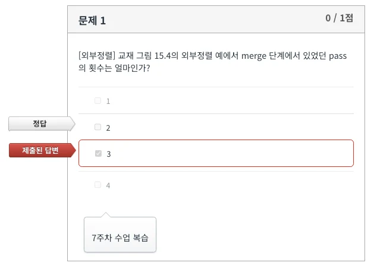
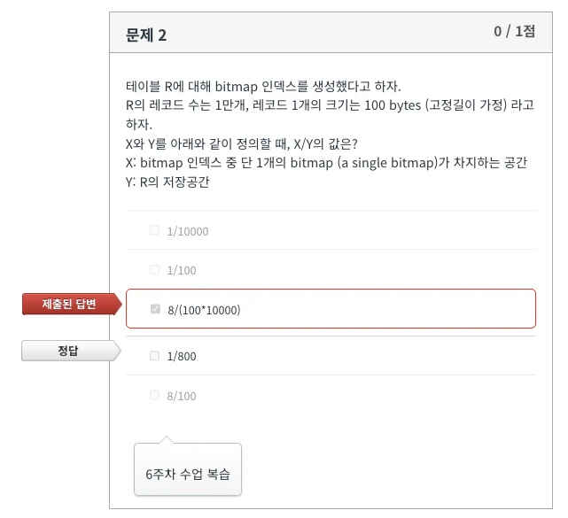
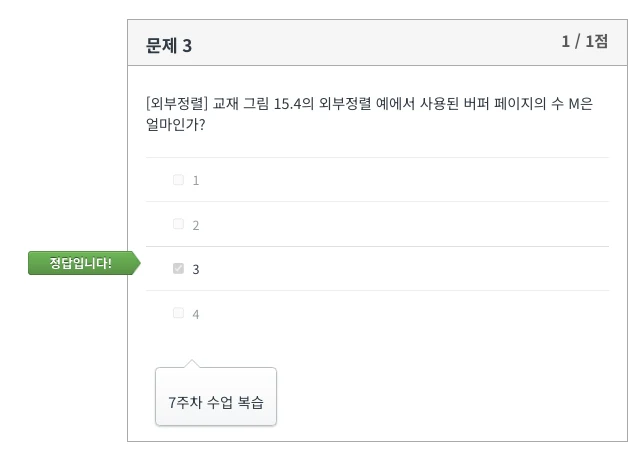
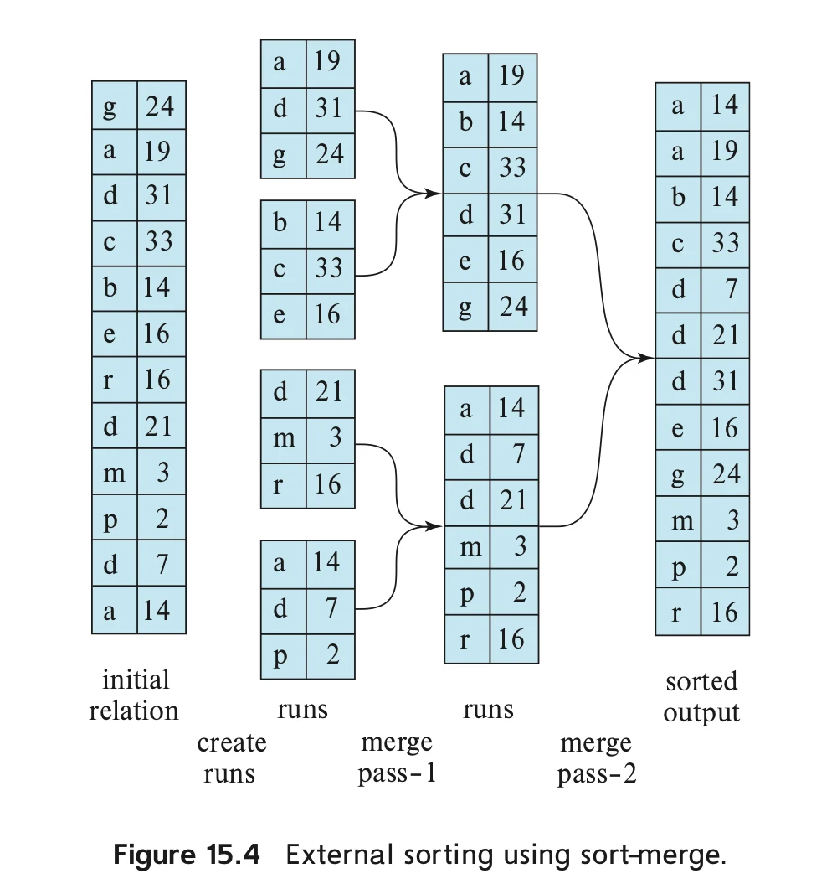
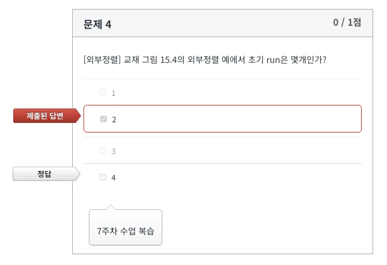
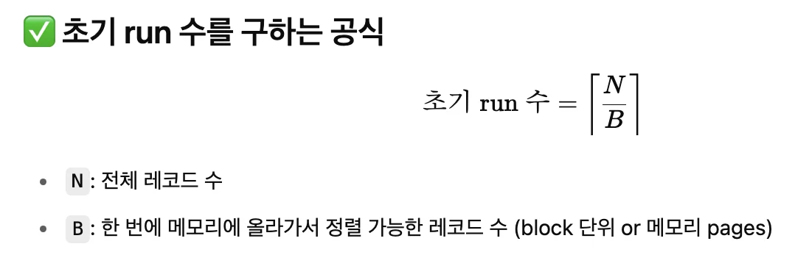
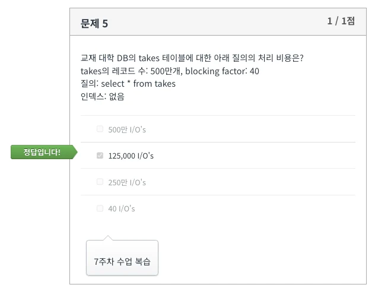
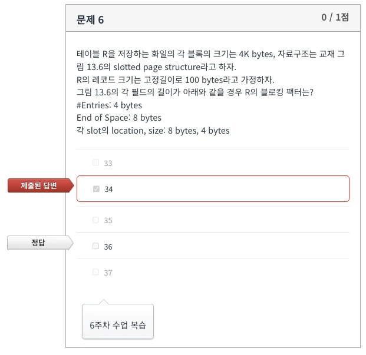
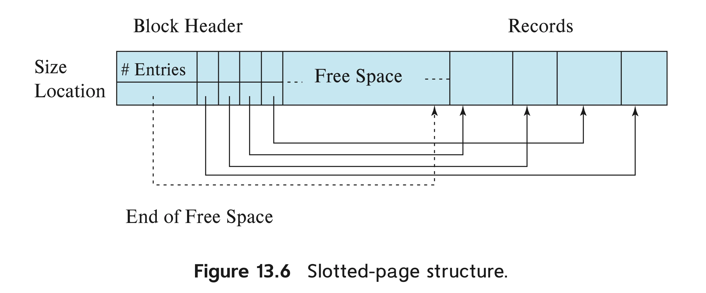
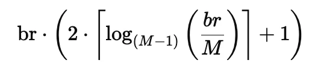

## 과제 풀이

Database System 과제 Q3의 풀이 과정이다.

그림보면 2번

M=3이었다

  
12/3 = 4

  
500만/40 = 125000

## 외부정렬의 비용계산

- br: 정렬할 전체 블록 수 (block of records)

- M: 사용 가능한 메모리 블록 수 (즉, 한 번에 메모리에 올릴 수 있는 block 수)
- M-1: 한 번의 merge pass에서 병합 가능한 run 수
  (M개의 블록 중 1개는 output 용도로 쓰고 M-1개로 merge 진행)
- log(M-1)(br/M): merge pass 수
  (M-1 way merge를 반복해서 전체를 하나로 만들기 위해 필요한 횟수)

- ceil(br/M) : 초기 run 수
