## 7주차1st ch15

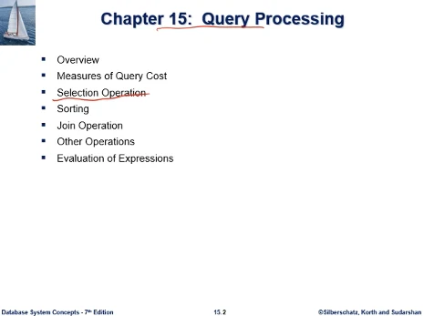  
select 연산 알고리즘과 비용식

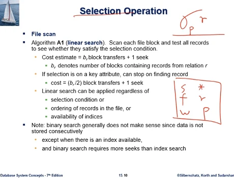  
이 연산을 수행하는 가장 기본적인 알고리즘은 파일스캔이다.

파일스캔은 모든 블록을 다 읽어서 조건 충족하나 체크하는 단순한 알고리즘, linear search 라고도 부른다

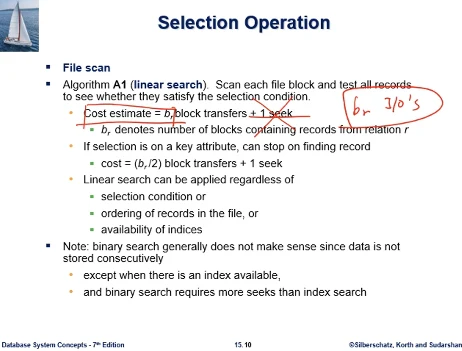

비용식은 b_r = 테이블 r을 저장하는 블록의 총 개수다. seek는 무시한다

우리가 디스크에 테이블 R을 저장하고 있는 블록이 b_r 개. 이것을 버퍼로 한 블록씩 다 읽는것이다. 이 속에 bf만큼 레코드가 있는데. 각 레코드가 조건을 충족하는지 보는것이다.

참고로 seek 1번은 디스크의 b_r개의 블록이 모두 물리적으로 인접하다고 가정한 것이다. 한번만 seek 하면 나머지를 다 읽을수 있다고 가정한것인데. 일반적으로 이것은 보장할수 없다. 우리는 블록io횟수만 비용식에서 본다.

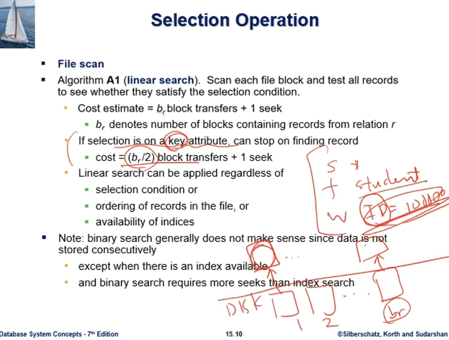
파일스캔의 비용식은 가장 간단한 case 였다. 약간의 variation을 두면, select를 하긴 했는데 key(고유식별자 의미) 를 충족하는 레코드는 1개 뿐이다. b_r개 블록이 있는데 가장 best는 첫번째 블록이고 worst는 마지막 블록에 있는것이다. 그래서 평균은 b_r/2번 io를 하면 답을 얻을수 있다

파일스캔, linear search 는 가장 기본적인 방식으로, select연산 조건, 정렬순서, 인덱스 유무와 무관하게 적용된다.

### 연습문제

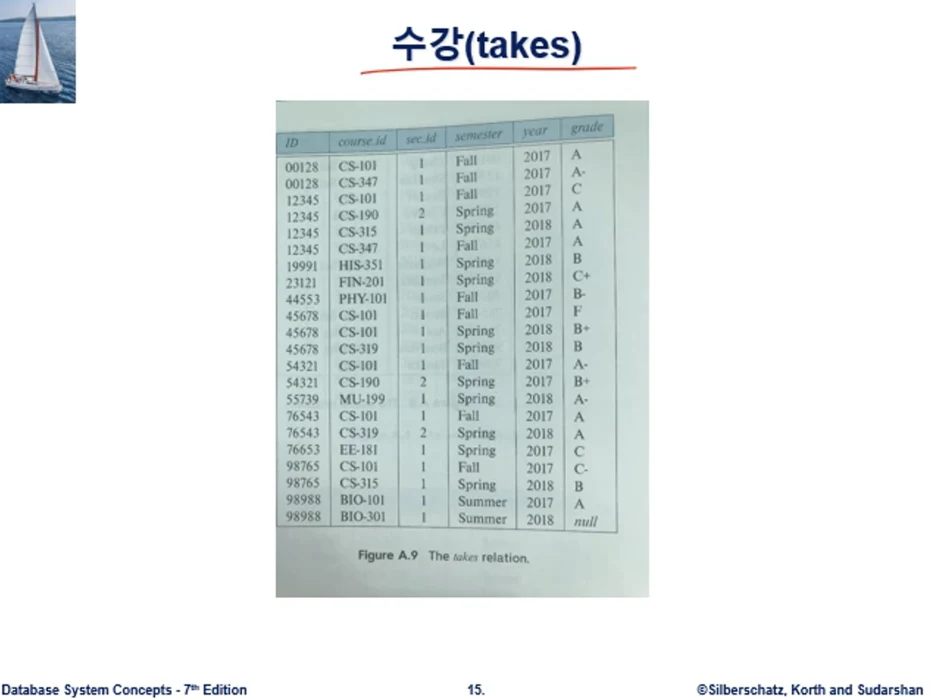  
수강테이블은 학생 id 학번 들은수업 성적 칼럼으로 구성됨

문제 : 수강테이블의 레코드수가 500만개, bf=40, select \* from takes, 수강테이블의 모든 레코드를 파일스캔으로 수행시 비용은?

답 : 수강테이블의 b_r을 알면 된다. 수강테이블을 저장하고있는 블록수가 몇개인가?, b_r = ceil(500만/40) = 125000. 답은 125000번 io가 질의처리 비용이 된다.

문제 : 수강테이블 500만 레코드, bf = 40, select \* from takes where id=00128, 인덱스는 없다고 가정함. 질의처리 비용은?

답 : 여전히 125000 io's. 인덱스가 없다고 했으니, 00128에 해당하는 레코드 위치를 알려주는게 없음. 파일 전체를 linear search 해야하는 상황 - 근데 이거 2로 나누어야 하는거 아닌가? PK가 아닌건가

문제 : 수강테이블 500만 레코드, bf = 40, select \* from takes where id=00128, 이번에는 수강테이블에 인덱스가 있는걸로 하자. 인덱스를 세 칼럼이 합성한 키 인덱스가 있는걸로 하자. 합성키(어느과목,어느학기,어느년도) 이 질의처리 비용은?

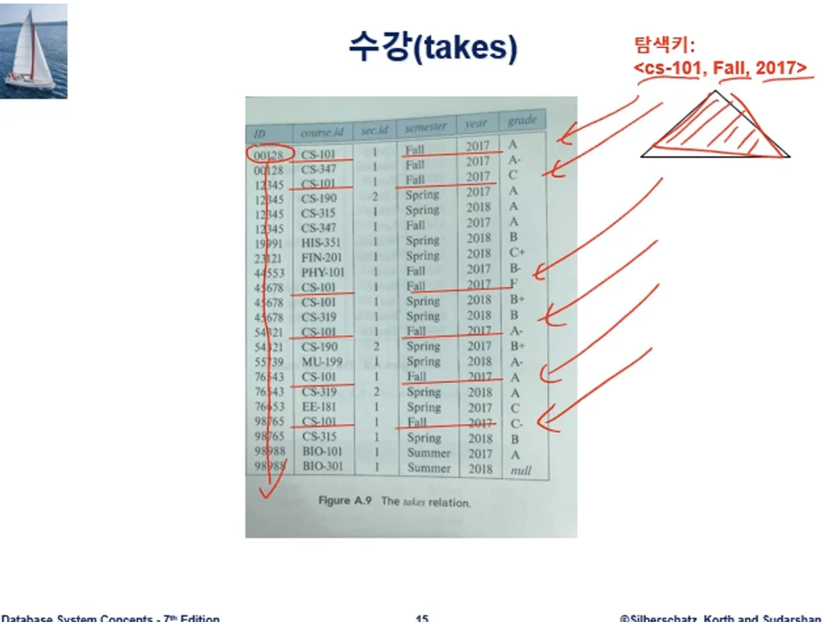  
답 : 인덱스의 탐색키 예로서 위와 같은 합성키 값을 주면 인덱스가 해당 레코드 위치를 바로 준다. 그런데 질의는 00128 학생의 레코드 위치를 요구. 이건 바로 못 알려준다. 그래서 전체 파일을 스캔해야함. 그래서 여전히 125000 블록io가 된다.

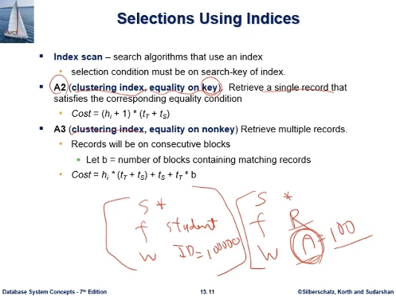

이번에는 파일스캔이 아닌 인덱스 스캔이다. 인덱스가 존재하고 인덱스를 이용한다. where 조건 컬럼에 대한 인덱스가 있는 상황이라고 해보자. 이런경우 수행 알고리즘이 어떻게 되는가.  
이런경우 인덱스의 종류가 성능에 결정적인 영향을 미친다.

인덱스의 종류가 성능에 결정적인 영향을 미친다. 집중 vs 비집중

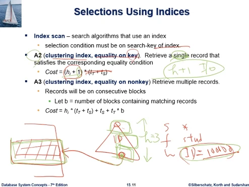

- 인덱스가 집중이고, 조건자체가 equality on key(여기서 key는 고유식별자 PK)

where id = 100000 하면 이걸 만족하는건 한개뿐이다. retrieve a single record  
앞서 수업에서 transfer time, seek time 포함한 비용식의 경우, transfer = 1, seek = 0으로 고쳐서 본다.  
고치면 (h+1). 이것은 디스크 블록 io의 총 횟수이다. h 는 b+tree인덱스의 높이

왜 h+1인가? h가 높이다. b+tree는 노드 자체가 하나의 블록이므로. 리프노드까지 도달하고, 가리키는 블록까지 읽어오기 위해서 +1. 충족하는 하나의 레코드가 블록 안에 들어있다는 이야기다.

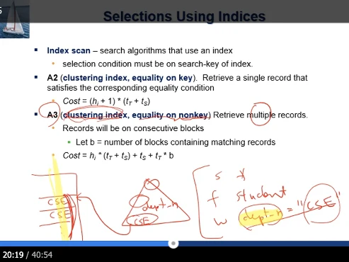

- 인덱스 자체는 클러스터링 인덱스가 맞는데, 조건 자체가 equality on nonkey

select \* from student where dept_name='cse' 이걸 충족하는 레코드가 Multiple record  
학과 이름에 대해 인덱스가 있는데, 루트에서 cse까지 찾아 내려가고, 인덱스 자체가 클러스터링 인덱스이므로, 찾았을때 학생 테이블에 가보면 cse 학생 레코드들이 쭉 모여있다. clustering index는 테이블 자체가 학과이름 컬럼으로 정렬되어있는 상태를 말함.

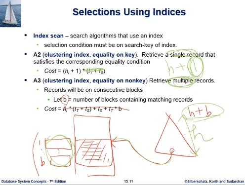

이때 비용식은 단순화하면 h_i + b  
위에서는 1이었던게 b가 되었다. b는 number of containing matching records  
인덱스가 where 절의 조건으로 테이블에 갔더니. 이 레코드들이 들어있는 블록의 개수가 총 b개라는 이야기다. 읽어야하는 분량이 블록수로 보면 b번

### 연습문제

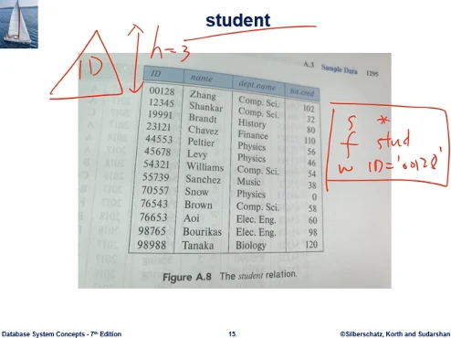

학생 테이블에 대한 질의로 select \* from student where id='00128' 이 질의 처리하는 인덱스 스캔 비용은 얼마가 되는가. 인덱스가 높이 3짜리 id에 대한 인덱스가 있다.

- 답은 3+1 = 4

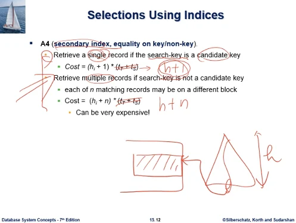

이번엔 비집중 인덱스인 케이스로, 2가지 케이스가 있다.

- 하나는 where절에 조건에 사용된 search key가 후보키여서, 질의결과 충족하는 레코드가 1개인 경우.

비용식을 단순화하면 h+1

- 질의결과 충족하는게 여러개

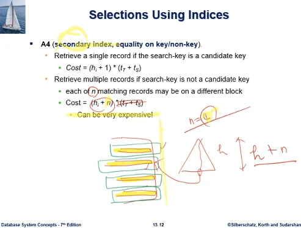

문제는 이 경우이다. 조건 충족하는 레코드가 여러개. 비집중 인덱스이므로 그 레코드가 여기저기 흩어져있다. n은 질의결과를 충족하는 레코드의 개수이다. 이 레코드들이 집중인덱스처럼 모여있지 않고, 디스크상 여기저기 흩어져 있는 상황이다.  
최악의 경우는 각각 레코드가 별도 블록을 하나씩 차지하는 케이스이다. 그렇게 되면 n이 각각 다른 블록에 있게 되는것. 그만큼 io해야한다. h + n 이 된다.  
마지막에 나온것처럼, 인덱스를 사용함에도 검색성능이 좋아질거란 생각이 있지만, 많은 블록을 io해야할수 있다. 이것이 secondary index의 문제점이다

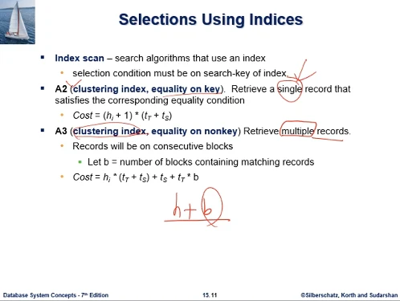

집중인덱스와 비집중 인덱스가 질의성능에 미치는 차이는 크다. 인덱스 단원부터 강조하여 이야기함.  
pk에 조건을 주고 레코드 1개 뽑는데는 집중이나 비집중이나 큰 차이가 없다. 레코드 한개 뽑는거라서 그렇다.  
문제는 레코드를 여러개 뽑을때 대상 레코드가 집중인지 비집중인지가 io횟수에 큰 차이를 낸다.

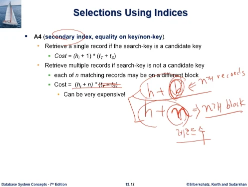

clustered는 h+b번이었고, non clustered는 h+n번이었다.  
b개의 블록속에 n개의 레코드가 모여있는 상황인데, 비집중의 경우인 지금은 n개의 레코드가 n개 블록에 흩어져있는. 레코드당 1 블록씩 차지하게 되는 상황인것이다. 결국 n 개 블록에 가있는 상황이다.

그러면 b의 값이 어느정도 되는가의 문제가 있는데, 어떻게 추정할수 있을까?  
집중인덱스의 경우 n개의 레코드를 뽑는데 b개 블록에 있다. b는 어떻게 알수 있을까? bf를 통계 데이터로 dbms가 가지고 있다.

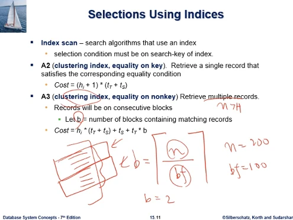

n개 레코드가 집중해서 모여있는데, 한 블록안에 bf개수만큼 모아놓게 되니까 그만한 블록수가 나오게 된다. 정확하게 정수로는 ceil을 취해서.  
n = 200개 레코드이고, bf = 100이라면 b = 2. 2블록만 엑세스하면 200개 레코드를 뽑게된다.

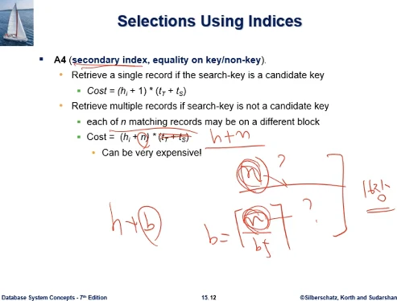

마찬가지 질문으로 비집중 인덱스에서 n개가 매치된다고 했다. 그럼 n은 어떻게 나오나?  
집중인덱스에서도 h+b였는데, b = ceil(n/bf) 였다. 집중 인덱스에서도 n은 알아야 한다.  
이 부분은 질의의 조건에 따라서 통계 메타데이터로 추정해 나간다. 이 내용은 16장에서 다룬다.

### 연습문제

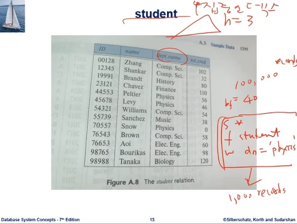

문제 : student레코드의 테이블수 10만개, bf=40. select \* from student where d_n = 'physics'. d_n칼럼에 대한 집중인덱스가 h=3인것이 있다. 질의결과의 레코드수는 1000개이다. 물리학과 학생이 1000명인것.
이 집중인덱스를 사용해서 인덱스 스캔의 질의처리 비용은 얼마인가?

- 답은 h+b 가 비용식이었다. b가 1000개 레코드가 결과로 인덱스에 의해 뽑아지는데, 집중인덱스이므로 1000개가 모여있다. 40으로 나누면 b = 25블록이다. 3 + 25 = 28 io's

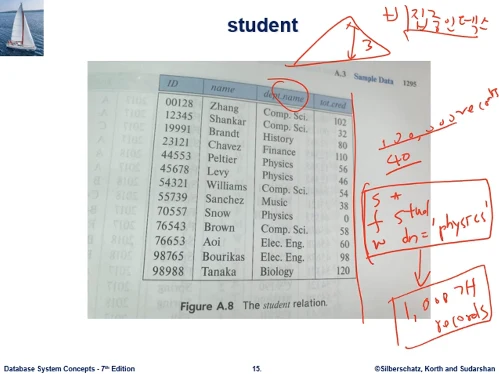

문제 : student레코드는 10만개, bf=40, select \* from student where dn='physics', 이 학과 칼럼에 대해 비집중인덱스 h=3, 1000개 레코드가 결과셋에 나온다. 이 비집중 인덱스를 사용한 인덱스 스캔의 질의처리 비용은?

- 비용식이 h+n=3+1000, 여기서 1000개가 비집중인덱스 이므로 각각의 레코드가 최악의 경우 독립된 디스크 블록에 따로 저장되어 있다. n=b가 되고 이것이 1000 이므로 1003번

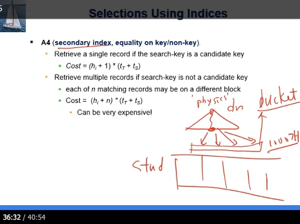

한가지 코멘트를 줄것은, 학과이름 비집중 인덱스에서 물리학과를 탐색키로 리프에 도달하면, 레코드 포인터가 1000개가 있다. 사실 이 1000개 개수 레코드포인터가 있으니까 그걸 저장하는, secondary index 구성 방법중 bucket 을 이용해서 레코드 포인터를 갖고 있었을거다.  
그런데 bucket자체도 공간을 차지하는데 이것을 엑세스 하는 io비용도 있을것이다. 교재 비용식은 그냥 단순하게 버킷부분은 무시했는데, 무시했다고 해서 대략 했다기보단, n이 최악의 경우를 가정한 것이므로. 버킷 엑세스 비용 자체는 +n 부분에 어느정도 다 소화흡수 될수 있기 때문에 교재 비용식이 h+n으로 버킷을 무시하고 잡혀있다.

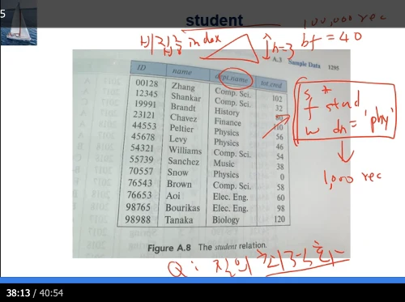

문제 : 학생테이블 레코드수 10만개, bf=40, select \* from student where dn='physics', 결과 레코드가 1000개. 학과에 비집중 인덱스가 있디고 가정, 높이는 3이다. 질문이 그동안은 질의 처리 비용이었는데, 이 질의를 최적화 해보시오 라고 질문해본다. 최적의 질의처리 전략을 찾는것. 이 질의를 처리하기 위한 가능한 전략들을 다 알아야 하고, 각각의 비용을 다 알아야 한다. 최적화해보자

- 우선 비집중 인덱스가 있다고 했다. 그 비집중 인덱스를 사용하는 전략이 하나 있을것이다. h+n = 3 + 1000 = 1003 io's
- 또 하나의 대안은 linear search 하는것이다. 비집중 인덱스를 쓰지 않겠다는것. 비용은 b이므로 학생테이블이 모두 몇개블록에 있는지 알면 된다. ceil(100000/40) = 2500블록에 저장된다. linear search 비용은 b_r = 2500 io's
- 우리가 물리학과 학생 찾는 질의의 2가지 전략을 생각했는데, 비집중 인덱스 사용한 인덱스 스캔은 1003번 io. 파일스캔 linear search 사용시 2500 io's. 가용한 전략 2가지중 비용이 낮은것은 인덱스 스캔이다. 비록 비집중 인덱스였지만 파일스캔보다는 비용이 낮다. dbms가 이 전략을 선택하게 될 것이다.

## 7주차2nd ch15

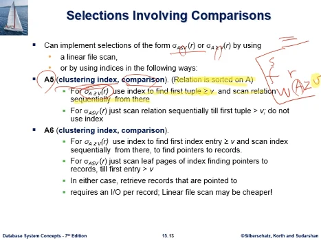

지금까지 다루어왔던 select의 조건이 equal 조건이었다. 대신 부등호가 온다면 어떻게 될까? 이 경우 기본적으로 linear scan 은 언제든 쓸수있는 기본적 알고리즘이다.

또는 인덱스가 있는 경우, 인덱스를 쓸수있는데 방법은

- clustering index, comparison(부등호를 말함), A >= V 조건에서

select \* from r where A >= v 질의에서, A에 대한 clustering인덱스라는건, 테이블 자체가 A컬럼에 대해서 정렬되어 있다는 이야기이다. 이 경우 인덱스 활용을 v라는 값을 탐색키로 해서 b+Tree리프노드까지 인덱스를 찾아간다. 거기서부터 인덱스가 가리켜주는 테이블의 해당 레코드를 가면, 거기부터 레코드가 정렬되어있으니 순차적으로 파일 끝까지 가면 레코드를 검색할수 있다.

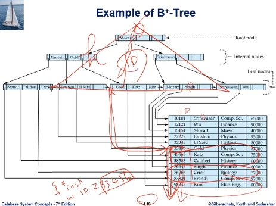

교수테이블의 교수이름에 대해 만든 인덱스이다. 상황이 아이디값으로 정렬되어있다. 이 인덱스가 아이디에 대한 인덱스이다 라고 가정을 하고, 질의 자체를 select \* from instructor where ID >= 33456 이라면 이 33456값을 탐색키로 루트노드애서 찾아오면 인덱스가 이걸 가리켜 준다. 그럼 그곳부터 ID가 정렬되어 있기에 쭉 진행하게 된다. 인덱스를 활용하여 h번 io하고 블록을 쭉 읽는 방식을 말한다.

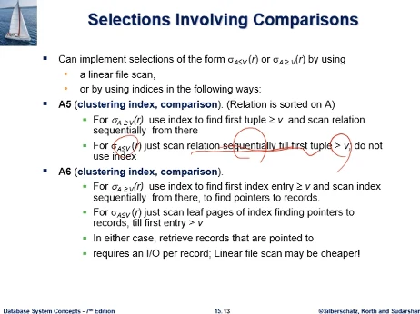

- 부등호가 반대로 되어있다. A <= V 조건에서

v라는 값보다 작은것을 찾는 경우, do not use index, 인덱스를 쓰지말고 그냥 정렬되어 있는 테이블에 가서 첫 레코드부터. 오름순으로 정렬되어있다는 가정하에 첫 레코드부터 V보다 작은값을 지나쳐서 V보다 커지는 대목까지만 차례대로 순차적으로 검색하면 된다.

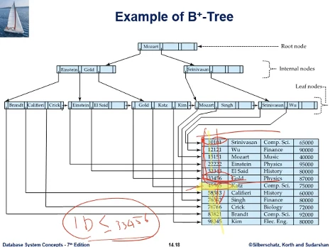

첫 레코드부터 충족한다. 순차적으로 쭉 가서 조건을 만나는데까지 검색하면 된다. 그 뒤는 조건을 어기게 되기에 필요가 없다. 인덱스를 쓰지 않고 파일의 시작에서부터 원하는걸 뽑으면 된다

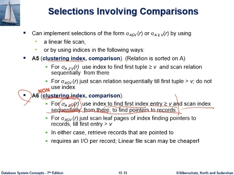

- non clustering(오타가 있다), comparison

A >= V 조건이라면, V보다 큰걸 찾는 경우에는, 루트에서 리프까지 V를 탐색키로 찾아가고, 인덱스의 리프노드를 순차적으로 스캔하면서, 해당 레코드들을 가리키는 포인터들을 쭉 찾아낸다.

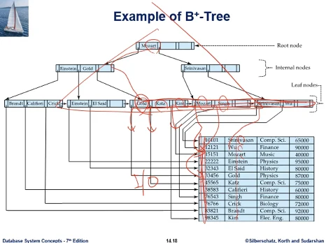

이 경우 자체가 해당된다. 테이블 자체가 이름으로 정렬되어있지 않은 비집중 인덱스이다. 이름이 gold보다 큰걸 찾자고 하면, 이름 큰 값들은 루트노드에 모여있다. 이 레코드 포인터를 가지고 데이터파일에 접근해서 레코드들을 쭉 뽑을수 있다는 것이다. 문제는 오름순으로 해당 레코드가 정렬되어있지 않다. IO가 많이 발생할 가능성이 높다.

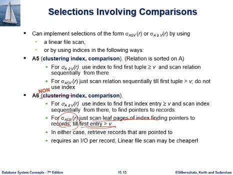

A <= V 조건이라면, 인덱스의 맨 왼쪽 리프노드로 그냥 가서, 거기서부터 리프노드를 따라서 검색하면, 언젠가는 V값을 넘어가는 대목이 나온다. 거기까지 레코드포인터를 뽑으면 된다.

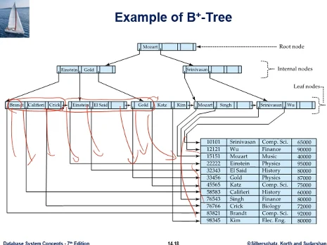

만약 name <= Gold 라면, 맨 왼쪽 리프노드부터 gold를 넘어설때까지 보면서 포인터를 쫓아 해당 레코드 포인터를 뽑으면 된다. 여기서도 문제는 포인터가 가리키는 레코드들이 집중되어있지 않고 흩어져있기에 IO가 많이 발생할 수 있다.

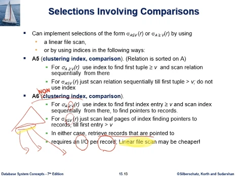

비집중 인덱스의 경우 정리를 하면, 부등호 방향이 어떻건간에 인덱스의 리프노드가 가리키는 레코드 포인터를 쫓아 데이터파일에서 검색하게 되는데, 최악의 경우 레코드 한개당 서로다른 블록에 있어서 IO를 한번씩 하는 경우가 발생할수도 있다. 어쩌면 linear scan보다 못할수도 있다.  
그래서 sql 처리기가 통계 데이터를 바탕으로 어떤 전략을 선택할지 판단할 것이다.

### 연습문제

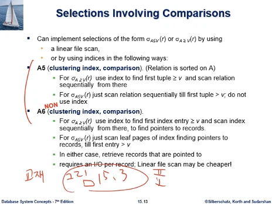

문제 : A5의 비용식, IO횟수는? select 조건은 A >= V 경우이다  
A6의 비용식, IO횟수는? select 조건은 A >= V 경우이다

- 교재 15.3 그림에 비용식 정리한 표가 있다. 단 우리는 t_T = 1, t_s = 0 으로 둬서 seek time을 배제하고, io횟수만 고려하기로 했었다.

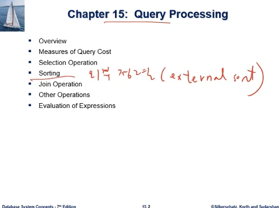

외부정렬 external sort

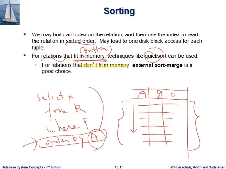

우리가 테이블의 레코드들을 정렬된 순서로 접근할 필요성이 많이 생긴다. 그리고 sql을 공부할때도 select \* from R where P 하게되면 충족하는 레코드들이 검색되는데, 여기에 order by A 이렇게 해서 result set의 레코드들을 A칼럼값 순으로 정렬해서 보여달라.

예를 들어 결과 셋이 세 칼럼으로 구성된다고 할때, A칼럼값 오름순으로 레코드들이 정렬되어서 결과셋을 뽑아달라고 요청할때가 더러 있다. 레코드들을 정렬할 필요성이 데이터베이스에서 생기는데, 가끔 아주 작은 테이블이거나 결과셋의 레코드 테이블이 작다(dbms 메모리 버퍼에 내용이 다 적재될수 있는만큼 작다) 면 우리가 잘 알고있는 정렬 알고리즘을 사용해서 정렬이 가능할 것이다. 그러나 데이터베이스 환경이라는것 자체가 그렇지 않을 경우가 많이 있다. 메모리에 정렬할 레코드들을 다 적재할수 없는 케이스들이 비일비재할 것이다. 그때 사용하는것이 데이터는 디스크에 있고, 디스크 기반의 데이터를 정렬하는 외부정렬이라는 알고리즘이 필요하게 될 것이다.

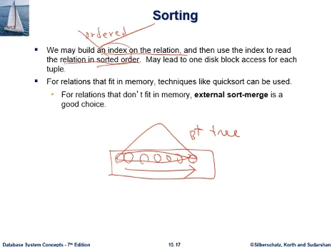

우리가 테이블에 인덱스가 있어서, 인덱스는 ordered index라는 용어를 썼었다. b+tree에 리프노드에 가보면, 키값들이 정렬되어있다. 맨 왼쪽 리프노드부터 해서. 이 리프노드의 정렬순서를 이용해서 레코드들을 정렬된 순서로 접근하는것이 가능할 수 있다.

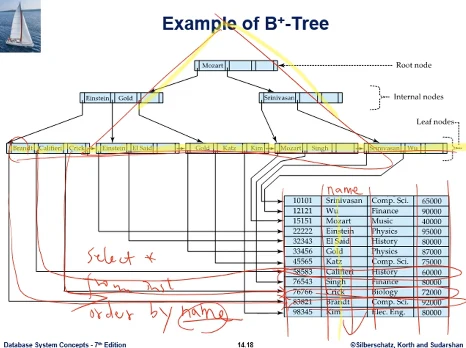

예를 들어 교재의 instructor테이블이고, 인덱스 자체가 교수 이름에 대해 만들어진 인덱스라고 하자. 그럼 리프노드에 가보면 이름순으로 오름순 정렬이 되어 있다. 그러나 레코드는 정렬되어 있지 않은 secondary index 상황인데, 만약 질의가 select \* from instructor order by name 이렇게 하면, 결과를 이름값의 오름순으로 보여달라는것이다. 그런데 테이블 자체는 오름순 정렬이 되어있지 않고, 리프노드가 정렬되어 있기 때문에 리프노드에서 Brandt, Cali.. 순서로 진행을 하면 이름순으로 정렬된 결과를 얻을수 있을것이다.

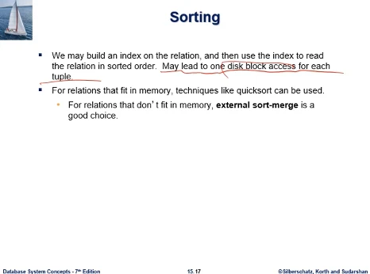

근데 그렇게 하는 방식의 문제점이 뭔가 할때, may lead to one disk block access for each tuple. 레코드 하나 접근할때마다 디스크 블록 하나씩 엑세스 해야한다.  
위의 그림에서 리프노드를 따라가면서 레코드를 포함하는 디스크 블록을 읽어올때, 하나 읽을때마다 다음게 또 다른 블록에 있을수 있다. 정렬순서로 접근은 가능하지만 디스크 io가 최악의 경우 key값마다 한번씩 io해야하는 나쁜 성능을 낼수가 있다.  
차라리 이 레코드들을 디스크에 둔 채로 외부정렬해서 이름값으로 정렬하자 그것이 io수가 적게 들수 있다.

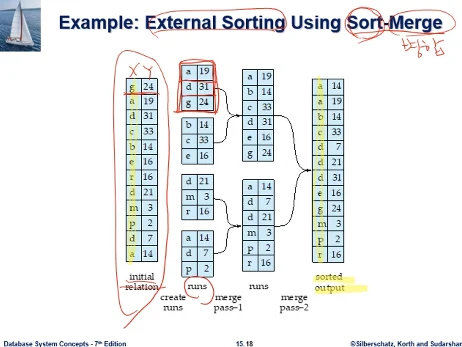

외부정렬은 정렬과 병합(merge)과정을 통해서 진행이 된다. 크게 이야기하자면 정렬할 데이터 사이즈가 메모리에 동시에 적재되기에는 너무 크다. 허용되는 메모리 크기만큼씩 조금씩 데이터를 분할해서 메모리에 적재한다음 퀵소트가 되었던 힙소트가 되었던 부분부분 정렬한다음 그 정렬된 내용들을 merge 해서 전체적으로 정렬하는 과정을 진행하는 것이다.

비록 작은 예제지만 데이터가 크다고 하고 예시를 보면. 목표는 x칼럼값 오름순으로 정렬하고 싶은것이다. 지금 데이터사이즈가 커서 메모리에 동시에 적재할수 없다. 메모리는 어느정도 사용할수 있을까? 그림에서는 레코드 3개정도 동시적재가 허용되는 상황이다.

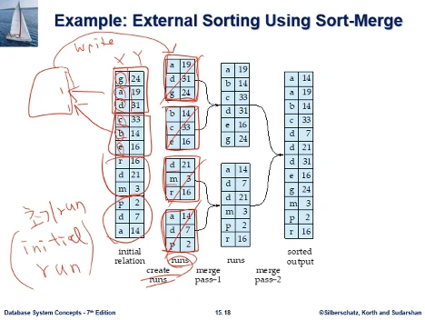

run이라는 용어가 나온다. 처음에 하는일은 run을 만들게 된다. create run.  
레코드 3개는 동시에 메모리에 올릴수 있다. 이 셋을 올려서 x칼럼에 대해 오름순 정렬한 결과가 나온다. 이 정렬된 형태는 메모리에 가지고 있는다.  
그러나 이것이 쓸수있는메모리를 다 차지하고 있으므로 디스크에 쓰게된다. 디스크에 쓴 모습이 예제의 모습이다.

그럼 다시 메모리 버퍼는 레코드 3개를 담을수 있을만큼 비게 된다. 그 다음 3 레코드를 메모리에 올려서 정렬해서 쓰게 된다. 다음 3개를 내부정렬해서 디스크에 쓰게 되고, 이걸 계속하게 된다.  
이런식으로 만든 각각을 run이라고 부르고, 특히 막 만든것을 초기 run, initial run 이라고 부른다. 처음 만들었다는것. run이 4개가 만들어졌고, run들이 디스크에 있는 모습이다.

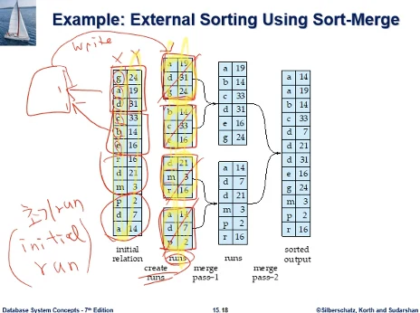

여기까지를 정리해보면 전체가 디스크에 있었고, 레코드 3개씩 분할해서 run을 만들어서 다시 전체로 디스크에 있는 모습이다

그 다음에는 레코드 3개짜리 run 2개를 merge 해서 큰 run을 만든다. 이 과정을 보면 3개짜리 2개 run을 정렬해서 6개짜리 큰 run을 만드는데, 6개짜리 큰 run을 메모리에 적재할수 있다면 이런짓을 할 필요가 없다. 우리는 메모리 3개짜리 공간밖에 없다. 어떻게 merge 해서 큰 run을 만드는가?

지금 3개짜리 run 2개도 디스크에 있고, 6개짜리도 디스크에 있는것이다. 녹색으로 쓰인것은 메모리 버퍼 공간이라고 하고 레코드 3개가 적재 가능한 공간이다.  
디스크에서 대략 3등분한다고 보고, 실제로는 3등분한 정도가 1block라고 본다. 디스크에 IO를 하는. 버퍼에서는 page라고 한다. 현재 예제는 한 블록에 레코드 1개밖에 못들어가는 극단적인 예제 상황이다.

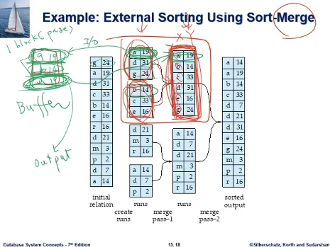

그래서 한 디스크 블록에 해당하는 a-19를 io해서 버퍼에 읽어온다. 나머지 아래 둘은 디스크에 있는것이다. 다른 run에서는 b-14가 온다. 둘간의 크기관계를 따져서, a가 작은데, 비어있는 한자리를 output용도로 쓴다. a-19를 쓰는 순간 가득차서 공간이 없게 된다. 디스크에 내다 쓴다. 6개짜리 큰 run에서 하나가 채워진다.

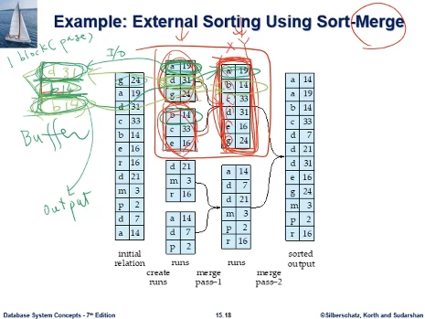

그 다음 a-19 다음것인 d-31을 가져오고 비교한다, b-14가 작으므로 맨 아래 공간에 오고, 공간이 가득 찼으므로 디스크에 내다 쓴다. b-14가 있던 공간이 비게 된다.  
그 다음에는 b-14의 다음것으로 c-33이 오게된다. 이 과정이 반복되어서 하나씩 디스크에 써 나가는것이다.

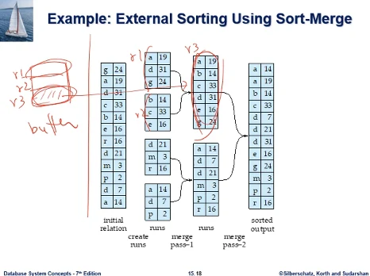

비록 메모리에는 레코드 3개 크기밖에는 동시에 들어올 공간이 없지만. 이 공간을 활용해서, 작은 run 2개를 r1,r2라고 하고 큰 run을 r3이라고 하면, 버퍼의 2자리는 r1,r2를 불러오는 공간, 한자리는 r3 output하는 공간으로 써서, 가득차는 순간 내다쓰는 방식으로, 이 큰 run을 작은 메모리로 만들어낼 수 있다.

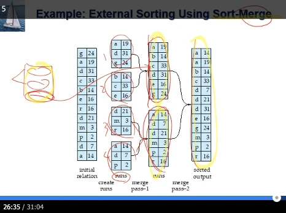

그래서 merge 과정이라는것이 사실 특별한 내용이 없고, 가용할수 있는 작은 메모리를써서 작은 run의 데이터 일부를 가져와서 이들을 merge 해서 output을 만들어서 하나씩 차례로 디스크에 가져다 쓰는 방식이다.

run이 초기에 4개가 있었는데, 1-2, 3-4 이렇게 합쳐지고, 그 뒤 12-34 이렇게 merge 한다. 이것이 sort-merge 하는 외부정렬의 알고리즘이다.

### 연습문제

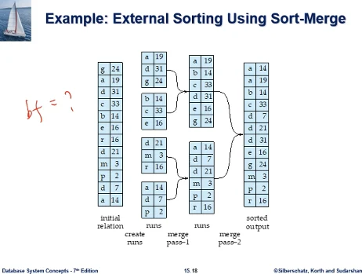

문제 : 지금 설명한 예시에서 bf는 얼마인가?

- 답 : 1

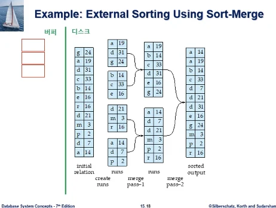

문제 : 이 예시에서 정렬에 사용했던 버퍼 페이지수는 총 몇개인가? M = ?

- 답 : 3페이지, M = 3. 교재의 이 예시는 외부정렬의 과정을 보여주기 위한 작은 예시이다. M=3인데. 이것은 외부정렬을 수행하는데 필요한 최소의 버퍼 페이지수이다. M=3은 되어야 외부정렬이 가능한 것이다.

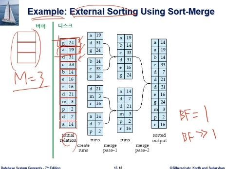

여기 정렬할 테이블의 각 레코드의 적색 박스를 표시했는데, 박스 1개가 1개 디스크 블록이다. 디스크 블록당 레코드가 1개 저장되는 bf=1인 경우인데, 보통 bf>1이므로 교재의 이 예시는 아주 특이한 예시라는점을 참고하자.

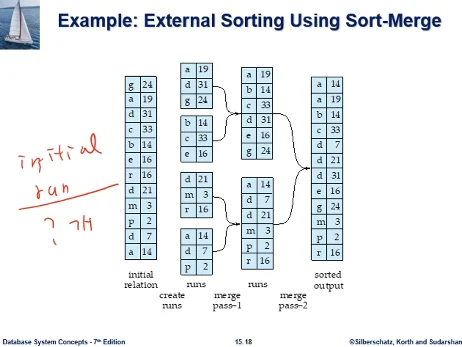

문제 : 이 예시에서 초기 run은 몇개인가?

- 답 : 4개

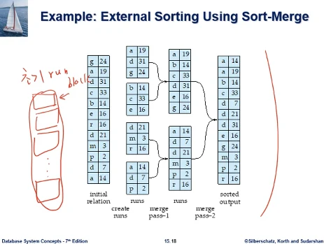

문제 : 이 예시에서 각각의 초기 run은 총 몇개의 디스크 블록으로 구성되는가? 우리가 초기 run이 만들어지면 블록 1개로 데이터가 저장될수도 있겠지만, 일반적으로는 데이터 양이 많으니까 여러개 블록의 초기 run을 구성하는 레코드가 저장된다. 이 예시의 경우에는 각각의 초기 run을 구성하는 블록 수가 몇개인가?

- 답 : 3개

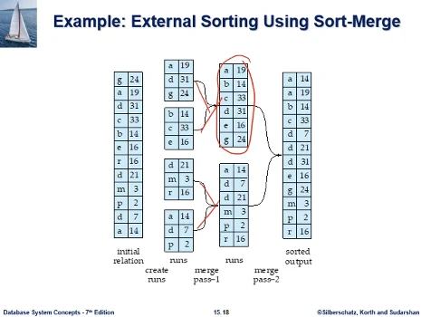

문제 : 초기 run이 merge되어서 생성된 run은 몇개의 디스크 블록으로 구성되는가?

- 답 : 6개 blocks

## 7주차3rd ch15

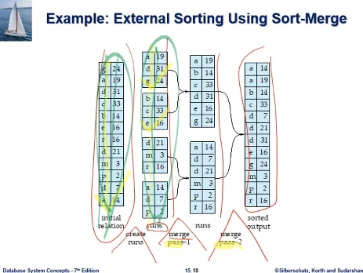

앞의 연습문제 시작전 설명하던 부분에서 이어서. 그림에서 정리하면 처음 테이블에서, 초기 run 4개에서 최종 1개로 merge 될때까지 계속된 것인다. merge하는 단계 아래 pass라는 용어가 보인다. pass는, 테이블을 디스크에 있는걸 한번 처음부터 끝까지 다 읽어서 읽어야 run이 나온다.

전체 테이블을 한번 쭉 읽어서 디스크에 쭉 쓴것이다. 4개의 run의 데이터 양은 처음 데이터양과 같은것이다. 전체 테이블을 한번 쭉읽어서 한번 쭉 디스크에 쓰는 과정을 pass라고 한다.

4개run에서 2개run으로 넘어가는 과정도 한 pass를 거친것이다. 2개 run이 나오려면 4개 run을 다 읽어야한다. 대략적으로 이것이 테이블 사이즈인데, 초기 테이블을 한번 쭉 읽어서 한번 쭉 쓰는것이 pass인것.  
2번의 pass가 merge 단계에서 이루어졌고, 초기 run을 만들때도 1pass 하게 된다.

그래서 이 external sort 하는데 디스크io를 몇번했는지 생각해보면, 이 횟수를 따져보면,

- 정렬할 테이블에 b개 블록이 있다고 하자. 이것을 정렬하기까지 IO를 몇번하는가?

1pass에 2b의 IO이다. b개 블록을 다 읽어야하고, 그만큼의 블록을 써야 한다.  
merge pass자체도 1pass이다. 총 6b번의 IO이다.

일반화해서 식을 만들어보자.  
M/bb에서 b_b는 seek time을 고려한것으로, 고려하지 않기로 했으므로 그냥 1로 하자. (floor(M/b_b) - 1) 이것이 M-1이 된다.

- b_r (2 \* ceil(log \_(M-1) (b_r / M)) + 1)

여기서 M은 메모리 버퍼의 개수이다. 아까 예제에서는 3이었다. 버퍼에서 쓸수있는 페이지 수.

아까 예제면 M-1=2가 된다. log_2 가 무엇인가?, 아까 예제는 merge 할때 run 2개를 합쳤다. 2-way merge 이다.  
지금은 레코드 하나가 디스크 한블록, 메모리 버퍼에 페이지 3개가 있는 상황이고, IO횟수가 1pass에 2b IO를 하는 상황이다. 3번의 pass를 했으므로 2b \* 3 = 6b번 io를 한다. b= 12이므로 72번의 IO를 해서 외부정렬이 이루어진다.

공식대로 6b가 나오는가 확인해보자. 아까 테이블의 블록수가 12개였다. b_r = 12

- 12 (2 ceil( log \_2 (12 / 3)) + 1) = 5 b_r 이 된다.

왜 b 하나가 차이가 나는가?

지난 수업에서 이 이야기를 했었다. 공식을 만들때 연산별로 IO횟수 공식을 만들때, do not include IO cost to writing output to disk. 최종 결과를 디스크에 쓰는것은 배제한다.

질의결과가 있을때 최종적으로 질의결과는 동일하므로, plan이 여러개라도 최종결과는 동일하기에 이것을 디스크에 쓰는 비용은 똑같다. 이걸 뺸 나머지만 공식을 따진다.

정렬도 하나의 연산으로 보았을때, sort-merge 말고 변형된 정렬 방법들이 있다. 다른 방식으로 하면 IO비용이 다 다르게 나올텐데 이것도 최종결과를 디스크에 쓰는 비용은 똑같다. 이걸 빼고 공식을 만든다.

최종 output인데 공식에서 b_r번 IO를 하게되는데, 이것은 공식에서 뺀다. 그래서 6b가 아닌 5b가 나왔던 것이다.

- 비용식을 최종 정리를 하면 b\*r (2 log \_(M-1) (b_r/M) + 1)
- 여기서 (b_r/M) = 초기 run의 개수이다
- M은 메모리 버퍼 페이지 수
- b_r은 정렬할 데이터에 저장하고 있는 블록 수

예제에서 보면

- b_r = 12
- M = 3
- 초기 run은 12/3 = 4개
- log \_2 (4)가 나오느데 이것이 pass 수 이다.
- 밑수가 M-1 = 2가 나왔는데, -1은 M개 버퍼중에서 1개는 output으로 써야한다. 만약 M=5였다면 4-way merge가 가능하다. 4개 run에서 불러와서 가장 오름순으로 작은것이 무엇인가 따져서 하나씩 내다쓰는 과정을 거치면 되는것. 예제에서 4-way merge였더라면 1pass에 결과까지 간다. 메모리를 많이 쓰니까 정렬하는데 시간이 덜 드는것이다.

이 식에서 M-1 way merge를 한다는 것이다. M값이 크면 클수록 외부정렬 시간 줄어든다는 것을 알수 있다.  
b_r/M은 초기 run의 수라고 했었고, log 식의 값은 merge 단계에서의 총 pass 수라고 했었다.

지금까지의 설명을 수도코드로 정리한 것이다.

M은 최소 3은 되어야 한다. 버퍼의 페이지수이며, 2-way는 merge 해야하며 1개는 output해야 한다. M>=3

1. 초기 run을 만드는 단계. 0번 run부터 하나씩 만든다. 초기 테이블에서 버퍼를 M개 쓸수있으므로 테이블을 M개 블록씩 버퍼로 읽어와서, 내부정렬(퀵이나 힙소트) 해서 디스크에 가져다 쓴다.
2. merge 단계 들어감

여기서 초기 run은 R_0부터 R\_(N-1)개까지 N개의 초기 run이 만들어졌다.  
merge 단계에서는 만약 N < M 이라면 N-way merge 하면 된다. M은 최소한 N+1은 되는것이다, M >= N+1  
한개 버퍼 페이지는 output 용도로 사용하고, 나머지 N개 페이지는, 초기 run이 N개가 있으므로, N개 run당 각각 1페이지씩 할당이 가능하다. 그렇게 해서 N-way merge 진행해서 정렬을 완료하는 것이다.

이 과정을 수도코드로 쓴것으로, N = 3이라고 하면, 1개를 output용도로 쓰고, 각 run의 first block을 가져온다

그 다음에 채우는 일을 하는데, 각 페이지에 있는 레코드를 비교해서 작은것을 채워서, 가득차면 디스크에 내다쓴다. 내다 쓰면 비워주고, 다른 레코드들에 대해서 채우기 과정을 계속한다.

그러다가 어느 한 페이지의 레코드들이 다 소진되면, 그곳은 다음 블록의 레코드들이 올라와서 그 과정을 계속한다. 그래서 버퍼에 올리온 레코드를 다 소진해서 merge된 run을 다 만든다. 버퍼 페이지가 비게 될 떄까지. 반복한다.

N < M 조건 성립시에는 Merge 단계에서 1 pass로 정렬이 완료된다. 그런데 M이 N보다 작을수도 있다.  
이 case는 M=3, 2-way merge 밖에 못한다. 1개는 output용도.
디스크에는 run이 8개라고 하자. 이러면 2개씩 merge 할수밖에 없다. 버퍼수가 초기 run 수보다 작다고 해서 못하는건 아니다.

단 merge 단계에서 한번이 아니라 복수 회의 pass가 필요한 것이다. repeated passes are performed till all runs have been merged into one

N >= M 이라면, N-way merge를 못하고, 각각의 pass에서 (M-1)-way merge를 하고, 한번이 아니라 복수 회의 pass를 거친다.

예시를 보면 M=11이고, 초기 run은 N=90이다. N>=M이므로 90-way merge는 못하고, 10 way merge를 하게 된다.  
one pass reduces the number of runs to 9, 처음 90개의 run이 있는데, 10 way merge 하므로 10개씩 merge 되니까, 9개로 결과가 줄게 된다. 그리고 이 merge 결과 각각의 run은 10개씩 merge 한것이므로 초기 run의 10배 크기이다.  
이들 9개 run은 10 way merge가 가능하므로, 추가 pass가 1번만 더 있으면 전체 merge가 되어서 외부정렬이 완료된다.  
결국 10-way merge을 써서 2번의 pass로 merge 단계에서 정렬을 완료하게 된 것이다.

### 연습문제

문제 : 이 예시에서 1pass에 필요한 디스크 IO수는 몇번인가?

- 답 : 24번의 IO

문제 : 이 예시의 merge 단계에서 총 몇번의 pass가 일어나는가?

- 답 : 2 passes 가 merge 단계에서 필요했었다. 그림에서 pass-1, pass-2로 나타나있다.

문제 : 만약 초기 run이 1024개였다면 merge 단계에서 총 몇번의 pass가 일어났을까?

- 답 : 앞서 공식에 대한 설명이 있었다. 답은 10번의 pass이다

문제 : 이 예시의 초기 run 생성단계에서는 총 몇번의 pass가 일어났는가

- 답 : 1번, 그림에 답이 있다.

문제 : 만약 규모를 키워서, 파일의 블록수 b_r = 2000개, M=10이라면 초기 run 생성단계에서 pass수는?

- 답 : 1 passes

문제 : 교재 15.1.

- 답 : 교재 홈페이지에 있는 답안을 수정한다

앞에서 공부했던 정렬문제와 기본적으로 동일하다. 차이는 정렬 기준칼럼하고 추가 칼럼의 데이터 값만 바꾼 문제이다. 정렬할 레코드수가 12개인것도 같고, bf=1, M=3도 같다. 외부정렬 과정하고 run 수의 변화 과정도 위 예제의 모습과 동일한것이 정답이다.

그런데 홈페이지 답안에서는 초기 run 4개를 생성하는데까지는 같은데, merge 단계에서 첫번째 pass를 할떄 3개의 초기 run을 3-way merge로 run을 만들어놨다, 그리고 merge 단계 2번째 pass에서 두 run을 2-way merge 해서 merge를 완료했다.

M=3이므로 bf=1일떄는 3-way merge 도 불가능한것은 아니다 그러나 일반적으로 bf>1이다. 이와 같은 교재의 답안은 일반적이지 못하다.

두 부분 다 2-way merge하는 이런 답안으로 수정하도록 한다.

8주차는 중간고사
