## 9주차1st ch15

15장 질의처리. join 연산 처리하는 알고리즘

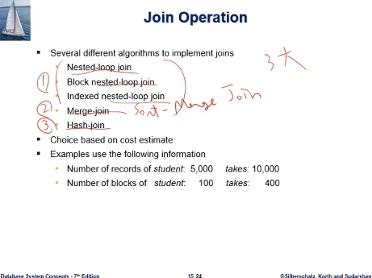
rdb의 조인 연산은 3대 알고리즘이 있다.

- 여기에 중첩 루프 조인이 나온다. 총칭해서 중첩 루프 조인
- merge join, sort- merge 라고도 부름
- hash join

크게 3가지 방법이 있다.

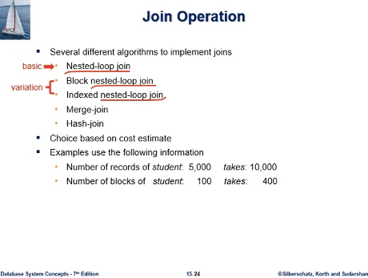

중첩 루프 조인은 nested-loop join이 있고 나머지는 변형된 형태라고 볼수 있다.  
이 단원에서는 각각 알고리즘을 배우고 조인할 테이블 크기에 대해 얼마나 IO를 요구하는지 공식을 만들어보자

예제로는 교재 대학 DB에서 학생 테이블과 수강 테이블을 조인하는 예제로 설명한다.

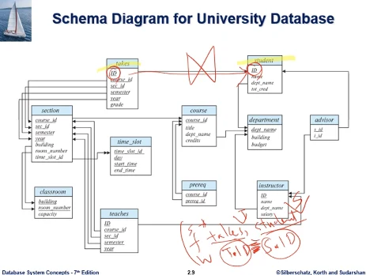

교재 스키마를 보면, 학생테이블과 수강테이블이 있다. 이 두 테이블을 조인하게 되면, 두 ID 칼럼이 equal 이란 조건으로 JOIN이 이루어진다.  
학생은 PK, 수강은 FK이다. 한쪽 외래키가 그것이 참조하는 기본키와 같다는 조건으로 맺어지는 RDB의 전형적인 형태의 join이다

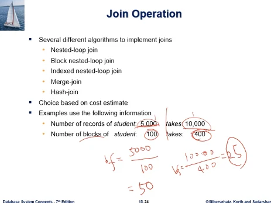
두 테이블의 사이즈는 학생이 5000, 수강이 10000개 레코드이다. 학생이 균등하게 들었다면 학생 1인당 2과목을 수강한것이 된다. 이들 레코드를 저장하는데 필요한 블록 수는 학생이 100 수강이 400이다.

bf = 5000/100 = 50, 학생 테이블이 한 블록에 50개씩 레코드를 넣었다. 수강의 경우 bf = 10000/400 = 25개씩

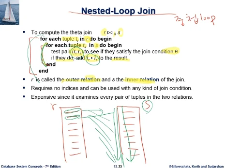

join을 수행하는 가장 기본적인 알고리즘이 중첩 루프 조인이다. 이 코드를 수도코드로 나타낼때 중첩된 루프를 띄게 된다. r의 레코드랑 s의 레코드랑 각각 일대일로 전부 짝짓기를 하여 theta라는 조인조건을 충족하는 짝을 찾아야 한다.

바깥쪽 loop에서 r테이블이 outer 릴레이션이라고 하는데, r테이블의 각 튜플마다 inner loop에 들어가서 s테이블(inner relation)의 inner loop 쪽의 테이블의 레코드랑 짝짓기를 해서 충족하는지 보고, 충족한다면 레코드 짝이 결과로 만들어진다

그림으로 이야기를 해보면, r s테이블이 있을때, r의 한 레코드에 대해서 s레코드를 쭉 원패스 스캔하면서 모든 레코드와 짝짓기를 다 해보면서 조인 조건 충족하는 짝을 찾고, (안쪽 루프가 다 돌면) 바깥쪽 루프로 가서 두번째 레코드를 가지고 쭉 짝짓기를 해보는 가장 기본적인 방식의 조인이다.

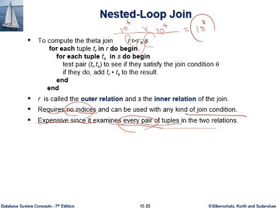

가장 기본적인 방식이기에 인덱스를 요구하지 않고, 조인조건이 임의의 조건이 와도 다 체크해볼수 있는 방식인데, 그 비용이 높게 된다. r-s의 모든 레코드짝을 다 점검하기에  
만약 r이 10000개 s가 10000개 레코드가 있다면 1억개의 every pair을 점검하기에 그 비용이 일반적으로 높게 된다.

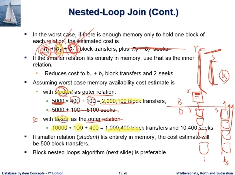

이 알고리즘의 비용식, 디스크 IO수는 이러하다. 우리는 Seek time은 따지지 않기로 했다. b_r, b_s는 r,s테이블의 블록수이고, n_r은 테이블의 레코드수이다.

- n_r \* b_s + b_r

r테이블이 바깥쪽 테이블이고, s테이블이 inner table이다. + b_r 하는것은. r테이블에 b_r개 블록을 전부 한번씩 IO해서 버퍼로 불러 읽어야 한다는 것이고. r테이블의 한 블록을 읽었을때, 한 레코드에 대해서 s를 쭉 다 봐야한다 b_s개의 블록이 있으므로 그만큼 IO를 필요로 한다.

r테이블에 n_r개 레코드가 있고, 그만큼 s를 쭉 다 봐야한다. b_s개의 IO를 필요로 함. 그래서 n_r \* b_s  
내부 루프를 돌때 b_s개의 블록을 outer의 한 레코드에 대해서 b_s번의 IO를 하게 된다. 그리고 외부쪽에는 n_r개의 레코드가 있다.

학생과 수강테이블 조인하는것에서 둘중 어느것을 outer에 쓸지 따져보면, r이 outer이다

- 학생이 외부

5000 \* 400 + 100 = 약200만개

- 수강이 외부

10000 \* 100 + 400 = 약 100만번

outer을 어느 테이블로 택하는지에따라 약 2배의 차이가 나는것을 볼 수 있다.

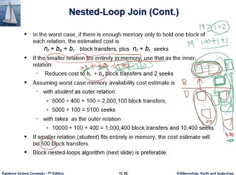

만약 우리가 메모리버퍼를 많이 쓸수있다면 IO수를 더 줄일수 있다. 예시에서는 학생테이블이 100블록으로 더 작은데, 이것을 메모리에 다 적재가 가능하다면 b_r + b_s 이렇게 해서 100+400 = 500 IO's 만 하면 된다.

학생테이블은 모두 100개 블록, 수강테이블은 400개 블록이 있을때, 학생 테이블은 모두 메모리에 띄워놓고, 그 상태에서 수강테이블의 한 블록만 가져와서, 레코드를 전부 짝짓기 해볼수 있다. 끝나면 그 다음 블록을 읽어와서 짝짓기 해보면 된다.

처음 100블록을 다 적재시키는데 100번 IO, 400개 블록을 한번에 1개씩 불러올리는데 400번 해서 500번의 IO만 하면 된다.

이때는 메모리 버퍼가 M = 100 + 1(수강테이블) + 1(join 짝이 나왔을때 결과를 버퍼링할 output page 최소 1페이지는 필요. join짝을 쓰다가 가득차면 디스크로 비워주면 된다. 그리고 다시 채우기 시작.). 그래서 M이 최소한 102개가 되면 500번의 IO로 조인을 할수 있다.

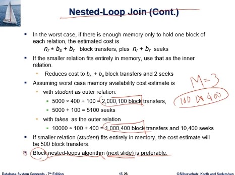

아까 우리가 200만, 100만 했던것은 worst case memory availability라고 했다. M = 3은 되어야 이 알고리즘을 쓸수가 있는데, 학생이 100, 수강이 400 블록인데 IO수가 굉장히 높게 나왔다.  
그래서 다음 슬라이드에 블록이 붙은 알고리즘으로 IO수를 줄일 수 있다고 되어있다

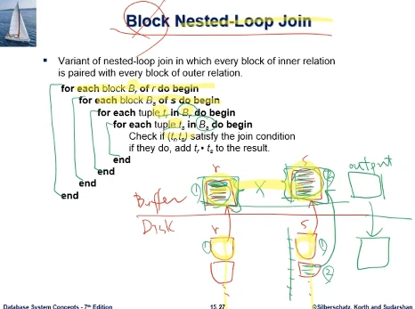

block nested loop join을 보면, 블록이 없는경우와 다르게, 버퍼에 r 테이블의 한 블록을 읽어오면 이 안에 레코드들이 여러개 있고, s테이블의 한 블록을 읽어오면 레코드들이 여러개 있다.

그냥 nested loop의 경우에는 r의 한 레코드에 대해서 s의 모든 레코드랑 다 짝짓기 하는 과정을 수행했었는데, 지금은 버퍼에 불러온것들끼리 전부간 짝짓기를 수행한다. 그 과정에서 join 짝이 나오면 output page에 가득 찰때까지 담고, 가득 차면 디스크에 내다 쓰고 다시 버퍼를 비워주는 과정을 반복하는것

그러다보면 s 페이지에 들어온 레코드들이 다 소진될 것이다. 그럼 다음 블록을 읽어온다 r은 1번 블록 그대로이고 s는 2번 블록인것. 이 과정을 반복한다

수도코드를 보면 중첩 루프 자체가 4단계로 겹쳐져있는데, 맨 안쪽 2개가 그냥 nested loop 블록 잡는 내용이다. r테이블의 레코드와 s테이블의 레코드간 짝짓기를 한다. 차이는 r,s테이블 레코드 자체가 (B_r, B_s라고 표현된건 버퍼에 들어온 블록을 말함) 버퍼에 들어온 블록에 들어있는 레코드간 짝짓기를 한다

맨 바깥에 for each block B_r of r .. 여러 블록중 한 블록 가져와서 짝짓기를 수행하는 과정이다.

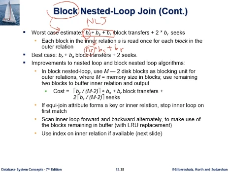

그래서 블록 NLJ를 보면 비용식이 IO횟수가 위와 같이 나온다.

- 그냥 NLJ는 n_r \* b_s + b_r 이었다
- BNLJ는 b_r \* b_s + b_r 이다. n_r레코드수가 b_r 블록수로 바뀐것

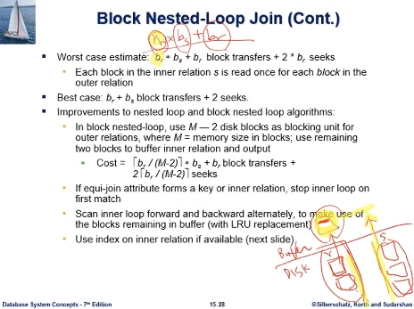

차이를 보면 그냥 NLJ에서는 디스크에 r의 블록들이 있고, n_r \* b_s + b_r 이렇게 있을때,

- b_r : r 테이블에서 한 블록씩 다 읽어와야 하고
- 한 블록 읽어왔을때 한 레코드에 대해 b_s개 다 읽어야 한다.

그런데 BNLJ에서는 n_r이 b_r로 바뀌게 되는 것이다

- b_r개의 블록이 있는데, 그중 한 블록이 올라오면, 한 블록당 b_s개의 블록을 전부 io해서 조인짝을 찾음

학생테이블과 수강테이블 조인하는 예제에서보면 BNLJ비용 자체가

- 학생테이블이 outer일때, 학생테이블이 100블록, 수강테이블이 400블록이므로, 400\*100+100 = 40100번의 블록io를 하게 된다.
- 수강테이블이 outer이라면, 100\*400+400 = 40400이다. 약간 많아졌다.

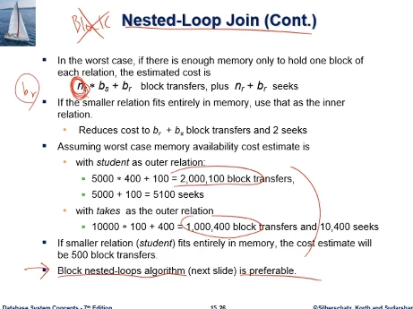

그냥 NLJ에서는 100만 200만번 io를 했었다. 이때는 레코드수가 곱해지므로 많은 io를 했었다. 앞에서 이야기했듯이 BNLJ가 더 선호가 된다. n_r대시 b_r을 곱하므로 io수가 많이 줄어든다. 라고 이야기했었다

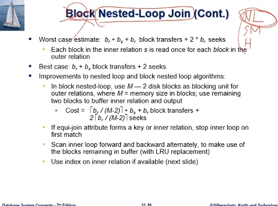

사실 문헌별로 BNLJ인데 그냥 NLJ인 경우도 있다. 문맥을 잘 봐야 한다.  
join의 대표적인 3가지 방법에서

- NLJ - 중첩 nested loop조인
- SM - sort merge
- H - 해시조인

이렇게 3가지가 있는데, 중첩루프조인 하면 교재의 BNLJ를 이야기하게 된다.

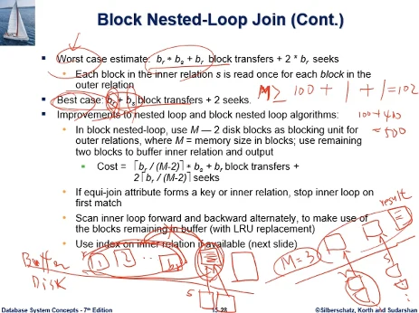

비용식을 구했었는데, 비용식은 worst case라고 했었다. 왜 worst? - 버퍼에서 조인 수행을 위해 사용할수 있는 메모리 공간을 최소로했다. 메모리를 충분히 많이 쓰지 못하고 M=3이다. 3인 이유는 하나는 r,하나는 s,하나는 result이다.

best case는 메모리가 충분히 많은 경우인데 이때는, r테이블 전체를 메모리에 불러오는 것이다. b_r개 전체가 적재되고, s는 한 블록씩 올라오면 된다. 그래서 r의 전체짝과 s를 비교한다. 끝나면 버퍼공간 비우고, s의 두번째블록을 채워서 조인체크를 하는 식이다.

best case의 필요한 최소한의 메모리는, r이나 s중 작은쪽을 다 올리고 상대 한블록, 출력 한블록 해서. M >= 100 + 1 + 1 = 102 이다. 메모리 버퍼 페이지를 최소한 102개 이상 쓸수 있다면

- b_r + b_s = 500 IO로 답이나온다

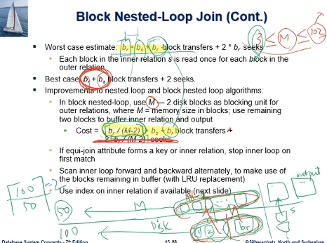

그다음 일반형으로 n개의 버퍼가 주어져있다 할때, 비용식이 어떻게 되는가? seek는 무시한다.  
3 <= M <= 102 일반적으로 M개가 주어지면 어떻게 되는가

- ceil( b_r / (M-2)) \* b_s + b_r

r이 outer인 상황이다. 이전에는 outer table 한 블록당 s테이블을 체크한다는 비용식이 쓰여졌다면, 지금은 버퍼가 3개보다 많다. M개가 있다. 늘어난 버퍼중 2개를 빼고 (하나는 s,하나는 output) M-2개의 여유가 있다. r테이블에 b_r개의 블록이 있는데, M-2개씩 한번에 읽어들인다.  
b_r / (M-2) 이것은 b_r개를 모두 몇번만에 읽어들이느냐 하는 것. M-2=50, b_r=100 이라면 50개씩 2번 읽으면 된다.

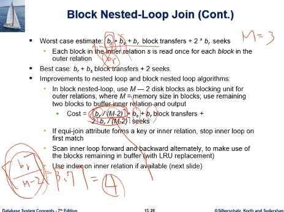

b_r개를 한번에 M-2개 페이지씩 읽어들이는 총 횟수. 만약 3.7이면 4가 된다. ceil 해야. 그리고 이 횟수만큼 상대 s테이블인 b_s개 블록을 전부 체크해야 한다

M=3대입시 이 자체가 b_r이된다. 한번에 한 블록씩 밖에 못 읽으므로 b_r이 되는것. 그리고 읽었을때 그 횟수에 해당하는 만큼 b_s개 블록을 스캔해야 한다.

그래서 아까 예제에서 M=22라면, 400 \* ceil(100/20) + 100 = 400\*5 + 100 = 2100이다. 아까는 40000이었다. 메모리를 많이 썼기에 실행시간을 줄일 수 있었다.

### 연습문제

문제 : 교재 practice exercise 15.3 a,b번. seek횟수는 제외하고 block io만 구하도록 한다.

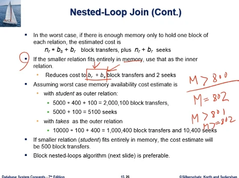

- 교재 홈페이지 답안을 보면 메모리버퍼를 많이 쓸수 있을때의 최소 io수가 b_r+b_s였다. 그리고 이 값이 가능하기 위한 메모리 버퍼 페이지수를 M<800 이라고 하고 있다. 그런데 수업했던바로는 802는 되어야 가능해진다. 정확히는 M > 801이나 M>=802 이런식으로 고쳐야 한다.

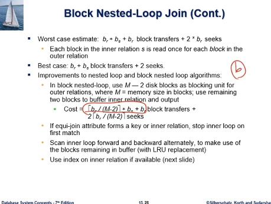

- b번 문항의 답안에서도, 이 식을 분모에서 M-2로 하지 않고 M-1로 답안에 쓰여있다. 공부했던대로 M-2가 맞다

## 9주차2nd ch15

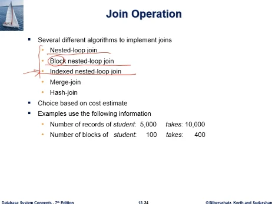

인덱스가 있을때의 중첩루프조인을 본다

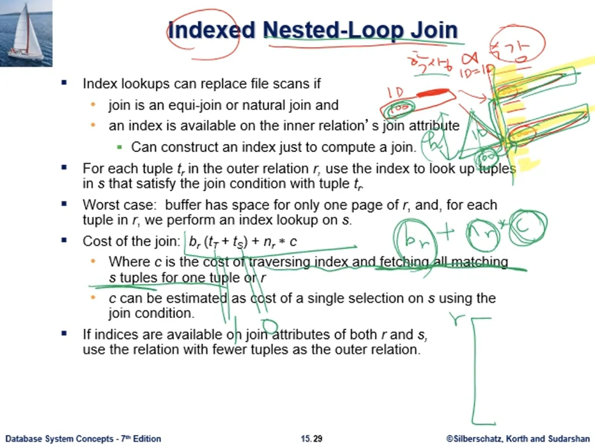

중첩 루프조인을 할때 인덱스를 활용할수 있는 경우이다. 예를 들어 학생 테이블과 수강 테이블을 조인을 할때, 이론적으로 학생의 한 레코드가 수강테이블의 여러 레코드와 매치가 되는 조인 짝을 찾는것이 조인의 처리 문제다.  
id=100인 학생 레코드가 있을때, 수강 테이블에서 id=100인 레코드를 찾는것이다. 만약 수강테이블에 인덱스가 없다면 이론적으로 모든 레코드를 봐야 한다.

그런데 수강테이블의 id칼럼에 대해 인덱스가 있다고 하면 이야기가 달라진다. 100이라는 값을 탐색키로 찾아서 리프노드에서, 100이라는 값이 어디에 있다고 알려줄 것이다. 매치되는 값을 인덱스로 찾아낸다는것.

비용식은 위와 같은데, b_r + n_r \* c 가 된다. 중첩 루프인데 r 테이블이 outer loop이다. r테이블의 각 블록에 대해, 그 속에 들어있는 한 레코드에 대해 (r테이블에 n_r개 레코드가 있다.).

c는 인덱스를 탐색하고 매치되는 s테이블의 레코드를 검색해내는데 필요한 io수이다. 이부분은 b+tree높이가 h라면, h번의 io를 해야 리프노드에 도달하고, 여기서 해당되는 레코드를 검색하는데 모두 몇번의 io가 필요한지가 h에 더해져야 한다. 그 값을 c라고 놓은것이다.

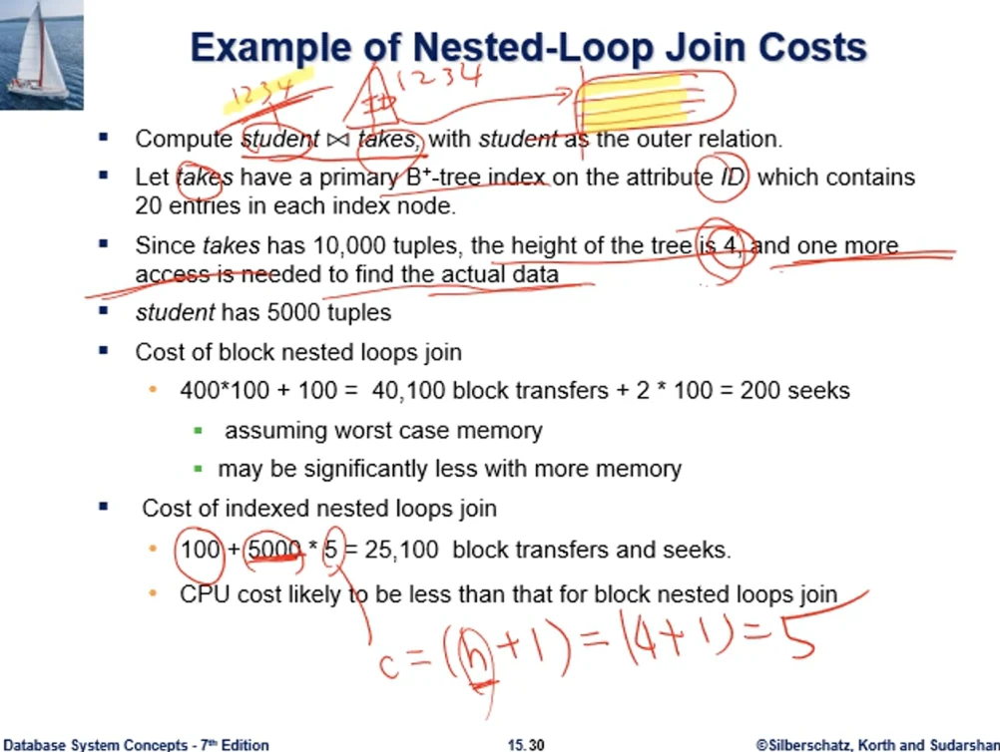

예를 들어보면 학생하고 수강의 join을 하는데, 수강의 id칼럼에 b+tree인덱스가 있다. 그래서 학생 테이블이 100블록을 차지하는데 이 블록은 어쨌든 다 읽어야 하고, 그리고 학생 테이블의 레코드가 5000개인데, 이것 각각에 대해 학번값 가지고 인덱스를 탐색하게 된다.

인덱스 b+tree 높이가 4라고 가정한다. 아까 공식에서 c = (h+1)로 추정되어서 c=5  
예제에서 높이 4에 one more access to find the actual data 라고 했다. 그래서 5.  
만약 id=1234학생이 수강한 수업내역 레코드가 한 블럭 안에 다 모여있다. 이 이야기는 id에 대한 인덱스가 집중인덱스라는 것이다. 그래서 h+1로 추정되었다.  
전체비용은 25100이다.

14장에서 인덱스 공부할때 clustered/nonclustered 라고 배웠었는데 다른 용어로 primary/secondary index가 있었다. 같은말임.

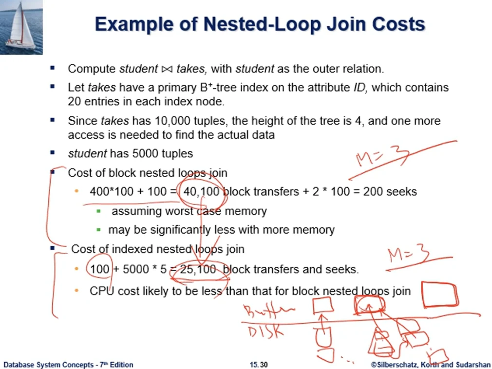

중첩 루프 조인에 40100정도 io를 했었고, M=3일때 했던 일이다.  
인덱스 덕분에 25100 io로 줄었다. M=3인것은 마찬가지다.  
디스크와 버퍼가 있을떼, 학생테이블 수강테이블 버퍼링에 minimum 1 page 할당. 수강 테이블은 인덱스의 루트에서 리프까지 페이지로 읽어오고, 리프가 가리키는 블록까지 버퍼 페이지를 활용해서 읽어오면 된다. 하나는 output으로 배정해서, M=3인것은 마찬가지다.

### 연습문제

문제 : 지금 공부했던 조인의 예제에서 수강 테이블에 있는 인덱스가 비집중인덱스인 경우라면 join의 IO수는 얼마가 되는가?

- 답 : b_r + n_r \* c 이 비용식에서 c를 알면 구할 수 있다.

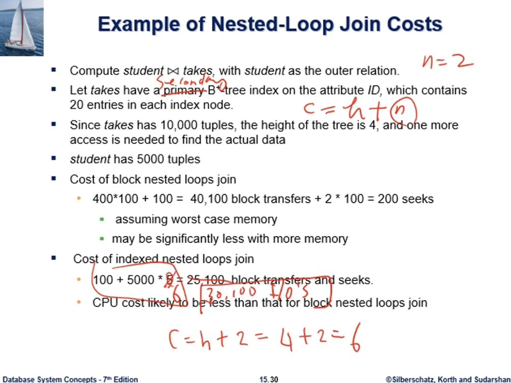

학생은 5000레코드, 수강은 10000레코드다. 평균적으로 한 학생당 두건의 수강 레코드가 있다. 수강의 인덱스가 집중인덱스 일때는, 두 레코드가 같은 블록에 있다고 보았다. one more access. c = h + 1 = 4 + 1 = 5

그런데 이것이 비집중인덱스 secondary라고 하면, 그 두 레코드가 최악의 경우 각각 다른 블록에 있다고 본다. c = h + n 이고, 여기서 n=2 이다. c = 4 + 2 = 6 으로 비용식 계산시

100 + 5000 \* 6 = 30100 IO's. io수가 늘어난걸 볼수 있다.

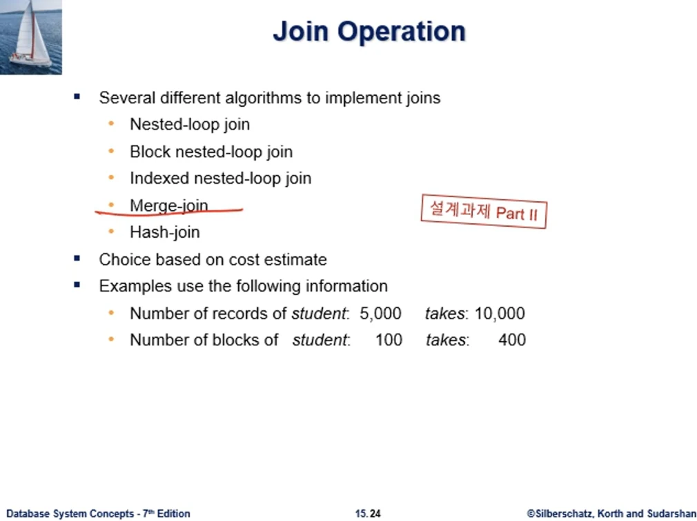

merge join, sort-merge join이라고 부르는걸 보자. 이건 설계과제 2에서 구현하는것이기도 함.

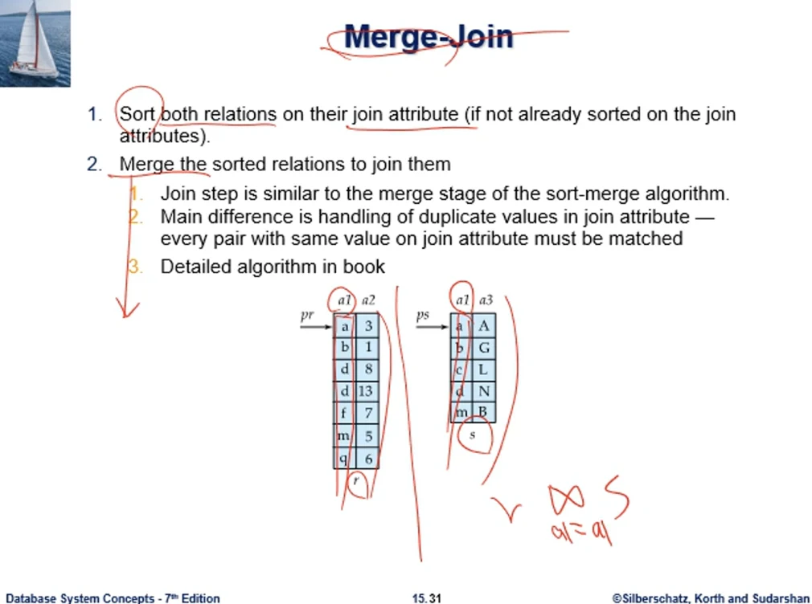

이 방법은 기본적으로 r,s테이블 조인하는데 있어서, a1=a1 attribute 기준으로 조인할떄, 이 조인 attribute 값 기준으로 먼저 테이블이 정렬되어야 사용할수 있는 방법이다.

r,s테이블이 a1 컬럼 기준으로 정렬 안되어 있을수도 있고, 되어 있을수도 있는데, merge join 한다고 하면 먼저 정렬을 한다.(외부정렬)  
그다음 merge 단계를 거쳐서 레코드 짝을 찾는다.

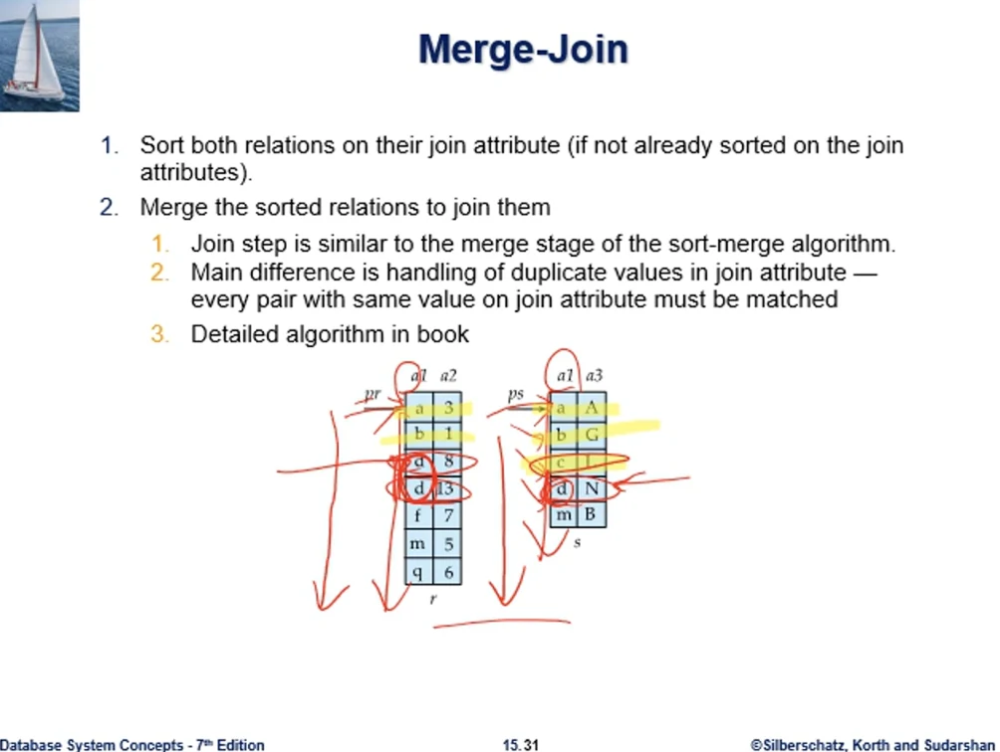

merge 단계는 간단하다. 둘다 a1컬럼으로 오름순 정렬되어있고, pr, ps포인터가 1 pass scan 한다. 서로 매치되는 짝을 양쪽에서 맺어주면 된다. a는 a랑, b는 b랑, d는 c랑 포인터가 가리키는 상황에서는 c랑 맞는건 없다고 보고 넘어간다.

가끔 같은 값 레코드가 여러개 있을 수 있다. 그런것만 잘 따져서 join 짝을 맺어주면 된다.

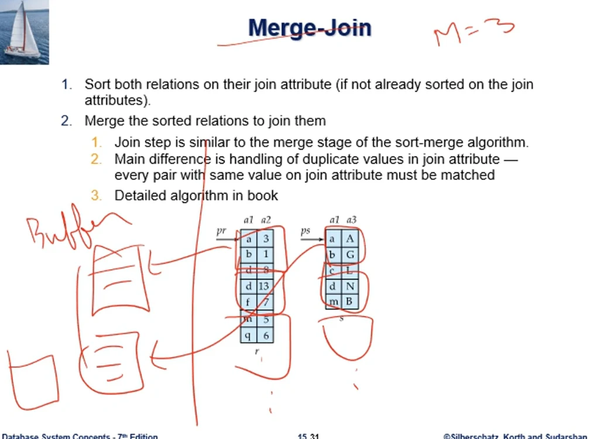

다만 데이터 자체가 디스크에 있다는 것이다. 배열처럼 떠있는 상황이 아니라 블록 단위로 디스크에 저장되어 있고, 버퍼에 블록들 읽어와서 레코드들 간 매치를 시키고, join결과는 output page에 채운다. 이것도 M=3이면 가능하다

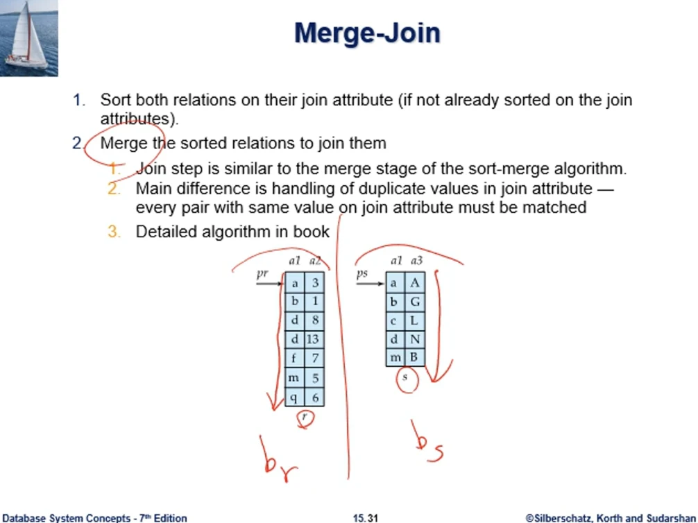

이 조인 알고리즘의 비용, IO횟수는, 일단 정렬이 다 된 다음에 merge 수행 비용은 쉽게 추정 가능하다.

대체적으로 b_r개 블록을 차례대로, b_s블록을 차례대로 읽으면 된다. b_r + b_s

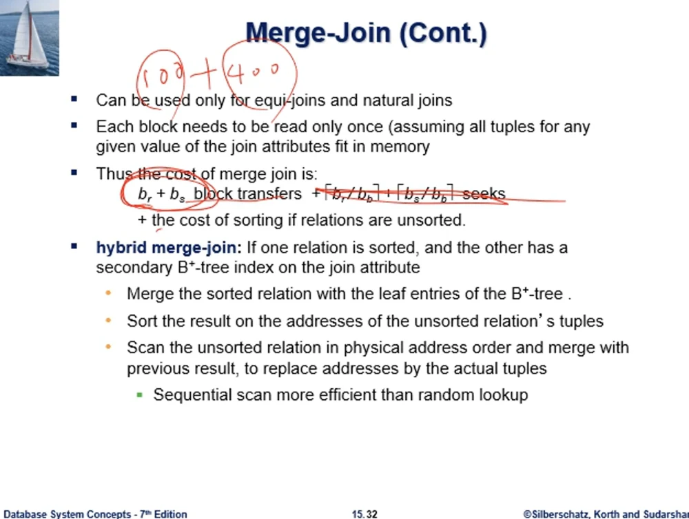

예제에서 학생테이블 100블록, 수강테이블 400블록. 합쳐서 500블록인데 500번 IO하면 merge는 된다. 다만 두 테이블이 id 칼럼으로 정렬되어있는지 고려하고, 아니라면 외부정렬 비용이 추가로 더해진다.

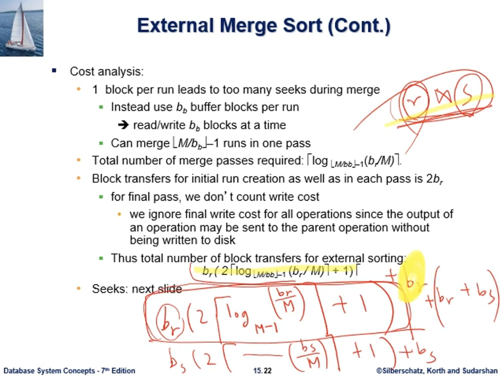

외부정렬 비용은 b_r (2 \* ceil( log \_(M-1) (b_r / M)) + 1) 인데. r, s테이블에 대해 각각 계산하여 더해지고, merge 하는데 b_r + b_s가 더해진다.

그런데 주의할점은 외부정렬 비용 공식에서 외부정렬 자체를 연산으로 보고, 연산처리하는데 드는 IO수인데, 마지막 정렬된 결과를 디스크에 저장하는 비용은 뺀다고 했다.

merge join하는 경우에는 정렬한것이 최종 결과가 아니므로, 디스크에 써야한다. 그래서 외부정렬 공식에서 + b_r 써야한다. 두 테이블 다.

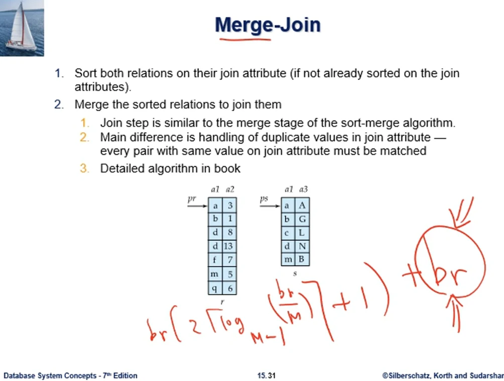

그래서 예제로 학생과 수강 테이블 조인을 merge join으로 한다. 100, 400블록인데, id칼럼으로 둘다 정렬되어있지 않다. 총 몇번의 IO? 교재 15장에 예제에 대한 내용이 잘 나와있다.

2가지 경우가 되어있는데, M = 3, 25(버퍼를 많이 쓴 경우)이다. 그런데 책을 보면 외부정렬하는데 IO가 몇번인지 정확히 계산하고 있다. 위 공식대로 해서 + b_r 정렬의 결과를 디스크에 저장하는 항까지 정확히 계산하고 있다.

M=3이면 2way merge였고, 25라면 24way merge 하는것이다. 그래서 양자간의 차이는 외부정렬하는데 있어서 비용차이가 큰 차이를 내는 요인으로, 메모리 사용량이 작용하게 된다.

최종결과를 보면 M=3일때 9100IO, M=25일떄 2500IO로 줄었다. 이 차이 자체는 외부정렬에서 버퍼를 얼마나 썼는지하는 메모리 차이로 인해 발생한 차이이다.

### 연습문제

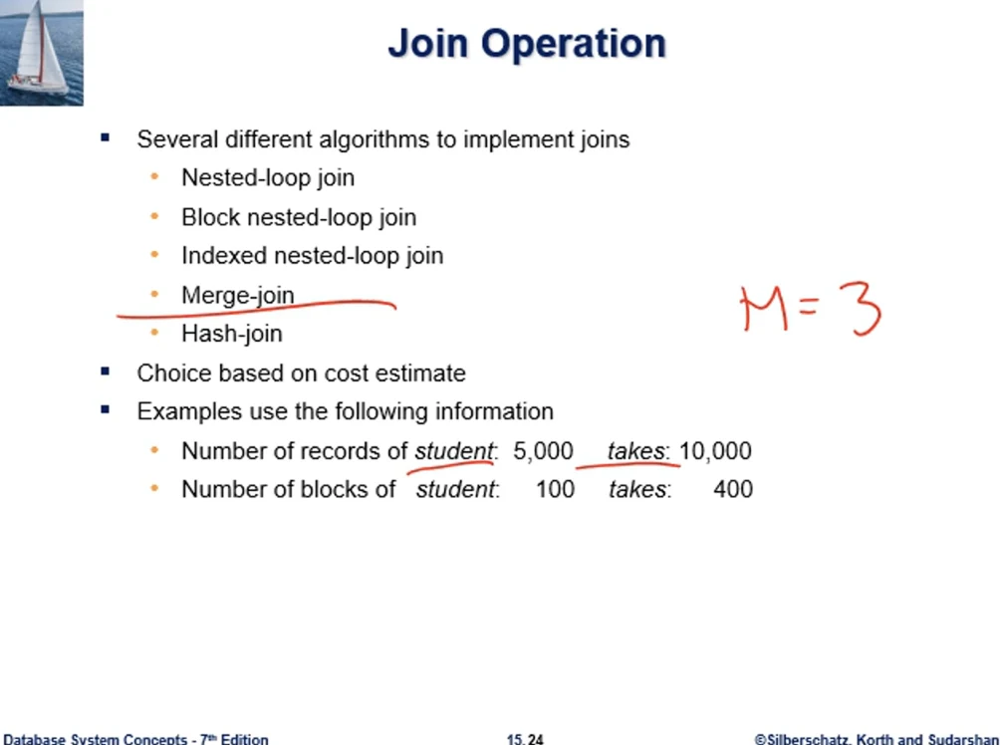

문제 : 지금 설명한 학생, 수강을 join하는데 merge join 알고리즘을 쓰는 경우 M=3, M=25각각의 비용을 구해보도록 한다

- 답 : 교재 15.5.4.2절에 과정이 나와있다. 구한값과 맞는지 체크해보자

문제 : 교재 practice ex 15.3 c번 문항을 풀어보도록 한다

- 답 : 풀어봐라

## 9주차3rd ch15

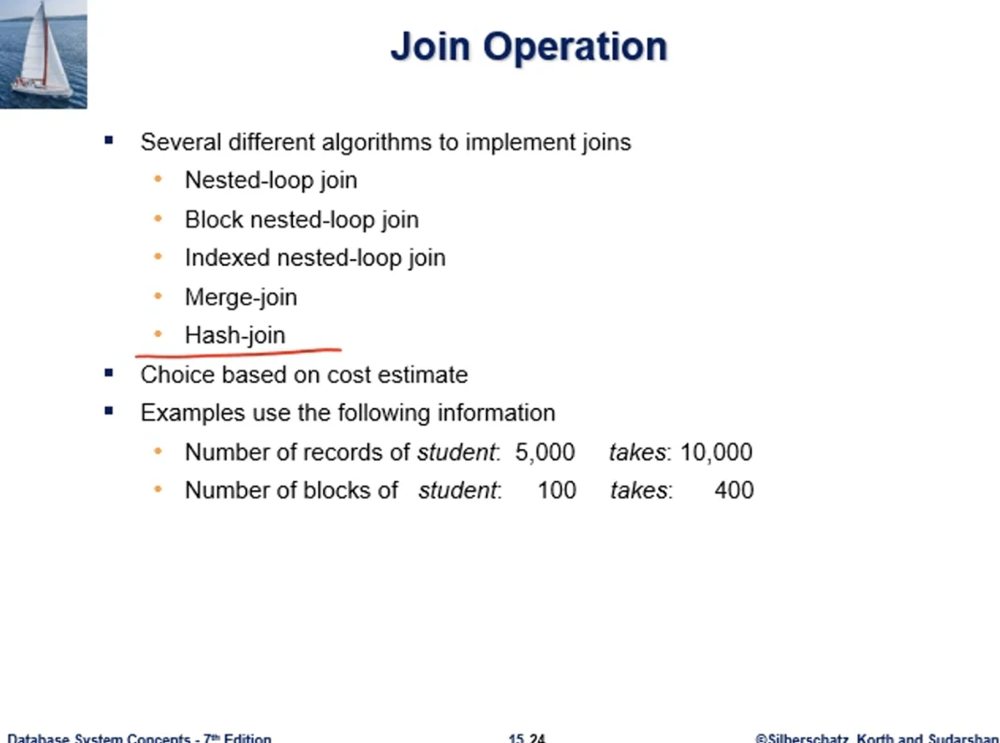

해시 조인을 배운다

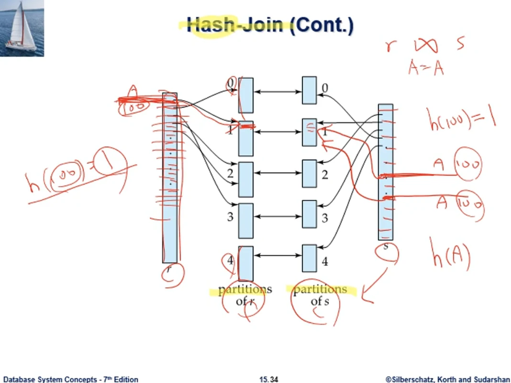

작동과정을 설명한다. r,s 테이블간 조인이 주어지고, 조인컬럼은 A=A 와 같다고 할때, r에서 A=100 인것과 s에서 A=100인것이 조인 짝이 맺어져야 한다.  
파티션이라는 말이 보이는데, 해쉬 함수에 100이라는 조인 칼럼값을 넣어서 계산해 주면, h(100) = 1 이렇게 계산해준다. 예제에서는 0번부터 5개 파티션이 있는데, 다른 레코드들도 전부 A 칼럼값으로 해싱을 해서 0-4 사이 파티션들로 레코드들을 분산시키는 것이다. s테이블도 똑같은 해쉬함수로, A칼럼값을 넣어서 레코드를 분산시킨다.

이와같이 r,s를 먼저 파티셔닝을 한 다음에 조인짝을 맺는 일을 하게 된다. 0번 파티션에 있는 레코드는 반대쪽 0번 파티션에만 짝이 있다. 같은 해시함수를 쓰기 때문이다.

그래서 해시 조인 알고리즘은 두 단계로 이루어진다.

1. 파티셔닝을 한다
2. 조인짝을 찾는다

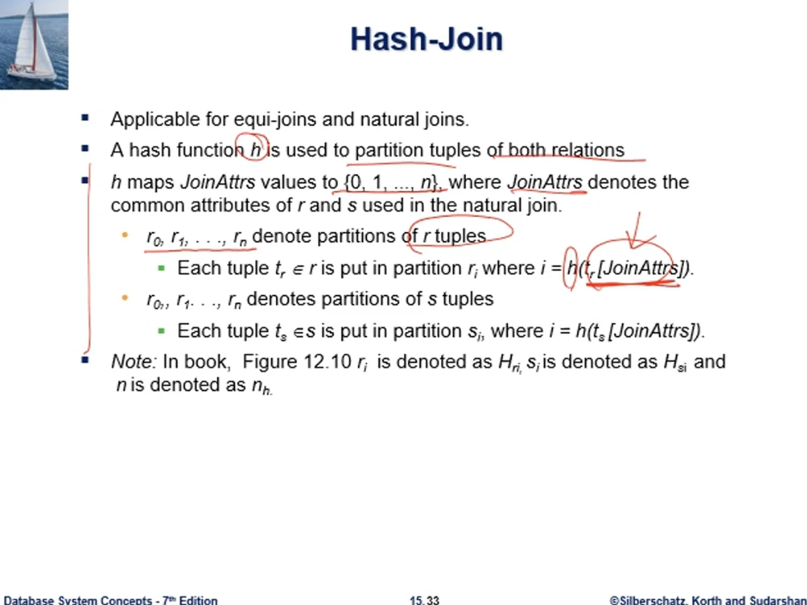

해쉬함수를 사용해서 두 릴레이션을 파티셔닝을 한다. 파티션의 개수를 n+1개로 표시했는데, r테이블의 레코드들을 n+1개 파티션으로 분류한다. 그때 해쉬함수에 들어가는 argument는 조인 칼럼의 값이다. s테이블도 마찬가지로 분류한다.

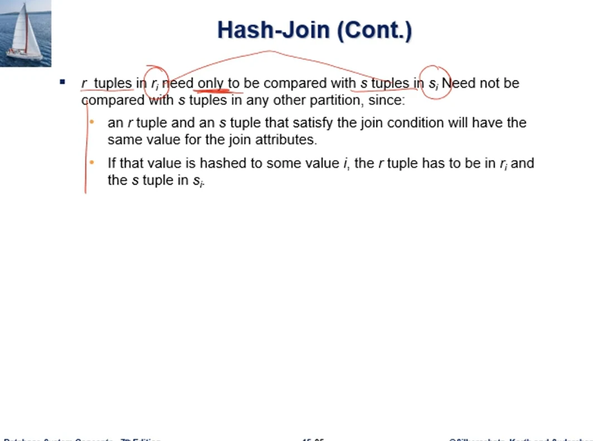

그리고 r_i파티션에 있는 r테이블의 튜플은, s_i 하고만 비교해서 조인 짝을 찾는다. 그 이유는 앞에서 설명한 이유때문이다

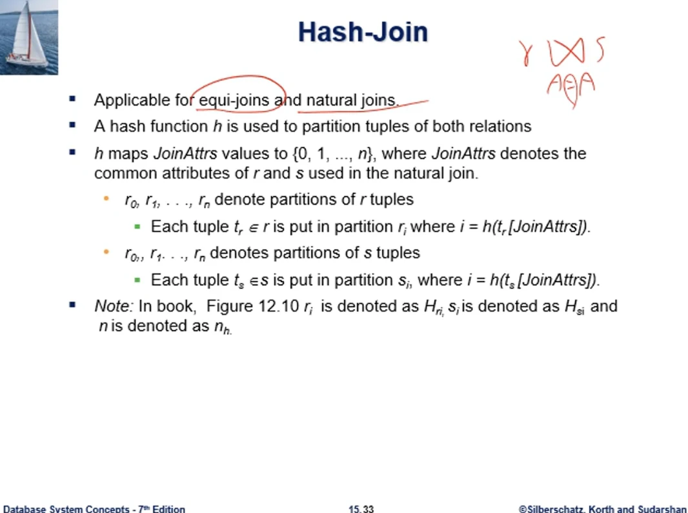

그러한 작동과정을 거치므로, join의 조건은 equal에 해당하는 조인만 해당이 된다. A = A처럼  
알고리즘을 보면 1,2번은 s,r테이블을 파티션한다.  
3번은 파티션별로 레코드끼리 대비해서 조인짝을 찾는다.

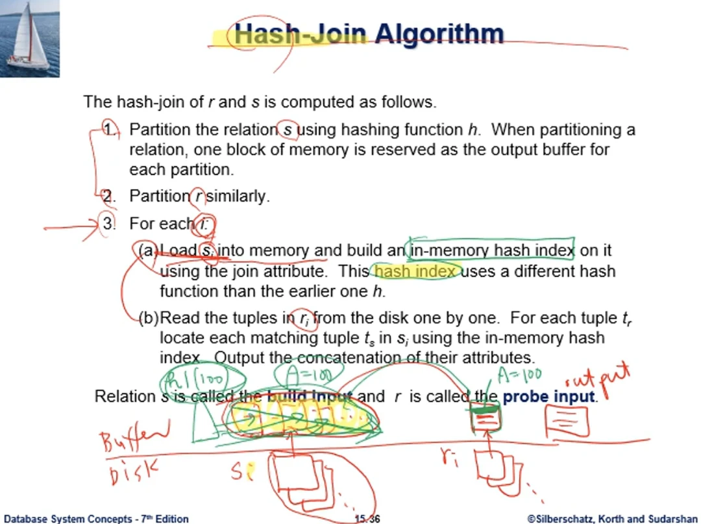

상황을 보면 disk가 있고, 버퍼가 있는데, i번 파티션의 레코드 수가 몇개쯤 될것인지 하는것은 전체 테이블 크기와 파티션을 몇개로 나누는가로 결정될 것인데, 한 블록에 i번 파티션이 다 저장된다고 일반적으로 말할수는 없다. 여러개의 블록에 걸쳐서 i번쨰 파티션이 저장된다.

여기서 해시조인의 특성으로, nested loop join이랑 merge join과 다르게 메모리를 많이 쓴다. 메모리 기술이 발달해서 메모리를 시스템이 많이 쓸수 있게, dbms도 메모리 버퍼를 많이 쓸 수 있게 되었을때 등장한 조인 알고리즘이다. 그래서 이 경우는 메모리 버퍼를 많이 쓴다.

a.에서 load s_i into memory, s 테이블에 i 번 파티션 전체를 메모리에 적재한다. 이것이 여러 블록일수 있다고 했으므로, 여러 페이지를 쓴다는 것이다. (한 파티션이 너무 크지 않고, 버퍼 가용 공간을 고려했을때 적당한 크기인 경우이다.) 이것을 띄워놓고, r_i는 한 페이지만 할당해준다. 한 블록만 불러서, 이 안에 여러 레코드들이 있을텐데, 레코드와 매치될수 있는 조인짝은 s_i를 불러온 파티션 어딘가에 있을수 있다. 이것을 메모리 내에서 찾아서 output page에 버퍼링을 하는 과정이다.

hash index 라는 이야기가 나오는데, r의 파티션 하나를 올려서, r_i의 레코드 하나의 짝을 s를 올린 파티션에서 찾아야 하는데, 이것은 메모리에 있으니까 전체를 다 보면 된다. 그런데 이것을 빨리 하려고 해싱 기법을 도입해서, 해시 인덱스를 하나 만들어서. 해시 인덱스를 활용하여 A=100의 레코드는 어디 있는지 바로 가르켜줄수 있는 해쉬 인덱스를 사용한다. 매치과정을 빠르게 하자는것

이 해쉬 인덱스는 in-memory hash index라고 했다. 파티션이 메모리에 다 적재되었기 때문에, 디스크 기반이 아니고 메모리 내에서의 해쉬 기법이다.

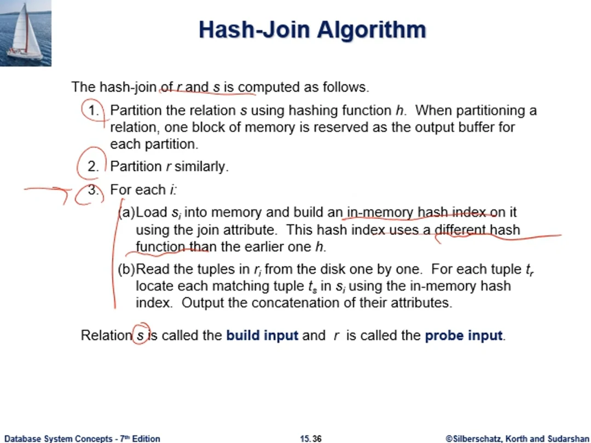

그리고 여기서 in-memory hash index는 1,2번 과정에서 파티셔닝할때 사용한 hash 함수와는 다르다고 되어있다.  
그래서 이와 같은 구조로 3번 단계에서 조인 짝을 찾다보니 s테이블을 build input, r테이블을 probe input이라고 한다.

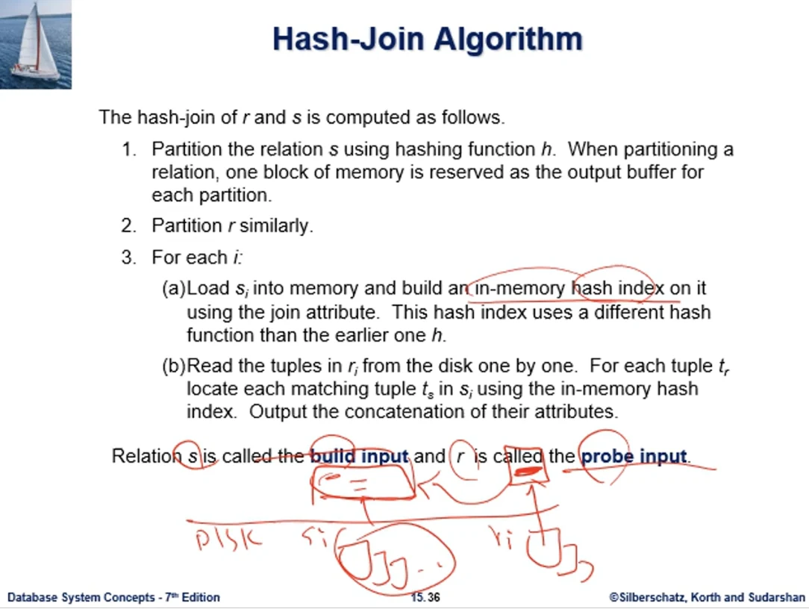

디스크에서 s_i 파티션 블록들 전체를 메모리에 적재해서 해쉬 인덱스를 만든다고 했다. build는 해쉬 인덱스를 build 한다는 것이다. r쪽은 한 블록씩만 들어와서 그 속의 레코드의 조인 짝을 물어본다. probe input.

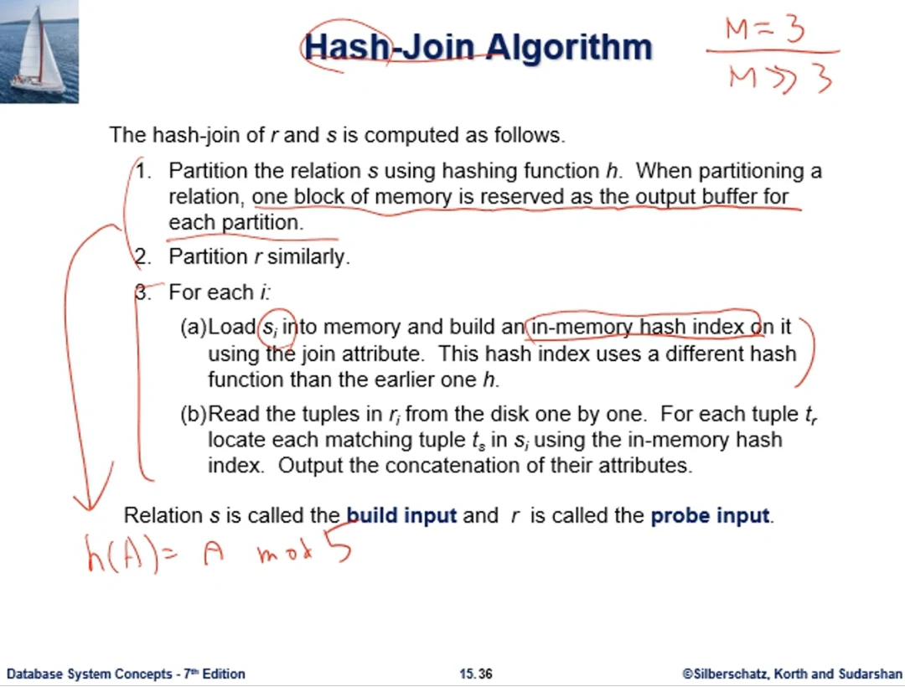

해쉬 조인은 메모리 버퍼를 많이 쓴다. nested loop join이랑 merge join은 M=3만 되어도 동작하지만, 해시조인은 M >> 3

그래서 s_i 파티션을 메모리에 다 적재해서 메모리 내에서 해시 인덱스를 만들때도 쓰지만, 파티션할때도 메모리를 많이 쓴다. one block of memory is reserved as the output buffer for each partition

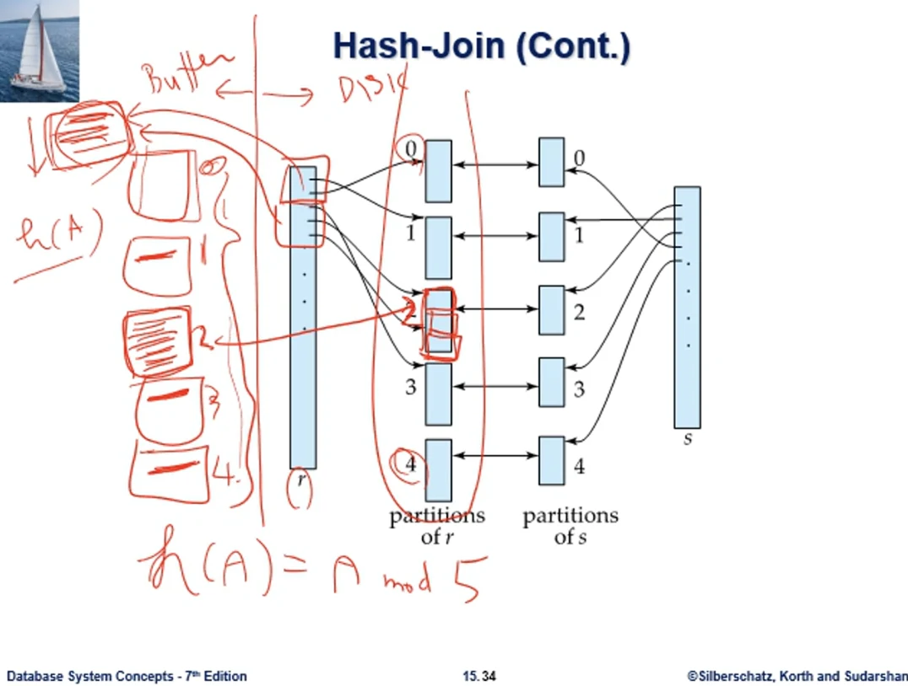

만약 h(A) = A mod 5 라고 하면. 파티셔닝 과정에서 버퍼가 어느정도 필요한가? 0-4번까지 별로 한 블록씩 페이지를 할당해줘야 하고, 그리고 하나 더 필요하다.

하나 더 해주는것은 r 테이블 한 블록을 읽어와서, 각 레코드를 해시함수에 넣어서 몇번 파티션에 해당하는지 보고, 그쪽 파티션에 레코드를 옮긴다. 이 레코드가 소진되면, 그 다음 블록이 올라와서 레코드들을 0-4사이에 배분한다. 그 과정에서 2번 파티셔닝이 버퍼로 가득찬다고 하면 이것을 디스크에 내다쓴다. 그림에서 파티션이 여러 블록일 수 있다.

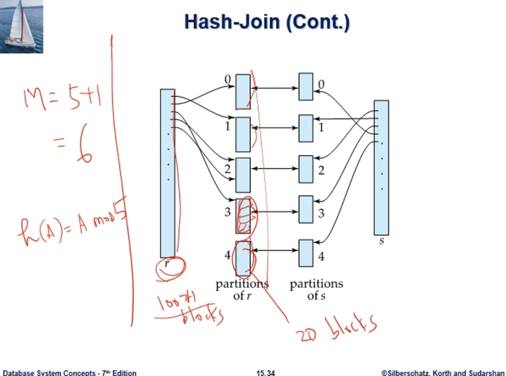

정리해보면 파티션별로 버퍼 M은 5개 파티션으로 5 + 1(불러오기 용도). 만약 r이 100개 블록이었다고 하자. 그럼 그 레코드들을 5개 파티션으로 배분하는 것이다.

만약 각 파티션별로 해시함수가 레코드를 균등하게 분리한다면 하나가 20블록이 된다. 박스 하나에 20블록이 있는 것이다.

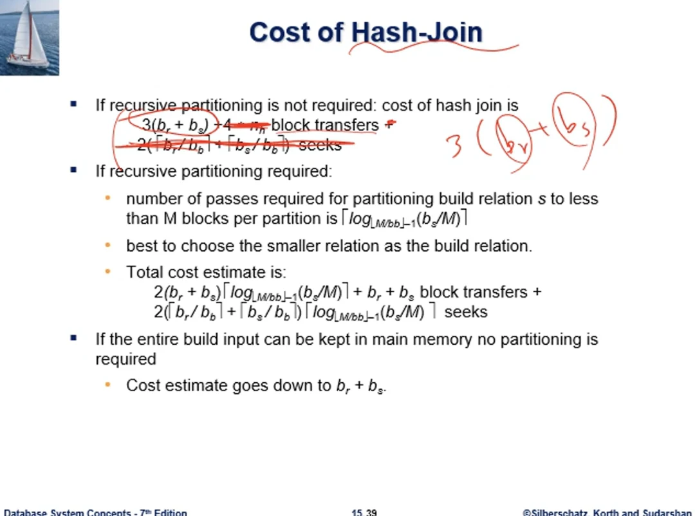

해시 조인은 IO를 몇번하는가? 비용식

- 3(b_r + b_s)

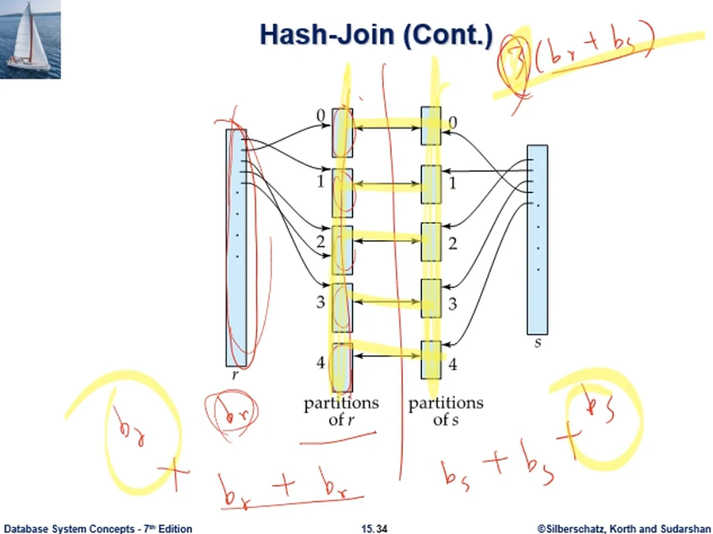

왜 3(b_r + b_s)인가? 왜 3인가? 왜 더하기인가?  
기본적으로 r 테이블이 파티션이 되려면 디스크에서 b_r개 블록을 어쨌든 다 읽어야 한다. 그다음 그들을 5개 파티션에 나누어 쓰기 떄문에, 또 대략 b_r에 해당하는 만큼을 디스크에 써야 한다. (읽어와서 파티션 분리하고 쓴다.)

그다음 조인 짝을 찾는 과정에서 파티션들을 다 읽어야 한다.

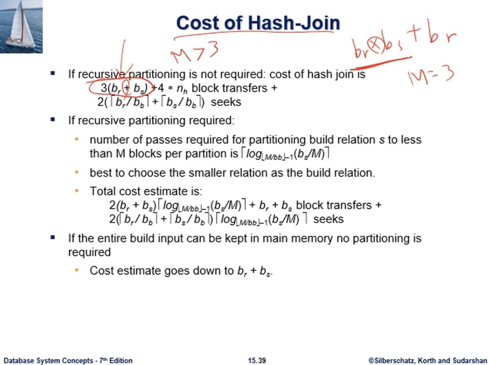

그래서 해시 조인의 좋은 점이. 중첩 루프 조인을 보면 b_r \* b_s + b_r 이렇게 곱하고 있다.  
그런데 여기서는 더하고 있다. 이것은 큰 차이다. 메모리를 많이 쓰기에 비용이 낮아진다. 해시 조인은 M>>3이고 다른것은 M=3이어도 동작하기에 이런 차이가 온 것이다.

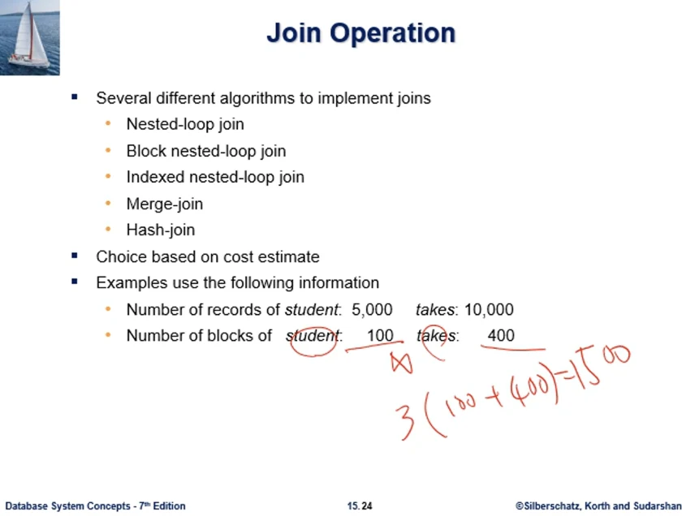

예를 들어서 학생 테이블과 수강테이블 해쉬 조인을 할떄, 3(100 + 400) = 1500 IO이다. 그런데 과연 1500IO일때 버퍼를 얼마나 써야 가능한건지 생각해봐야 한다.

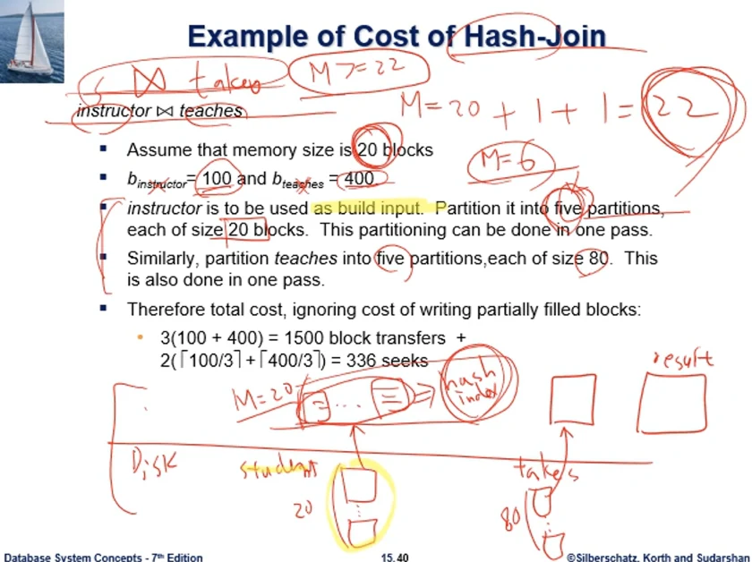

여기 예제에서, 교재는 여전히 학생과 수강 테이블을 조인하는 예제로 되어있다. M=20 페이지 인 상황이다. 그런데 사실 파티션을 할때 테이블을 몇 파티션으로 나누는가에 대해서도 이 페이지수는 영향을 미치게 된다. 지금 학생 테이블이 100블록, 수강이 400블록이다. 100블록을 5 파티션으로 나누면 1 파티션에 20블록, 수강은 400을 5개로 나누면 80블록이 된다. 이것이 메모리 버퍼에 양이 얼마나 필요한가 이야기인데

디스크에서 학생테이블 파티션이 5개인데, 1파티션이 20블록, 수강테이블은 1 파티션이 80개 블록이라고 했다. 이 상황에서 build input, probe input 어떻게 정하는가? 당연히 작은쪽을 build input 으로써야 메모리 사용량이 적어진다. 학생쪽의 20개짜리를 build input 으로 써서 20개를 동시에 메모리에 올려서 해쉬인덱스를 만들게 된다. 20개를 올리고, 내부적으로 해싱 기법을 써서 빨리 해당 레코드를 찾을수 있게 해쉬인덱스 자료구조로 변환한다. 이 대목에서 벌써 메모리가 M=20 페이지를 필요로 한다.

해쉬 인덱스를 만들면서 공간이 더 줄어들기보다는 늘 가능성이 높다. 20페이지는 있어야 한다. 그리고 수강 probe input에서 1페이지 들여올수 있어야 하고, 조인 결과 result output에서 1페이지는 써야 한다. 책에서도 20페이지라고 되어있지만 실제는 M = 20 + 1 + 1 = 22페이지는 있어야 한다. 조인 짝짓기하는 과정 자체가 22페이지는 있어야 한다.

그리고 앞에서 보면 파티셔닝 하는데는 몇 페이지 필요한가? 5 파티션으로 나누었기에 6 페이지만 있으면 파티셔닝은 된다. 6 < 22이므로 지금은 상관없다. 전체적으로 학생과 수강을 조인하는데 M >= 22여야 하고

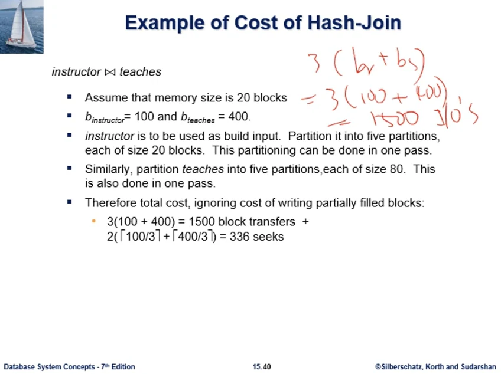

그때 비용은 3(b_r + b_s) = 3 (100 + 400) = 1500 IO's

### 연습문제

문제 : 교재 practice ex 15.3 (d) 문항

- 답 : 교재 홈페이지 답안을 보면 recursive partitioning에 대한 언급이 있는데, 이것은 수업 범위에서 빠진다. 답안 체크시 고려하지 않아도 된다.

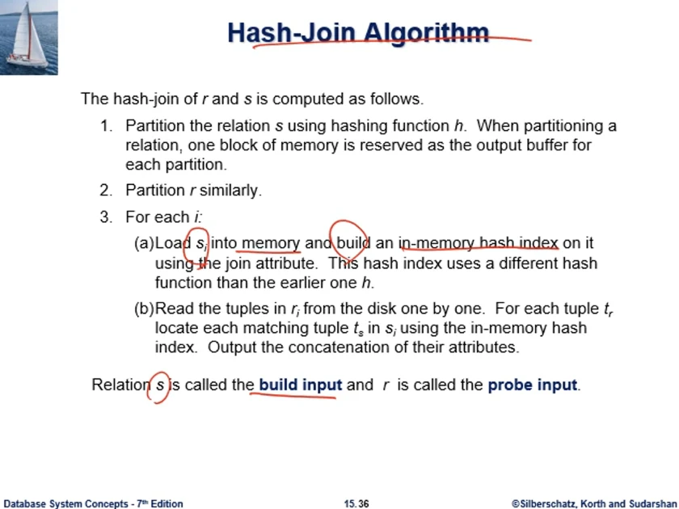

문제 : 앞서 해쉬조인 알고리즘에서 build input 의 어떤 파티션을, build input이 s 인데, s_i라는 한 파티션을 메모리 버퍼로 적재한다음, in-memory hash index를 build한다 라고 했다. 질문은 이 hash index가 뭔지 예를 하나 제시해보라. 이 hash index를 지금 이 알고리즘에서 처음 들어보는가? 아니면 앞서 수업에서 공부한적이 있는가?

- 답 : ..

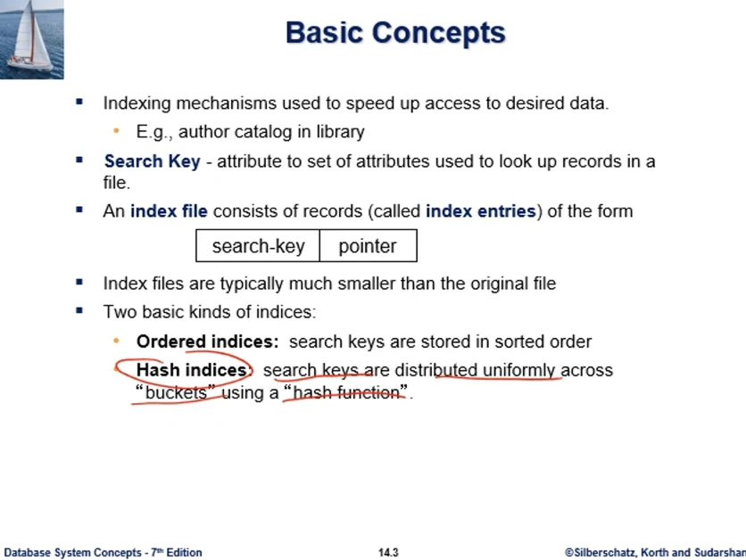

우리가 14장 인덱스 단원을 처음 시작할때 해시인덱스가 소개된적이 있다. 인덱스가 두종류가 있다. ordered인지 아닌지. 인덱스의 탐색키가 인덱스 내에서 정렬되어있으면 ordered이고, (b+tree라던지 이런것이 ordered) 만약 탐색키가 해쉬함수에 의해서 bucket에 의해 분포 분산 배분되어 있는 상황이라면, 탐색키들이 정렬될수 없기에 ordered가 아니고 hash인덱스라고 했다.

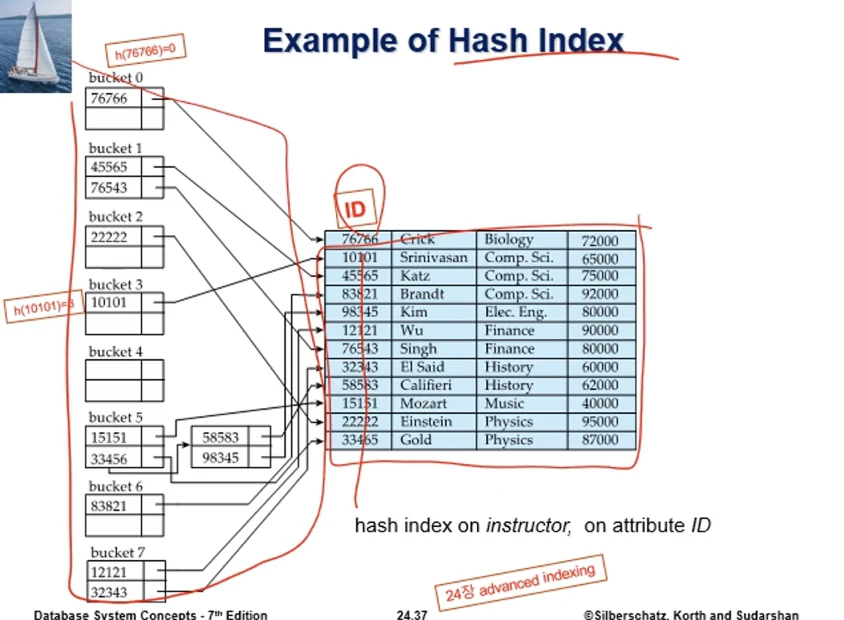

우리가 이런 해시인덱스의 예시를 본적이 있다. 24장에 advanced indexing에 나오는 슬라이드이다. 여기 데이터 파일은 교수 테이블의 레코드들이 보이고, 해쉬 키는 id칼럼이다. 그림상에서 왼쪽 부분이 해시인덱스에 해당된다.

예를 보면 10101 레코드를 해시 인덱스를 통해서 어떻게 찾느냐, 하는데 탐색키 10101을 해시함수에 넣으면 3번 버킷을 가리킨다. 해시 인덱스내 3번 버킷에 가서 인덱스 엔트리를 찾으면, 레코드 포인터가 있어서 10101에 접근할수 있게 된다. 그래서 왼쪽 부분이 해싱함수에 기반해서 만들어진 해시 인덱스라는 것이다.

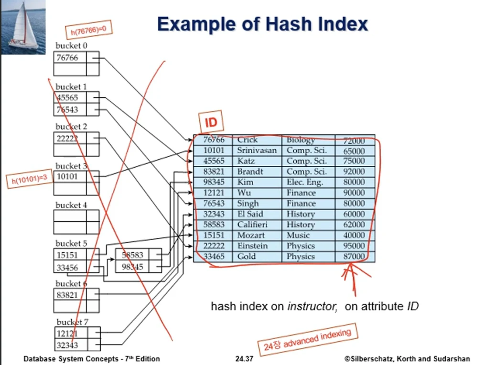

지금 우리는 해시 조인의 문맥에 와 있다. 해시 조인 상황에서 예를 가지고 설명해보면, 지금 보이는 교수 레코드들이 조인될 빌드인풋 테이블의 어떤 한 파티션에 속한것이다 라고 놓고 설명해볼수 있을것이다. 빌드인풋의 파티션이 이와같이 메모리 전체가 적재가 되고 나면, 적재되는 시점에는 아직 해시인덱스는 없는 상태이다.

파티션 내용을, 블록들을 메모리로 적재한다음, 이 내용을 보고 우측의 것을 빌드하는것이다.

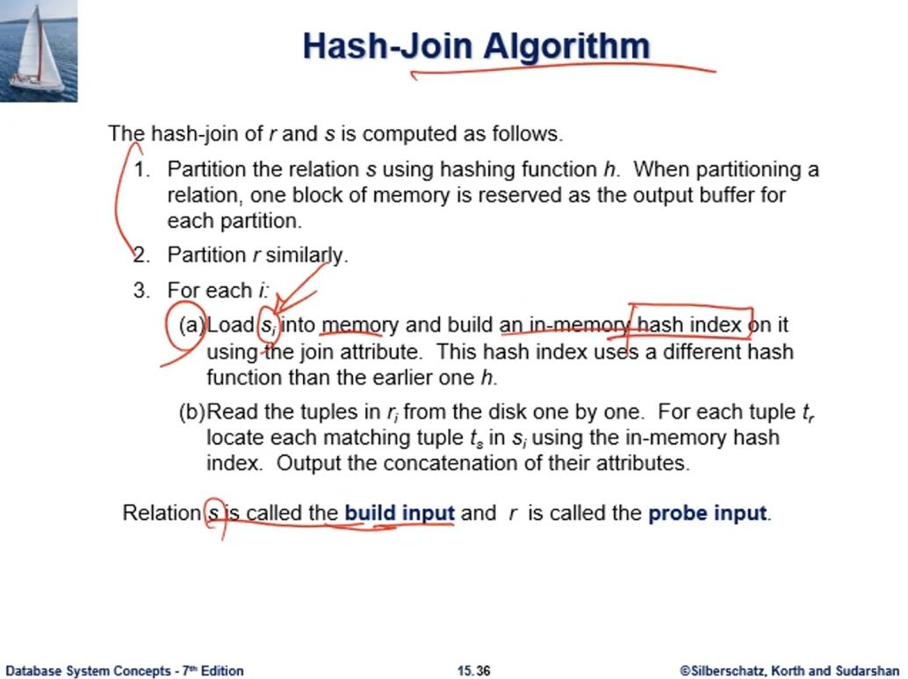

이 알고리즘에서 3번의 a에 해당하는 부분이다. s_i라고 하는것이 빌드인풋, s가 교수테이블인것, 이것이 여러 파티션으로 나뉘고 그중 한 파티션이 메모리로 적재가 되면, 그에 대해서 메모리상에서 해시인덱스를 만든다 하는 것이다.

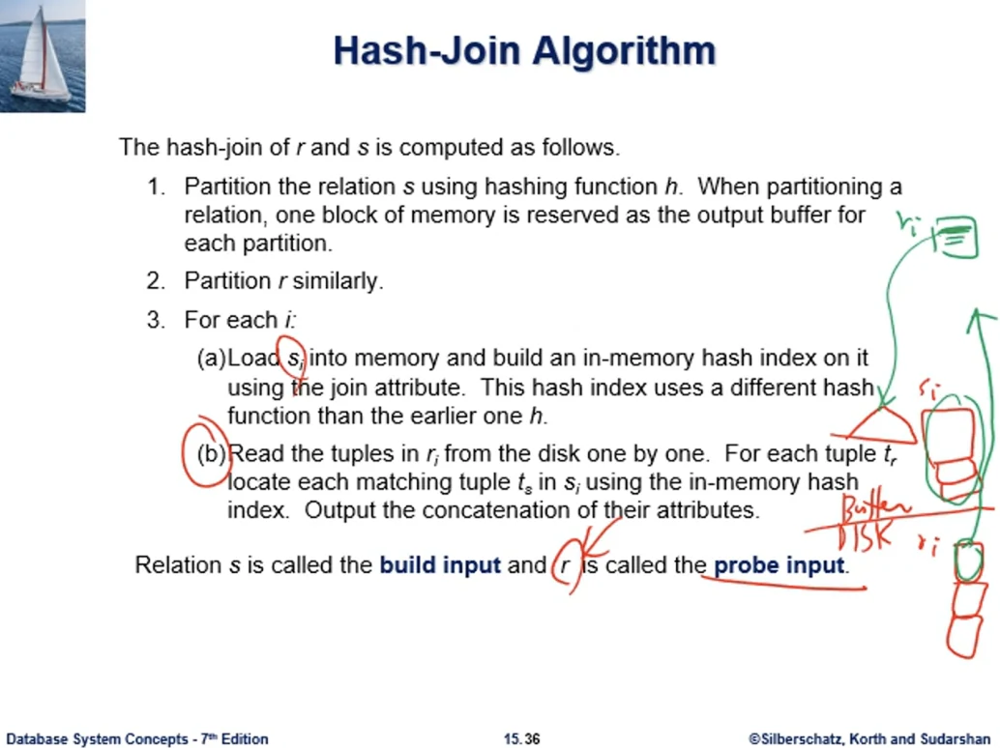

그 다음 과정이 b번 과정인데, b번 과정은 probe input에 해당하는 테이블 r의, 방금 교수테이블의 적재된 파티션과 대치되는 r의 파티션이 있을것이다. 여러 블록들로 구성된 r_i중 한 블록만 버퍼로 올려서, 그 안의 레코드별로 매치되는 조인짝을 찾아야 하는데, 이 매치를 해시인덱스를 통해서 찾는것이다.

그림에서 다시보면 버퍼/디스크가 있다. 빌드인풋의 한 파티션 s_i가 올라온 전체이다. 이것은 물리적으로 여러 블록으로 구성되어 있다. 그리고 디스크에 probe input r_i가 있다. 이것도 여러 블록으로 있을것이다. 이 상태에서 한 블록만 버퍼로 올린다. 이 안에 레코드들이 있고, 각 레코드의 짝을 찾는것이다.

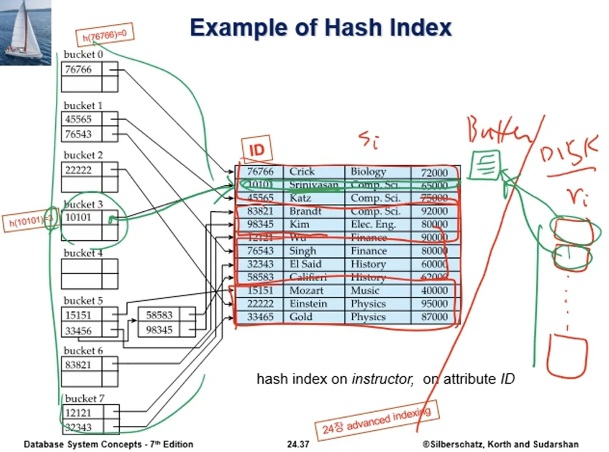

만약 레코드가 조인칼럼의 값이 10101이다 하면, 10101을 해시인덱스에서 해시함수에 넣으면 3번 버킷으로 가고, 3번버킷에 가면 레코드 포인터가 가르켜줘서 조인짝을 찾는다. 이렇게 다 찾아서 소진이 되면, 그 다음 r_i블록을 버퍼로 들여서 또 레코드들의 조인 짝을 찾게 된다.

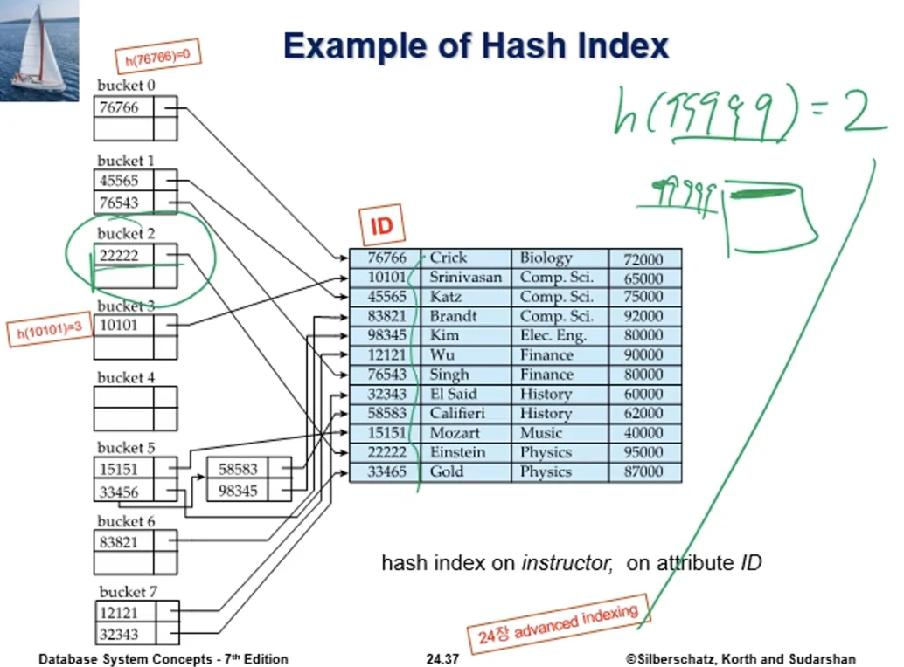

만약 probe input에서 한 블록을 메모리로 가져왔는데, 레코드의 조인 칼럼값이 99999다 라고 하면, 그런 조인짝은 없다. 이것을 해시함수에 넣었더니 2번 버킷을 가리킨다고 하자. 2번 버킷에는 99999 엔트리가 없다. 없으니까 이 레코드는 조인짝이 없다는것을 알게 된다.

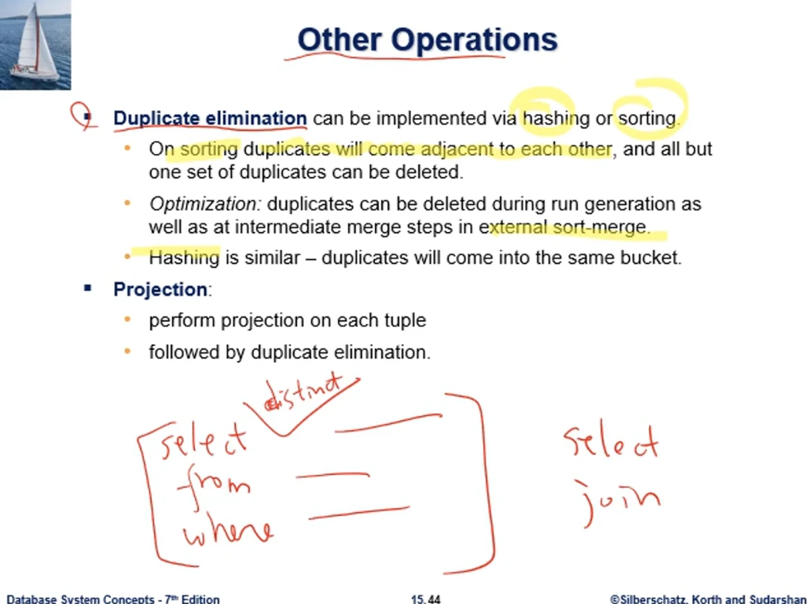

지금까지 DB의 대표적인 연산인 select,join연산의 알고리즘과 비용에 대해 공부했다. 다른 연산에 대해서도 본다.

중복값 제거 : db연산을 하다보면 종종 나타난다. distinct를 써서 중복제거하고 결과셋을 돌려달라는 요청을 한다. 이것 말고도 중복제거의 필요성이 있을수가 있다.

중복제거의 기본적인 방법은 해싱 아니면 정렬이다. 정렬을 한다는것은 데이터베이스 환경이므로 외부정렬을 수행하는것을 말한다. 정렬하게되면 정렬순서상 같은값은 옆에 보이게 된다. 그래서 중복제거를 할수가 있고

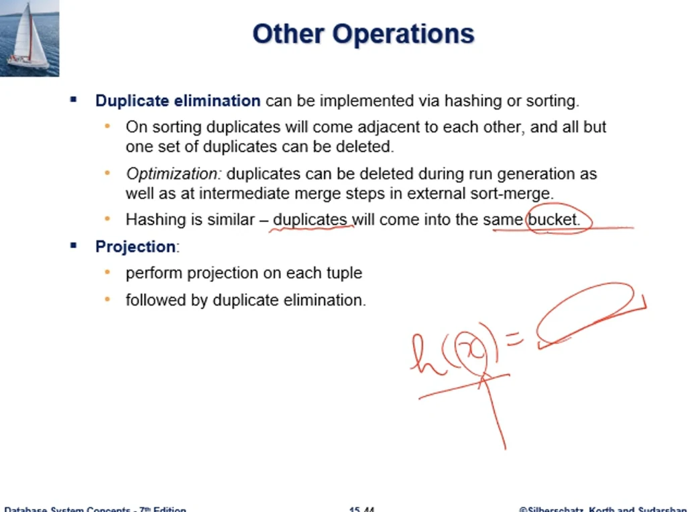

해싱도 마찬가지다. 해시함수가 어떤 값을 받으면, 계산해서 해당 버킷을 가리키게 된다. 당연히 같은 값이 들어가면 버킷 값이 똑같은 값이 나온다. 그래서 중복제거 대상 값을 해싱에 적용하면, 같은 값이 같은 버킷에 몰리므로 중복제거를 할때 해싱을 이용할수 있다.

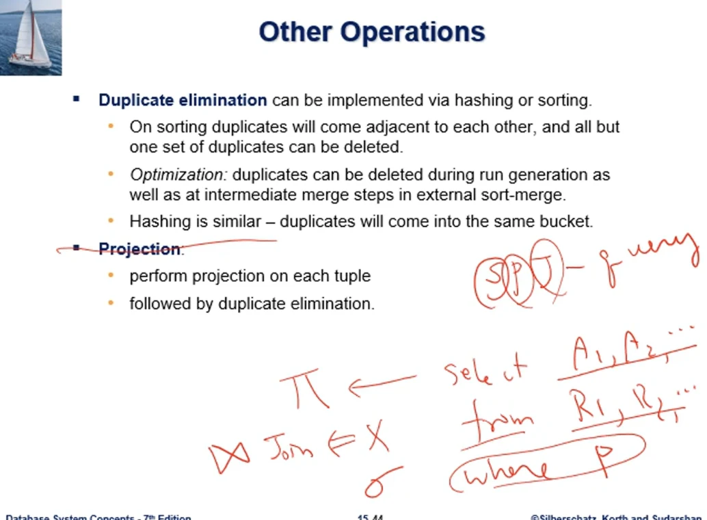

그다음은 project연산인데, rdb의 가장 기본적인 연산이 SPJ-query 라고 해서 select, project, join. 이것을 sql로 쓰자면,

- select A1,A2 - select절에서 컬럼을 뽑아내는것이 관계대수에서는 파이로 쓰는 프로젝트연산에 해당된다.
- from R1,R2 - from 절에 테이블 여러개 열거하게 되는것이, 카테시안 곱으로 해서 where절에 조건과 더불어서 조인연산에 해당
- where P - where절에 조건주는것이 관계 대수 식으로 Select연산 시그마

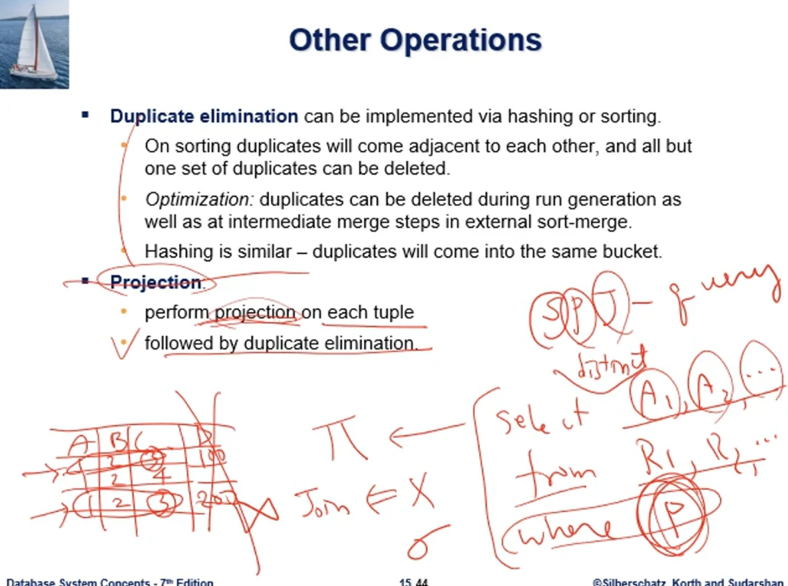

순수한 관계대수에서는 일부칼럼을 버리고 일부칼럼만 선택했을때 result set에 중복되는 칼럼이 올수가 있다. A B C D 칼럼이 있는데, D 칼럼이 없어지면서 같은 게 생기는 것이다.

만약 distinct가 있다면, 중복을 제거해야 한다. 그래서 이러한 project연산 수행은 기본적으로 where절에서 검색된 레코드들을 대상으로 project를 수행한다. 이말은 컬럼복기? 를 한다는것이다. where절을 통과한 각 레코드들에 대해서 컬럼을 추출해내고 그다음에 중복제거를 하게되는데 위에서 말했던 방법에 의해서 중복제거를 수행하면 된다.

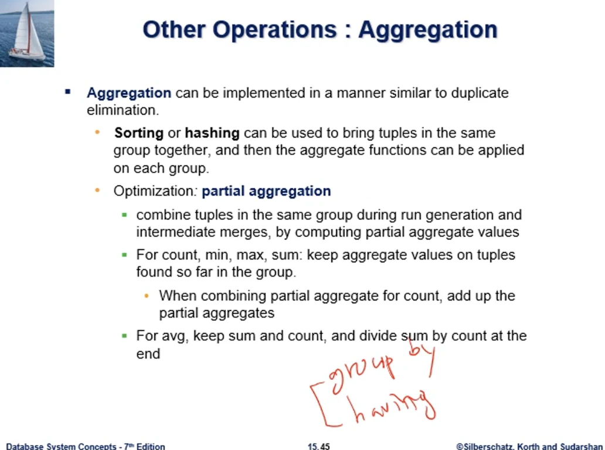

sql에서 중요하게 사용되는 연산중 하나가 집계함수에 대한 내용이다. sql표준에는 5개 집계함수가 있다. count, min, max, sum, avg 이렇게 5개. 특히나 이 함수들은 많은 경우 group by절하고 그룹을 필터링하는 having절하고 같이 사용되는 경우가 많다.

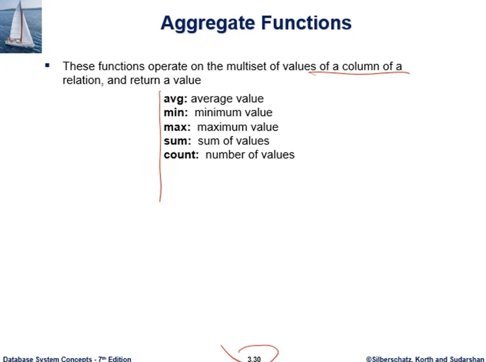

sql의 집계함수 구문을 잠깐 복습하면, 교재 3장에 있다. 표준에 보면 5개 함수가 있고, 이들은 테이블의 컬럼에 대해 적용되어 함수값을 계산하게 된다.

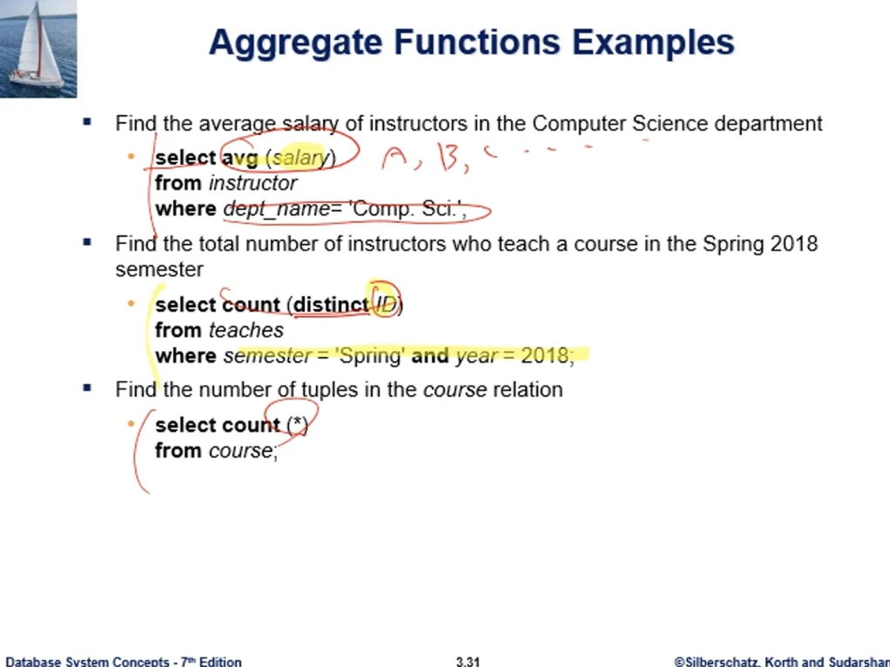

그래서 이와같은 방식이다. 원래 select에는 검색하고 싶은 칼럼을 열거해야 하는데 이와같이 집계함수가 올수가 있고, 이렇게 되면, where절이 레코드를 골라주면, 선택된 레코드를 대상으로, 그중 salary컬럼값의 평균을 계산해서 평균값을 리턴하게 된다.

예시를 보면 조건으로 검색된 레코드에 대해, id컬럼값을 count 해서 개수를 세는데, distinct로 중복제거해서 그다음 개수를 세는것이다. 중복제거를 안하면 그냥 레코드 수를 세는것이 된다.

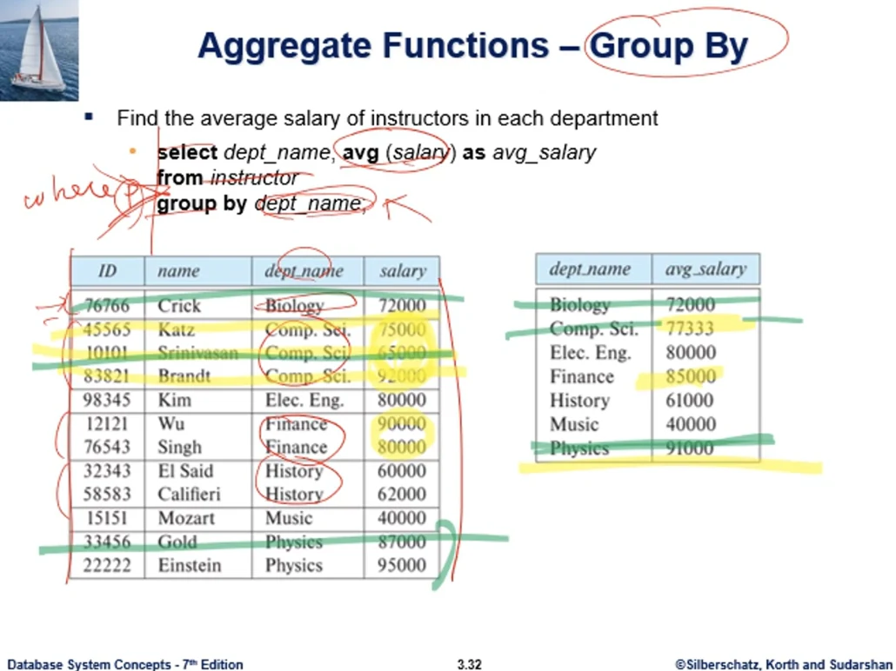

집계함수는 group by와 having절과 보통 많이 쓰인다고 했는데, group by는 이와같이 칼럼을 명시해주면, from 절의 레코드들을 (예제는 생략되어있다.) where절의 조건이 있을 수 있다. 이 조건을 충족하는 레코드들을 필터링한다음, 그 레코드들을 그룹핑을 한다는것이다.

dept_name칼럼값으로 그룹핑을 하고, 논리적으로 과 이름이 같은 레코드들을 같은 그룹에 편성한것을 볼 수 있다. biology같은 경우는 레코드가 한개인데 혼자서 한 그룹을 형성하고 있다. group by 가 이와같이 그룹을 짓게 되면, 그때 select절의 집계함수는 그룹 단위로 집계를 한다.

그래서 salary절의 그룹별 평균을 구한다. 결과 셋에 나타난 레코드들은 한 그룹에 대한 내용이다.

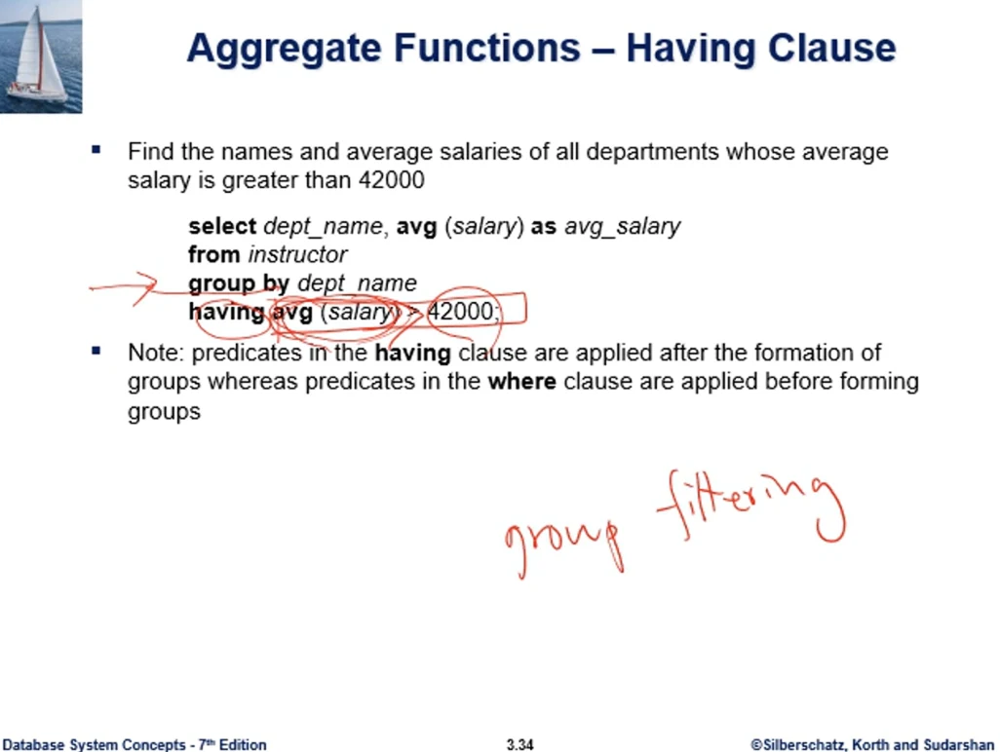

그리고 having절은 group by가 오게 되면, group by 절에 의해서 레코드가 그룹들을 형성하게 되는데, 여기에 조건을 줘서 어떤 그룹을 선택하고 어떤 그룹을 버리는 그룹필터링을 하게 된다.

이때 주어지는 조건 자체가 많은 경우 집계함수를 포함하는 조건이 주어지고, 예제에서는 avg(salary) > 42000 조건이 주어졌는데, 이 avg집계함수 계산 자체를 그룹단위로 해서 평가하는 것이다.

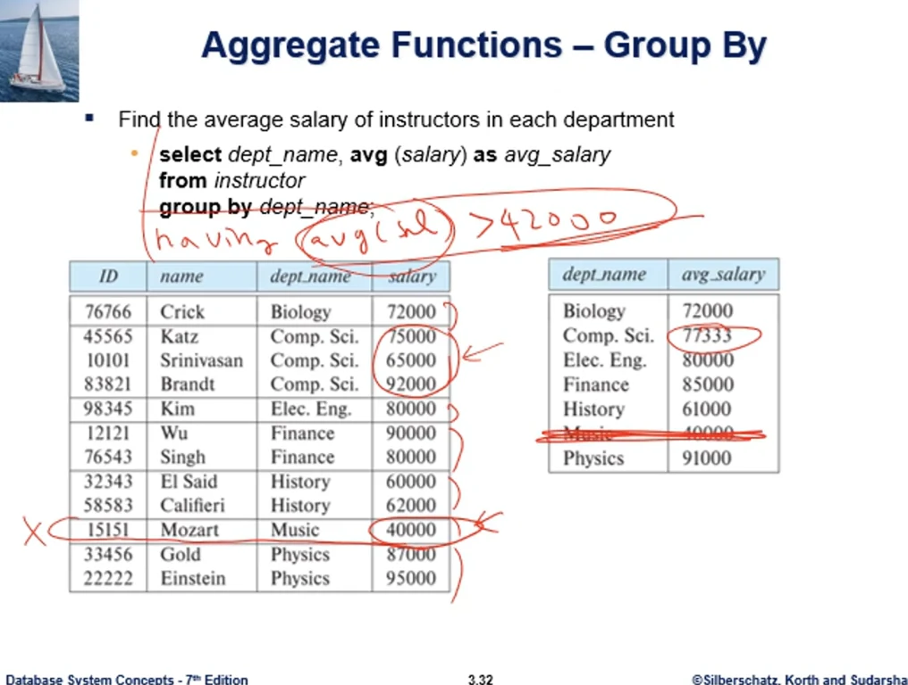

그래서 예시에서 보면 having avg(sal) > 42000 이라고 했다. 그룹핑을 했는데, 버릴 그룹을 위 조건으로 계산한다.

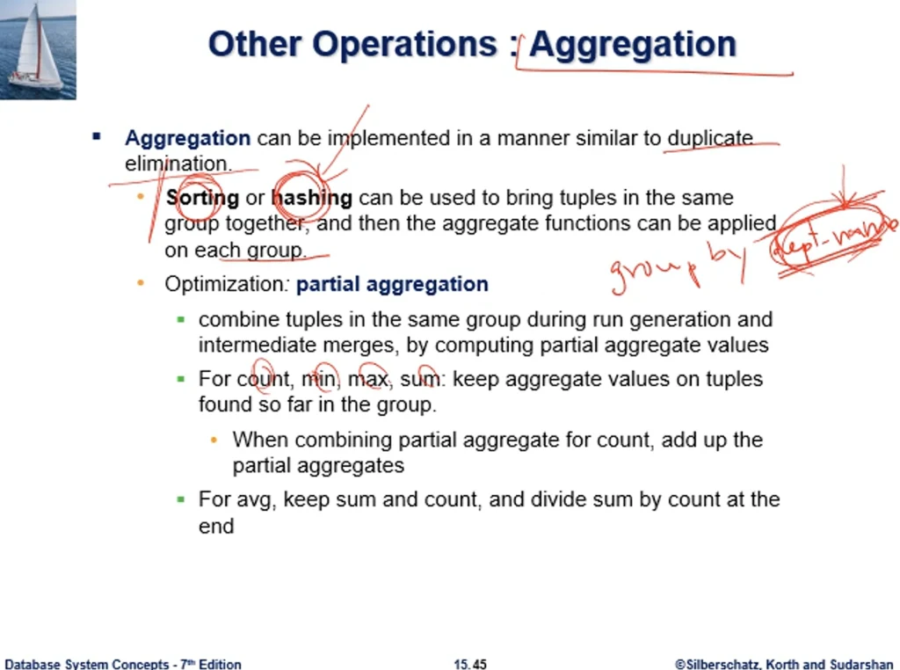

이와같은 집계함수 구문을 어떤 알고리즘으로 구현해야 하는가?? 일차적으로 group by 절이 명시하는 칼럼값으로 레코드들을 그룹으로 분류해야 한다. 같은 group by에 쓴 칼럼값, 예를 들어 앞에서 group_by dept_name 이라고 했으면, 이 레코드들의 dept_name 칼럼값이 같은 그룹으로 모아야 한다. 이것은 마치 중복된 값을 제거할때 우리가 정렬이나 해싱을 썼던것과 비슷한 방식으로 해결하면 된다. 정렬은 물론 외부정렬일 것이다.

정렬하면 같은값들이 인접위치에 모이게 되고, 자연히 그룹을 모으는데 직접적으로 도움이 된다. 그룹 단위로 집계함수 계산 적용 처리도 쉽다. 해싱을 쓴다고 하면 같은 레코드들이 같은 버킷에 매핑되므로 한 버킷 내에 학과이름이 같은 레코드들이나 동의어들이 모이게 되고, 그 버킷만 들여다 보면 하나 또는 그 이상이 그룹이 형성되어있기에 그룹단위 집계함수 처리에 도움이 된다.

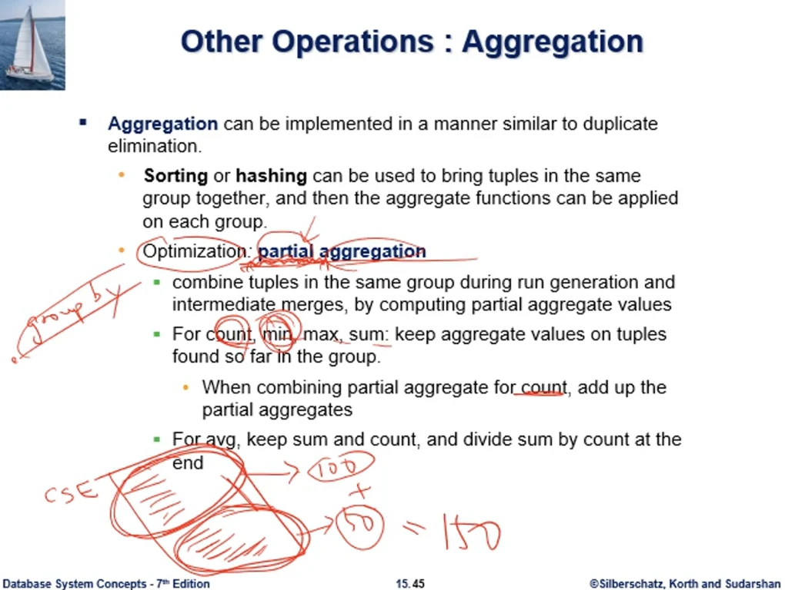

처리 과정이 optimization : partial aggregation 하는것은, group by하는것을 완전히 100% 수행을 다 해서, 레코드들을 그룹을 나누는 과정을 전부 끝내고, 그다음에 비로소 그룹단위로 함수를 적용하는. 이렇게 처리하면 답이 나오는것이 분명하지만, 항상 데이터베이스 환경은 데이터베이스 양이 많아서 양과의 싸움이 벌어진다. group by를 완결지은 다음 함수적용하지 않고, 먼저 테이블의 레코드들을 일부분만 버퍼가 허용하는 기준에 의해 일부분만 그룹을 짓고 미리 집계를 하는것이다. partial aggregation이 그것을 말한다.

count 같으면, 일부만 그룹짓고 먼저 카운트를 일단 한다, 나머지 레코드들을 카운트를 한 값을 더해서 결과가 나온다. minimum도 마찬가지로 일부 그룹의 최소를 알고, 다음 일부 그룹의 최소를 알면 비교시 최소를 유지하면 된다. 

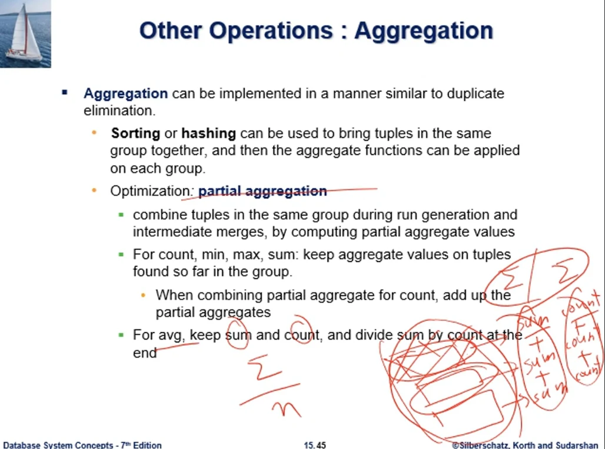

평균의 경우에는, 합을 구한다음 나누기 n 하면 되는데, sum하고 count하면 평균을 구할수 있다. 그룹 일부에서 sum count 하고, 이런식으로 부분부분을 partial aggregation 하고, 전체를 더해서 더한것을 더한걸로 나누면 평균이 나온다.

데이터 양과의 싸움, 효율적인 처리를 위해 partial aggregation을 수행할수 있겠다 하는 것이다.
