## 11주차1st ch16

16장 질의최적화 문제
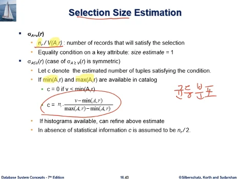

지난 수업때 select 연산의 결과 크기, 결과 레코드수를 추정하는 방법을 공부했었다.  
카탈로그에 있는 이러한 관계 데이터를 이용하고, 컬럼값들이 균등하게 분포되어 있다는 가정하에 이러한 식들로 select 연산의 크기를 추정하였다.

그런데 select 연산의 경우, 이러한 추정 방식을 보니까 실제 추정의 정확도가 떨어질수 있겠다는 생각이 든다.  
칼럼 값의 균등분포 가정이 실세계의 운용과 맞지 않을수도 있다.

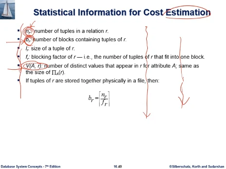

그래서 이 추정의 정확도를 높이고 싶으면 어떻게 해야 할까?  
추정에 사용되는 통계 데이터가 정교하게 유지되어야 하고, 데이터베이스라고 하는것은 늘 삽입 삭제 변경이 계속 일어난다. 새로운 레코드가 삽입되면 늘고, 삭제되면 하나 줄어든다. 삽입 삭제가 시간에 따라 누적이 되면, 그에 따라 블록 수 자체도 변화가 올 것이고, 칼럼의 값 분포에 대한 정보도 변화가 올 것이다.

추정의 정확도를 높이고 싶다면 다양한 형태로 통계치를 유지해야 할 것이고, 수시로 업데이트 해야 한다. 그러나 그것은 DB 환경에서는 어렵고 부담스럽다. 그래서 실시간적으로 100% 정확한 통계를 유지하긴 부담스러우므로 하지 않고, 대체적인 통계치를 유지하면서 활용하여 균등분포 가정하에 추정하는 것이다.

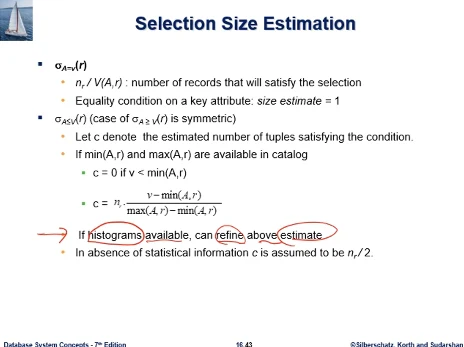

그래서 보면 히스토그램 형태의 더 정교한 정보가 통계 데이터로서 유지가 된다면, 위의 추정 결과치를 더 정교하게 할수 있다 refine 이라는 말이 있다.

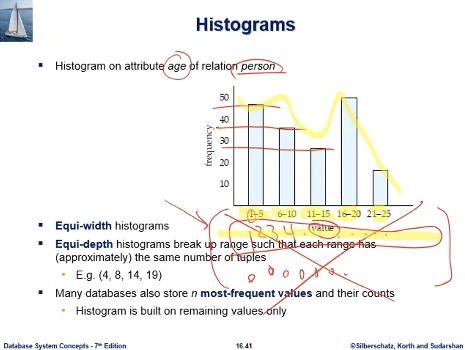

히스토그램이란건 우리가 알다시피, person 테이블이 있고 age 칼럼이 있다. 나이 컬럼값이 1-5사이는 48, 6-10은 45 정도... 하는 식으로 범위별로 레코드 수, 나이 칼럼의 값의 분포를 정교하게 저장한 것이다.

가장 정교하게 저장한것은 한살은 몇명, 두살은 몇개 이런식으로 각 age 값마다 레코드수가 100% 정확한 값의 분포에 대한 내용을 담는것인데, DB 통계치를 그렇게 담는것은 너무 부담스러운 일이므로 그렇게는 못하고, 좀더 자세히는 하고 싶다면 히스토그램같은 것을 쓸 수 있다.

시스템마다 통계치를 유지하는 방식은 다르다. 히스토그램과 같이 더 정교하게 유지된다면 추정의 정확도를 높일수 있다고 되어 있다.

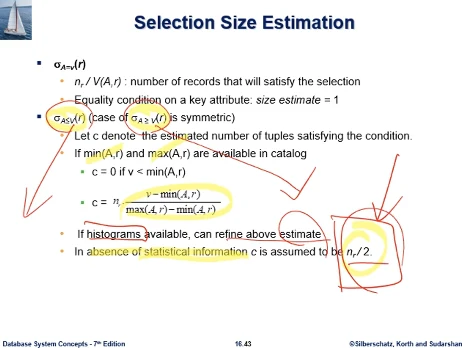

그런데다 마지막에는 만약 통계치 정보가 제공이 안된다 하면 어떻게 추정하는가 했을때 (위의 부등호 경우), minimum, maximum 이런걸 알면 비율로 추정을 하는데, 아무런 정보가 없다면 대략 반쯤된다고 러프하게 추정할수 있다는 것이다. 물론 법칙을 정해놓은것은 아니고 시스템마다 방식이 있겠지만, 예를 들자면 그렇게 할수 있다는 것이다.

대략 V 값이 중간쯤 오는, 큰 경우도 마찬가지로, 그런 값이라는 것으로 가정을 한 것으로, 대략 전체 레코드의 절반 정도가 이걸 충족한다 하는식으로 러프한 추정을 하게 된다.

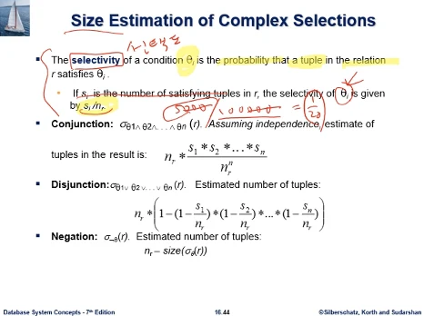

그래서 select 연산의 결과 크기 추정과 관련해서 중요한 개념의 파라미터가 있는데, 선택도 라는 것이다. selectivity

select연산의 조건이 주어지면, 그 테이블의 각 레코드가 조건을 충족할 확률을 말한다.

S_i가 theta의 조건을 충족하는 레코드 수이다. 그래서 만약 n_r이 10만개인데, 5천개가 theta_i의 조건을 충족한다고 하면, 그것이 선택도 값이 된다. 5000/100000 = 1/20

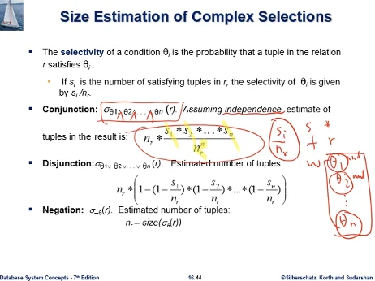

그래서 조건에 대해 선택도가 주어지게 되면 이런 형태의 일반적인 select문, and로 여러 조건이 연결된 상황. 그때 이 조건들을 충족하는 레코드 수는 얼마나 될 것인지가 아래에 나온다.

theta_i를 충족할 확률들을 전부 곱한것이 된다.(이건 그들 확률간 서로 독립적이라는 가정하에 그렇게 구하게 된다.)

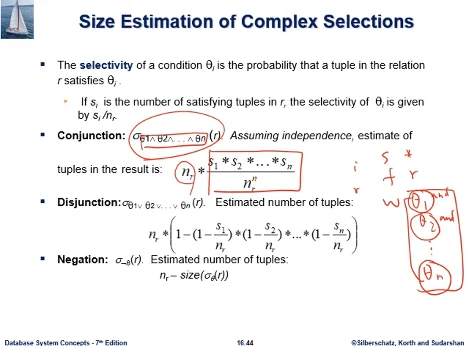

and조건으로 묶인것을 확률을 곱한것이 우측이고, 거기에 n_r을 곱하면 결과 레코드 수가 나오게 된다.  
conjuction은 and를 말하고, disjunction은 or을 말함.

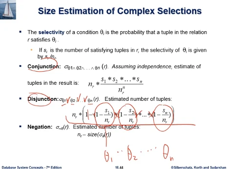

그래서 or는 theta_i중 어느 하나만 true가 되어도 전체가 true가 된다. 전부 false가 되어야 해당 레코드를 선택하지 않게 된다.

theta_i가 false가 될 확률을 다 곱하고, 모두 false가 될 확률을 구한다음 다시 그걸 1에서 빼면, 이들중에 어느 하나는 true가 나와서 전체가 true가 될 확률이 나온다(or조건). 그래서 이 확률을 곱하면 이것을 충족하면 레코드수가 나온다.

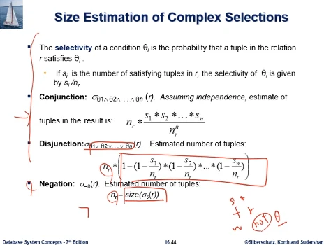

마지막은 not, theta 조건 앞에 ㄱ자가 붙어서, 충족하지 않는것을 뽑는것. 이건 theta를 충족하는걸 구해서 전체 레코드에서 빼주면 된다.

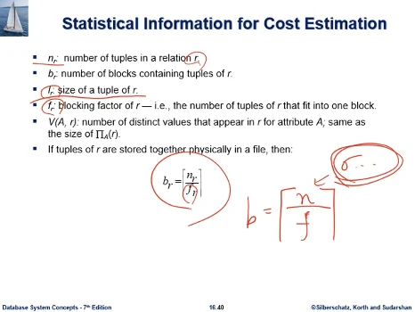

select 연산에 대해서 레코드수, 결과 레코드 수를 추정하는 내용을 봣는데, 그 레코드들이 db환경이니까 개수가 많고 디스크에 쓰여져야 하는 상황이라고 했을때, 몇블록에 쓰여지는지 알 필요가 있다. 대부분의 비용식 자체가 블록수로 많이 구성되어 있으므로.

마지막에 n_r이 있는데 이것이 r테이블의 레코드 수지만, 대신에 어떤 select 연산했을때 나오는 결과 레코드 수를 추정하는 방법이 있었다. 그것이 n개가 나온다면.

현재 블록크기와 중간결과 레코드의 크기를 우리가 대략 알게되면 bf가 계산이 된다. (f_r) 이걸로 나눠주면, 그리고 소수점이 나오지 않게 정수로 올리면 블록수 계산이 나온다

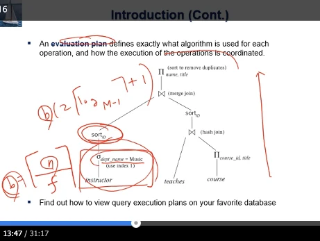

그러니까 이 select를 인덱스를 써서 했는데, 했을때 학과 = music을 충족하는 레코드 수 추정을 우리가 배웠었다. 이것을 임시 테이블로 디스크에 n개 레코드를 저장한다, n개 레코드를 메모리 버퍼에 다 들고있기에는 너무 많다.

디스크에 썼을때 몇 블록이 될건가 하는 문제는, 지금 말한것처럼 bf로 나눠주면 블록 수가 나온다.  
블록 수를 왜 알아야 하는가? 외부정렬에 들어가는데 외부정렬 식 자체가 b(2 \* ceil(log M-1) + 1) 이런식으로 나오는데 b를 알아야 비용계산이 나온다.

그러니까 select연산 레코드 수 추정해서, 블록 수 추정해서 그런 과정을 쭉 해서 전체 플랜의 비용을 계산할수 있게 된다.

### 연습문제

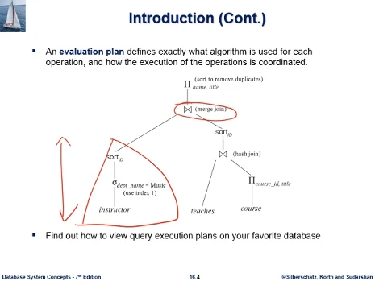

evaluation plan은 교재 그림 16-2의 예시다. 문제는 merge join 하는 노드가 있는데, 그것의 왼쪽 서브트리의에 있는 plan의 처리 비용을 추정하는 것이다.

### 왼쪽 sub tree

왼쪽 sub tree에서 먼저 select 연산의 결과를 구하기까지의 비용을 추정해보려면, 카탈로그의 통계 데이터로서 어떤것이 필요할까?

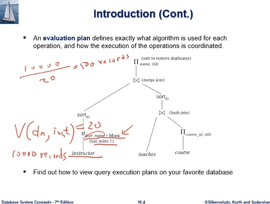

- instructor의 레코드수 : 10000개라고 가정
- select 조건이 dept_name = music (col = value 형태), 그래서 V(d_n, inst)값이 필요하다. 이것을 20으로 가정. 학과 컬럼에 스무개의 학과 값이 나올 수 있다는 것이다.

이렇게 되면 select 조건을 충족하는 레코드 수는 10000/20 = 500 개 레코드로 추정이 된다.

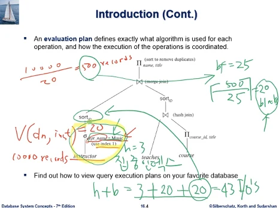

index 1을 사용한다고 했다. 우리가 index 1을 높이 h=3, 그리고 clustered index, 집중인덱스로 가정. 이것은 dept_name = music 에 500개의 레코드가 있는데, 이들이 블록들에 모두 모여있다는 이야기이다.

몇 블록에 모여있을까? 우리가 이걸 추정하기 위해 필요한 카탈로그 통계 데이터는??

- 답 : bf이다. instructor table의 bf = 25 라고 가정.

그럼 500개의 레코드가 한 블럭에 25개씩 모이므로, ceil(500/25) = 20 blocks. dept_name = music을 충족하는 레코드들이 20개의 블록에 모여있다는 이야기이다.

결론적으로 select 연산을 집중인덱스, index scan으로 처리하는 비용은

- h+b = 3+20

그런데 문제에서는 표시한 select연산 결과가 질의의 최종결과가 아니다. 중간결과이고 그 결과를 sort연산에 Input으로 넣어야 한다.

그러므로 20개의 블록 얻은것을 버퍼에 다 갖고있지는 못하고, 디스크에 저장하고 sorting에 들어간다. (+20)

- 그래서 select 연산에 필요한 발생하는 io수, 비용은 3 + 20 + 20 = 43 번의 IO's

### sort 외부정렬 비용

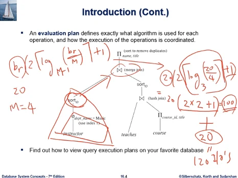

이것은 알고있다. b_r \*(2 \* ceil(log \_(M-1) (b_r/M)) + 1)  
중간결과로 얻은게 20 블록이란걸 알고있다. 이 20블록을 디스크에 저장한 상태이다. 이 식에 적용하려면 M을 알아야 한다

- M = 4 가정

대입시 20 (2 ceil(log \_3 (20/4)) + 1) = 20 (2 \* ceil(1.5) + 1) = 20 (2 \* 2 + 1) = 100 IO's  
근데 이것도 최종결과가 아니라 merge Join의 input으로 들어가야 한다. 애초에 20블록짜리 데이터였으므로 다시 디스크에 써줘야 한다.

- 100+20 = 120 io's 가 외부정렬하는데 발생함

### 비용 정리

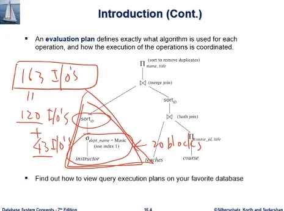

- select에 43 IO's (20 블록이었다.)
- 외부정렬 결과를 디스크에 쓰는q것까지 120 IO's

왼쪽 서브트리 총 비용은 163 IO's

### 연습문제

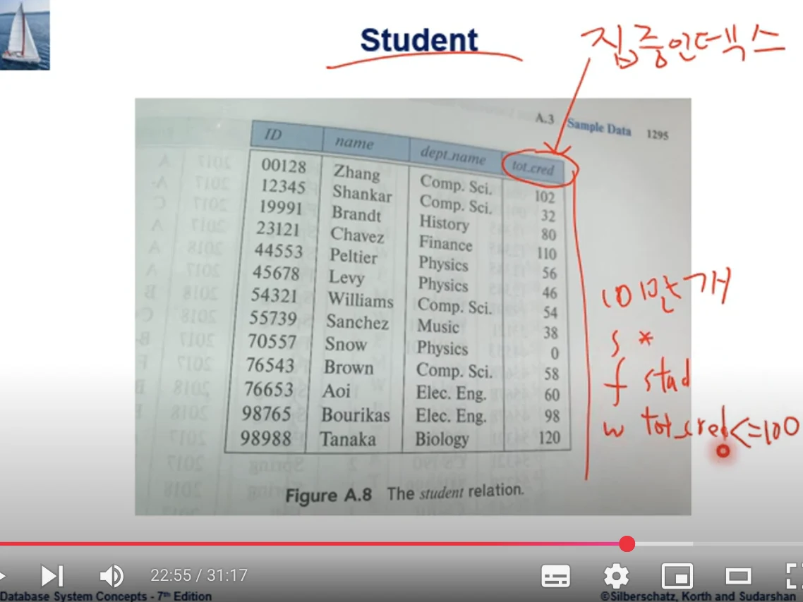
학생 테이블 레코드를 10만개. 질의는 select \* from student where total_cred<=100  
total_cred 컬럼에 대해 집중인덱스가 있다.

집중인덱스가 있다는건 교재 그림에서 튜플 인스턴스를 보는건 logical view다.  
물리적 뷰는, 이 레코드들이 저장될때 total_cred col 값으로 정렬되어있음. 집중 인덱스가 있다는것이 그 이야기이다.  
이 상태에서 문제는. 질의처리의 비용을 추정하는것

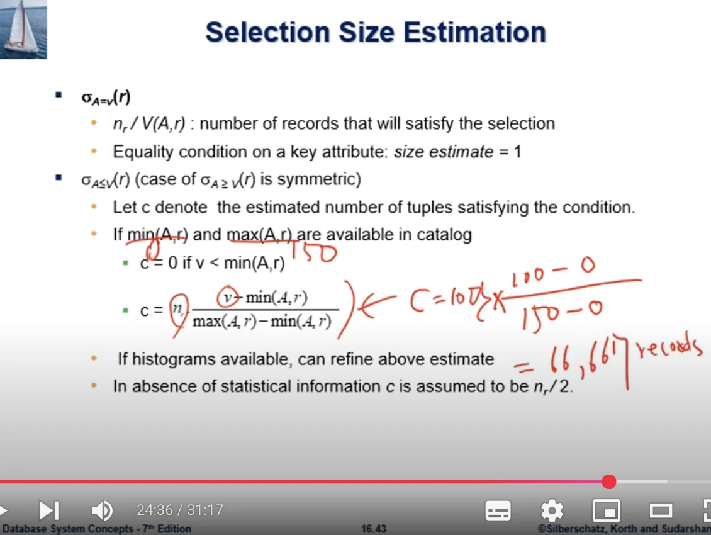

처리비용 단위는 io수로 나올텐데, 그걸 구하기 위해서 먼저 조건을 충족하는 레코드수부터 추정해야 한다.

앞에서 문제로 추정해본 바가 있다. 이 식을 이용해서, min=0, max=150으로 대입하면 나온다. 66667개 레코드다

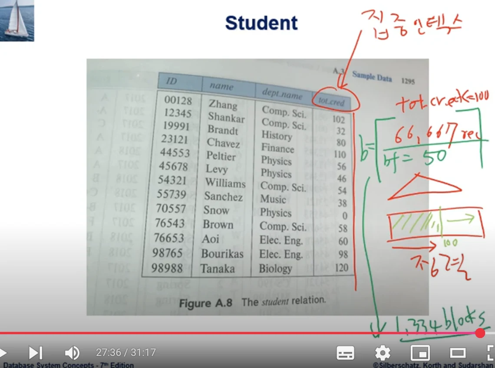

tot_cred <= 100 인 이 레코드들이 어떻게 저장되어 있느냐 하는건, 이 칼럼에 대해 집중인덱스가 있다고 했으므로

물리적으로 이 레코드들이 tot_cred 값으로 정렬되어있다, 인덱스가 있고 레코드들 데이터파일이 있다면 정렬되어 있다. 어딘가에 100학점 지점이 있을것이다.

이런 상황이면 사실 질의처리를 할때 인덱스를 쓸 필요가 없다고 15장 공부할때 말했었다. 100학점보다 작은것들이 모여있으므로 인덱스를 통해서 랜덤한 위치를 찾아가지 말고, 데이터파일 맨 왼쪽부터 100보다 커질때까지 읽으면 된다. 데이터파일만 엑세스 한다는것.

데이터파일 엑세스 비용은 어떻게 되나? io를 몇번하는지 블록 수를 알아야 한다. 66667 레코드가 몇 블록에 저장되어 있는가?

이것을 알려면 bf을 알아야 한다. bf=50으로 가정하자. 그러면 블록수는 1334블록이 나온다.

조건 충족 레코드를 검색하는 질의 비용은 1334io이다. 비용 충족하는 레코드 수 추정후, 그다음 블록수를 추정하는 과정이었다.

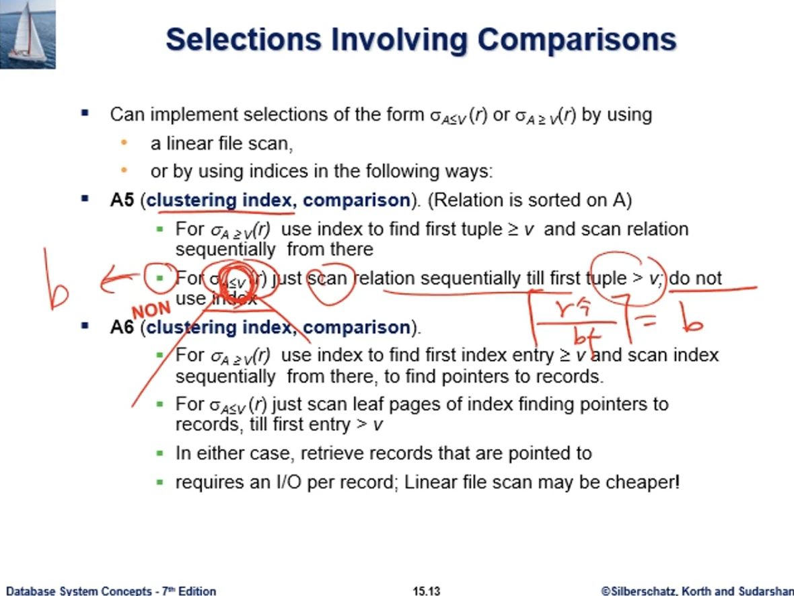

15장에서 공부했던 슬라이드이다.

비교연산자가 주어진 select 연산 처리 알고리즘에 대한 공부를 했었음, 지금 했던 연습문제의 질의는 조건이 A<=V 상황이었다. 이 경우는 집중인덱스를 쓰지 않는다고 되어있다.

데이터 파일의 레코드들이 정렬되어 있기 때문에, 조건을 충족하는 레코드들이 파일의 처음부터 정렬되어 저장되어 있다. 조건에 맞지 않는 부분까지 차례대로 테이블을 스캔하면 된다.

비용은 b개 블록을 파일 처음부터 읽는데, b의 값의 추정은 조건 충족하는 레코드수를 먼저 추정하고, ceil(레코드수/bf) = 블록 수 가 나오고 이것이 비용이 된다.

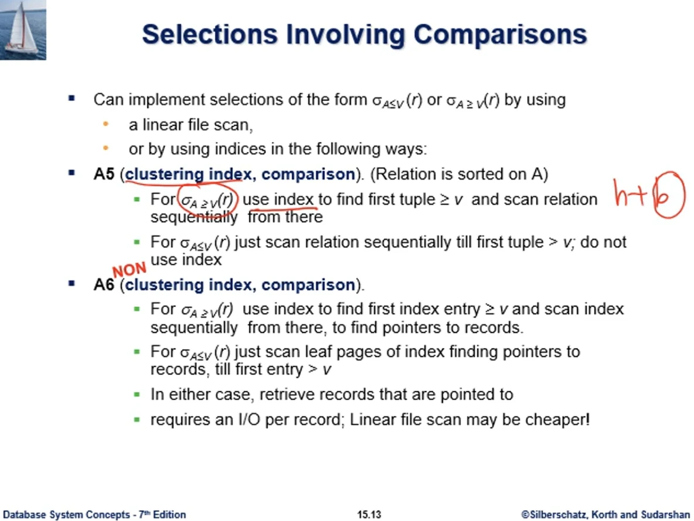

반면 부등호가 반대인 위의 경우, 인덱스를 쓴다. 비용은 h+b 이고, 이때도 b의 추정은 레코드 수를 먼저 추정한다음 bf을 통해서 블록수를 구할수 있다.

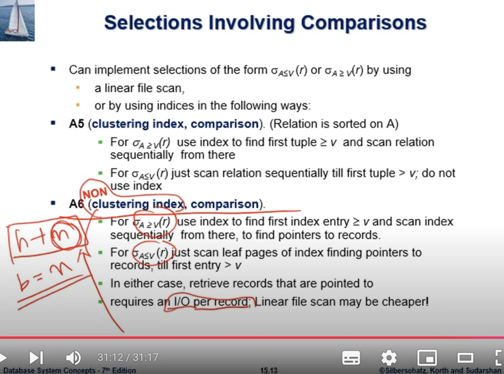

비집중 인덱스에 대해서는 부등호 양쪽방향이  
비용이 h+n이었다. n이 레코드수인데. 이경우는 레코드수를 추정한다음 블록수를 굳이 말하자면 그냥 n이 된다. b = n  
이 경우는 인덱스가 secondary index, 비집중인덱스이므로 n개 레코드가 모여있지 않고 블록 여기저기 흩어져 있게되는데. 최악의 경우는 레코드 한개당 각각 독자적인 블록이 있는 경우이다. IO per record  
그래서 이경우는 레코드수만 구하면 비용을 추정할수 있었던 것이다.

## 11주차2nd ch16

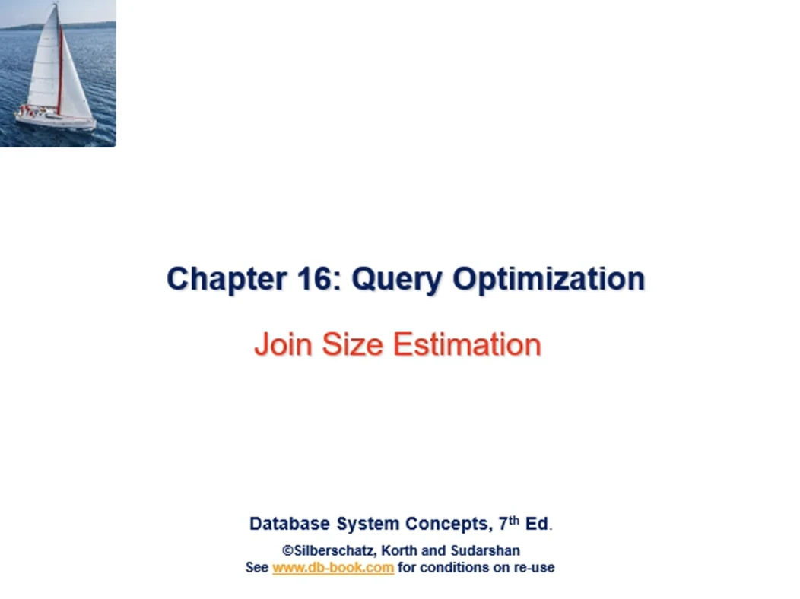

조인연산의 결과 크기 추정

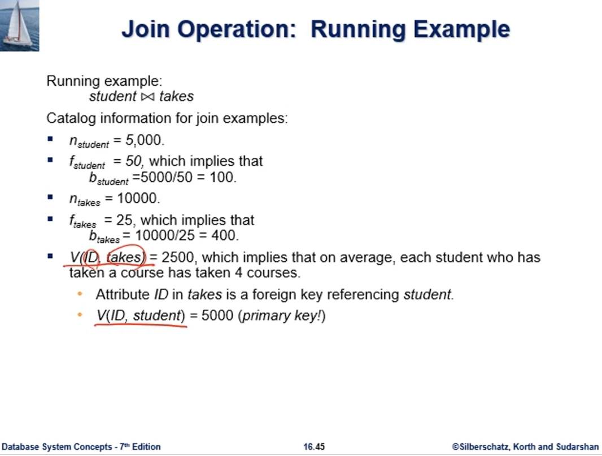

조인 연산을 했을때 결과 크기는 어느정도 될것인가? 추정하는 방법을 살펴보자.  
계속 써왔던 예제로 학생테이블과 수강테이블을 조인하는 예시를 보자

통계치가 주어져 있는데

- 학생테이블 레코드수 5000
- bf = 50
- 5000개를 50개씩 묶어서 한 블록을 형성하므로 모두 100개 블록에 저장되어 있다.

- 수강테이블은 레코드가 10000개
- bf = 25
- 10000/25 = 400개 블록에 저장되어 있다.

수강 테이블에 아이디 칼럼에 서로다른 값이 모두 2500개가 나온다

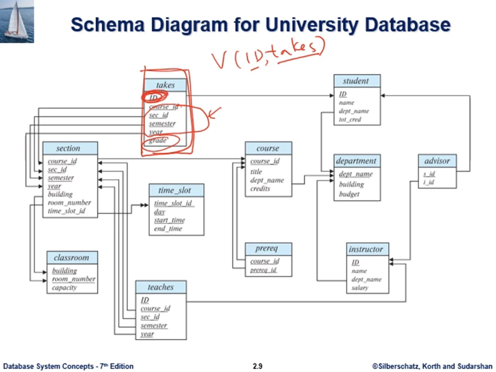

잠깐 스키마를 보면, 수강테이블에 ID가 수업들은 학생 학번이다. 수업들은 분반이 4개의 합성키로 나타내고, 성적이 무엇인지 나와있다.

V(id, takes) 라고 하는, takes의 id 칼럼을 보면 서로 다른 값이 모두 몇종류 나오느냐 하는 것인데. 대학 DB 실세계 용어로 이야기하면, takes 테이블(수강내역)에 등장하는 서로다른 학생이 모두 몇명이냐는 것이다.

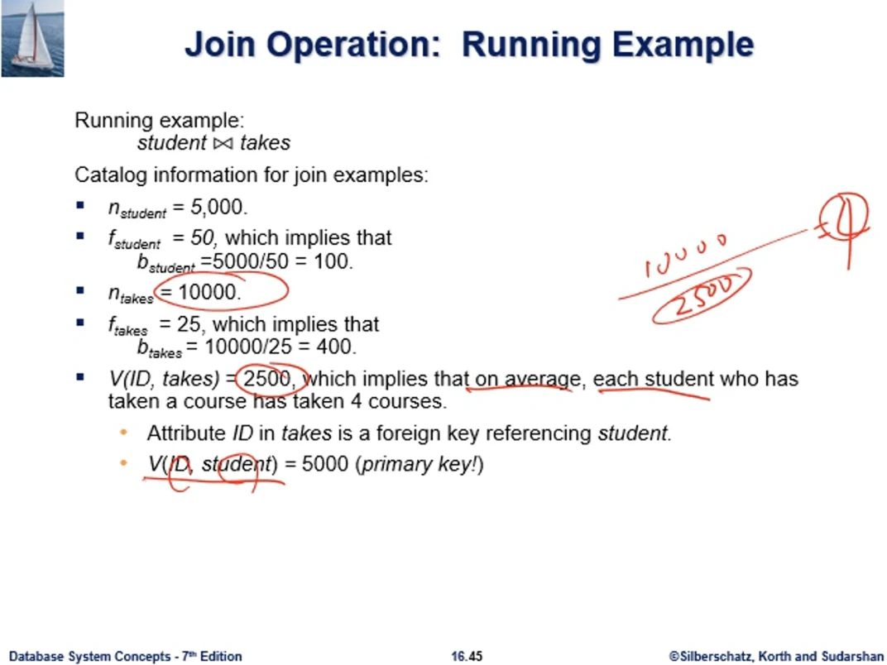

2500명이 수업을 들었다는 이야기다. 그런데 수강테이블에 레코드수는 10000개가 있다. 10000건의 수업을 들은 서로다른 학생수는 2500명이다. 나누면 4. 2500 각 학생이 평균적으로 4과목 들었다는 의미가 된다.

그 다음에 V(ID,student) 학생테이블의 ID는 얼마인가? 이것은 5000이라고 나와있다. 위의 스키마를 보면 학생 테이블의 ID가 PK이다. 학생 테이블의 레코드수가 5000개라고 했으므로, 자연히 ID 칼럼에 등장하는 서로다른 학번값은 5000종류

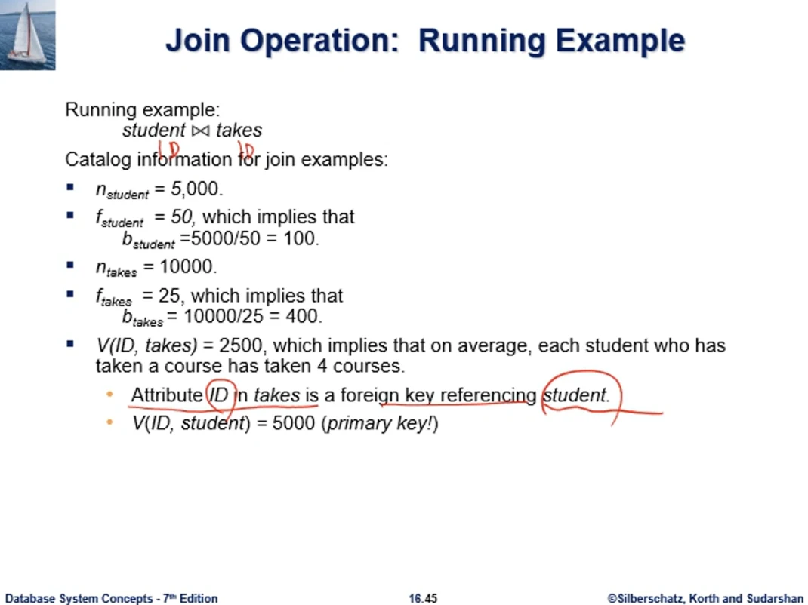  
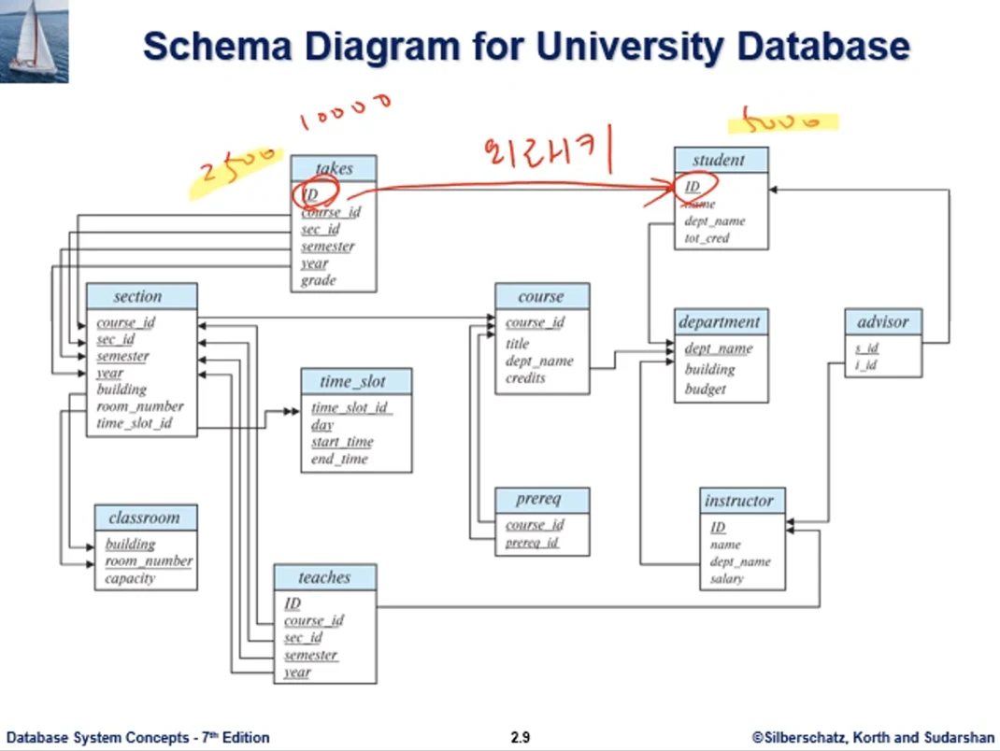

그리고 student ID하고 takes ID의 관계는, 수강쪽의 ID가 왜래키이다. 학생테이블의 id를 참조하는 외래키다.

스키마에서 화살표 표시가 되어있다. 참조관계라는 것이다. 학생은 모두 5000개 레코드이므로 5000명의 학생이 있다는것인데, takes는 10000건의 수업내역이 있는데, id 칼럼에서는 서로다른 학번이 2500개의 다른값이 나온다고 했다. 5000명 학생중에서 수업을 들은 내역이 있는 학생은 2500명만 해당된다.

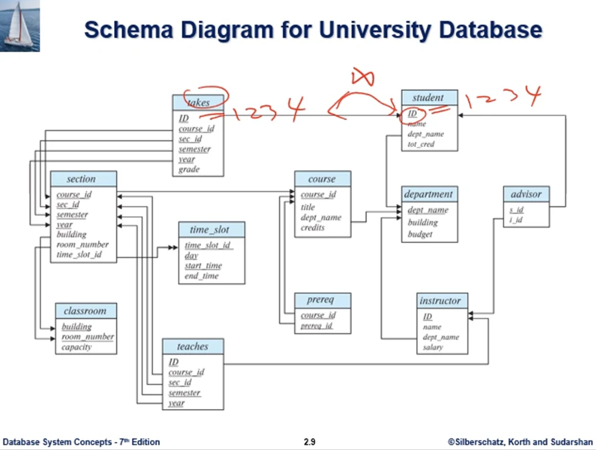

외래키는 정의상 그 값이 반드시 피참조 테이블에 존재해야 한다. 예를 들어 takes에 id=1234 값이 있으면, 학생 테이블에 id=1234 인 레코드가 반드시 있다는 것이고. join연산면에서 보면, takes의 레코드는 student 쪽에 자신의 join 짝이 반드시 존재한다는 이야기이다.

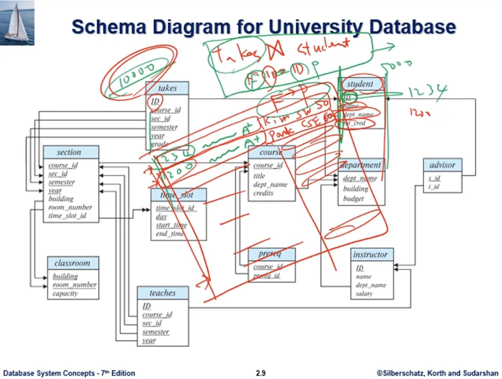

takes와 student가 조인이 될때, join 칼럼이 id=id 인데, id 한쪽은 FK이고, 한쪽은 PK 이다. 이 형태가 RDB에서 전형적으로 많이 나타나는 패턴의 join질의인데. 이럴떄 join의 결과 레코드가 몇개가 나타날지 하는것은 아주 쉽게, 정확히 추정이 가능하다.

지금 스키마에서 설명하면 레코드수가 10000개, 5000개 이다. 이 10000개 레코드중 2개만 써본다

- 학번 1234 - 수업 1 - 성적 1
- 학번 1200 - 수업 2 - 성적 2

이 id=1234값을 가지고 학생 테이블에서 join의 대상 레코드 짝을 찾으면 몇개가 나올까? 학생에서 학번이 1234인 학생은 PK이므로 1개뿐이다. 이 레코드는 학번 하나당 1개뿐이다  
10000개 다 써보면, 각각 전부다 옆에 학생 테이블에 join짝이 1개씩밖에 없다. 전체 join의 결과 레코드 수는 10000개이다.

한쪽은 외래키이고, 한쪽은 그것이 참조하는 PK이고, equal조건으로 주어지면 외래키쪽의 레코드 수만큼이 join 결과로 나오게 된다.

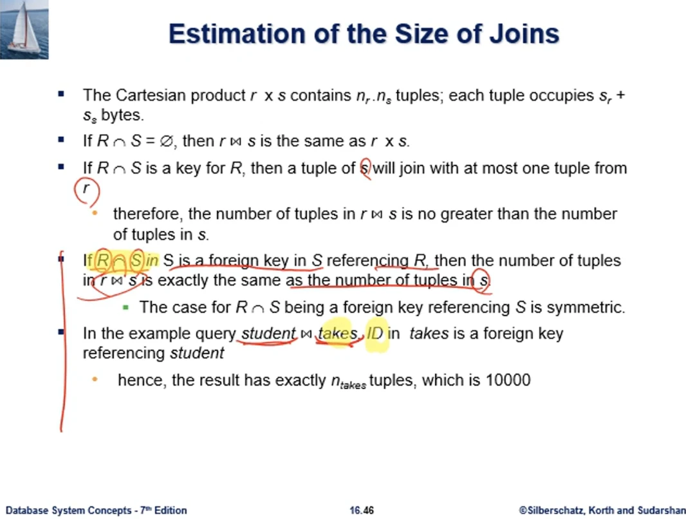

그 내용을 정리한 부분이 이것이다.  
우리가 교재에서 테이블 이름을 대문자로 쓸때는 컬럼 집합이고, 소문자로 쓸때는 튜플의 집합이다.

그래서 교집합을 했는데, R하고 S의 겹치는 칼럼을 말하는것이고, 그 겹치는 칼럼이 S쪽에서는 FK이고 R쪽에서는 참조당하는 PK라고 하면,

- join결과의 레코드수는 FK가 있는쪽 레코드수와 정확히 일치한다.

지금 학생과 수강을 join 한다고 할때, 학생 테이블의 칼럼들하고 수강 테이블의 칼럼들에서 겹치는 부분, 교집합을 해보면 ID 칼럼이다. 이것은 수강쪽에서는 FK, 학생쪽에서는 PK. 이 join의 결과는 외래키가 있는 수강테이블의 레코드수와 똑같아진다.  
n_takes = 10000개인데, join 결과도 10000개이다.

### 연습문제

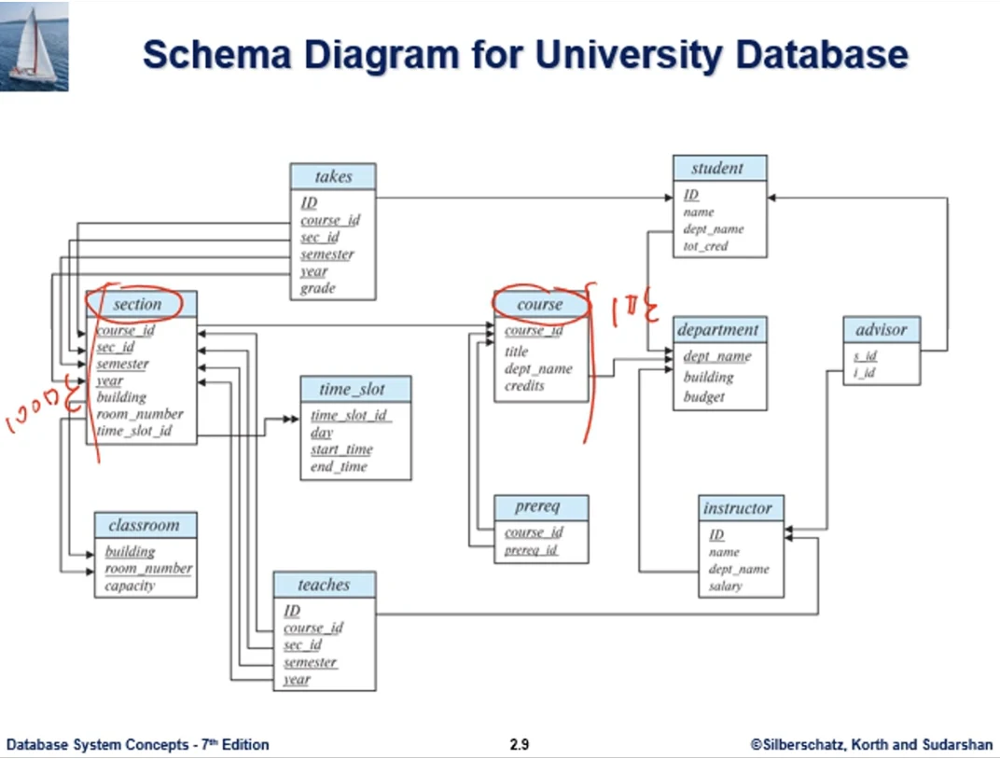

교재 대학 DB section테이블과 course테이블의 자연조인을 고려한다. section레코드수는 100만개, course레코드수는 1만개. 조인 결과 레코드수는 몇개인가?

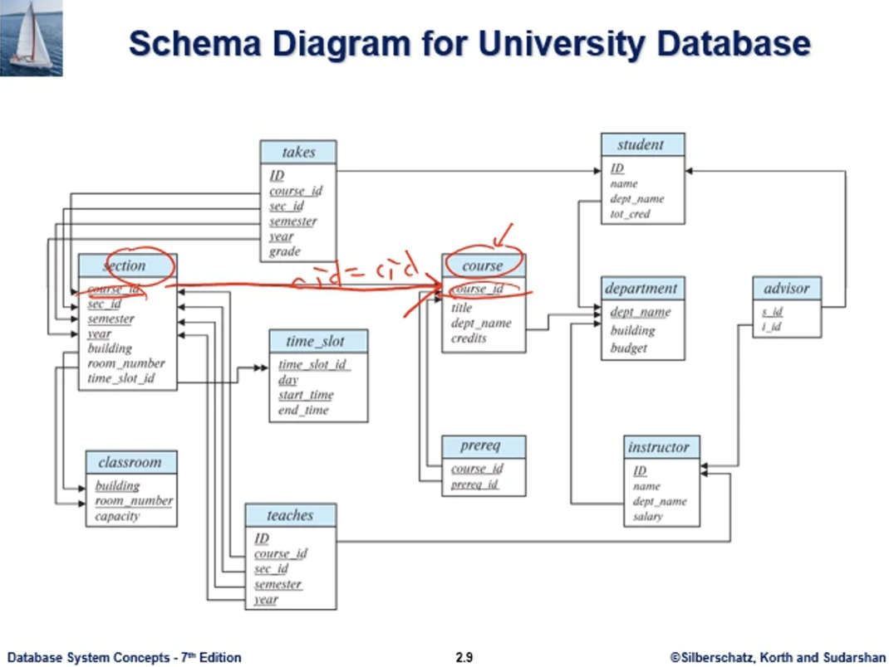

자연 join이므로 course id = course id가 된다. section에서 cid는 course 테이블을 참조하는 외래키(화살표), course에서 cid는 참조되는 컬럼으로서 이 테이블에서 PK인 상황이다.

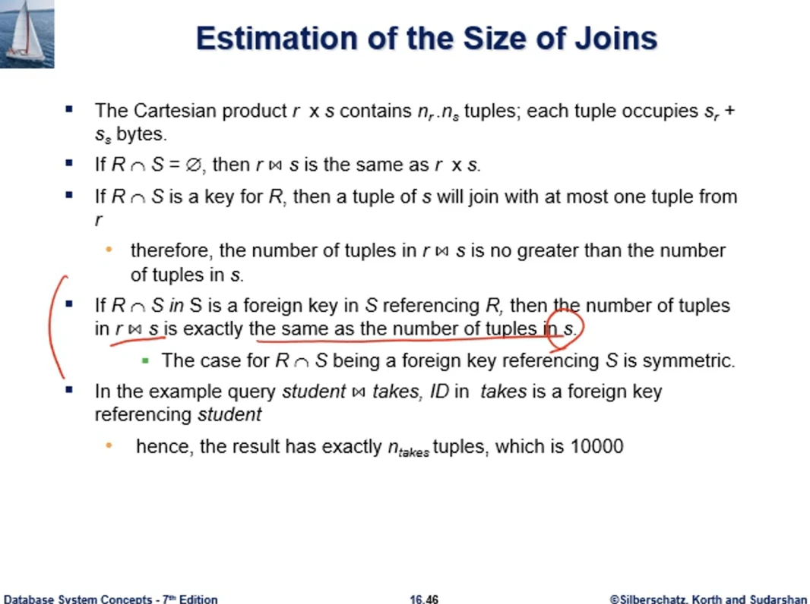  
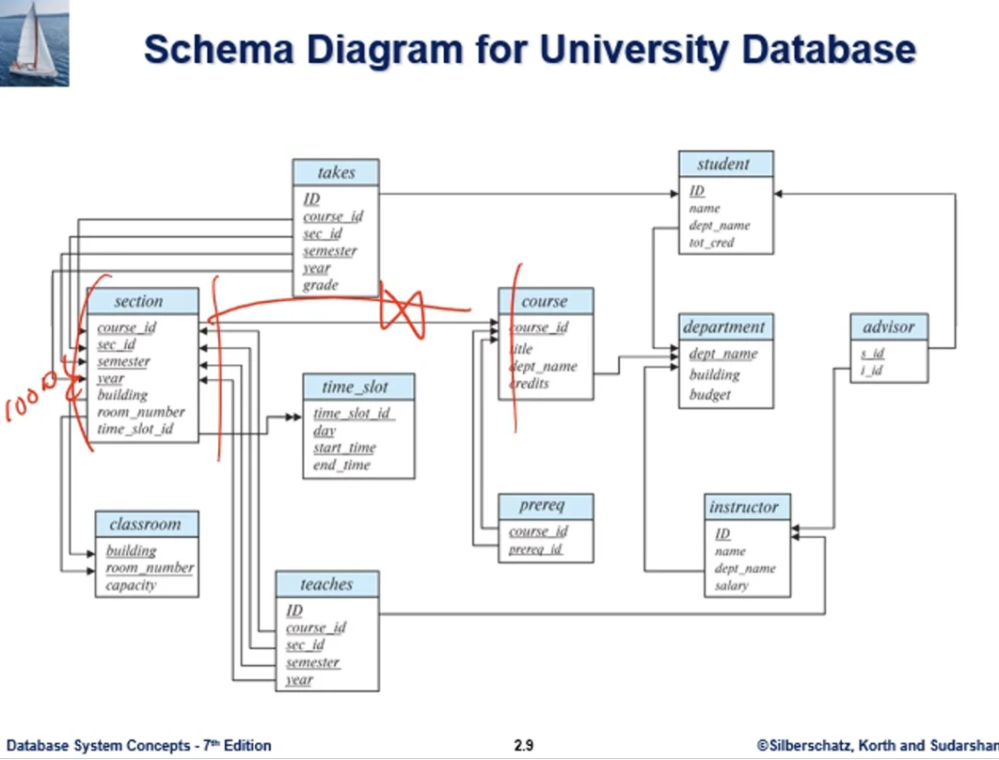

따라서 이 패턴에 해당하는 join이다. 이 경우 join 결과수는 외래키가 있는쪽 테이블의 튜플수하고 같다고 했었다. section에 100만개가 있다고 했었는데, 이 course랑 자연조인을 하면 그 결과 레코드수는 100만개이다.

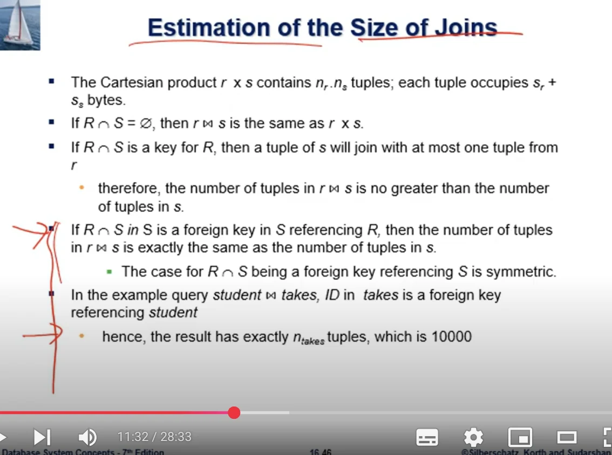

그래서 rdb에서 join을 했을때 대부분 경우가 이 패턴에 해당이 된다.  
그래서 조인결과가 크기가 몇 레코드가 나오는가 추정하는 부분은 쉽게 처리가 된다. 그런데 이 패턴에 해당하지 않는 부분은 결과 레코드수가 몇개쯤 나올까?

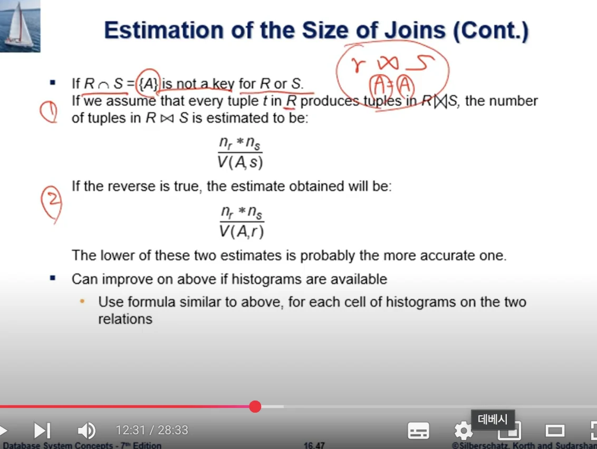

빈도가 높지는 않을 것이나, R, S를 조인하는데, 두 테이블이 겹치는 부분이 A이다. A=A로 조인하는것. 그런데 A가 R,S의 PK가 아니고, 외래키로 참조하는 관계도 아니다. 이때 join의 레코드수는 몇개쯤 될 것인가?

이것을 추정하기 위해서는 두가지 관점에서 본다.

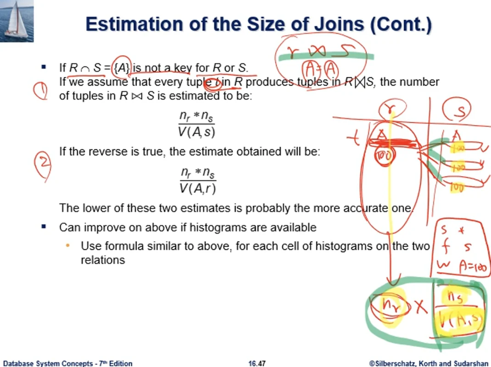

1. R테이블에 t라는 레코드가 있는데, 이것이 S 테이블의 레코드와 조인이 된다고 가정한다고 본다.

- A의 컬럼값이 100이라면 S쪽에서 컬럼값이 100인 레코드와 조인이 될 것이다.
- R의 레코드는 총 n_r개가 있는데, 그들중 하나가 이 역할을 한다. 이것은 몇개의 레코드와 join짝을 짓는가?
- A=100인 경우는 우측에서, select \* from S where A=100 을 찾는것과 똑같다.
  예시에서는 3개랑 짝짓는다는 소리다.
- 총 n_r개 레코드가 있는데, n_r개 각각에 대해서 맺어지는 레코드가 몇개씩이냐 하는것은 n_r \* (n_s / V(A,s))
- 무슨말인가 하면, S테이블에 A칼럼이 등장하는 서로다른값 총 수중에 100이라는 값은 그중 어느 한가지이다. 총 레코드 수가 n_s개가 있는데, 이 비율 (1 / V(A,s))만큼이 a=100에 해당된다는 것이다.
- 왼쪽에는 총 n_r개가 있는데, 그 각각에 대해 (n_s / V(A,s))이만큼의 레코드 짝이 join짝으로 나와서 위와 같은 결과가 나온다고 추정한다.

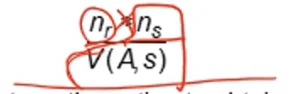
왼쪽에는 총 n_r개, 오른쪽은 총 레코드 수가 n_s개가 있는데, 이 비율 (1 / V(A,s))만큼이 a=100에 해당된다는 것이다.

정확히는 이렇게 추정한 것이다.

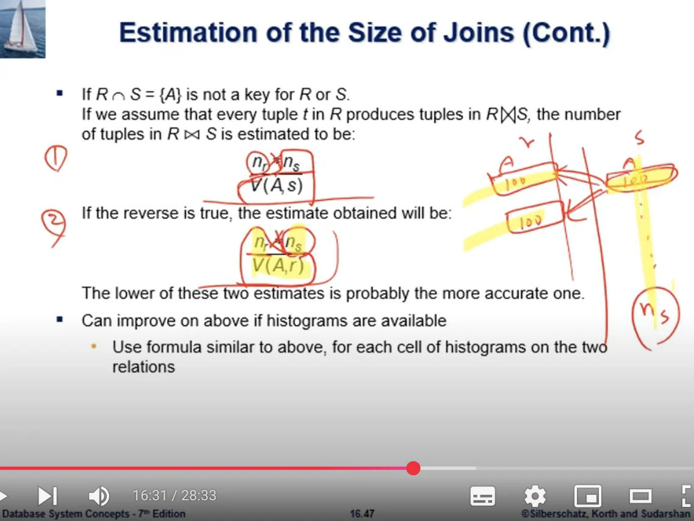

2. 이번에는 r s 관점을 바꿔서 해보면, 아래 식이 나온다.

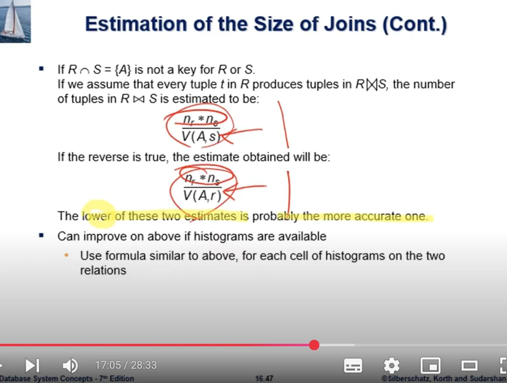

그래서 r s 입장에 따라서 나눈것인데, 분자는 같지만 분모가 다르다. 그러므로 두 값은 다른값이 나올 수 있다. 그래서 보통 db시스템들이 두 값중 작은값을 선택해서 조인 결과 크기를 추정한다

예제로 썼었던 수강테이블과 학생테이블하고 조인하는 문제는 이걸로 추정할 필요가 없었다 id=id했을때 한쪽은 ps고 fk였어서. 조인결과가 외래키 특성상 10000개 나올수밖에 없었다.

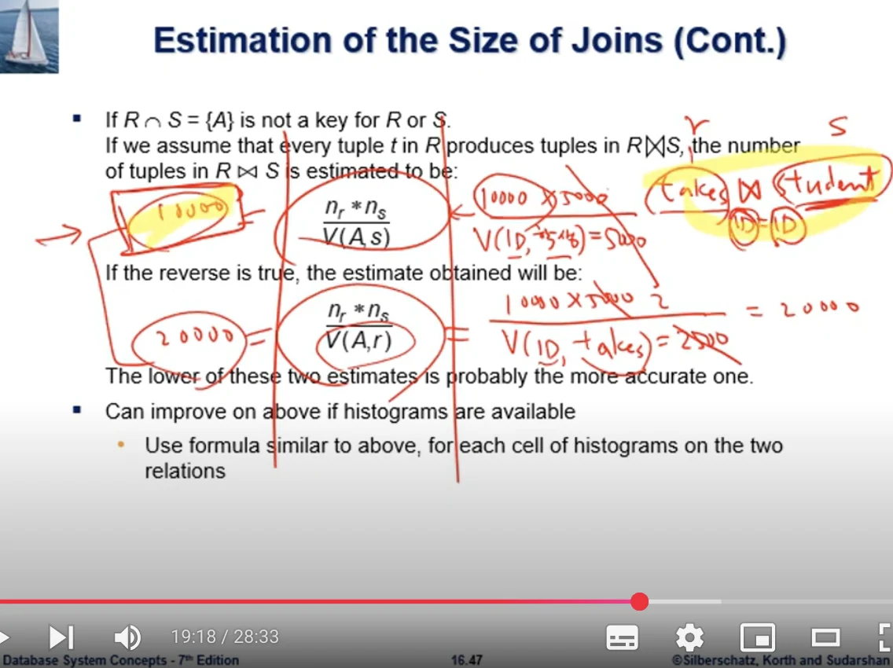

그렇지만 시험삼아 이 식으로 추정해보자.

위의 식의 분모는 pk이므로 분모가 5000이 된다. 결과는 10000

아래식은 수강테이블의 서로다른값은 2500이라고 했었다. 추정결과는 20000

둘중 낮은값은 10000이다. 이것은 실제 우리가 아는 조인결과값과 일치한다.

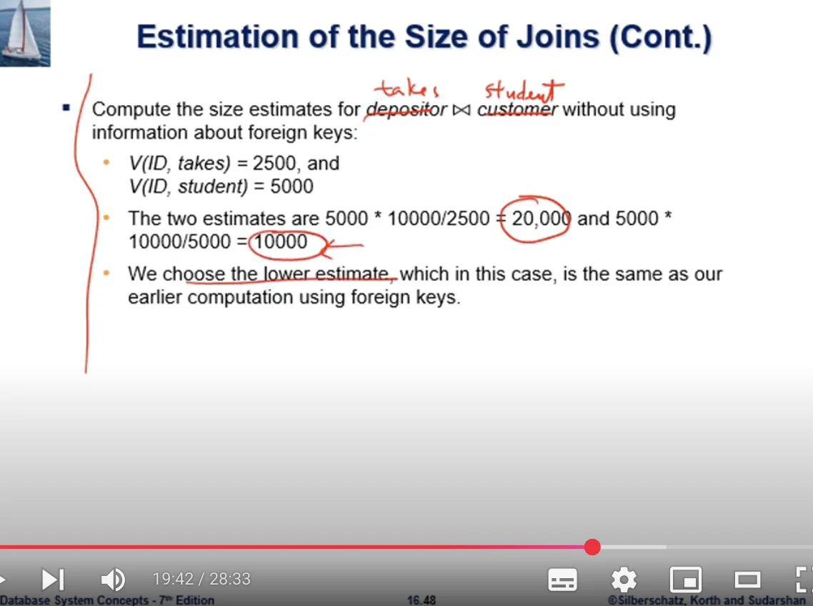

이 슬라이드가 그 설명을 보여주는데 내용에 오타가 있다. 수강과 학생의 조인이고, 결과는 낮은 숫자인 10000

### 연습문제

A=A 조건으로 조인하는데 양쪽 다 pk가 아니다. 조인결과 레코드수를 추정하는 연습문제

교재 16장 practice ex 16.6

답은 교재 홈페이지에

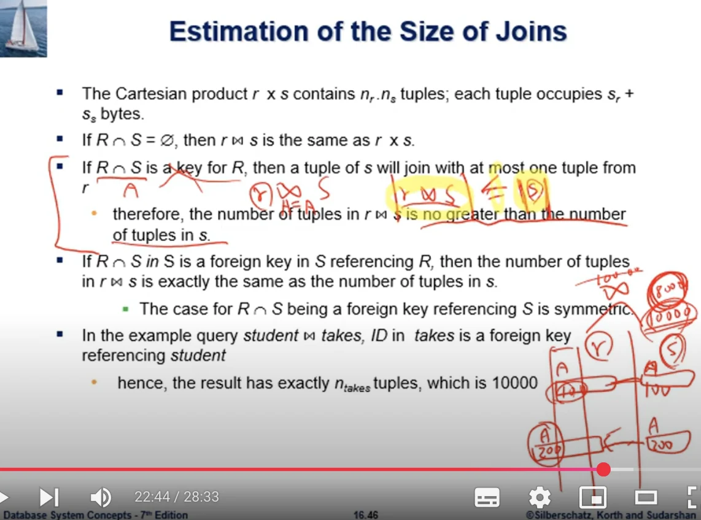

다른형태 조인을 보면. A=A로 조인하는데 공통컬럼 A가 r 테이블의 key(고유식별자) 이다. 이 식의 레코드수는 s 테이블의 no grater than the number of tuples in s

s테이블의 레코드가 있을때 A=100이다, 조인짝이 있다면 r에서 A=100, 그런데 r테이블에서 A=100인건 한개뿐이다 pk이니까.

레코드가 s테이블에 있다고 할때, r쪽에 조인짝이 있다고 하면 많아야 1개 나온다. pk이므로. s테이블의 레코드가 10000개가 있다면 조인결과는 10000개를 넘어갈수가 없다. s테이블에 10000개 각각이 다 조인짝이 있을때 10000개가 되는것. 10000개 중에서 8000개만 조인짝이 있다고 하면 조인결과는 8000이 된다.

- abs(r join s) <= abs(s)

### 연습문제

이 경우에 해당하는(A=A조인인데 A가 r테이블애서 pk일때 조인결과를 추정하는 연습문제)

교재 16장 practice ex 16.5 답은 교재홈페이지에

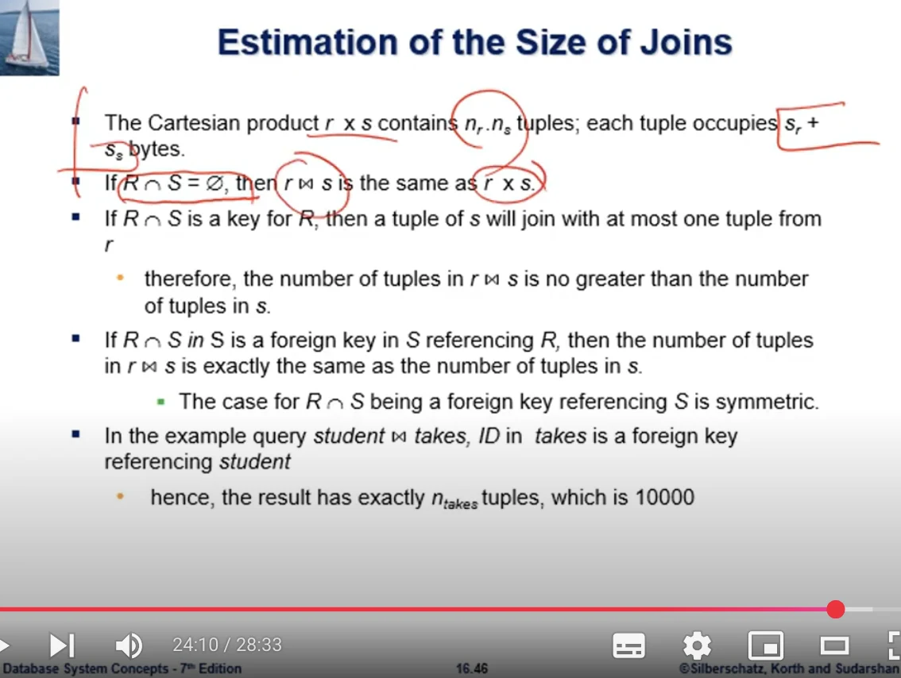

카테시안곱을 하게되면, 조건없이 레코드짝을 다 짓게 된다. n_r \* n_s개의 레코드짝이 나오게되고, 각 레코드의 크기는 두 레코드 바이트수 합친게 된다.

그다음 특이한 형태로, r s에 공통되는 칼럼이 없을때 자연조인 하라는것은 카테시안 곱하는것과 같다. 특수한 경우이다.

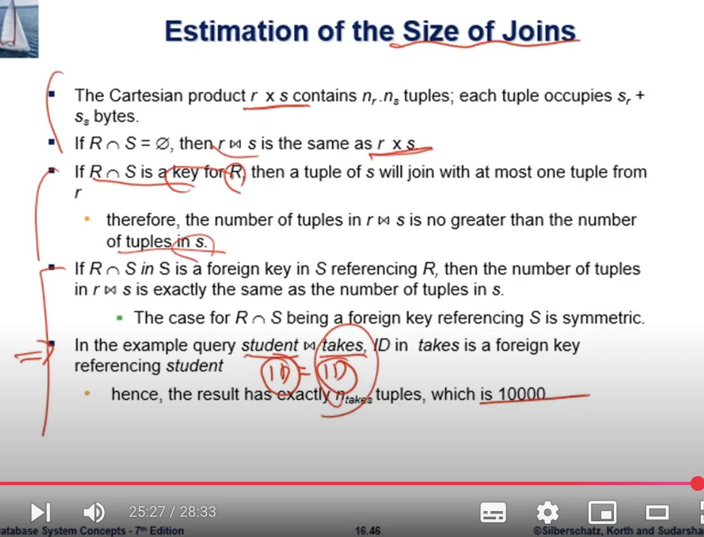

조인했을때 결과 레코드수 추정 방법을 정리하면

- 카테시안곱인 케이스
- 조인 칼럼이 한 테이블의 PK, 외래키 관계는 아님. 이때는 조인결과의 상한선으로 반대편 테이블의 레코드수를 넘지 못한다는걸 알수 있었다
- 한쪽이 외래키, 한쪽이 참조당하는 pk, 가장 전형적인 패턴의 조인. 외래키가 있는 쪽 레코드수가 조인 결과 수가 된다.

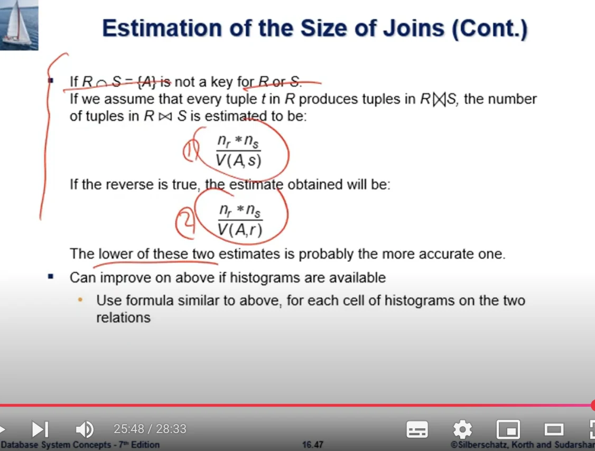

- 빈도는 낮지만 가장 일반적인 형태는 조인칼럼이 두테이블 다 pk가 아닌 경우. 두 가정으로 추정하고 낮은값을 택해서 결과크기 추정한다.

### 연습문제

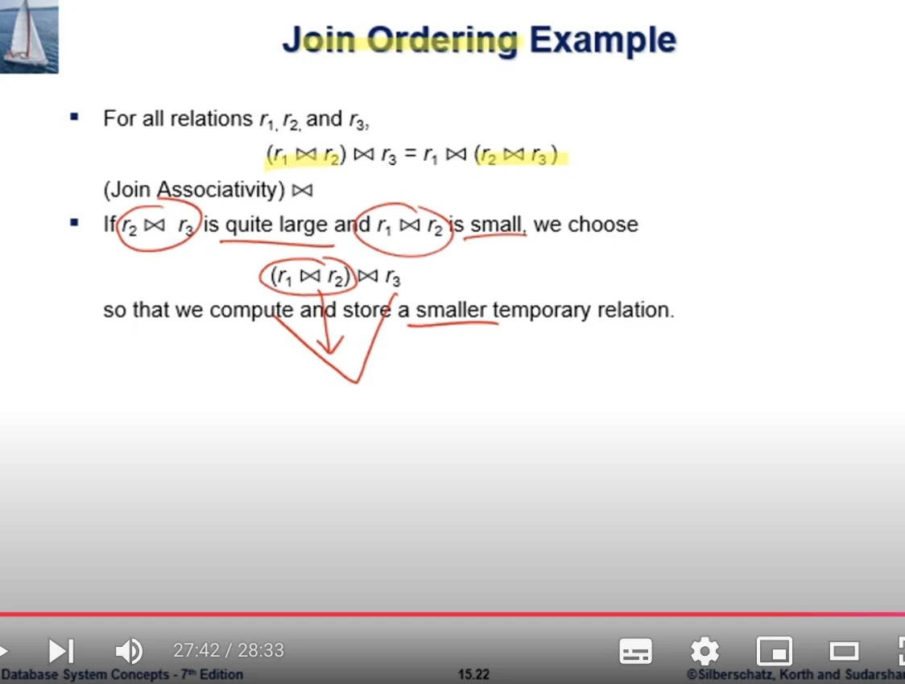

조인의 패턴별로 결과 레코드를 추정하는걸 공부했다. 앞선 수업에서 조인 ordering 문제를 다룬적이 있다. 15장에서, 어느 순서가 좋은가 최적화 문제였다.

조인순서 최적화의 조인결과크기 추정방법을 적용해볼수 있다.

2,3이 조인결과 크기가 크고, 1,2가 작다면 1,2를 택해서 중간결과 크기를 작게 하고 최종 조인 부담을 줄일 수 있다.

조인순서 최적화할때, 두 케이스의 크기를 추정해보고 차이가 크게 난다면 효율적인 조인순서 결정이 가능해진다.

조인결과 크기 추정을 통해서 조인순서를 결정하는 연습문제

교재 16장 practice ex16.6 앞에서 조인 결과크기 추정의 연습문제로도 이 문제를 했었는데 조인 순서 관련해서도 질문하고 있는 문제다.

## 11주차3rd ch17

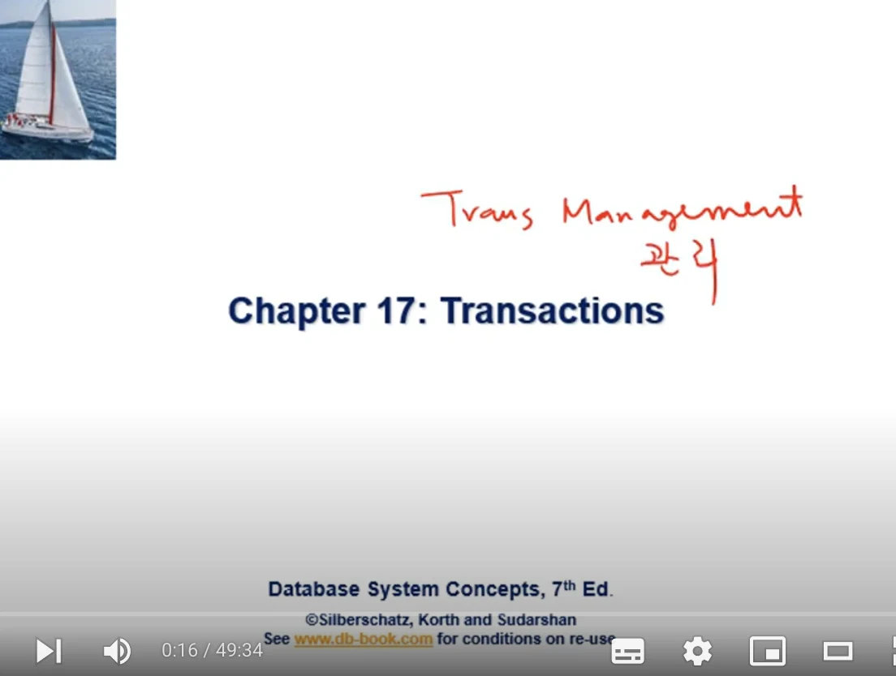


### 연습문제


