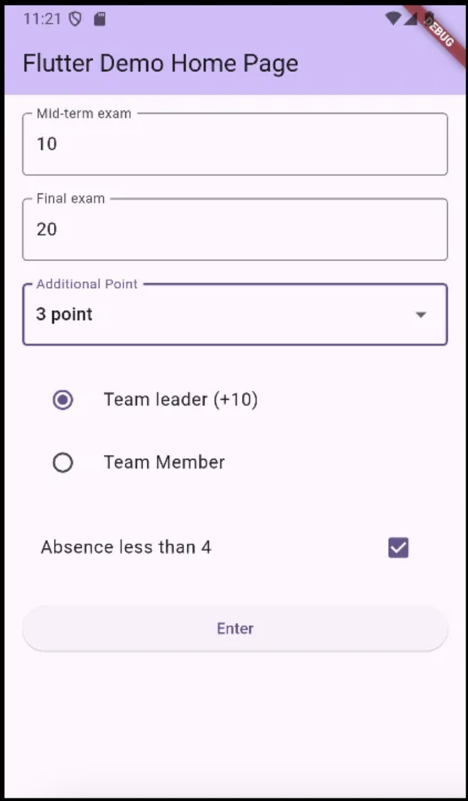
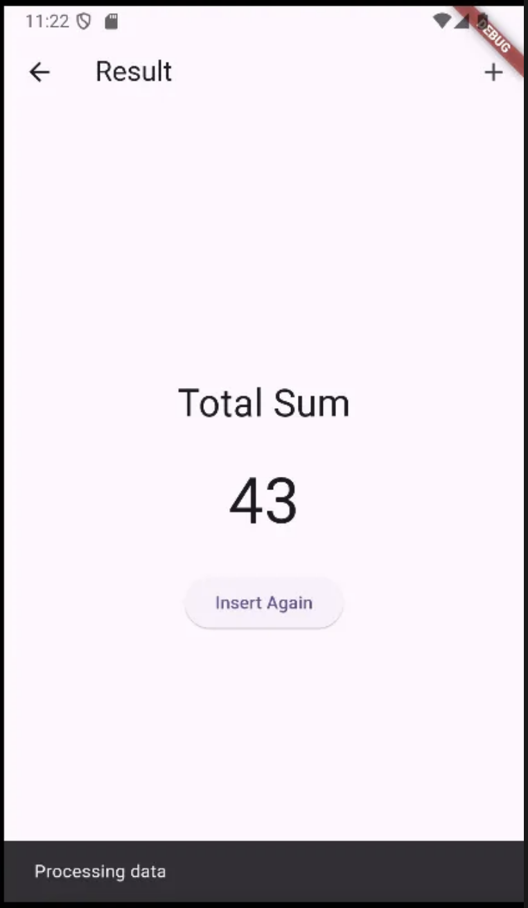
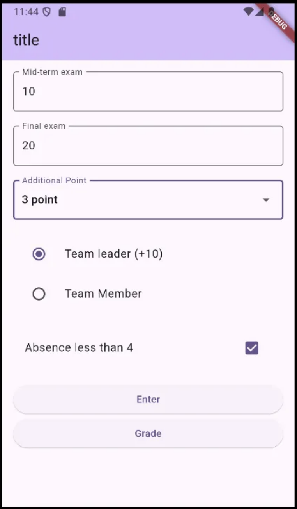
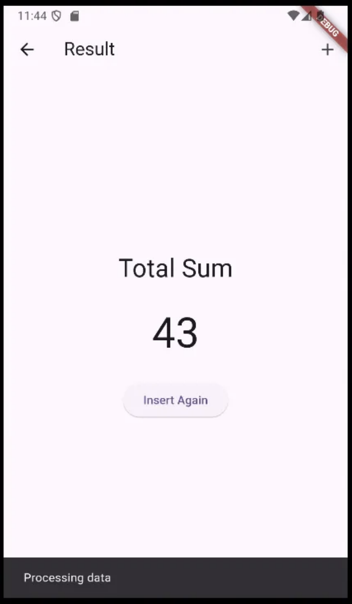
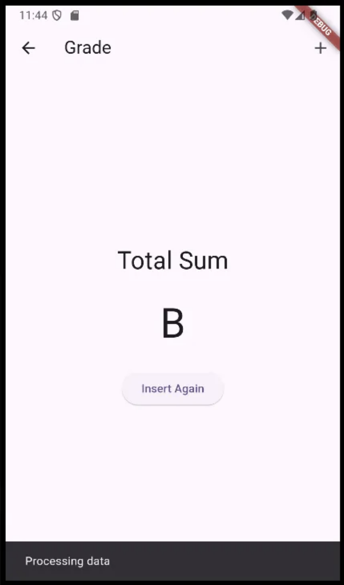

```dart
import 'package:flutter/material.dart';

void main() {
  runApp(const MyApp());
}

class MyApp extends StatelessWidget {
  const MyApp({super.key});

  // This widget is the root of your application.
  @override
  Widget build(BuildContext context) {
    return MaterialApp(
      title: 'Flutter Demo',
      theme: ThemeData(
        colorScheme: ColorScheme.fromSeed(seedColor: Colors.deepPurple),
        useMaterial3: true,
      ),
      home: const MyHomePage(title: 'Flutter Demo Home Page'),
    );
  }
}

class MyHomePage extends StatefulWidget {
  const MyHomePage({super.key, required this.title});
  final String title;

  @override
  State<MyHomePage> createState() => _MyHomePageState();
}

class _MyHomePageState extends State<MyHomePage> {

  @override
  Widget build(BuildContext context) {
    return Scaffold(
      appBar: AppBar(
        backgroundColor: Theme.of(context).colorScheme.inversePrimary,
        title: Text(widget.title),
      ),
      body: const MyForm(),
    );
  }
}

class MyForm extends StatefulWidget {
  const MyForm({super.key});

  @override
  State<MyForm> createState() => _MyFormState();
}

class _MyFormState extends State<MyForm> {
  StudentResult studentResult = StudentResult(0, 0, 0, -1, true);
  final _formKey = GlobalKey<FormState>();
  // form 위젯, 그 아래 여러 input 들의 validation이 가능하게 하고
  // FormField에는 반드시 GlobalKey가 필요하다
  @override
  Widget build(BuildContext context) {
    return Padding(
      padding: const EdgeInsets.all(16.0),
      child: Form(
        key: _formKey,
        child: ListView(
          children: [
            TextFormField(
              decoration: const InputDecoration(
                  border: OutlineInputBorder(),
                  labelText: 'Mid-term exam'
              ),
              validator: (value) { // 지금 넣은 텍스트가 어떤 조건을 만족하는지
                if (value == null || value.isEmpty) { // 비어있다
                  return 'Insert some texts';
                } else if (int.tryParse(value)==null) { // int로 parsing 안됨
                  return 'Insert some integer';
                }
                return null;
              },
              onSaved: (value) {
                studentResult.midTermExam = int.parse(value!);
              },
            ),
            const SizedBox(
              height: 20,
            ),
            TextFormField(
              decoration: const InputDecoration(
                  border: OutlineInputBorder(),
                  labelText: 'Final exam'
              ),
              validator: (value) {
                if (value == null || value.isEmpty) {
                  return 'Insert some texts';
                } else if (int.tryParse(value)==null) {
                  return 'Insert some integer';
                }
                return null;
              },
              onSaved: (value) {
                studentResult.finalTermExam = int.parse(value!);
              },
            ),
            const SizedBox(
              height: 20,
            ),
            DropdownButtonFormField(
              decoration: const InputDecoration(
                border: OutlineInputBorder(),
                labelText: 'Additional Point',
              ),
              value: studentResult.additionalPoint,
              items: List.generate(11, (i){
                if (i==0){
                  return const DropdownMenuItem(
                    value: -1,
                    child: const Text('Choose the additional Point'),
                  );
                }
                return DropdownMenuItem(
                  value: i - 1,
                  child: Text('${i - 1} point'),
                );
              }),
              onChanged: (value) {
                setState(() {
                  studentResult.additionalPoint = value!;
                });
              },
              validator: (value) {
                if (value == -1) { // 선택하지 않은 상태라면...
                  return 'Please select the point';
                }
                return null;
              },
            ),
            const SizedBox(
              height: 20,
            ),
            Column(
              children: [
                RadioListTile(
                  title: const Text('Team leader (+10)'),
                  value: 10,
                  groupValue: studentResult.teamLeaderPoint,
                  onChanged: (value) {
                    setState(() {
                      studentResult.teamLeaderPoint = value!;
                    });
                  },
                ),
                RadioListTile(
                  title: const Text('Team Member'),
                  value: 0,
                  groupValue: studentResult.teamLeaderPoint,
                  onChanged: (value) {
                    setState(() {
                      studentResult.teamLeaderPoint = value!;
                    });
                  },
                ),
                const SizedBox(
                  height: 20,
                ),
                CheckboxListTile(
                  title: const Text('Absence less than 4'),
                  value: studentResult.attendance,
                  onChanged: (value) {
                    setState(() {
                      studentResult.attendance = value!;
                    });
                  },
                )
              ],
            ),
            const SizedBox(
              height: 20,
            ),
            ElevatedButton(
              child: const Text('Enter'),
              onPressed: () {
                setState(() {
                  if (_formKey.currentState!.validate()) {
                    ScaffoldMessenger.of(context).showSnackBar(const SnackBar(
                      content: Text('Processing data'),
                    ));
                    _formKey.currentState!.save();
                    studentResult.computeSum();
                    Navigator.push(context, MaterialPageRoute(
                      // 자료구조 형태가 스택 형태로 되어 있다.
                      // 어떤 페이지를 푸쉬하면 그 페이지가 원래 있던 페이지에 덮어씌우는
                      // 뒤로가기 버튼을 누르면 pop이 되는
                        builder: (context) => ResultPage(result: studentResult)
                    )
                    );
                    print(studentResult);
                  }
                });
              },
            )
          ],
        ),
      ),
    );
  }
}

class ResultPage extends StatelessWidget {
  const ResultPage({super.key, this.result});
  final StudentResult? result;

  @override
  Widget build(BuildContext context) {
    return Scaffold(
      appBar: AppBar(
        title: const Text('Result'),
        actions: [
          IconButton(
            icon: const Icon(Icons.add),
            onPressed: (){},
          ),
        ],
      ),
      body: Center(
        child: Column(
          mainAxisAlignment: MainAxisAlignment.center,
          children: [
            const Text('Total Sum', style: TextStyle(
              fontSize: 30,
              ),
            ),
            const SizedBox(
              height: 20,
            ),
            Text('${result?.totalPoint}',style: TextStyle(
              fontSize: 50,
              ),
            ),
            const SizedBox(
              height: 20,
            ),
            ElevatedButton(
              child: const Text('Insert Again'),
              onPressed: (){
                Navigator.pop(context);
                } ,
            ),
          ],
        ),
      ),
    );
  }
}

class StudentResult {
  int midTermExam;
  int finalTermExam;
  int teamLeaderPoint;
  int additionalPoint;
  bool attendance;
  int? totalPoint;

  StudentResult (
      this.midTermExam,
      this.finalTermExam,
      this.teamLeaderPoint,
      this.additionalPoint,
      this.attendance
      );

  computeSum() {
    if (additionalPoint != -1) {
      totalPoint = midTermExam + finalTermExam + teamLeaderPoint + additionalPoint;
      if (!attendance) {
        totalPoint = 0;
      }
    }
  }

  @override
  String toString() {
    return '('
        '$midTermExam, '
        '$finalTermExam, '
        '$teamLeaderPoint, '
        '$additionalPoint, '
        '$attendance)';
  }
}
```



```dart
import 'package:flutter/material.dart';

void main() {
  runApp(const MyApp());
}

class MyApp extends StatelessWidget {
  const MyApp({super.key});

  // This widget is the root of your application.
  @override
  Widget build(BuildContext context) {
    return MaterialApp(
      title: 'Flutter Demo',
      theme: ThemeData(
        colorScheme: ColorScheme.fromSeed(seedColor: Colors.deepPurple),
        useMaterial3: true,
      ),
      initialRoute: '/',
      routes: {
        '/' : (context) => const MyHomePage(),
        '/result' : (context) => const ResultPage(),
        '/grade' : (context) => const GradePage(),
      },
      //home: const MyHomePage(title: 'Flutter Demo Home Page'),
    );
  }
}

class MyHomePage extends StatefulWidget {
  const MyHomePage({super.key});
  //final String title;

  @override
  State<MyHomePage> createState() => _MyHomePageState();
}

class _MyHomePageState extends State<MyHomePage> {

  @override
  Widget build(BuildContext context) {
    return Scaffold(
      appBar: AppBar(
        backgroundColor: Theme.of(context).colorScheme.inversePrimary,
        title: Text('title'),
      ),
      body: const MyForm(),
    );
  }
}

class MyForm extends StatefulWidget {
  const MyForm({super.key});

  @override
  State<MyForm> createState() => _MyFormState();
}

class _MyFormState extends State<MyForm> {
  StudentResult studentResult = StudentResult(0, 0, 0, -1, true);
  String grade = '';

  final _formKey = GlobalKey<FormState>();
  // form 위젯, 그 아래 여러 input 들의 validation이 가능하게 하고
  // FormField에는 반드시 GlobalKey가 필요하다
  @override
  Widget build(BuildContext context) {
    return Padding(
      padding: const EdgeInsets.all(16.0),
      child: Form(
        key: _formKey,
        child: ListView(
          children: [
            TextFormField(
              decoration: const InputDecoration(
                  border: OutlineInputBorder(),
                  labelText: 'Mid-term exam'
              ),
              validator: (value) { // 지금 넣은 텍스트가 어떤 조건을 만족하는지
                if (value == null || value.isEmpty) { // 비어있다
                  return 'Insert some texts';
                } else if (int.tryParse(value)==null) { // int로 parsing 안됨
                  return 'Insert some integer';
                }
                return null;
              },
              onSaved: (value) {
                studentResult.midTermExam = int.parse(value!);
              },
            ),
            const SizedBox(
              height: 20,
            ),
            TextFormField(
              decoration: const InputDecoration(
                  border: OutlineInputBorder(),
                  labelText: 'Final exam'
              ),
              validator: (value) {
                if (value == null || value.isEmpty) {
                  return 'Insert some texts';
                } else if (int.tryParse(value)==null) {
                  return 'Insert some integer';
                }
                return null;
              },
              onSaved: (value) {
                studentResult.finalTermExam = int.parse(value!);
              },
            ),
            const SizedBox(
              height: 20,
            ),
            DropdownButtonFormField(
              decoration: const InputDecoration(
                border: OutlineInputBorder(),
                labelText: 'Additional Point',
              ),
              value: studentResult.additionalPoint,
              items: List.generate(11, (i){
                if (i==0){
                  return const DropdownMenuItem(
                    value: -1,
                    child: const Text('Choose the additional Point'),
                  );
                }
                return DropdownMenuItem(
                  value: i - 1,
                  child: Text('${i - 1} point'),
                );
              }),
              onChanged: (value) {
                setState(() {
                  studentResult.additionalPoint = value!;
                });
              },
              validator: (value) {
                if (value == -1) { // 선택하지 않은 상태라면...
                  return 'Please select the point';
                }
                return null;
              },
            ),
            const SizedBox(
              height: 20,
            ),
            Column(
              children: [
                RadioListTile(
                  title: const Text('Team leader (+10)'),
                  value: 10,
                  groupValue: studentResult.teamLeaderPoint,
                  onChanged: (value) {
                    setState(() {
                      studentResult.teamLeaderPoint = value!;
                    });
                  },
                ),
                RadioListTile(
                  title: const Text('Team Member'),
                  value: 0,
                  groupValue: studentResult.teamLeaderPoint,
                  onChanged: (value) {
                    setState(() {
                      studentResult.teamLeaderPoint = value!;
                    });
                  },
                ),
                const SizedBox(
                  height: 20,
                ),
                CheckboxListTile(
                  title: const Text('Absence less than 4'),
                  value: studentResult.attendance,
                  onChanged: (value) {
                    setState(() {
                      studentResult.attendance = value!;
                    });
                  },
                )
              ],
            ),
            const SizedBox(
              height: 20,
            ),
            ElevatedButton(
              child: const Text('Enter'),
              onPressed: () {
                setState(() {
                  if (_formKey.currentState!.validate()) {
                    ScaffoldMessenger.of(context).showSnackBar(const SnackBar(
                      content: Text('Processing data'),
                    ));
                    _formKey.currentState!.save();
                    studentResult.computeSum();
                    Navigator.pushNamed(context, '/result',arguments: studentResult);
                    print(studentResult);
                  }
                });
              },
            ),
            ElevatedButton(
              child: const Text('Grade'),
              onPressed: () {
                setState(() {
                  if (_formKey.currentState!.validate()) {
                    ScaffoldMessenger.of(context).showSnackBar(const SnackBar(
                      content: Text('Processing data'),
                    ));
                    _formKey.currentState!.save();
                    studentResult.computeSum();
                    if (studentResult.totalPoint! >= 60) {
                      grade = 'A';
                    } else {
                      grade = 'B';
                    }
                    Navigator.pushNamed(context, '/grade',arguments: grade);
                    print(studentResult);
                  }
                });
              },
            )
          ],
        ),
      ),
    );
  }
}

class ResultPage extends StatelessWidget {
  const ResultPage({super.key});
  //final StudentResult? result;

  @override
  Widget build(BuildContext context) {
    final result = ModalRoute.of(context)?.settings.arguments as StudentResult;
    return Scaffold(
      appBar: AppBar(
        title: const Text('Result'),
        actions: [
          IconButton(
            icon: const Icon(Icons.add),
            onPressed: (){},
          ),
        ],
      ),
      body: Center(
        child: Column(
          mainAxisAlignment: MainAxisAlignment.center,
          children: [
            const Text('Total Sum', style: TextStyle(
              fontSize: 30,
              ),
            ),
            const SizedBox(
              height: 20,
            ),
            Text('${result.totalPoint}',style: TextStyle(
              fontSize: 50,
              ),
            ),
            const SizedBox(
              height: 20,
            ),
            ElevatedButton(
              child: const Text('Insert Again'),
              onPressed: (){
                Navigator.pop(context);
                } ,
            ),
          ],
        ),
      ),
    );
  }
}

class GradePage extends StatelessWidget {
  const GradePage({super.key});
  //final StudentResult? result;

  @override
  Widget build(BuildContext context) {
    final grade = ModalRoute.of(context)?.settings.arguments as String;
    return Scaffold(
      appBar: AppBar(
        title: const Text('Grade'),
        actions: [
          IconButton(
            icon: const Icon(Icons.add),
            onPressed: (){},
          ),
        ],
      ),
      body: Center(
        child: Column(
          mainAxisAlignment: MainAxisAlignment.center,
          children: [
            const Text('Total Sum', style: TextStyle(
              fontSize: 30,
            ),
            ),
            const SizedBox(
              height: 20,
            ),
            Text(grade,style: TextStyle(
              fontSize: 50,
            ),
            ),
            const SizedBox(
              height: 20,
            ),
            ElevatedButton(
              child: const Text('Insert Again'),
              onPressed: (){
                Navigator.pop(context);
              } ,
            ),
          ],
        ),
      ),
    );
  }
}

class StudentResult {
  int midTermExam;
  int finalTermExam;
  int teamLeaderPoint;
  int additionalPoint;
  bool attendance;
  int? totalPoint;

  StudentResult (
      this.midTermExam,
      this.finalTermExam,
      this.teamLeaderPoint,
      this.additionalPoint,
      this.attendance
      );

  computeSum() {
    if (additionalPoint != -1) {
      totalPoint = midTermExam + finalTermExam + teamLeaderPoint + additionalPoint;
      if (!attendance) {
        totalPoint = 0;
      }
    }
  }

  @override
  String toString() {
    return '('
        '$midTermExam, '
        '$finalTermExam, '
        '$teamLeaderPoint, '
        '$additionalPoint, '
        '$attendance)';
  }
}
```



