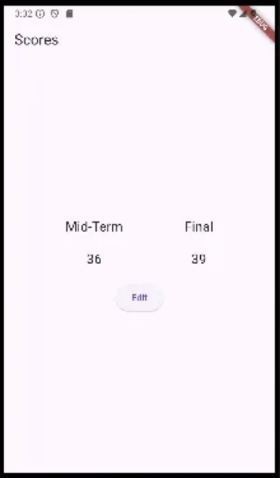
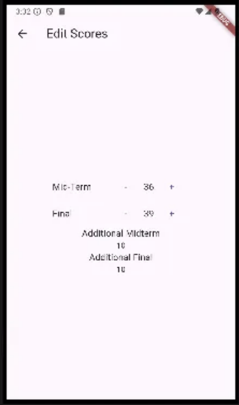

main.dart
```dart
import 'package:flutter/material.dart';
import 'package:untitled/editpage.dart';
import 'package:untitled/score.dart';
import 'package:untitled/scorepage.dart';
import 'package:provider/provider.dart';

void main() {
  runApp(const MyApp());
}

class MyApp extends StatelessWidget {
  const MyApp({super.key});

  @override
  Widget build(BuildContext context) {
    return ChangeNotifierProvider(
      create: (BuildContext context) => Scores(),
      builder: (context,child) => MaterialApp(
        title: 'My App',
        theme: ThemeData(
          primarySwatch: Colors.indigo,
        ),
        home: Scorepage(),
      ),
    );
  }
}
```

score.dart
```dart
import 'package:flutter/cupertino.dart';

class Scores with ChangeNotifier {
  int midTermExam = 30;
  int finalExam = 30;

  decreaseMidTerm() {
    midTermExam -= 1;
    notifyListeners();
  }

  increaseMidTerm() {
    midTermExam += 1;
    notifyListeners();
  }

  decreasefinalTerm() {
    finalExam -= 1;
    notifyListeners();
  }

  increasefinalTerm() {
    finalExam += 1;
    notifyListeners();
  }
}

class DetailedScores with ChangeNotifier {
  int additionalMidterm = 10;
  int additionalFinal = 10;
}
```

scorepage.dart
```dart
import 'package:flutter/material.dart';
import 'package:untitled/editpage.dart';
import 'package:provider/provider.dart';
import 'score.dart';

class Scorepage extends StatelessWidget {
  const Scorepage({super.key});

  @override
  Widget build(BuildContext context) {
    return Scaffold(
      appBar: AppBar(
        title: const Text('Scores'),
      ),
      body: Column(
        mainAxisAlignment: MainAxisAlignment.center,
        children: [
          const ScorePanel(),
          const SizedBox(
            height: 20,
          ),
          ElevatedButton(onPressed: (){
            Navigator.push(context, MaterialPageRoute(builder: (context) => const Editpage()));
          }, child: const Text('Edit'))
        ],
      ),
    );
  }
}

class ScorePanel extends StatelessWidget {
  const ScorePanel({super.key});

  @override
  Widget build(BuildContext context) {
    return Row(
      mainAxisAlignment: MainAxisAlignment.spaceEvenly,
      children: [
        Column(
          mainAxisAlignment: MainAxisAlignment.center,
          children: [
            Text('Mid-Term', style: TextStyle(fontSize: 20),),
            SizedBox(
              height: 20,
            ),
            Text(context.watch<Scores>().midTermExam.toString(), style: TextStyle(fontSize: 20),),
          ],
        ),
        Column(
          mainAxisAlignment: MainAxisAlignment.center,
          children: [
            Text('Final', style: TextStyle(fontSize: 20),),
            SizedBox(
              height: 20,
            ),
            Text(context.watch<Scores>().finalExam.toString(), style: TextStyle(fontSize: 20),),
          ],
        ),
      ],
    );
  }
}
```


editpage.dart
```dart
import 'package:flutter/material.dart';
import 'package:provider/provider.dart';
import 'score.dart';

class Editpage extends StatelessWidget {
  const Editpage({super.key});

  @override
  Widget build(BuildContext context) {
    return ChangeNotifierProvider(
      create: (BuildContext context) => DetailedScores(),
      builder: (context,child) => Scaffold(
        appBar: AppBar(
          title: const Text('Edit Scores'),
        ),
        body: Column(
          mainAxisAlignment: MainAxisAlignment.center,
          children: [
            EditPanel(),
            Text('Additional Midterm', style: TextStyle(fontSize: 16),),
            Text(context.watch<DetailedScores>().additionalMidterm.toString()),
            Text('Additional Final', style: TextStyle(fontSize: 16),),
            Text(context.watch<DetailedScores>().additionalFinal.toString()),
          ],
        ),
      ),
    );
  }
}

class EditPanel extends StatelessWidget {
  const EditPanel({super.key});

  @override
  Widget build(BuildContext context) {
    return Column(
      mainAxisAlignment: MainAxisAlignment.center,
      children: [
        Row(
          mainAxisAlignment: MainAxisAlignment.center,
          children: [
            Container(child: const Text('Mid-Term', style: TextStyle(fontSize: 16),), width: 100,),
            TextButton(onPressed: (){
              context.read<Scores>().decreaseMidTerm();
            }, child: const Text('-', style: TextStyle(fontSize: 16),)),
            Text(context.select((Scores s) => s.midTermExam).toString(), style: const TextStyle(fontSize: 16),),
            TextButton(onPressed: (){
              context.read<Scores>().increaseMidTerm();
            }, child: const Text('+', style: TextStyle(fontSize: 16),))
          ],
        ),
        Row(
          mainAxisAlignment: MainAxisAlignment.center,
          children: [
            Container(child: const Text('Final', style: TextStyle(fontSize: 16),), width: 100,),
            TextButton(onPressed: (){
              context.read<Scores>().decreasefinalTerm();
            }, child: const Text('-', style: TextStyle(fontSize: 16),)),
            Text(context.select((Scores s) => s.finalExam).toString(), style: const TextStyle(fontSize: 16),),
            TextButton(onPressed: (){
              context.read<Scores>().increasefinalTerm();
            }, child: const Text('+', style: TextStyle(fontSize: 16),))
          ],
        )
      ],
    );
  }
}
```

