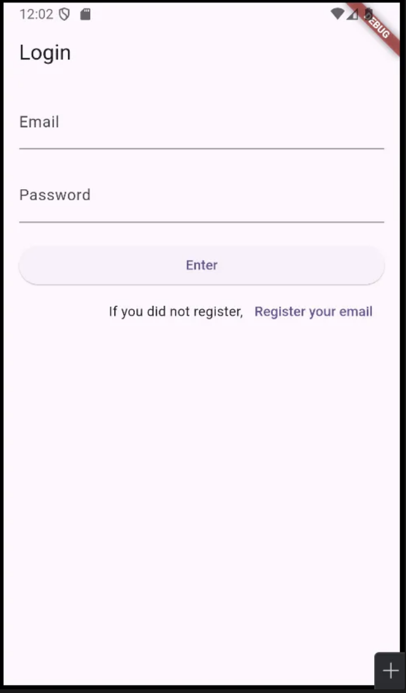
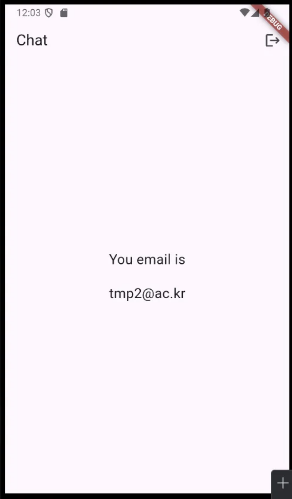
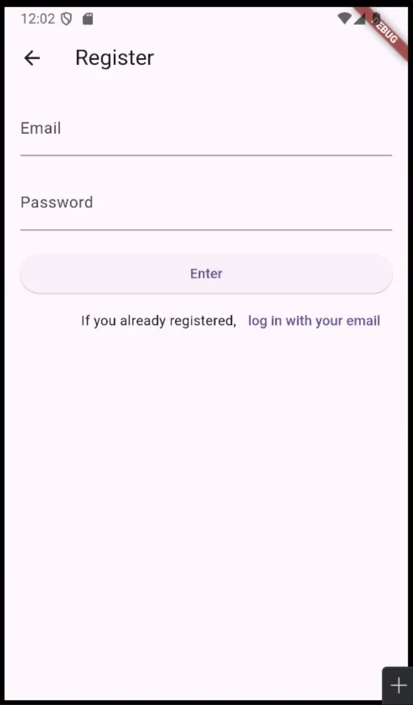
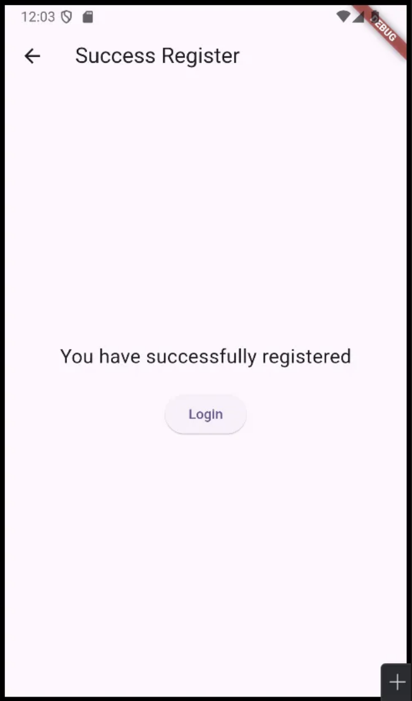

main.dart
```dart
import 'package:flutter/material.dart';
import 'package:firebase_core/firebase_core.dart';
import 'firebase_options.dart';
import 'LoginPage.dart';
import 'RegisterPage.dart';
import 'SuccessRegister.dart';
import 'ChatPage.dart';
import 'package:firebase_auth/firebase_auth.dart';

void main() async{
  WidgetsFlutterBinding.ensureInitialized();
  await Firebase.initializeApp(
    options: DefaultFirebaseOptions.currentPlatform,
  );
  runApp(const MyApp());
}

class MyApp extends StatelessWidget {
  const MyApp({super.key});

  // This widget is the root of your application.
  @override
  Widget build(BuildContext context) {
    return MaterialApp(
      title: 'Flutter Demo',
      theme: ThemeData(
        colorScheme: ColorScheme.fromSeed(seedColor: Colors.deepPurple),
        useMaterial3: true,
      ),
      // 계속 상태를 구독? 하도록 한다
      home: StreamBuilder( // 계속 상태를 들을수 있도록 하는 통로 역할
          stream: FirebaseAuth.instance.authStateChanges(), // 인증 state가 바뀌는지 stream을 통해서 듣는다
          builder: (context, snapshot) { // 변화가 일어난 시점의 snapshot을 찍는다
            if (snapshot.hasData) {
              // snapshot이 data가 있다면 로그인 된거니까 ChatPage가 홈으로
              return const ChatPage();
            } else {
              // 아니라면 로그인 페이지가 홈으로
              return Loginpage();
            }
          }
      ),
    );
  }
}
```

LoginPage.dart
```dart
import 'package:flutter/material.dart';
import 'package:untitled/ChatPage.dart';
import 'package:untitled/RegisterPage.dart';
import 'RegisterPage.dart';
import 'package:firebase_auth/firebase_auth.dart';
import 'ChatPage.dart';

class Loginpage extends StatelessWidget {
  const Loginpage({super.key});

  @override
  Widget build(BuildContext context) {
    return Scaffold(
      appBar: AppBar(
        title: const Text('Login'),
      ),
      body: const LoginForm(),
    );
  }
}

class LoginForm extends StatefulWidget {
  const LoginForm({super.key});

  @override
  State<LoginForm> createState() => _LoginFormState();
}

class _LoginFormState extends State<LoginForm> {
  final _authentication = FirebaseAuth.instance;
  final _formKey = GlobalKey<FormState>();
  String email = '';
  String password = '';
  @override
  Widget build(BuildContext context) {
    return Padding(
      padding: const EdgeInsets.all(16.0),
      child: Form(
        key: _formKey,
        child: ListView(
          children: [
            TextFormField(
              decoration: const InputDecoration(labelText: 'Email'),
              onChanged: (value) {
                email = value;
              },
            ),
            const SizedBox(
              height: 20,
            ),
            TextFormField(
              obscureText: true,
              decoration: const InputDecoration(labelText: 'Password'),
              onChanged: (value) {
                password = value;
              },
            ),
            SizedBox(
              height: 20,
            ),
            ElevatedButton(
                onPressed: () async {
                  try {
                    final currentUser =
                    await _authentication.signInWithEmailAndPassword(
                        email: email, password: password);
                    if (currentUser.user != null) {
                      _formKey.currentState!.reset();
                      // if (!mounted) return;
                      // Navigator.push(context,
                      //     MaterialPageRoute(builder: (context) => ChatPage()));
                    }
                  } catch (e){
                    print(e);
                  }
                },
                child: Text('Enter')),
            Row(
              mainAxisAlignment: MainAxisAlignment.end,
              children: [
                Text('If you did not register,'),
                TextButton(
                    onPressed: () {
                      Navigator.push(
                          context,
                          MaterialPageRoute(
                              builder: (context) => Registerpage()));
                    },
                    child: Text('Register your email'))
              ],
            )
          ],
        ),
      ),
    );
  }
}
```


ChatPage.dart
```dart
import 'dart:math';

import 'package:flutter/material.dart';
import 'package:firebase_auth/firebase_auth.dart';

class ChatPage extends StatefulWidget {
  const ChatPage({super.key});

  @override
  State<ChatPage> createState() => _ChatPageState();
}

class _ChatPageState extends State<ChatPage> {
  final _authentication = FirebaseAuth.instance;
  // 페이지가 만들어지는 시점에 loggeduser가 업데이트가 되기를 원함(한번만)
  User? loggedUser;
  @override
  void initState() {
    // TODO: implement initState
    super.initState();
    getCurrentUser();
  }

  void getCurrentUser() {
    try {
      final user = _authentication.currentUser;
      if (user != null) { // null이 아니라면 loggedUser에 user를 넣어보자
        loggedUser = user;
      }
    } catch (e) {
      print(e);
    }
  }
  @override
  Widget build(BuildContext context) {
    return Scaffold(
      appBar: AppBar(
        title: const Text('Chat'),
        actions: [
          IconButton(
              onPressed: (){
                FirebaseAuth.instance.signOut();
                //Navigator.pop(context);
              },
              icon: Icon(Icons.logout)
          )
        ],
      ),
      body: Center(
        child: Column(
          mainAxisAlignment: MainAxisAlignment.center,
          children: [
            const Text('You email is',
              style: TextStyle(
                  fontSize: 20
              ),
            ),
            const SizedBox(
              height: 20,
            ),
            Text(loggedUser!.email!,
              style: const TextStyle(
                  fontSize: 20
              ),
            )
          ],
        ),
      ),
    );
  }
}
```


RegisterPage.dart
```dart
import 'package:flutter/material.dart';
import 'package:firebase_auth/firebase_auth.dart';
import 'package:untitled/SuccessRegister.dart';

class Registerpage extends StatelessWidget {
  const Registerpage({super.key});

  @override
  Widget build(BuildContext context) {
    return Scaffold(
      appBar: AppBar(
        title: const Text('Register'),
      ),
      body: const RegisterForm(),
    );
  }
}

class RegisterForm extends StatefulWidget {
  const RegisterForm({super.key});

  @override
  State<RegisterForm> createState() => _RegisterFormState();
}

class _RegisterFormState extends State<RegisterForm> {
  final _authentication = FirebaseAuth.instance;
  final _formKey = GlobalKey<FormState>();
  String email = '';
  String password = '';
  @override
  Widget build(BuildContext context) {
    return Padding(
      padding: const EdgeInsets.all(16.0),
      child: Form(
        key: _formKey,
        child: ListView(
          children: [
            TextFormField(
              decoration: const InputDecoration(labelText: 'Email'),
              onChanged: (value) {
                email = value;
              },
            ),
            const SizedBox(
              height: 20,
            ),
            TextFormField(
              obscureText: true,
              decoration: const InputDecoration(labelText: 'Password'),
              onChanged: (value) {
                password = value;
              },
            ),
            const SizedBox(
              height: 20,
            ),
            ElevatedButton(
                onPressed: () async {
                  try {
                    final newUser =
                    await _authentication.createUserWithEmailAndPassword(
                        email: email, password: password);
                    if (newUser.user != null) {
                      _formKey.currentState!.reset();
                      // 위젯이 트리에 마운트가 되지 않으면 에러가 될수 있다 - async를 썼으므로
                      // 아직 트리에 마운트가 되지 않을수가 있겠구나 하는거...
                      // 마운트가 되지 않았으면 하기전에 리턴하라, 마운트 되었으면 무시하라
                      if (!mounted) return;
                      Navigator.push(
                          context,
                          MaterialPageRoute(
                              builder: (
                                  context) => const SuccessRegisterPage()));
                    }
                  } catch (e) { // 예외처리
                    print(e);
                  }
                },
                child: const Text('Enter')),
            Row(
              mainAxisAlignment: MainAxisAlignment.end,
              children: [
                const Text('If you already registered,'),
                TextButton(
                    onPressed: () {
                      Navigator.pop(context);
                    },
                    child: const Text('log in with your email'))
              ],
            )
          ],
        ),
      ),
    );
  }
}
```


SuccessRegister.dart
```dart
import 'package:flutter/material.dart';

class SuccessRegisterPage extends StatefulWidget {
  const SuccessRegisterPage({super.key});

  @override
  State<SuccessRegisterPage> createState() => _SuccessRegisterPageState();
}

class _SuccessRegisterPageState extends State<SuccessRegisterPage> {
  @override
  Widget build(BuildContext context) {
    return Scaffold(
      appBar: AppBar(
        title: const Text('Success Register'),
      ),
      body: Center(
        child: Column(
          mainAxisAlignment: MainAxisAlignment.center,
          children: [
            const Text('You have successfully registered', style: TextStyle(fontSize: 20),),
            const SizedBox(
              height: 20,
            ),
            ElevatedButton(
                onPressed: (){
                  Navigator.popUntil(context, (route) => route.isFirst);
                },
                child: const Text('Login')
            )
          ],
        ),
      ),
    );
  }
}
```

