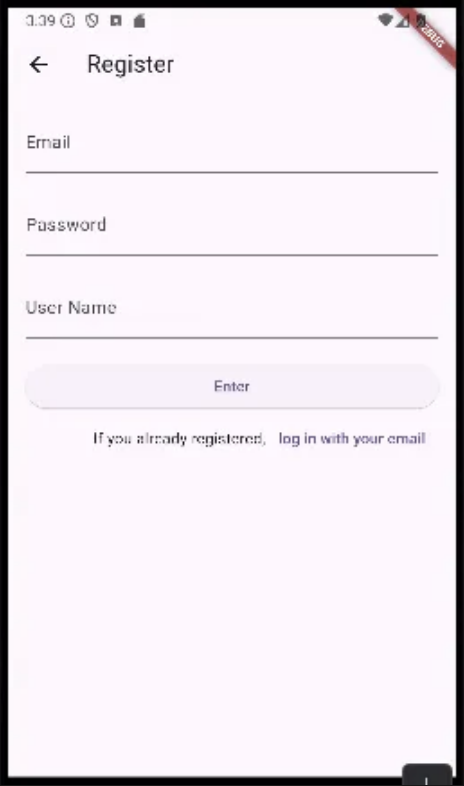
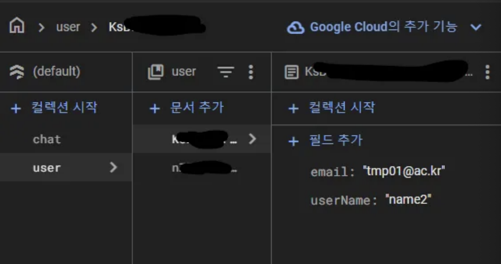
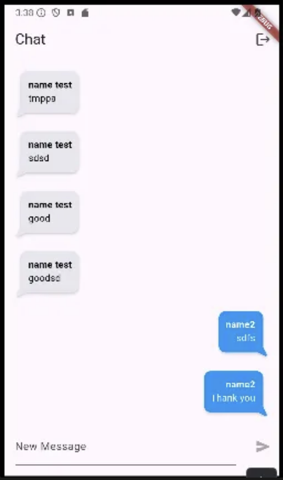
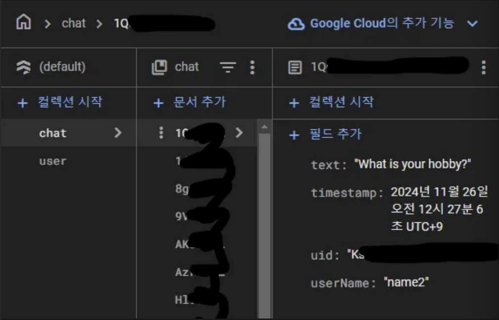

video 12에서 이어서…
https://pub.dev/
사용
https://pub.dev/packages/modal_progress_hud_nsn

## firestore database

app/bulid.gradle에서 수정
```
plugins {
    id "com.android.application"
    // START: FlutterFire Configuration
    id 'com.google.gms.google-services'
    // END: FlutterFire Configuration
    id "kotlin-android"
    // The Flutter Gradle Plugin must be applied after the Android and Kotlin Gradle plugins.
    id "dev.flutter.flutter-gradle-plugin"
}

android {
    namespace = "com.example.video11"
    compileSdkVersion 33 // 이부분 수정
    ndkVersion = flutter.ndkVersion

    compileOptions {
        sourceCompatibility = JavaVersion.VERSION_1_8
        targetCompatibility = JavaVersion.VERSION_1_8
    }

    kotlinOptions {
        jvmTarget = JavaVersion.VERSION_1_8
    }

    defaultConfig {
        // TODO: Specify your own unique Application ID (https://developer.android.com/studio/build/application-id.html).
        applicationId = "com.example.video11"
        // You can update the following values to match your application needs.
        // For more information, see: https://flutter.dev/to/review-gradle-config.
        minSdkVersion 19 // 이부분 수정
        targetSdk = flutter.targetSdkVersion
        versionCode = flutter.versionCode
        versionName = flutter.versionName
        multiDexEnabled true
    }

    buildTypes {
        release {
            // TODO: Add your own signing config for the release build.
            // Signing with the debug keys for now, so `flutter run --release` works.
            signingConfig = signingConfigs.debug
        }
    }
}

flutter {
    source = "../.."
}

dependencies { // 이부분 추가
    implementation 'com.android.support:multidex:1.0.3'
}
```
https://console.firebase.google.com/?pli=1
여기에서 데이터베이스, 테스트(아래거)로 만들고

flutter pub add cloud_firestore


RegisterPage.dart
```dart
import 'package:flutter/material.dart';
import 'package:firebase_auth/firebase_auth.dart';
import 'package:untitled/SuccessRegister.dart';
import 'package:cloud_firestore/cloud_firestore.dart';
import 'package:modal_progress_hud_nsn/modal_progress_hud_nsn.dart';

class Registerpage extends StatelessWidget {
  const Registerpage({super.key});

  @override
  Widget build(BuildContext context) {
    return Scaffold(
      appBar: AppBar(
        title: const Text('Register'),
      ),
      body: const RegisterForm(),
    );
  }
}

class RegisterForm extends StatefulWidget {
  const RegisterForm({super.key});

  @override
  State<RegisterForm> createState() => _RegisterFormState();
}

class _RegisterFormState extends State<RegisterForm> {
  bool saving = false;
  final _authentication = FirebaseAuth.instance;
  final _formKey = GlobalKey<FormState>();
  String email = '';
  String password = '';
  String userName = '';
  @override
  Widget build(BuildContext context) {
    return ModalProgressHUD(
      inAsyncCall: saving,
      child: Padding(
        padding: const EdgeInsets.all(16.0),
        child: Form(
          key: _formKey,
          child: ListView(
            children: [
              TextFormField(
                decoration: const InputDecoration(labelText: 'Email'),
                onChanged: (value) {
                  email = value;
                },
              ),
              const SizedBox(
                height: 20,
              ),
              TextFormField(
                obscureText: true,
                decoration: const InputDecoration(labelText: 'Password'),
                onChanged: (value) {
                  password = value;
                },
              ),
              const SizedBox(
                height: 20,
              ),
              TextFormField(
                decoration: const InputDecoration(labelText: 'User Name '),
                onChanged: (value) {
                  userName = value;
                },
              ),
              const SizedBox(
                height: 20,
              ),
              ElevatedButton(
                  onPressed: () async {
                    try {
                      setState(() {
                        saving = true;
                      });
                      final newUser =
                      await _authentication.createUserWithEmailAndPassword(
                          email: email, password: password);
                      FirebaseFirestore.instance.collection('user').doc(newUser.user!.uid).set({
                        'userName' : userName,
                        'email' : email,

                      });
                      if (newUser.user != null) {
                        _formKey.currentState!.reset();
                        // 위젯이 트리에 마운트가 되지 않으면 에러가 될수 있다 - async를 썼으므로
                        // 아직 트리에 마운트가 되지 않을수가 있겠구나 하는거...
                        // 마운트가 되지 않았으면 하기전에 리턴하라, 마운트 되었으면 무시하라
                        if (!mounted) return;
                        Navigator.push(
                            context,
                            MaterialPageRoute(
                                builder: (
                                    context) => const SuccessRegisterPage()));
                      }
                      setState(() {
                        saving = false;
                      });
                    } catch (e) { // 예외처리
                      print(e);
                    }
                  },
                  child: const Text('Enter')),
              Row(
                mainAxisAlignment: MainAxisAlignment.end,
                children: [
                  const Text('If you already registered,'),
                  TextButton(
                      onPressed: () {
                        Navigator.pop(context);
                      },
                      child: const Text('log in with your email'))
                ],
              )
            ],
          ),
        ),
      ),
    );
  }
}
```




https://pub.dev/packages/flutter_chat_bubble
사용
ChatPage.dart
```dart
import 'dart:math';

import 'package:cloud_firestore/cloud_firestore.dart';
import 'package:flutter/material.dart';
import 'package:firebase_auth/firebase_auth.dart';
import 'package:flutter_chat_bubble/chat_bubble.dart';

class ChatPage extends StatefulWidget {
  const ChatPage({super.key});

  @override
  State<ChatPage> createState() => _ChatPageState();
}

class _ChatPageState extends State<ChatPage> {
  final _authentication = FirebaseAuth.instance;
  // 페이지가 만들어지는 시점에 loggeduser가 업데이트가 되기를 원함(한번만)
  User? loggedUser;
  @override
  void initState() {
    // TODO: implement initState
    super.initState();
    getCurrentUser();
  }

  void getCurrentUser() {
    try {
      final user = _authentication.currentUser;
      if (user != null) {
        // null이 아니라면 loggedUser에 user를 넣어보자
        loggedUser = user;
      }
    } catch (e) {
      print(e);
    }
  }

  @override
  Widget build(BuildContext context) {
    return Scaffold(
        appBar: AppBar(
          title: const Text('Chat'),
          actions: [
            IconButton(
                onPressed: () {
                  FirebaseAuth.instance.signOut();
                  //Navigator.pop(context);
                },
                icon: Icon(Icons.logout))
          ],
        ),
        body: Column(
          children: [
            Expanded(
              child: StreamBuilder(
                //chat에 해당하는 컬렉션이 변경되는걸 주시, 시간순으로 정렬하지 않으면 id순으로 정렬되므로 시간순으로
                  stream: FirebaseFirestore.instance.collection('chat').orderBy('timestamp').snapshots(),
                  builder: (context,snapshot) {
                    //스냅샷이 받아오는걸 기다리는중이면
                    if (snapshot.connectionState == ConnectionState.waiting){
                      return const Center(child: CircularProgressIndicator());
                    }
                    final docs = snapshot.data!.docs;
                    return ListView.builder(
                        itemCount: docs.length,
                        itemBuilder: (context,index) {
                          return ChatElement(
                            isMe: docs[index]['uid'] == _authentication.currentUser!.uid,
                            userName: docs[index]['userName'],
                            text: docs[index]['text'],
                          );
                        }
                    );
                  }
              ),
            ),
            NewMessage(),
          ],
        )
    );
  }
}

class ChatElement extends StatelessWidget {
  const ChatElement({super.key, this.isMe, this.userName, this.text});

  final bool? isMe;
  final String? userName;
  final String? text;

  @override
  Widget build(BuildContext context) {
    if (isMe!) {
      return Padding(
        padding: const EdgeInsets.only(right: 16.0),
        child: ChatBubble(
          clipper: ChatBubbleClipper6(type: BubbleType.sendBubble),
          alignment: Alignment.topRight,
          margin: EdgeInsets.only(top: 20),
          backGroundColor: Colors.blue,
          child: Container(
            constraints: BoxConstraints(
              maxWidth: MediaQuery.of(context).size.width * 0.7,
            ),
            child: Column(
              crossAxisAlignment: CrossAxisAlignment.end,
              children: [
                Text(
                  userName!,
                  style: TextStyle(
                      color: Colors.white,
                      fontWeight: FontWeight.bold,
                  ),
                ),
                Text(
                  text!,
                  style: TextStyle(
                    color: Colors.white,),
                )
              ],
            ),
          ),
        ),
      );
    } else {
      return Padding(
        padding: const EdgeInsets.only(left: 16.0),
        child: ChatBubble(
          clipper: ChatBubbleClipper6(type: BubbleType.receiverBubble),
          backGroundColor: Color(0xffE7E7ED),
          margin: EdgeInsets.only(top: 20),
          child: Container(
            constraints: BoxConstraints(
              maxWidth: MediaQuery.of(context).size.width * 0.7,
            ),
            child: Column(
              crossAxisAlignment: CrossAxisAlignment.start,
              children: [
                Text(
                  userName!,
                  style: TextStyle(
                    color: Colors.black,
                    fontWeight: FontWeight.bold,
                  ),
                ),
                Text(
                  text!,
                  style: TextStyle(
                    color: Colors.black,),
                )
              ],
            ),
          ),
        ),
      );
    }
  }
}

class NewMessage extends StatefulWidget {
  const NewMessage({super.key});
  @override
  State<NewMessage> createState() => _NewMessageState();
}

class _NewMessageState extends State<NewMessage> {
  final _controller = TextEditingController();
  String newMessage = '';
  @override
  Widget build(BuildContext context) {
    return Row(
      children: [
        Expanded(
            child: Padding(
          padding: const EdgeInsets.all(16.0),
          child: TextField(
            controller: _controller,
            decoration: InputDecoration(
              labelText: 'New Message',
            ),
            onChanged: (value) {
              setState(() {
                newMessage = value;
              });
            },
          ),
        )),
        IconButton(
            color: Colors.deepPurple,
            // 입력 칸에 공백아닌 문자가 입력된 상태여야 버튼이 활성화
            onPressed: newMessage.trim().isEmpty ? null : () async {
              final currentUser = FirebaseAuth.instance.currentUser;
              final currentUserInfo = await FirebaseFirestore.instance.collection('user').doc(currentUser!.uid).get();
              FirebaseFirestore.instance.collection('chat').add({
                'text' : newMessage,
                // 현재 유저 정보를 읽고, 읽은 데이터에서 userName을 추출
                'userName' : currentUserInfo.data()!['userName'],
                'timestamp' : Timestamp.now(),
                'uid' : currentUser.uid,
              });
              _controller.clear();
            },
            icon: Icon(Icons.send))
      ],
    );
  }
}
```


