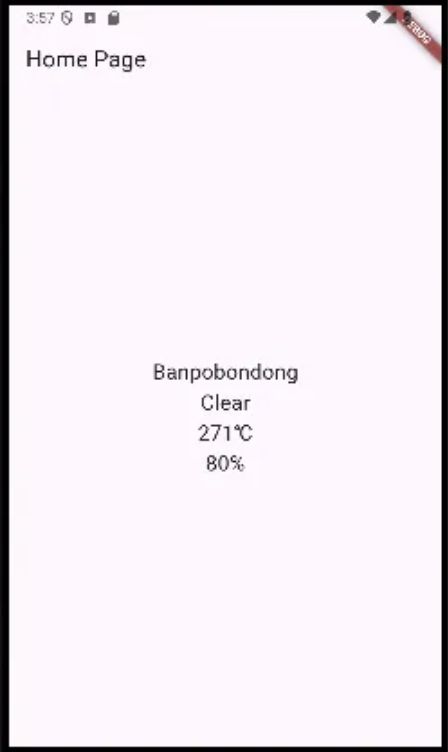

https://openweathermap.org/current

https://api.openweathermap.org/data/2.5/weather?lat=37&lon=126&appid=%7BAPI%20key%7D

https://api.openweathermap.org/data/2.5/weather?lat=37&lon=126&appid=...

섭씨온도로
https://api.openweathermap.org/data/2.5/weather?lat=37&lon=126&appid=...&units=metric

https://pub.dev/packages/geolocator
디바이스 현재위치 가져오기
https://pub.dev/packages/http

```dart
//main.dart
import 'package:flutter/material.dart';
import 'homepage.dart';

void main() {
  runApp(const MyApp());
}

class MyApp extends StatelessWidget {
  const MyApp({super.key});

  // This widget is the root of your application.
  @override
  Widget build(BuildContext context) {
    return MaterialApp(
      title: 'Flutter Demo',
      theme: ThemeData(
        colorScheme: ColorScheme.fromSeed(seedColor: Colors.deepPurple),
        useMaterial3: true,
      ),
      home: const MyHomePage(),
    );
  }
}
```

```dart
//homepage.dart
import 'package:flutter/material.dart';
import 'package:geolocator/geolocator.dart';
import 'package:http/http.dart' as http; // 기존 이름이 너무 단순해서 http로 이름지정
import 'dart:convert';
const apiKey = '';

class WeatherData {
  final String city;
  final String weatherState;
  final int temperature;
  final int humidity;

  WeatherData(
      {required this.city,
      required this.weatherState,
      required this.temperature,
      required this.humidity
      //required - 입력해야한다는 의미
      });
}

class MyHomePage extends StatefulWidget {
  const MyHomePage({super.key});

  @override
  State<MyHomePage> createState() => _MyHomePageState();
}

class _MyHomePageState extends State<MyHomePage> {
  double? lat;
  double? lon;
  Future<WeatherData>? weatherData;

  @override
  void initState() {
    super.initState();
    //initState는 내장함수, StatefulWidget가 처음 만들어질때 한번 실행

    // var position = _determinePosition();
    // // await을 안붙였으니 future객체
    // position.then((result){
    //   //position객체가 도착한 다음 행할 함수, result가지고 뭘 할지
    //   print(result.latitude);
    //   print(result.longitude);
    // });
    weatherData = _determineWeather();
  }

  Future<WeatherData> _determineWeather() async {
    Position position;
    bool serviceEnabled;
    LocationPermission permission;

    // Test if location services are enabled.
    serviceEnabled = await Geolocator.isLocationServiceEnabled();
    if (!serviceEnabled) {
      // Location services are not enabled don't continue
      // accessing the position and request users of the
      // App to enable the location services.
      return Future.error('Location services are disabled.');
    }

    permission = await Geolocator.checkPermission();
    if (permission == LocationPermission.denied) {
      permission = await Geolocator.requestPermission();
      if (permission == LocationPermission.denied) {
        // Permissions are denied, next time you could try
        // requesting permissions again (this is also where
        // Android's shouldShowRequestPermissionRationale
        // returned true. According to Android guidelines
        // your App should show an explanatory UI now.
        return Future.error('Location permissions are denied');
      }
    }

    if (permission == LocationPermission.deniedForever) {
      // Permissions are denied forever, handle appropriately.
      return Future.error(
          'Location permissions are permanently denied, we cannot request permissions.');
    }

    // When we reach here, permissions are granted and we can
    // continue accessing the position of the device.
    position = await Geolocator.getCurrentPosition();
    lat = position.latitude;
    lon = position.longitude;
    // print(lat);
    // print(lon);

    http.Response response = await http.get(Uri.parse(
        'https://api.openweathermap.org/data/2.5/weather?lat=$lat&lon=$lon&appid=$apiKey'));
    Map<String, dynamic> weatherJson = jsonDecode(response.body);
    // print(weatherJson['name']);
    return WeatherData(
        city: weatherJson['name'],
        weatherState: weatherJson['weather'][0]['main'],
        temperature: weatherJson['main']['temp'].toInt(),
        humidity: weatherJson['main']['humidity'].toInt());
  }

  @override
  Widget build(BuildContext context) {
    return Scaffold(
      appBar: AppBar(
        title: Text('Home Page'),
      ),
      body: Center(
          child: FutureBuilder(
            future: weatherData,
            builder: (context,snapshot){
              if (snapshot.hasData){
                return Column(
                  mainAxisAlignment: MainAxisAlignment.center,
                  children: [
                    Text(
                      snapshot.data!.city,
                      style: TextStyle(fontSize: 20),
                    ),
                    Text(
                      snapshot.data!.weatherState,
                      style: TextStyle(fontSize: 20),
                    ),
                    Text(
                      '${snapshot.data!.temperature}\u2103',
                      style: TextStyle(fontSize: 20),
                    ),
                    Text(
                      '${snapshot.data!.humidity}%',
                      style: TextStyle(fontSize: 20),
                    ),
                  ],
                );
              } else {
                return CircularProgressIndicator();
                // initState를 받아오지만 끝나지 않은 상태에서 buildmethod를 호출할 것이다
                // 로딩중일때 스패닝이 돌도록
              }
            },
          )),
    );
  }
}
```


