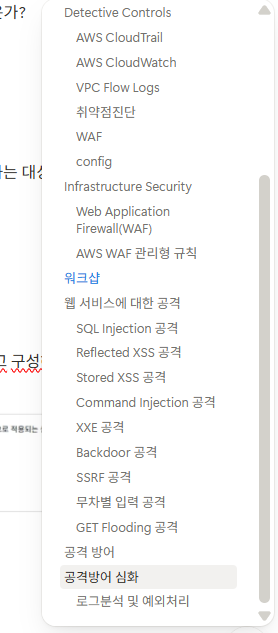

## AWS workshop 2, WAF구성 테스트

2주차 워크샵으로 AWS WAF 구성 테스트를 진행했다. 이번주는 내용을 정리하면서 진행했고, 실습환경을 구성하고 직접 공격해보고, 규칙 설정으로 방어하는 과정까지 금방 끝났다.  
쉽게 쓸수 있도록 만들어져 있어서 어렵지는 않았고 수업때 이야기하셨던게 이거였구나.. 하면서 과정을 마쳤다. 재미있게 했다... 이런것도 있었구나 그런 생각이 든다.

## 다른 수업들과 주간 정리

점점 과제가 어려워진다고 느끼고. 처음부터 c++로 과제하는게 자신이 있지는 않았기에 예상은 했었지만, 네트워크 과제는 조금 엉망으로 마무리를 했다. 수업 전날에 시간이 많이 비어있었지만 개인적인 일도 많았고... 늦은 시간에 다시 센터에 돌아와서 과제를 하고 제출은 했지만, 이제 조금씩 과제를 다 완수하기는 어렵겠구나 싶은 생각이 든다.

c++는 대학원 진학시 많이 사용하게 될 것이라고 들었기에 네트워크 과제랑 시큐어코딩 등 여러가지 다 신경쓰면서 챙기고 싶었지만... 네트워크 과제를 하면서 formatting 하는거나 pcap 사용하면서 갑갑함을 느꼈고, AI 도움 없이는 과제 진행하는게 더 어렵겠다고 느꼈다. 그냥 AI 도움받으면서 미제출 하더라도 혼자 적당히 코드짜보고, 개인 공부의 영역으로 넣어둘 생각이다. 

다른 c++ 사용하는 수업의 경우 세팅에서 조금 꼬였다. 2일 전에 시간내서 포맷을 했고, 내일 다시 과제 진행 예정이다.

맥북 화면이 13인치라서 그램을 받았을때는 정말 좋았었는데, 가끔 맥북이 그리울때가 있다. 그렇지만 c++로 코딩한다면 윈도우에서 빌드하는게 맞는것 같기도 하고...

OSSD 수업의 경우 내용도 어렵지만 잘 한다면... 조금 더 잘 하게 된다면 재미있을것 같다는 생각이 든다. 학교 컴퓨터구조 수업때는 나름 잘 했던것 같은데, 컴파일러 수업때는 상태가 안좋아서 던지고 여기와서 어셈블리를 보니까 조금 답답하기는 하다. 뭔가 놓치면 나중에 결국 이런 일이 생기는건데... 아쉽기는 하다

처음 BOB에 올때의 목적은 어쨌든 보안분야 전반에 대해 배우고 대학원 관련 준비를 하는것이었기에 c++관련 공부를 이어서 하고, 수업은 재미있게 들으며 시간을 보낼 계획이다. 수료 조건을 정확히는 모르겠지만... 외줄타기를 하다가 낭패를 볼수 있으니 과제도 최대한 해보고

욕심을 낸다면 c++는 코딩테스트 실력을 올려가며 좀 잘 써먹어보고 싶은데 stl 활용하는거랑 별개로 공부할게 더 많은것 같아서 여러가지로 계속 해볼 필요가 있을것 같고.

암호학 관련 내용과 수학 관련 내용 다시 정리하면서 수학 필요한부분의 공부를 하면 될것 같은데... 얼마나 어떤식으로 더 해야 할지...

취약점 분석 수업을 얼마전에 청강해보기도 했고, 이쪽 사람들도 분야가 여러가지로 있다고 들은것으로 기억한다. 잘하는 사람이 하는걸 보면 확실히 감각적인게 필요한것 같기도 하고 공부하고 문제도 많이 풀어보는 경험이 필요해 보인다.

뒤에서 문제 푸는걸 보면서 잘 하면 재미있겠다는 생각도 들고, 나도 해봐야겠다 이 생각으로 잠깐 시도도 해봤지만. 생각보다 다른분야 내용들이 다 깊이가 있었고, 암호학 관련 내용도 스크립트 짜서 주고받는게 좀 불편하고 이해가 안가는게 있어서 문제가 잘 풀리지는 않았다. 개인 공부를 하면서 암호학 관련 문제 푸는걸 병행할 필요는 있다는 생각은 든다.

사람에 대한 고민도 있고, 내 실력에 대한 고민도 있었지만... 뭘 한다고 미래가 보장되는것도 없고, 고민은 많다.

조금 더 실력이 쌓인다면 블로그에 이런 푸념글보다는 의미있는 글을 올리는 날이 있을지도 모르지... c++는 블로그나 코드 주석으로 정리하면서 내용숙지와 시행착오를 최대한 겪어봐야겠다.

보안 분야라는게 정확히 어느정도 범위에 있는 것인지도 잘 모르겠다. 어떤걸 하면 돈을 얼마나 벌수 있다는 그런것이 개발 분야보다 더 애매한면이 있는것 같다. 내가 수학 실력과 코딩실력, 컴퓨터공학 분야 관련 지식 모두 애매해서 지식을 받아들이는데 답답함도 있는것 같다.

남은 교육기간에는 할수있는만큼 준비를 하고, 그 뒤 프로젝트 기간부터는 이어서 할 공부를 하고 내년을 맞이하는것으로 해야겠다. 5개월정도 지나면...
