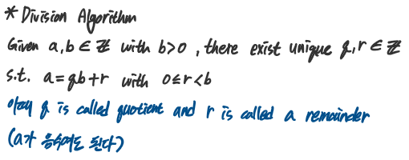
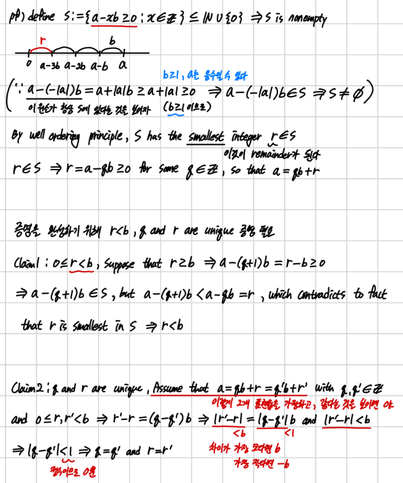
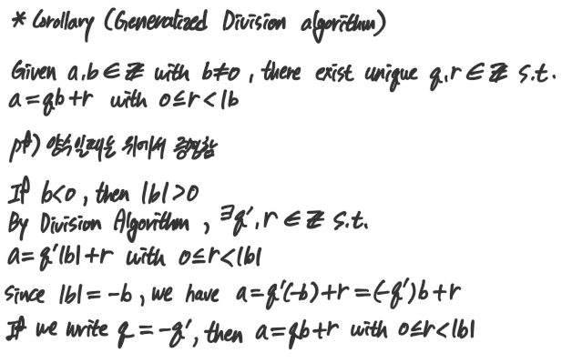
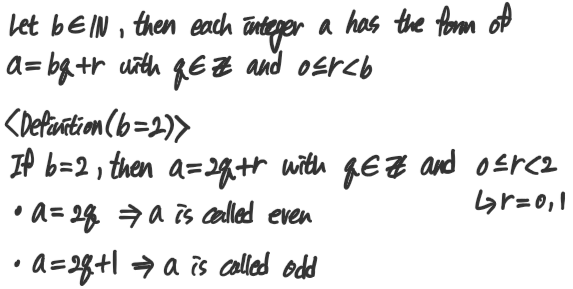
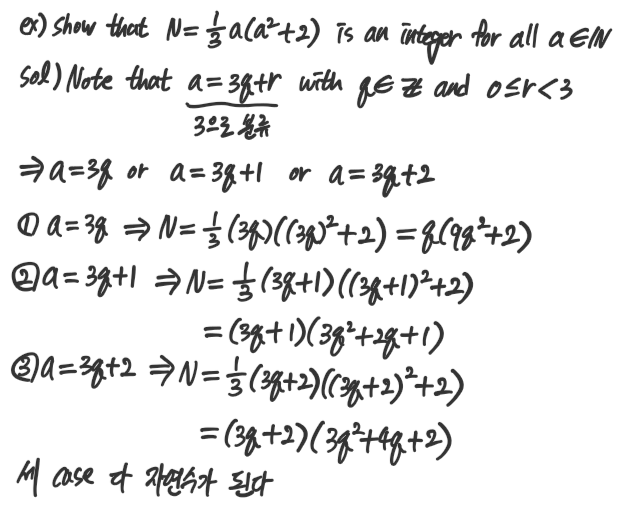

## Theorem 2.1. Division Algorithm

### pf

### Corollary

### ex
Let a=61 and b=-7  
then 61 = (-8)(-7) + 5, hence q = -8 and r = 5

### Division Algorithm 에서 나오는 even, odd number

모든 정수는 이 둘중 하나로 표현이 된다는 것

## ex

## 정리
- division algorithm
    - $\text{a = qb + r with }  0 \leq r < b $
- 증명은 자연수의 Well-Ordering principle 로부터 나온다
- division algorithm 이용해서 정수를 분류해서 풀수 있는 문제가 있었다.

## Problems 2.2
꼭 풀도록 하자...
